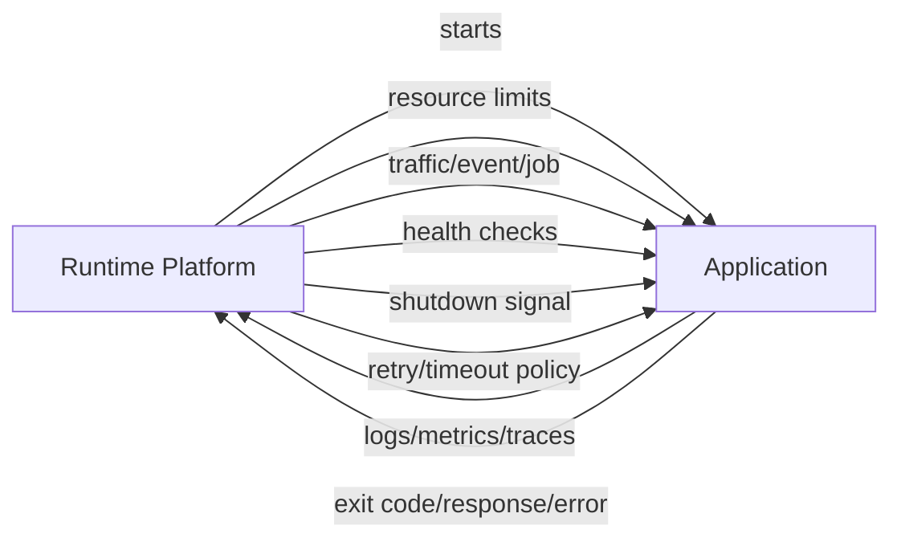
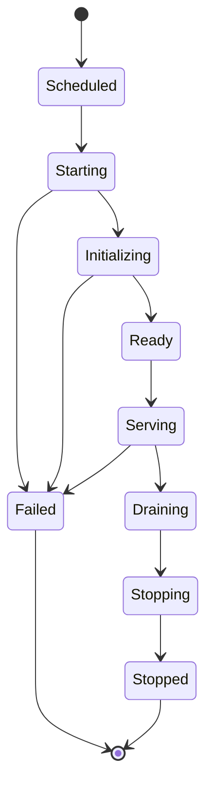
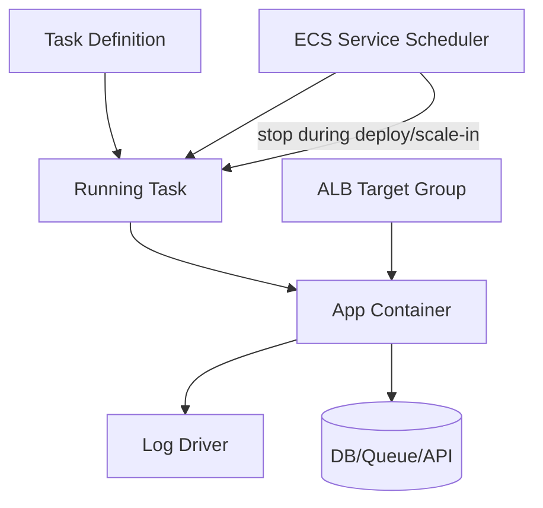
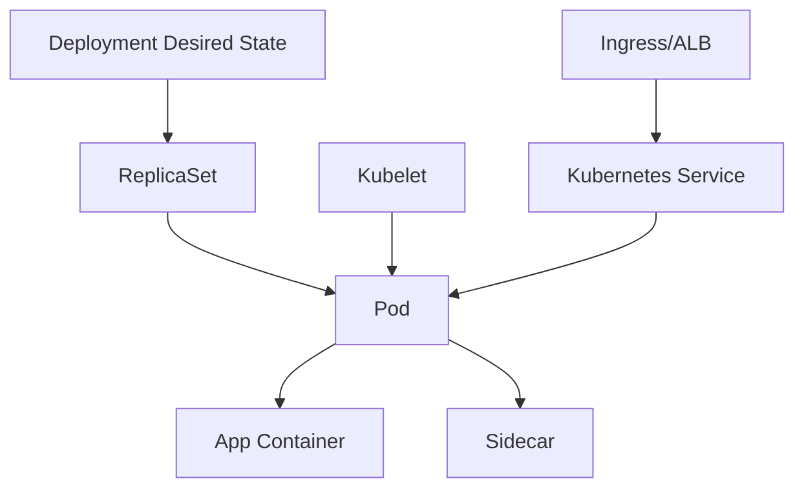
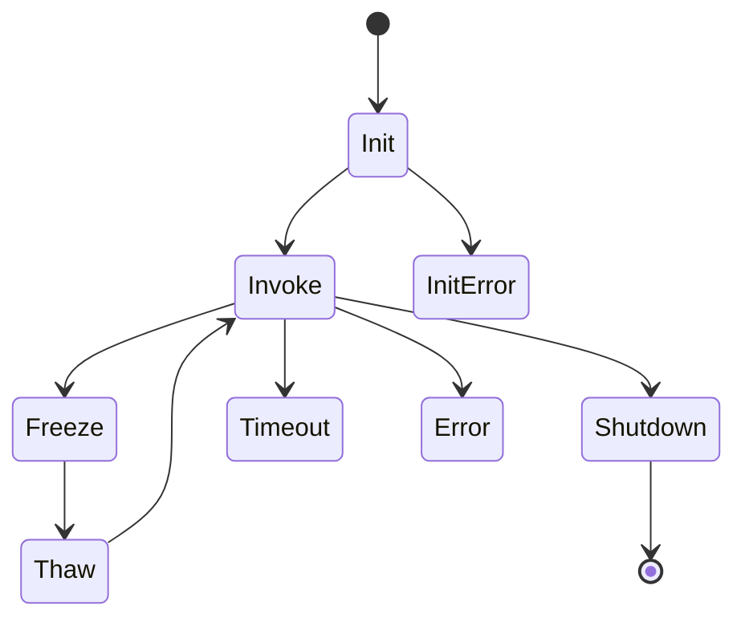
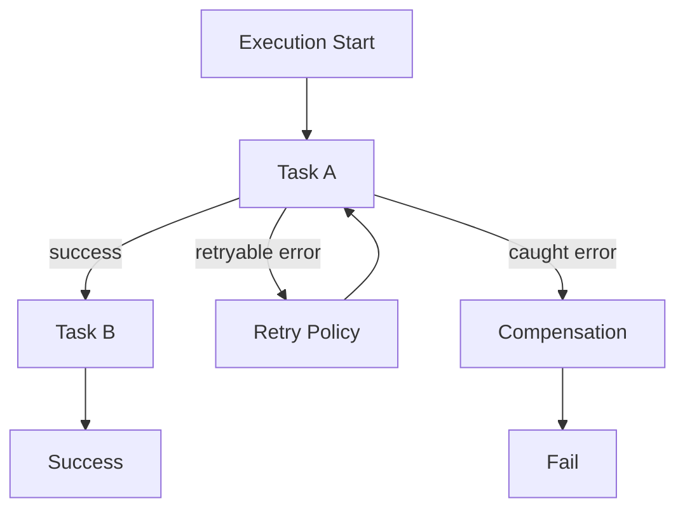
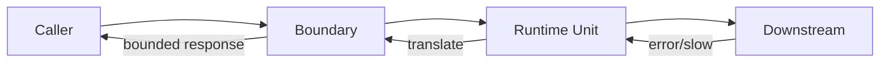
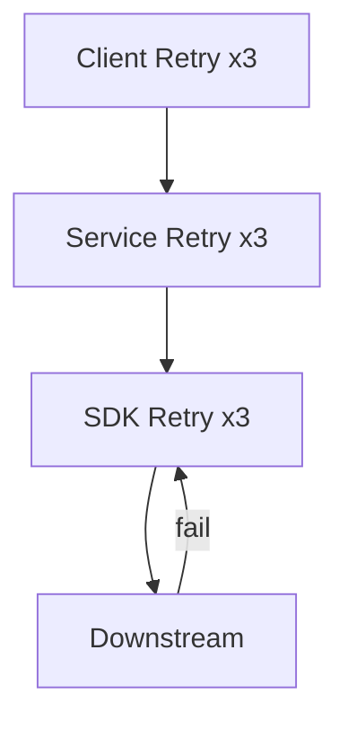
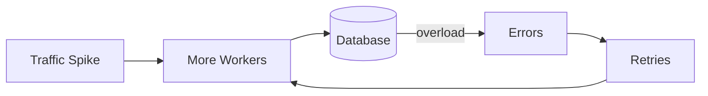
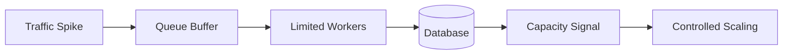

# Part 004 — Runtime Contracts and Failure Boundaries

Part sebelumnya membedakan control plane dan data plane. Sekarang kita masuk ke level yang lebih dekat dengan aplikasi: **runtime contract**.

Runtime contract adalah jawaban terhadap pertanyaan:

> “Ketika workload ini benar-benar dijalankan, lingkungan eksekusi menjanjikan apa, meminta apa dari aplikasi, dan akan melakukan apa saat terjadi gangguan?”

Ini bukan topik kosmetik. Banyak incident container/serverless terjadi bukan karena engineer tidak tahu cara membuat service, tetapi karena mereka salah memahami kontrak runtime:

- Container tidak menangani `SIGTERM`, sehingga deployment membuat request terpotong.
- Lambda handler tidak idempotent, sehingga retry menciptakan double charge.
- SQS visibility timeout lebih pendek dari processing time, sehingga message diproses paralel.
- Step Functions retry terlalu agresif, sehingga downstream outage diperparah.
- Kubernetes readiness probe terlalu dangkal, sehingga traffic masuk sebelum aplikasi siap.
- ECS health check tergantung dependency jauh, sehingga task sehat dianggap mati saat downstream lambat.

Engineer senior tidak hanya bertanya “bagaimana deploy?”. Ia bertanya “apa kontrak hidup-mati runtime ini?”.

## 1. Runtime Contract: Definisi Operasional

Runtime contract adalah perjanjian implisit/eksplisit antara platform dan aplikasi.

Platform menjanjikan:

- Cara aplikasi dimulai.
- Resource yang tersedia.
- Cara aplikasi menerima traffic/event/job.
- Cara platform memberi sinyal shutdown.
- Kapan platform menganggap aplikasi sehat.
- Bagaimana retry dilakukan.
- Bagaimana timeout ditegakkan.
- Bagaimana log/metric/traces dikumpulkan.
- Bagaimana identity diberikan.

Aplikasi wajib memenuhi:

- Start dengan deterministik.
- Expose port/handler sesuai kontrak.
- Menangani shutdown dengan aman.
- Tidak melewati resource limit.
- Menghasilkan health signal yang benar.
- Idempotent terhadap retry/duplikasi jika platform bisa mengulang work.
- Menghormati timeout/deadline.
- Mengisolasi failure dependency.



Jika kontrak ini tidak jelas, aplikasi mungkin berjalan di happy path tetapi rapuh saat deployment, scaling, outage, atau retry.

## 2. Runtime Contract per Compute Model

Setiap compute model punya kontrak berbeda.

| Compute Model | Unit Runtime | Entry Point | Stop Signal | Scaling Unit | Failure Surface |
|---|---|---|---|---|---|
| ECS/Fargate | Task/container | Container entrypoint/CMD | SIGTERM lalu kill setelah grace period | Task count | Task stop, health check, OOM, image pull, ALB target |
| ECS on EC2 | Task/container di host EC2 | Container entrypoint/CMD | SIGTERM/agent/host lifecycle | Task + EC2 capacity | Host pressure, agent issue, placement, daemon dependencies |
| EKS | Pod/container | Container command | SIGTERM + terminationGracePeriod | Pod replica + node | Probe failure, eviction, CNI, scheduling, node drain |
| Lambda | Function invocation | Handler | Runtime shutdown/freeze lifecycle | Concurrent execution | Timeout, throttling, init failure, retry, cold start |
| Step Functions | State machine execution | StartExecution / service trigger | Execution stop/fail/succeed | Execution/state transition | Task error, retry storm, stuck execution, timeout |
| EventBridge | Event delivery | PutEvents/source event | N/A per event target delivery | Event routing/delivery | Pattern mismatch, target fail, retry/DLQ |
| App Runner | Web service instance | Source/image service command | Managed service lifecycle | Instance count | Health, startup, request timeout, networking |
| Batch | Job/container | Job command | Job stop/timeout | Job attempt/array child | Retry, capacity, dependency, exit code |

Perbedaan ini menentukan desain aplikasi. Aplikasi Java HTTP service yang sangat baik di ECS belum tentu baik sebagai Lambda. Worker ECS yang aman belum tentu aman jika dipindah ke SQS-triggered Lambda karena retry dan batch semantics berubah.

## 3. Lifecycle: Lahir, Hidup, Mati

Semua runtime punya lifecycle. Bentuknya berbeda, tetapi pola umumnya sama:



Tugas engineer adalah memastikan transisi antar-state aman.

### 3.1 Startup

Startup bukan hanya “process menyala”. Startup berarti aplikasi telah mencapai kondisi minimum untuk menerima work.

Untuk HTTP service:

- Config terbaca.
- Secret tersedia.
- Database connection pool siap atau lazy strategy jelas.
- Migration compatibility terpenuhi.
- Cache warmup tidak blocking terlalu lama.
- Port listen.
- Readiness endpoint benar.

Untuk worker:

- Consumer siap membaca queue/stream.
- Idempotency store tersedia.
- Downstream client siap.
- Batch size dan concurrency benar.
- Poison message path tersedia.

Untuk Lambda:

- Static initialization tidak terlalu berat.
- Client SDK dibuat di global scope bila aman untuk reuse.
- Handler tidak bergantung pada mutable global state yang tidak dikontrol.
- Init failure terlihat jelas.

### 3.2 Serving

Saat serving, runtime contract berpusat pada bounded execution:

- Berapa request/event/job diproses paralel?
- Apa batas waktu per unit work?
- Apa yang terjadi jika dependency lambat?
- Apakah retry terjadi di caller, platform, atau aplikasi?
- Apakah side effect aman bila work diulang?

### 3.3 Draining

Draining adalah fase transisi saat aplikasi tidak boleh menerima work baru, tetapi harus menyelesaikan work yang sedang berjalan jika masih aman.

Contoh:

- ECS task deregister dari ALB target group.
- Kubernetes Pod readiness false sebelum termination.
- Worker berhenti mengambil message baru.
- HTTP server menutup listener tetapi menunggu in-flight request.

### 3.4 Shutdown

Shutdown harus eksplisit.

Aplikasi harus:

- Menerima signal.
- Stop accepting new work.
- Finish in-flight work atau fail fast dengan aman.
- Flush logs/traces/metrics.
- Close connection pool.
- Release lock/lease.
- Exit dengan code yang benar.

Aplikasi tidak boleh:

- Mengabaikan signal.
- Membuka work baru saat draining.
- Memegang message tanpa memperpanjang visibility timeout.
- Menulis side effect separuh jalan tanpa status recoverable.

## 4. Container Runtime Contract

Container terlihat seperti “process dalam image”, tetapi production contract-nya lebih kaya.

### 4.1 Entrypoint dan PID 1

Di container, proses utama sering menjadi PID 1. PID 1 punya perilaku signal handling khusus. Jika entrypoint shell script tidak meneruskan signal ke process Java/Node/Go, aplikasi tidak menerima `SIGTERM`.

Bad pattern:

```dockerfile
ENTRYPOINT ["sh", "-c", "java -jar app.jar"]
```

Lebih baik:

```dockerfile
ENTRYPOINT ["java", "-jar", "app.jar"]
```

Atau jika butuh wrapper, gunakan `exec`:

```sh
#!/usr/bin/env sh
set -e
exec java -jar app.jar
```

Kontraknya sederhana: platform memberi signal ke proses utama. Jika proses utama tidak meneruskannya, shutdown graceful gagal.

### 4.2 Exit Code

Exit code adalah bahasa antara aplikasi dan scheduler.

| Exit Code | Arti Umum | Dampak Scheduler |
|---|---|---|
| 0 | Selesai sukses | Untuk service long-running bisa dianggap stopped dan diganti |
| Non-zero | Failure | Task/pod dianggap gagal, mungkin restart |
| 137 | Killed, sering OOM/SIGKILL | Resource limit atau shutdown timeout |
| 143 | SIGTERM diterima | Normal during termination jika graceful |

Untuk long-running service, exit code 0 tidak selalu “baik”. Jika service keluar tanpa diminta, scheduler akan menggantinya. Yang penting adalah **mengapa keluar** dan apakah sesuai lifecycle.

### 4.3 Resource Limits

Container runtime memiliki CPU/memory contract.

Kesalahan umum:

- JVM melihat memory host, bukan container limit, jika konfigurasi lama/salah.
- Heap terlalu besar sehingga native memory/metaspace/thread stack tidak tersisa.
- CPU limit terlalu rendah menyebabkan GC dan startup lambat.
- Memory leak baru terlihat saat autoscaling atau traffic spike.

Untuk Java service, jangan hanya set `-Xmx` tinggi. Sisakan ruang untuk:

- Metaspace.
- Thread stacks.
- Direct buffers.
- JIT/code cache.
- Native libraries.
- TLS/network buffers.
- Observability agents.

Prinsip:

```txt
container_memory > heap + metaspace + thread_stack + direct_memory + native_overhead + safety_margin
```

### 4.4 Health Contract

Health check bukan dekorasi. Ia menentukan routing dan replacement.

Bedakan:

| Check | Pertanyaan | Contoh |
|---|---|---|
| Liveness | “Process masih hidup?” | Deadlock detection, event loop stuck |
| Readiness | “Boleh terima traffic sekarang?” | DB pool ready, migration compatible, app warmed |
| Startup | “Masih proses boot?” | Slow Java startup, cache warmup |

Health check buruk:

```txt
GET /health -> selalu 200
```

Health check lebih baik:

- `/live`: process internal masih hidup.
- `/ready`: siap menerima traffic utama.
- `/startup`: bootstrapping belum selesai.

Tetapi jangan berlebihan. Jika readiness mengecek dependency jauh terlalu agresif, transient downstream slowness bisa membuat semua instance dikeluarkan dari load balancer dan memperburuk outage.

Readiness harus merepresentasikan kemampuan melayani request, bukan menjadikan service sebagai health proxy untuk seluruh dunia.

## 5. ECS/Fargate Runtime Contract

ECS task adalah unit scheduling. Dalam satu task bisa ada satu atau lebih container.

Kontrak penting:

- Task definition menentukan image, CPU, memory, port, env, secret, IAM role, log driver.
- ECS service menjaga desired count.
- Task bisa dihentikan karena deployment, scaling in, health check gagal, OOM, capacity issue, atau user action.
- Load balancer hanya mengirim traffic ke target yang healthy.
- Fargate menghilangkan host management, tetapi tidak menghilangkan kontrak aplikasi.



### 5.1 Shutdown di ECS

Saat deployment atau scale-in, ECS menghentikan task. Aplikasi harus bisa menerima termination signal dan berhenti dengan aman.

Untuk HTTP service:

1. Task mulai draining dari load balancer.
2. Target tidak menerima request baru.
3. In-flight request diberi waktu selesai.
4. Container menerima shutdown signal.
5. App flush telemetry dan exit.

Jika deregistration delay lebih pendek dari request duration, request bisa terputus. Jika shutdown handler terlalu lama, platform bisa kill process.

### 5.2 Worker di ECS

Worker ECS biasanya membaca SQS/Kafka/Kinesis atau job table.

Runtime contract worker:

- Stop polling saat termination signal.
- Selesaikan message yang sedang diproses jika masih dalam visibility timeout.
- Perpanjang visibility timeout untuk work panjang.
- Commit offset hanya setelah side effect aman.
- Idempotent terhadap message yang diproses ulang.
- Jangan mengambil batch besar jika shutdown window kecil.

Anti-pattern:

```txt
Worker menerima SIGTERM tetapi tetap polling message baru.
```

Akibat:

- Deployment lama selesai lambat.
- Message stuck.
- Duplicate processing meningkat.
- Scale-in berbahaya.

## 6. EKS Runtime Contract

EKS mengikuti kontrak Kubernetes.

Unit runtime adalah Pod. Pod memiliki satu atau lebih container, shared network namespace, optional volumes, lifecycle hooks, probes, dan termination grace period.



### 6.1 Probe Contract

Kubernetes memakai probes untuk mengambil keputusan:

- Liveness gagal → container restart.
- Readiness gagal → Pod dikeluarkan dari Service endpoint.
- Startup probe belum sukses → liveness/readiness bisa ditunda.

Kesalahan umum:

- Liveness mengecek dependency eksternal, sehingga pod restart saat DB lambat.
- Readiness selalu 200, sehingga traffic masuk sebelum warmup selesai.
- Probe timeout terlalu pendek untuk Java under GC pressure.
- Initial delay asal-asalan, bukan berdasarkan startup distribution.

### 6.2 Termination Contract

Saat Pod dihentikan:

1. Pod diberi deletion timestamp.
2. Endpoint controller menghapus Pod dari endpoint Service.
3. Kubelet menjalankan preStop hook jika ada.
4. Container menerima SIGTERM.
5. Grace period berjalan.
6. Jika belum exit, SIGKILL.

Aplikasi harus selaras dengan `terminationGracePeriodSeconds` dan load balancer deregistration behavior.

### 6.3 Sidecar Contract

Sidecar memperumit lifecycle.

Contoh sidecar:

- Service mesh proxy.
- Log shipper.
- Secrets agent.
- Telemetry collector.

Pertanyaan penting:

- Jika app container exit, apakah sidecar ikut exit?
- Jika sidecar belum ready, apakah app boleh menerima traffic?
- Jika proxy mati, apakah app masih bisa reach downstream?
- Jika telemetry sidecar lambat, apakah shutdown tertahan?

Sidecar bukan gratis. Ia menambah dependency runtime di dalam Pod.

## 7. Lambda Runtime Contract

Lambda punya kontrak berbeda dari container service.

Unit runtime bukan process long-running yang menerima request lewat port. Unit runtime adalah **invocation** di dalam execution environment.

AWS Lambda execution environment lifecycle mencakup initialization, invocation, dan shutdown. Environment dapat digunakan ulang untuk invocation berikutnya, sehingga global state bisa bertahan, tetapi tidak boleh dianggap permanen.



### 7.1 Init Contract

Init terjadi sebelum handler memproses event.

Yang biasa dilakukan saat init:

- Load classes/modules.
- Membuat SDK clients.
- Membaca env vars.
- Membuat connection pool.
- Load config.

Yang berbahaya saat init:

- Network call lambat tanpa timeout.
- Mengambil lock global.
- Warmup data besar.
- Membaca secret berkali-kali tanpa cache.
- Inisialisasi framework terlalu berat untuk cold start budget.

Untuk Java Lambda, init sering menjadi sumber latency. SnapStart/provisioned concurrency bisa membantu pada kasus tertentu, tetapi desain dependency dan initialization tetap penting.

### 7.2 Invocation Contract

Handler menerima event dan context. Handler harus selesai sebelum timeout.

Pertanyaan wajib:

- Apakah event bisa datang dua kali?
- Apakah handler idempotent?
- Apakah downstream call punya timeout lebih pendek dari Lambda timeout?
- Apakah response error memicu retry platform?
- Apakah batch partial failure didukung?
- Apakah concurrency dibatasi agar downstream tidak hancur?

### 7.3 Global State Contract

Global state boleh menjadi cache optimisasi, bukan sumber kebenaran.

Aman:

- Reuse SDK client.
- Reuse DB connection dengan validasi.
- Cache config dengan TTL.
- Cache compiled regex/schema.

Berbahaya:

- Menyimpan progress bisnis hanya di memory.
- Menganggap cache selalu ada.
- Menganggap satu execution environment hanya memproses satu tenant sepanjang hidup.
- Menyimpan credential hasil assume role tanpa expiry handling.

### 7.4 Timeout Contract

Lambda timeout adalah batas keras untuk invocation. Jika function timeout, process bisa dihentikan tanpa aplikasi menyelesaikan cleanup normal.

Desain benar:

```txt
external_call_timeout < handler_remaining_time < lambda_timeout
```

Gunakan remaining time dari context untuk berhenti sebelum platform menghentikan paksa.

### 7.5 Concurrency Contract

Concurrency adalah jumlah execution yang berjalan paralel.

Lambda bisa scale cepat, tetapi downstream belum tentu mampu. Reserved concurrency bukan hanya performance setting; ia adalah bulkhead.

Contoh:

- Lambda membaca SQS dan menulis database.
- Traffic naik.
- Lambda scale out.
- Database connection habis.
- Invocation error.
- SQS retry.
- Backlog naik.
- Lambda makin banyak mencoba.

Solusi bukan selalu “naikkan concurrency”. Kadang perlu menurunkannya, menambah buffer, memperbaiki idempotency, dan mengatur batch/window.

## 8. Event Source Runtime Contract

Serverless sering dipicu event source. Kontraknya berbeda untuk tiap sumber.

| Source | Delivery Semantics | Failure Concern |
|---|---|---|
| API Gateway | Synchronous request/response | Timeout, mapping error, client retry |
| SQS | At-least-once queue delivery | Duplicate, visibility timeout, poison message |
| Kinesis/DynamoDB Streams | Ordered per shard/partition key | Iterator age, blocking record, batch failure |
| EventBridge | Event routing to targets | Pattern, target retry, DLQ, duplicate event |
| SNS | Fanout | Subscriber failure, retry, filtering |
| S3 event | Event notification | Duplicate/missing ordering assumptions |
| Scheduler | Time-based trigger | Missed/late execution, retry window |

### 8.1 SQS + Lambda Contract

SQS event source mapping polls queue and invokes Lambda with batches.

Important variables:

- Batch size.
- Maximum batching window.
- Visibility timeout.
- Lambda timeout.
- Partial batch response.
- DLQ/redrive policy.
- Reserved concurrency.

Invariant:

```txt
visibility_timeout > lambda_timeout + retry_safety_margin
```

Jika visibility timeout lebih pendek dari processing time, message bisa muncul lagi dan diproses paralel.

### 8.2 Stream Contract

Kinesis/DynamoDB Streams membawa ordering per shard/partition key. Satu bad record dapat menahan shard jika failure handling buruk.

Pattern:

- Partial batch response jika tersedia.
- Bisect batch on error.
- Maximum retry/record age.
- DLQ/destination untuk record gagal.
- Monitor iterator age.

### 8.3 EventBridge Target Contract

EventBridge bisa mengirim event ke banyak target. Tiap target harus dianggap consumer independen.

Konsekuensi:

- Satu event bisa memicu banyak side effect.
- Target failure tidak boleh diasumsikan menggagalkan semua target lain.
- Consumer harus idempotent.
- Event schema harus stabil.
- DLQ per target penting untuk recovery.

## 9. Step Functions Runtime Contract

Step Functions menjalankan state machine execution. Kontraknya bukan “function call biasa”, melainkan durable state transition.



### 9.1 Retry dan Catch

Step Functions menyediakan `Retry` dan `Catch`. Tanpa desain yang benar, retry bisa merusak downstream.

Retry policy harus menjawab:

- Error apa yang retryable?
- Berapa attempt?
- Berapa interval?
- Apakah exponential backoff?
- Apakah ada jitter di level lain?
- Apakah task idempotent?
- Apakah retry masih berguna setelah deadline bisnis lewat?

Catch path harus menjawab:

- Apakah perlu compensation?
- Apakah error bisa diabaikan?
- Apakah workflow harus fail?
- Apakah perlu human review?
- Apakah perlu event audit?

### 9.2 Task Timeout vs Workflow Timeout

Setiap Task bisa punya timeout. Workflow keseluruhan juga punya batas durasi sesuai jenis workflow.

Jangan membiarkan task menggantung tanpa timeout. Durable tidak berarti infinite.

### 9.3 Compensation Contract

Dalam saga, compensation bukan rollback database ajaib. Ia adalah aksi domain baru.

Contoh order workflow:

1. Reserve inventory.
2. Charge payment.
3. Create shipment.

Jika payment gagal, compensation mungkin release inventory. Tetapi jika shipment sudah dibuat, compensation berbeda.

Setiap step harus punya:

- Forward action.
- Idempotency key.
- Completion record.
- Compensation action jika diperlukan.
- Compensation idempotency.
- Audit trail.

## 10. Failure Boundary

Failure boundary adalah garis di mana failure harus ditangkap, diterjemahkan, dibatasi, atau dipropagasikan secara sengaja.

Tanpa boundary, failure bocor dan menjadi cascading failure.



Boundary bisa berupa:

- Process boundary.
- Container boundary.
- Pod boundary.
- Task boundary.
- Function invocation boundary.
- Queue boundary.
- Event bus boundary.
- Workflow state boundary.
- Database transaction boundary.
- Tenant boundary.

Setiap boundary harus punya policy.

## 11. Timeout: Batas Waktu sebagai Desain

Timeout adalah salah satu kontrak paling sering disepelekan.

Tanpa timeout, sistem tidak tahu kapan harus menyerah. Dengan timeout buruk, sistem menyerah terlalu cepat atau terlalu lambat.

### 11.1 Timeout Hierarchy

Timeout harus membentuk hierarki dari luar ke dalam.

```txt
client_timeout
  > api_gateway_or_lb_timeout
    > service_request_timeout
      > downstream_call_timeout
        > database_statement_timeout
```

Jika downstream timeout lebih panjang dari caller timeout, work tetap berjalan setelah caller menyerah. Ini membuang kapasitas dan bisa menciptakan side effect terlambat.

### 11.2 Lambda Timeout

Lambda timeout harus cukup panjang untuk work normal, tetapi cukup pendek untuk mencegah stuck execution. Downstream timeout harus lebih pendek dari sisa waktu handler.

### 11.3 Queue Visibility Timeout

Visibility timeout harus lebih panjang dari processing time normal + retry margin. Jika tidak, message muncul lagi sebelum worker selesai.

### 11.4 Step Functions Timeout

Task timeout membuat workflow tidak menggantung. Workflow timeout memastikan proses tidak hidup melebihi nilai bisnisnya.

## 12. Retry: Obat yang Bisa Menjadi Racun

Retry memperbaiki transient failure. Retry juga bisa menghancurkan sistem yang sedang overload.

Retry aman jika:

- Failure transient.
- Operation idempotent.
- Ada backoff.
- Ada max attempt.
- Ada retry budget.
- Downstream punya kapasitas pulih.

Retry buruk jika:

- Error permanent.
- Payload invalid.
- Auth denied.
- Schema incompatible.
- Downstream overload parah.
- Side effect tidak idempotent.

### 12.1 Retry Layering

Dalam cloud architecture, retry bisa terjadi di banyak layer:

- SDK client retry.
- Application retry.
- Load balancer/client retry.
- Queue redelivery.
- Lambda async retry.
- EventBridge target retry.
- Step Functions retry.
- Database driver retry.

Jika semuanya aktif tanpa koordinasi, terjadi retry amplification.



Total attempt bisa menjadi 27 untuk satu user request.

### 12.2 Retry Budget

Retry budget membatasi total effort tambahan yang boleh dipakai.

Contoh policy:

- Synchronous API: maksimal 1 retry di client, tidak ada retry panjang di server.
- Async queue: retry boleh lebih banyak, tetapi dengan DLQ dan visibility timeout benar.
- Workflow: retry eksplisit per state dengan backoff dan catch.
- Payment operation: retry hanya untuk network timeout sebelum status unknown; setelah status unknown, lakukan reconciliation.

## 13. Idempotency: Syarat Hidup di Sistem At-Least-Once

Banyak sistem AWS memiliki delivery at-least-once atau retry behavior. Artinya aplikasi harus siap menerima work yang sama lebih dari sekali.

Idempotency berarti melakukan operasi yang sama berkali-kali menghasilkan efek akhir yang sama.

### 13.1 Idempotency Key

Key harus berasal dari domain/event, bukan random per attempt.

Contoh:

| Operation | Idempotency Key |
|---|---|
| Create order | `orderId` atau client request id |
| Charge payment | `paymentAttemptId` |
| Process event | `eventId` + consumer name |
| Send notification | `notificationId` |
| Reserve inventory | `reservationId` |

### 13.2 Idempotency Store

Idempotency butuh penyimpanan.

Pattern:

- Unique constraint di database.
- DynamoDB conditional put.
- Redis SETNX dengan TTL untuk short-lived operation.
- Inbox table untuk consumed events.
- Outbox table untuk produced events.

### 13.3 Status Unknown

Kasus paling sulit adalah timeout setelah side effect mungkin terjadi.

Contoh:

- Service memanggil payment gateway.
- Gateway timeout.
- Payment mungkin berhasil atau gagal.
- Retry charge bisa double charge.

Solusi:

- Gunakan idempotency key ke payment provider.
- Simpan operation status.
- Reconcile dengan query status.
- Jangan retry blind operation yang punya side effect finansial.

## 14. Backpressure dan Concurrency Boundary

Backpressure adalah kemampuan sistem menolak, menunda, atau memperlambat work ketika kapasitas tidak cukup.

Tanpa backpressure:



Dengan backpressure:



Boundary yang bisa dipakai:

- Reserved concurrency Lambda.
- Max concurrency event source mapping.
- ECS desired/max task count.
- Kubernetes HPA max replicas.
- Worker semaphore.
- Connection pool size.
- Queue visibility/consumer count.
- Rate limit per tenant.
- Circuit breaker per downstream.

Concurrency bukan hanya throughput knob. Ia adalah reliability guardrail.

## 15. Failure Mode per Runtime

### 15.1 ECS/Fargate

| Failure | Penyebab | Mitigasi |
|---|---|---|
| Task stopped | Crash, exit, OOM, deployment | Logs, stopped reason, memory tuning, signal handling |
| Image pull gagal | ECR permission/network/tag | Execution role, VPC endpoints/NAT, immutable tag |
| Health check gagal | App not ready, wrong path | Proper readiness, startup delay, ALB config |
| Deployment stuck | New tasks unhealthy | Circuit breaker, rollback, task event inspection |
| Scale out gagal | Quota/IP/capacity | Quota alert, subnet capacity, capacity provider strategy |
| Request cut during deploy | Drain misconfigured | Deregistration delay, graceful shutdown |

### 15.2 EKS

| Failure | Penyebab | Mitigasi |
|---|---|---|
| Pending pod | No node/resource/affinity/PVC | Capacity planning, Karpenter, requests review |
| CrashLoopBackOff | App crash/config | Logs, probes, config validation |
| ImagePullBackOff | Registry/IAM/network | ECR auth, node role, VPC path |
| Readiness false | App/dependency not ready | Probe design, startup probe |
| Eviction | Node pressure | Requests/limits, node sizing, QoS |
| Webhook blocks deploy | Admission dependency down | FailurePolicy, HA webhook, break-glass |

### 15.3 Lambda

| Failure | Penyebab | Mitigasi |
|---|---|---|
| Timeout | Slow dependency, too much work | Timeout hierarchy, chunking, async workflow |
| Throttling | Concurrency limit | Reserved concurrency planning, queue buffer |
| Cold start | Runtime/package/init | Provisioned concurrency, SnapStart, dependency diet |
| Async retry storm | Target/downstream fail | DLQ, destinations, concurrency cap |
| Duplicate side effect | Retry/event duplicate | Idempotency key/store |
| Batch poison | One bad record fails batch | Partial batch response, DLQ, bisect |

### 15.4 EventBridge

| Failure | Penyebab | Mitigasi |
|---|---|---|
| Event not matched | Pattern wrong | Contract tests, sample event replay |
| Target delivery failed | Permission/throttle/error | Target DLQ, retry policy, metrics |
| Schema break | Producer changed payload | Schema versioning, compatibility tests |
| Fanout side effect inconsistent | Some targets succeed, others fail | Consumer idempotency, audit, replay strategy |

### 15.5 Step Functions

| Failure | Penyebab | Mitigasi |
|---|---|---|
| Execution failed | Uncaught task error | Catch, compensation, domain error modelling |
| Retry storm | Aggressive retry | Backoff, max attempt, downstream-aware policy |
| Execution stuck | Missing callback/wait | Timeout, heartbeat, watchdog |
| Compensation failed | Non-idempotent compensation | Compensation idempotency, manual repair path |
| Definition bug | Bad state transition | Versioning, test execution, canary workflow |

## 16. Designing Runtime Contracts: A Template

Untuk setiap workload, isi template berikut.

```txt
Workload name:
Runtime model:
Entry point:
Unit of work:
Concurrency model:
Startup requirement:
Readiness condition:
Liveness condition:
Shutdown signal:
Drain behavior:
Timeout budget:
Retry owner:
Retry max attempts:
Idempotency key:
Idempotency store:
Backpressure mechanism:
Failure boundary:
DLQ/quarantine path:
Observability signal:
Rollback behavior:
Manual recovery path:
```

Contoh untuk ECS API:

```txt
Workload name: case-api
Runtime model: ECS Fargate service behind ALB
Entry point: java -jar app.jar
Unit of work: HTTP request
Concurrency model: Tomcat/Netty worker threads + DB pool
Startup requirement: config loaded, port listening, migration compatible
Readiness condition: app ready, DB pool can acquire connection within threshold
Liveness condition: JVM responsive, event loop not deadlocked
Shutdown signal: SIGTERM
Drain behavior: stop accepting new requests, finish in-flight within 25s
Timeout budget: client 5s, ALB 6s, service 4s, DB statement 2s
Retry owner: client for safe GET only; no blind POST retry without idempotency key
Idempotency key: X-Idempotency-Key for mutating operations
Backpressure: rate limit + DB pool + ALB target scaling
Failure boundary: per request
Observability signal: RED metrics, JVM, DB pool, ALB target health
Rollback behavior: ECS deployment rollback to previous task definition
Manual recovery path: replay outbox, repair failed case transitions
```

Contoh untuk Lambda SQS worker:

```txt
Workload name: case-event-consumer
Runtime model: Lambda triggered by SQS
Entry point: handler(event, context)
Unit of work: one SQS message
Concurrency model: Lambda concurrency capped by event source/reserved concurrency
Startup requirement: SDK clients initialized, idempotency table reachable
Readiness condition: N/A per invocation, init success required
Liveness condition: invocation completes before timeout
Shutdown signal: Lambda timeout/shutdown lifecycle
Drain behavior: N/A; message success/failure controls redelivery
Timeout budget: lambda 60s, downstream 5s each, stop at remaining time <10s
Retry owner: SQS redelivery + Lambda batch failure handling
Idempotency key: eventId + consumerName
Idempotency store: DynamoDB conditional write
Backpressure: reserved concurrency 20, queue backlog alarm
Failure boundary: per message with partial batch response
DLQ/quarantine path: SQS redrive to DLQ after maxReceiveCount
Observability signal: error, duration, iterator/backlog age, DLQ depth
Rollback behavior: Lambda alias back to previous version
Manual recovery path: redrive DLQ after fix
```

## 17. Testing Runtime Contracts

Runtime contract yang tidak diuji akan gagal di production.

### 17.1 Test Startup

- Start container dengan env minimal.
- Start tanpa secret wajib dan pastikan gagal cepat.
- Start dengan dependency lambat.
- Ukur startup distribution, bukan hanya single run.

### 17.2 Test Shutdown

- Kirim SIGTERM ke process.
- Pastikan tidak menerima work baru.
- Pastikan in-flight selesai atau dibatalkan dengan status jelas.
- Pastikan exit sebelum grace period.
- Pastikan telemetry ter-flush.

### 17.3 Test Retry

- Inject network timeout.
- Inject 500 transient.
- Inject 400 permanent.
- Pastikan permanent error tidak di-retry membabi buta.
- Pastikan idempotency mencegah double side effect.

### 17.4 Test Poison Message

- Kirim payload invalid.
- Pastikan satu message tidak memblokir seluruh batch/shard selamanya.
- Pastikan DLQ punya informasi cukup untuk replay/debug.

### 17.5 Test Scaling Boundary

- Naikkan traffic/queue backlog.
- Pastikan autoscaling membaca sinyal benar.
- Pastikan downstream tidak overload.
- Pastikan scale-in tidak memotong work.

## 18. Observability untuk Runtime Contract

Setiap kontrak butuh signal.

| Contract | Signal |
|---|---|
| Startup | startup duration, init error, first readiness time |
| Readiness | ready/unready transition, target health, probe failure reason |
| Shutdown | termination count, drain duration, forced kill count |
| Timeout | timeout count, remaining time near zero, downstream latency |
| Retry | retry attempts, retry reason, retry success ratio |
| Idempotency | duplicate detected, idempotency conflict, unknown status |
| Backpressure | queue age, rejected requests, throttles, concurrency saturation |
| Memory | OOM count, heap usage, GC pause, RSS |
| Deployment | old/new version error split, rollback count |

Dashboard bagus menunjukkan lifecycle, bukan hanya CPU.

## 19. Production Review Checklist

Sebelum workload masuk production, jawab ini:

1. Apa unit of work?
2. Apa entry point?
3. Apa sinyal readiness?
4. Apa sinyal liveness?
5. Bagaimana aplikasi menerima shutdown?
6. Berapa grace period?
7. Apa yang terjadi pada in-flight work saat shutdown?
8. Apa timeout end-to-end?
9. Siapa melakukan retry?
10. Apa retry budget?
11. Apakah operasi mutasi idempotent?
12. Di mana idempotency disimpan?
13. Apa concurrency maksimal?
14. Apa downstream paling lemah?
15. Apa backpressure mechanism?
16. Apa DLQ/quarantine path?
17. Bagaimana replay dilakukan?
18. Apa metric yang membuktikan kontrak dipenuhi?
19. Apa emergency brake?
20. Apa rollback mengatasi side effect atau hanya code/config?

## 20. Common Anti-Patterns

### 20.1 “Platform Akan Mengurus Semuanya”

Fargate mengurus server. Lambda mengurus execution environment. Kubernetes mengurus scheduling. Tidak ada yang otomatis mengurus idempotency bisnis, timeout hierarchy, atau compensation logic.

### 20.2 “Health Check = Ping”

Ping hanya membuktikan process bisa menjawab ping. Production readiness butuh kontrak lebih spesifik.

### 20.3 “Retry Sampai Berhasil”

Retry tanpa batas adalah denial-of-service yang ditulis sendiri.

### 20.4 “Queue Menyelesaikan Scaling”

Queue hanya memindahkan tekanan dari synchronous ke asynchronous. Jika consumer/downstream tidak punya kapasitas, backlog tetap tumbuh.

### 20.5 “Rollback Menyelesaikan Semua”

Rollback code tidak menghapus message yang sudah dikirim, payment yang sudah dicoba, email yang sudah terkirim, atau state machine execution yang sudah berjalan.

### 20.6 “Cold Start Hanya Masalah Lambda”

Container juga punya cold start: image pull, JVM boot, dependency warmup, readiness delay, node scale-up. Istilah berbeda, efek sama: kapasitas baru belum langsung siap.

## 21. Mental Model Akhir

Runtime engineering adalah seni membuat aplikasi tahu bagaimana harus hidup dan mati di bawah platform tertentu.

Pikirkan dalam tujuh pertanyaan:

1. **Start** — bagaimana workload dimulai?
2. **Ready** — kapan boleh menerima work?
3. **Serve** — bagaimana work diproses dengan batas waktu dan kapasitas?
4. **Fail** — failure apa yang mungkin terjadi dan di boundary mana ditangkap?
5. **Retry** — siapa yang mengulang dan apakah aman?
6. **Stop** — bagaimana workload berhenti tanpa merusak state?
7. **Recover** — bagaimana operator memperbaiki work yang gagal sebagian?

Jika tujuh pertanyaan ini tidak terjawab, sistem belum production-ready walaupun sudah deploy.

## 22. Ringkasan

Runtime contract adalah jembatan antara desain arsitektur dan perilaku nyata aplikasi.

Container/serverless production workload harus punya kontrak eksplisit untuk:

- Entrypoint.
- Startup.
- Readiness.
- Liveness.
- Shutdown.
- Timeout.
- Retry.
- Idempotency.
- Concurrency.
- Backpressure.
- Failure boundary.
- Observability.
- Recovery.

ECS, EKS, Lambda, EventBridge, Step Functions, App Runner, dan Batch punya kontrak runtime yang berbeda. Engineer top-level tidak memindahkan workload antar compute model hanya karena “bisa jalan”. Ia mengevaluasi apakah kontrak runtime cocok dengan shape workload, failure semantics, dan operational model.

Dalam part berikutnya, kita akan menyusun **reference architecture map**: bagaimana API, worker, queue, event bus, workflow, registry, CI/CD, observability, dan governance disusun menjadi platform container/serverless production-ready.

## 23. Referensi

- Understanding the Lambda execution environment lifecycle: https://docs.aws.amazon.com/lambda/latest/dg/lambda-runtime-environment.html
- AWS Lambda — How Lambda works: https://docs.aws.amazon.com/lambda/latest/dg/concepts-basics.html
- Amazon ECS services: https://docs.aws.amazon.com/AmazonECS/latest/developerguide/ecs_services.html
- Amazon ECS task definitions: https://docs.aws.amazon.com/AmazonECS/latest/developerguide/task_definitions.html
- Step Functions error handling: https://docs.aws.amazon.com/step-functions/latest/dg/concepts-error-handling.html
- EventBridge event buses: https://docs.aws.amazon.com/eventbridge/latest/userguide/eb-event-bus.html
- EventBridge rules: https://docs.aws.amazon.com/eventbridge/latest/userguide/eb-rules.html
