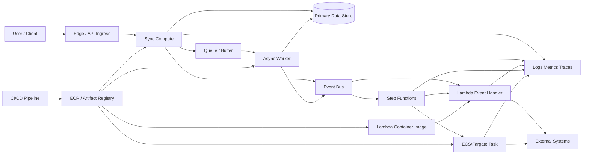
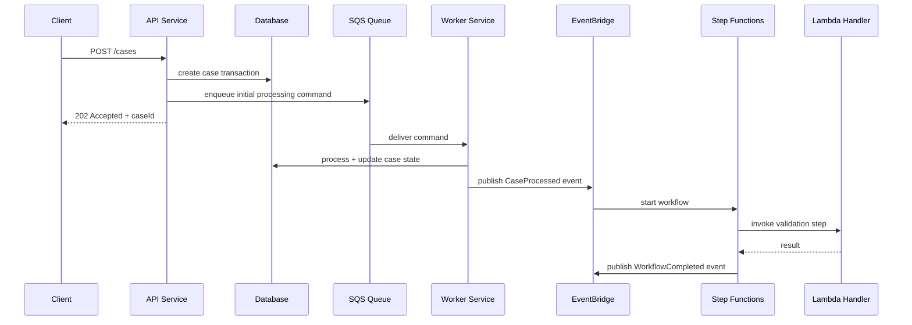
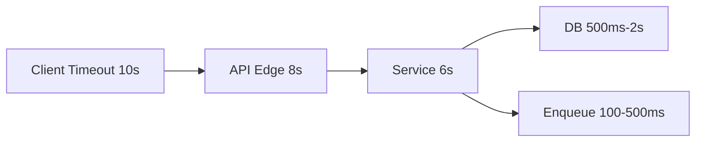
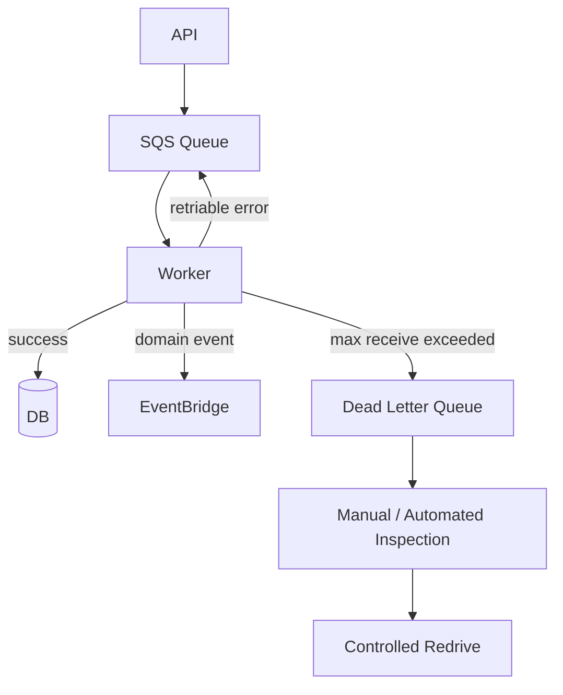
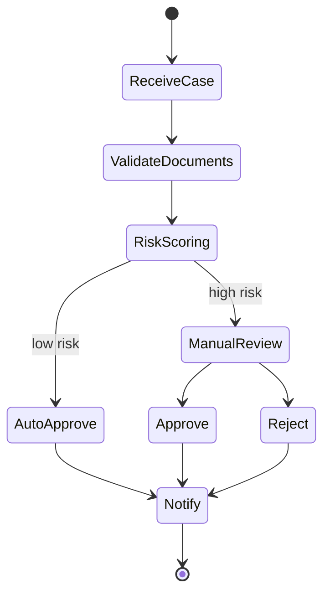
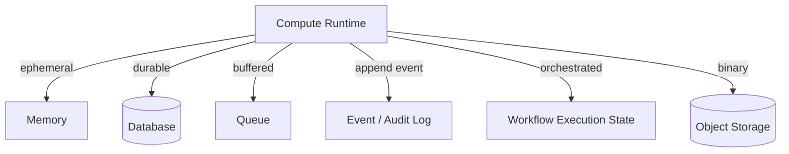
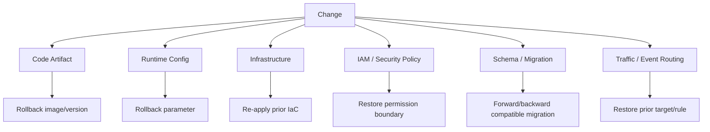
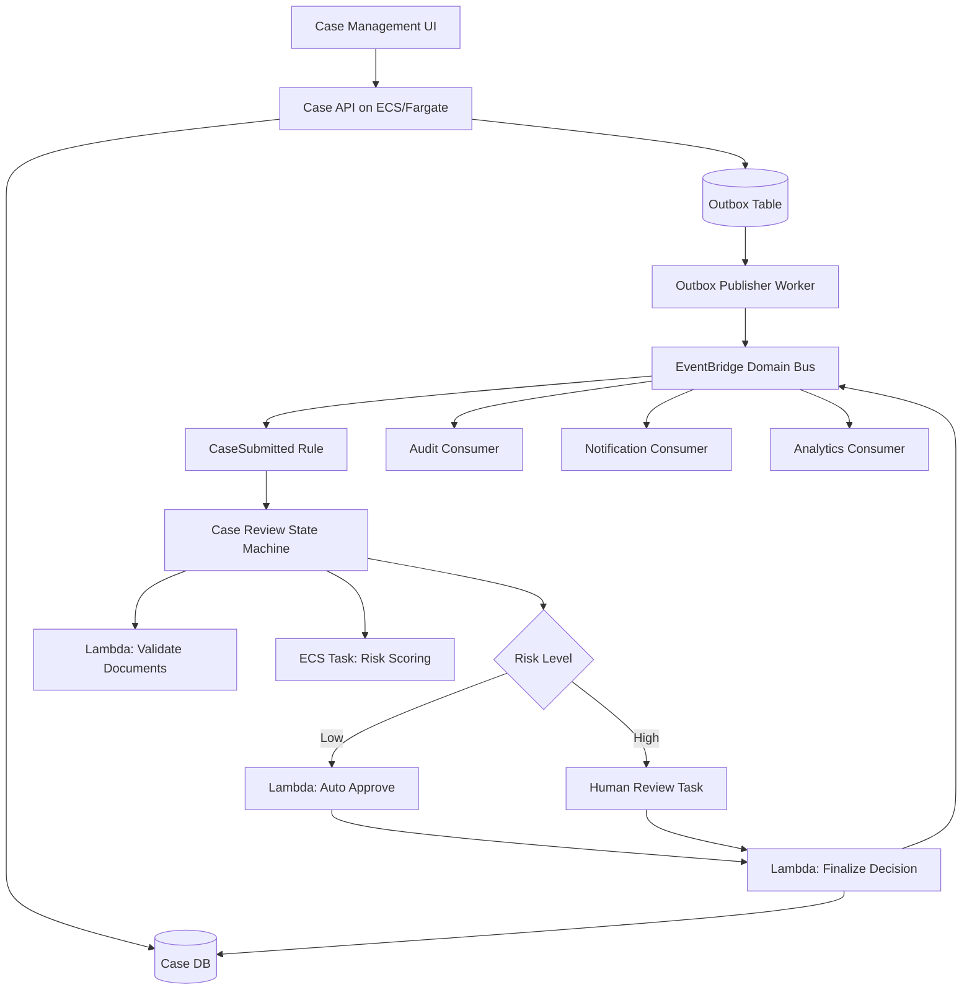

# Part 005 — Reference Architecture Map

Pada part sebelumnya kita membangun bahasa dasar: workload shape, control plane, data plane, runtime contract, dan failure boundary. Sekarang kita ubah bahasa itu menjadi peta sistem.

Tujuan part ini bukan membuat satu arsitektur sakti yang selalu benar. Tujuannya adalah memberi **map**: ketika kamu melihat sistem AWS container/serverless produksi, kamu tahu komponen mana yang memegang request path, komponen mana yang memegang async path, komponen mana yang memegang deployment artifact, komponen mana yang memegang workflow state, dan komponen mana yang menjadi failure amplifier.

Seorang engineer junior biasanya bertanya:

> “Pakai ECS atau Lambda?”

Engineer senior bertanya:

> “Di mana request harus berhenti? Di mana state harus hidup? Di mana retry boleh terjadi? Di mana duplikasi akan dikontrol? Di mana release bisa di-rollback? Di mana audit trail cukup kuat?”

Itulah fungsi reference architecture map.

---

## 1. Bentuk Dasar Sistem Produksi

Sistem container/serverless produksi biasanya memiliki beberapa plane:

1. **Ingress plane** — tempat traffic masuk.
2. **Compute plane** — tempat business logic berjalan.
3. **Async plane** — tempat kerja berat, retry, buffer, dan backpressure dipindahkan.
4. **Workflow plane** — tempat proses multi-step dikoordinasikan.
5. **Artifact plane** — tempat kode yang dirilis dibangun, disimpan, dipromosikan, dan diverifikasi.
6. **Data plane** — database, cache, stream, object storage, search engine, external system.
7. **Observability plane** — log, metric, trace, event timeline, audit evidence.
8. **Governance plane** — policy, identity, image scanning, approval, deployment guardrail.

Kesalahan umum adalah mencampur semuanya di satu tempat: API langsung mengerjakan semua proses, Lambda melakukan orchestration manual, worker menyimpan workflow state di memory, atau pipeline deploy menggunakan tag mutable seperti `latest`.

Arsitektur yang sehat memisahkan boundary berdasarkan **kontrak operasional**.



---

## 2. The Golden Path: API + Async Worker + Event Workflow

Untuk banyak sistem enterprise, bentuk awal yang paling masuk akal adalah:

- API menerima request.
- API melakukan validasi, authorization, dan perubahan state minimal.
- API menulis command/job ke queue atau menerbitkan event.
- Worker memproses pekerjaan berat.
- Event bus menyebarkan domain event.
- Workflow engine mengatur proses multi-step.
- Observability menghubungkan semua step dengan correlation ID.

Ini bukan sekadar pattern. Ini adalah cara mengontrol pressure.

Request path harus pendek. Async path boleh panjang. Workflow path harus durable.



Perhatikan invariant-nya:

- API tidak menunggu seluruh proses selesai.
- Queue menjadi buffer dan backpressure boundary.
- Worker bisa diskalakan berdasarkan queue depth.
- EventBridge memisahkan producer dan consumer.
- Step Functions menyimpan state orchestration, bukan service biasa.
- Correlation ID harus mengalir dari request sampai event terakhir.

---

## 3. Compute Plane: Tempat Logic Berjalan

AWS memberi beberapa cara menjalankan logic:

- **ECS on Fargate** untuk container service tanpa mengelola EC2 cluster.
- **ECS on EC2** untuk kontrol host, special hardware, cost optimization, atau daemon-style requirement.
- **EKS** untuk Kubernetes platform dengan ekosistem besar, multi-team tenancy, dan extensibility tinggi.
- **Lambda** untuk event handler dan short-lived compute.
- **App Runner** untuk web service managed dengan surface area operasional lebih kecil.
- **AWS Batch** untuk batch job queue dengan compute environment khusus.
- **Step Functions** untuk workflow orchestration, bukan general compute.

Map sederhana:

| Need | Candidate | Alasan |
|---|---|---|
| Long-running HTTP service | ECS/Fargate, EKS, App Runner | Butuh listener stabil dan scaling service. |
| Background queue worker | ECS/Fargate, EKS, Lambda | Tergantung durasi, batch size, dan concurrency. |
| Short event handler | Lambda | Cocok untuk unit kerja kecil, event-driven, scale-out cepat. |
| Multi-step durable workflow | Step Functions | State workflow dan retry/catch menjadi eksplisit. |
| Kubernetes platform | EKS | Cocok bila butuh extensibility Kubernetes dan platform team. |
| Simple managed web app/API | App Runner | Mengurangi beban orchestration bila requirement sederhana. |
| Heavy batch compute | AWS Batch, ECS task, EKS Job | Cocok untuk job queue, compute environment, array jobs. |

Kuncinya: **jangan memilih compute berdasarkan rasa modern**. Pilih berdasarkan kontrak runtime.

---

## 4. Sync Path: Request Harus Cepat, Terbatas, dan Terukur

Sync path adalah jalur yang secara langsung menahan user/client.

Contoh:

```txt
Client -> API Gateway / ALB -> ECS Service / Lambda -> Database -> Response
```

Sync path boleh melakukan:

- authentication dan authorization;
- validasi input;
- read sederhana;
- write transaksi utama;
- enqueue command/event;
- response cepat dengan status jelas.

Sync path sebaiknya tidak melakukan:

- proses panjang;
- call banyak downstream tanpa timeout budget;
- retry agresif;
- polling status eksternal;
- orchestration multi-step kompleks;
- pekerjaan yang bisa berjalan setelah response dikirim.

### Timeout Budget

Setiap hop harus punya timeout budget.



Jika client timeout 10 detik, service tidak boleh punya downstream call yang masing-masing timeout 10 detik. Itu menciptakan retry storm dan thread exhaustion.

Rule praktis:

> Timeout makin ke dalam harus makin kecil, bukan makin besar.

---

## 5. Async Path: Di Sini Backpressure Dikontrol

Async path adalah tempat kamu memindahkan pressure dari user-facing request.

Contoh:

```txt
API -> SQS -> Worker -> Database -> EventBridge -> Consumers
```

Async path memberi beberapa keuntungan:

- request bisa cepat selesai;
- worker bisa diskalakan terpisah;
- downstream outage bisa diserap sementara;
- retry bisa dikontrol;
- throughput bisa diatur;
- failure bisa masuk DLQ.

Namun async path membawa risiko:

- duplicate processing;
- out-of-order processing;
- poison message;
- retry storm;
- queue backlog yang tidak terlihat oleh user;
- stale state;
- observability lebih sulit.

Karena itu, async path wajib punya:

1. idempotency key;
2. retry limit;
3. dead-letter queue;
4. correlation ID;
5. backlog alarm;
6. handler timeout;
7. visibility timeout yang benar;
8. redrive policy;
9. replay strategy.



---

## 6. Event Bus: Jangan Jadikan Queue Pengganti Event Bus

Queue dan event bus sering disamakan. Itu berbahaya.

Queue biasanya memodelkan **work to be done**.

Event bus memodelkan **something happened**.

Contoh command/job:

```json
{
  "commandId": "cmd-123",
  "type": "GenerateCaseRiskScore",
  "caseId": "CASE-001"
}
```

Contoh domain event:

```json
{
  "eventId": "evt-456",
  "detailType": "CaseRiskScoreGenerated",
  "caseId": "CASE-001",
  "riskLevel": "HIGH",
  "occurredAt": "2026-07-06T08:15:00Z"
}
```

Perbedaannya bukan kosmetik.

| Aspek | Queue Command | Event Bus Event |
|---|---|---|
| Meaning | Tolong kerjakan ini | Ini sudah terjadi |
| Owner | Consumer/worker contract | Producer/domain contract |
| Consumer count | Biasanya satu worker group | Bisa banyak subscriber |
| Failure handling | Retry kerja | Retry delivery ke target |
| Coupling | Lebih dekat ke use case | Lebih dekat ke domain fact |

Jika kamu menaruh domain event ke queue tunggal, consumer baru sulit ditambahkan tanpa mengubah producer. Jika kamu menaruh command ke event bus, consumer bisa salah mengartikan event sebagai fakta domain padahal itu permintaan kerja.

---

## 7. Workflow Plane: Step Functions sebagai Durable Coordinator

Ada proses yang tidak cocok ditaruh di API, worker, atau Lambda tunggal.

Contoh:

- onboarding merchant;
- regulatory case escalation;
- payment settlement;
- document verification;
- human approval;
- long-running reconciliation;
- compensation ketika salah satu step gagal.

Jika proses punya banyak step, retry berbeda per step, branching, timeout, audit, dan compensation, gunakan workflow engine.



Workflow plane menjawab pertanyaan:

- step mana yang sudah selesai;
- step mana yang retry;
- step mana yang gagal permanen;
- input/output step apa;
- compensation apa yang sudah dijalankan;
- status proses saat ini apa;
- siapa yang harus melihat kegagalan.

Jangan membangun state machine tersembunyi dengan campuran row status, cron, worker retry, dan event handler tanpa observability. Itu mungkin berjalan di demo, tetapi buruk untuk operasi produksi.

---

## 8. Artifact Plane: Semua Bermula dari Artifact

Sebelum ECS task, EKS pod, Lambda container image, atau App Runner service berjalan, ada artifact.

Artifact bisa berupa:

- OCI image di ECR;
- ZIP package Lambda;
- Helm chart;
- CDK/Terraform/SAM template;
- Step Functions state machine definition;
- EventBridge rule definition;
- policy document;
- migration script.

Sistem produksi harus bisa menjawab:

1. artifact apa yang berjalan sekarang;
2. siapa yang membangun artifact itu;
3. source commit mana yang menghasilkan artifact itu;
4. vulnerability apa yang diketahui saat deploy;
5. config mana yang dipakai;
6. approval mana yang terjadi;
7. bagaimana rollback dilakukan;
8. apakah artifact sama antara staging dan production.

```mermaid
flowchart LR
    Code[Source Code] --> Build[Build]
    Build --> Test[Test]
    Test --> Scan[Scan / SBOM]
    Scan --> Sign[Sign / Attest]
    Sign --> Registry[ECR / Artifact Store]
    Registry --> Staging[Deploy Staging]
    Staging --> Promote[Promote by Digest]
    Promote --> Prod[Deploy Production]
    Prod --> Observe[Observe / Verify]
    Observe --> Rollback[Rollback if Needed]
```



Golden rule:

> Production deploy harus menunjuk artifact immutable, bukan build ulang dari source dengan asumsi environment sama.

---

## 9. Deployment Topologies

### 9.1 Single Service, Single Runtime

Bentuk paling sederhana:

```txt
ALB -> ECS Service -> Database
```

Cocok untuk:

- internal API;
- CRUD service;
- low async complexity;
- tim kecil;
- requirement operasional sederhana.

Risiko:

- semua pressure masuk ke service;
- background job sering masuk ke proses yang sama;
- scaling sync dan async tercampur.

### 9.2 API + Worker Split

```txt
ALB -> ECS API -> SQS -> ECS Worker -> Database
```

Cocok untuk:

- request cepat;
- proses berat;
- workload dengan spike;
- isolasi failure API vs worker.

Risiko:

- butuh idempotency;
- observability lebih kompleks;
- eventual consistency harus dijelaskan ke product/user.

### 9.3 Event-Driven Fanout

```txt
Service -> EventBridge -> Lambda / Queue / Step Functions / Other Bus
```

Cocok untuk:

- banyak consumer;
- integration antar bounded context;
- audit event;
- cross-account routing.

Risiko:

- contract governance wajib;
- duplicate delivery harus diterima;
- consumer failure tidak boleh merusak producer.

### 9.4 Workflow-Orchestrated System

```txt
API -> Step Functions -> Lambda + ECS Task + External APIs
```

Cocok untuk:

- proses multi-step;
- compensation;
- auditability;
- long-running process;
- human-in-the-loop.

Risiko:

- state machine bisa menjadi “distributed monolith” jika semua logic ditaruh di sana;
- payload bisa membengkak;
- versioning workflow butuh disiplin.

### 9.5 Kubernetes Platform

```txt
Ingress -> EKS Services -> Pods -> Data Stores / Event Systems
```

Cocok untuk:

- multi-team platform;
- workload heterogen;
- custom controller/operator;
- service mesh;
- advanced scheduling;
- portability abstraksi Kubernetes.

Risiko:

- butuh platform engineering maturity;
- upgrade dan add-on management nyata;
- policy dan tenancy harus serius.

---

## 10. Architecture by Workload Shape

### Request/Response API

Default choices:

- ECS/Fargate jika ingin container service stabil tanpa Kubernetes complexity.
- EKS jika service adalah bagian dari Kubernetes platform.
- Lambda jika request pendek, concurrency bisa tinggi, dan cold start/timeout cocok.
- App Runner jika web service sederhana dan ingin operational surface kecil.

Decision questions:

- Apakah API harus menjaga koneksi panjang?
- Apakah ada WebSocket atau streaming?
- Apakah dependency berat membuat cold start mahal?
- Apakah autoscaling harus berdasarkan request count atau CPU?
- Apakah deploy perlu canary traffic shifting?

### Async Worker

Default choices:

- ECS/Fargate untuk worker panjang atau dependency berat.
- Lambda untuk handler pendek berbasis event source mapping.
- EKS Job/Deployment jika sudah berada di Kubernetes platform.
- AWS Batch untuk compute job skala batch.

Decision questions:

- Berapa lama satu unit kerja berjalan?
- Apakah job bisa dipotong menjadi batch kecil?
- Apakah perlu checkpoint?
- Apakah duplicate processing aman?
- Bagaimana poison message ditangani?

### Workflow

Default choices:

- Step Functions untuk durable orchestration.
- EventBridge untuk choreography sederhana antar service.
- Kombinasi Step Functions + EventBridge untuk orchestration internal dan publication eksternal.

Decision questions:

- Apakah step perlu retry/catch berbeda?
- Apakah ada human approval?
- Apakah status workflow harus mudah diaudit?
- Apakah compensation diperlukan?
- Apakah proses berlangsung lebih lama dari satu request/worker run?

---

## 11. Data Boundary dalam Reference Architecture

Compute bisa stateless. Sistem tidak pernah benar-benar stateless.

State biasanya hidup di:

- database;
- queue;
- stream;
- object store;
- workflow execution;
- cache;
- external SaaS;
- idempotency table;
- audit log.

Kesalahan paling mahal adalah state tersembunyi:

- in-memory progress;
- local filesystem dalam container;
- implicit retry count di client;
- status disimpulkan dari log;
- event dianggap source of truth padahal tidak lengkap;
- workflow state disebar di banyak worker.

Prinsip:

> Jika state penting untuk correctness, state harus punya owner, lifecycle, retention, replay story, dan observability.



---

## 12. Observability Map

Observability bukan “nyalakan log”. Observability berarti dari satu incident kamu bisa menjawab:

- request mana yang terdampak;
- service mana yang gagal;
- event mana yang duplicate;
- workflow execution mana yang stuck;
- deploy mana yang memperkenalkan error;
- downstream mana yang throttling;
- queue mana yang backlog;
- apakah user-facing SLO dilanggar.

### Minimum Signal per Plane

| Plane | Signal Minimal |
|---|---|
| Ingress | request count, latency, 4xx/5xx, throttling, auth failure |
| ECS/EKS service | CPU, memory, restart, unhealthy target, deployment event, container logs |
| Lambda | invocation, duration, error, throttle, concurrent execution, iterator age |
| Queue | visible messages, age of oldest message, DLQ count, receive count |
| EventBridge | matched events, failed invocations, dead-letter target count |
| Step Functions | execution started/succeeded/failed/timed out, state transition failure |
| Registry | image pushed, scan finding, lifecycle deletion, pull failure |
| CI/CD | build ID, commit SHA, artifact digest, approver, deployment status |

### Correlation ID

Correlation ID harus menjadi first-class field.

Contoh event:

```json
{
  "eventId": "evt-01H...",
  "correlationId": "corr-01H...",
  "causationId": "cmd-01H...",
  "source": "case-service",
  "detailType": "CaseSubmitted",
  "detail": {
    "caseId": "CASE-001"
  }
}
```

Field penting:

- `eventId` untuk dedupe event;
- `correlationId` untuk mengikat perjalanan business process;
- `causationId` untuk tahu event ini disebabkan command/event apa;
- `source` untuk ownership;
- `detailType` untuk routing dan contract.

---

## 13. Security Boundary Map

Container/serverless system punya beberapa identity:

- human deployer identity;
- CI/CD role;
- ECS task execution role;
- ECS task role;
- EKS node role;
- EKS workload identity;
- Lambda execution role;
- Step Functions execution role;
- EventBridge invocation role;
- cross-account role;
- registry access role.

Kesalahan besar adalah memakai role terlalu luas karena “biar jalan”.

Arsitektur sehat memisahkan:

| Identity | Fungsi |
|---|---|
| Build role | build, scan, push artifact |
| Deploy role | update service/function/state machine |
| Runtime role | akses dependency saat workload berjalan |
| Invocation role | service A boleh invoke target B |
| Break-glass role | akses darurat dengan audit ketat |

Runtime service tidak harus bisa deploy dirinya sendiri. CI/CD tidak harus bisa membaca data production. Event bus tidak harus bisa invoke semua target.

---

## 14. Release Boundary Map

Deployment bukan hanya “push image”. Deployment adalah perubahan state sistem.

Perubahan yang bisa terjadi:

- image digest berubah;
- task definition revision berubah;
- Lambda version/alias berubah;
- state machine definition berubah;
- EventBridge rule berubah;
- IAM policy berubah;
- config/secrets berubah;
- database schema berubah;
- queue retry policy berubah;
- autoscaling policy berubah.

Setiap perubahan punya blast radius.



Top 1% engineer selalu bertanya:

> “Rollback apa yang tersedia jika perubahan ini gagal setelah sebagian side effect terjadi?”

---

## 15. Failure Boundary Map

Reference architecture harus dibaca sebagai peta failure.

| Failure | Boundary yang Menahan |
|---|---|
| API overload | load balancer, autoscaling, throttling, queue offload |
| Worker overload | queue backlog, worker autoscaling, DLQ |
| Downstream outage | timeout, retry budget, circuit breaker, async buffer |
| Bad deployment | health check, circuit breaker, rollback, canary alarm |
| Duplicate event | idempotency key, dedupe store |
| Poison message | receive count, DLQ, redrive workflow |
| Workflow stuck | execution timeout, state timeout, alarm |
| Image compromised | scan, signing, digest pinning, promotion gates |
| Secret leaked | rotation, least privilege, blast-radius isolation |
| Subnet/IP exhaustion | capacity planning, VPC endpoint, ENI monitoring |

Jika boundary tidak jelas, incident akan menjalar.

---

## 16. Reference Architecture: Regulated Case Workflow

Karena banyak production system bukan sekadar e-commerce demo, berikut contoh domain yang lebih dekat ke complex case management.

### Requirement

- User membuat case.
- Sistem validasi dokumen.
- Sistem menghitung risk score.
- High-risk case butuh manual review.
- Semua state transition harus bisa diaudit.
- Downstream eksternal bisa lambat/gagal.
- Tidak boleh kehilangan event.
- Tidak boleh double-approve case.

### Architecture



### Why This Shape Works

- API hanya membuat case dan mengamankan transaksi awal.
- Outbox memastikan event tidak hilang ketika database write sukses tetapi publish gagal.
- EventBridge memisahkan producer dan consumer.
- Step Functions menyimpan status review process.
- Lambda cocok untuk step kecil.
- ECS task cocok untuk risk scoring jika dependency berat atau durasi tidak cocok untuk Lambda.
- Manual review menjadi explicit state, bukan hidden status.
- Audit consumer tidak mengganggu path approval.

### Critical Invariants

1. Case tidak boleh masuk workflow tanpa committed case record.
2. Setiap state transition harus punya actor/system owner.
3. Approval harus idempotent.
4. Event publication harus retryable.
5. Manual review timeout harus jelas.
6. Workflow failure tidak boleh menghapus case.
7. Re-drive harus aman dan terkontrol.
8. Audit log tidak boleh bergantung pada best-effort logs saja.

---

## 17. Anti-Patterns

### Anti-Pattern 1 — Lambda sebagai Distributed God Object

Gejala:

- satu Lambda menerima banyak event type;
- handler berisi routing manual;
- retry berbeda tidak dimodelkan;
- state disimpan di payload besar;
- error handling bercabang liar.

Perbaikan:

- pisahkan handler per contract;
- gunakan Step Functions untuk workflow;
- gunakan EventBridge rule untuk routing;
- gunakan idempotency store.

### Anti-Pattern 2 — ECS Service Mengerjakan Semua

Gejala:

- API endpoint menunggu proses panjang;
- background job berjalan di thread yang sama;
- deployment API mengganggu worker;
- autoscaling sulit karena metric campur.

Perbaikan:

- pisahkan API dan worker;
- taruh pekerjaan berat di queue;
- scaling berdasarkan sinyal berbeda.

### Anti-Pattern 3 — Event Tanpa Owner

Gejala:

- event dibuat hanya karena “butuh trigger”;
- schema berubah tanpa consumer contract;
- field wajib tidak jelas;
- event tidak punya semantic version.

Perbaikan:

- definisikan event sebagai domain fact;
- tetapkan owner;
- versioning dan compatibility policy;
- contract test.

### Anti-Pattern 4 — Deployment Menggunakan Mutable Tag

Gejala:

- production menggunakan `latest`;
- rollback tidak jelas;
- image yang sama tag-nya bisa berubah;
- sulit membuktikan artifact mana yang berjalan.

Perbaikan:

- deploy by digest;
- enable tag immutability;
- promotion antar environment berdasarkan digest;
- simpan build metadata.

### Anti-Pattern 5 — Observability Setelah Incident

Gejala:

- log tidak punya correlation ID;
- DLQ tidak dimonitor;
- workflow failure tidak punya alarm;
- deploy event tidak terkait error spike.

Perbaikan:

- desain telemetry sejak awal;
- define SLO;
- instrument request, event, workflow, dan deployment timeline.

---

## 18. Design Review Checklist

Gunakan checklist ini saat membaca arsitektur container/serverless.

### Runtime

- Compute model apa yang dipakai untuk setiap workload?
- Apakah runtime contract cocok dengan durasi dan dependency workload?
- Apakah startup/shutdown behavior sudah benar?
- Apakah timeout dan retry budget eksplisit?

### State

- Di mana state durable disimpan?
- Apakah ada state tersembunyi di memory/container filesystem?
- Apakah idempotency disimpan di tempat yang benar?
- Apakah replay aman?

### Traffic

- Mana sync path dan async path?
- Apakah request path terlalu panjang?
- Apakah queue/event bus dipakai sesuai semantic?
- Apakah backpressure boundary jelas?

### Deployment

- Artifact apa yang dideploy?
- Apakah artifact immutable?
- Apakah rollback jelas?
- Apakah deployment punya health gate?
- Apakah config dan schema migration kompatibel?

### Security

- Role apa yang dipakai build, deploy, dan runtime?
- Apakah runtime role terlalu luas?
- Apakah cross-account invocation dibatasi?
- Apakah secret rotation dipahami oleh workload?

### Observability

- Apakah correlation ID mengalir end-to-end?
- Apakah queue backlog dimonitor?
- Apakah DLQ punya owner?
- Apakah workflow failure terlihat?
- Apakah deploy event bisa dikorelasikan dengan error spike?

---

## 19. Mental Model Ringkas

Sistem container/serverless produksi bisa dibaca dengan satu pertanyaan utama:

> “Untuk setiap unit kerja, siapa menerima, siapa memutuskan, siapa menjalankan, siapa menyimpan state, siapa retry, siapa mengamati, dan siapa bertanggung jawab saat gagal?”

Jika jawabannya tersebar tanpa desain, sistem akan rapuh.

Jika jawabannya eksplisit, AWS service menjadi alat yang masuk akal:

- ECS/EKS/App Runner untuk service runtime.
- Lambda untuk event handler kecil.
- SQS untuk buffer/backpressure.
- EventBridge untuk domain event routing.
- Step Functions untuk durable workflow.
- ECR untuk immutable image artifact.
- CI/CD untuk promotion dan rollback.
- Observability untuk melihat sistem sebagai timeline, bukan potongan log.

---

## 20. Bridge ke Part Berikutnya

Part berikutnya masuk ke fondasi artifact: **OCI image**.

Sebelum membahas ECS task definition, EKS pod, atau Lambda container image, kita harus memahami kenapa image digest, layer, manifest, tag mutability, SBOM, scanning, dan provenance menentukan kualitas operasi produksi.

Kalau artifact tidak bisa dipercaya, deployment tidak bisa dipercaya.

---

## References

- AWS Documentation — Amazon ECS: <https://docs.aws.amazon.com/AmazonECS/latest/developerguide/Welcome.html>
- AWS Documentation — AWS Fargate for Amazon ECS: <https://docs.aws.amazon.com/AmazonECS/latest/developerguide/AWS_Fargate.html>
- AWS Documentation — Run Amazon ECS or Fargate tasks with Step Functions: <https://docs.aws.amazon.com/step-functions/latest/dg/connect-ecs.html>
- AWS Documentation — Amazon EventBridge event bus targets: <https://docs.aws.amazon.com/eventbridge/latest/userguide/eb-targets.html>
- AWS Documentation — What is AWS Step Functions: <https://docs.aws.amazon.com/step-functions/latest/dg/welcome.html>
- AWS Documentation — AWS Prescriptive Guidance patterns: <https://docs.aws.amazon.com/prescriptive-guidance/latest/patterns/welcome.html>
