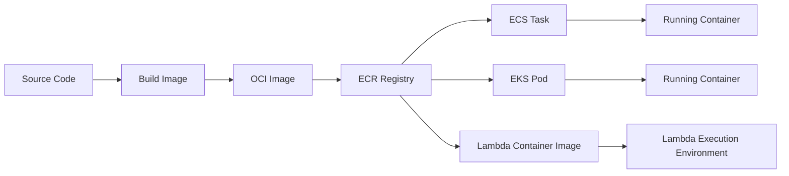
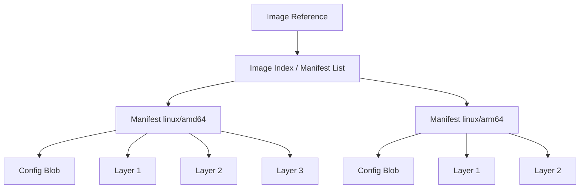
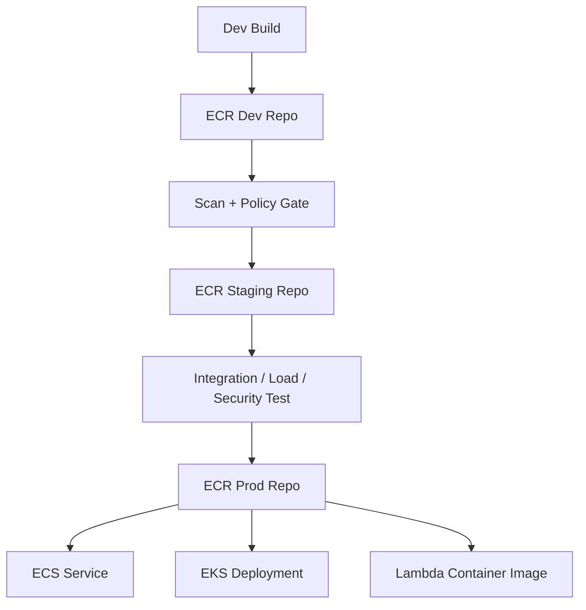
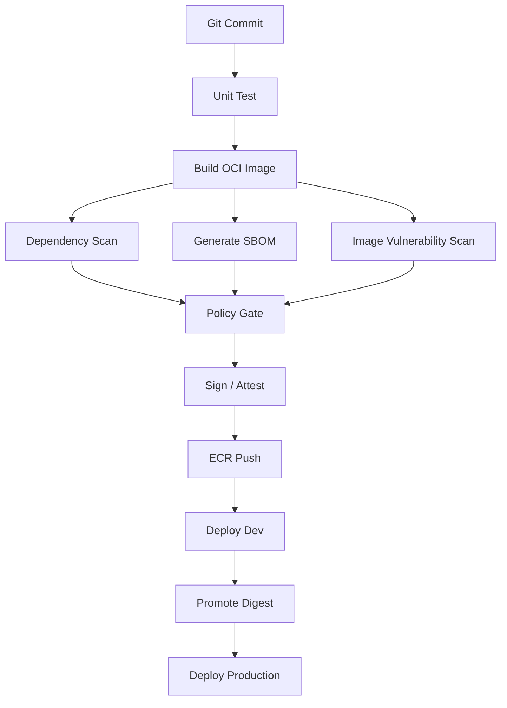
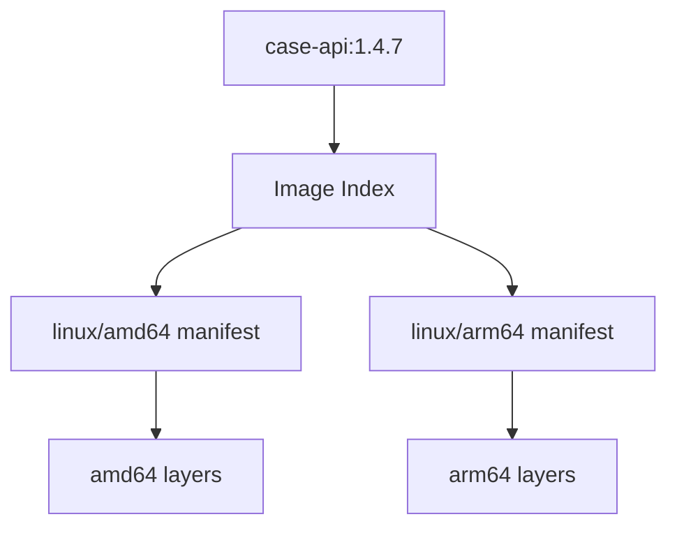
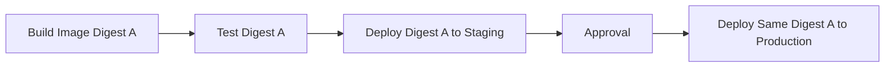
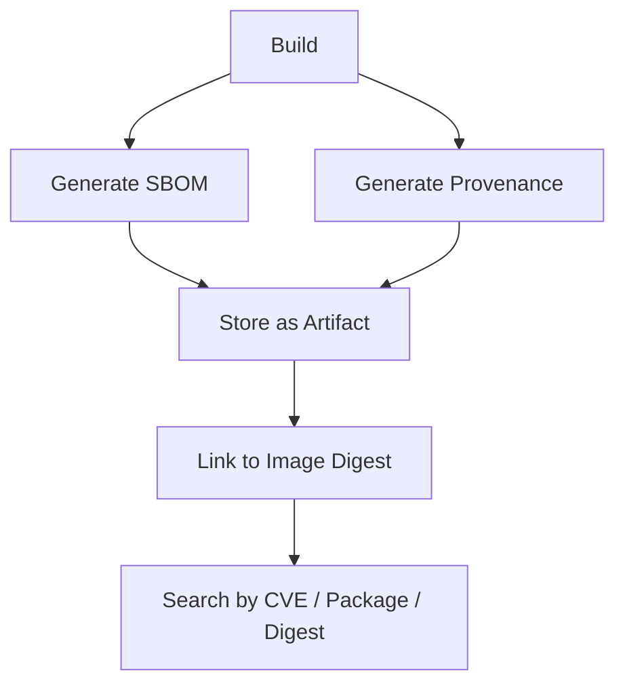

# Part 006 — OCI Image as Deployment Artifact

Sebelum membahas ECS task definition, EKS Deployment, Fargate task, atau Lambda container image, kita harus memahami satu benda kecil yang menentukan banyak hal: **container image**.

Di production, image bukan “hasil docker build”. Image adalah **deployment artifact**. Artinya, image adalah unit yang kamu bangun, scan, simpan, promosikan, deploy, rollback, audit, dan investigasi saat incident.

Kalau kamu memperlakukan image sebagai file teknis biasa, release pipeline akan rapuh. Kalau kamu memperlakukan image sebagai artifact immutable, deployment menjadi bisa diaudit dan direproduksi.

---

## 1. Image Bukan Container

Pertama, pisahkan dua konsep.

| Konsep | Makna |
|---|---|
| Image | Artifact read-only yang berisi filesystem layers, metadata, config, entrypoint, command, environment default, dan manifest. |
| Container | Runtime instance dari image yang berjalan sebagai process dengan namespace, cgroup, network, mount, dan lifecycle tertentu. |

Image seperti class. Container seperti object instance. Tetapi analogi itu belum cukup, karena image juga punya supply chain: siapa membangun, dari base apa, library apa, vulnerability apa, commit mana, dan signature mana.



---

## 2. OCI Mental Model

OCI image adalah format standar yang menjelaskan bagaimana image disusun dan didistribusikan.

Secara konseptual, image terdiri dari:

1. **manifest** — daftar layer dan config untuk satu image pada satu OS/architecture;
2. **config** — metadata runtime seperti entrypoint, command, environment, working directory;
3. **layers** — perubahan filesystem yang ditumpuk berurutan;
4. **descriptor** — referensi content-addressed yang memakai digest;
5. **index/manifest list** — daftar manifest untuk multi-platform image.



Saat kamu menulis:

```bash
aws_account_id.dkr.ecr.ap-southeast-1.amazonaws.com/case-api:1.4.7
```

itu adalah **tag reference**.

Saat runtime menarik image, registry menyelesaikan tag itu ke manifest digest.

Digest berbentuk seperti:

```txt
sha256:3b2f0e6c...
```

Digest adalah identitas content-addressed. Jika content berubah, digest berubah.

---

## 3. Tag vs Digest

Ini salah satu konsep paling penting.

| Reference | Contoh | Stabilitas |
|---|---|---|
| Tag | `case-api:prod` | Bisa berubah jika tag mutable. |
| Version tag | `case-api:1.4.7` | Lebih baik, tetapi masih bisa berubah jika registry mengizinkan overwrite. |
| Digest | `case-api@sha256:abc...` | Mengacu ke content tertentu. |

Production system sebaiknya deploy berdasarkan digest atau minimal memastikan tag immutable.

### Kenapa Tag Berbahaya?

Bayangkan pipeline seperti ini:

```bash
docker build -t case-api:latest .
docker push case-api:latest
```

Lalu production task definition memakai:

```json
{
  "image": "case-api:latest"
}
```

Masalahnya:

- `latest` hari ini tidak sama dengan `latest` kemarin;
- rollback tidak jelas;
- incident analysis sulit;
- environment staging dan production bisa tampak sama tetapi sebenarnya beda digest;
- compliance evidence lemah.

### Release-grade Reference

Gunakan kombinasi:

```txt
case-api:1.4.7
case-api:git-a1b2c3d
case-api@sha256:...
```

Tag membantu manusia. Digest membantu mesin dan audit.

---

## 4. Image as Release Evidence

Setiap production image sebaiknya bisa menjawab:

- source repository apa;
- commit SHA apa;
- build ID apa;
- build time kapan;
- siapa/apa yang membangun;
- base image apa;
- dependency apa;
- vulnerability apa;
- SBOM mana;
- test suite apa yang lulus;
- environment mana saja yang pernah menjalankan digest ini;
- kapan masuk production;
- kapan keluar production.

Ini dapat disimpan sebagai:

- image label;
- build metadata;
- SBOM artifact;
- provenance attestation;
- deployment record;
- release manifest.

Contoh label:

```dockerfile
LABEL org.opencontainers.image.source="https://github.com/acme/case-api"
LABEL org.opencontainers.image.revision="a1b2c3d4e5f6"
LABEL org.opencontainers.image.version="1.4.7"
LABEL org.opencontainers.image.created="2026-07-06T08:00:00Z"
```

Label bukan security boundary. Label adalah metadata. Tetap butuh digest, signing, dan registry control.

---

## 5. ECR sebagai Registry, Bukan Sekadar Tempat Push

Amazon ECR biasanya dipakai sebagai registry untuk ECS, EKS, dan Lambda container images.

Production ECR design harus memperhatikan:

- repository layout;
- tag immutability;
- lifecycle policy;
- vulnerability scanning;
- cross-account sharing;
- replication;
- pull-through cache;
- access policy;
- artifact retention;
- provenance/SBOM artifact;
- promotion flow.



Ada dua strategi umum.

### Strategy A — Single Repository, Multi-Tag Promotion

Contoh:

```txt
case-api:git-a1b2c3d
case-api:staging-20260706-1
case-api:prod-20260706-1
```

Kelebihan:

- sederhana;
- artifact tidak perlu copy antar repo;
- mudah mencari semua tag untuk digest sama.

Kekurangan:

- boundary environment lebih lemah;
- permission lebih sulit jika prod harus sangat ketat;
- lifecycle policy harus hati-hati.

### Strategy B — Repository per Environment atau Account

Contoh:

```txt
dev-account/case-api@sha256:...
staging-account/case-api@sha256:...
prod-account/case-api@sha256:...
```

Kelebihan:

- boundary lebih kuat;
- prod registry bisa lebih ketat;
- cocok untuk regulated environment;
- promotion bisa menjadi explicit control point.

Kekurangan:

- butuh copy/replication;
- metadata harus dijaga agar tidak putus;
- digest bisa berubah jika manifest/artifact disalin dengan cara yang tidak mempertahankan referensi yang sama.

---

## 6. Repository Layout

Ada beberapa cara menata repository.

### Per Service Repository

```txt
case-api
case-worker
risk-scoring
notification-service
```

Ini default yang sehat untuk kebanyakan tim.

Kelebihan:

- permission per service mudah;
- lifecycle policy per service;
- ownership jelas;
- scan finding mudah diarahkan.

### Per Team Repository Namespace

```txt
regulatory/case-api
regulatory/case-worker
payments/settlement-worker
platform/base-java
```

Kelebihan:

- ownership domain jelas;
- cocok untuk organisasi besar;
- bisa dipakai untuk governance.

### Monorepo-Style Single Repository

```txt
platform-services
```

dengan tag:

```txt
case-api-1.0.0
case-worker-1.0.0
risk-scoring-1.0.0
```

Biasanya buruk untuk produksi kecuali ada alasan kuat.

Masalah:

- lifecycle policy rumit;
- permission kasar;
- observability artifact buruk;
- scan finding tidak jelas owner-nya.

Rule praktis:

> Satu independently deployable service sebaiknya punya satu image repository sendiri.

---

## 7. Build Pipeline: Dari Source ke Artifact

Pipeline sehat bukan hanya build lalu push.



Minimum build metadata:

```json
{
  "service": "case-api",
  "commit": "a1b2c3d",
  "buildId": "build-20260706-001",
  "imageDigest": "sha256:...",
  "sbom": "s3://.../case-api-a1b2c3d.spdx.json",
  "scanner": "inspector/ecr/basic/third-party",
  "approvedBy": "release-policy-v3",
  "createdAt": "2026-07-06T08:00:00Z"
}
```

---

## 8. Layering Strategy

Image layer mempengaruhi:

- build speed;
- pull speed;
- cache hit;
- vulnerability exposure;
- size;
- rollback speed;
- cold start, terutama untuk Lambda container image;
- node disk pressure pada Kubernetes/ECS EC2.

### Bad Layering

```dockerfile
COPY . .
RUN mvn package
```

Masalah:

- perubahan file kecil invalidasi cache besar;
- dependency selalu diunduh ulang;
- build lambat;
- final image bisa membawa source/test/build tool.

### Better Layering for Java

```dockerfile
FROM maven:3.9-eclipse-temurin-21 AS build
WORKDIR /src
COPY pom.xml .
COPY src ./src
RUN mvn -DskipTests package

FROM eclipse-temurin:21-jre
WORKDIR /app
COPY --from=build /src/target/app.jar /app/app.jar
ENTRYPOINT ["java", "-jar", "/app/app.jar"]
```

Ini lebih baik, tetapi masih bisa dioptimasi.

### Production Direction

- pisahkan dependency layer dan application layer jika framework mendukung;
- gunakan JRE bukan JDK untuk runtime;
- hindari package manager di final image bila tidak perlu;
- gunakan non-root user;
- pin base image;
- kurangi shell/tools di final image;
- jangan simpan secret di layer;
- jangan build di runtime image.

---

## 9. Base Image Strategy

Base image adalah inherited risk.

Pilihan umum:

| Base | Kelebihan | Risiko |
|---|---|---|
| Full distro | Mudah debug, banyak tool | Besar, attack surface tinggi |
| Slim distro | Lebih kecil | Kadang dependency hilang |
| Distroless | Attack surface kecil | Debug lebih sulit |
| Alpine | Kecil | musl/glibc compatibility issue untuk sebagian workload |
| AWS provided base image | Integrasi runtime AWS lebih mudah | Tetap butuh patch dan tracking |
| Custom golden base | Governance kuat | Platform team harus maintain serius |

Untuk organisasi besar, golden base image sering masuk akal:

```txt
platform/java-runtime:21-2026-07
platform/node-runtime:22-2026-07
platform/python-runtime:3.13-2026-07
```

Tetapi golden base image yang tidak rutin dipatch justru menjadi single point of inherited vulnerability.

---

## 10. Multi-Architecture Image

AWS semakin umum memakai Graviton/ARM untuk cost-performance. Karena itu image multi-architecture penting.

Contoh target:

```txt
linux/amd64
linux/arm64
```

Multi-arch image biasanya memakai image index/manifest list yang menunjuk manifest berbeda per architecture.



Risiko:

- dependency native tidak support ARM;
- image berhasil build tapi runtime gagal;
- staging amd64, production arm64;
- performance berbeda;
- vulnerability scan berbeda per architecture.

Rule:

> Test artifact pada architecture yang sama dengan production capacity.

---

## 11. Lambda Container Image Bukan ECS Container

Lambda dapat memakai container image, tetapi kontraknya berbeda dari ECS/EKS.

Container image di Lambda bukan berarti kamu bebas menjalankan server proses seperti biasa.

Perbedaan penting:

| Aspek | ECS/EKS Container | Lambda Container Image |
|---|---|---|
| Runtime | Long-running process/service | Function execution environment |
| Invocation | Network request/event ke service | Lambda Runtime API invocation |
| Scaling | Task/pod replica | Function concurrency |
| Lifecycle | Start, run, stop | Init, invoke, freeze/thaw, shutdown |
| Port listener | Umum | Tidak sama seperti web server biasa kecuali memakai adapter khusus |
| Image source | ECR/private registry support sesuai runtime | Lambda container image dari ECR sesuai requirement Lambda |

Untuk Lambda image, kamu harus memikirkan:

- runtime interface client;
- handler contract;
- image size dan cold start;
- read-only filesystem kecuali `/tmp`;
- dependency initialization;
- architecture compatibility;
- ECR repository region dengan function;
- patching base image.

Jadi jangan berkata “kita pakai container, nanti bisa jalan di mana saja”. Bisa saja image formatnya sama, tetapi runtime contract-nya berbeda.

---

## 12. Immutability and Promotion

Pipeline buruk:

```txt
Build staging image -> test -> rebuild production image -> deploy
```

Kenapa buruk?

Karena production image tidak sama dengan artifact yang diuji.

Pipeline sehat:

```txt
Build once -> test digest -> promote same digest -> deploy digest
```



Ingat:

> Environment promotion bukan rebuild. Environment promotion adalah menaikkan trust level artifact yang sama.

---

## 13. Vulnerability Scanning: Signal, Bukan Jaminan

Image scanning penting, tetapi jangan salah artikan.

Scanner bisa membantu menemukan:

- OS package vulnerability;
- dependency vulnerability;
- language package issue;
- vulnerable base image;
- severity dan fix availability.

Scanner tidak membuktikan:

- aplikasi benar secara logic;
- tidak ada secret di image;
- runtime IAM aman;
- config production aman;
- vulnerability tidak exploitable;
- tidak ada malicious code di source.

Karena itu scanning harus menjadi satu lapis dari supply chain, bukan satu-satunya kontrol.

Policy gate contoh:

```txt
Block deploy if:
- critical vulnerability with fix available in runtime package
- image built from unapproved base image
- missing SBOM
- missing provenance
- image tag mutable in production repo
- image older than patch freshness threshold
```

Tetapi jangan membuat policy bodoh yang memblokir semua CVE tanpa konteks. Itu akan melahirkan bypass culture.

---

## 14. SBOM and Provenance

SBOM menjawab:

> “Apa saja komponen yang ada di artifact ini?”

Provenance menjawab:

> “Bagaimana artifact ini dibuat, dari source apa, oleh builder apa, dengan process apa?”

Keduanya berguna saat:

- ada CVE baru;
- audit compliance;
- incident investigation;
- supply chain compromise;
- dependency deprecation;
- base image recall.

Minimum useful SBOM/provenance workflow:



Tanpa link ke digest, SBOM kehilangan nilai operasional.

---

## 15. Signing and Attestation

Image signing memberi mekanisme untuk memverifikasi bahwa image berasal dari builder/trust domain tertentu dan belum diganti secara diam-diam.

Namun signing bukan sihir.

Image signed tetap bisa:

- punya bug;
- punya vulnerability;
- punya secret;
- punya dependency buruk;
- dibangun dari source berbahaya jika pipeline sudah compromised.

Signing berguna ketika dikombinasikan dengan:

- protected branch;
- controlled builder;
- reproducible-ish build metadata;
- policy gate;
- admission control;
- audit trail;
- least privilege registry access.

---

## 16. Image Pull Failure Modes

Banyak incident container dimulai sebelum aplikasi berjalan.

Failure umum:

| Failure | Gejala | Penyebab Umum |
|---|---|---|
| Authentication failure | task/pod tidak bisa pull image | execution role/node role salah, registry policy salah |
| Tag not found | image cannot be pulled | tag belum dipush, typo, lifecycle policy menghapus |
| Digest not found | pull by digest gagal | artifact dihapus, cross-region/cross-account copy gagal |
| Rate limit/proxy issue | pull lambat/gagal | dependency ke public registry tanpa cache |
| Network failure | timeout ke registry | private subnet tanpa NAT/VPC endpoint path yang benar |
| Architecture mismatch | exec format error | image amd64 jalan di arm64 atau sebaliknya |
| Large image slow pull | deployment lambat | image terlalu besar, layer cache buruk |
| Vulnerable image blocked | admission/deploy gate gagal | policy menolak image |

Design implication:

- registry access adalah dependency runtime startup;
- image size mempengaruhi recovery time;
- lifecycle policy bisa menjadi production outage jika menghapus digest yang masih dipakai;
- private subnet perlu path yang benar ke ECR dan storage layer dependency.

---

## 17. Lifecycle Policy: Bersih Tapi Jangan Menghapus Bukti

ECR lifecycle policy membantu menghapus image lama, tetapi policy yang agresif bisa merusak rollback.

Pertanyaan sebelum membuat lifecycle policy:

- Berapa lama rollback window?
- Apakah production digest dilindungi?
- Apakah image by digest masih dipakai task definition lama?
- Apakah SBOM/provenance ikut lifecycle?
- Apakah audit butuh evidence lebih lama dari artifact runtime?
- Apakah environment lama masih mengacu digest lama?

Policy buruk:

```txt
Keep last 5 images only
```

Masalah:

- service dengan deploy sering bisa kehilangan rollback image terlalu cepat;
- staging/prod tidak selalu sinkron;
- incident investigation kehilangan artifact.

Policy lebih sehat:

```txt
- keep all images tagged prod-* for 180 days
- keep all images tagged release-* for 90 days
- expire untagged images after 14 days
- keep last N dev images per branch
- never expire base golden images without explicit deprecation
```

---

## 18. Rollback Semantics

Rollback image terdengar sederhana, tetapi sering tidak cukup.

Jenis rollback:

| Jenis | Deskripsi |
|---|---|
| Image rollback | Deploy digest sebelumnya. |
| Config rollback | Kembalikan env/config/secrets reference. |
| Infra rollback | Kembalikan task definition, service setting, IAM, network, scaling. |
| Schema rollback | Sulit; sebaiknya pakai forward/backward compatible migration. |
| Event contract rollback | Sulit jika consumer sudah menerima versi baru. |
| Workflow rollback | Sulit untuk execution yang sudah berjalan. |

Jika image rollback gagal karena schema sudah berubah, berarti release plan tidak lengkap.

Production-ready release harus punya:

- forward-compatible database migration;
- old/new code compatibility window;
- event schema compatibility;
- config rollback;
- workflow versioning;
- deployment health gate;
- clear stop-the-line rule.

---

## 19. Image Metadata Standard

Buat standar metadata organisasi.

Contoh:

```txt
org.opencontainers.image.title=case-api
org.opencontainers.image.description=Regulatory case API service
org.opencontainers.image.version=1.4.7
org.opencontainers.image.revision=a1b2c3d4
org.opencontainers.image.created=2026-07-06T08:00:00Z
org.opencontainers.image.source=https://github.com/acme/regulatory-platform
com.acme.owner=regulatory-platform
com.acme.service=case-api
com.acme.build.id=build-20260706-001
com.acme.sbom.digest=sha256:...
com.acme.provenance.digest=sha256:...
```

Gunanya:

- incident response;
- inventory;
- cost attribution;
- vulnerability triage;
- deployment audit.

---

## 20. Java-Specific Image Notes

Untuk Java services, image design berdampak besar pada startup, memory, dan patching.

Perhatikan:

- JDK vs JRE;
- classpath size;
- fat jar vs layered jar;
- container-aware JVM memory;
- `MaxRAMPercentage`;
- garbage collector default;
- startup warmup;
- native dependencies;
- signal handling;
- timezone/CA certificate;
- DNS behavior;
- heap dump strategy;
- non-root filesystem write needs.

Contoh runtime command:

```dockerfile
ENTRYPOINT ["java", \
  "-XX:MaxRAMPercentage=75", \
  "-XX:+ExitOnOutOfMemoryError", \
  "-jar", "/app/app.jar"]
```

Catatan:

- `ExitOnOutOfMemoryError` membantu orchestrator mengganti process yang sudah tidak sehat.
- Heap dump di container perlu strategi storage; jangan menulis dump besar ke ephemeral disk tanpa batas.
- JVM memory harus disejajarkan dengan task/pod memory limit.

---

## 21. Production Image Checklist

Sebelum image boleh masuk production:

### Build

- Build berjalan di controlled CI, bukan laptop engineer.
- Source commit jelas.
- Build ID jelas.
- Base image pinned.
- Dependency lockfile digunakan jika ekosistem mendukung.
- Multi-stage build memisahkan build-time dan runtime dependency.

### Security

- Tidak berjalan sebagai root kecuali ada alasan kuat.
- Tidak ada secret di image layer.
- Vulnerability scan dilakukan.
- SBOM dibuat.
- Image signing/attestation tersedia jika platform mendukung.
- Registry permission least privilege.

### Runtime

- Entrypoint benar.
- Signal handling benar.
- Health check sesuai aplikasi.
- Config dari environment/secret store, bukan baked ke image.
- Writable path eksplisit.
- Architecture sesuai target runtime.

### Release

- Image immutable.
- Digest dicatat.
- Deploy menggunakan digest atau immutable tag.
- Rollback digest tersedia.
- Lifecycle policy tidak menghapus artifact aktif.
- Metadata terhubung ke deployment record.

---

## 22. Common Anti-Patterns

### Anti-Pattern 1 — `latest` di Production

Ini hampir selalu buruk.

Masalahnya bukan kata `latest`, tetapi **mutability**. Production harus bisa menunjuk artifact spesifik.

### Anti-Pattern 2 — Secret Dibake ke Image

Contoh buruk:

```dockerfile
ENV DB_PASSWORD=super-secret
```

Secret akan masuk image metadata/layer dan bisa bocor lewat registry, cache, atau debug tooling.

### Anti-Pattern 3 — Build di Runtime Image

Final image membawa Maven/Gradle/npm compiler dan build cache.

Dampak:

- image besar;
- vulnerability lebih banyak;
- startup/pull lambat;
- attack surface tinggi.

### Anti-Pattern 4 — Lifecycle Policy Menghapus Rollback

Deploy berjalan baik sampai incident butuh rollback. Ternyata image digest sudah expired.

### Anti-Pattern 5 — Image Besar Tanpa Alasan

Image besar memperlambat:

- scale-out;
- node replacement;
- cold start Lambda container;
- rollback;
- disaster recovery.

### Anti-Pattern 6 — Sama Image, Beda Config Tersembunyi

Jika staging dan prod memakai image sama tetapi config jauh berbeda tanpa dokumentasi, test staging memberi rasa aman palsu.

---

## 23. Design Review Questions

Gunakan pertanyaan ini saat review pipeline/image:

1. Apa digest image yang berjalan di production sekarang?
2. Commit apa yang menghasilkan digest itu?
3. Apakah digest yang sama pernah diuji di staging?
4. Apakah image bisa ditarik ulang jika task/pod baru dibuat hari ini?
5. Apakah lifecycle policy bisa menghapus image aktif?
6. Apakah image berjalan sebagai non-root?
7. Apakah ada secret di layer?
8. Apakah vulnerability critical punya keputusan eksplisit?
9. Apakah SBOM terhubung ke digest?
10. Apakah rollback hanya mengganti image atau juga config/schema?
11. Apakah image support architecture production?
12. Apakah base image punya owner dan patch cadence?
13. Apakah `ENTRYPOINT` menangani signal dengan benar?
14. Apakah image size masuk akal untuk scaling behavior?
15. Apakah registry access path tersedia dari private subnet/runtime?

---

## 24. Mental Model Ringkas

Container image adalah supply-chain object, bukan packaging detail.

Production invariant:

> Build once, identify by digest, verify, promote, deploy, observe, and retain long enough for rollback and audit.

Jika artifact tidak immutable, release tidak deterministic.

Jika artifact tidak punya provenance, audit lemah.

Jika artifact tidak discan, risk tidak terlihat.

Jika artifact terlalu besar, recovery lambat.

Jika artifact mengandung secret, registry menjadi breach surface.

Jika artifact lifecycle salah, rollback hilang.

---

## 25. Bridge ke Part Berikutnya

Part berikutnya akan masuk ke **Production Dockerfile for Java Services**.

Kita akan membahas Dockerfile bukan sebagai template, tetapi sebagai kontrak produksi: layer ordering, base image, JVM memory, non-root execution, graceful shutdown, health check, dependency caching, image size, debug trade-off, dan failure modes yang muncul saat container benar-benar berjalan di ECS/EKS/Fargate/Lambda image.

---

## References

- Open Container Initiative — Image Manifest Specification: <https://specs.opencontainers.org/image-spec/manifest/>
- Open Container Initiative — Image Configuration Specification: <https://specs.opencontainers.org/image-spec/config/>
- Open Container Initiative — Image Spec Considerations: <https://specs.opencontainers.org/image-spec/considerations/>
- AWS Documentation — Amazon ECR tag mutability: <https://docs.aws.amazon.com/AmazonECR/latest/userguide/image-tag-mutability.html>
- AWS Documentation — Amazon ECR lifecycle policies: <https://docs.aws.amazon.com/AmazonECR/latest/userguide/LifecyclePolicies.html>
- AWS Documentation — Amazon ECR image scanning: <https://docs.aws.amazon.com/AmazonECR/latest/userguide/image-scanning.html>
- AWS Documentation — Create a Lambda function using a container image: <https://docs.aws.amazon.com/lambda/latest/dg/images-create.html>
- AWS Documentation — Amazon ECS task definitions: <https://docs.aws.amazon.com/AmazonECS/latest/developerguide/task_definitions.html>
