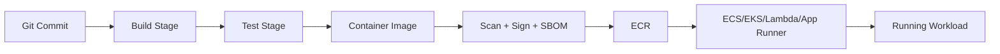
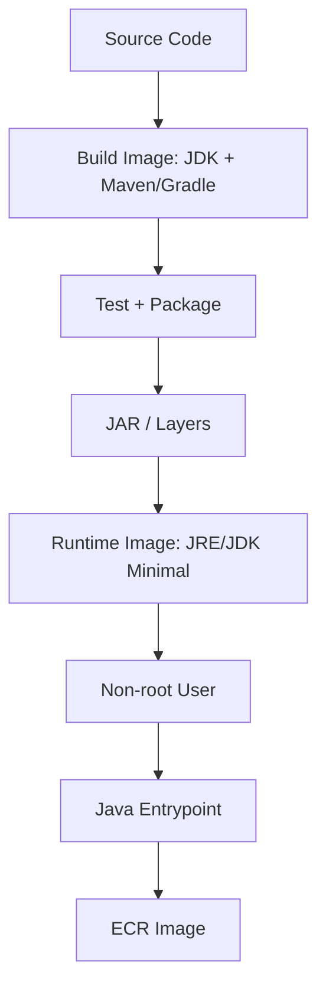
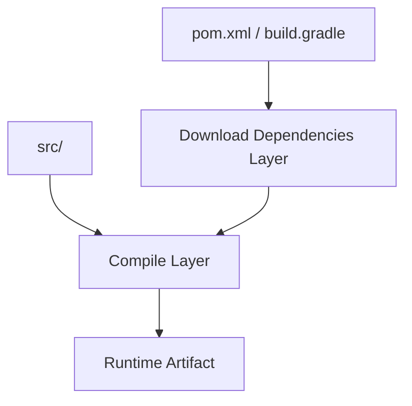
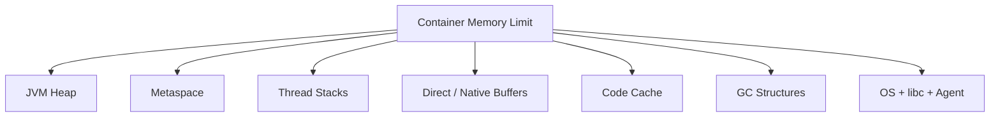

# Part 007 — Production Dockerfile for Java Services

Dockerfile production bukan sekadar file yang membuat aplikasi bisa dijalankan di container. Dockerfile adalah **kontrak supply chain + kontrak runtime awal**.

Dari satu Dockerfile, kamu menentukan:

- artifact apa yang masuk ke production;
- base image mana yang mewariskan CVE, libc, shell, package manager, CA certificate, dan timezone data;
- apakah build reproducible atau bergantung pada state mesin CI;
- apakah image bisa diaudit berdasarkan digest;
- apakah aplikasi berjalan sebagai root atau non-root;
- apakah process Java paham batas memory/cpu container;
- apakah image cocok untuk ECS, EKS, Fargate, App Runner, atau Lambda container image;
- apakah rollback benar-benar mengembalikan artifact yang sama.

Engineer yang kuat tidak menulis Dockerfile hanya dengan tujuan “image berhasil build”. Ia menulis Dockerfile sebagai unit operasional yang bisa di-debug, di-scan, di-upgrade, dan dipertanggungjawabkan.

---

## 1. Mental Model: Dockerfile adalah Release Boundary

Di deployment tradisional, boundary release sering berupa VM image, jar file, atau folder di server.

Di cloud-native production, boundary release biasanya berupa **container image digest**.



Kalau Dockerfile tidak deterministik, maka commit yang sama bisa menghasilkan image yang berbeda. Kalau base image floating, maka rebuild besok bisa membawa OS patch, library baru, atau vulnerability baru tanpa perubahan aplikasi. Kalau tag dipakai sebagai identitas release, maka rollback bisa keliru karena tag bisa berubah.

Prinsip production:

> Build once, identify by digest, promote the same artifact, deploy by immutable reference.

Tag berguna untuk manusia. Digest berguna untuk sistem.

---

## 2. Invariant Dockerfile Production

Dockerfile production yang baik biasanya memenuhi invariant berikut.

| Invariant | Makna |
|---|---|
| Artifact minimal | Runtime image hanya membawa file yang dibutuhkan untuk menjalankan aplikasi. |
| Build terpisah dari runtime | Compiler, Maven cache, Gradle cache, test tool, dan source code tidak ikut ke image runtime. |
| Non-root by default | Process aplikasi tidak berjalan sebagai root kecuali ada alasan kuat. |
| Explicit runtime contract | Entrypoint, command, exposed port, working directory, writable directory, dan env default jelas. |
| Container-aware JVM | JVM membaca batas memory/cpu container, bukan host. |
| Cache-friendly | Layer dependency stabil dipisahkan dari layer source code yang sering berubah. |
| Patchable | Base image bisa di-upgrade dengan prosedur jelas. |
| Auditable | Image punya label commit, build time, source, version, dan digest. |
| Cloud-compatible | Cocok dengan ECS/EKS health model, log to stdout/stderr, graceful shutdown, dan read-only assumptions. |
| No hidden mutable state | Tidak bergantung pada file lokal yang tidak tersedia setelah restart. |

Invariant ini lebih penting dari template spesifik.

Template berubah. Invariant bertahan.

---

## 3. Struktur Dockerfile Java yang Benar

Untuk Java service, struktur paling umum:

1. build dependencies;
2. compile/test/package;
3. extract layered artifact bila perlu;
4. copy runtime artifact ke image minimal;
5. create non-root user;
6. define JVM options;
7. define entrypoint.



Yang tidak boleh terjadi:

```Dockerfile
FROM maven:latest
COPY . .
RUN mvn package
CMD java -jar target/app.jar
```

Masalahnya banyak:

- `latest` tidak deterministik;
- Maven, compiler, cache, source code, dan test dependency ikut ke production;
- image besar;
- attack surface besar;
- dependency download tidak cache-friendly;
- biasanya berjalan sebagai root;
- runtime tidak punya metadata release yang jelas;
- sering tidak punya signal handling dan JVM memory tuning yang eksplisit.

---

## 4. Base Image: Pilihan Kecil, Dampak Besar

Base image menentukan pondasi runtime. Untuk Java di AWS, pilihan umum:

| Base Image | Cocok Untuk | Trade-off |
|---|---|---|
| Amazon Corretto | Java workload di AWS yang ingin JDK/JRE OpenJDK production-ready dari AWS | Mudah dipahami, kompatibel baik, patching jelas. |
| Eclipse Temurin | OpenJDK umum lintas environment | Populer, vendor-neutral, pilihan luas. |
| Debian/Ubuntu slim + JRE | Butuh package OS tertentu | Lebih fleksibel, tetapi attack surface bisa lebih besar. |
| Alpine | Image kecil | Musl libc dapat memunculkan isu native dependency/performance/debugging; jangan pilih hanya karena kecil. |
| Distroless | Runtime sangat minimal | Lebih aman/minimal, tetapi debugging shell-less dan operasi perlu disiplin. |
| AWS Lambda Java base image | Lambda container image | Sudah berisi komponen yang dibutuhkan Lambda runtime. |

Jangan mulai dari pertanyaan “mana yang paling kecil?”. Mulai dari pertanyaan:

1. Apakah runtime dependency aplikasi tersedia?
2. Apakah patching base image jelas?
3. Apakah tim bisa debugging saat incident?
4. Apakah scanner security memahami image ini?
5. Apakah workload butuh shell/package manager saat runtime? Biasanya tidak.
6. Apakah environment target ECS/EKS/Lambda punya constraint khusus?

Image kecil bagus. Image yang bisa dioperasikan lebih penting.

---

## 5. Pinning: Tag vs Digest

Di Dockerfile, kamu sering melihat:

```Dockerfile
FROM eclipse-temurin:21-jre
```

Ini lebih baik dari `latest`, tetapi tetap floating. Tag bisa berubah ketika image publisher merilis patch.

Untuk release yang benar-benar ketat, gunakan digest:

```Dockerfile
FROM eclipse-temurin:21-jre@sha256:<digest>
```

Trade-off:

| Strategy | Kelebihan | Risiko |
|---|---|---|
| Floating tag | Mudah mendapat patch | Rebuild tidak deterministik. |
| Version tag | Lebih jelas | Masih bisa berubah. |
| Digest pin | Immutable | Harus punya proses update base image. |

Production maturity bukan berarti selalu digest pin di semua repo sejak hari pertama. Tetapi engineer harus sadar konsekuensinya.

Rekomendasi praktis:

- untuk development: version tag cukup;
- untuk CI release: resolve tag ke digest dan rekam digest;
- untuk regulated production: deploy by digest;
- untuk patching: automated base image update + scan + test + promotion.

---

## 6. Multi-stage Build untuk Maven

Contoh berikut adalah baseline yang cukup sehat untuk banyak Java service.

```Dockerfile
# syntax=docker/dockerfile:1.7

FROM maven:3.9-eclipse-temurin-21 AS build
WORKDIR /workspace

# Copy build descriptors first to maximize dependency cache reuse.
COPY pom.xml ./
COPY .mvn .mvn
COPY mvnw ./

RUN ./mvnw -B -ntp dependency:go-offline

COPY src ./src

RUN ./mvnw -B -ntp clean package -DskipTests=false

FROM eclipse-temurin:21-jre AS runtime
WORKDIR /app

RUN groupadd --system app && useradd --system --gid app --home-dir /app app

COPY --from=build /workspace/target/*.jar /app/app.jar

RUN chown -R app:app /app

USER app

ENV JAVA_OPTS="-XX:MaxRAMPercentage=75 -XX:+ExitOnOutOfMemoryError"

EXPOSE 8080

ENTRYPOINT ["sh", "-c", "exec java $JAVA_OPTS -jar /app/app.jar"]
```

Ini sudah lebih baik dari single-stage build. Tetapi masih ada keputusan yang perlu kamu pahami.

### Kenapa `pom.xml` dicopy dulu?

Karena dependency lebih jarang berubah daripada source code. Dengan memisahkan layer dependency dan source, Docker build cache lebih efektif.



Kalau kamu `COPY . .` sebelum dependency download, setiap perubahan source invalidasi layer dependency. CI menjadi lambat dan lebih flakey.

### Kenapa `-ntp`?

`-ntp` mengurangi noise transfer progress Maven. Log CI lebih mudah dibaca.

### Kenapa `-DskipTests=false`?

Karena default release build seharusnya menjalankan test. Di banyak pipeline, test dilakukan di stage terpisah. Kalau begitu, Docker build boleh skip tests, tetapi pipeline harus punya bukti test sudah berjalan pada commit yang sama.

---

## 7. Multi-stage Build untuk Gradle

Contoh baseline Gradle:

```Dockerfile
# syntax=docker/dockerfile:1.7

FROM gradle:8.10-jdk21 AS build
WORKDIR /workspace

COPY settings.gradle* build.gradle* gradle.properties* ./
COPY gradle ./gradle

RUN gradle --no-daemon dependencies || true

COPY src ./src

RUN gradle --no-daemon clean build

FROM eclipse-temurin:21-jre AS runtime
WORKDIR /app

RUN groupadd --system app && useradd --system --gid app --home-dir /app app

COPY --from=build /workspace/build/libs/*.jar /app/app.jar

RUN chown -R app:app /app
USER app

ENV JAVA_OPTS="-XX:MaxRAMPercentage=75 -XX:+ExitOnOutOfMemoryError"

EXPOSE 8080
ENTRYPOINT ["sh", "-c", "exec java $JAVA_OPTS -jar /app/app.jar"]
```

Catatan penting: `gradle dependencies || true` kadang dipakai untuk memanaskan cache, tetapi tidak semua project cocok. Untuk production pipeline yang ketat, lebih baik gunakan BuildKit cache mount daripada hack yang menyembunyikan error.

---

## 8. BuildKit Cache Mount

BuildKit memungkinkan cache dependency tanpa memasukkan cache itu ke image runtime.

Maven:

```Dockerfile
# syntax=docker/dockerfile:1.7

FROM maven:3.9-eclipse-temurin-21 AS build
WORKDIR /workspace

COPY pom.xml ./
COPY .mvn .mvn
COPY mvnw ./

RUN --mount=type=cache,target=/root/.m2 \
    ./mvnw -B -ntp dependency:go-offline

COPY src ./src

RUN --mount=type=cache,target=/root/.m2 \
    ./mvnw -B -ntp clean package
```

Gradle:

```Dockerfile
# syntax=docker/dockerfile:1.7

FROM gradle:8.10-jdk21 AS build
WORKDIR /workspace

COPY settings.gradle* build.gradle* gradle.properties* ./
COPY gradle ./gradle

RUN --mount=type=cache,target=/home/gradle/.gradle \
    gradle --no-daemon dependencies || true

COPY src ./src

RUN --mount=type=cache,target=/home/gradle/.gradle \
    gradle --no-daemon clean build
```

Cache mount mempercepat build tanpa mencemari final image. Ini penting untuk CI/CD besar karena image runtime harus bersih, tetapi pipeline tetap perlu cepat.

---

## 9. Spring Boot Layered JAR

Spring Boot dapat membuat layered jar. Layering berguna karena dependency jar biasanya jarang berubah, sedangkan application classes sering berubah.

Dengan layered jar, runtime image bisa punya layer yang lebih cache-friendly.

```Dockerfile
# syntax=docker/dockerfile:1.7

FROM maven:3.9-eclipse-temurin-21 AS build
WORKDIR /workspace
COPY pom.xml ./
COPY src ./src
RUN mvn -B -ntp clean package -DskipTests

FROM eclipse-temurin:21-jre AS extract
WORKDIR /workspace
COPY --from=build /workspace/target/*.jar app.jar
RUN java -Djarmode=layertools -jar app.jar extract

FROM eclipse-temurin:21-jre AS runtime
WORKDIR /app

RUN groupadd --system app && useradd --system --gid app --home-dir /app app

COPY --from=extract /workspace/dependencies/ ./
COPY --from=extract /workspace/spring-boot-loader/ ./
COPY --from=extract /workspace/snapshot-dependencies/ ./
COPY --from=extract /workspace/application/ ./

RUN chown -R app:app /app
USER app

ENV JAVA_OPTS="-XX:MaxRAMPercentage=75 -XX:+ExitOnOutOfMemoryError"
EXPOSE 8080
ENTRYPOINT ["sh", "-c", "exec java $JAVA_OPTS org.springframework.boot.loader.launch.JarLauncher"]
```

Manfaat:

- dependency layer tidak berubah saat hanya business code berubah;
- pull image di node/task baru bisa lebih cepat bila layer sudah cache;
- vulnerability attribution lebih mudah;
- rebuild lebih efisien.

Tetapi jangan menganggap layered jar otomatis membuat aplikasi cepat. Startup Spring tetap ditentukan oleh dependency graph, classpath scanning, configuration, reflection, JIT behavior, dan cold path initialization.

---

## 10. JRE vs JDK di Runtime Image

Runtime Java service umumnya tidak butuh compiler. JRE cukup.

Tetapi beberapa kasus butuh JDK di runtime:

- aplikasi melakukan dynamic compilation;
- tool diagnostic tertentu diperlukan;
- framework/plugin membutuhkan `tools.jar`-like capability pada versi lama;
- kamu ingin debugging dengan tools JDK di container image yang sama.

Trade-off:

| Runtime | Kelebihan | Risiko |
|---|---|---|
| JRE | Lebih kecil, attack surface lebih kecil | Diagnostic tool lebih terbatas. |
| JDK | Lebih lengkap untuk troubleshooting | Image lebih besar, surface lebih luas. |
| Distroless Java | Minimal dan hardened | Tidak ada shell/package manager; debugging perlu cara lain. |

Untuk platform matang, pola yang sering dipakai:

- production image minimal;
- debug image terpisah atau ephemeral debug container;
- observability cukup kuat sehingga tidak perlu shell di image runtime.

Jangan memasukkan semua tool debugging ke production image hanya karena “siapa tahu perlu”. Itu tanda observability dan incident tooling belum matang.

---

## 11. Non-root User

Container bukan security boundary sempurna. Menjalankan process sebagai root di container tetap memperbesar risiko jika ada escape, mount salah, atau permission salah.

Pattern dasar:

```Dockerfile
RUN groupadd --system app && useradd --system --gid app --home-dir /app app
RUN chown -R app:app /app
USER app
```

Pada image yang tidak punya `groupadd/useradd`, gunakan mekanisme base image tersebut. Distroless biasanya menyediakan user non-root tertentu atau kamu bisa menggunakan UID numerik.

```Dockerfile
USER 65532:65532
```

Hal yang sering rusak setelah non-root:

- aplikasi menulis ke `/tmp` tetapi permission tidak sesuai;
- aplikasi menulis log file lokal;
- framework membuat cache di home directory;
- port <1024 membutuhkan privileged bind;
- certificate store atau font cache perlu akses read;
- heap dump diarahkan ke directory yang tidak writable.

Solusi bukan kembali ke root. Solusi adalah mendefinisikan writable path secara eksplisit.

```Dockerfile
RUN mkdir -p /app/tmp /app/logs /app/dumps \
    && chown -R app:app /app

ENV TMPDIR=/app/tmp
ENV JAVA_TOOL_OPTIONS="-XX:HeapDumpPath=/app/dumps"
```

Di ECS/EKS, lebih baik log ke stdout/stderr. File log lokal membuat observability lebih rapuh kecuali memang ada sidecar/agent yang membacanya.

---

## 12. Filesystem: Treat Runtime as Mostly Read-only

Container runtime yang sehat menganggap filesystem image sebagai immutable. Aplikasi boleh menulis hanya ke tempat yang memang dirancang writable.

Kategori file:

| Lokasi | Seharusnya |
|---|---|
| `/app` | Artifact aplikasi read-only setelah startup. |
| `/tmp` atau custom tmp | Temporary scratch. |
| Mounted volume | State eksplisit, bukan state tersembunyi. |
| stdout/stderr | Log utama. |
| env/secrets mount | Config/secrets runtime. |

Anti-pattern:

```txt
/app/config.yaml modified at runtime
/app/logs/app.log as primary log
/app/uploads as durable storage
/root/.cache generated by non-root app
```

Kalau state penting, jangan simpan dalam container filesystem. Di ECS/Fargate, task restart dapat memindahkan workload ke tempat lain. Di EKS, pod reschedule juga dapat kehilangan ephemeral filesystem. Di Lambda, `/tmp` bersifat ephemeral per execution environment dan tidak boleh dianggap durable.

---

## 13. JVM Container Awareness

JVM modern memahami cgroup/container limit. Tetapi production engineer tetap perlu mengatur memory budget secara eksplisit.

Memory container bukan hanya heap.



Kalau kamu mengatur heap terlalu dekat dengan memory limit, container bisa mati karena OOM meskipun heap belum penuh.

Baseline aman untuk banyak service:

```Dockerfile
ENV JAVA_OPTS="-XX:MaxRAMPercentage=70 -XX:InitialRAMPercentage=25 -XX:+ExitOnOutOfMemoryError"
```

Aturan praktis:

| Workload | MaxRAMPercentage awal |
|---|---:|
| HTTP API biasa | 60–75% |
| Banyak native/direct buffer | 50–65% |
| Banyak thread | 50–65% |
| Batch memory-heavy | Benchmark, jangan tebak |
| Lambda Java | Tuning berbeda; memory setting Lambda juga menentukan CPU allocation |

`-XX:+ExitOnOutOfMemoryError` penting karena service yang sudah OOM sering berada pada kondisi rusak. Lebih baik mati dan diganti scheduler daripada terus hidup dalam keadaan corrupt/limping.

Tetapi jangan pakai flag ini tanpa idempotency dan readiness yang benar. Restart loop tanpa memperbaiki penyebab tetap incident.

---

## 14. CPU Quota dan JVM

Container CPU di ECS/Fargate/EKS memengaruhi throughput, latency, GC, dan thread scheduling.

Kesalahan umum:

- heap cukup, tapi CPU terlalu kecil sehingga GC membuat latency spike;
- thread pool terlalu besar dibanding CPU quota;
- Java parallelism default membaca CPU host atau environment tidak sesuai;
- request CPU di Kubernetes terlalu rendah sehingga pod throttled;
- Fargate CPU/memory size dipilih berdasarkan feeling, bukan load test.

Tuning awal:

```txt
JAVA_OPTS="
  -XX:MaxRAMPercentage=70
  -XX:+ExitOnOutOfMemoryError
  -Djava.util.concurrent.ForkJoinPool.common.parallelism=4
"
```

Nilai parallelism harus mengikuti CPU allocation. Jangan copy paste.

Untuk EKS, CPU request/limit harus dipahami sebagai scheduling contract dan throttling boundary. Untuk ECS/Fargate, CPU unit/task size memengaruhi resource yang tersedia bagi container.

---

## 15. `JAVA_OPTS` vs `JAVA_TOOL_OPTIONS`

Ada dua pola umum.

### `JAVA_OPTS`

```Dockerfile
ENV JAVA_OPTS="-XX:MaxRAMPercentage=70"
ENTRYPOINT ["sh", "-c", "exec java $JAVA_OPTS -jar /app/app.jar"]
```

Kelebihan: eksplisit di entrypoint.

Kekurangan: perlu shell agar env var expand, atau perlu script entrypoint.

### `JAVA_TOOL_OPTIONS`

```Dockerfile
ENV JAVA_TOOL_OPTIONS="-XX:MaxRAMPercentage=70 -XX:+ExitOnOutOfMemoryError"
ENTRYPOINT ["java", "-jar", "/app/app.jar"]
```

Kelebihan: JVM membaca otomatis, bisa tetap menggunakan exec-form entrypoint tanpa shell.

Kekurangan: semua JVM process dalam container akan menerima options ini, termasuk tool kecil bila dijalankan.

Untuk service sederhana, `JAVA_TOOL_OPTIONS` sering lebih bersih.

```Dockerfile
ENV JAVA_TOOL_OPTIONS="-XX:MaxRAMPercentage=70 -XX:+ExitOnOutOfMemoryError"
ENTRYPOINT ["java", "-jar", "/app/app.jar"]
```

Kalau butuh logic kompleks, gunakan entrypoint script yang berakhir dengan `exec`, bukan membungkus process Java sebagai child yang tidak menerima signal dengan benar.

Part 008 membahas ini lebih dalam.

---

## 16. Entrypoint Exec Form

Gunakan exec form sebagai default:

```Dockerfile
ENTRYPOINT ["java", "-jar", "/app/app.jar"]
```

Hindari shell form:

```Dockerfile
ENTRYPOINT java -jar /app/app.jar
```

Shell form membuat `/bin/sh -c` menjadi process utama. Signal handling dapat menjadi salah. Di ECS/EKS, saat task/pod dihentikan, runtime mengirim signal ke process utama. Kalau process utama adalah shell yang tidak forward signal dengan benar, aplikasi tidak sempat graceful shutdown.

Kalau harus pakai shell untuk env expansion:

```Dockerfile
ENTRYPOINT ["sh", "-c", "exec java $JAVA_OPTS -jar /app/app.jar"]
```

Kata `exec` penting. Tanpa `exec`, Java menjadi child process.

---

## 17. Health Check Tidak Harus di Dockerfile

Docker punya instruksi `HEALTHCHECK`, tetapi di AWS sering lebih baik health check didefinisikan di platform:

- ECS task definition health check;
- ALB target group health check;
- Kubernetes liveness/readiness/startup probe;
- App Runner health check configuration.

Kenapa?

Karena health semantics sering environment-specific. Port internal, path readiness, timeout, dan startup period bisa berbeda antar deployment.

Namun Dockerfile tetap perlu mendukung health check dengan menyediakan endpoint yang benar.

Minimal endpoint:

| Endpoint | Makna |
|---|---|
| `/live` | Process masih hidup dan tidak deadlocked fatal. |
| `/ready` | Service siap menerima traffic. Dependency kritis tersedia atau mode degradasi siap. |
| `/started` | Startup selesai; berguna untuk aplikasi lambat. |

Jangan membuat `/ready` selalu return 200 hanya karena aplikasi process hidup. Itu mengkhianati scheduler.

---

## 18. Logging: stdout/stderr sebagai Kontrak

Container production harus menulis log utama ke stdout/stderr.

```txt
application log --> stdout/stderr --> runtime log driver --> CloudWatch / Fluent Bit / OpenTelemetry collector
```

Anti-pattern:

```txt
/app/logs/app.log
```

File log lokal:

- hilang saat container mati;
- tidak otomatis masuk CloudWatch;
- perlu sidecar/agent;
- dapat memenuhi disk ephemeral;
- mempersulit correlation.

Untuk Java:

- gunakan structured JSON logs bila sistem observability mendukung;
- sertakan correlation ID/trace ID;
- jangan log secrets;
- jangan log payload besar tanpa sampling;
- pisahkan business audit event dari debug log.

---

## 19. Label Image untuk Audit

Tambahkan OCI labels.

```Dockerfile
ARG VCS_REF
ARG BUILD_DATE
ARG VERSION

LABEL org.opencontainers.image.source="https://example.com/org/repo" \
      org.opencontainers.image.revision="$VCS_REF" \
      org.opencontainers.image.created="$BUILD_DATE" \
      org.opencontainers.image.version="$VERSION" \
      org.opencontainers.image.title="orders-service"
```

CI bisa mengisi:

```bash
docker build \
  --build-arg VCS_REF=$(git rev-parse HEAD) \
  --build-arg BUILD_DATE=$(date -u +%Y-%m-%dT%H:%M:%SZ) \
  --build-arg VERSION=$VERSION \
  -t orders-service:$VERSION .
```

Label bukan pengganti SBOM/signature, tetapi mempercepat investigasi.

Saat incident, pertanyaan pertama bukan “versi apa?”. Pertanyaan pertama adalah:

> Digest apa yang sedang berjalan, dibangun dari commit mana, dengan base image apa, dan dipromosikan oleh pipeline mana?

---

## 20. `.dockerignore` adalah Security Control

Tanpa `.dockerignore`, build context bisa membawa file yang tidak seharusnya masuk build daemon.

Contoh `.dockerignore`:

```txt
.git
.github
.idea
.vscode
node_modules
target
build
.gradle
.mvn/wrapper/maven-wrapper.jar.tmp
*.log
.env
.env.*
secrets
*.pem
*.key
coverage
.DS_Store
```

Masalah umum:

- secret lokal ikut build context;
- `.git` membuat context besar;
- target/build lama membuat hasil build salah;
- file environment lokal tersalin ke image;
- CI menjadi lambat karena context besar.

`.dockerignore` bukan optimasi kecil. Ini boundary antara workspace developer/CI dan artifact production.

---

## 21. Image Size: Jangan Fanatik, tapi Jangan Boros

Image besar berdampak pada:

- waktu push ke ECR;
- waktu pull saat scale-out;
- cold start untuk workload tertentu;
- storage registry;
- scan time;
- attack surface;
- node disk pressure pada EKS/ECS on EC2.

Tetapi image terlalu minimal juga bisa menyulitkan:

- debugging;
- timezone/certificate issue;
- native dependency;
- shell-less incident handling;
- compliance scanner compatibility.

Rule of thumb:

> Kurangi image dengan menghapus yang tidak perlu, bukan dengan mengorbankan operability yang kamu butuhkan.

Yang biasanya aman dihapus dari runtime:

- source code;
- build tool;
- test dependency;
- package manager cache;
- Maven/Gradle cache;
- documentation;
- temporary files;
- shell utilities yang tidak dipakai bila pakai distroless.

---

## 22. Lambda Container Image untuk Java

Lambda container image bukan “ECS task kecil”. Runtime contract-nya berbeda.

Lambda container image harus memenuhi kontrak Lambda Runtime API. Cara paling mudah adalah memakai AWS-provided Lambda base image untuk Java.

Contoh konseptual:

```Dockerfile
FROM public.ecr.aws/lambda/java:21

COPY target/function.jar ${LAMBDA_TASK_ROOT}/lib/function.jar

CMD ["com.example.Handler::handleRequest"]
```

Jika memakai alternative base image, kamu harus menyertakan Lambda Runtime Interface Client.

Perbedaan penting dengan ECS/EKS:

| Aspek | ECS/EKS Java Service | Lambda Java Container Image |
|---|---|---|
| Entry point | Long-running server process | Lambda runtime handler |
| Traffic model | Connection/request to service | Invocation event |
| Shutdown | Task/pod stop signal | Execution environment lifecycle |
| Scaling | Tasks/pods | Concurrent execution environments |
| Port | Biasanya expose HTTP port | Tidak expose service port untuk invocation |
| Runtime state | Process long-lived | Execution environment reusable tetapi tidak durable |

Jangan mengambil Dockerfile ECS Spring Boot lalu berharap otomatis menjadi Lambda image yang baik. Kontraknya berbeda.

---

## 23. ECS/Fargate Dockerfile Considerations

Untuk ECS/Fargate:

- log ke stdout/stderr;
- process harus graceful terhadap SIGTERM;
- jangan butuh privileged mode;
- jangan asumsi host filesystem;
- jangan hardcode port bila task definition memetakan berbeda;
- startup harus kompatibel dengan health check start period;
- image harus bisa dipull dari ECR via network path yang tersedia;
- non-root kecuali ada kebutuhan khusus;
- memory budget harus cocok dengan task memory.

Dockerfile tidak mendefinisikan semua hal ini, tetapi Dockerfile harus tidak menghambat.

Contoh masalah:

```Dockerfile
USER app
ENTRYPOINT ["java", "-jar", "/app/app.jar"]
```

Aplikasi mencoba menulis heap dump ke `/`. Saat OOM, heap dump gagal. Investigasi kehilangan evidence.

Lebih baik:

```Dockerfile
RUN mkdir -p /app/dumps && chown -R app:app /app/dumps
ENV JAVA_TOOL_OPTIONS="-XX:HeapDumpPath=/app/dumps -XX:+ExitOnOutOfMemoryError"
```

Tetapi untuk production, pikirkan juga apakah heap dump besar akan memenuhi ephemeral storage. Kadang lebih baik JFR sampling + metrics + controlled diagnostic endpoint.

---

## 24. EKS Dockerfile Considerations

Untuk EKS:

- image harus berjalan baik dengan arbitrary UID bila cluster memakai restricted security context;
- jangan bergantung pada root-owned writable directory;
- readiness/liveness harus akurat;
- startup lambat harus memakai startupProbe, bukan liveness yang membunuh terlalu cepat;
- container harus handle SIGTERM dalam terminationGracePeriodSeconds;
- image pull policy dan tag strategy harus sinkron dengan immutable release;
- jangan memasukkan kubeconfig, AWS credentials, atau secret file ke image.

Kubernetes sering mengatur security context di manifest, bukan Dockerfile. Tetapi Dockerfile harus kompatibel.

Contoh:

```yaml
securityContext:
  runAsNonRoot: true
  runAsUser: 10001
  readOnlyRootFilesystem: true
  allowPrivilegeEscalation: false
```

Kalau image kamu hanya bisa berjalan sebagai root atau perlu menulis ke `/app`, manifest di atas akan gagal. Itu bukan masalah Kubernetes. Itu masalah image contract.

---

## 25. App Runner Dockerfile Considerations

App Runner menyederhanakan banyak operasi web service, tetapi Dockerfile tetap penting:

- service harus listen pada port yang dikonfigurasi;
- startup harus cukup cepat untuk health check;
- log ke stdout/stderr;
- image tidak boleh butuh daemon/background process tambahan;
- config harus via environment/secrets;
- process harus tetap foreground.

Anti-pattern:

```Dockerfile
CMD service nginx start && java -jar app.jar
```

Container production sebaiknya menjalankan satu process utama yang jelas. Kalau butuh reverse proxy, sidecar, atau multi-process supervisor, pertimbangkan apakah App Runner masih compute model yang tepat.

---

## 26. Dockerfile untuk Java Service: Versi Lebih Matang

Berikut baseline yang lebih matang untuk service HTTP Java umum.

```Dockerfile
# syntax=docker/dockerfile:1.7

ARG JAVA_VERSION=21

FROM maven:3.9-eclipse-temurin-${JAVA_VERSION} AS build
WORKDIR /workspace

COPY pom.xml ./
COPY .mvn .mvn
COPY mvnw ./

RUN --mount=type=cache,target=/root/.m2 \
    ./mvnw -B -ntp dependency:go-offline

COPY src ./src

RUN --mount=type=cache,target=/root/.m2 \
    ./mvnw -B -ntp clean package

FROM eclipse-temurin:${JAVA_VERSION}-jre AS runtime

ARG VCS_REF="unknown"
ARG BUILD_DATE="unknown"
ARG VERSION="unknown"

LABEL org.opencontainers.image.title="orders-service" \
      org.opencontainers.image.revision="$VCS_REF" \
      org.opencontainers.image.created="$BUILD_DATE" \
      org.opencontainers.image.version="$VERSION"

WORKDIR /app

RUN groupadd --system app \
    && useradd --system --gid app --home-dir /app app \
    && mkdir -p /app/tmp /app/dumps \
    && chown -R app:app /app

COPY --from=build --chown=app:app /workspace/target/*.jar /app/app.jar

USER app

ENV TMPDIR=/app/tmp
ENV JAVA_TOOL_OPTIONS="-XX:MaxRAMPercentage=70 -XX:InitialRAMPercentage=25 -XX:+ExitOnOutOfMemoryError -XX:HeapDumpPath=/app/dumps"

EXPOSE 8080

ENTRYPOINT ["java", "-jar", "/app/app.jar"]
```

Ini bukan template final untuk semua kasus. Ini baseline untuk diskusi.

Apa yang sudah baik:

- multi-stage;
- cache dependency;
- runtime image terpisah;
- non-root;
- writable dirs eksplisit;
- JVM options eksplisit;
- exec-form entrypoint;
- metadata image.

Apa yang masih harus disesuaikan:

- base image pinning;
- testing strategy;
- SBOM/signing;
- distroless atau tidak;
- health check di platform;
- read-only root filesystem;
- memory percentage;
- heap dump policy;
- port;
- framework-specific startup tuning.

---

## 27. Distroless Variant

Distroless mengurangi komponen OS yang tidak diperlukan.

Contoh konseptual:

```Dockerfile
FROM maven:3.9-eclipse-temurin-21 AS build
WORKDIR /workspace
COPY pom.xml ./
COPY src ./src
RUN mvn -B -ntp clean package

FROM gcr.io/distroless/java21-debian12:nonroot
WORKDIR /app
COPY --from=build /workspace/target/*.jar /app/app.jar
ENV JAVA_TOOL_OPTIONS="-XX:MaxRAMPercentage=70 -XX:+ExitOnOutOfMemoryError"
EXPOSE 8080
ENTRYPOINT ["java", "-jar", "/app/app.jar"]
```

Kelebihan:

- attack surface lebih kecil;
- tidak ada shell/package manager;
- cocok dengan immutable runtime;
- mendorong observability yang benar.

Konsekuensi:

- tidak bisa `sh` ke container;
- debug harus lewat logs/metrics/traces, ephemeral debug container, atau debug image;
- CA/timezone/native dependency perlu dipastikan;
- scanner/policy harus kompatibel.

Gunakan distroless ketika tim sudah siap secara operasional. Jangan gunakan hanya untuk terlihat “secure”.

---

## 28. Custom Runtime dengan `jlink`

Untuk service tertentu, kamu bisa membuat custom Java runtime dengan `jlink`.

```Dockerfile
FROM eclipse-temurin:21-jdk AS jre-build
RUN $JAVA_HOME/bin/jlink \
    --add-modules java.base,java.logging,java.naming,java.sql,java.management,jdk.crypto.ec \
    --strip-debug \
    --no-man-pages \
    --no-header-files \
    --compress=2 \
    --output /custom-jre

FROM maven:3.9-eclipse-temurin-21 AS app-build
WORKDIR /workspace
COPY pom.xml ./
COPY src ./src
RUN mvn -B -ntp clean package

FROM debian:bookworm-slim AS runtime
ENV JAVA_HOME=/opt/java/openjdk
ENV PATH="$JAVA_HOME/bin:$PATH"
COPY --from=jre-build /custom-jre $JAVA_HOME
WORKDIR /app
COPY --from=app-build /workspace/target/*.jar /app/app.jar
ENTRYPOINT ["java", "-jar", "/app/app.jar"]
```

Manfaat:

- runtime lebih kecil;
- modul Java eksplisit;
- attack surface Java runtime lebih kecil.

Risiko:

- salah modul menyebabkan runtime failure;
- framework reflection/dynamic feature bisa butuh modul tambahan;
- upgrade JDK lebih kompleks;
- debugging dependency lebih sulit.

Gunakan jika kamu punya alasan kuat: high-scale image pull cost, serverless cold path, compliance hardening, atau platform standardization.

---

## 29. Build-time Secrets

Jangan pernah melakukan ini:

```Dockerfile
ARG GITHUB_TOKEN
RUN git clone https://$GITHUB_TOKEN@github.com/org/private-repo.git
```

Build arg dapat bocor di history/metadata atau log. Gunakan BuildKit secret mount.

```Dockerfile
# syntax=docker/dockerfile:1.7
RUN --mount=type=secret,id=maven_settings,target=/root/.m2/settings.xml \
    mvn -B -ntp package
```

CI:

```bash
docker build \
  --secret id=maven_settings,src=$HOME/.m2/settings.xml \
  -t orders-service .
```

Prinsip:

- secret build tidak boleh menjadi layer;
- secret runtime tidak boleh dibake ke image;
- image harus environment-agnostic;
- promotion dari staging ke production tidak boleh membutuhkan rebuild hanya untuk mengganti secret.

---

## 30. Environment-specific Config Jangan Dibake

Anti-pattern:

```Dockerfile
COPY application-prod.yml /app/application.yml
```

Masalah:

- image production berbeda dari staging;
- promotion artifact tidak murni;
- rollback config menjadi rollback image;
- secret/config bisa bocor;
- audit sulit.

Lebih baik:

- bake default safe config;
- inject environment config via env vars, SSM, Secrets Manager, config map, atau mounted secret;
- validasi config saat startup;
- fail fast jika config wajib tidak ada.

```Dockerfile
ENV SPRING_PROFILES_ACTIVE=default
```

Lalu di ECS/EKS/Lambda, inject config sesuai environment.

---

## 31. Startup Time adalah Deployment Risk

Java service yang startup 90 detik bukan hanya “lambat”. Itu memengaruhi:

- rolling deployment duration;
- autoscaling response;
- ALB health check timing;
- ECS deployment circuit breaker;
- Kubernetes liveness/readiness/startup probes;
- Lambda cold start;
- incident recovery.

Dockerfile tidak menyelesaikan semua startup problem, tetapi bisa memperburuk:

- image terlalu besar;
- dependency terlalu banyak;
- dynamic classpath scanning;
- shell wrapper berat;
- runtime download dependency saat startup;
- migration DB berjalan otomatis di app startup tanpa guardrail;
- framework devtools ikut production.

Production rule:

> Container startup must not perform unbounded external work.

Contoh berbahaya:

```txt
startup -> download config from internet -> run migration -> warm cache from DB -> call 5 downstream services -> then ready
```

Kalau semua ini wajib, pecah menjadi lifecycle yang eksplisit:

- init job;
- migration pipeline;
- readiness with bounded dependency checks;
- async cache warmup;
- degraded mode.

---

## 32. Container Image untuk Worker Java

Worker berbeda dari HTTP API.

Dockerfile bisa sama, tetapi runtime contract berbeda:

- tidak perlu `EXPOSE` port kecuali ada management endpoint;
- health check harus merepresentasikan ability consume work;
- graceful shutdown harus stop polling, finish/extend current message, lalu exit;
- memory tuning harus mengikuti batch size;
- logging harus menyertakan message ID/correlation ID.

Contoh entrypoint tetap sama:

```Dockerfile
ENTRYPOINT ["java", "-jar", "/app/worker.jar"]
```

Tetapi env berbeda:

```txt
WORKER_MAX_IN_FLIGHT=16
WORKER_POLL_WAIT_SECONDS=20
WORKER_SHUTDOWN_GRACE_SECONDS=25
```

Untuk SQS worker di ECS/Fargate, batch size dan visibility timeout harus sinkron dengan graceful shutdown. Kalau container mati saat message sedang diproses, message akan kembali visible dan bisa diproses ulang. Maka idempotency wajib.

---

## 33. Anti-pattern Dockerfile Java

### 33.1 Menggunakan `latest`

```Dockerfile
FROM openjdk:latest
```

Masalah: tidak deterministik.

### 33.2 Build dan runtime satu stage

```Dockerfile
FROM maven:3.9
COPY . .
RUN mvn package
CMD java -jar target/app.jar
```

Masalah: runtime membawa tool build dan source.

### 33.3 Secret dibake ke image

```Dockerfile
COPY prod.key /app/prod.key
```

Masalah: image registry menjadi secret store tidak sengaja.

### 33.4 Aplikasi berjalan sebagai root

```Dockerfile
USER root
```

Masalah: permission terlalu luas.

### 33.5 Runtime download dependency

```Dockerfile
CMD ./download-libs.sh && java -jar app.jar
```

Masalah: startup bergantung network eksternal dan tidak reproducible.

### 33.6 Shell wrapper tanpa `exec`

```sh
#!/bin/sh
java $JAVA_OPTS -jar /app/app.jar
```

Masalah: shell menjadi PID 1; signal bisa tidak sampai ke Java.

### 33.7 Health endpoint palsu

```txt
/health -> always 200
```

Masalah: scheduler mengirim traffic ke service yang belum siap.

---

## 34. Failure Modes

| Failure | Penyebab Dockerfile/Build | Dampak Production | Mitigasi |
|---|---|---|---|
| Image pull lambat | Image besar, layer buruk | Scale-out lambat, deployment lama | Multi-stage, layer cache, base standardization. |
| CVE tinggi | Base image lama/besar | Release diblokir, risk meningkat | Patch base image, lifecycle rebuild. |
| App mati saat traffic drain | Shell wrapper tidak forward signal | 5xx saat deployment | Exec form, graceful shutdown. |
| OOMKilled | Heap terlalu besar untuk container | Restart loop | MaxRAMPercentage, load test. |
| Permission denied | Non-root tanpa writable dirs | Startup gagal | Explicit writable dirs, chown/copy --chown. |
| Config salah environment | Config dibake ke image | Artifact tidak promotable | Runtime config injection. |
| Secret bocor | Secret masuk layer/context | Incident security | .dockerignore, BuildKit secrets. |
| Debug impossible | Image terlalu minimal tanpa telemetry | MTTR tinggi | Observability, debug image, ephemeral containers. |
| Rollback tidak valid | Deploy by mutable tag | Rollback image salah | Deploy by digest, immutable tags. |

---

## 35. Production Checklist

Sebelum image Java masuk production, jawab ini:

### Build

- Apakah build multi-stage?
- Apakah dependency cache tidak masuk runtime image?
- Apakah test dijalankan di pipeline?
- Apakah build tidak bergantung pada state lokal?
- Apakah `.dockerignore` aman?
- Apakah base image dipilih dengan alasan jelas?

### Runtime

- Apakah process berjalan non-root?
- Apakah writable directory eksplisit?
- Apakah log ke stdout/stderr?
- Apakah entrypoint exec-form atau script memakai `exec`?
- Apakah JVM memory aware terhadap container limit?
- Apakah OOM behavior jelas?
- Apakah startup tidak melakukan external work tak terbatas?

### Supply Chain

- Apakah image discan?
- Apakah image punya label commit/version?
- Apakah SBOM dibuat?
- Apakah tag immutable atau digest direkam?
- Apakah base image update punya proses?
- Apakah secret tidak masuk image/build context?

### AWS Compatibility

- Apakah cocok dengan ECS/EKS/Lambda/App Runner runtime contract?
- Apakah health/readiness endpoint tersedia?
- Apakah port sesuai platform?
- Apakah graceful shutdown diuji?
- Apakah image pull path dari ECR tersedia?
- Apakah memory/cpu sizing diuji dengan load test?

---

## 36. Design Review Questions

Gunakan pertanyaan ini saat review Dockerfile tim.

1. Apa artifact final yang masuk image?
2. Apakah image runtime membawa tool yang tidak diperlukan?
3. Kalau base image berubah, siapa tahu dan pipeline apa yang memvalidasi?
4. Apakah image yang sama dipromosikan dari staging ke production?
5. Kalau task dihentikan, apakah Java process menerima signal?
6. Kalau service OOM, apakah ia mati jelas atau limping?
7. Apakah log dapat dibaca tanpa masuk container?
8. Apakah container bisa berjalan dengan read-only root filesystem?
9. Apakah image bisa berjalan sebagai arbitrary non-root UID?
10. Apakah image punya metadata commit/digest/version?
11. Apakah startup time diukur?
12. Apakah health endpoint membedakan live dan ready?
13. Apakah secret pernah masuk build context?
14. Apakah image size memengaruhi scale-out target?
15. Apakah Dockerfile sama untuk ECS/EKS dan Lambda padahal runtime contract-nya berbeda?

---

## 37. Minimal Recommended Baseline

Kalau harus memilih baseline sederhana untuk banyak Java service:

```txt
- Java 21 LTS runtime
- multi-stage build
- runtime JRE/minimal image
- non-root user
- stdout/stderr logging
- JAVA_TOOL_OPTIONS with MaxRAMPercentage and ExitOnOutOfMemoryError
- exec-form ENTRYPOINT
- .dockerignore
- OCI labels
- no baked secrets/config
- image scan in ECR/CI
- deploy by digest in production
```

Ini bukan “top 1%” karena canggih. Ini top-tier karena invariant-nya benar.

---

## 38. What You Should Internalize

Dockerfile adalah tempat pertama kamu membentuk perilaku production workload.

Image yang baik bukan hanya kecil. Image yang baik adalah:

- bisa dibangun ulang secara terkendali;
- bisa dipromosikan tanpa rebuild;
- bisa dipindai dan diaudit;
- bisa berjalan tanpa root;
- bisa mati dengan benar;
- bisa membaca batas resource container;
- bisa diamati tanpa shell;
- bisa dioperasikan oleh scheduler cloud.

Kalau Dockerfile salah, ECS/EKS/Lambda tidak menyelamatkanmu. Platform hanya menjalankan kontrak yang kamu berikan.

Part berikutnya akan membedah kontrak paling sering dilupakan: **entrypoint, PID 1, process lifecycle, signal handling, dan health model**.

---

## References

- Docker Docs — Multi-stage builds: https://docs.docker.com/build/building/multi-stage/
- Docker Docs — Building best practices: https://docs.docker.com/build/building/best-practices/
- AWS Lambda Developer Guide — Create a Lambda function using a container image: https://docs.aws.amazon.com/lambda/latest/dg/images-create.html
- AWS Lambda Developer Guide — Deploy Java Lambda functions with container images: https://docs.aws.amazon.com/lambda/latest/dg/java-image.html
- Amazon ECS Developer Guide — Task definition parameters: https://docs.aws.amazon.com/AmazonECS/latest/developerguide/task_definition_parameters.html
- Amazon ECS Developer Guide — Health checks: https://docs.aws.amazon.com/AmazonECS/latest/developerguide/healthcheck.html
