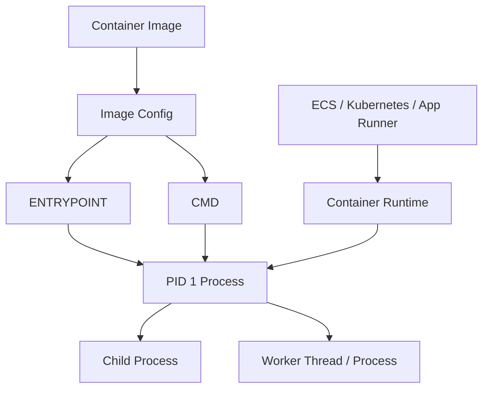
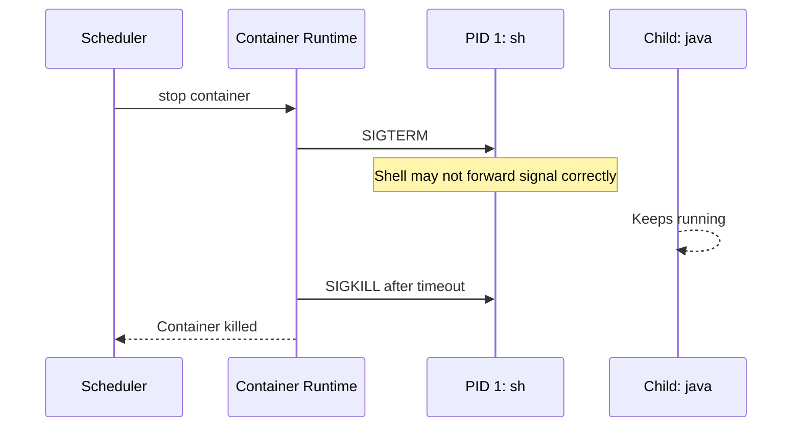
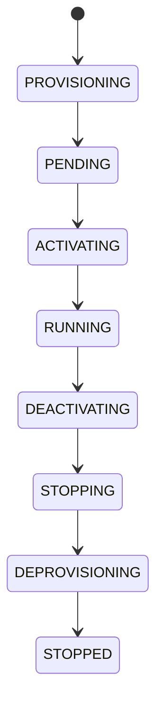
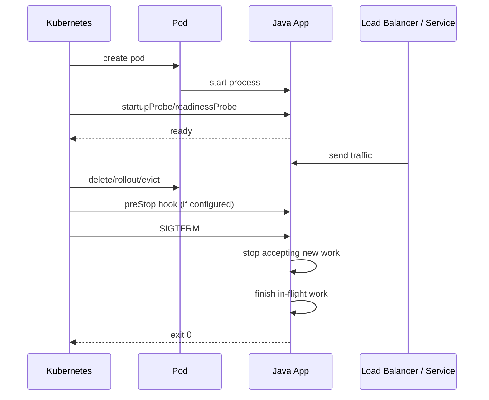
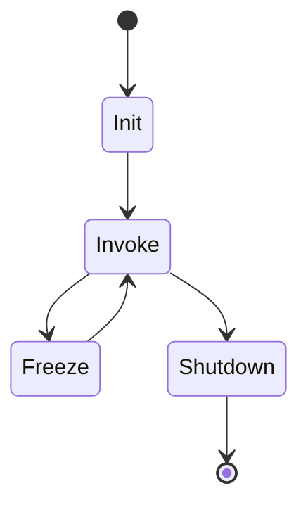
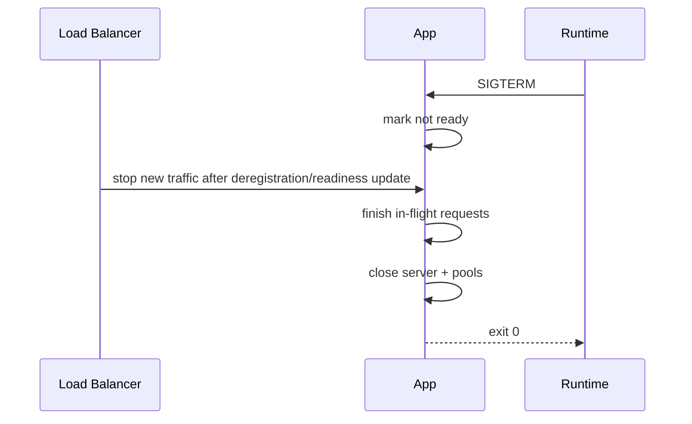
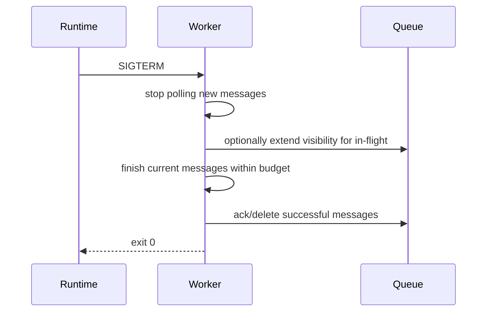
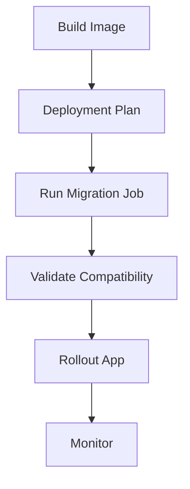

# Part 008 — Container Entrypoint and Process Model

Banyak container terlihat sehat sampai deployment pertama yang ramai traffic.

Lalu muncul 5xx saat rolling update. Worker memproses message dua kali. Pod tidak pernah ready. ECS task stuck draining. Lambda container image start lambat. Aplikasi tidak sempat flush telemetry. Database connection bocor. Scheduler membunuh process karena health check salah.

Penyebabnya sering bukan AWS. Penyebabnya adalah kontrak process yang buruk.

Container bukan VM kecil. Container pada akhirnya adalah **satu process tree** dengan process utama, signal, exit code, filesystem, network namespace, cgroup, dan lifecycle yang dikendalikan runtime.

Kalau kamu tidak memahami process model, kamu tidak benar-benar memahami container production.

---

## 1. Mental Model: Container adalah Process Contract

Container image membawa filesystem dan metadata. Container runtime menjalankan process dari metadata itu.



Scheduler tidak bicara ke framework Java-mu secara ajaib. Scheduler bicara ke container runtime. Runtime mengirim signal ke process utama. Health check membaca endpoint atau command. Exit code memberi tahu apakah process sukses atau gagal.

Kontrak dasarnya:

| Elemen | Pertanyaan Production |
|---|---|
| Entrypoint | Process apa yang benar-benar dijalankan pertama? |
| PID 1 | Siapa menerima signal stop? |
| Signal handling | Apakah SIGTERM diterima dan diproses? |
| Exit code | Apakah failure keluar dengan code non-zero? |
| Health check | Apakah scheduler tahu service siap atau rusak? |
| Shutdown | Apakah request/message selesai sebelum mati? |
| Logs | Apakah output masuk stdout/stderr? |
| State | Apakah ada state yang hilang saat restart? |

---

## 2. ENTRYPOINT dan CMD

Docker punya dua instruksi yang sering membingungkan:

| Instruksi | Fungsi |
|---|---|
| `ENTRYPOINT` | Executable utama container. |
| `CMD` | Default arguments untuk entrypoint atau command default jika entrypoint tidak ada. |

Contoh:

```Dockerfile
ENTRYPOINT ["java", "-jar", "/app/app.jar"]
```

Atau:

```Dockerfile
ENTRYPOINT ["java", "-jar"]
CMD ["/app/app.jar"]
```

Untuk service production, bentuk pertama sering lebih jelas.

Untuk image reusable sebagai tool, kombinasi ENTRYPOINT + CMD bisa berguna.

---

## 3. Exec Form vs Shell Form

Ada dua bentuk.

### Exec form

```Dockerfile
ENTRYPOINT ["java", "-jar", "/app/app.jar"]
```

Process utama adalah `java`.

### Shell form

```Dockerfile
ENTRYPOINT java -jar /app/app.jar
```

Process utama adalah shell, kira-kira:

```txt
/bin/sh -c "java -jar /app/app.jar"
```

Ini penting karena signal dikirim ke process utama. Kalau shell menjadi PID 1 dan tidak meneruskan signal dengan benar, Java tidak sempat graceful shutdown.

Gunakan exec form sebagai default.

---

## 4. Kenapa PID 1 Spesial

Di Linux, process dengan PID 1 punya perilaku khusus. Ia menjadi init process dalam namespace container. Ia bertanggung jawab menangani signal dan me-reap zombie process.

Dalam container, kalau Java langsung menjadi PID 1:

```txt
PID 1 = java
```

Maka Java menerima signal stop langsung.

Kalau shell menjadi PID 1:

```txt
PID 1 = sh
PID 7 = java
```

Maka runtime mengirim signal ke shell. Java mungkin tidak menerima signal. Container bisa menunggu sampai timeout lalu dipaksa mati.



Inilah kenapa `exec` penting dalam entrypoint script.

---

## 5. Shell Wrapper yang Benar

Kadang kamu butuh shell script untuk:

- render config dari env;
- memilih JVM flags;
- melakukan preflight validation;
- menunggu dependency lokal;
- menyiapkan directory;
- migrasi ringan yang bounded;
- menjalankan command berbeda berdasarkan mode.

Script boleh, tetapi harus berakhir dengan `exec`.

```sh
#!/usr/bin/env sh
set -eu

: "${APP_PORT:=8080}"
: "${JAVA_OPTS:=}"

if [ -z "${DATABASE_URL:-}" ]; then
  echo "DATABASE_URL is required" >&2
  exit 1
fi

exec java $JAVA_OPTS -jar /app/app.jar
```

Dockerfile:

```Dockerfile
COPY docker-entrypoint.sh /app/docker-entrypoint.sh
RUN chmod +x /app/docker-entrypoint.sh
ENTRYPOINT ["/app/docker-entrypoint.sh"]
```

Karena script memakai `exec`, process shell diganti oleh Java. Java menjadi PID 1.

Tanpa `exec`:

```sh
java $JAVA_OPTS -jar /app/app.jar
```

Shell tetap menjadi PID 1 dan Java child process.

---

## 6. Kapan Perlu Init Process

Jika container menjalankan beberapa child process atau process yang bisa meninggalkan zombie, kamu mungkin perlu init process seperti `tini` atau runtime option init.

Tetapi untuk Java service sederhana, biasanya tidak perlu.

Gunakan init jika:

- process utama spawn child process eksternal;
- aplikasi menjalankan shell command/subprocess sering;
- ada zombie process di observasi;
- kamu menjalankan multi-process container dengan alasan kuat.

Jangan gunakan init untuk menutupi entrypoint yang salah. Init bukan pengganti graceful shutdown aplikasi.

---

## 7. Satu Container, Satu Process Utama

Container sebaiknya punya satu process utama yang jelas.

Bukan karena container secara teknis tidak bisa menjalankan banyak process. Bisa. Tetapi production ownership menjadi kabur.

Anti-pattern:

```sh
nginx &
java -jar app.jar &
cron -f &
wait
```

Masalah:

- siapa process utama?
- health check mewakili process mana?
- kalau nginx mati, apakah container mati?
- kalau Java mati, apakah container mati?
- bagaimana shutdown order?
- bagaimana log dipisahkan?
- bagaimana resource dibagi?

Lebih baik:

- pisahkan reverse proxy sebagai sidecar jika benar-benar perlu;
- gunakan platform ingress/load balancer;
- jadikan scheduled task sebagai ECS scheduled task, Kubernetes CronJob, EventBridge Scheduler, atau Step Functions;
- jangan menyelundupkan supervisor ke container app kecuali kamu benar-benar mengelola process tree.

---

## 8. Lifecycle di ECS/Fargate

Untuk ECS/Fargate service, lifecycle kasar:



Yang penting untuk aplikasi:

1. task dimulai;
2. container process start;
3. health check menentukan sehat/tidak;
4. load balancer mulai mengirim traffic setelah target healthy;
5. saat deployment/scale-in, target draining;
6. container menerima stop signal;
7. aplikasi harus berhenti menerima work baru;
8. aplikasi menyelesaikan work in-flight;
9. process exit sebelum stop timeout;
10. kalau tidak exit, runtime force kill.

AWS ECS secara umum mengirim SIGTERM lalu menunggu sebelum SIGKILL. Default stop timeout ECS sering diasumsikan 30 detik, dan task definition dapat mengatur `stopTimeout` dalam batas yang didukung platform.

Konsekuensi untuk Java service:

- graceful shutdown harus selesai di bawah stop timeout;
- ALB deregistration delay harus sinkron dengan app shutdown;
- readiness harus turun sebelum process benar-benar mati bila platform memungkinkan;
- request panjang perlu timeout budget;
- worker harus stop polling sebelum stop.

---

## 9. Lifecycle di Kubernetes/EKS

Kubernetes/EKS lifecycle kasar:



Kubernetes punya beberapa konsep penting:

| Konsep | Makna |
|---|---|
| `readinessProbe` | Apakah pod boleh menerima traffic? |
| `livenessProbe` | Apakah pod harus direstart karena rusak? |
| `startupProbe` | Apakah aplikasi masih startup sehingga liveness belum boleh membunuhnya? |
| `terminationGracePeriodSeconds` | Waktu yang diberikan sebelum SIGKILL. |
| `preStop` | Hook sebelum termination signal. |

Kesalahan umum:

- memakai liveness untuk dependency check;
- readiness selalu 200;
- startup lambat tetapi tidak pakai startupProbe;
- terminationGracePeriodSeconds lebih pendek dari request timeout;
- preStop sleep tanpa alasan jelas;
- app tidak menolak work baru saat shutdown.

---

## 10. Lifecycle di App Runner

App Runner menyederhanakan deployment web app/API. Tetapi process contract tetap ada:

- container harus start dan listen pada port yang dikonfigurasi;
- process utama harus foreground;
- health check harus pass;
- logs ke stdout/stderr;
- config via env/secrets;
- saat deployment, instance lama harus berhenti dengan aman.

App Runner cocok ketika kamu ingin lebih sedikit platform detail daripada ECS/EKS. Tetapi ia bukan alasan untuk mengabaikan signal handling, startup time, dan health endpoint.

---

## 11. Lifecycle di Lambda Container Image

Lambda container image berbeda.

Di Lambda:

- container image dipakai untuk membuat execution environment;
- invocation diproses oleh Lambda runtime;
- handler dipanggil untuk event;
- execution environment bisa digunakan ulang;
- global state bisa bertahan antar invocation, tetapi tidak durable;
- tidak ada long-running HTTP server untuk menerima invocation Lambda biasa.



Entrypoint Lambda harus mengikuti Runtime Interface contract. AWS-provided Lambda base image sudah menyiapkan komponen runtime. Jika memakai base image custom, kamu harus menyertakan Runtime Interface Client.

Jangan menyamakan Lambda container image dengan ECS task. Sama-sama image, tetapi runtime contract berbeda.

---

## 12. Signal Handling untuk Java

Java menerima SIGTERM dan biasanya memicu shutdown hooks.

Contoh sederhana:

```java
Runtime.getRuntime().addShutdownHook(new Thread(() -> {
    System.out.println("shutdown started");
    // stop accepting work
    // close server gracefully
    // flush telemetry
    // close resources
    System.out.println("shutdown completed");
}));
```

Framework modern seperti Spring Boot, Micronaut, Quarkus, Helidon, dan Netty-based servers punya mekanisme graceful shutdown masing-masing. Tetapi kamu tetap harus menguji di container runtime target.

Pertanyaan penting:

1. Apakah server berhenti menerima request baru?
2. Apakah request in-flight diberi waktu selesai?
3. Apakah async executor dihentikan?
4. Apakah queue consumer stop polling?
5. Apakah database pool ditutup?
6. Apakah tracer/logger flush?
7. Apakah process exit sebelum platform timeout?

---

## 13. Graceful Shutdown untuk HTTP API

HTTP API shutdown yang benar:



Langkah konseptual:

1. menerima stop signal;
2. readiness menjadi false;
3. tidak menerima request baru;
4. menyelesaikan request yang sedang berjalan;
5. menutup listener;
6. flush logs/traces;
7. exit 0.

Masalah jika salah:

| Kesalahan | Dampak |
|---|---|
| langsung exit | Request in-flight gagal. |
| tetap ready saat shutting down | Load balancer masih kirim traffic. |
| shutdown lebih lama dari timeout | SIGKILL, cleanup gagal. |
| request timeout > stop timeout | Request pasti terpotong. |
| no idempotency | Client retry membuat side effect ganda. |

---

## 14. Graceful Shutdown untuk Worker

Worker lebih sulit daripada API karena work bisa berlangsung lama.

Shutdown worker yang benar:



Worker harus punya parameter:

| Parameter | Fungsi |
|---|---|
| max in-flight | Membatasi work yang harus diselesaikan saat shutdown. |
| poll wait time | Mempengaruhi responsiveness terhadap shutdown. |
| per-message timeout | Menghindari work tak terbatas. |
| visibility timeout | Mencegah message muncul ulang terlalu cepat. |
| shutdown grace | Budget internal sebelum process exit. |

Kalau stop timeout 30 detik tetapi worker memproses batch 100 message yang masing-masing bisa 10 detik, shutdown pasti buruk.

Solusinya bukan menaikkan timeout terus. Solusinya desain worker dengan unit kerja kecil, idempotency, checkpoint, dan visibility management.

---

## 15. Health Check: Live, Ready, Started

Health check bukan endpoint kosmetik.

Health check adalah bahasa antara aplikasi dan scheduler.

| Check | Pertanyaan | Jika gagal |
|---|---|---|
| Liveness | Apakah process rusak dan perlu restart? | Restart container/pod/task. |
| Readiness | Apakah boleh menerima traffic/work baru? | Stop routing traffic/work. |
| Startup | Apakah aplikasi masih dalam startup normal? | Jangan bunuh karena liveness dulu. |

### Liveness

Liveness harus menjawab: process masih bisa berjalan secara internal?

Jangan masukkan dependency eksternal yang sering flakey ke liveness.

Buruk:

```txt
/livez -> check database + redis + downstream payment + event bus
```

Jika database down, semua pod restart. Ini membuat outage lebih parah.

Baik:

```txt
/livez -> process event loop okay, fatal internal state not corrupted
```

### Readiness

Readiness menjawab: boleh menerima traffic sekarang?

Readiness boleh memeriksa dependency kritis dengan budget pendek, atau membaca state internal seperti:

- startup complete;
- migration compatible;
- connection pool available;
- circuit breaker not forced open;
- app not shutting down;
- queue worker has capacity.

### Startup

Startup probe berguna untuk aplikasi yang startup lama. Tanpa startup probe, liveness bisa membunuh aplikasi sebelum selesai start.

---

## 16. Health Check di ECS

ECS mendukung container health check di task definition. Parameter penting biasanya meliputi command, interval, timeout, retries, dan startPeriod.

Contoh konseptual:

```json
{
  "healthCheck": {
    "command": ["CMD-SHELL", "curl -f http://localhost:8080/ready || exit 1"],
    "interval": 10,
    "timeout": 5,
    "retries": 3,
    "startPeriod": 30
  }
}
```

Tetapi hati-hati:

- kalau runtime image distroless tidak punya `curl`, command ini gagal;
- health check command menambah dependency pada shell/tool;
- ALB health check dan container health check punya fungsi berbeda;
- startPeriod harus sesuai startup time;
- timeout terlalu pendek menyebabkan false negative;
- readiness palsu menyebabkan traffic ke service belum siap.

Alternatif: gunakan ALB target group health check untuk HTTP routing, dan container health check untuk internal process health bila image punya tool yang diperlukan.

Untuk distroless, lebih baik health check dilakukan oleh load balancer/Kubernetes probe HTTP, bukan command dalam container yang membutuhkan shell.

---

## 17. Health Check di EKS/Kubernetes

Contoh baseline:

```yaml
startupProbe:
  httpGet:
    path: /started
    port: 8080
  failureThreshold: 30
  periodSeconds: 2

readinessProbe:
  httpGet:
    path: /ready
    port: 8080
  periodSeconds: 5
  timeoutSeconds: 2
  failureThreshold: 2

livenessProbe:
  httpGet:
    path: /live
    port: 8080
  periodSeconds: 10
  timeoutSeconds: 2
  failureThreshold: 3
```

Interpretasi:

- startup diberi waktu sampai 60 detik;
- readiness cepat mengeluarkan pod dari traffic;
- liveness lebih konservatif agar tidak restart karena jitter kecil.

Anti-pattern:

```yaml
livenessProbe:
  httpGet:
    path: /ready
    port: 8080
```

Ini mencampur readiness dan liveness. Kalau dependency eksternal sementara down, pod direstart padahal restart tidak menyembuhkan dependency.

---

## 18. Readiness saat Shutdown

Saat aplikasi menerima SIGTERM, readiness harus menjadi false secepat mungkin.

Pseudo-code:

```java
class LifecycleState {
    private final AtomicBoolean shuttingDown = new AtomicBoolean(false);

    boolean isReady() {
        return !shuttingDown.get() && dependenciesAcceptingTraffic();
    }

    void shutdown() {
        shuttingDown.set(true);
        stopAcceptingNewWork();
        drainInflight();
    }
}
```

Jika readiness tetap true saat shutdown, platform dapat terus mengirim traffic ke instance yang sedang mati.

Di Kubernetes, pod deletion biasanya mengubah endpoint readiness, tetapi propagation tidak instan. Beberapa tim menambahkan preStop delay pendek agar load balancer punya waktu berhenti mengirim traffic. Namun preStop sleep harus digunakan dengan alasan terukur, bukan ritual.

Di ECS dengan ALB, deregistration delay dan target health behavior harus diselaraskan dengan shutdown budget.

---

## 19. Timeout Budget

Graceful shutdown gagal jika timeout antar layer tidak konsisten.

Contoh budget buruk:

| Layer | Timeout |
|---|---:|
| Client request timeout | 60s |
| ALB idle timeout | 60s |
| App request max duration | 55s |
| ECS stop timeout | 30s |

Jika task menerima SIGTERM saat request panjang berjalan, ECS bisa force kill sebelum request selesai.

Budget lebih masuk akal:

| Layer | Timeout |
|---|---:|
| Client request timeout | 20s |
| App request max duration | 15s |
| Shutdown drain budget | 25s |
| ECS stop timeout | 35s |
| ALB deregistration delay | sesuai traffic pattern |

Jangan copy angka. Tentukan berdasarkan workload.

Prinsip:

> Inner timeout must be shorter than outer lifecycle budget.

---

## 20. Exit Code Semantics

Exit code adalah sinyal ke scheduler.

| Exit Code | Makna umum |
|---|---|
| 0 | Shutdown normal/sukses. |
| Non-zero | Failure. Scheduler/pipeline harus memperlakukan sebagai gagal. |
| 137 | Sering berarti SIGKILL/OOMKilled. |
| 143 | Sering berarti terminated by SIGTERM. |

Aplikasi production harus fail fast dengan exit non-zero jika config wajib tidak valid.

Buruk:

```txt
DATABASE_URL missing, but app starts with fake config and fails every request
```

Baik:

```txt
DATABASE_URL missing -> log clear error -> exit 1
```

Scheduler lebih baik mengganti task/pod yang gagal start daripada mengirim traffic ke service rusak.

---

## 21. Foreground vs Background Process

Container process utama harus foreground.

Buruk:

```Dockerfile
CMD ["sh", "-c", "java -jar app.jar &"]
```

Shell selesai, container exit, atau process orphaned.

Buruk juga:

```sh
service nginx start
java -jar app.jar
```

Process management tidak jelas.

Baik:

```Dockerfile
ENTRYPOINT ["java", "-jar", "/app/app.jar"]
```

Jika harus menjalankan daemon tambahan, tanyakan dulu: apakah itu sidecar, platform service, atau desain container yang salah?

---

## 22. Config Validation di Entrypoint

Entrypoint boleh melakukan validation cepat.

Contoh:

```sh
#!/usr/bin/env sh
set -eu

required() {
  name="$1"
  eval "value=\${$name:-}"
  if [ -z "$value" ]; then
    echo "missing required env: $name" >&2
    exit 1
  fi
}

required DATABASE_URL
required SERVICE_NAME
required AWS_REGION

exec java ${JAVA_OPTS:-} -jar /app/app.jar
```

Batasannya:

- jangan melakukan network wait tak terbatas;
- jangan loop sampai database hidup tanpa timeout;
- jangan download dependency;
- jangan mutate production schema tanpa guardrail;
- jangan menyembunyikan error dengan retry infinite.

Entrypoint harus cepat dan deterministic.

---

## 23. Waiting for Dependencies: Biasanya Salah Tempat

Script seperti ini populer:

```sh
while ! nc -z db 5432; do
  sleep 1
done
exec java -jar app.jar
```

Masalah:

- startup bisa menggantung;
- scheduler tidak tahu apakah app progress atau deadlock;
- dependency outage menyebabkan deployment stuck;
- readiness seharusnya menangani availability, bukan entrypoint infinite wait.

Lebih baik:

- app start;
- readiness false sampai dependency minimum tersedia;
- retry dependency dengan bounded backoff di application layer;
- fail fast untuk config invalid;
- gunakan migration job terpisah.

Entry point bukan orchestration engine.

---

## 24. Database Migration saat Startup

Menjalankan migration otomatis di startup app sering menggoda.

Risiko:

- semua replica mencoba migration bersamaan;
- deployment rollback menjadi rumit;
- startup lama;
- migration failure membuat service down;
- schema migration bercampur dengan app rollout;
- lock database saat scale-out.

Pola lebih aman:



Di AWS, migration job bisa berupa:

- ECS one-off task;
- Kubernetes Job;
- Step Functions task;
- CodeBuild step;
- controlled DBA pipeline.

Aplikasi boleh melakukan lightweight compatibility check saat startup, tetapi migration destructive/long-running sebaiknya bukan entrypoint service utama.

---

## 25. Process Model untuk Sidecar

Sidecar muncul di ECS dan EKS, misalnya:

- log router;
- service mesh proxy;
- OpenTelemetry collector;
- secret/config agent;
- local cache/proxy.

Sidecar menambah lifecycle complexity.

Pertanyaan design:

1. Apakah app harus menunggu sidecar ready?
2. Kalau sidecar mati, apakah app harus mati?
3. Siapa menerima traffic dulu?
4. Bagaimana shutdown order?
5. Apakah sidecar flush telemetry setelah app mati?
6. Apakah resource sidecar dihitung dalam task/pod budget?

Di ECS, container dependency dapat mengatur urutan startup/shutdown antar container dalam task. Di Kubernetes, init containers, sidecars, readiness gates, dan lifecycle hooks dipakai untuk pola serupa.

Jangan menambah sidecar tanpa lifecycle model.

---

## 26. Log and Telemetry Flush saat Shutdown

Saat SIGTERM diterima, aplikasi sering harus flush:

- logs buffered;
- metrics;
- tracing spans;
- audit events;
- in-flight async publisher.

Tetapi flush tidak boleh tak terbatas.

Pseudo-budget:

```txt
shutdown budget: 30s
- stop accepting new work: 1s
- drain in-flight request: 20s
- close database/client: 3s
- flush telemetry: 3s
- safety margin: 3s
```

Jika telemetry collector sidecar juga ikut mati, urutan shutdown matters. Kalau app flush setelah collector mati, spans hilang.

Production engineer harus menguji shutdown dengan benar:

```bash
docker stop --time 30 app
```

Lalu lihat:

- apakah signal diterima?
- berapa lama exit?
- apakah request in-flight selesai?
- apakah logs flush?
- exit code apa?

---

## 27. Testing Entrypoint and Shutdown Locally

Minimal test lokal:

```bash
docker build -t orders-service:test .
docker run --rm --name orders -p 8080:8080 orders-service:test
```

Di terminal lain:

```bash
curl -f http://localhost:8080/ready
docker stop --time 10 orders
```

Yang harus terlihat:

```txt
received SIGTERM
readiness=false
stopping server
in-flight requests drained
telemetry flushed
shutdown complete
```

Test shell/PID:

```bash
docker exec orders ps -o pid,ppid,stat,args
```

Kamu ingin process utama jelas. Untuk image minimal, `ps` mungkin tidak tersedia. Gunakan local debug variant atau runtime inspection.

---

## 28. Testing Shutdown di ECS

Cara validasi di ECS:

1. deploy service dengan desired count minimal 2;
2. kirim traffic stabil;
3. trigger rolling deployment;
4. amati ALB 5xx;
5. amati ECS service events;
6. amati task stop reasons;
7. amati app shutdown logs;
8. cek apakah in-flight request gagal;
9. cek apakah telemetry flush;
10. cek apakah deployment circuit breaker aktif jika health salah.

Failure yang ingin ditemukan sebelum production:

- task lama masih menerima traffic setelah SIGTERM;
- task mati sebelum ALB berhenti routing;
- app tidak menerima SIGTERM karena shell wrapper;
- health check pass terlalu cepat;
- startup lebih lama dari startPeriod;
- JVM OOM saat traffic spike after rollout.

---

## 29. Testing Shutdown di EKS

Cara validasi di EKS:

```bash
kubectl rollout restart deployment/orders
kubectl get pods -w
kubectl describe pod <pod>
kubectl logs <pod> --previous
```

Uji juga:

```bash
kubectl delete pod <pod>
```

Yang harus dicek:

- readiness berubah false;
- endpoint pod keluar dari service;
- liveness tidak restart pod saat startup normal;
- terminationGracePeriodSeconds cukup;
- preStop tidak membuang budget sia-sia;
- app exit sebelum SIGKILL;
- HPA/rollout tidak membuat capacity turun di bawah minimum.

---

## 30. Runtime Contract untuk Java Frameworks

### Spring Boot

Perhatikan:

- graceful shutdown property;
- actuator health group untuk liveness/readiness;
- server shutdown timeout;
- lifecycle phase timeout;
- connection pool shutdown;
- async executor shutdown.

### Quarkus

Perhatikan:

- fast startup vs native/JVM mode;
- signal handling;
- health extension;
- container memory behavior.

### Micronaut

Perhatikan:

- management endpoints;
- graceful shutdown;
- low memory footprint;
- native image option.

### Netty/Vert.x

Perhatikan:

- event loop shutdown;
- channel close graceful;
- backpressure;
- request timeout;
- direct memory.

Framework bukan jaminan. Semua harus diuji dalam container target.

---

## 31. Health Check Design for Regulatory Systems

Untuk sistem regulatory/case management, readiness tidak boleh hanya teknis.

Misalnya service enforcement lifecycle:

```txt
/ready returns true only if:
- process initialized
- database reachable within 100ms budget or degraded mode enabled
- schema version compatible
- required policy bundle loaded
- outbound event publisher available or durable outbox enabled
- service not shutting down
```

Tetapi liveness tetap sederhana:

```txt
/live returns true if:
- process event loop alive
- fatal corruption flag false
```

Kenapa?

Kalau database outage membuat semua pod restart, audit trail dan case handling bisa makin kacau. Readiness harus mengeluarkan service dari traffic. Liveness hanya restart saat restart bisa menyembuhkan.

---

## 32. Health Endpoint Response Shape

Health endpoint untuk manusia dan mesin berbeda.

Untuk load balancer, status code cukup:

```txt
200 ready
503 not ready
```

Untuk debugging internal, response bisa lebih detail tetapi jangan bocorkan secret.

```json
{
  "status": "not_ready",
  "shuttingDown": false,
  "startupComplete": true,
  "schemaCompatible": true,
  "dependencies": {
    "database": "timeout",
    "eventPublisher": "ok"
  }
}
```

Jangan tampilkan:

- connection string;
- token;
- username/password;
- internal network detail berlebihan;
- sensitive tenant/case data.

---

## 33. Process Model and Autoscaling

Autoscaling memperbesar efek process model.

Saat scale-out:

- image harus cepat dipull;
- startup harus bounded;
- readiness harus akurat;
- service baru tidak boleh menerima traffic sebelum warm enough.

Saat scale-in:

- task/pod menerima termination;
- readiness turun;
- work drain;
- process exit.

Jika shutdown buruk, scale-in menyebabkan error. Jika startup buruk, scale-out tidak menyelamatkan latency spike.

Autoscaling bukan hanya metric policy. Autoscaling adalah lifecycle discipline.

---

## 34. Common Incident Patterns

### 34.1 Deployment menyebabkan 5xx

Kemungkinan:

- app tidak graceful shutdown;
- ALB deregistration delay tidak sinkron;
- readiness tetap true saat shutdown;
- startup health pass terlalu cepat;
- min healthy percent terlalu rendah;
- dependency cold cache.

### 34.2 Pod CrashLoopBackOff

Kemungkinan:

- config validation gagal;
- permission denied karena non-root;
- liveness membunuh saat startup;
- OOMKilled;
- entrypoint path salah;
- missing shell/curl di distroless image.

### 34.3 ECS task stopped tanpa jelas

Cek:

- stopped reason;
- container exit code;
- CloudWatch logs;
- health check failure;
- image pull error;
- resource OOM;
- secret/config injection failure.

### 34.4 Worker duplicate processing

Kemungkinan:

- shutdown tidak stop polling;
- visibility timeout terlalu pendek;
- batch terlalu besar;
- no idempotency;
- process killed before ack/delete;
- retry storm dari downstream failure.

---

## 35. Entry Point Decision Matrix

| Situasi | Rekomendasi |
|---|---|
| Java service sederhana | Exec-form `ENTRYPOINT ["java", "-jar", ...]`. |
| Butuh env expansion sederhana | `JAVA_TOOL_OPTIONS` agar tetap exec-form. |
| Butuh validation/preparation | Entrypoint script + `exec java ...`. |
| Butuh multiple child process | Pertimbangkan sidecar; jika tetap perlu, gunakan init/supervisor dengan sadar. |
| Distroless image | Hindari shell script; gunakan exec-form langsung. |
| Lambda Java image | Gunakan AWS Lambda base image atau Runtime Interface Client. |
| Worker long-running | Entrypoint sama, shutdown behavior berbeda. |

---

## 36. Production Checklist

### Entrypoint

- Apakah memakai exec form?
- Jika memakai script, apakah diakhiri `exec`?
- Apakah process utama foreground?
- Apakah tidak ada background daemon tersembunyi?
- Apakah env validation bounded?

### Signal Handling

- Apakah SIGTERM diterima app?
- Apakah shutdown hook/framework graceful shutdown aktif?
- Apakah app berhenti menerima work baru?
- Apakah in-flight work diberi waktu selesai?
- Apakah exit sebelum timeout platform?

### Health

- Apakah live/ready/started dipisah?
- Apakah liveness tidak mengecek dependency flakey?
- Apakah readiness false saat shutdown?
- Apakah startup lambat diberi startupProbe/startPeriod?
- Apakah health check tidak bergantung tool yang tidak ada di image?

### AWS Runtime

- Apakah ECS stopTimeout/ALB deregistration selaras?
- Apakah Kubernetes terminationGracePeriodSeconds cukup?
- Apakah App Runner port/health benar?
- Apakah Lambda image mengikuti Runtime Interface contract?
- Apakah logs dan traces flush dalam shutdown budget?

---

## 37. Design Review Questions

1. Siapa PID 1 di container?
2. Apakah Java menerima SIGTERM langsung?
3. Apa yang terjadi jika task/pod dihentikan saat request 10 detik sedang berjalan?
4. Apa yang terjadi jika worker menerima SIGTERM saat memproses batch?
5. Apakah readiness menjadi false sebelum shutdown drain?
6. Apakah liveness check bisa menyebabkan cascading restart saat database down?
7. Apakah startup lebih lama dari health start period?
8. Apakah health check membutuhkan `curl` padahal image distroless?
9. Apakah entrypoint melakukan network wait tanpa timeout?
10. Apakah migration berjalan di setiap replica startup?
11. Apakah exit code failure benar-benar non-zero?
12. Apakah telemetry flush sebelum process mati?
13. Apakah timeout budget antar client/LB/app/platform konsisten?
14. Apakah sidecar lifecycle sudah didefinisikan?
15. Apakah shutdown sudah diuji, bukan diasumsikan?

---

## 38. What You Should Internalize

Container production adalah kontrak process.

Dockerfile menentukan process awal. Runtime mengirim signal. Scheduler membaca health dan exit code. Load balancer mengirim traffic berdasarkan readiness/target health. Worker mengambil work berdasarkan polling dan visibility timeout. Observability bergantung pada logs/traces yang sempat flush.

Kalau entrypoint salah, semua layer di atasnya ikut rapuh.

Engineer top-tier tidak hanya bertanya:

> Apakah container jalan?

Ia bertanya:

> Apakah container mulai dengan benar, menerima traffic pada waktu yang benar, berhenti dengan benar, memberi sinyal health yang benar, dan gagal dengan cara yang bisa dipulihkan?

Part berikutnya akan masuk ke **ECR Repository Design**: repository layout, tag strategy, immutable tags, digest pinning, lifecycle policy, scanning, cross-account sharing, dan pull-through cache.

---

## References

- AWS Containers Blog — Graceful shutdowns with ECS: https://aws.amazon.com/blogs/containers/graceful-shutdowns-with-ecs/
- Amazon ECS API Reference — HealthCheck: https://docs.aws.amazon.com/AmazonECS/latest/APIReference/API_HealthCheck.html
- Amazon ECS Developer Guide — Determine Amazon ECS task health using container health checks: https://docs.aws.amazon.com/AmazonECS/latest/developerguide/healthcheck.html
- Amazon ECS Developer Guide — Task definition parameters: https://docs.aws.amazon.com/AmazonECS/latest/developerguide/task_definition_parameters.html
- AWS Lambda Developer Guide — Create a Lambda function using a container image: https://docs.aws.amazon.com/lambda/latest/dg/images-create.html
- AWS Lambda Developer Guide — Deploy Java Lambda functions with container images: https://docs.aws.amazon.com/lambda/latest/dg/java-image.html
- Docker Docs — Dockerfile reference: https://docs.docker.com/reference/dockerfile/
- Kubernetes Docs — Configure liveness, readiness and startup probes: https://kubernetes.io/docs/tasks/configure-pod-container/configure-liveness-readiness-startup-probes/
