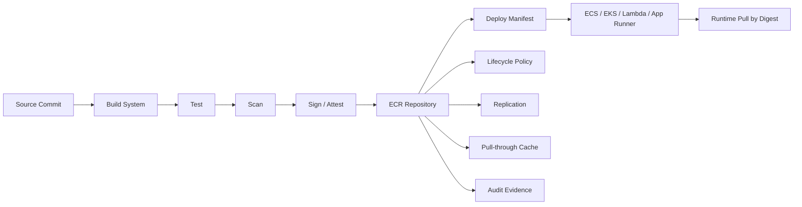
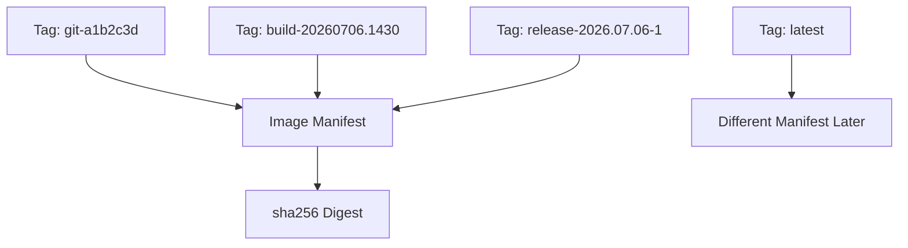
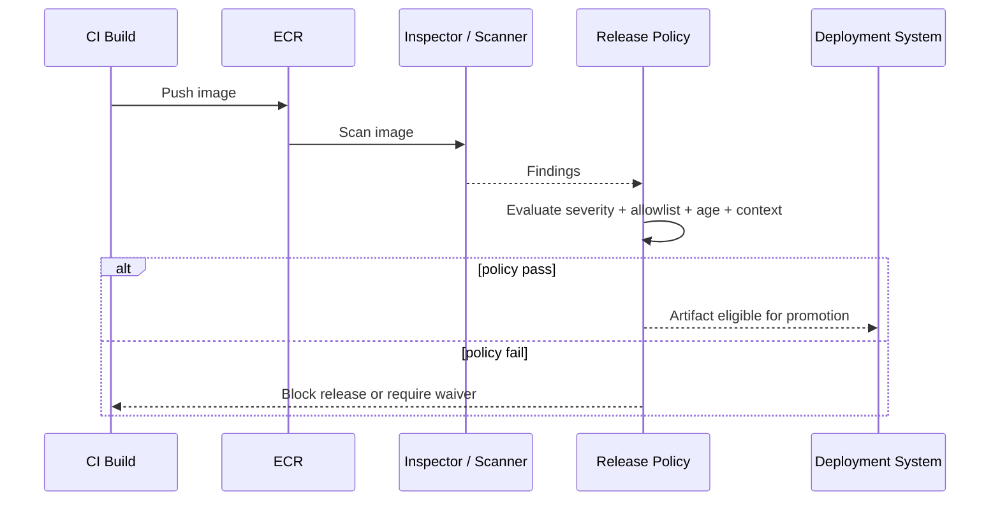
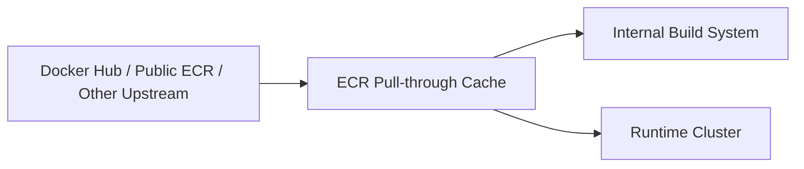
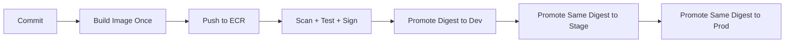
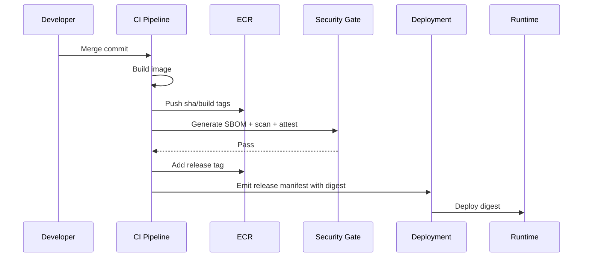

# Part 009 — ECR Repository Design

Amazon ECR is not just "a place to put Docker images". In a serious platform, ECR is the **release registry**, **evidence boundary**, **promotion boundary**, and **runtime dependency boundary** for every ECS task, EKS pod, Lambda container image, App Runner service, and Batch job that consumes container images.

A weak ECR design creates hidden operational debt:

- deployments pull mutable images,
- rollbacks do not reproduce the previous runtime,
- CI overwrites tags,
- production consumes images that were never scanned,
- teams cannot answer which commit is currently running,
- lifecycle cleanup deletes images still referenced by old task definitions,
- multi-account environments drift,
- incident responders cannot prove what artifact was deployed.

A good ECR design has one invariant:

> Runtime environments should consume immutable, traceable image identities, while humans can still use readable aliases for workflow convenience.

That means: readable tags are useful, but **digest is truth**.

---

## 1. What ECR Owns and What It Does Not Own

ECR owns the registry-level mechanics:

- repository namespace,
- image manifests,
- image tags,
- image digests,
- vulnerability scanning integration,
- lifecycle expiration,
- replication,
- pull-through cache,
- repository policy,
- private registry authentication,
- image pull authorization.

ECR does **not** own:

- whether the image is safe to run,
- whether the image has passed tests,
- whether a tag means what your organization thinks it means,
- whether production is allowed to consume an image,
- whether the workload pins by digest,
- whether old images are still referenced by old deployments,
- whether runtime pulls are isolated from public registry outages.

That ownership belongs to the platform and delivery system.



The registry is a checkpoint. It is not the whole supply chain.

---

## 2. Repository Boundary: One Repository per Deployable Artifact

A repository should map to a **deployable artifact**, not a team, not an environment, and not a random folder.

Good repository boundaries:

```txt
payments-api
payments-worker
case-lifecycle-orchestrator
notification-dispatcher
document-renderer
fraud-signal-consumer
```

Weak repository boundaries:

```txt
backend
services
java
prod
staging
platform
misc
```

The repository name should answer:

- What runtime artifact is this?
- Who owns it?
- Can this image be promoted independently?
- Can this artifact have its own lifecycle policy?
- Can access be controlled without affecting unrelated workloads?
- Can vulnerability findings be routed to the right team?

A monorepo can still have many ECR repositories. Source layout and artifact layout are related, but not identical.

### Recommended repository model

```txt
<domain-or-bounded-context>/<service-name>
```

Examples:

```txt
enforcement/case-api
enforcement/case-worker
enforcement/escalation-scheduler
identity/token-service
documents/pdf-renderer
integration/sap-bridge
platform/base-java-runtime
platform/otel-sidecar
```

Use a shallow hierarchy. Avoid encoding too much deployment state into repository names.

Bad:

```txt
prod/enforcement/case-api/java17/graviton/fargate
```

Better:

```txt
enforcement/case-api
```

Encode version, platform, architecture, and environment in metadata, tag, deployment manifest, or promotion status — not in the repository path.

---

## 3. Environment Model: Do Not Create Repositories per Environment by Default

A common early design is:

```txt
dev/payments-api
staging/payments-api
prod/payments-api
```

This looks clean, but it often weakens artifact traceability. The same build gets copied or rebuilt multiple times, and teams slowly lose confidence that staging and production are running the same image.

Prefer:

```txt
payments-api
```

with immutable image identities promoted across environments.

Environment should normally be represented by:

- deployment target account,
- deployment manifest,
- image digest selected by deployment,
- release record,
- promotion status,
- runtime IAM role,
- infrastructure stack.

Not by rebuilding the image and pushing it to a different repository name.

### When separate repositories per environment can make sense

Use separate repositories only when there is a hard boundary:

- production account must not trust lower-environment registry access,
- different legal entity or tenant boundary,
- air-gapped or semi-isolated environment,
- different lifecycle retention requirement,
- different encryption/account governance model,
- regulated evidence demands separate artifact custody.

Even then, the design should preserve the artifact identity:

```txt
source digest == promoted digest
```

Copying across accounts is acceptable. Rebuilding per environment is not.

---

## 4. Tag Strategy: Tags Are Names, Digests Are Identity

A tag is a mutable or semi-mutable pointer to an image manifest. A digest is content-addressed identity.

This distinction drives almost every registry decision.



Use tags for humans and automation workflow. Use digests for runtime determinism.

### Recommended tag set

For each image build, publish multiple tags pointing to the same digest:

```txt
sha-<git-sha>
build-<build-number>
branch-<branch-name>-<short-sha>
semver-<version>
release-<release-id>
```

Example:

```txt
sha-9f3a21c7d7e9
build-20260706-1430-5821
branch-main-9f3a21c
v2.14.0
release-case-api-20260706-001
```

The deployment manifest should resolve to a digest:

```yaml
image:
  repository: 123456789012.dkr.ecr.ap-southeast-1.amazonaws.com/enforcement/case-api
  tag: release-case-api-20260706-001
  digest: sha256:4c6e8...
```

Then runtime should use the digest form where possible:

```txt
123456789012.dkr.ecr.ap-southeast-1.amazonaws.com/enforcement/case-api@sha256:4c6e8...
```

This avoids the "tag moved under our feet" failure.

### Avoid `latest` in runtime

`latest` is acceptable only for local experiments or explicitly mutable cache-style repositories.

Do not use `latest` for:

- ECS task definitions,
- EKS deployments,
- Lambda function image URI,
- App Runner production service,
- Batch job definition,
- scheduled production jobs,
- rollback target.

If a production deployment references `latest`, you do not have a reproducible deployment. You have a guess.

---

## 5. Tag Immutability: Default to Immutable

Enable tag immutability for production-grade repositories.

The platform invariant:

> Once a tag is attached to an image in the release repository, it must not be overwritten.

With immutability enabled, an attempted push to an existing tag should fail. This is good. CI should create a new tag, not rewrite history.

### Useful model

```txt
Immutable:
  - sha-*
  - build-*
  - release-*
  - v*

Mutable only when explicitly justified:
  - latest
  - dev
  - cache
  - branch-main
```

If your organization wants mutable branch tags for preview environments, isolate them:

```txt
service-api-dev
```

or use repository-level exclusion patterns if your governance permits it. The important thing is not the exact syntax. The important thing is that production tags must be stable.

### What immutability does not solve

Tag immutability does not prove the image is safe. It only prevents tag overwrite. You still need:

- provenance,
- vulnerability scanning,
- policy gates,
- signature/attestation,
- release approval,
- runtime digest pinning.

---

## 6. Digest Pinning: The Runtime Contract

A deployment that pins an image digest says:

> Run exactly this image manifest.

A deployment that pins a tag says:

> Resolve this tag when the runtime pulls. I hope it still means the same thing.

### ECS

ECS task definitions can use image references by tag or digest. Production task definitions should be generated with digest references after CI resolves the approved artifact.

Bad:

```json
{
  "image": "123456789012.dkr.ecr.ap-southeast-1.amazonaws.com/enforcement/case-api:prod"
}
```

Better:

```json
{
  "image": "123456789012.dkr.ecr.ap-southeast-1.amazonaws.com/enforcement/case-api@sha256:4c6e8..."
}
```

### EKS

Kubernetes has a subtle trap: `imagePullPolicy`.

With tag `latest`, Kubernetes defaults to `Always`. With non-latest tags, it may default to `IfNotPresent`. That creates confusing behavior across nodes.

Production deployment should prefer digest references:

```yaml
containers:
  - name: case-api
    image: 123456789012.dkr.ecr.ap-southeast-1.amazonaws.com/enforcement/case-api@sha256:4c6e8...
```

### Lambda container images

Lambda functions using container images should also be updated with a specific image URI tied to a known digest. Avoid treating a mutable tag as the release mechanism.

---

## 7. Repository Naming for Multi-Architecture Images

Container images can target different CPU architectures. On AWS this often means:

- `linux/amd64`,
- `linux/arm64` for Graviton.

You have two common designs.

### Option A — one repository, multi-arch manifest list

```txt
enforcement/case-api:v2.14.0
```

The tag points to a manifest list that contains architecture-specific manifests.

Pros:

- clean user-facing tag,
- runtime can choose architecture,
- easier deployment manifest.

Cons:

- build pipeline must create and publish manifest list correctly,
- scanning/reporting can be more complex,
- teams must understand that one tag may represent multiple platform-specific images.

### Option B — architecture-specific tags

```txt
enforcement/case-api:v2.14.0-amd64
enforcement/case-api:v2.14.0-arm64
```

Pros:

- explicit,
- easier debugging,
- simpler for teams new to multi-arch.

Cons:

- deployment templates multiply,
- migration to Graviton requires more config changes.

### Production recommendation

For platform teams, use one repository and publish a multi-arch manifest for stable releases. For early teams, use explicit architecture tags until the build system matures.

Do not mix architecture silently. If a Java service has JNI/native dependencies, architecture must be tested explicitly.

---

## 8. Lifecycle Policies: Expire Images Without Breaking Rollback

Lifecycle policy is not just cost cleanup. It is a rollback safety mechanism.

A bad lifecycle policy deletes images by age without considering release state. That breaks rollback, forensic analysis, and disaster recovery.

### Retention classes

Think in classes:

| Class | Example Tags | Retention Goal |
|---|---|---|
| Build images | `build-*`, `sha-*` | enough for debugging recent commits |
| Release candidates | `rc-*` | enough for active test cycles |
| Production releases | `release-*`, `v*` | long enough for rollback and audit |
| Base images | `platform/base-*` | long enough for downstream rebuilds |
| Preview images | `pr-*`, `branch-*` | short |
| Cache images | `cache-*` | very short |

### Example lifecycle policy thinking

Not a copy-paste final policy, but the intent:

```json
{
  "rules": [
    {
      "rulePriority": 10,
      "description": "Expire untagged images quickly",
      "selection": {
        "tagStatus": "untagged",
        "countType": "sinceImagePushed",
        "countUnit": "days",
        "countNumber": 7
      },
      "action": {
        "type": "expire"
      }
    },
    {
      "rulePriority": 20,
      "description": "Keep last 100 PR images",
      "selection": {
        "tagStatus": "tagged",
        "tagPrefixList": ["pr-"],
        "countType": "imageCountMoreThan",
        "countNumber": 100
      },
      "action": {
        "type": "expire"
      }
    },
    {
      "rulePriority": 30,
      "description": "Keep production releases for one year",
      "selection": {
        "tagStatus": "tagged",
        "tagPrefixList": ["release-", "v"],
        "countType": "sinceImagePushed",
        "countUnit": "days",
        "countNumber": 365
      },
      "action": {
        "type": "expire"
      }
    }
  ]
}
```

### Lifecycle policy invariant

Before an image is expired, answer:

- Is any ECS task definition still referencing this digest?
- Is any EKS workload manifest still referencing this digest?
- Is any Lambda function version still referencing this image?
- Is any App Runner service still referencing this image?
- Is this image needed for rollback?
- Is this image needed for audit evidence?
- Is this image part of a base image lineage?

Do not let cleanup destroy evidence.

---

## 9. Vulnerability Scanning: Registry Finding Is a Signal, Not a Gate by Itself

ECR supports image scanning. Enhanced scanning integrates with Amazon Inspector and can cover operating system and programming language package vulnerabilities.

But scanning has a common failure mode:

> The team treats scanner output as an absolute truth, then either blocks everything or ignores everything.

A scanner finding is an input into risk decision. It must be joined with:

- exploitability,
- reachable code,
- runtime exposure,
- workload privilege,
- network exposure,
- base image availability,
- business criticality,
- compensating controls,
- fix availability.

### Recommended scanning workflow



### Policy examples

Good policy:

```txt
Block release if:
- Critical vulnerability has fix available, and
- package is present in runtime image, and
- finding is not covered by active risk waiver, and
- image is intended for production.
```

Weak policy:

```txt
Block all highs forever.
```

That weak policy sounds stricter but usually creates bypass behavior.

### Risk waiver requirements

A waiver should include:

- CVE ID,
- affected package,
- image digest,
- owning team,
- reason for waiver,
- expiration date,
- compensating control,
- approver,
- link to tracking ticket.

Never allow permanent silent waivers.

---

## 10. Pull-Through Cache: Treat Public Registries as External Dependencies

Your runtime should not depend directly on Docker Hub or another public registry for production startup.

Use ECR pull-through cache for upstream images when appropriate. Pull-through cache can reduce rate-limit exposure, centralize access, and allow controlled upstream image consumption.



### Use cases

- standard base images,
- public vendor images,
- open-source sidecars,
- repeatable CI pulls,
- avoiding external registry rate limits,
- reducing public internet dependency.

### Hidden trap

A pull-through cache still has freshness semantics. If an upstream tag moves, your cached tag may eventually change too.

For base images, prefer digest references:

```txt
public.ecr.aws/docker/library/eclipse-temurin@sha256:...
```

or internal promoted base images:

```txt
platform/base-java-runtime@sha256:...
```

Do not let `ubuntu:latest` enter a production build.

---

## 11. Base Image Strategy

Base images are where many supply-chain incidents begin.

You need an explicit policy for:

- allowed base image sources,
- patch cadence,
- ownership,
- vulnerability response,
- runtime hardening,
- architecture support,
- Java version support,
- glibc vs musl constraints,
- distroless vs full OS image,
- debug variant availability.

### Golden path

```txt
platform/base-java-runtime:<java-version>-<distro>-<date>
```

Example:

```txt
platform/base-java-runtime:java21-al2023-20260706
platform/base-java-runtime:java17-al2023-20260706
platform/base-java-runtime:java21-distroless-20260706
```

Application teams build from the platform base image, not random public images.

```Dockerfile
FROM 123456789012.dkr.ecr.ap-southeast-1.amazonaws.com/platform/base-java-runtime:java21-al2023-20260706
COPY app.jar /app/app.jar
ENTRYPOINT ["java", "-jar", "/app/app.jar"]
```

### Why platform base images help

They centralize:

- CA certificates,
- timezone data,
- JVM defaults,
- observability agent,
- OS package policy,
- vulnerability response,
- non-root user model,
- file permissions,
- image labels,
- SBOM generation.

This is the difference between "each team owns Docker" and "the platform owns a safe runtime contract".

---

## 12. Repository Policy and IAM Model

There are two different access paths:

1. **Push path**: build system writes images.
2. **Pull path**: runtime reads images.

Never merge them casually.

### Push permissions

CI/CD role should be allowed to:

- authenticate to ECR,
- initiate layer upload,
- upload layers,
- complete layer upload,
- put image,
- describe images,
- maybe batch check layer availability.

Application runtime roles should not be able to push images.

### Pull permissions

Runtime execution role should be allowed to:

- get authorization token,
- batch get image,
- get download URL for layer,
- describe repositories/images if needed.

In ECS, distinguish:

- **task execution role**: pulls image, sends logs, retrieves secrets for agent-level operations,
- **task role**: application AWS API permissions.

In EKS, node role or pull secret mechanism must be designed carefully. With ECR and EKS in the same account, node/pod identity mechanics can hide complexity; in cross-account pulls, repository policies become important.

### Cross-account access model

Common account layout:

```txt
shared-tools-account:
  ECR source repositories
  CI/CD build system

dev-account:
  runtime workloads

stage-account:
  runtime workloads

prod-account:
  runtime workloads
```

Options:

- runtime accounts pull from shared ECR via repository policy,
- source registry replicates images into environment accounts,
- production has separate ECR custody and consumes only promoted images.

For regulated environments, replication into production account is often easier to audit than allowing broad cross-account pull from a shared tools account.

---

## 13. Replication Strategy

ECR supports private image replication across Regions and accounts.

Use replication when:

- production account should own its artifact copy,
- multi-region runtime needs local image pulls,
- disaster recovery requires registry availability in another Region,
- image pull latency matters,
- cross-account blast radius must be reduced.

### Replication is not promotion by itself

Do not confuse:

```txt
image replicated
```

with:

```txt
image approved for production
```

Replication copies artifacts. Promotion changes release status.

A release process should still record:

- source digest,
- destination digest,
- scan result,
- signature/attestation result,
- approver,
- deployment target,
- timestamp.

### Multi-region invariant

For active-active or DR systems:

```txt
same release id -> same image digest -> replicated to required Regions
```

If Region A and Region B run different digests unintentionally, you have a release divergence.

---

## 14. Encryption and Data Residency

ECR repositories can use encryption at rest. Account and Region placement matters for residency and governance.

Design questions:

- Which accounts are allowed to store production images?
- Which Regions are allowed?
- Is cross-Region replication permitted?
- Are base images considered third-party dependencies?
- Does vulnerability metadata leave the Region?
- Are image layers allowed to contain generated code, customer-specific config, or tenant-specific artifacts?

The last point is important: image artifacts should not contain tenant-specific secrets or customer data. Configuration belongs at deployment/runtime boundary, not baked into image layers.

---

## 15. Image Metadata and Labels

Every image should carry metadata.

OCI labels can include:

```Dockerfile
LABEL org.opencontainers.image.title="case-api"
LABEL org.opencontainers.image.description="Case lifecycle API"
LABEL org.opencontainers.image.version="2.14.0"
LABEL org.opencontainers.image.revision="9f3a21c7d7e9"
LABEL org.opencontainers.image.source="https://example.internal/scm/enforcement/case-api"
LABEL org.opencontainers.image.created="2026-07-06T07:30:00Z"
```

Recommended platform metadata:

```txt
service.name
service.owner
service.tier
build.id
git.sha
git.branch
release.id
base.image.digest
sbom.digest
provenance.id
```

This metadata makes incident response faster.

When a container is misbehaving, you want to answer quickly:

- What commit is this?
- What pipeline built it?
- Which base image was used?
- Which vulnerabilities existed at release time?
- Which approval allowed it into production?
- Which environments consumed it?

---

## 16. Promotion Model: Build Once, Promote by Digest

The mature model:



Do not rebuild for each environment.

Bad:

```txt
commit -> build dev image
commit -> build staging image
commit -> build prod image
```

Better:

```txt
commit -> build image digest once -> promote same digest
```

Environment differences should come from:

- environment variables,
- secrets,
- service endpoints,
- IAM role,
- resource sizing,
- deployment manifest,
- feature flags,
- infrastructure stack.

Not from different binaries inside different images.

---

## 17. ECR for Lambda Container Images

Lambda container images are still container images, but the runtime contract differs from ECS/EKS.

Design considerations:

- Lambda image can be larger than ZIP packages, but size still affects operational workflow.
- Image must implement Lambda Runtime API via AWS base image or runtime interface client.
- Function update should point to a known image identity.
- Cold start and caching behavior differs from long-running containers.
- One image per Lambda function is usually cleaner than sharing a huge multi-purpose image.

Avoid:

```txt
serverless-functions
```

with many unrelated handlers inside one image.

Prefer:

```txt
case-created-handler
case-escalation-handler
document-renderer-lambda
```

or, if handlers are tightly coupled and released together:

```txt
case-events-lambda
```

The repository boundary should follow release coupling.

---

## 18. ECR for ECS vs EKS vs App Runner

Same registry, different consumers.

| Consumer | Pull Moment | Common Pitfall |
|---|---|---|
| ECS | task start / replacement | mutable tag in task definition |
| EKS | pod scheduling / node pull | `imagePullPolicy` confusion |
| Lambda image | function update / execution environment preparation | treating tag move as deployment |
| App Runner | service deployment | unclear source-to-runtime promotion |
| Batch | job start | old job definition references expired image |

Each consumer should receive a release manifest containing:

```yaml
artifact:
  repository: enforcement/case-api
  digest: sha256:...
  releaseId: case-api-20260706-001
  gitSha: 9f3a21c7d7e9
  sbom: s3://...
  scanStatus: passed
```

---

## 19. Failure Modes

### Failure: Image tag overwritten

Symptom:

- production rollback does not restore old behavior,
- same tag behaves differently over time,
- task definition image string did not change but runtime did.

Prevention:

- enable tag immutability,
- pin by digest,
- write release evidence.

### Failure: Image expired while still deployed

Symptom:

- old task keeps running,
- replacement fails to start,
- rollback fails,
- DR environment cannot pull image.

Prevention:

- lifecycle policy aware of deployment references,
- keep production release digests longer,
- scan active task definitions/functions/manifests before expiration.

### Failure: Public base image tag changed

Symptom:

- rebuild creates different runtime without source changes,
- scanner suddenly reports different findings,
- bug appears after "no-code" rebuild.

Prevention:

- pin base image digest,
- mirror/promote base images into internal ECR,
- maintain base image release notes.

### Failure: Cross-account pull denied

Symptom:

- ECS task stops with image pull error,
- EKS pod `ImagePullBackOff`,
- Lambda update fails,
- only production fails while staging works.

Prevention:

- separate push/pull role testing,
- repository policy tests,
- deployment preflight checks,
- private registry authentication validation.

### Failure: Scanner blocks emergency release

Symptom:

- production incident fix cannot deploy because unrelated vulnerability gate blocks image,
- team bypasses registry controls manually.

Prevention:

- formal emergency waiver path,
- time-bound risk acceptance,
- exception audit,
- patch follow-up ticket.

### Failure: Multi-arch image missing one architecture

Symptom:

- amd64 nodes work, arm64 nodes fail,
- Karpenter/Auto Mode provisions Graviton but pod cannot start.

Prevention:

- build manifest list verification,
- per-architecture smoke test,
- scheduler constraints while migrating.

---

## 20. Golden Path Repository Blueprint

For a production service:

```txt
Repository:
  enforcement/case-api

Settings:
  tag immutability: enabled
  scan on push: enabled or enhanced scanning via Inspector
  encryption: account standard or customer-managed key if required
  lifecycle:
    - untagged: short
    - pr/preview: short
    - build tags: medium
    - release tags: long
  replication:
    - prod account
    - DR region if required

Tags per build:
  sha-<git-sha>
  build-<pipeline-id>
  branch-<branch>-<short-sha>
  release-<release-id> after promotion

Runtime:
  use digest reference
  never use latest
  task/function/deployment manifest stores release metadata

Evidence:
  SBOM
  scan result
  test result
  provenance
  approval
  deployment record
```

---

## 21. Minimal CI/CD Flow



The release manifest is the handoff contract between CI and CD.

---

## 22. Design Review Questions

Use these questions before approving an ECR design:

1. Does every deployable artifact have a clear repository owner?
2. Are production tags immutable?
3. Does runtime deploy by digest?
4. Can we identify commit, pipeline, base image, SBOM, and scan result for every running image?
5. Can the platform prevent unscanned images from being promoted?
6. Can an emergency release proceed through a controlled waiver path?
7. Can lifecycle policies delete an image still needed for rollback?
8. Are public base images pinned and mirrored?
9. Are push and pull permissions separated?
10. Does production pull cross-account, or does production own replicated artifacts?
11. Does multi-region runtime have local image availability?
12. Are multi-arch images verified?
13. Are Lambda image repositories designed per release boundary?
14. Can an incident responder answer "what changed" within minutes?
15. Is registry design encoded in IaC, not manually configured?

---

## 23. Implementation Checklist

### Repository

- [ ] Repository created via IaC.
- [ ] Name maps to one deployable artifact.
- [ ] Owner/team metadata exists.
- [ ] Tag immutability enabled.
- [ ] Lifecycle policy attached.
- [ ] Scan policy attached.
- [ ] Encryption policy reviewed.
- [ ] Repository policy reviewed.

### Build

- [ ] Image includes OCI labels.
- [ ] Base image pinned by digest or internally promoted.
- [ ] SBOM generated.
- [ ] Provenance generated.
- [ ] Image scanned.
- [ ] Digest recorded.
- [ ] Multi-arch manifest verified if applicable.

### Promotion

- [ ] Same digest promoted across environments.
- [ ] Release tag attached only after gates pass.
- [ ] Approval recorded.
- [ ] Waiver process exists.
- [ ] Deployment manifest stores digest.

### Runtime

- [ ] ECS/EKS/Lambda/App Runner consumes digest.
- [ ] Runtime role has pull-only access.
- [ ] No runtime dependency on public registry.
- [ ] Rollback target image retained.
- [ ] Image pull failure runbook exists.

---

## 24. Practical Anti-Patterns

### Anti-pattern: repository per branch

```txt
case-api-main
case-api-feature-123
case-api-hotfix-7
```

This explodes repository count and breaks lifecycle management. Use tags for branch/PR identity.

### Anti-pattern: one giant repository for all services

```txt
backend
```

This destroys ownership, scanning routing, lifecycle policy, and access boundary.

### Anti-pattern: rebuild for production

```txt
dev build passed
prod build created separately
```

Now staging did not test production artifact.

### Anti-pattern: scanner as only release gate

A scanner cannot decide business risk alone. Use scanner output as part of a policy.

### Anti-pattern: manual ECR settings

If tag immutability and scanning are clicked manually, they will drift. Registry settings belong in IaC.

---

## 25. Mental Model Summary

ECR design is not about storing images. It is about preserving deployment truth.

The minimum production-grade standard:

```txt
one deployable artifact -> one repository
one build -> one digest
one release -> one immutable promotion record
one runtime deployment -> one pinned digest
one incident -> one clear artifact trail
```

If your platform can maintain those invariants, ECR becomes a reliable release boundary.

If it cannot, ECR becomes a shared folder with prettier APIs.

---

## References

- AWS ECR User Guide — What is Amazon ECR: https://docs.aws.amazon.com/AmazonECR/latest/userguide/what-is-ecr.html
- AWS ECR — Image tag mutability: https://docs.aws.amazon.com/AmazonECR/latest/userguide/image-tag-mutability.html
- AWS ECR — Lifecycle policies: https://docs.aws.amazon.com/AmazonECR/latest/userguide/LifecyclePolicies.html
- AWS ECR — Image scanning: https://docs.aws.amazon.com/AmazonECR/latest/userguide/image-scanning.html
- AWS ECR — Enhanced scanning: https://docs.aws.amazon.com/AmazonECR/latest/userguide/image-scanning-enhanced.html
- AWS ECR — Pull-through cache: https://docs.aws.amazon.com/AmazonECR/latest/userguide/pull-through-cache.html
- AWS ECR — Private image replication: https://docs.aws.amazon.com/AmazonECR/latest/userguide/replication.html
- OCI Image Specification — Manifest: https://specs.opencontainers.org/image-spec/manifest/
