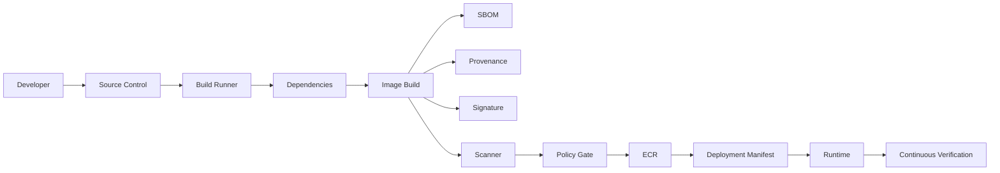
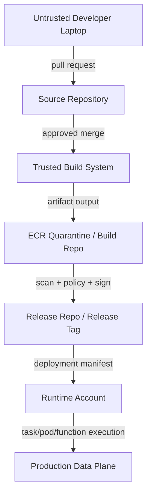
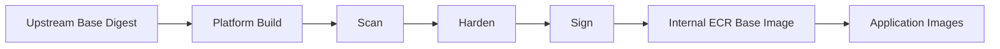
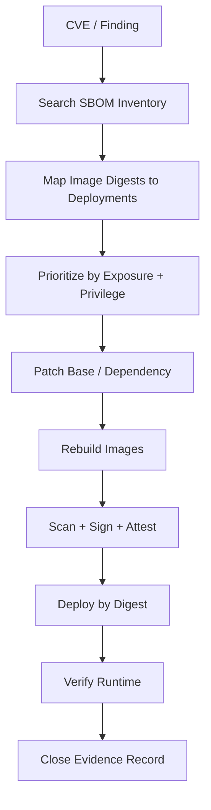

# Part 010 — Container Supply Chain Security

A container image is executable infrastructure. If the image is compromised, the deployment system faithfully distributes the compromise to ECS, EKS, Lambda, App Runner, Batch, and any other runtime that trusts the registry.

The central question is not:

> Did the image build successfully?

The central question is:

> Can we prove that the image running in production came from trusted source, was built by trusted automation, passed required checks, was not modified after approval, and is still acceptable to run today?

Container supply chain security is the system that answers that question.

---

## 1. Threat Model First

Most weak supply-chain designs fail because they start with tools:

- "Should we use SBOM?"
- "Should we sign images?"
- "Should we scan in CI or ECR?"
- "Should we use distroless?"
- "Should we block critical CVEs?"

Those are implementation choices. Start with threats.

### Threats to model

| Threat | Example | Control Family |
|---|---|---|
| Source compromise | attacker pushes malicious code | branch protection, review, signed commits, CODEOWNERS |
| CI compromise | build job injects malware | isolated runners, least privilege, ephemeral credentials |
| Dependency compromise | poisoned Maven/npm package | dependency pinning, lock files, allowlists, SBOM |
| Base image compromise | upstream image tag moves | digest pinning, internal base image promotion |
| Registry compromise | tag overwritten | ECR immutability, digest deployment, repository policy |
| Promotion bypass | unapproved image deployed | release gates, deployment policy |
| Runtime overprivilege | compromised container has broad AWS access | task role/pod identity least privilege |
| Vulnerability drift | safe-at-release image later becomes risky | continuous scanning, rebuild cadence |
| Evidence gap | no proof what ran | provenance, deployment records, immutable logs |

Supply-chain security is not one gate. It is a chain of custody.



A single broken link can invalidate the chain.

---

## 2. Security Invariants

For a production platform, define invariants before selecting tools.

### Invariant 1 — Build once, promote by digest

The same image digest should flow through environments.

```txt
commit -> image digest -> dev -> stage -> prod
```

Do not rebuild per environment. Environment-specific behavior belongs in runtime configuration, not image content.

### Invariant 2 — Runtime uses immutable artifact identity

Runtime should consume:

```txt
repository@sha256:digest
```

not a mutable tag.

### Invariant 3 — No production deployment without evidence

Production release evidence should include:

- source commit,
- build pipeline run,
- builder identity,
- image digest,
- base image digest,
- dependency manifest,
- SBOM,
- vulnerability scan result,
- policy decision,
- approval or waiver,
- deployment target,
- timestamp.

### Invariant 4 — Push permission is not deploy permission

The ability to push an image to ECR must not imply the ability to deploy it to production.

### Invariant 5 — Scanner output is not policy by itself

Findings must be evaluated through policy: severity, fix availability, exposure, exploitability, runtime privilege, waiver, and deadline.

### Invariant 6 — Security is continuous

An image that was acceptable yesterday can become unacceptable tomorrow after a new CVE disclosure.

---

## 3. Trust Boundary Map

Container supply-chain security is mostly about trust transitions.



Not every organization needs separate physical repositories for build and release. But every organization needs a logical distinction between:

- artifact exists,
- artifact is approved,
- artifact is deployed,
- artifact is still safe.

---

## 4. Source Control Controls

Supply-chain security starts before Docker build.

### Minimum source controls

- protected main branch,
- pull request review,
- CODEOWNERS for critical paths,
- status checks required before merge,
- no direct pushes to release branches,
- secret scanning,
- dependency change visibility,
- audit log retention.

### Critical files that need ownership

Treat these files as high-risk:

```txt
Dockerfile
docker-entrypoint.sh
build.gradle
pom.xml
settings.gradle
package-lock.json
yarn.lock
pnpm-lock.yaml
go.sum
requirements.txt
requirements.lock
.github/workflows/*
buildspec.yml
cdk/*
terraform/*
helm/*
k8s/*
```

A one-line Dockerfile change can bypass runtime hardening. A CI workflow change can exfiltrate credentials. A dependency file change can import malicious code.

### Practical CODEOWNERS example

```txt
Dockerfile                  @platform-runtime
docker-entrypoint.sh         @platform-runtime
.github/workflows/*          @platform-delivery
pom.xml                      @service-owner @platform-runtime
helm/*                       @platform-kubernetes
terraform/*                  @platform-infra
```

---

## 5. Build System Security

The build system is a privileged actor. It can produce artifacts that production will trust.

### Build runner principles

- prefer ephemeral runners,
- avoid long-lived mutable workers,
- isolate builds by repository or trust level,
- do not reuse workspace across unrelated builds,
- do not mount Docker socket blindly,
- use short-lived credentials,
- restrict network egress when possible,
- make build logs non-secret by design.

### Docker socket risk

Mounting `/var/run/docker.sock` into a build container effectively grants host-level control. Many pipelines do this casually.

Safer alternatives:

- rootless BuildKit,
- Kaniko where appropriate,
- AWS CodeBuild managed environments with constrained IAM,
- remote builders with scoped permissions,
- builder instances dedicated per trust tier.

The exact tool matters less than the control:

> The build process should not gain more infrastructure privilege than required to produce the artifact.

---

## 6. Dependency Governance

Dependencies are part of the artifact.

For Java services, dependency risk includes:

- Maven transitive dependencies,
- plugin dependencies,
- parent POMs,
- annotation processors,
- build-time tools,
- shaded jars,
- native libraries,
- container OS packages.

### Rules

1. Use lock or reproducibility mechanism where possible.
2. Review dependency changes as code changes.
3. Prefer internal artifact repository/proxy for critical ecosystems.
4. Track transitive dependency changes in PR.
5. Fail builds on dependency confusion indicators.
6. Prohibit dynamic versions in production builds.

Bad:

```xml
<version>LATEST</version>
```

Also bad:

```gradle
implementation "com.example:library:1.+"
```

Better:

```gradle
implementation "com.example:library:1.4.2"
```

### Dependency confusion defense

If your organization uses private packages, make sure the build system cannot accidentally resolve a public package with the same name.

Controls:

- internal repository configured before public,
- namespace policy,
- dependency verification,
- repository allowlist,
- build egress monitoring.

---

## 7. Base Image Governance

Base image is the root of your runtime filesystem.

### Bad base image strategy

Every team chooses:

```Dockerfile
FROM ubuntu:latest
```

or:

```Dockerfile
FROM random-user/java-special:latest
```

This creates unbounded risk.

### Good base image strategy

Platform publishes approved base images:

```txt
platform/base-java-runtime:java21-al2023-20260706
platform/base-java-runtime:java17-al2023-20260706
platform/base-java-build:java21-maven-20260706
```

Each base image has:

- owner,
- source Dockerfile,
- base digest,
- SBOM,
- vulnerability scan,
- patch cadence,
- release notes,
- deprecation date,
- supported architecture,
- debug variant if needed.

### Base image promotion



Application teams should consume internal approved base images, not arbitrary public tags.

---

## 8. SBOM: Inventory Before Judgment

An SBOM tells you what is inside the artifact. Without it, vulnerability response becomes guesswork.

For each image, generate an SBOM that covers:

- OS packages,
- language packages,
- application dependencies,
- build metadata,
- base image identity,
- file/package relationship where available.

Common formats:

- SPDX,
- CycloneDX.

### What an SBOM enables

When a new vulnerability is disclosed, you can ask:

```txt
Which running images contain package X version Y?
```

Without SBOM, teams do slow manual archaeology.

With SBOM, platform can search artifact inventory and prioritize response.

### SBOM storage

Do not store SBOM only inside CI logs.

Recommended:

```txt
image digest -> SBOM artifact -> immutable storage -> release record
```

Example release evidence:

```yaml
artifact:
  imageDigest: sha256:4c6e8...
  sbom:
    format: cyclonedx
    digest: sha256:9aa2...
    location: s3://release-evidence/case-api/20260706/sbom.json
```

### SBOM trap

An SBOM is not a security guarantee. It is an inventory. It must feed policy, scanning, and response.

---

## 9. Provenance and Attestation

Provenance answers:

> How was this artifact built?

It should capture:

- source repository,
- commit SHA,
- build command,
- builder identity,
- build timestamp,
- build environment,
- materials/dependencies,
- output image digest.

Attestation is a signed statement about an artifact.

Examples:

- "This image was built by pipeline X from commit Y."
- "This image passed test suite Z."
- "This image passed policy gate Q."
- "This image has SBOM digest S."

### Why provenance matters

If attackers can upload an image directly to ECR, scanning may still pass. The image may be low-vulnerability but malicious.

Provenance prevents this by asking:

```txt
Was this artifact produced by the trusted builder from the expected source?
```

Not merely:

```txt
Does this artifact have few CVEs?
```

---

## 10. Image Signing

Image signing protects against unauthorized artifact substitution.

The idea:

```txt
image digest + trusted signer -> signature
```

Deployment policy can require that production images are signed by approved build identity.

### What signing proves

Signing can prove:

- artifact digest was approved by a signing identity,
- artifact was not modified after signing,
- deployment can verify trusted publisher.

### What signing does not prove

Signing does not prove:

- code has no bug,
- image has no vulnerability,
- dependency is safe,
- application behavior is correct,
- production config is safe.

Signing is necessary for chain-of-custody. It is not sufficient for security.

---

## 11. Vulnerability Scanning Policy

ECR basic/enhanced scanning and Amazon Inspector integrations can identify vulnerabilities in container images. Enhanced scanning can cover operating system and programming language package vulnerabilities.

But scanners do not understand your whole runtime risk.

### Policy dimensions

A mature policy considers:

| Dimension | Question |
|---|---|
| Severity | Critical, high, medium, low? |
| Fix availability | Is there a patched package? |
| Exploitability | Is exploit known or likely? |
| Reachability | Is vulnerable code reachable? |
| Exposure | Is service public, internal, batch-only? |
| Privilege | Does workload have sensitive AWS permissions? |
| Data access | Can workload access regulated data? |
| Age | How long has finding existed? |
| Waiver | Is there approved time-bound acceptance? |

### Example release policy

```yaml
blockProductionIf:
  - severity: CRITICAL
    fixAvailable: true
    waiver: absent
  - severity: HIGH
    fixAvailable: true
    publicExposure: true
    ageDaysGreaterThan: 7
  - malwareDetected: true
  - unsignedImage: true
  - provenanceMissing: true
  - baseImageUnapproved: true
```

### Do not create impossible policies

If the policy blocks every high finding immediately, teams will bypass it. Better:

```txt
Critical fix available: block now
High fix available: SLA 7 days, block after SLA
Medium: track and patch in regular base-image cycle
No fix available: require compensating control or waiver
```

Security policy must be strict enough to matter and realistic enough to survive operations.

---

## 12. Quarantine and Promotion Repositories

A useful pattern is separating image states.

### Logical states

```txt
built
scanned
approved
released
deployed
deprecated
revoked
```

### Physical repository model

Option A — same repository, tags encode state:

```txt
case-api:sha-9f3a21c
case-api:build-5821
case-api:release-20260706-001
```

Option B — separate repositories:

```txt
case-api-build
case-api-release
```

Option C — separate accounts:

```txt
tools account: build artifacts
prod account: approved artifacts
```

There is no universal answer. The invariant matters more:

> Production can only consume artifacts that passed promotion policy.

For regulated systems, separate accounts often make the approval boundary easier to reason about.

---

## 13. Deployment Admission

The deployment system must enforce artifact policy. Otherwise, supply-chain controls are advisory.

### ECS

Before registering a task definition or updating a service:

- resolve image tag to digest,
- verify digest exists in approved release record,
- verify scan status,
- verify signature/provenance,
- verify environment is allowed to consume the digest,
- inject digest into task definition.

### EKS

Admission controls can enforce:

- no `latest`,
- digest required,
- approved registry only,
- signed image required,
- non-root container,
- read-only root filesystem where possible,
- resource requests/limits,
- disallowed privileged flags.

Tools may include:

- Kubernetes admission webhooks,
- OPA Gatekeeper,
- Kyverno,
- Sigstore policy-controller,
- custom controllers,
- GitOps policy checks.

### Lambda

Before updating function image:

- verify image digest,
- verify repository is approved,
- verify release record,
- verify function role boundary,
- verify runtime config does not contain secrets baked into image.

---

## 14. Runtime Least Privilege

Supply-chain security does not end at deployment. If an attacker compromises a container, runtime privilege determines blast radius.

### ECS

Separate:

- task execution role,
- task role.

The application should get only the AWS permissions it needs.

### EKS

Use workload identity pattern:

- IRSA or EKS Pod Identity,
- least-privilege IAM role per workload,
- namespace isolation,
- network policies,
- pod security controls.

### Lambda

Each function should have a narrow execution role. Do not put many unrelated handlers behind one broad role just because they share code.

### Practical rule

A compromised image should not automatically become:

- account admin,
- secret reader for every service,
- S3 wildcard reader,
- KMS decrypt wildcard principal,
- EventBridge publisher for every domain,
- database superuser.

---

## 15. Secrets and Build-Time Leakage

Never bake secrets into images.

Common leak paths:

- `.npmrc` token copied into layer,
- Maven settings with credentials copied into image,
- AWS credentials in build context,
- `.env` file not excluded,
- private key used during build and left in lower layer,
- build logs print secret,
- Docker layer cache stores sensitive file.

### `.dockerignore` baseline

```txt
.git
.env
*.pem
*.key
.aws
target
build
node_modules
.idea
.vscode
```

### Build secret rule

If a secret is needed to fetch dependencies, use build-time secret mechanisms that do not persist in final image layers.

Do not do this:

```Dockerfile
COPY settings.xml /root/.m2/settings.xml
RUN mvn package
```

Unless you guarantee it is not in the final image and not preserved in accessible layers.

---

## 16. Runtime Hardening at Image Level

Container hardening should start in the image.

Recommended:

- run as non-root,
- minimal runtime image,
- no package manager in final image if not needed,
- no shell if not needed,
- read-only root filesystem where compatible,
- explicit writable directories,
- drop Linux capabilities where possible,
- no SSH daemon,
- no debug tools in production image,
- separate debug image variant if needed.

Example:

```Dockerfile
RUN addgroup --system app && adduser --system --ingroup app app
USER app:app
WORKDIR /app
COPY --chown=app:app app.jar /app/app.jar
ENTRYPOINT ["java", "-jar", "/app/app.jar"]
```

### Debuggability trade-off

Distroless/minimal images reduce attack surface but can make incident debugging harder.

A mature platform provides:

- production minimal image,
- separate debug image,
- ECS Exec or kubectl debug policy,
- logs/traces/metrics strong enough to avoid shelling into containers.

---

## 17. Continuous Scanning and Rebuild Cadence

An image ages.

Even if source code does not change, base OS and dependencies accumulate vulnerability findings.

### Rebuild triggers

Rebuild application images when:

- application code changes,
- base image is patched,
- critical dependency vulnerability appears,
- runtime version is updated,
- CA certificates/timezone data need update,
- security policy changes.

### Rebuild cadence

For production Java services:

```txt
critical base CVE: emergency rebuild
high base CVE: SLA-bound rebuild
regular patch: weekly or biweekly
low-risk internal services: monthly may be acceptable
```

The right cadence depends on exposure and regulatory context.

### Important distinction

Patch status is not only:

```txt
Did we rebuild the image?
```

It is:

```txt
Was the rebuilt image deployed everywhere that still runs the vulnerable digest?
```

---

## 18. Incident Response: Vulnerable Image in Production

When a high-impact CVE drops, the response should not begin with Slack panic.

### Required queries

The platform should answer:

1. Which images contain the affected package?
2. Which of those images are deployed?
3. Which environments are affected?
4. Which workloads are internet-facing?
5. Which workloads have sensitive permissions/data access?
6. Is a patched base/dependency available?
7. Can we rebuild from source reproducibly?
8. Can we deploy safely without unrelated changes?
9. Do we need temporary mitigations?
10. What evidence proves remediation?

### Response workflow



### Do not only patch main branch

If production runs an old release branch, patching main may not remediate production. Always map findings to runtime digests.

---

## 19. Policy-as-Code

Manual security review does not scale.

Express rules as code:

- allowed registries,
- required image digest,
- forbidden tags,
- max vulnerability threshold,
- required SBOM,
- required signature,
- approved base image list,
- non-root requirement,
- runtime privilege restrictions.

Example pseudo-policy:

```rego
deny[msg] {
  input.image.tag == "latest"
  msg := "production workload must not use latest tag"
}

deny[msg] {
  not input.image.digest
  msg := "production workload must pin image digest"
}

deny[msg] {
  input.image.registry not in data.allowed_registries
  msg := "image registry is not approved"
}
```

### Placement of policy checks

Run policy in multiple places:

1. pull request,
2. CI build,
3. artifact promotion,
4. deployment generation,
5. runtime admission,
6. periodic audit.

Do not rely on one checkpoint.

---

## 20. Human Workflow: Waivers Without Chaos

Real systems sometimes need exceptions.

A good waiver system is explicit and temporary.

Waiver record:

```yaml
waiverId: SEC-WAIVER-20260706-001
imageDigest: sha256:4c6e8...
finding: CVE-2026-12345
severity: HIGH
owner: enforcement-platform
reason: vulnerable package present but code path unreachable in production
compensatingControls:
  - private subnet only
  - no public ingress
  - IAM role cannot access regulated records
expiresAt: 2026-07-20
approvedBy: security-approver
trackingTicket: SEC-18422
```

Bad waiver:

```txt
Ignore this CVE.
```

Waivers must expire. Expiration forces review.

---

## 21. Supply Chain for Serverless Container Images

Lambda container images use ECR too, but serverless adds different failure modes.

### Lambda-specific concerns

- many small functions can share vulnerable base image,
- function role may be overprivileged,
- image update and function versioning must be tracked,
- cold start optimization can conflict with dependency minimization,
- one image may accidentally contain code for many handlers,
- environment variables can create behavior drift across stages.

### Recommended pattern

```txt
one release boundary -> one image
one function role -> least privilege
one image digest -> one function version/alias promotion
```

For Lambda, image security and IAM boundary are tightly coupled. A compromised function image with a broad role can be worse than a compromised ECS task with narrow permissions.

---

## 22. Supply Chain for EKS

EKS introduces Kubernetes-specific controls.

### Additional EKS controls

- admission controller,
- namespace-level policy,
- network policy,
- pod security standards,
- image pull policy,
- allowed registries,
- signature verification,
- service account to IAM mapping,
- GitOps source control,
- controller privilege review.

### EKS-specific failure mode

A privileged DaemonSet or controller image is a platform-level artifact. It may have access to nodes, cluster credentials, or traffic.

Treat platform images as more sensitive than application images:

```txt
aws-load-balancer-controller
external-secrets
cert-manager
admission webhooks
otel collector
service mesh control plane
node agents
```

A compromised controller can compromise many workloads.

---

## 23. Supply Chain for ECS

ECS has fewer Kubernetes-style admission hooks, so enforcement must move earlier:

- CI policy,
- CD generator,
- task definition registration gate,
- IAM permissions preventing direct update,
- service deployment automation,
- EventBridge detection for unauthorized task definition changes.

### ECS control point

Restrict who can call:

```txt
ecs:RegisterTaskDefinition
ecs:UpdateService
iam:PassRole
```

If developers can manually register arbitrary task definitions with arbitrary images and roles, the supply-chain policy is bypassable.

---

## 24. Evidence Model

For regulated or high-criticality systems, release evidence matters as much as release mechanics.

### Evidence record

```yaml
releaseId: case-api-20260706-001
service: enforcement/case-api
source:
  repo: enforcement/case-api
  commit: 9f3a21c7d7e9
  branch: main
build:
  pipeline: codebuild-case-api-release
  runId: 5821
  builderIdentity: arn:aws:iam::111122223333:role/release-builder
artifact:
  repository: enforcement/case-api
  digest: sha256:4c6e8...
  tags:
    - sha-9f3a21c7d7e9
    - build-5821
    - release-case-api-20260706-001
security:
  sbomDigest: sha256:9aa2...
  scanStatus: passed
  signature: present
  provenance: present
  waivers: []
promotion:
  approvedBy: release-manager
  approvedAt: 2026-07-06T08:30:00Z
deployment:
  environment: prod
  account: "444455556666"
  region: ap-southeast-1
  deployedAt: 2026-07-06T09:00:00Z
```

This turns "we think this was safe" into "we can prove what happened".

---

## 25. Minimal Golden Path for Teams

A platform should provide a default path that is safer than hand-rolled pipelines.

### Developer workflow

```txt
git push -> pull request -> merge -> build -> scan -> sign -> promote -> deploy
```

Developers should not need to know every security mechanism. They should get secure defaults.

### Platform-owned templates

Provide:

- base Dockerfile templates,
- CI pipeline template,
- ECR repository module,
- scanner policy,
- SBOM generation,
- signing integration,
- deployment manifest generator,
- ECS/EKS/Lambda golden path,
- runbooks.

### Team-owned responsibilities

Teams still own:

- application code,
- dependency selection,
- business logic,
- vulnerability remediation,
- emergency risk acceptance,
- runtime behavior,
- data protection inside the app.

---

## 26. Anti-Patterns

### Anti-pattern: "We scan images, so we are secure"

Scanning finds known vulnerabilities. It does not prove artifact origin or behavior.

### Anti-pattern: "Developers can deploy any image from ECR"

ECR presence is not release approval.

### Anti-pattern: "Use latest, because CI updates it"

This makes runtime non-reproducible.

### Anti-pattern: "One broad task role for all services"

This turns a single image compromise into account-wide damage.

### Anti-pattern: "Manual waiver in Slack"

A waiver without expiry, owner, and evidence is a bypass.

### Anti-pattern: "Security blocks everything"

Overly rigid gates create shadow pipelines. Good controls are enforceable, explainable, and exception-aware.

---

## 27. Production Readiness Checklist

### Source

- [ ] Protected branches.
- [ ] Required review.
- [ ] CODEOWNERS for Dockerfile, CI, IaC, dependency manifests.
- [ ] Secret scanning.
- [ ] Dependency change visibility.

### Build

- [ ] Ephemeral or isolated builder.
- [ ] Least-privilege build role.
- [ ] No long-lived AWS keys.
- [ ] No Docker socket exposure without control.
- [ ] Reproducible build inputs.
- [ ] Build logs do not contain secrets.

### Artifact

- [ ] Image pushed to approved ECR repository.
- [ ] Tag immutability enabled.
- [ ] Digest recorded.
- [ ] SBOM generated.
- [ ] Provenance generated.
- [ ] Image signed or attested.
- [ ] Scanner result recorded.
- [ ] Base image approved.

### Promotion

- [ ] Policy gate passed.
- [ ] Waivers time-bound.
- [ ] Release record created.
- [ ] Same digest promoted across environments.
- [ ] Production deployment requires approval or automated policy.

### Runtime

- [ ] Runtime uses digest.
- [ ] No `latest`.
- [ ] Least-privilege task/pod/function role.
- [ ] Non-root container.
- [ ] No secrets baked into image.
- [ ] Continuous scanning enabled.
- [ ] Vulnerability-to-deployment mapping exists.

### Incident Response

- [ ] Can search SBOM inventory.
- [ ] Can map digest to runtime deployment.
- [ ] Can rebuild from source quickly.
- [ ] Can roll forward safely.
- [ ] Can produce remediation evidence.

---

## 28. Final Mental Model

Container supply-chain security is not a product. It is a custody model.

The custody model asks:

```txt
Who wrote the code?
Who approved it?
Who built it?
What dependencies entered?
What base image entered?
What artifact came out?
What evidence was produced?
Who approved promotion?
What exact digest deployed?
What permissions did it run with?
Is it still safe today?
```

A top-tier engineer does not merely "secure Docker images". They design the system so that unauthorized, unknown, mutable, or unsafe artifacts cannot quietly become production runtime.

---

## References

- AWS ECR — Image scanning: https://docs.aws.amazon.com/AmazonECR/latest/userguide/image-scanning.html
- AWS ECR — Enhanced scanning with Amazon Inspector: https://docs.aws.amazon.com/AmazonECR/latest/userguide/image-scanning-enhanced.html
- Amazon Inspector — Scanning ECR images: https://docs.aws.amazon.com/inspector/latest/user/scanning-ecr.html
- AWS ECR — Image tag mutability: https://docs.aws.amazon.com/AmazonECR/latest/userguide/image-tag-mutability.html
- AWS ECR — Pull-through cache: https://docs.aws.amazon.com/AmazonECR/latest/userguide/pull-through-cache.html
- AWS ECR — Private image replication: https://docs.aws.amazon.com/AmazonECR/latest/userguide/replication.html
- OCI Image Specification — Manifest: https://specs.opencontainers.org/image-spec/manifest/
- AWS Lambda — Creating functions using container images: https://docs.aws.amazon.com/lambda/latest/dg/images-create.html
