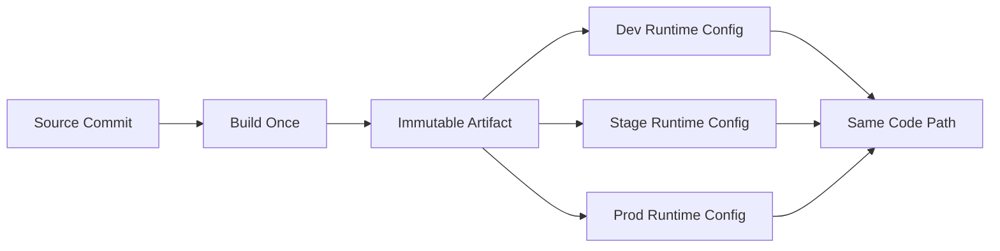
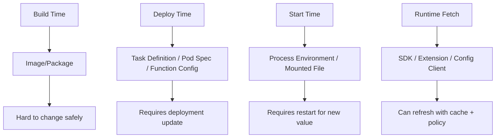
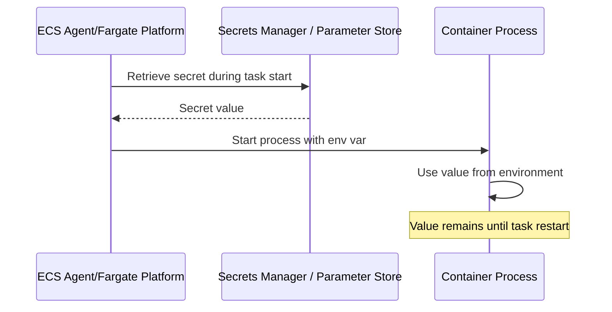
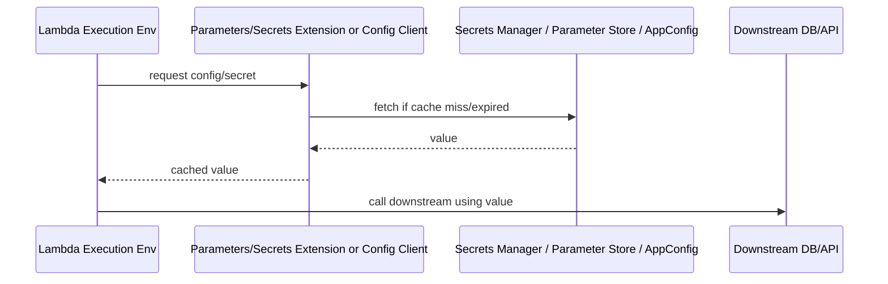
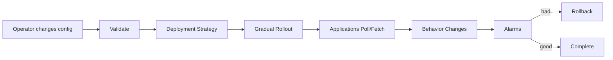
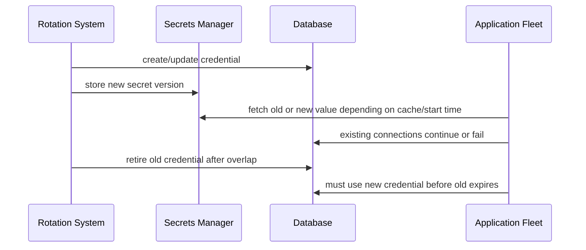
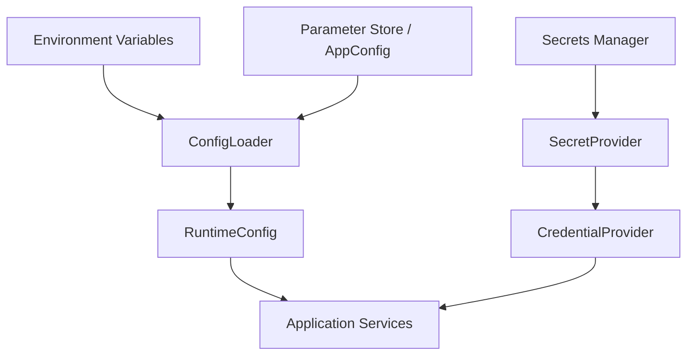

# Part 011 — Runtime Configuration and Secret Injection

A production artifact should be boring.

The image digest, Lambda package, or deployment bundle should not know whether it is running in `dev`, `stage`, `prod`, `eu-central-1`, `ap-southeast-1`, tenant A, tenant B, or a regulated account.

The artifact should contain code. The environment should provide runtime facts.

That sounds simple, but a large percentage of real incidents come from weak configuration boundaries:

- a production container accidentally built with staging config,
- a secret copied into a Docker image layer,
- a Lambda function redeployed only to change a feature flag,
- a rotated database password not picked up by long-running tasks,
- a Kubernetes Secret treated as secure because it is base64-encoded,
- a queue worker consuming production events while pointed at a staging dependency,
- a canary release using the wrong downstream endpoint,
- an emergency feature kill switch that requires a full redeploy.

Runtime configuration is not a convenience feature. It is a control surface.

Secret injection is not just about hiding passwords. It is about defining who can read sensitive values, when they are materialized, where they live in memory/files/process metadata, how they rotate, and how you prove access was legitimate.

---

## 1. The Core Rule: Build Once, Configure Many

The same artifact should move through environments.

```txt
source commit
  -> build
  -> image digest / package hash
  -> dev
  -> stage
  -> prod
```

Do not do this:

```txt
build-dev-image
build-stage-image
build-prod-image
```

That pattern destroys release evidence. You no longer know whether production is running the same executable bits that passed tests.

The better model:

```txt
artifact identity = code + dependencies + runtime base
runtime config   = environment-specific facts
```



Configuration should select behavior within an already-tested artifact. It should not mutate the artifact.

### Production invariant

> An environment change must not silently create a new binary.

When a production behavior changes, you should be able to say which of these changed:

1. code artifact,
2. infrastructure topology,
3. runtime configuration,
4. secret material,
5. feature/config flag,
6. event contract,
7. downstream dependency.

If your system cannot separate those categories, your incident analysis will be slow and unreliable.

---

## 2. Configuration Taxonomy

Not all configuration is the same. Treating everything as environment variables creates fragile systems.

| Type | Example | Changes How Often | Secret? | Needs Dynamic Reload? | Good Storage Pattern |
|---|---|---:|---:|---:|---|
| Build metadata | git SHA, build time, image digest | per build | no | no | label/env/resource tag |
| Environment identity | `prod`, `stage`, region, cell | rarely | no | no | env var / deployment config |
| Static dependency endpoint | queue URL, event bus name, service URL | occasionally | no | usually no | env var / Parameter Store |
| Operational knob | batch size, timeout, concurrency cap | sometimes | no | often yes | AppConfig / Parameter Store with cache |
| Feature flag | enable new path for tenant X | frequently | no | yes | AppConfig feature flags |
| Credential | DB password, API token | rotation schedule | yes | maybe | Secrets Manager / mounted secret / runtime fetch |
| Certificate/key material | mTLS cert, private key | rotation schedule | yes | yes/no | Secrets Manager / ACM / CSI mount |
| Tenant mapping | tenant -> config profile | business-driven | maybe | yes | database / config service |
| Policy config | allowlist, threshold, rule version | governed | maybe | yes | versioned config store / AppConfig |
| Local dev override | fake endpoints, sandbox creds | local only | maybe | no | local env file, never committed |

The mistake is not using environment variables. The mistake is using them as the only abstraction.

---

## 3. The Four Injection Times

Every configuration value enters the system at a time. That time determines rotation behavior, rollback behavior, and blast radius.



### Build time

Examples:

- compiling a URL into code,
- copying `.env.prod` into the image,
- baking a certificate into a layer,
- downloading production config during image build.

Avoid this for environment-specific values.

Build-time config is acceptable for:

- build metadata,
- static application defaults,
- non-secret dependency versions,
- generated code that is environment-independent.

### Deploy time

Examples:

- ECS task definition environment variables,
- Kubernetes Deployment env vars,
- Lambda environment variables,
- App Runner service environment variables,
- Step Functions state machine definition parameters.

Deploy-time config is good for values that should change only through a controlled release process.

### Start time

Examples:

- ECS injects a Secrets Manager value into a container environment,
- Kubernetes mounts a Secret as a file,
- a sidecar writes config before the main process starts,
- Lambda initializes a cached config client during init.

Start-time config means new values usually require a restart, new task, new pod, or new execution environment.

### Runtime fetch

Examples:

- app reads Secrets Manager when a connection is created,
- Lambda extension retrieves a secret over local HTTP,
- service polls AWS AppConfig,
- Java service watches a mounted file.

Runtime fetch gives flexibility, but it creates new failure modes:

- config service outage,
- stale cache,
- inconsistent config across instances,
- accidental rapid rollout,
- thundering herd when cache expires,
- latency added to hot path.

There is no free pattern. Choose deliberately.

---

## 4. Environment Variables: Useful, Dangerous, Overused

Environment variables are a process interface. They are not a secret-management strategy by themselves.

Good uses:

```txt
APP_ENV=prod
AWS_REGION=ap-southeast-1
HTTP_PORT=8080
LOG_LEVEL=INFO
ORDER_QUEUE_URL=https://sqs.ap-southeast-1.amazonaws.com/...
EVENT_BUS_NAME=prod-domain-events
MAX_WORKER_THREADS=32
```

Risky uses:

```txt
DB_PASSWORD=...
JWT_PRIVATE_KEY=...
PAYMENT_PROVIDER_SECRET=...
```

Why risky?

- Environment variables can leak through diagnostics, crash dumps, debug endpoints, logs, shell sessions, and process inspection.
- They are materialized at process start.
- Rotation usually requires restart or redeploy.
- They encourage flat string config without schema, validation, or versioning.

### Rule of thumb

Use environment variables for:

- small,
- static,
- non-secret,
- deployment-scoped,
- startup-only values.

Use runtime config systems for:

- feature flags,
- operational knobs,
- dynamic thresholds,
- rollout controls,
- values that must change safely without redeploy.

Use secret managers for:

- credentials,
- tokens,
- private keys,
- certificates,
- anything that would create an incident if copied into a log.

---

## 5. ECS and Fargate Configuration Model

In ECS, configuration enters through the task definition and service deployment.

Important ECS concepts:

- task definition revision,
- container definition,
- `environment`,
- `secrets`,
- task role,
- execution role,
- log configuration,
- service deployment.

### ECS environment variables

Example:

```json
{
  "containerDefinitions": [
    {
      "name": "orders-api",
      "image": "123456789012.dkr.ecr.ap-southeast-1.amazonaws.com/orders@sha256:...",
      "environment": [
        { "name": "APP_ENV", "value": "prod" },
        { "name": "AWS_REGION", "value": "ap-southeast-1" },
        { "name": "ORDER_QUEUE_URL", "value": "https://sqs.ap-southeast-1.amazonaws.com/123456789012/orders-prod" }
      ]
    }
  ]
}
```

This is fine for non-secret deployment-scoped values.

### ECS secret injection

ECS supports referencing AWS Secrets Manager or Systems Manager Parameter Store values through `secrets` in the container definition.

```json
{
  "containerDefinitions": [
    {
      "name": "orders-api",
      "secrets": [
        {
          "name": "DB_PASSWORD",
          "valueFrom": "arn:aws:secretsmanager:ap-southeast-1:123456789012:secret:prod/orders/db/password-AbCdEf"
        }
      ]
    }
  ]
}
```

This is better than writing the literal secret into the task definition.

But understand the lifecycle:



If the secret rotates, a running container that only reads `DB_PASSWORD` from the process environment will not automatically use the new value. New tasks can receive new values; old tasks retain old values until replaced.

That is acceptable if your rotation strategy includes:

- overlapping credential validity,
- connection pool refresh,
- controlled task replacement,
- deployment or service force-new-deployment after rotation.

### ECS task role vs execution role

Do not confuse these.

| Role | Used By | Common Permissions |
|---|---|---|
| Execution role | ECS agent/Fargate platform | pull ECR image, write logs, fetch injected secrets |
| Task role | application container | call AWS APIs at runtime |

If the application fetches secrets at runtime, the **task role** needs permission. If ECS injects secrets at start, the **execution role** commonly needs the retrieval permission.

A production review should ask:

- Can the application read more secrets than it needs?
- Can the execution role read secrets across unrelated services?
- Are secret ARNs scoped by environment and service?
- Can a dev task definition reference a prod secret?
- Can a compromised worker read API credentials for an unrelated API service?

---

## 6. Lambda Configuration Model

Lambda has a different shape. A Lambda function is not a long-running process you directly control. It has function configuration, execution environments, and invocation lifecycle.

Common sources:

- Lambda environment variables,
- Secrets Manager runtime fetch,
- AWS Parameters and Secrets Lambda Extension,
- Powertools parameter utilities,
- AppConfig extension/client,
- event payload,
- Lambda layer default config.

### Lambda environment variables

Good:

```txt
APP_ENV=prod
POWERTOOLS_SERVICE_NAME=orders-worker
IDEMPOTENCY_TABLE=orders-idempotency-prod
EVENT_BUS_NAME=prod-domain-events
```

Avoid storing sensitive credentials directly in Lambda environment variables. AWS Lambda documentation recommends Secrets Manager for database credentials and other sensitive values.

### Lambda runtime fetch pattern



This pattern helps avoid direct SDK calls on every invocation, but you must design cache TTLs.

### Lambda config cache rules

For Lambda, cache is a weapon and a risk.

Cache helps:

- reduce latency,
- reduce Secrets Manager/API cost,
- reduce throttling,
- improve cold path performance.

Cache hurts when:

- secret rotation requires immediate uptake,
- kill-switch config must apply quickly,
- stale config creates inconsistent behavior across warm environments,
- multiple concurrent execution environments refresh at once.

Use different TTLs by value type:

| Value Type | Suggested Cache Thinking |
|---|---|
| DB endpoint | long TTL or environment variable |
| DB password | TTL aligned with rotation overlap and pool refresh |
| kill switch | short TTL or extension with controlled polling |
| feature flag | AppConfig client/extension with deployment strategy |
| tenant policy | versioned read with cache + explicit invalidation where needed |

### Lambda init vs invoke

A common pattern:

```java
public class Handler implements RequestHandler<SQSEvent, Void> {
    private final ConfigClient configClient;
    private final OrderService orderService;

    public Handler() {
        this.configClient = ConfigClient.fromEnvironment();
        this.orderService = new OrderService(configClient);
    }

    @Override
    public Void handleRequest(SQSEvent event, Context context) {
        RuntimeConfig cfg = configClient.current();
        orderService.process(event, cfg);
        return null;
    }
}
```

Do not make the constructor perform fragile network calls without timeout control. A failed init can turn into cold-start failures across many concurrent environments.

Better:

- initialize clients in constructor,
- lazily fetch remote config with bounded timeout,
- cache with explicit TTL,
- use safe defaults only for non-security behavior,
- fail closed for security-sensitive config.

---

## 7. EKS Configuration Model

Kubernetes gives you more knobs, and therefore more ways to hurt yourself.

Primary mechanisms:

- ConfigMap,
- Secret,
- environment variables from ConfigMap/Secret,
- mounted ConfigMap/Secret volumes,
- External Secrets Operator,
- Secrets Store CSI Driver with AWS provider,
- application runtime fetch through AWS SDK,
- GitOps-managed configuration,
- service mesh/config sidecars.

### ConfigMap vs Secret

ConfigMap is for non-sensitive configuration.

Kubernetes Secret is for sensitive data, but do not misunderstand it:

- Secret values are typically base64-encoded, not magically secure by default.
- Security depends on etcd encryption, RBAC, admission policy, audit logging, namespace boundary, and workload identity.
- Any pod with permission to mount/read the Secret can get the value.

### Environment variable injection

```yaml
apiVersion: apps/v1
kind: Deployment
metadata:
  name: orders-api
spec:
  template:
    spec:
      containers:
        - name: orders-api
          image: 123456789012.dkr.ecr.ap-southeast-1.amazonaws.com/orders@sha256:...
          envFrom:
            - configMapRef:
                name: orders-api-config
          env:
            - name: DB_PASSWORD
              valueFrom:
                secretKeyRef:
                  name: orders-db-secret
                  key: password
```

This is simple but restart-bound.

If the Secret changes, environment variables inside an already-running process do not change.

### Mounted config files

```yaml
volumes:
  - name: runtime-config
    configMap:
      name: orders-api-config
containers:
  - name: orders-api
    volumeMounts:
      - name: runtime-config
        mountPath: /etc/orders
        readOnly: true
```

Mounted files can update, but your application must actually reload them safely. Many applications read files only at startup.

### AWS Secrets into EKS pods

A common production pattern is using the Secrets Store CSI Driver with the AWS provider to mount secrets from AWS Secrets Manager or SSM Parameter Store into pods.

```yaml
apiVersion: secrets-store.csi.x-k8s.io/v1
kind: SecretProviderClass
metadata:
  name: orders-secrets
spec:
  provider: aws
  parameters:
    objects: |
      - objectName: "prod/orders/db"
        objectType: "secretsmanager"
        jmesPath:
          - path: password
            objectAlias: db-password
```

Pod example:

```yaml
volumes:
  - name: secrets-store-inline
    csi:
      driver: secrets-store.csi.k8s.io
      readOnly: true
      volumeAttributes:
        secretProviderClass: orders-secrets
containers:
  - name: orders-api
    volumeMounts:
      - name: secrets-store-inline
        mountPath: /mnt/secrets-store
        readOnly: true
```

This pattern avoids copying secret values into Kubernetes manifests, but it introduces another runtime dependency:

- CSI driver availability,
- AWS provider availability,
- IAM/Pod Identity correctness,
- node/plugin lifecycle,
- mount-time behavior,
- rotation sync semantics.

Use it deliberately.

---

## 8. App Runner Configuration Model

App Runner is intentionally simpler than ECS/EKS. You define a service from source code or container image, then configure runtime environment variables, networking, scaling, and observability.

Good use cases:

- small API/web service,
- team does not need custom scheduler behavior,
- no complex service mesh,
- simple deployment path,
- minimal platform operation.

Config anti-pattern:

```txt
Use App Runner because it avoids platform work, then recreate a complex platform through runtime hacks.
```

If you need advanced traffic control, sidecars, custom scheduling, deep pod/task-level controls, or complex network policy, App Runner may stop being the right abstraction.

---

## 9. Step Functions and EventBridge: Do Not Smuggle Secrets Through Events

Step Functions and EventBridge often carry state and events between services. They should not become secret transport systems.

Bad pattern:

```json
{
  "orderId": "ord-123",
  "dbPassword": "...",
  "paymentProviderApiKey": "..."
}
```

Better pattern:

```json
{
  "orderId": "ord-123",
  "tenantId": "tenant-456",
  "credentialRef": "prod/payment/provider/main"
}
```

Then the executing workload resolves the credential using its own identity.

Why?

- Step Functions execution history is a diagnostic and audit surface.
- EventBridge archives/replays events.
- Logs and tracing may capture payload snippets.
- Events may fan out to multiple targets.
- A target may have less privilege than the producer.

### Event payload invariant

> Events should carry business facts and references, not reusable secret material.

---

## 10. Dynamic Configuration with AWS AppConfig

Some configuration must change without redeploying compute.

Examples:

- disable a risky feature,
- lower worker batch size during downstream incident,
- route tenant group to old path,
- change validation threshold,
- pause external provider integration,
- reduce concurrency cap,
- enable diagnostic sampling for one service.

This is where a dynamic configuration service matters.

AWS AppConfig is designed for feature flags and dynamic configurations that let teams adjust application behavior in production without full code deployment. Use it when the value needs controlled rollout, validation, and rollback semantics.



### AppConfig is not for everything

Do not put every static value into dynamic config.

Use AppConfig for values that need:

- safe runtime change,
- validation,
- staged rollout,
- feature flag targeting,
- fast rollback,
- operational control.

Do not use it for:

- immutable build metadata,
- every constant,
- secrets that belong in Secrets Manager,
- values that only change through release approval,
- configuration that must be strongly consistent across all instances instantly.

Dynamic config is eventually observed. Design accordingly.

---

## 11. Config Schema and Validation

Stringly typed configuration is a production smell.

Bad:

```java
int batchSize = Integer.parseInt(System.getenv("BATCH_SIZE"));
boolean newFlow = Boolean.parseBoolean(System.getenv("NEW_FLOW"));
Duration timeout = Duration.ofMillis(Long.parseLong(System.getenv("TIMEOUT")));
```

Better:

```java
public record RuntimeConfig(
    String appEnv,
    URI orderQueueUrl,
    int workerBatchSize,
    Duration downstreamTimeout,
    boolean paymentProviderEnabled
) {
    public RuntimeConfig {
        if (workerBatchSize < 1 || workerBatchSize > 10) {
            throw new IllegalArgumentException("workerBatchSize must be 1..10");
        }
        if (downstreamTimeout.isNegative() || downstreamTimeout.toSeconds() > 30) {
            throw new IllegalArgumentException("downstreamTimeout must be <= 30s");
        }
    }
}
```

The point is not the Java record. The point is the boundary.

A production service should have a config loader that:

- reads from sources,
- parses values,
- validates schema,
- applies defaults deliberately,
- rejects unsafe combinations,
- redacts secrets in logs,
- exposes non-secret effective config for diagnostics,
- produces a stable config hash/version.

### Effective config hash

For incident debugging, it is useful to log a hash/version of non-secret config:

```txt
service=orders-api version=1.42.7 image=sha256:abc configVersion=2026-07-06T10:15Z configHash=8f2a91
```

Never include secret values in the hash input unless you are sure the hash cannot be used as an oracle. In most systems, keep secret material out of diagnostic hashes.

---

## 12. Secret Rotation Is a Runtime Problem

Rotating a value in Secrets Manager is only half the system.

The application must survive the rotation.



Rotation design questions:

1. Are old and new credentials valid simultaneously for a window?
2. How long can applications cache the old value?
3. How are connection pools refreshed?
4. What happens to long-running transactions?
5. How are failed authentication attempts alerted?
6. How do ECS tasks/pods/Lambda environments get the new value?
7. Can rotation be rolled back?
8. Who owns the runbook when rotation breaks production?

### ECS rotation pattern

If ECS injects the DB password as an environment variable:

1. rotate secret with overlap,
2. force new deployment of ECS service,
3. allow tasks to drain gracefully,
4. validate new tasks connect,
5. retire old credential after safe window.

### EKS rotation pattern

If pods mount secrets as files:

1. ensure CSI/operator supports desired refresh behavior,
2. ensure application reloads file or pods restart,
3. use rollout controller if restart is required,
4. monitor authentication failures.

### Lambda rotation pattern

If Lambda fetches secret at runtime:

1. set cache TTL below rotation overlap,
2. refresh connection pools when secret changes,
3. handle authentication failure by invalidating cache once,
4. avoid every invocation calling Secrets Manager directly.

A robust app can react to authentication failure like this:

```java
try {
    return db.execute(query);
} catch (AuthenticationFailedException e) {
    secrets.invalidate("orders-db");
    dbPool.recreate(secrets.get("orders-db"));
    return db.execute(query);
}
```

Do not implement infinite retry. One forced refresh is a recovery path. Repeated auth failure is an incident.

---

## 13. Configuration Reload Strategies

There are four practical reload strategies.

| Strategy | How It Works | Best For | Main Risk |
|---|---|---|---|
| Restart-only | config changes require new task/pod/env | simple static config | slower response |
| Poll with TTL | app periodically fetches config | feature flags, knobs | stale/inconsistent reads |
| File watch | mounted config updates on disk | K8s/CSI patterns | app reload bugs |
| Control-plane push | platform triggers restart/reload | controlled rollout | operational complexity |

### Restart-only

This is underrated. For many critical services, restart-only config is safer because changes go through deployment control.

Use restart-only for:

- database endpoint,
- network dependency names,
- event bus names,
- security mode,
- auth issuer,
- tenant isolation mode.

### Poll with TTL

Use for operational knobs:

- batch size,
- sampling rate,
- feature flag,
- provider enable/disable,
- circuit breaker threshold.

Rules:

- no remote call in hot path without cache,
- jitter cache refresh,
- expose config version,
- validate before activating,
- keep last-known-good value,
- define fail-open/fail-closed behavior per key.

### File watch

Use when a platform mounts config/secrets as files.

Rules:

- treat file updates as atomic only if the provider guarantees it,
- parse into a new immutable config object,
- validate before swapping,
- never partially update global mutable state,
- log version change without secret content.

### Control-plane push

Examples:

- Kubernetes rollout restart,
- ECS force-new-deployment,
- Lambda publish new version with updated env,
- AppConfig deployment strategy.

This gives better governance but requires platform automation.

---

## 14. Naming and Hierarchy

Configuration names should encode ownership and blast radius.

A useful pattern:

```txt
/<org>/<env>/<region>/<domain>/<service>/<key>
```

Example:

```txt
/acme/prod/ap-southeast-1/orders/orders-api/db/password
/acme/prod/ap-southeast-1/orders/orders-worker/batch-size
/acme/stage/ap-southeast-1/orders/orders-api/downstream/payment-url
```

For multi-account AWS, avoid putting too much environment identity in the key if the account already encodes it. But do not make names ambiguous.

Bad:

```txt
/db/password
/api-key
/config
```

Good:

```txt
/prod/orders/orders-api/db/main/password
/prod/payments/provider-x/api-token
/prod/case-management/escalation/feature-flags
```

A good naming convention lets you write IAM policies that are precise.

---

## 15. IAM Boundaries for Config and Secrets

Secrets are only as protected as their access path.

### Bad policy shape

```json
{
  "Effect": "Allow",
  "Action": "secretsmanager:GetSecretValue",
  "Resource": "*"
}
```

### Better policy shape

```json
{
  "Effect": "Allow",
  "Action": [
    "secretsmanager:GetSecretValue",
    "secretsmanager:DescribeSecret"
  ],
  "Resource": [
    "arn:aws:secretsmanager:ap-southeast-1:123456789012:secret:prod/orders/orders-api/*"
  ]
}
```

### Design questions

- Is secret access scoped by service?
- Is it scoped by environment/account?
- Is it scoped by region?
- Can CI read production secrets?
- Can developers read production secrets directly?
- Can a compromised pod enumerate secret names?
- Does CloudTrail show who retrieved secret values?
- Are KMS permissions aligned with Secrets Manager permissions?

A common mistake is restricting Secrets Manager permissions but leaving broad KMS decrypt permissions. Review both.

---

## 16. Observability Without Leaking Secrets

A production system needs enough config visibility to debug incidents. But config visibility can leak secrets.

Expose:

- config source names,
- config version,
- config hash,
- non-secret effective values,
- active feature flag names and variants,
- secret version ID or stage, if safe,
- last refresh time,
- refresh error count.

Do not expose:

- secret values,
- credentials,
- tokens,
- private keys,
- full connection strings with passwords,
- signed URLs,
- sensitive tenant policy contents.

### Redaction helper

Every service should have a redaction convention:

```java
static String redact(String key, String value) {
    String k = key.toLowerCase(Locale.ROOT);
    if (k.contains("password") || k.contains("secret") || k.contains("token") || k.contains("key")) {
        return "<redacted>";
    }
    return value;
}
```

This helper is not security by itself. It is a guardrail against accidental log leaks.

---

## 17. Failure Modes

Configuration failure modes are predictable.

| Failure | Symptom | Root Cause | Prevention |
|---|---|---|---|
| Missing env var | app fails at startup | deployment config incomplete | fail fast with schema validation |
| Wrong env target | prod calls stage dependency | bad config promotion | environment-scoped names and tests |
| Secret stale after rotation | auth failures | app never reloads | rotation overlap + restart/reload runbook |
| Secret leaked in logs | incident/security event | debug log dumps env/config | redaction + log review |
| Config typo | fleet-wide outage | no validation | schema + AppConfig validators |
| Dynamic flag too broad | bad behavior across all tenants | unsafe rollout | staged deployment + alarms |
| Config service outage | startup/invoke failures | no cache/last-known-good | cache + fallback policy |
| Overbroad secret IAM | lateral movement | wildcard permissions | service-scoped IAM |
| Local config committed | credential leak | `.env` checked in | secret scanning + gitignore + training |
| Event carries secret | secret persists in history/archive | bad event contract | reference-only event model |

### The nastiest failure: mixed config fleet

During rollout, some instances may use old config and some new config.

This is normal. Design for it.

Bad assumption:

```txt
At 10:00, config changes everywhere instantly.
```

Real behavior:

```txt
10:00 instance A reloads
10:01 instance B reloads
10:03 Lambda env C still warm with old cached config
10:05 pod D restarts and reads new config
```

Therefore, config changes must be backward-compatible unless you can force synchronized restart and drain.

---

## 18. Java Implementation Pattern

A clean Java service should isolate config loading.



### Runtime config interface

```java
public interface RuntimeConfigProvider {
    RuntimeConfig current();
}

public interface SecretProvider {
    SecretValue get(String name);
    void invalidate(String name);
}
```

### Environment loader

```java
public final class EnvironmentConfigLoader {
    public RuntimeConfig load(Map<String, String> env) {
        return new RuntimeConfig(
            required(env, "APP_ENV"),
            URI.create(required(env, "ORDER_QUEUE_URL")),
            intRange(env, "WORKER_BATCH_SIZE", 1, 10, 5),
            durationMillis(env, "DOWNSTREAM_TIMEOUT_MS", 100, 30_000, 2_000),
            bool(env, "PAYMENT_PROVIDER_ENABLED", true)
        );
    }

    private static String required(Map<String, String> env, String key) {
        String value = env.get(key);
        if (value == null || value.isBlank()) {
            throw new IllegalStateException("Missing required config: " + key);
        }
        return value;
    }

    private static int intRange(Map<String, String> env, String key, int min, int max, int def) {
        String raw = env.get(key);
        int value = raw == null ? def : Integer.parseInt(raw);
        if (value < min || value > max) {
            throw new IllegalStateException(key + " must be between " + min + " and " + max);
        }
        return value;
    }

    private static Duration durationMillis(Map<String, String> env, String key, long min, long max, long def) {
        String raw = env.get(key);
        long value = raw == null ? def : Long.parseLong(raw);
        if (value < min || value > max) {
            throw new IllegalStateException(key + " must be between " + min + "ms and " + max + "ms");
        }
        return Duration.ofMillis(value);
    }

    private static boolean bool(Map<String, String> env, String key, boolean def) {
        String raw = env.get(key);
        return raw == null ? def : Boolean.parseBoolean(raw);
    }
}
```

### Cached runtime provider

```java
public final class CachedRuntimeConfigProvider implements RuntimeConfigProvider {
    private final Supplier<RuntimeConfig> loader;
    private final Duration ttl;
    private volatile RuntimeConfig cached;
    private volatile Instant expiresAt = Instant.EPOCH;

    public CachedRuntimeConfigProvider(Supplier<RuntimeConfig> loader, Duration ttl) {
        this.loader = loader;
        this.ttl = ttl;
    }

    @Override
    public RuntimeConfig current() {
        Instant now = Instant.now();
        RuntimeConfig local = cached;
        if (local != null && now.isBefore(expiresAt)) {
            return local;
        }
        synchronized (this) {
            now = Instant.now();
            if (cached != null && now.isBefore(expiresAt)) {
                return cached;
            }
            RuntimeConfig fresh = loader.get();
            cached = fresh;
            expiresAt = now.plus(ttl).plus(jitter(ttl));
            return fresh;
        }
    }

    private Duration jitter(Duration base) {
        long millis = Math.max(1, base.toMillis() / 10);
        return Duration.ofMillis(ThreadLocalRandom.current().nextLong(millis));
    }
}
```

### Last-known-good pattern

If remote config fetch fails, decide whether to use the last-known-good value.

```java
public RuntimeConfig reload() {
    try {
        RuntimeConfig fresh = remoteConfigClient.fetchAndValidate();
        lastKnownGood.set(fresh);
        return fresh;
    } catch (Exception e) {
        RuntimeConfig fallback = lastKnownGood.get();
        if (fallback != null && fallback.isNonSecurityCritical()) {
            log.warn("Using last-known-good config", e);
            return fallback;
        }
        throw e;
    }
}
```

Fail-open vs fail-closed is a business and security decision.

Examples:

| Config | Failure Behavior |
|---|---|
| feature flag for new UI | fail closed/off |
| fraud threshold | fail closed/conservative |
| debug sampling | fail closed/off |
| payment provider kill switch | prefer last-known-good, but alert loudly |
| authorization policy | fail closed |
| worker batch size | safe default |

---

## 19. Deployment Patterns

### Pattern A — Static config through IaC

Use for stable service wiring.

```txt
CDK/Terraform/SAM defines:
- queue URL/name
- event bus name
- table name
- service endpoint
- Lambda env vars
- ECS task env vars
```

Pros:

- reviewable,
- versioned,
- repeatable,
- good audit trail.

Cons:

- change requires deployment,
- not ideal for rapid operational controls.

### Pattern B — Secret reference in runtime spec

Use ECS/EKS/Lambda/App Runner mechanism to reference secrets without hardcoding values.

Pros:

- value not committed,
- IAM controls retrieval,
- rotation possible.

Cons:

- may be start-bound,
- still materializes in process/file,
- rotation requires app/runtime strategy.

### Pattern C — Runtime config client

Use AppConfig/Parameter Store/Secrets Manager from application code or extension.

Pros:

- dynamic,
- less redeploy pressure,
- good for feature flags and knobs.

Cons:

- app complexity,
- cache correctness,
- remote dependency,
- inconsistent fleet during rollout.

### Pattern D — Config sidecar

A sidecar retrieves config/secrets and exposes file/local endpoint.

Pros:

- language-agnostic,
- centralizes provider behavior,
- can support refresh.

Cons:

- sidecar lifecycle coupling,
- added failure mode,
- not available/equivalent everywhere,
- more moving parts.

---

## 20. Platform Guardrails

A mature platform does not rely on every team remembering all rules.

Guardrails:

- block Dockerfiles that copy `.env` or secret-like files,
- scan repositories for committed secrets,
- enforce ECR tag immutability and digest deployment,
- require task roles/pod identities to be scoped,
- lint ECS task definitions for literal secret-looking env vars,
- require Kubernetes Secret encryption and RBAC review,
- block wildcard `secretsmanager:GetSecretValue`,
- require AppConfig validators for dynamic numeric thresholds,
- require secret rotation runbook for production database credentials,
- provide service templates with config loader already implemented.

### Example policy checks

```txt
Reject deployment if:
- env var name contains PASSWORD/TOKEN/SECRET and value is literal
- task role can read arn:aws:secretsmanager:*:*:secret:*
- Lambda env contains private key header
- Kubernetes manifest contains Secret with plaintext in Git
- AppConfig deployment has no alarm for critical flag
- service lacks config schema validation on startup
```

---

## 21. Practical Design Review Questions

Use these in architecture review.

### Artifact/config boundary

- Can the same artifact be promoted from stage to prod?
- Are environment-specific values outside the image/package?
- Can we identify the artifact digest/hash running now?
- Can we identify the config version running now?

### Secret access

- Which identity can read each secret?
- Is access scoped by environment and service?
- Are secrets read at deploy, start, or runtime?
- Where is the secret materialized?
- How is it redacted from logs?

### Rotation

- What happens when the secret rotates?
- Do running tasks/pods/functions get the new value?
- Is there credential overlap?
- Do connection pools refresh?
- What metric catches rotation failure?

### Dynamic config

- Which values can change without redeploy?
- Who can change them?
- Are changes validated?
- Are changes rolled out gradually?
- Can a bad config be rolled back?
- What is fail-open vs fail-closed behavior?

### Incident response

- Can we see effective config without exposing secrets?
- Can we correlate an incident to config version?
- Can we roll back config independently from code?
- Can we quickly disable a failing integration?

---

## 22. Hands-on Lab: Config Contract for Orders Service

Build a Java service config layer with these sources:

```txt
Environment variables:
- APP_ENV
- AWS_REGION
- ORDER_QUEUE_URL
- EVENT_BUS_NAME
- CONFIG_PROFILE

Secrets Manager:
- DB credentials
- payment provider token

AppConfig:
- paymentProviderEnabled
- workerBatchSize
- downstreamTimeoutMs
- tracingSampleRate
```

### Required behavior

1. Service fails fast if required static config is missing.
2. Non-secret effective config is logged at startup.
3. Secret values are never logged.
4. Dynamic config is cached with jittered TTL.
5. Invalid dynamic config is rejected.
6. Last-known-good config is used only for non-security-critical values.
7. Secret cache can be invalidated after authentication failure.
8. `/internal/config` endpoint shows redacted config and version.
9. ECS task definition uses `secrets` for start-bound credentials or task role for runtime fetch.
10. Lambda variant uses extension/client with TTL and no per-invocation direct secret fetch.

### Minimal config schema

```json
{
  "paymentProviderEnabled": true,
  "workerBatchSize": 5,
  "downstreamTimeoutMs": 2000,
  "tracingSampleRate": 0.05
}
```

### Validation rules

```txt
workerBatchSize: 1..10
downstreamTimeoutMs: 100..30000
tracingSampleRate: 0.0..1.0
paymentProviderEnabled: boolean
```

### Expected incident drill

Run the service, then simulate:

1. missing required env var,
2. malformed dynamic config,
3. secret rotation,
4. config service outage,
5. accidental logging of full config,
6. wrong queue URL for environment,
7. kill switch activation.

The service should make each failure obvious and bounded.

---

## 23. Common Anti-Patterns

### Anti-pattern 1 — `.env.prod` copied into image

This couples artifact and environment. It also risks leaking secrets in image layers.

### Anti-pattern 2 — one global secret for all services

If every service reads the same database superuser password, one compromised task becomes a platform-wide incident.

### Anti-pattern 3 — feature flags as Lambda environment variables

A flag that requires redeploy is not an operational flag. It is deployment config.

### Anti-pattern 4 — dynamic config without validation

Fast bad config is still bad config.

### Anti-pattern 5 — secret rotation without application behavior design

Rotating the stored value is not enough. The app must use the new value before the old one is invalid.

### Anti-pattern 6 — using events as config transport

Events should be facts. Configuration should be resolved by the consumer through controlled access.

### Anti-pattern 7 — logging entire environment at startup

This is convenient exactly once. Then it becomes an incident.

---

## 24. Mental Model Summary

Runtime configuration is the boundary between immutable artifact and mutable environment.

Secret injection is the boundary between identity and sensitive material.

Dynamic config is the boundary between deployment and operational control.

A top-tier engineer asks:

- What changes require a new artifact?
- What changes require a redeploy?
- What changes require a restart?
- What changes can happen live?
- What values are secret?
- What values must be strongly governed?
- What is the failure mode of stale config?
- What is the blast radius of bad config?
- What evidence proves which config was active?

If you can answer those questions, configuration stops being environment-variable plumbing and becomes a production control system.

---

## References

- AWS ECS Developer Guide — Pass Secrets Manager secrets through Amazon ECS environment variables: https://docs.aws.amazon.com/AmazonECS/latest/developerguide/secrets-envvar-secrets-manager.html
- AWS ECS Developer Guide — Pass Systems Manager parameters through Amazon ECS environment variables: https://docs.aws.amazon.com/AmazonECS/latest/developerguide/secrets-envvar-ssm-paramstore.html
- AWS ECS Developer Guide — Pass sensitive data to an Amazon ECS container: https://docs.aws.amazon.com/AmazonECS/latest/developerguide/specifying-sensitive-data.html
- AWS Lambda Developer Guide — Working with Lambda environment variables: https://docs.aws.amazon.com/lambda/latest/dg/configuration-envvars.html
- AWS Lambda Developer Guide — Use Secrets Manager secrets in Lambda functions: https://docs.aws.amazon.com/lambda/latest/dg/with-secrets-manager.html
- AWS Secrets Manager User Guide — Rotate AWS Secrets Manager secrets: https://docs.aws.amazon.com/secretsmanager/latest/userguide/rotating-secrets.html
- AWS Systems Manager User Guide — Parameter Store: https://docs.aws.amazon.com/systems-manager/latest/userguide/systems-manager-parameter-store.html
- AWS AppConfig User Guide — What is AWS AppConfig?: https://docs.aws.amazon.com/appconfig/latest/userguide/what-is-appconfig.html
- AWS Secrets Manager User Guide — AWS Secrets and Configuration Provider for Kubernetes: https://docs.aws.amazon.com/secretsmanager/latest/userguide/integrating_ascp_irsa.html
