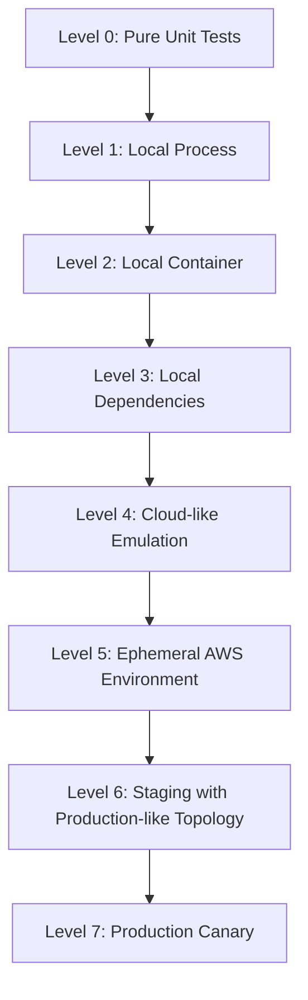
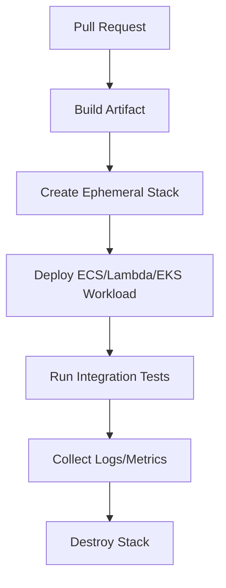

# Part 012 — Local Development and Cloud Parity

Local development has one job:

> Give fast feedback without lying too much.

Cloud parity has one job:

> Ensure the thing that passed locally still behaves correctly under real AWS contracts.

These two goals are related, but not identical.

A weak engineering culture treats local development as proof:

> “It worked on my machine, so it should work in AWS.”

A stronger culture treats local development as the first filter:

> “It worked locally, so now it deserves to be tested against the real control plane, real IAM, real networking, real limits, and real failure semantics.”

For containers and serverless, this distinction matters a lot.

You can run a Java container locally. You cannot fully reproduce ECS service scheduler behavior locally.

You can invoke a Lambda handler locally. You cannot fully reproduce Lambda concurrency, event source mapping, retry behavior, IAM boundary, execution environment lifecycle, or regional quota behavior locally.

You can emulate SQS or EventBridge behavior. You cannot fully prove AWS event delivery, policy, throttling, archive/replay, DLQ, and integration edge cases without running in AWS.

Local development is for speed. AWS environments are for truth.

---

## 1. The Parity Ladder

Do not think of parity as yes/no. Think in levels.



Each level catches different bugs.

| Level | Catches | Does Not Prove |
|---|---|---|
| Unit test | business logic, validation, edge cases | runtime integration |
| Local process | config parsing, handler logic | container lifecycle |
| Local container | Dockerfile, entrypoint, signal handling | AWS scheduler/network/IAM |
| Local dependencies | DB/queue contract basics | managed-service semantics |
| Emulation | event shape, API usage | exact AWS behavior |
| Ephemeral AWS | IAM, networking, deployability | production scale/noise |
| Staging | integrated topology | production traffic distribution |
| Canary | real traffic, real behavior | all future traffic patterns |

The goal is not to push every test to the highest level. That would be slow and expensive.

The goal is to put each risk at the cheapest level that can catch it honestly.

---

## 2. What Local Can and Cannot Prove

### Local can prove

- code compiles,
- unit logic passes,
- container starts,
- process handles SIGTERM,
- health endpoint responds,
- config schema validates,
- basic dependency contract works,
- handler parses expected event shape,
- idempotency logic works against a test store,
- retry wrapper behaves for simulated errors,
- Dockerfile does not require missing files,
- app does not need root filesystem write access except intended paths.

### Local cannot fully prove

- IAM least privilege,
- ECS deployment circuit breaker behavior,
- ALB target health timing,
- VPC endpoint/NAT behavior,
- Lambda regional concurrency behavior,
- SQS-Lambda partial batch semantics under scale,
- EventBridge rule matching in all real integration cases,
- Step Functions service integration permissions,
- EKS CNI IP allocation pressure,
- CloudWatch log/metric cost and cardinality,
- AWS service quotas,
- production latency distribution,
- multi-AZ failure behavior.

A mature workflow accepts this instead of pretending otherwise.

---

## 3. The Correct Mental Model: Emulate, Simulate, Verify

There are three different activities.

| Activity | Meaning | Example | Confidence Level |
|---|---|---|---|
| Emulate | run a local implementation of a cloud service/API | local SQS emulator | medium |
| Simulate | inject conditions into your app | fake timeout, duplicate event | high for app logic |
| Verify | run against real AWS | deploy ECS service in sandbox | high for integration |

A common mistake is trying to emulate everything.

You do not need a perfect local AWS. You need:

1. fast app feedback,
2. enough local contracts to prevent stupid mistakes,
3. real AWS verification before production.

---

## 4. Recommended Feedback Architecture

For AWS containers and serverless, use this feedback loop.

```mermaid
flowchart LR
    A[Code Change] --> B[Unit Tests]
    B --> C[Component Tests]
    C --> D[Build Image/Package]
    D --> E[Local Container/SAM Test]
    E --> F[Contract Tests]
    F --> G[Ephemeral AWS Deploy]
    G --> H[Integration Tests]
    H --> I[Staging]
    I --> J[Canary]
    J --> K[Production]
```



### Minimum practical loop

For a Java service deployed to ECS:

```txt
unit tests
component tests with Testcontainers
Docker build
container smoke test
local SIGTERM test
push image to ECR sandbox
deploy to ephemeral ECS service
hit ALB/private endpoint
assert logs/metrics/health
```

For a Java Lambda function:

```txt
unit tests
handler tests with event JSON fixtures
component tests with Testcontainers/local dependency
SAM local invoke for basic runtime packaging
package/deploy to sandbox
invoke through real event source
assert retry/DLQ/idempotency behavior
```

For EKS workload:

```txt
unit tests
container build
local kind/minikube smoke where useful
manifest validation
policy validation
deploy to ephemeral namespace/cluster
assert ingress, service account identity, config, probes
```

---

## 5. Local Container Development

A production container should be locally runnable with minimal ceremony.

Example command:

```bash
docker build -t orders-api:local .

docker run --rm \
  -p 8080:8080 \
  -e APP_ENV=local \
  -e ORDER_QUEUE_URL=http://localhost:4566/000000000000/orders-local \
  -e EVENT_BUS_NAME=local-domain-events \
  orders-api:local
```

### Local smoke test

```bash
curl -fsS http://localhost:8080/health/live
curl -fsS http://localhost:8080/health/ready
```

### Local graceful shutdown test

```bash
cid=$(docker run -d -p 8080:8080 orders-api:local)
sleep 3
docker stop --time 30 "$cid"
docker logs "$cid"
```

Expected application behavior:

```txt
received SIGTERM
stop accepting new requests
finish in-flight requests
stop worker pollers
flush telemetry
close connections
exit 0
```

If your service cannot pass this locally, do not expect ECS/EKS to save it.

---

## 6. Docker Compose: Useful, But Do Not Build a Fake Cloud

Docker Compose is useful for running local dependency clusters.

Example:

```yaml
services:
  orders-api:
    build: .
    ports:
      - "8080:8080"
    environment:
      APP_ENV: local
      AWS_REGION: ap-southeast-1
      ORDER_QUEUE_URL: http://localstack:4566/000000000000/orders-local
      POSTGRES_URL: jdbc:postgresql://postgres:5432/orders
    depends_on:
      - postgres
      - localstack

  postgres:
    image: postgres:16
    environment:
      POSTGRES_USER: orders
      POSTGRES_PASSWORD: orders
      POSTGRES_DB: orders
    ports:
      - "5432:5432"

  localstack:
    image: localstack/localstack:latest
    environment:
      SERVICES: sqs,sns,eventbridge,secretsmanager,ssm
      AWS_DEFAULT_REGION: ap-southeast-1
    ports:
      - "4566:4566"
```

This is good for:

- developer onboarding,
- simple API calls,
- queue publish/consume loop,
- database integration,
- smoke testing configuration.

It is not good for proving:

- AWS IAM,
- service quotas,
- managed retries,
- ALB/NLB behavior,
- ECS/EKS scheduler decisions,
- Lambda event source scaling,
- CloudWatch integration,
- production networking.

### Rule

> Compose should accelerate development, not become an alternative universe.

If a local stack grows into a 40-service pseudo-cloud, it becomes slow, flaky, and misleading.

---

## 7. Testcontainers for Java Component Tests

For Java teams, Testcontainers is usually a better default than requiring every developer to run a permanent local dependency stack.

Example with PostgreSQL:

```java
@Testcontainers
class OrderRepositoryTest {

    @Container
    static PostgreSQLContainer<?> postgres = new PostgreSQLContainer<>("postgres:16")
        .withDatabaseName("orders")
        .withUsername("orders")
        .withPassword("orders");

    @Test
    void insertsAndLoadsOrder() {
        OrderRepository repo = new OrderRepository(
            postgres.getJdbcUrl(),
            postgres.getUsername(),
            postgres.getPassword()
        );

        OrderId id = repo.save(new Order("tenant-1", "PENDING"));
        Order loaded = repo.get(id);

        assertEquals("PENDING", loaded.status());
    }
}
```

### Why this is powerful

- dependencies start per test suite,
- tests are closer to real protocol behavior,
- no shared developer machine state,
- CI can run the same tests,
- database migrations can be tested.

### Where it falls short

- does not test RDS-specific behavior,
- does not test IAM auth unless explicitly integrated,
- does not test VPC/security group boundaries,
- does not test production connection pool pressure.

Use Testcontainers for component correctness. Use AWS environments for platform correctness.

---

## 8. Local Lambda Development with SAM CLI

AWS SAM CLI provides local commands such as `sam local invoke` and `sam local start-api` to run Lambda functions locally. This is useful for handler packaging, event fixtures, and fast iteration.

### Example event fixture

```json
{
  "Records": [
    {
      "messageId": "msg-1",
      "body": "{\"orderId\":\"ord-123\",\"tenantId\":\"tenant-1\"}",
      "eventSource": "aws:sqs",
      "awsRegion": "ap-southeast-1"
    }
  ]
}
```

### Invoke locally

```bash
sam local invoke OrdersWorkerFunction --event events/sqs-order-created.json
```

### Start local API

```bash
sam local start-api
curl -X POST http://127.0.0.1:3000/orders \
  -H 'content-type: application/json' \
  -d '{"tenantId":"tenant-1","items":[{"sku":"A","qty":1}]}'
```

### What SAM local is good at

- packaging sanity,
- handler invocation,
- event fixture testing,
- local API shape,
- basic environment variable behavior,
- catching missing files/layers/dependencies.

### What SAM local does not fully prove

- real Lambda scaling,
- event source mapping polling,
- async retries,
- DLQ/destination behavior,
- IAM execution role correctness,
- CloudWatch integration,
- X-Ray/OpenTelemetry behavior under real runtime,
- cold start distribution.

### Lambda handler test rule

Keep most business logic outside the handler.

Bad:

```java
public SQSEventResponse handleRequest(SQSEvent event, Context ctx) {
    // parse, validate, call DB, call payment, publish event, update state,
    // handle idempotency, metrics, retry decisions all here
}
```

Better:

```java
public SQSEventResponse handleRequest(SQSEvent event, Context ctx) {
    return adapter.handle(event, ctx);
}
```

Then unit/component test the adapter and service directly. Use SAM local for packaging and event-shape confidence, not for every business logic test.

---

## 9. Event Fixture Discipline

Serverless systems often fail because event fixtures are vague or unrealistic.

Create a versioned fixture library.

```txt
test-fixtures/
  sqs/
    order-created-v1.json
    order-created-duplicate.json
    order-created-malformed.json
    order-created-large-message.json
  eventbridge/
    order-paid-v1.json
    order-cancelled-v2.json
  api-gateway/
    create-order-valid.json
    create-order-unauthorized.json
  step-functions/
    approval-timeout-input.json
```

Each fixture should declare:

- source service,
- schema version,
- expected handler behavior,
- idempotency key,
- failure expectation,
- whether it is a real captured shape or synthetic.

### Example fixture metadata

```json
{
  "fixtureName": "order-created-duplicate",
  "source": "sqs",
  "schemaVersion": "order.created.v1",
  "expectation": "handler treats duplicate as success without duplicate side effect",
  "payload": {
    "Records": []
  }
}
```

Local confidence depends on fixture quality.

Fake perfect events create fragile production systems.

---

## 10. Contract Tests for Events and APIs

Event-driven systems need contract tests.

A producer must prove:

- event type is correct,
- required fields exist,
- schema version is correct,
- compatibility rules are honored,
- no secret material appears in event,
- idempotency key is available,
- event source/detail-type conventions are stable.

A consumer must prove:

- it accepts old compatible versions,
- it rejects malformed events safely,
- duplicate events do not create duplicate side effects,
- unknown optional fields do not break parsing,
- missing required fields go to the correct failure path.

### Example event schema

```json
{
  "$schema": "https://json-schema.org/draft/2020-12/schema",
  "title": "OrderCreatedV1",
  "type": "object",
  "required": ["eventId", "eventType", "occurredAt", "tenantId", "orderId"],
  "properties": {
    "eventId": { "type": "string" },
    "eventType": { "const": "order.created.v1" },
    "occurredAt": { "type": "string", "format": "date-time" },
    "tenantId": { "type": "string" },
    "orderId": { "type": "string" }
  },
  "additionalProperties": true
}
```

### Compatibility rule

For most internal events:

```txt
Adding optional fields is compatible.
Removing fields is breaking.
Changing type is breaking.
Changing semantic meaning is breaking even if JSON shape is same.
```

---

## 11. Ephemeral AWS Environments

Local testing catches app bugs. Ephemeral AWS environments catch cloud integration bugs.

An ephemeral environment is a short-lived environment created per branch, pull request, or test run.



### What to include

For ECS:

- ECR image,
- task definition,
- service or run-task,
- security group,
- private subnet wiring,
- ALB if relevant,
- SQS/EventBridge dependencies,
- IAM task role,
- logs.

For Lambda:

- function/package/image,
- execution role,
- event source mapping,
- SQS/EventBridge/API Gateway integration,
- DLQ/destination,
- log group,
- timeout/concurrency config.

For EKS:

- namespace,
- service account identity,
- deployment,
- ingress/route if needed,
- config/secrets reference,
- policy checks,
- autoscaling objects if relevant.

### What not to include by default

- expensive shared databases per PR unless needed,
- production-scale clusters,
- long-lived NAT-heavy stacks,
- every optional downstream,
- manual cleanup dependencies.

Ephemeral environments need cost and cleanup discipline.

---

## 12. Cloud Parity Test Matrix

Use a matrix to decide where each risk is tested.

| Risk | Unit | Local Container | Emulation | Ephemeral AWS | Staging | Canary |
|---|---:|---:|---:|---:|---:|---:|
| Business validation | yes | maybe | no | no | no | no |
| Dockerfile correctness | no | yes | no | yes | yes | yes |
| SIGTERM handling | no | yes | no | yes | yes | yes |
| IAM permission | no | no | no | yes | yes | yes |
| VPC endpoint/NAT | no | no | no | yes | yes | yes |
| Lambda SQS partial batch | unit logic | no | partial | yes | yes | yes |
| ECS service deployment | no | no | no | yes | yes | yes |
| Event schema compatibility | yes | yes | yes | yes | yes | yes |
| Step Functions IAM integration | no | no | no | yes | yes | yes |
| Production traffic shape | no | no | no | no | partial | yes |
| Quota behavior | no | no | no | partial | partial | yes |
| Observability cost | no | no | no | partial | yes | yes |

This matrix prevents false confidence.

---

## 13. Local AWS Emulation: Useful Boundaries

Tools like LocalStack can be useful for local AWS-like APIs. Use them for speed, not final proof.

Good uses:

- SQS send/receive/delete loop,
- SNS publish/fanout basics,
- simple EventBridge put-events flow,
- Parameter Store/Secrets Manager API usage,
- S3 object put/get basics,
- local onboarding,
- component tests for adapter code.

Danger zones:

- IAM semantics,
- throttling behavior,
- eventual consistency details,
- retry policies of managed integrations,
- DLQ redrive behavior,
- CloudWatch logs/metrics/traces,
- Lambda event source mapping behavior,
- exact service quotas,
- networking path.

### Adapter test pattern

Create a small adapter layer for AWS clients.

```java
public interface EventPublisher {
    void publish(DomainEvent event);
}

public final class EventBridgePublisher implements EventPublisher {
    private final EventBridgeClient client;
    private final String busName;

    @Override
    public void publish(DomainEvent event) {
        PutEventsRequest request = PutEventsRequest.builder()
            .entries(PutEventsRequestEntry.builder()
                .eventBusName(busName)
                .source("orders.service")
                .detailType(event.type())
                .detail(event.toJson())
                .build())
            .build();

        PutEventsResponse response = client.putEvents(request);
        if (response.failedEntryCount() > 0) {
            throw new EventPublishException(response.entries().toString());
        }
    }
}
```

Test locally:

- request construction,
- serialization,
- error mapping,
- retry wrapper,
- idempotency behavior.

Verify in AWS:

- bus permission,
- rule matching,
- target invocation,
- archive/replay if used,
- DLQ if configured.

---

## 14. ECS Local-to-Cloud Workflow

A strong ECS development loop looks like this:

```txt
1. run unit/component tests
2. build image
3. run container locally
4. health check locally
5. signal handling test
6. push image to ECR sandbox
7. register task definition
8. deploy service or run task
9. assert target health / task status
10. run integration tests
11. inspect logs/metrics
12. destroy ephemeral resources
```

### Local task definition approximation

You can keep a local run script generated from task definition-like config.

```bash
#!/usr/bin/env bash
set -euo pipefail

docker run --rm \
  --name orders-api-local \
  -p 8080:8080 \
  -e APP_ENV=local \
  -e AWS_REGION=ap-southeast-1 \
  -e ORDER_QUEUE_URL="$ORDER_QUEUE_URL" \
  -e EVENT_BUS_NAME=local-domain-events \
  orders-api:local
```

But do not pretend this tests:

- ECS task role,
- execution role,
- CloudWatch log driver,
- ALB target group registration,
- Fargate platform version,
- ENI allocation,
- service deployment rollback.

Those belong in ephemeral AWS or staging.

---

## 15. EKS Local-to-Cloud Workflow

Local Kubernetes with kind/minikube can be useful for manifest sanity, but EKS-specific behavior must be verified in EKS.

Local can test:

- Deployment object shape,
- container probes,
- ConfigMap/Secret mounting,
- basic Service behavior,
- Helm/Kustomize rendering,
- admission policy if installed locally.

EKS must verify:

- IAM role for service account or Pod Identity,
- VPC CNI behavior,
- ALB/NLB controller behavior,
- security groups for pods,
- managed add-ons,
- node provisioning,
- Fargate profile scheduling,
- CloudWatch/OpenTelemetry integration,
- private endpoint/networking.

### Manifest validation pipeline

```txt
helm template / kustomize build
  -> kubeconform/kubeval schema check
  -> policy check
  -> image digest check
  -> namespace deploy in EKS sandbox
  -> smoke test
```

### Example smoke assertions

```bash
kubectl -n pr-123 rollout status deploy/orders-api
kubectl -n pr-123 get pods -o wide
kubectl -n pr-123 exec deploy/orders-api -- curl -fsS localhost:8080/health/ready
```

Also verify cloud identity:

```bash
kubectl -n pr-123 exec deploy/orders-api -- aws sts get-caller-identity
```

In production, do not leave `aws` CLI inside application images just for this. Use debug images, ephemeral containers, or controlled diagnostics.

---

## 16. Lambda Local-to-Cloud Workflow

Lambda needs special care because local invocation often misses the hard parts.

### Local tests

- handler parsing,
- event fixture compatibility,
- business logic,
- idempotency,
- timeout budget in code,
- dependency initialization,
- packaging sanity with SAM local.

### Cloud tests

- execution role,
- function timeout/memory,
- environment variables,
- Secrets Manager/AppConfig access,
- event source mapping,
- DLQ/destination,
- reserved concurrency,
- logs/traces,
- partial batch response,
- async retry behavior.

### Example cloud integration test for SQS Lambda

```txt
1. deploy function + queue + event source mapping
2. send valid message
3. wait for side effect
4. send duplicate message
5. assert no duplicate side effect
6. send poison message
7. assert DLQ after configured attempts
8. send partial batch with one bad item
9. assert good items succeed and bad item remains/fails according to design
```

A local handler test cannot prove this whole chain.

---

## 17. Step Functions Local Testing Strategy

Step Functions workflows are durable coordinators. Local testing should focus on state machine shape and business transitions, but cloud testing must verify service integrations.

Local/static checks:

- state machine definition validates,
- states have clear names,
- retry/catch blocks exist,
- timeout/heartbeat configured where needed,
- input/output paths are tested with sample JSON,
- compensation paths are represented.

Cloud tests:

- IAM integration permissions,
- Lambda/ECS/SQS integrations,
- callback token behavior,
- execution history visibility,
- Express vs Standard semantics,
- failure/retry timing,
- alarm/metric behavior.

### Workflow fixture example

```json
{
  "caseId": "case-123",
  "tenantId": "tenant-1",
  "action": "SUBMIT_FOR_REVIEW",
  "requestedBy": "user-789"
}
```

Test transitions:

```txt
Submitted -> ValidateCase -> ReserveCapacity -> NotifyReviewer -> WaitForDecision
```

Then simulate failures:

```txt
ValidateCase fails -> terminal business rejection
ReserveCapacity timeout -> retry then compensation
NotifyReviewer fails -> retry then DLQ/manual repair
WaitForDecision timeout -> escalation path
```

---

## 18. Failure Simulation Locally

Local development is excellent for deterministic failure simulation.

Inject failures through interfaces.

```java
public interface PaymentClient {
    PaymentResult charge(PaymentRequest request);
}
```

Test cases:

```java
@Test
void retriesTransientFailureOnce() {
    PaymentClient flaky = new FlakyPaymentClient(
        List.of(timeout(), success("payment-123"))
    );

    PaymentService service = new PaymentService(flaky, retryPolicy);
    PaymentResult result = service.charge(request);

    assertEquals("payment-123", result.id());
}
```

Simulate:

- timeout,
- throttling,
- duplicate event,
- malformed event,
- downstream 500,
- downstream 409 conflict,
- partial batch failure,
- stale config,
- auth failure after secret rotation,
- out-of-order event.

Local simulation gives high confidence in your code's decision logic. It does not prove AWS integration.

---

## 19. Local Observability

Do not wait until production to structure logs and traces.

Local service logs should already look like production logs.

```json
{
  "timestamp": "2026-07-06T10:00:00Z",
  "level": "INFO",
  "service": "orders-api",
  "env": "local",
  "traceId": "local-trace-123",
  "tenantId": "tenant-1",
  "orderId": "ord-123",
  "message": "order created"
}
```

### Local telemetry goals

- structured logging,
- correlation ID propagation,
- redaction,
- metrics naming,
- trace span boundaries,
- error classification.

You do not need the full production telemetry backend locally. But the code should emit telemetry in the same shape.

### Local log smell

Bad:

```txt
System.out.println("here")
```

Better:

```txt
logger.info("order transition completed", kv("orderId", orderId), kv("from", from), kv("to", to));
```

---

## 20. Managing Local Secrets

Local development needs secrets too, but local secrets must not contaminate source control or production processes.

Rules:

- never commit `.env` with real credentials,
- use `.env.example` with fake values,
- use separate sandbox AWS accounts for developer access,
- avoid long-lived personal access keys where possible,
- use AWS SSO/Identity Center or short-lived credentials,
- make local config obviously local,
- rotate shared development credentials,
- run secret scanning in CI.

Example:

```txt
.env.example
.env.local       # gitignored
.env.test        # fake/test-only values
```

`.env.example`:

```txt
APP_ENV=local
AWS_REGION=ap-southeast-1
ORDER_QUEUE_URL=http://localhost:4566/000000000000/orders-local
EVENT_BUS_NAME=local-domain-events
DB_URL=jdbc:postgresql://localhost:5432/orders
DB_USERNAME=orders
DB_PASSWORD=orders
```

Never use production secret names in local defaults.

Bad:

```txt
DB_SECRET_ARN=arn:aws:secretsmanager:...:secret:prod/orders/db
```

Good:

```txt
DB_SECRET_ARN=local/orders/db
```

---

## 21. Avoiding Environment Drift

Drift happens when local, CI, staging, and production evolve separately.

### Drift sources

- different Java version,
- different base image,
- different environment variables,
- different queue/event names,
- different IAM assumptions,
- different database engine/version,
- different serialization config,
- different timezone/locale,
- different CPU architecture,
- different memory limit,
- different timeout.

### Drift controls

- dev containers or standardized toolchain,
- same Dockerfile for local and production,
- IaC-generated config outputs,
- `.env.example` generated from schema,
- contract tests,
- dependency lock files,
- CI uses the same build commands,
- image digest promotion,
- ephemeral AWS verification.

### Runtime metadata endpoint

A safe internal endpoint can help expose non-secret runtime facts:

```json
{
  "service": "orders-api",
  "version": "1.42.7",
  "gitSha": "abc123",
  "imageDigest": "sha256:...",
  "env": "stage",
  "region": "ap-southeast-1",
  "configVersion": "2026-07-06T10:00Z",
  "javaVersion": "25",
  "timezone": "UTC"
}
```

This helps detect drift quickly.

---

## 22. Preview Environments: The Production-Like Sweet Spot

For many teams, the highest leverage investment is not more local emulation. It is cheap preview environments.

A preview environment should be:

- automated,
- isolated,
- named by PR/branch,
- cost-capped,
- short-lived,
- observable,
- cleaned automatically,
- production-like enough for the risk under test.

### Example naming

```txt
pr-481-orders-api
pr-481-orders-worker
pr-481-event-bus
pr-481-orders-queue
```

### Cleanup invariant

Every preview resource must have tags:

```txt
Environment=preview
Owner=platform-ci
PullRequest=481
ExpiresAt=2026-07-07T00:00:00Z
Service=orders
```

A cleanup job deletes expired resources.

If cleanup is manual, preview environments will eventually become an expensive landfill.

---

## 23. Cloud Parity for Cost and Performance

Local tests are almost useless for AWS cost and performance.

They cannot reveal:

- NAT gateway data processing cost,
- CloudWatch log ingestion volume,
- Lambda duration under cold start,
- Fargate CPU/memory sizing economics,
- EKS node bin-packing efficiency,
- image pull latency,
- VPC endpoint cost trade-off,
- Step Functions transition cost,
- EventBridge event volume cost,
- telemetry cardinality explosion.

Cost/performance tests belong in AWS environments with realistic traffic models.

### Minimum performance signals

For each service, record:

- p50/p95/p99 latency,
- cold start rate if Lambda,
- task/pod startup time if container,
- CPU/memory utilization,
- queue age,
- retry count,
- log bytes per request/event,
- downstream call count,
- cost per 1,000 requests/events/jobs.

Cost is a runtime behavior, not just a billing surprise.

---

## 24. Local Development Golden Path

A platform team should provide a golden path.

```txt
make test
make component-test
make docker-build
make docker-run
make smoke
make sam-local-invoke
make deploy-preview
make integration-test
make destroy-preview
```

Example `Makefile`:

```makefile
SERVICE=orders-api
IMAGE=$(SERVICE):local

.PHONY: test
test:
	./mvnw test

.PHONY: component-test
component-test:
	./mvnw verify -Pcomponent

.PHONY: docker-build
docker-build:
	docker build -t $(IMAGE) .

.PHONY: docker-run
docker-run:
	docker run --rm -p 8080:8080 --env-file .env.local $(IMAGE)

.PHONY: smoke
smoke:
	curl -fsS http://localhost:8080/health/live
	curl -fsS http://localhost:8080/health/ready

.PHONY: sigterm-test
sigterm-test:
	./scripts/test-sigterm.sh $(IMAGE)
```

The goal is not fancy tooling. The goal is reducing cognitive load.

A new engineer should be able to run the service locally and understand what local does and does not prove.

---

## 25. Platform Documentation Template

Every service should document its local/cloud workflow.

```md
# orders-api development

## Local prerequisites
- Java 25
- Docker
- AWS CLI configured for sandbox account

## Fast tests
make test

## Component tests
make component-test

## Run locally
cp .env.example .env.local
make docker-build
make docker-run

## Local smoke
make smoke

## Deploy preview
make deploy-preview PR=481

## Integration test
make integration-test PR=481

## Destroy preview
make destroy-preview PR=481

## What local proves
- business logic
- container startup
- health endpoints
- basic queue adapter behavior

## What requires AWS
- IAM
- SQS event source behavior
- ECS service deployment
- ALB target health
- CloudWatch logs/metrics
```

This prevents misunderstandings.

---

## 26. Common Anti-Patterns

### Anti-pattern 1 — Local-only confidence

The team ships because all local tests passed, but no one verified IAM, networking, or event source behavior in AWS.

### Anti-pattern 2 — Cloud-only development

Every small change requires deploying to AWS. Feedback is too slow, so engineers batch changes and debugging becomes painful.

### Anti-pattern 3 — Giant local pseudo-cloud

The local environment tries to emulate everything. It becomes slow, flaky, and still not equivalent to AWS.

### Anti-pattern 4 — No event fixtures

Handlers are tested with hand-written partial JSON that does not match real AWS event shape.

### Anti-pattern 5 — Shared mutable dev environment

Everyone tests in the same dev stack. Tests interfere with each other. No one trusts the results.

### Anti-pattern 6 — Preview environments without cleanup

Costs grow until the organization disables preview environments entirely.

### Anti-pattern 7 — Different build path locally and in CI

Local uses IDE magic. CI uses Maven/Docker. Production uses another script. Bugs hide in the gaps.

---

## 27. Design Review Questions

### Local loop

- Can a new engineer run the service locally in less than one page of instructions?
- Does local use the same Dockerfile as production?
- Are local secrets fake or sandbox-only?
- Are event fixtures realistic and versioned?
- Can we test graceful shutdown locally?

### Cloud verification

- Which tests run in real AWS before merge or release?
- Do we verify IAM permissions?
- Do we verify event source behavior?
- Do we verify deployment health and rollback signals?
- Do we verify observability output?

### Drift

- What prevents Java/base image/config drift?
- Does CI run the same commands developers run?
- Is environment-specific config generated from IaC outputs?
- Can we identify effective config and artifact digest at runtime?

### Cost/control

- Are preview environments tagged and expired?
- Is there a cleanup job?
- Are expensive dependencies shared safely or mocked deliberately?
- Are logs and metrics bounded during tests?

---

## 28. Hands-on Lab: Local-to-AWS Confidence Pipeline

Build the following for `orders-api` and `orders-worker`.

### Local

1. Java unit tests.
2. Component tests with PostgreSQL Testcontainers.
3. Event fixture tests for SQS and EventBridge.
4. Docker build.
5. Local container run.
6. Health check.
7. SIGTERM test.
8. Local queue publish/consume through an emulator or test adapter.

### AWS preview

1. Push image to ECR sandbox.
2. Deploy ECS/Fargate API service.
3. Deploy SQS queue and worker.
4. Deploy EventBridge bus/rule.
5. Use service-scoped task role.
6. Run integration tests.
7. Assert logs contain correlation IDs.
8. Assert no secrets appear in logs.
9. Force a bad deployment and observe rollback behavior.
10. Destroy preview environment.

### Expected result

At the end, you should be able to say:

```txt
Local proved the application logic and container contract.
Preview AWS proved IAM, networking, deployment, queue/event integration, and telemetry.
Staging/canary will prove production-like traffic and operational behavior.
```

That is the correct confidence model.

---

## 29. Mental Model Summary

Local development is not the opposite of cloud testing. It is the first layer of a confidence system.

Use local for:

- speed,
- business logic,
- container lifecycle basics,
- handler event parsing,
- deterministic failure simulation,
- dependency component tests.

Use AWS preview/staging for:

- IAM,
- networking,
- managed-service semantics,
- deployment health,
- event source mappings,
- scheduler behavior,
- observability,
- quota/cost/performance signals.

A top-tier engineer does not ask:

> Can we test AWS locally?

They ask:

> Which risks can be tested locally honestly, and which must be verified in AWS before production?

That question prevents both slow workflows and false confidence.

---

## References

- AWS SAM Developer Guide — `sam local invoke`: https://docs.aws.amazon.com/serverless-application-model/latest/developerguide/sam-cli-command-reference-sam-local-invoke.html
- AWS SAM Developer Guide — Locally invoke Lambda functions with AWS SAM: https://docs.aws.amazon.com/serverless-application-model/latest/developerguide/serverless-sam-cli-using-invoke.html
- AWS SAM Developer Guide — `sam local start-api`: https://docs.aws.amazon.com/serverless-application-model/latest/developerguide/sam-cli-command-reference-sam-local-start-api.html
- AWS Lambda Developer Guide — Lambda event source mappings: https://docs.aws.amazon.com/lambda/latest/dg/invocation-eventsourcemapping.html
- AWS Step Functions Developer Guide — Amazon States Language and service integrations: https://docs.aws.amazon.com/step-functions/latest/dg/concepts-amazon-states-language.html
- Amazon ECS Developer Guide — Task definitions: https://docs.aws.amazon.com/AmazonECS/latest/developerguide/task_definitions.html
- Amazon EKS User Guide — Amazon EKS networking and add-ons: https://docs.aws.amazon.com/eks/latest/userguide/eks-networking.html
- Testcontainers for Java documentation: https://java.testcontainers.org/
