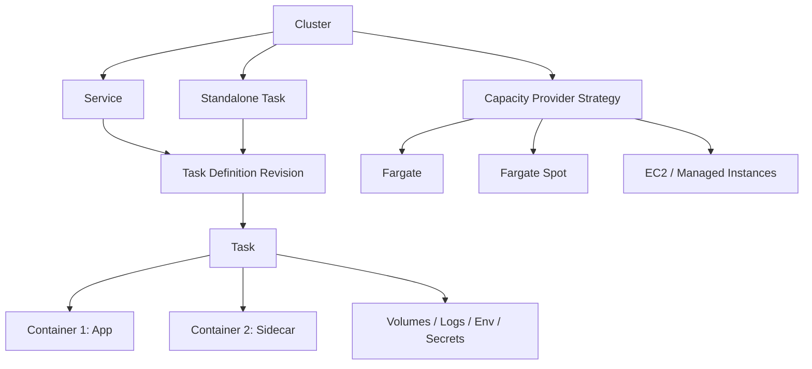
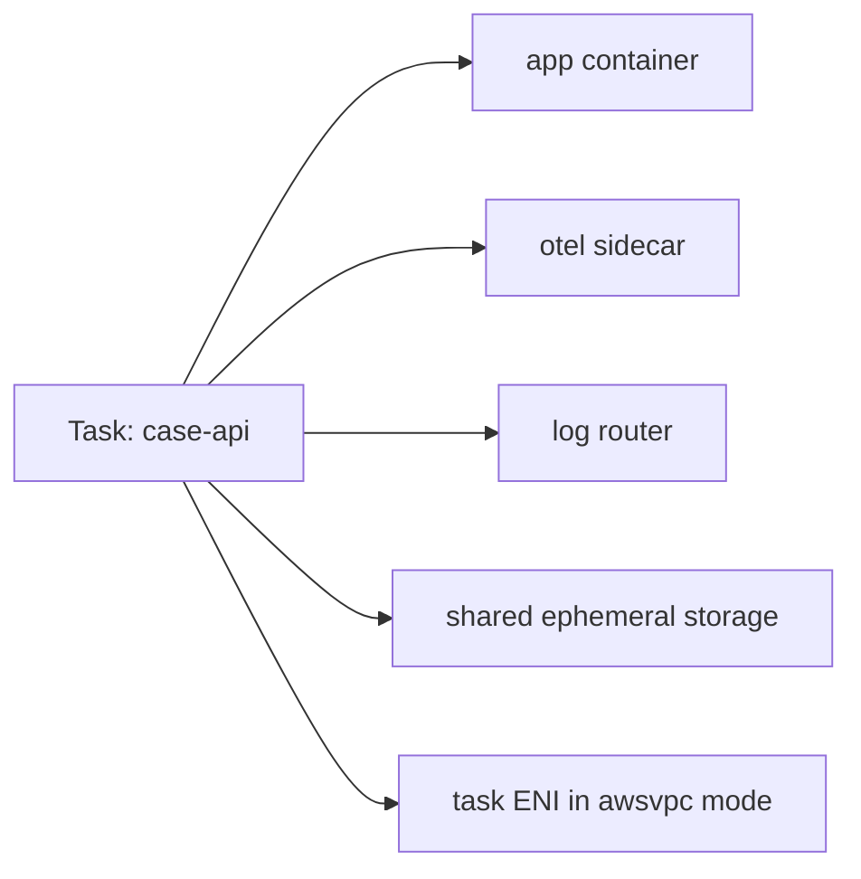
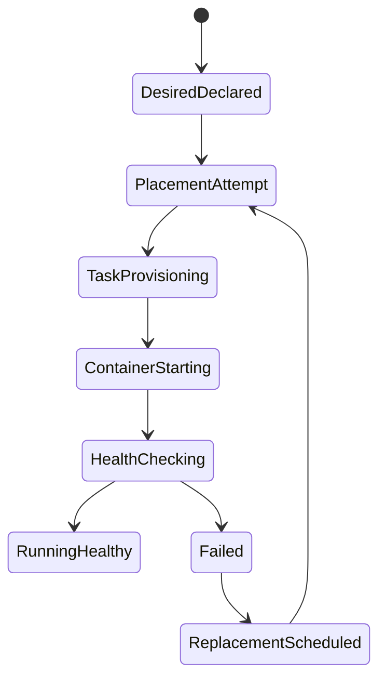
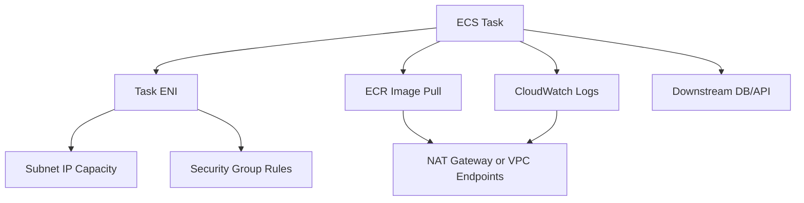
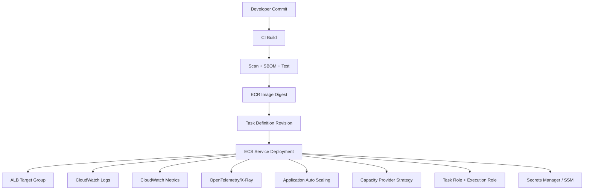

# Part 013 — ECS Mental Model

Amazon ECS sering terlihat sederhana: buat cluster, buat task definition, buat service, deploy image. Itu benar untuk demo, tetapi tidak cukup untuk production.

Di production, ECS harus dipahami sebagai **desired-state scheduler** yang menjaga sejumlah task tetap berjalan di atas kapasitas compute tertentu, dengan integrasi native ke IAM, VPC, ALB/NLB, CloudWatch, EventBridge, ECR, Secrets Manager, Service Connect, dan Application Auto Scaling.

Mental model yang tepat:

> ECS bukan “Docker hosting”. ECS adalah control plane yang mengubah deklarasi aplikasi menjadi task runtime yang berjalan, dipantau, diganti, diskalakan, dan dihubungkan ke infrastruktur AWS lain.

AWS mendefinisikan ECS service sebagai mekanisme untuk menjalankan dan mempertahankan sejumlah instance dari task definition secara bersamaan di cluster. Bila task gagal atau berhenti, ECS service scheduler meluncurkan task pengganti untuk menjaga desired count. Referensi resmi: [Amazon ECS services](https://docs.aws.amazon.com/AmazonECS/latest/developerguide/ecs_services.html).

---

## 1. Model Dasar ECS

Ada tujuh konsep inti yang harus dikuasai:

| Konsep | Fungsi | Salah Kaprah Umum |
|---|---|---|
| Cluster | Boundary logis untuk menjalankan task/service | Dianggap selalu berarti kumpulan server EC2 |
| Task Definition | Blueprint runtime aplikasi | Dianggap sekadar konfigurasi image |
| Task | Instance aktual dari task definition | Dianggap sama dengan container tunggal |
| Container Definition | Spesifikasi satu container dalam task | Dianggap selalu satu task = satu container |
| Service | Desired-state controller untuk long-running task | Dianggap hanya sebagai “deployment object” |
| Capacity Provider | Strategi penyedia kapasitas compute | Diabaikan sampai scaling bermasalah |
| Scheduler | Komponen yang menempatkan dan mengganti task | Dianggap magic tanpa failure semantics |

Hubungannya:



Yang paling penting: **task definition adalah kontrak**, **service adalah controller**, dan **task adalah realisasi runtime**.

---

## 2. ECS Control Plane vs Runtime Reality

ECS memiliki control plane yang menerima deklarasi, menyimpan konfigurasi, mengatur deployment, dan memerintahkan task berjalan. Tetapi aplikasi tetap hidup di data plane:

- container process tetap bisa crash;
- health check tetap bisa salah;
- dependency tetap bisa timeout;
- subnet tetap bisa kekurangan IP;
- NAT gateway tetap bisa menjadi bottleneck biaya atau availability;
- container tetap bisa OutOfMemory;
- task tetap bisa gagal pull image;
- ALB tetap bisa melihat target unhealthy.

Jadi jangan berpikir:

> “Karena ECS managed, berarti operational risk hilang.”

Yang benar:

> “Karena ECS managed, kita tidak mengelola scheduler internals, tetapi kita tetap bertanggung jawab atas runtime contract aplikasi, network boundary, image artifact, scaling signal, dan failure handling.”

---

## 3. Cluster: Boundary Logis, Bukan Selalu Server Pool

Cluster ECS adalah grouping boundary untuk service dan task. Di Fargate, cluster tidak berarti Anda memiliki EC2 instances. Di ECS on EC2, cluster berisi container instances yang menjalankan ECS agent. Dengan capacity providers, cluster bisa menggabungkan beberapa jenis kapasitas.

AWS menyatakan cluster dapat berisi campuran services dan standalone tasks yang menggunakan capacity providers atau launch types. Capacity providers dapat mencakup Fargate, Fargate Spot, dan EC2-backed capacity. Referensi: [Amazon ECS capacity providers for EC2 workloads](https://docs.aws.amazon.com/AmazonECS/latest/developerguide/asg-capacity-providers.html), [Amazon ECS cluster capacity](https://docs.aws.amazon.com/AmazonECS/latest/developerguide/capacity-cluster-best-practice.html).

### 3.1 Cluster sebagai deployment boundary

Cluster bisa dipakai sebagai boundary untuk:

- environment: `dev`, `staging`, `prod`;
- workload class: `public-api`, `internal-worker`, `batch`;
- isolation level: shared platform vs regulated workload;
- capacity strategy: Fargate-only vs EC2-heavy;
- operational ownership: team-owned cluster vs platform-owned cluster.

Contoh cluster layout:

```txt
prod-shared-ecs
  ├── payment-api-service
  ├── case-worker-service
  ├── notification-worker-service
  └── report-generator-task

prod-regulated-ecs
  ├── enforcement-case-api
  ├── audit-projection-worker
  └── evidence-processing-task
```

Tidak ada satu layout universal. Layout yang baik adalah layout yang membuat **blast radius, auditability, scaling ownership, dan quota management** menjadi jelas.

### 3.2 Anti-pattern: satu cluster untuk semua hal tanpa boundary

Satu cluster besar untuk semua workload sering terlihat efisien, tetapi bisa menghasilkan masalah:

- sulit melihat siapa menghabiskan quota;
- sulit membedakan service critical dan non-critical;
- sulit menerapkan deployment policy berbeda;
- capacity provider strategy menjadi campuran tidak jelas;
- alarm dan dashboard menjadi noise;
- insiden satu kelas workload mengganggu visibility workload lain.

Gunakan cluster sebagai boundary logis yang memiliki alasan operasional.

---

## 4. Task Definition: Blueprint yang Versioned

AWS mendefinisikan task definition sebagai blueprint aplikasi dalam JSON yang menjelaskan satu atau lebih container dan parameter runtime-nya. Referensi: [Amazon ECS task definitions](https://docs.aws.amazon.com/AmazonECS/latest/developerguide/task_definitions.html).

Task definition memiliki revisi:

```txt
case-api:1
case-api:2
case-api:3
```

Setiap revisi adalah snapshot konfigurasi runtime. Service menunjuk ke salah satu revisi. Deployment baru biasanya berarti service di-update untuk memakai revision baru.

Task definition mengandung keputusan penting:

- image digest/tag;
- CPU/memory;
- container port;
- environment variable;
- secret injection;
- log driver;
- health check;
- task role;
- execution role;
- ephemeral storage;
- volume;
- sidecar;
- runtime platform;
- ulimits;
- container dependencies.

Di production, perubahan task definition harus diperlakukan seperti perubahan code. Ia bisa menyebabkan outage meskipun image tidak berubah.

### 4.1 Revisi task definition adalah release boundary

Misalnya:

```txt
case-api:17  -> image sha256:a1, memory 1024, env FEATURE_X=false
case-api:18  -> image sha256:b2, memory 1024, env FEATURE_X=false
case-api:19  -> image sha256:b2, memory 2048, env FEATURE_X=false
case-api:20  -> image sha256:b2, memory 2048, env FEATURE_X=true
```

Keempat revisi ini berbeda secara operasional.

Jangan hanya melacak Git commit. Lacak juga:

- task definition revision;
- image digest;
- deployment ID;
- service event timeline;
- alarm state saat deployment;
- rollback target.

---

## 5. Task: Unit Runtime ECS

Task adalah unit runtime ECS. Satu task bisa berisi satu container atau beberapa container yang saling berbagi lifecycle tertentu.

Contoh:



Di Fargate dengan `awsvpc`, task memiliki Elastic Network Interface sendiri. Ini membuat task terasa seperti unit jaringan kecil di VPC: punya IP privat, security group, dan target registration ke load balancer.

### 5.1 Task bukan deployment strategy

Task hanya instance. Deployment strategy ada di service. Kalau Anda menjalankan standalone task, Anda tidak mendapat desired-state behavior seperti service.

Gunakan standalone task untuk:

- one-off migration;
- scheduled job;
- batch task;
- admin operation terkontrol;
- worker yang dipicu Step Functions.

Gunakan service untuk:

- API yang harus selalu hidup;
- long-running worker;
- consumer queue yang harus dipertahankan desired count-nya;
- service yang butuh load balancer;
- service yang butuh autoscaling.

---

## 6. Service: Desired-State Controller

Service adalah objek paling penting untuk long-running workload di ECS.

Service menyimpan beberapa hal:

- desired count;
- task definition revision;
- network configuration;
- load balancer attachment;
- service discovery;
- deployment configuration;
- capacity provider strategy;
- autoscaling target;
- tagging behavior;
- deployment controller.

ECS service scheduler menjaga agar jumlah task sehat mendekati desired count. Bila task berhenti, ECS mengganti task tersebut. Bila service di-update ke task definition baru, ECS melakukan deployment sesuai konfigurasi deployment.

### 6.1 Desired state bukan actual state

Desired count `4` bukan berarti selalu ada empat task sehat setiap milidetik.

Ada jeda karena:

- image pull;
- container startup;
- health check grace period;
- target group registration;
- dependency readiness;
- subnet/IP availability;
- quota;
- throttling;
- deployment replacement.

Model yang benar:



Service bukan jaminan zero failure. Service adalah mekanisme koreksi menuju desired state.

### 6.2 Scheduler invariants

Untuk service production, tanyakan:

1. Berapa desired count minimal agar AZ loss tidak membuat service mati total?
2. Apakah deployment bisa berjalan tanpa menurunkan kapasitas di bawah SLO?
3. Apakah target group health check mengukur readiness yang benar?
4. Apakah startup time masih cocok dengan deployment timeout?
5. Apakah task replacement bisa terjadi saat downstream sedang lambat?
6. Apakah autoscaling signal mengukur demand atau hanya stress?
7. Apakah service bisa terminate task lama dengan graceful shutdown?

Inilah cara membaca ECS seperti engineer produksi, bukan pengguna console.

---

## 7. Deployment Model di ECS

ECS service deployment paling umum adalah rolling update. Saat service di-update, ECS menjalankan task baru, menunggu sehat, lalu menghentikan task lama sesuai `minimumHealthyPercent` dan `maximumPercent`.

AWS mendokumentasikan bahwa deployment configuration menghitung minimum healthy tasks dari `desiredCount * minimumHealthyPercent / 100`, dibulatkan ke atas. Referensi: [DeploymentConfiguration API](https://docs.aws.amazon.com/AmazonECS/latest/APIReference/API_DeploymentConfiguration.html).

Contoh:

```txt
desiredCount = 4
minimumHealthyPercent = 100
maximumPercent = 200
```

Artinya:

- minimum task sehat selama deployment: 4;
- maksimum task yang boleh berjalan sementara: 8;
- ECS bisa menjalankan 4 task baru sebelum menghentikan 4 task lama bila kapasitas tersedia.

Contoh lain:

```txt
desiredCount = 4
minimumHealthyPercent = 50
maximumPercent = 100
```

Artinya:

- minimum task sehat: 2;
- maksimum task berjalan: 4;
- ECS harus menghentikan sebagian task lama sebelum menjalankan task baru;
- ini bisa menurunkan kapasitas melayani traffic.

### 7.1 Deployment circuit breaker

ECS deployment circuit breaker dapat mendeteksi deployment gagal dan menghentikan deployment agar tidak terus mencoba tanpa akhir. Ia juga dapat rollback ke deployment terakhir yang completed bila rollback diaktifkan. Referensi: [How the Amazon ECS deployment circuit breaker detects failures](https://docs.aws.amazon.com/AmazonECS/latest/developerguide/deployment-circuit-breaker.html).

Gunakan circuit breaker untuk production service, tetapi jangan salah paham:

- circuit breaker tidak memperbaiki image buruk;
- circuit breaker tidak mengganti observability;
- rollback bisa gagal bila revisi lama juga tidak bisa berjalan karena dependency berubah;
- alarm-based deployment masih perlu sinyal SLO yang benar.

### 7.2 Deployment timeline yang harus terlihat

Setiap deployment ECS harus bisa dijelaskan seperti ini:

```txt
T0   service update requested
T1   new task definition revision selected
T2   task placement started
T3   image pull started
T4   container started
T5   app readiness returned OK
T6   target group marked healthy
T7   old task deregistration started
T8   old task received SIGTERM
T9   old task stopped after graceful drain
T10  deployment reached steady state
```

Kalau timeline ini tidak bisa direkonstruksi dari logs, metrics, traces, dan ECS events, observability Anda belum cukup.

---

## 8. Capacity Provider: Compute Strategy, Bukan Detail Opsional

Capacity provider menentukan dari mana kapasitas compute berasal.

Jenis umum:

- `FARGATE`: serverless container capacity;
- `FARGATE_SPOT`: kapasitas diskon dengan risiko interruption;
- EC2 Auto Scaling Group capacity provider;
- ECS Managed Instances capacity provider pada region/fitur yang mendukung.

AWS merekomendasikan capacity providers untuk mengelola capacity scaling, dan menyebut Fargate, Fargate Spot, serta EC2 sebagai jenis capacity provider. Referensi: [Amazon ECS cluster capacity best practices](https://docs.aws.amazon.com/AmazonECS/latest/developerguide/capacity-cluster-best-practice.html).

### 8.1 Capacity provider strategy

Strategi capacity provider bisa menggabungkan base dan weight.

Contoh konseptual:

```json
[
  { "capacityProvider": "FARGATE", "base": 2, "weight": 1 },
  { "capacityProvider": "FARGATE_SPOT", "weight": 4 }
]
```

Maknanya:

- dua task pertama selalu di Fargate regular;
- task tambahan lebih banyak diarahkan ke Fargate Spot;
- service tetap punya baseline non-Spot untuk availability.

Ini cocok untuk workload yang toleran terhadap interruption sebagian, misalnya worker non-critical.

Jangan gunakan Fargate Spot untuk semua task critical tanpa model interruption.

### 8.2 Capacity decision matrix

| Workload | Capacity Strategy | Alasan |
|---|---|---|
| Public API critical | Fargate regular atau ECS on EC2 reserved | Stability lebih penting dari diskon |
| Async worker idempotent | Mix Fargate + Fargate Spot | Bisa retry dan tolerate interruption |
| Batch image processing | Fargate Spot / EC2 Spot | Throughput-cost optimized |
| Low-latency API with specialized runtime | ECS on EC2 | Butuh host tuning atau instance family spesifik |
| GPU inference | ECS on EC2 | Fargate tidak cocok untuk semua GPU/server-level needs |
| Regulated isolated workload | Dedicated cluster/capacity | Blast radius dan audit boundary |

---

## 9. Launch Type vs Capacity Provider

Launch type adalah cara lama/sederhana menentukan apakah task berjalan di Fargate atau EC2. Capacity provider lebih fleksibel karena dapat mengekspresikan strategi kapasitas dan scaling.

Di production modern, berpikir dengan capacity provider lebih baik karena:

- bisa mix capacity;
- bisa mengatur base/weight;
- bisa integrasi dengan managed scaling;
- bisa memodelkan Spot vs On-Demand;
- lebih eksplisit sebagai kebijakan scheduling.

Gunakan launch type hanya untuk setup sederhana atau legacy. Untuk platform engineering, gunakan capacity provider strategy.

---

## 10. Networking Mental Model

ECS networking bergantung pada network mode. Untuk Fargate, model utama adalah `awsvpc`.

Di `awsvpc`:

- setiap task mendapat ENI;
- task memiliki private IP sendiri;
- security group bisa diterapkan ke task;
- task berjalan dalam subnet yang dipilih;
- load balancer target type biasanya `ip`;
- outbound internet biasanya butuh NAT gateway atau VPC endpoint;
- image pull dari ECR bisa bergantung pada network path ke ECR/S3 endpoints.

Konsekuensi penting:



Banyak insiden ECS bukan karena container rusak, tetapi karena network path tidak lengkap:

- task di private subnet tidak bisa pull image;
- tidak ada VPC endpoint untuk ECR/Logs/Secrets;
- security group outbound terlalu ketat;
- target group health check path salah;
- subnet kehabisan IP;
- NAT gateway cost/throughput menjadi bottleneck.

---

## 11. IAM Boundary: Execution Role vs Task Role

ECS memiliki dua role yang sering tertukar:

| Role | Digunakan Oleh | Fungsi |
|---|---|---|
| Task execution role | ECS agent/Fargate agent | Pull image, publish logs, retrieve secrets untuk setup task |
| Task role | Application code di container | Memanggil AWS API atas nama aplikasi |

AWS menjelaskan task execution role sebagai role yang memberi ECS container/Fargate agent izin melakukan AWS API calls atas nama Anda untuk kebutuhan task execution. Referensi: [Amazon ECS task execution IAM role](https://docs.aws.amazon.com/AmazonECS/latest/developerguide/task_execution_IAM_role.html).

Prinsipnya:

- execution role bukan hak aplikasi;
- task role bukan hak platform untuk pull image;
- jangan pakai role terlalu luas karena “biar jalan”;
- setiap service sebaiknya punya task role sendiri;
- role harus mencerminkan capability aplikasi.

Contoh salah:

```txt
case-api task role:
  - s3:*
  - dynamodb:*
  - sqs:*
  - secretsmanager:*
```

Contoh lebih baik:

```txt
case-api task role:
  - dynamodb:GetItem/PutItem pada table CaseReadModel
  - sqs:SendMessage pada CaseCommandQueue
  - secretsmanager:GetSecretValue pada secret case-api/db-credentials
```

---

## 12. Service Discovery dan East-West Traffic

ECS service bisa diakses melalui beberapa pola:

1. ALB/NLB untuk north-south traffic;
2. Cloud Map DNS discovery;
3. ECS Service Connect;
4. direct queue/event integration untuk async boundary;
5. private API Gateway/VPC Link untuk boundary tertentu.

Jangan otomatis membuat semua service saling HTTP call.

Untuk microservices, tanyakan:

- apakah consumer butuh response synchronous?
- apakah request harus memblokir user journey?
- apakah failure downstream harus menjatuhkan caller?
- apakah call bisa diganti event atau queue?
- apakah service discovery DNS TTL cocok dengan churn task?
- apakah client punya retry budget dan timeout budget?

ECS membuat service-to-service communication lebih mudah, tetapi tidak menghapus distributed systems problem.

---

## 13. Autoscaling Mental Model

ECS service scaling biasanya mengubah desired count. Scaling bukan sekadar menambah task; scaling adalah kontrol feedback loop.

Signal scaling umum:

| Signal | Cocok Untuk | Risiko |
|---|---|---|
| CPU utilization | CPU-bound service | Buruk untuk I/O-bound latency |
| Memory utilization | Memory-bound service | Bisa terlambat; memory leak bukan demand |
| ALB request count per target | HTTP API | Tidak melihat downstream saturation |
| Queue depth per task | Worker | Butuh model processing rate |
| Custom latency metric | User-facing service | Bisa noisy bila tidak distabilkan |
| Scheduled scaling | Pola traffic predictable | Tidak adaptif terhadap anomali |

AWS ECS service auto scaling memakai Application Auto Scaling dan mendukung target tracking, step scaling, scheduled scaling, dan predictive scaling. Referensi: [Automatically scale your Amazon ECS service](https://docs.aws.amazon.com/AmazonECS/latest/developerguide/service-auto-scaling.html).

### 13.1 Scaling invariant

Untuk worker queue:

```txt
required_tasks ≈ incoming_rate_per_second * processing_time_seconds / target_utilization
```

Jika satu message butuh 500 ms, satu task idealnya memproses sekitar 2 message/detik sebelum overhead. Bila incoming rate 100 message/detik dan target utilization 70%, rough capacity:

```txt
required_tasks ≈ 100 * 0.5 / 0.7 ≈ 72 tasks
```

Ini bukan formula final, tetapi mental model. Tanpa processing-rate model, queue scaling sering salah.

---

## 14. Health Check Mental Model

ECS health punya beberapa lapisan:

1. container process running;
2. container health check;
3. load balancer target health;
4. application dependency readiness;
5. synthetic user journey;
6. SLO-level health.

Lapisan paling rendah tidak cukup.

Contoh buruk:

```txt
GET /health -> 200 OK selama process hidup
```

Contoh lebih baik:

```txt
GET /live  -> process masih hidup
GET /ready -> siap menerima traffic, dependency critical tersedia, migration selesai
```

Untuk ECS service di belakang ALB, health check target group harus lebih dekat ke readiness daripada liveness. Kalau tidak, ALB bisa mengirim traffic ke container yang belum siap.

---

## 15. Stop, Drain, dan Graceful Shutdown

ECS dapat menghentikan task karena:

- deployment;
- scale-in;
- task unhealthy;
- Spot interruption;
- manual stop;
- capacity rebalance;
- AZ rebalancing;
- infrastructure maintenance.

Aplikasi harus menangani termination.

Untuk API service:

1. menerima signal termination;
2. berhenti menerima request baru;
3. biarkan in-flight request selesai;
4. flush logs/traces;
5. close connections;
6. exit sebelum stop timeout.

Untuk worker:

1. stop polling message baru;
2. selesaikan atau abandon message berjalan;
3. pastikan visibility timeout sesuai;
4. checkpoint progress;
5. exit clean.

ECS tidak bisa menyelamatkan aplikasi yang mengabaikan termination signal.

---

## 16. ECS Service Event Timeline

ECS service events adalah salah satu sumber debug paling penting. Saat deployment atau replacement gagal, baca event timeline sebelum menebak.

Contoh incident:

```txt
service case-api was unable to place a task because no container instance met all of its requirements
service case-api has started 1 tasks
service case-api registered 1 targets in target-group case-api
service case-api has reached a steady state
```

Untuk Fargate, event bisa mengarah ke:

- insufficient CPU/memory combination;
- subnet tidak punya IP;
- image pull failure;
- execution role tidak punya permission;
- secret tidak bisa diambil;
- target group health check gagal.

Runbook awal:

```txt
1. Read ECS service events.
2. Read stopped task reason.
3. Check task definition revision.
4. Check image digest and ECR access.
5. Check execution role and task role.
6. Check subnet/security group/VPC endpoints.
7. Check target group health reason.
8. Check container logs from first failed startup.
```

---

## 17. ECS as Platform Primitive

Untuk organisasi besar, ECS bukan hanya service runtime. ECS bisa menjadi platform primitive.

Platform team menyediakan:

- service template;
- golden Dockerfile;
- standard task definition module;
- default logging/tracing sidecar;
- alarm pack;
- deployment pipeline;
- IAM role boundary;
- capacity provider policy;
- network placement policy;
- cost tags;
- runbook template.

Application team hanya mengisi:

- image;
- port;
- health endpoint;
- CPU/memory estimate;
- dependencies;
- scaling signal;
- secrets/config;
- SLO.

Inilah “paved road”. Bukan membatasi engineer, tetapi menghapus kesalahan berulang.

---

## 18. Decision: ECS vs EKS vs Lambda

ECS cocok ketika:

- Anda ingin container orchestration tanpa kompleksitas Kubernetes penuh;
- workload long-running;
- app sudah berbasis container;
- butuh integrasi ALB/NLB, IAM, CloudWatch, ECR secara native;
- team ingin operational surface lebih kecil dari EKS;
- scaling unit adalah service/task;
- workload tidak cocok dengan Lambda duration/concurrency/event model.

EKS cocok ketika:

- organisasi butuh Kubernetes API/ecosystem;
- ada banyak workload platform-level;
- butuh custom controllers/operators;
- multi-cloud portability menjadi kebutuhan nyata;
- team siap mengelola Kubernetes day-2 operations.

Lambda cocok ketika:

- workload event-driven;
- durasi pendek;
- scaling harus sangat granular;
- idle cost harus rendah;
- operational ownership runtime container tidak diinginkan;
- event source integration lebih penting dari long-running process.

Jangan memilih ECS karena “lebih mudah dari EKS” saja. Pilih ECS bila runtime contract-nya cocok.

---

## 19. Common ECS Failure Modes

| Failure | Root Cause Umum | Deteksi | Mitigasi |
|---|---|---|---|
| Task stuck provisioning | Subnet IP, capacity, quota | ECS events | Capacity/subnet planning |
| CannotPullContainerError | ECR auth/network/image missing | stopped task reason | Execution role, VPC endpoint, digest check |
| Target unhealthy | Wrong health path, app slow startup | ALB target health | readiness endpoint, grace period |
| OOMKilled | Memory limit terlalu kecil/leak | stopped reason, logs | memory profiling, right sizing |
| Deployment stuck | New task never healthy | service deployment state | circuit breaker, rollback |
| Scale-out too slow | Startup latency tinggi | metrics timeline | pre-scaling, smaller image, tune startup |
| Queue backlog grows | scaling signal salah | SQS depth, processing rate | queue-depth scaling |
| Secrets fail to load | IAM/secret version mismatch | startup logs, ECS events | secret policy/test deployment |
| NAT cost spike | all traffic through NAT | VPC flow/cost metrics | VPC endpoints, private routing |
| Log missing | log driver misconfigured | CloudWatch absence | execution role/log config validation |

---

## 20. Design Review Questions

Sebelum service ECS masuk production, jawab pertanyaan ini:

### Runtime

- Apa image digest yang dideploy?
- Apakah process menangani SIGTERM?
- Apa startup p95 dan p99?
- Apakah health check mengukur readiness yang benar?
- Apakah CPU/memory dipilih dari load test atau tebakan?

### Deployment

- Apa rollback target?
- Apakah deployment circuit breaker aktif?
- Berapa minimum healthy tasks selama deployment?
- Apakah deployment bisa berjalan saat satu AZ bermasalah?
- Apakah database migration compatible dengan rollback?

### Scaling

- Signal scaling apa yang dipakai?
- Apakah signal mengukur demand atau saturation?
- Apa max task count dan quota terkait?
- Apakah downstream tahan saat scale-out?

### Networking

- Task berada di subnet mana?
- Apakah outbound dependency melewati NAT atau VPC endpoint?
- Apakah security group scoped per service?
- Apakah target group type benar?

### Security

- Apa beda task role dan execution role?
- Permission AWS apa yang benar-benar dibutuhkan aplikasi?
- Apakah secret muncul di logs/env dump?
- Apakah image scanning dan promotion gate ada?

### Observability

- Bisa tidak merekonstruksi deployment timeline?
- Apakah log terstruktur punya correlation ID?
- Apakah trace mencakup downstream call?
- Apakah alarm berbasis symptom, bukan hanya resource?

---

## 21. Minimal ECS Production Blueprint



Minimum production design:

- image pinned by digest;
- task role per service;
- execution role minimal;
- private subnet with required endpoints/NAT design;
- ALB health check mapped to readiness;
- deployment circuit breaker enabled;
- logs structured;
- SLO-oriented alarms;
- autoscaling configured from meaningful signal;
- graceful shutdown tested;
- rollback path tested;
- cost tags applied.

---

## 22. Internal Engineering Heuristic

Gunakan heuristic berikut:

> Kalau Anda tidak bisa menjelaskan apa yang terjadi saat satu task mati, deployment baru gagal health check, subnet kehabisan IP, dan queue backlog naik 10x, berarti Anda belum memahami ECS service tersebut secara production-grade.

ECS yang benar bukan hanya “service running”. ECS yang benar adalah service yang behavior-nya bisa diprediksi saat gagal.

---

## 23. What You Should Remember

- Cluster adalah boundary logis untuk task dan service.
- Task definition adalah blueprint versioned dan release boundary.
- Task adalah runtime instance.
- Service adalah desired-state controller.
- Capacity provider adalah strategi compute.
- Health check harus mengukur readiness, bukan sekadar process hidup.
- Deployment harus punya circuit breaker, observability, dan rollback path.
- Execution role dan task role harus dipisahkan.
- Autoscaling adalah feedback loop, bukan tombol tambah instance.
- ECS mengurangi beban orchestration, tetapi tidak menghapus tanggung jawab runtime engineering.

---

## 24. Praktik Latihan

Ambil satu service Java existing dan tulis dokumen singkat:

```txt
Service name:
Runtime type:
Task definition family:
Image digest:
Desired count:
Capacity provider:
CPU/memory:
Health check path:
Startup p95:
Shutdown timeout:
Scaling signal:
Task role permissions:
Execution role permissions:
Network placement:
Secrets used:
Rollback target:
Top 5 failure modes:
```

Kalau dokumen ini sulit diisi, service tersebut belum siap untuk ownership production yang matang.

---

## 25. Referensi Resmi

- [Amazon ECS services](https://docs.aws.amazon.com/AmazonECS/latest/developerguide/ecs_services.html)
- [Amazon ECS task definitions](https://docs.aws.amazon.com/AmazonECS/latest/developerguide/task_definitions.html)
- [Amazon ECS task definition parameters](https://docs.aws.amazon.com/AmazonECS/latest/developerguide/task_definition_parameters.html)
- [Amazon ECS task execution IAM role](https://docs.aws.amazon.com/AmazonECS/latest/developerguide/task_execution_IAM_role.html)
- [Amazon ECS cluster capacity best practices](https://docs.aws.amazon.com/AmazonECS/latest/developerguide/capacity-cluster-best-practice.html)
- [Amazon ECS scheduling tasks](https://docs.aws.amazon.com/AmazonECS/latest/developerguide/scheduling_tasks.html)
- [Amazon ECS deployment circuit breaker](https://docs.aws.amazon.com/AmazonECS/latest/developerguide/deployment-circuit-breaker.html)
- [Amazon ECS service auto scaling](https://docs.aws.amazon.com/AmazonECS/latest/developerguide/service-auto-scaling.html)
