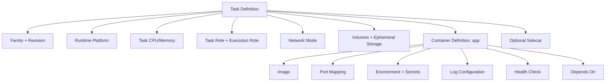

# Part 014 — Task Definition as Runtime Contract

Task definition sering diperlakukan sebagai file JSON biasa. Itu kesalahan besar.

Di ECS, task definition adalah **kontrak runtime**. Ia menjawab pertanyaan:

- image apa yang dijalankan;
- process apa yang dianggap utama;
- berapa CPU/memory yang dijanjikan;
- port apa yang dibuka;
- secret/config apa yang masuk;
- role AWS apa yang dimiliki aplikasi;
- bagaimana logs dikirim;
- bagaimana health ditentukan;
- apakah task punya storage sementara;
- apakah ada sidecar;
- bagaimana container saling bergantung;
- platform CPU/OS apa yang dipakai.

AWS menyebut task definition sebagai blueprint aplikasi dalam format JSON yang menjelaskan parameter dan satu atau lebih container yang membentuk aplikasi. Referensi resmi: [Amazon ECS task definitions](https://docs.aws.amazon.com/AmazonECS/latest/developerguide/task_definitions.html).

Mental model:

> Code menentukan logic. Image menentukan artifact. Task definition menentukan bagaimana artifact itu hidup di production.

---

## 1. Anatomy of a Task Definition

Sederhananya:



Task definition bukan hanya container definition. Ia punya level task dan level container.

---

## 2. Task-Level vs Container-Level Configuration

Banyak bug berasal dari mencampur dua level ini.

| Level | Contoh | Makna |
|---|---|---|
| Task-level | `family`, `taskRoleArn`, `executionRoleArn`, `networkMode`, `requiresCompatibilities`, `cpu`, `memory`, `runtimePlatform`, `ephemeralStorage` | Kontrak untuk seluruh task |
| Container-level | `name`, `image`, `command`, `portMappings`, `environment`, `secrets`, `logConfiguration`, `healthCheck`, `essential`, `dependsOn` | Kontrak untuk satu container dalam task |

Untuk Fargate, AWS mengharuskan CPU dan memory ditentukan pada task-level dengan kombinasi yang valid. Referensi: [Amazon ECS task definition differences for Fargate](https://docs.aws.amazon.com/AmazonECS/latest/developerguide/fargate-tasks-services.html).

### 2.1 Task sebagai “mini pod”

Jika Anda familiar dengan Kubernetes, ECS task mirip unit runtime yang bisa berisi beberapa container. Tetapi jangan memaksakan semua pattern Kubernetes ke ECS.

Gunakan multi-container task bila container tersebut:

- harus co-located;
- berbagi lifecycle;
- berbagi local network namespace tertentu;
- merupakan sidecar telemetry/proxy/log router;
- tidak berguna bila berjalan terpisah.

Jangan menaruh dua aplikasi bisnis berbeda dalam satu task hanya karena ingin hemat.

---

## 3. Family and Revision

`family` adalah nama logical task definition. Setiap registrasi baru menghasilkan revision baru.

```txt
case-api:1
case-api:2
case-api:3
```

Service menunjuk ke satu revision. Saat Anda deploy, service biasanya di-update ke revision terbaru atau revision tertentu.

### 3.1 Naming convention

Gunakan nama yang stabil dan jelas:

```txt
case-api
case-worker
audit-projection-worker
notification-dispatcher
report-generator
```

Hindari nama yang mencampur environment:

```txt
prod-case-api
staging-case-api
```

Lebih baik environment dipisah lewat cluster/service/stack. Tetapi pada organisasi tertentu, environment prefix bisa diterima bila toolchain/IaC menuntutnya. Yang penting konsisten dan bisa diaudit.

### 3.2 Revision discipline

Setiap revision harus bisa dijawab:

```txt
revision:
image digest:
git commit:
config version:
secret version assumption:
deployed by:
deployed at:
rollback target:
```

Kalau revisi tidak bisa ditelusuri ke artifact dan perubahan, rollback hanya tebakan.

---

## 4. Image: Tag Is a Pointer, Digest Is Identity

Container definition menentukan image.

Contoh buruk:

```json
{
  "image": "123456789012.dkr.ecr.ap-southeast-1.amazonaws.com/case-api:latest"
}
```

Masalah:

- `latest` bisa berubah;
- rollback tidak deterministik;
- audit sulit;
- deployment lama bisa menarik artifact berbeda bila tag ditimpa;
- sulit membuktikan image mana yang berjalan.

Contoh lebih baik:

```json
{
  "image": "123456789012.dkr.ecr.ap-southeast-1.amazonaws.com/case-api@sha256:abc123..."
}
```

Atau gunakan tag immutable yang dipetakan ke digest:

```txt
case-api:git-8f3a91c-build-20260706-1420
```

Tetapi dalam evidence record, tetap simpan digest.

### 4.1 Deployment invariant

> Production deployment harus bisa membuktikan image digest yang berjalan, bukan hanya tag yang diklaim.

---

## 5. CPU and Memory

CPU/memory adalah kontrak resource.

Untuk Fargate, CPU dan memory harus mengikuti kombinasi yang didukung oleh Fargate. AWS mendokumentasikan valid combinations pada halaman task definition differences for Fargate. Referensi: [Task definition differences for Fargate](https://docs.aws.amazon.com/AmazonECS/latest/developerguide/fargate-tasks-services.html).

### 5.1 CPU bukan hanya performa

CPU terlalu kecil dapat menyebabkan:

- startup lambat;
- GC Java lebih sering;
- request latency naik;
- health check timeout;
- deployment lebih lama;
- autoscaling terlambat karena task baru lambat siap;
- retry storm akibat timeout upstream.

CPU terlalu besar dapat menyebabkan:

- cost boros;
- false sense of capacity;
- inefficient packing pada EC2 capacity;
- scaling signal kurang sensitif.

### 5.2 Memory adalah hard boundary

Jika container melewati memory limit, ia bisa dihentikan. Untuk Java, ini sering muncul sebagai:

- process killed tanpa stacktrace aplikasi;
- `OutOfMemoryError` bila heap limit tercapai;
- container stop reason terkait memory;
- task replacement loop.

Gunakan JVM container-aware configuration:

```txt
-XX:MaxRAMPercentage=70
-XX:InitialRAMPercentage=50
-XX:+ExitOnOutOfMemoryError
```

Nilai final harus diuji, bukan disalin.

### 5.3 Right-sizing method

Jangan mulai dari “service ini kayaknya butuh 1 vCPU”. Mulai dari measurement:

```txt
1. Tentukan target throughput.
2. Jalankan load test dengan data realistis.
3. Catat p50/p95/p99 latency.
4. Catat CPU utilization, memory RSS, GC pause, thread count.
5. Naikkan concurrency sampai SLO gagal.
6. Pilih CPU/memory dengan headroom eksplisit.
7. Validasi saat deployment rolling, bukan steady state saja.
```

Right-sizing yang hanya mengukur steady state akan gagal saat startup spike atau rolling deployment.

---

## 6. Runtime Platform

Task definition dapat menentukan runtime platform seperti OS family dan CPU architecture. AWS mendokumentasikan `runtimePlatform` termasuk `operatingSystemFamily` dan CPU architecture pada task definition parameters. Referensi: [Amazon ECS task definition parameters](https://docs.aws.amazon.com/AmazonECS/latest/developerguide/task_definition_parameters.html).

Contoh:

```json
{
  "runtimePlatform": {
    "operatingSystemFamily": "LINUX",
    "cpuArchitecture": "ARM64"
  }
}
```

### 6.1 ARM64 vs X86_64

ARM64/Graviton bisa lebih cost-effective untuk banyak workload Java, tetapi validasi:

- base image tersedia untuk ARM64;
- native dependencies mendukung ARM64;
- JDK distribution mendukung;
- performance profile cocok;
- CI build multi-arch benar;
- image manifest list tidak salah;
- observability agent compatible.

Jangan ganti architecture tanpa pipeline dan test matrix.

---

## 7. Network Mode

Untuk Fargate, network mode yang relevan adalah `awsvpc`. Pada model ini, task mendapatkan network interface sendiri.

Contoh:

```json
{
  "networkMode": "awsvpc"
}
```

Konsekuensi:

- service network configuration menentukan subnet dan security group;
- target group untuk ALB biasanya memakai target type `ip`;
- setiap task mengkonsumsi IP subnet;
- outbound AWS API calls butuh route yang benar;
- security group bisa scoped ke service.

### 7.1 Network contract is part of runtime contract

Task definition tidak berisi subnet/security group service, tetapi `networkMode` menentukan bagaimana task akan berada di network.

Jangan desain task definition tanpa memahami network placement service.

Pertanyaan wajib:

```txt
Apakah task berjalan di private subnet?
Apakah perlu outbound internet?
Apakah ECR pull lewat NAT atau VPC endpoint?
Apakah CloudWatch Logs reachable?
Apakah Secrets Manager/SSM reachable?
Apakah downstream DB berada di SG yang mengizinkan task SG?
```

---

## 8. Port Mapping

Port mapping menghubungkan container port dengan ECS/load balancer/service discovery.

Contoh:

```json
{
  "portMappings": [
    {
      "name": "http",
      "containerPort": 8080,
      "protocol": "tcp",
      "appProtocol": "http"
    }
  ]
}
```

### 8.1 Internal port should be boring

Gunakan port internal yang konsisten:

```txt
8080 for HTTP app
9090 for metrics, if exposed internally
```

Tetapi jangan expose metrics port ke ALB public kecuali memang dimaksudkan.

### 8.2 ALB health check and container port

Pastikan:

- target group mengarah ke port yang benar;
- app bind ke `0.0.0.0`, bukan `localhost`;
- containerPort sesuai port aplikasi;
- security group mengizinkan inbound dari ALB security group;
- readiness endpoint berada di port yang sama atau desainnya jelas.

Banyak “container jalan tapi target unhealthy” berasal dari port/bind mismatch.

---

## 9. Command, EntryPoint, and Process Contract

Task definition bisa override `entryPoint` dan `command` dari image.

Contoh:

```json
{
  "entryPoint": ["java"],
  "command": ["-jar", "/app/app.jar"]
}
```

Namun, sebaiknya image sudah punya default `ENTRYPOINT` yang benar. Override di task definition dipakai bila Anda sengaja menjalankan mode berbeda.

### 9.1 Avoid hidden shell behavior

Hindari:

```json
{
  "command": ["sh", "-c", "java -jar app.jar"]
}
```

Kecuali Anda tahu dampaknya terhadap PID 1 dan signal handling.

Lebih baik:

```json
{
  "command": ["-jar", "/app/app.jar"]
}
```

Dengan Dockerfile:

```dockerfile
ENTRYPOINT ["java"]
```

### 9.2 Runtime mode clarity

Kalau satu image dipakai untuk API dan worker, jangan membuat command override liar di banyak tempat tanpa dokumentasi.

Contoh yang bisa diterima:

```txt
case-service image
  - command api     -> starts HTTP API
  - command worker  -> starts SQS worker
  - command migrate -> runs DB migration
```

Tetapi setiap mode harus punya task definition sendiri:

```txt
case-api task definition
case-worker task definition
case-migration task definition
```

Jangan satu task definition dipakai untuk semua mode.

---

## 10. Essential Containers

`essential` menentukan apakah kegagalan container menyebabkan task dianggap gagal.

Contoh:

```json
{
  "name": "app",
  "essential": true
}
```

Untuk app container utama, `essential` harus `true`.

Untuk sidecar, keputusan tergantung fungsi:

| Sidecar | Essential? | Alasan |
|---|---:|---|
| Envoy/proxy wajib | Ya | App tidak boleh jalan tanpa proxy |
| Log router wajib untuk audit | Ya, bila compliance menuntut | Tanpa log berarti evidence hilang |
| Metrics exporter optional | Mungkin tidak | App bisa tetap melayani traffic |
| Debug sidecar sementara | Tidak | Jangan jatuhkan app karena debug helper |

### 10.1 Wrong essential flag can hide failure

Jika log router compliance-critical dibuat non-essential, service tampak sehat tetapi audit evidence hilang. Jika metrics sidecar non-critical dibuat essential, service bisa outage karena telemetry agent rusak.

Essential flag adalah failure boundary decision.

---

## 11. Container Dependencies

ECS mendukung dependency antar container dalam task. AWS menyediakan contoh task definition dengan container dependency, misalnya app menunggu sidecar mencapai status healthy. Referensi: [Example Amazon ECS task definitions](https://docs.aws.amazon.com/AmazonECS/latest/developerguide/example_task_definitions.html).

Contoh konseptual:

```json
{
  "name": "app",
  "dependsOn": [
    {
      "containerName": "otel-collector",
      "condition": "START"
    }
  ]
}
```

Atau bila sidecar punya health check:

```json
{
  "name": "app",
  "dependsOn": [
    {
      "containerName": "proxy",
      "condition": "HEALTHY"
    }
  ]
}
```

### 11.1 Dependency is startup ordering, not distributed coordination

Container dependency hanya membantu startup order dalam satu task. Ia bukan solusi untuk:

- database readiness global;
- migration ordering antar service;
- event consumer dependency;
- cross-service orchestration;
- blue/green coordination.

Gunakan dengan hemat.

---

## 12. Environment Variables

Environment variables cocok untuk konfigurasi kecil dan non-secret.

Contoh:

```json
{
  "environment": [
    { "name": "SPRING_PROFILES_ACTIVE", "value": "prod" },
    { "name": "HTTP_PORT", "value": "8080" },
    { "name": "LOG_LEVEL", "value": "INFO" }
  ]
}
```

### 12.1 Config taxonomy

| Jenis Config | Env Var? | Contoh |
|---|---:|---|
| Static runtime config | Ya | port, profile, service name |
| Non-sensitive feature flag | Bisa, tapi restart-bound | enable_new_routing=false |
| Secret | Jangan plain env | password, token |
| Dynamic operational config | Lebih baik AppConfig/remote config | throttle %, kill switch |
| Large config document | Jangan | routing table besar |

### 12.2 Env var is visible in too many places

Secret di env var dapat terekspos lewat:

- process dump;
- debug endpoint;
- accidental logging;
- crash report;
- console visibility;
- copied task definition;
- IaC state.

Gunakan `secrets` untuk value sensitif, dan jangan log seluruh environment.

---

## 13. Secrets

Task definition dapat mereferensikan Secrets Manager atau Systems Manager Parameter Store untuk secret injection. Referensi ECS: [Pass Secrets Manager secrets through Amazon ECS environment variables](https://docs.aws.amazon.com/AmazonECS/latest/developerguide/secrets-envvar-secrets-manager.html).

Contoh:

```json
{
  "secrets": [
    {
      "name": "DB_PASSWORD",
      "valueFrom": "arn:aws:secretsmanager:ap-southeast-1:123456789012:secret:case-api/db-password-AbCdEf"
    }
  ]
}
```

### 13.1 Secret injection happens at task start

Jika secret berubah, task yang sudah berjalan tidak otomatis mendapat value baru hanya karena secret dirotasi. Biasanya Anda perlu:

- restart task;
- redeploy service;
- memakai runtime secret fetcher;
- memakai sidecar/agent khusus;
- mendesain connection pool agar bisa rotate credential.

### 13.2 IAM implications

Agar secret bisa diambil saat task start, execution role biasanya perlu permission terkait secret retrieval untuk injection. Bila aplikasi mengambil secret sendiri saat runtime, task role perlu permission.

Pisahkan:

```txt
Secret injected by ECS at startup -> execution role concern
Secret fetched by application code -> task role concern
```

---

## 14. Log Configuration

Untuk Fargate, AWS menyatakan Anda perlu menambahkan parameter `logConfiguration` yang diperlukan untuk mengaktifkan `awslogs` log driver. Referensi: [Send Amazon ECS logs to CloudWatch](https://docs.aws.amazon.com/AmazonECS/latest/developerguide/using_awslogs.html).

Contoh:

```json
{
  "logConfiguration": {
    "logDriver": "awslogs",
    "options": {
      "awslogs-group": "/ecs/case-api",
      "awslogs-region": "ap-southeast-1",
      "awslogs-stream-prefix": "app"
    }
  }
}
```

### 14.1 Logging contract

Task definition harus menjawab:

- ke mana stdout/stderr dikirim;
- apakah log group dibuat oleh IaC;
- retention berapa hari;
- apakah log terenkripsi;
- apakah format JSON;
- apakah correlation ID ada;
- apakah PII/secret disaring;
- apakah log volume bisa membengkak biaya.

### 14.2 FireLens/log router

Untuk routing lebih kompleks, gunakan log router seperti FireLens. Namun log router menambah failure mode:

- sidecar crash;
- buffer penuh;
- destination lambat;
- log drop;
- app blocked bila mode blocking;
- audit gap bila log critical.

Tentukan apakah log router essential.

---

## 15. Health Check

Task definition bisa memiliki container health check.

Contoh:

```json
{
  "healthCheck": {
    "command": ["CMD-SHELL", "curl -f http://localhost:8080/live || exit 1"],
    "interval": 30,
    "timeout": 5,
    "retries": 3,
    "startPeriod": 60
  }
}
```

AWS mendokumentasikan container health check parameters termasuk `startPeriod`. Referensi: [Determine Amazon ECS task health using container health checks](https://docs.aws.amazon.com/AmazonECS/latest/developerguide/healthcheck.html).

### 15.1 Health check harus murah

Health check buruk:

```txt
/health melakukan query berat ke database dan external API
```

Dampaknya:

- health check memperburuk outage;
- dependency lambat menyebabkan task diganti berulang;
- deployment gagal padahal aplikasi bisa degrade;
- thundering herd ke database.

Health check yang baik:

- cepat;
- deterministic;
- tidak membuat side effect;
- membedakan liveness dan readiness;
- menguji dependency critical saja;
- punya timeout kecil.

### 15.2 Container health vs ALB health

Container health check dan ALB target health tidak sama.

| Health | Dilihat Oleh | Fungsi |
|---|---|---|
| Container health | ECS | Menentukan container/task health |
| Target group health | ALB/NLB | Menentukan apakah traffic dikirim |
| App readiness | Aplikasi/platform | Menentukan kesiapan melayani request |
| SLO health | User/business | Menentukan apakah service memenuhi tujuan |

Jangan menganggap satu health endpoint cukup untuk semua layer.

---

## 16. Ephemeral Storage

Fargate task memiliki ephemeral storage. Task definition dapat mengatur ukuran ephemeral storage pada platform yang mendukung.

Gunakan ephemeral storage untuk:

- temporary files;
- file upload staging kecil;
- decompression;
- local cache yang boleh hilang;
- batch intermediate output.

Jangan gunakan ephemeral storage untuk:

- state permanen;
- file yang harus survive task replacement;
- audit evidence;
- queue local;
- database embedded untuk production state.

### 16.1 Storage failure modes

| Failure | Contoh | Mitigasi |
|---|---|---|
| Disk full | report generation menulis file besar | limit file size, stream output |
| State loss | task restart menghapus cache penting | externalize state |
| Slow cleanup | temp file tidak dihapus | cleanup routine |
| Audit loss | evidence disimpan lokal | persist ke durable storage |

---

## 17. Volumes

Task definition dapat mendefinisikan volumes. Untuk ECS/Fargate, volume use case harus dipilih hati-hati.

Pola umum:

- shared volume antar container dalam satu task;
- EFS untuk shared persistent file storage;
- scratch space untuk sidecar/app communication.

Tetapi ingat:

> Volume tidak otomatis membuat aplikasi stateless menjadi stateful dengan aman.

Kalau workload butuh state permanen, desain consistency, backup, permission, throughput, dan failure semantics-nya.

---

## 18. Task Role

`taskRoleArn` adalah IAM role yang diasumsikan oleh container application code untuk memanggil AWS API.

Contoh:

```json
{
  "taskRoleArn": "arn:aws:iam::123456789012:role/case-api-task-role"
}
```

### 18.1 Task role design

Role harus berbasis capability:

```txt
case-api-task-role
  - can read/write Case table
  - can send command messages
  - can read its own DB credential secret
  - cannot read all secrets
  - cannot list all buckets
  - cannot assume admin role
```

Jangan share satu task role untuk semua service. Itu membuat blast radius besar dan audit lemah.

### 18.2 Runtime identity as architecture

IAM role bukan hanya security detail. Ia mendefinisikan apa yang service secara arsitektural boleh lakukan.

Jika `case-api` punya izin menulis ke semua queue, boundary domain Anda bocor.

---

## 19. Execution Role

`executionRoleArn` dipakai oleh ECS/Fargate agent untuk operasi platform seperti pull image dan publish logs.

AWS menjelaskan task execution role memberikan ECS container/Fargate agent permission melakukan AWS API calls atas nama Anda untuk kebutuhan task. Referensi: [Amazon ECS task execution IAM role](https://docs.aws.amazon.com/AmazonECS/latest/developerguide/task_execution_IAM_role.html).

Contoh:

```json
{
  "executionRoleArn": "arn:aws:iam::123456789012:role/ecs-task-execution-role"
}
```

Execution role biasanya butuh permission untuk:

- ECR image pull;
- CloudWatch Logs write;
- Secrets Manager/SSM access for secret injection;
- KMS decrypt bila secret/log membutuhkan.

### 19.1 Common bug

Aplikasi gagal akses DynamoDB, lalu engineer menambahkan permission ke execution role. Itu tidak membantu.

Aplikasi memakai task role. Platform setup memakai execution role.

---

## 20. Full Example: Production-Style Java API Task Definition

Contoh berikut bukan untuk disalin mentah, tetapi untuk dibaca sebagai kontrak.

```json
{
  "family": "case-api",
  "networkMode": "awsvpc",
  "requiresCompatibilities": ["FARGATE"],
  "cpu": "1024",
  "memory": "2048",
  "runtimePlatform": {
    "operatingSystemFamily": "LINUX",
    "cpuArchitecture": "ARM64"
  },
  "taskRoleArn": "arn:aws:iam::123456789012:role/case-api-task-role",
  "executionRoleArn": "arn:aws:iam::123456789012:role/case-api-execution-role",
  "ephemeralStorage": {
    "sizeInGiB": 30
  },
  "containerDefinitions": [
    {
      "name": "app",
      "image": "123456789012.dkr.ecr.ap-southeast-1.amazonaws.com/case-api@sha256:abc123",
      "essential": true,
      "portMappings": [
        {
          "name": "http",
          "containerPort": 8080,
          "protocol": "tcp",
          "appProtocol": "http"
        }
      ],
      "environment": [
        { "name": "SERVICE_NAME", "value": "case-api" },
        { "name": "HTTP_PORT", "value": "8080" },
        { "name": "LOG_FORMAT", "value": "json" },
        { "name": "JAVA_TOOL_OPTIONS", "value": "-XX:MaxRAMPercentage=70 -XX:+ExitOnOutOfMemoryError" }
      ],
      "secrets": [
        {
          "name": "DB_PASSWORD",
          "valueFrom": "arn:aws:secretsmanager:ap-southeast-1:123456789012:secret:case-api/db-password-AbCdEf"
        }
      ],
      "healthCheck": {
        "command": ["CMD-SHELL", "curl -f http://localhost:8080/live || exit 1"],
        "interval": 30,
        "timeout": 5,
        "retries": 3,
        "startPeriod": 60
      },
      "logConfiguration": {
        "logDriver": "awslogs",
        "options": {
          "awslogs-group": "/ecs/case-api",
          "awslogs-region": "ap-southeast-1",
          "awslogs-stream-prefix": "app"
        }
      }
    }
  ]
}
```

### 20.1 Apa yang sudah ditentukan?

- Workload berjalan di Fargate.
- Task memakai `awsvpc`.
- CPU/memory task-level eksplisit.
- Runtime ARM64 eksplisit.
- Image dipin ke digest.
- App container essential.
- Port HTTP 8080 jelas.
- JVM memory behavior disetel.
- Secret tidak ditulis sebagai plain env.
- Health check lokal tersedia.
- Log dikirim ke CloudWatch.
- Task role dan execution role dipisah.
- Ephemeral storage dinaikkan bila workload butuh scratch space.

### 20.2 Apa yang belum terlihat di task definition?

Service-level configuration tetap harus menentukan:

- subnet;
- security group;
- ALB target group;
- desired count;
- deployment configuration;
- circuit breaker;
- capacity provider strategy;
- autoscaling;
- tags;
- service discovery.

Task definition bukan seluruh deployment. Ia adalah runtime blueprint.

---

## 21. Example: Worker Task Definition

Worker tidak butuh port mapping atau ALB.

```json
{
  "family": "case-command-worker",
  "networkMode": "awsvpc",
  "requiresCompatibilities": ["FARGATE"],
  "cpu": "512",
  "memory": "1024",
  "taskRoleArn": "arn:aws:iam::123456789012:role/case-command-worker-task-role",
  "executionRoleArn": "arn:aws:iam::123456789012:role/case-command-worker-execution-role",
  "containerDefinitions": [
    {
      "name": "worker",
      "image": "123456789012.dkr.ecr.ap-southeast-1.amazonaws.com/case-worker@sha256:def456",
      "essential": true,
      "environment": [
        { "name": "WORKER_MODE", "value": "sqs" },
        { "name": "MAX_IN_FLIGHT", "value": "20" },
        { "name": "VISIBILITY_TIMEOUT_SECONDS", "value": "120" }
      ],
      "secrets": [
        {
          "name": "QUEUE_URL",
          "valueFrom": "arn:aws:ssm:ap-southeast-1:123456789012:parameter/case/queue-url"
        }
      ],
      "logConfiguration": {
        "logDriver": "awslogs",
        "options": {
          "awslogs-group": "/ecs/case-command-worker",
          "awslogs-region": "ap-southeast-1",
          "awslogs-stream-prefix": "worker"
        }
      }
    }
  ]
}
```

Worker contract berbeda dari API:

- tidak ada port mapping;
- tidak ada ALB health;
- health lebih banyak dari metrics: polling, processing rate, error rate, backlog age;
- graceful shutdown harus menghormati in-flight messages;
- scaling signal biasanya queue depth/age, bukan CPU.

---

## 22. Example: App + Telemetry Sidecar

```json
{
  "containerDefinitions": [
    {
      "name": "otel-collector",
      "image": "public.ecr.aws/aws-observability/aws-otel-collector:latest",
      "essential": true,
      "healthCheck": {
        "command": ["CMD-SHELL", "curl -f http://localhost:13133/ || exit 1"],
        "interval": 30,
        "timeout": 5,
        "retries": 3,
        "startPeriod": 30
      }
    },
    {
      "name": "app",
      "image": "123456789012.dkr.ecr.ap-southeast-1.amazonaws.com/case-api@sha256:abc123",
      "essential": true,
      "dependsOn": [
        {
          "containerName": "otel-collector",
          "condition": "HEALTHY"
        }
      ],
      "environment": [
        { "name": "OTEL_EXPORTER_OTLP_ENDPOINT", "value": "http://localhost:4317" }
      ]
    }
  ]
}
```

Pertanyaan desain:

- Apakah app boleh jalan tanpa telemetry sidecar?
- Jika collector down, apakah request harus gagal?
- Apakah telemetry backpressure bisa mengganggu app?
- Apakah sidecar image dipin digest?
- Siapa patching sidecar?

Sidecar menambah capability sekaligus failure mode.

---

## 23. Registering and Updating Task Definitions

Task definition baru didaftarkan dengan `RegisterTaskDefinition`. AWS API menyatakan operasi ini mendaftarkan task definition baru dari `family` dan `containerDefinitions`, serta optional volumes. Referensi: [RegisterTaskDefinition API](https://docs.aws.amazon.com/AmazonECS/latest/APIReference/API_RegisterTaskDefinition.html).

Deployment service biasanya:

```txt
1. Build image.
2. Push image to ECR.
3. Resolve image digest.
4. Render task definition JSON.
5. Register new task definition revision.
6. Update ECS service to new revision.
7. Wait for steady state.
8. Verify alarms and SLO.
```

### 23.1 Never mutate in place

Task definition revision immutable. Jangan berpikir mengedit revision lama. Buat revision baru.

Ini bagus untuk audit:

```txt
case-api:41 bad deployment
case-api:40 rollback target
```

---

## 24. Validation Before Deployment

Task definition harus divalidasi sebelum service update.

Checklist otomatis:

```txt
[ ] image uses digest or immutable tag
[ ] no :latest in production
[ ] task role not wildcard admin
[ ] execution role separate from task role
[ ] logConfiguration present
[ ] log group exists and has retention
[ ] healthCheck present for API app container
[ ] cpu/memory valid for Fargate
[ ] runtime architecture matches image manifest
[ ] secrets use ARN/parameter references
[ ] no plain secret in environment
[ ] essential flags reviewed
[ ] container ports match service target group
[ ] JAVA_TOOL_OPTIONS reviewed for memory limits
[ ] task definition tagged with service/env/owner
```

### 24.1 Contract test idea

Buat test yang membaca rendered task definition dan gagal bila policy dilanggar.

Pseudo-code:

```java
assertNoLatestTag(taskDefinition);
assertHasLogConfiguration(taskDefinition);
assertTaskRoleIsNotSharedAdmin(taskDefinition);
assertFargateCpuMemoryCombinationIsValid(taskDefinition);
assertSecretsNotInEnvironment(taskDefinition);
assertAppContainerHasHealthCheck(taskDefinition);
```

Ini murah dan mencegah banyak insiden.

---

## 25. Failure Modes from Bad Task Definitions

| Bad Config | Symptom | Root Cause |
|---|---|---|
| Wrong image tag | Unexpected version running | Mutable tag overwritten |
| Missing execution role permission | Cannot pull image/log/secret | Platform permission incomplete |
| Missing task role permission | App gets AccessDenied | App IAM capability incomplete |
| Wrong CPU/memory | OOM/restart/latency | Resource contract wrong |
| Wrong port | ALB target unhealthy | App listens elsewhere |
| Bind localhost only | Target unhealthy | App not reachable via task ENI |
| No health start period | Deployment fails during slow startup | Health check too aggressive |
| Secret as plain env | Credential leak risk | Poor secret boundary |
| Sidecar essential wrong | Hidden audit gap or avoidable outage | Failure boundary wrong |
| Missing log config | No logs during incident | Observability not part of contract |
| Wrong architecture | Image cannot run | ARM/X86 mismatch |
| Oversized image | Slow deployment | Pull/startup latency |

---

## 26. Task Definition and Java Services

Java services need extra care.

### 26.1 Memory

Container memory includes more than heap:

- heap;
- metaspace;
- thread stacks;
- direct buffers;
- JIT/code cache;
- native libraries;
- TLS buffers;
- observability agent overhead.

If task memory is 1024 MiB, do not set heap to 1024 MiB.

Better starting point:

```txt
Max heap around 60-75% of task memory
Reserve headroom for non-heap/native/agent
Measure RSS under load
```

### 26.2 Startup

Java startup affects ECS deployment:

- image pull time;
- JVM startup;
- Spring context initialization;
- migration/init check;
- dependency warmup;
- health check grace.

If startup p95 is 70 seconds, `startPeriod` 10 seconds is wrong.

### 26.3 Shutdown

Java app should handle SIGTERM:

```txt
SIGTERM received
server stops accepting new requests
in-flight requests drain
worker polling stops
traces/logs flush
process exits before ECS stop timeout
```

Test shutdown locally and in ECS.

---

## 27. Task Definition as Governance Artifact

For regulated or high-assurance systems, task definition is evidence:

- which code artifact ran;
- under what identity;
- with what network mode;
- with what secrets;
- with what logs;
- with what health policy;
- with what resource boundary;
- with what platform architecture.

Store rendered task definition artifact per deployment.

Example evidence record:

```json
{
  "service": "case-api",
  "environment": "prod",
  "taskDefinition": "case-api:42",
  "imageDigest": "sha256:abc123",
  "gitCommit": "8f3a91c",
  "deployedAt": "2026-07-06T14:20:00+07:00",
  "deployedBy": "ci/github-actions",
  "taskRole": "case-api-task-role",
  "executionRole": "case-api-execution-role",
  "cpu": "1024",
  "memory": "2048",
  "runtimePlatform": "LINUX/ARM64",
  "rollbackTarget": "case-api:41"
}
```

This is not bureaucracy. This is how you debug and defend production changes.

---

## 28. Anti-Patterns

### 28.1 One task role for everything

Looks convenient, destroys least privilege.

### 28.2 Mutable image tags in prod

Looks simple, destroys reproducibility.

### 28.3 No health check

Looks fine until bad deploy becomes silent outage.

### 28.4 Health check hits heavy dependency

Looks safe, causes cascading failure.

### 28.5 Using task definition as config dumping ground

Too many env vars make runtime behavior hard to reason about. Move dynamic config to a managed config system.

### 28.6 Sidecar without ownership

Every sidecar needs patching, monitoring, versioning, and failure policy.

### 28.7 No log retention policy

Infinite logs become cost incident. Too-short retention becomes audit/debug incident.

---

## 29. Production Checklist

Before deploying a task definition to production:

### Artifact

- image digest captured;
- image scanned;
- SBOM/provenance stored;
- base image approved;
- architecture compatible.

### Runtime

- CPU/memory based on test;
- Java memory settings reviewed;
- health check defined;
- startup grace realistic;
- shutdown behavior tested.

### Identity

- task role minimal;
- execution role minimal;
- no shared admin role;
- secret access scoped.

### Observability

- awslogs/FireLens configured;
- log group retention set;
- structured logs enabled;
- correlation ID present;
- telemetry sidecar essential flag reviewed.

### Network

- awsvpc understood;
- app binds to correct address;
- port mapping matches ALB/service;
- required AWS endpoints reachable.

### Security

- no plain secrets in env;
- secret rotation plan exists;
- task definition artifact stored;
- IAM pass-role boundary controlled.

---

## 30. Internal Engineering Heuristic

A good task definition has these properties:

```txt
Deterministic artifact
Explicit resource boundary
Minimal identity
Observable by default
Health-aware
Graceful under replacement
Auditable after deployment
Boring enough to standardize
```

A bad task definition has these properties:

```txt
Mutable image tag
Shared IAM role
No health check
No logs
Mystery env vars
Oversized permissions
Unclear sidecar ownership
No rollback evidence
```

---

## 31. What You Should Remember

- Task definition adalah runtime contract, bukan sekadar JSON.
- `family:revision` adalah release boundary.
- Image digest adalah identity; tag hanya pointer.
- CPU/memory memengaruhi latency, startup, deployment, dan cost.
- Execution role dan task role harus dipisahkan.
- Secrets injection biasanya terjadi saat task start.
- Health check harus murah dan benar secara semantik.
- Log configuration adalah bagian dari production readiness.
- Sidecar adalah failure boundary decision.
- Task definition harus divalidasi otomatis sebelum deployment.

---

## 32. Praktik Latihan

Ambil satu task definition production dan beri skor 0-2 untuk setiap item:

```txt
Image pinned by digest or immutable tag:
Task role minimal:
Execution role minimal:
CPU/memory justified by load test:
Health check correct:
Startup grace realistic:
Logs structured and retained:
No plain secrets:
Port mapping correct:
Runtime architecture explicit:
Sidecar essential flags reviewed:
Secret rotation impact understood:
Task definition stored as deployment evidence:
```

Interpretasi:

```txt
0-10   risky, likely demo-grade
11-18  usable but fragile
19-24  production-aware
25+    strong baseline
```

---

## 33. Referensi Resmi

- [Amazon ECS task definitions](https://docs.aws.amazon.com/AmazonECS/latest/developerguide/task_definitions.html)
- [Amazon ECS task definition parameters](https://docs.aws.amazon.com/AmazonECS/latest/developerguide/task_definition_parameters.html)
- [Task definition differences for Fargate](https://docs.aws.amazon.com/AmazonECS/latest/developerguide/fargate-tasks-services.html)
- [Amazon ECS task execution IAM role](https://docs.aws.amazon.com/AmazonECS/latest/developerguide/task_execution_IAM_role.html)
- [Pass Secrets Manager secrets through Amazon ECS environment variables](https://docs.aws.amazon.com/AmazonECS/latest/developerguide/secrets-envvar-secrets-manager.html)
- [Send Amazon ECS logs to CloudWatch](https://docs.aws.amazon.com/AmazonECS/latest/developerguide/using_awslogs.html)
- [Determine Amazon ECS task health using container health checks](https://docs.aws.amazon.com/AmazonECS/latest/developerguide/healthcheck.html)
- [Example Amazon ECS task definitions](https://docs.aws.amazon.com/AmazonECS/latest/developerguide/example_task_definitions.html)
- [RegisterTaskDefinition API](https://docs.aws.amazon.com/AmazonECS/latest/APIReference/API_RegisterTaskDefinition.html)
