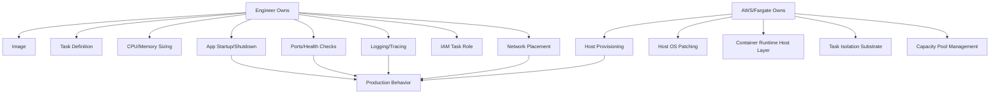
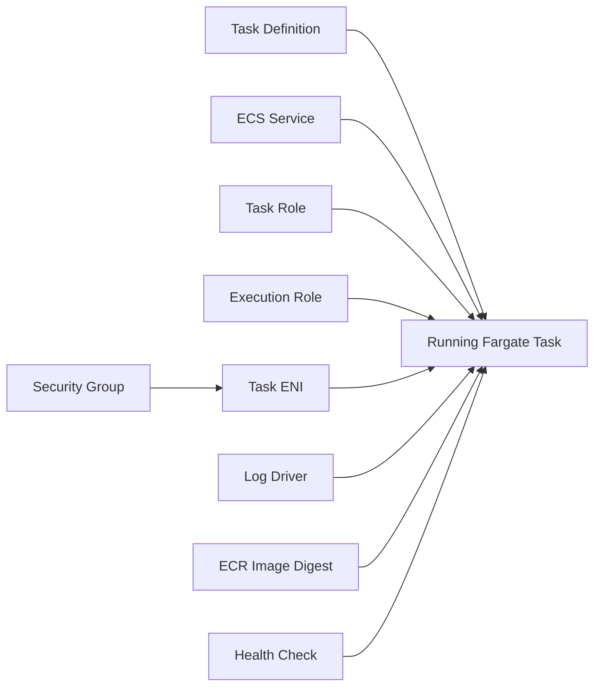
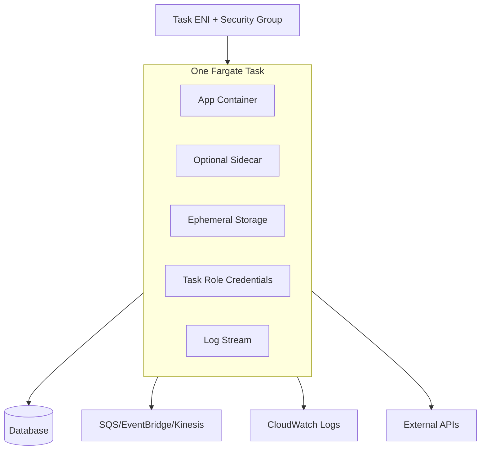
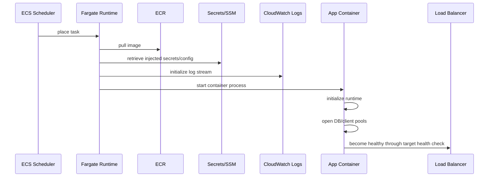

# Part 015 — Fargate Runtime Model

Fargate is often described as **serverless compute for containers**. That phrase is correct, but incomplete. It can mislead engineers into thinking that container runtime constraints disappear. They do not.

The right mental model:

> Fargate removes host ownership. It does not remove runtime ownership.

You no longer operate EC2 instances, AMIs, capacity groups, host patching, Docker daemon tuning, or bin-packing at the host layer. But you still own the application process, image, startup behavior, memory profile, task sizing, network path, secret loading, logs, health checks, graceful shutdown, retry behavior, and cost shape.

Fargate is not magic infrastructure. It is a managed runtime contract.



## 1. Why Fargate Exists

Before Fargate, ECS workloads typically ran on EC2 container instances. That gave teams host-level control, but also host-level responsibility.

You had to answer questions such as:

- Which AMI do we use?
- Who patches the instances?
- How do we rotate container instances safely?
- How many instances should the cluster have?
- How do we avoid fragmented capacity?
- How do we drain instances before termination?
- How do we handle daemon agents?
- How do we secure SSH or avoid SSH completely?
- How do we tune kernel, Docker, logging, and disk?

Fargate changes the question.

Instead of managing a fleet of hosts, you submit a task definition and ask AWS to run it on managed compute capacity. Your scheduling unit becomes the **task**, not the host.

That is a major simplification for application teams.

But simplification is not free. You trade low-level host control for a narrower runtime contract. If your workload needs privileged containers, host networking, special kernel modules, local daemon dependencies, custom host agents, or very unusual compute shape, Fargate may be the wrong abstraction.

## 2. The Core Runtime Contract

A Fargate task is a container runtime envelope with:

- one or more containers;
- task-level CPU and memory;
- task-level IAM role;
- task execution role;
- network interface;
- log configuration;
- optional ephemeral storage configuration;
- optional EFS mount;
- container health checks;
- startup and stop behavior;
- platform version;
- operating system and CPU architecture choice.

In ECS, this contract is expressed through the task definition and service configuration.



A production engineer should read a Fargate task definition like a runtime contract, not like a deployment config file.

Every field answers an operational question:

| Contract Area | Question It Answers |
|---|---|
| Image | What exact executable artifact runs? |
| CPU/memory | What resource envelope can the process assume? |
| Task role | What can the application do inside AWS? |
| Execution role | What can ECS do to start the task? |
| Secrets | What sensitive material is injected at start? |
| Logs | Where does runtime output go? |
| Network mode | What IP/security boundary does the task receive? |
| Health check | How does ECS decide the container is healthy? |
| Stop timeout | How much time does the process get to exit cleanly? |
| Ephemeral storage | How much local scratch space exists? |

Bad Fargate systems usually fail not because Fargate is unreliable, but because the task contract is vague.

## 3. Task, Container, Service, and Deployment

In ECS on Fargate, the most important objects are:

| Object | Meaning |
|---|---|
| Cluster | Logical grouping boundary for ECS resources. With Fargate, it is not a host fleet. |
| Task definition | Versioned blueprint for running one or more containers. |
| Task | One running instantiation of a task definition. |
| Service | Desired-state controller that keeps tasks running. |
| Deployment | Transition from one task definition revision to another. |
| Capacity provider | Strategy for using Fargate or Fargate Spot capacity. |

The most important distinction:

> A task is an instance. A service is a controller.

If you run one task manually, it dies when it dies. If you run a service with desired count `N`, ECS attempts to keep `N` healthy tasks running.

That difference matters for production.

Use **service** for long-running APIs and workers. Use **run-task** for one-off jobs. Use **scheduled tasks** or **Step Functions ECS integration** for orchestrated container jobs.

## 4. What Fargate Removes

Fargate removes several operational responsibilities:

- EC2 provisioning;
- AMI selection and patching;
- container instance registration;
- host lifecycle management;
- Docker daemon operations;
- EC2 Auto Scaling Group tuning for basic capacity;
- instance draining for normal host replacement;
- SSH-based host debugging;
- host bin-packing decisions;
- cluster capacity fragmentation at the EC2 instance level.

That is why Fargate is attractive for:

- product teams that want to ship services without platform-heavy Kubernetes work;
- regulated teams that prefer smaller host ownership surface;
- bursty workloads;
- queue workers;
- scheduled jobs;
- small-to-medium APIs;
- services where host specialization is not needed;
- teams that want isolation per task and simpler network security groups.

## 5. What Fargate Does Not Remove

Fargate does not remove:

- container image hygiene;
- CPU/memory sizing;
- startup latency;
- graceful shutdown;
- application connection pooling;
- retry storm risks;
- database connection exhaustion;
- NAT or VPC endpoint decisions;
- CloudWatch Logs cost;
- load balancer health check correctness;
- IAM least privilege;
- deployment rollback design;
- service autoscaling policy;
- queue backpressure design;
- observability design;
- cost modelling.

A weak engineering team uses Fargate to avoid thinking about operations.

A strong engineering team uses Fargate to remove the wrong layer of operations and focus harder on the runtime layer that actually affects user-visible reliability.

## 6. Fargate as a Runtime Boundary

A Fargate task should be treated as an isolated runtime cell:



Each task receives a network identity, an IAM identity, a resource envelope, and local scratch storage. The application should not assume anything durable inside that task.

A Fargate task may be replaced at any time during deployments, scaling events, platform maintenance, health check replacement, or failures. Therefore:

- local files are temporary;
- memory cache is disposable;
- in-flight work must be safe to retry or resume;
- shutdown must be graceful;
- external side effects must be idempotent;
- readiness must reflect real ability to serve traffic.

## 7. CPU and Memory Sizing

Fargate requires task-level CPU and memory to use valid combinations. This is different from EC2-backed ECS, where the host fleet can be sized independently from tasks.

The practical rule:

> In Fargate, every task is a billable resource envelope. Over-sizing is direct waste. Under-sizing is direct instability.

### 7.1 CPU Is Not Only Throughput

CPU affects:

- request processing latency;
- JVM JIT warmup speed;
- TLS handshake capacity;
- JSON serialization/deserialization;
- compression;
- background maintenance;
- GC behavior;
- health check responsiveness under load;
- startup time.

For Java services, CPU under-sizing often appears as:

- high p95/p99 latency;
- slow startup;
- GC pauses;
- thread pool starvation;
- health check timeout;
- autoscaling lag;
- deployment instability.

### 7.2 Memory Is Both Heap and Non-Heap

A Java service does not only consume heap.

Memory includes:

- Java heap;
- metaspace;
- thread stacks;
- direct buffers;
- JIT/code cache;
- native libraries;
- TLS buffers;
- logging buffers;
- HTTP client pools;
- sidecar memory;
- container writable layer pressure.

A common failure pattern:

```txt
Task memory = 1024 MiB
-Xmx = 900m
App uses direct buffers + metaspace + threads + agent
Container exceeds task memory
Task is killed
ECS replaces task
Deployment flaps
```

Safer Java sizing rule:

```txt
container memory
  = heap
  + non-heap allowance
  + native/direct buffers
  + agent overhead
  + logging/telemetry overhead
  + burst margin
```

For production Java APIs, avoid setting heap equal to container memory. Leave headroom.

## 8. Ephemeral Storage Model

Fargate tasks have local ephemeral storage. This storage is not persistent. It is deleted when the task stops.

Use it for:

- temp files;
- decompression;
- short-lived processing scratch space;
- local cache that can be rebuilt;
- downloaded artifacts;
- batch staging;
- temporary report generation.

Do not use it for:

- durable business data;
- message checkpoint state;
- audit logs;
- workflow progress;
- user uploads that must survive task replacement;
- distributed locks;
- leader election state.

### 8.1 Storage Pressure Failure Modes

Ephemeral storage can fail silently until the app writes.

Common symptoms:

- `No space left on device`;
- container exits during large file processing;
- log agent backpressure;
- image pull failure if image layers consume too much available space;
- batch task succeeds in small test but fails with real payload.

A production task should expose storage usage metrics when local scratch is important.

If temporary storage is part of the business path, then it is not “temporary enough”. Design explicit storage handling:

- S3 for durable object handoff;
- EFS for shared file access where latency semantics are acceptable;
- database for transactional state;
- queue/message state for resumability;
- Step Functions for workflow state.

## 9. Networking Model

With Fargate on ECS, tasks use `awsvpc` networking. Practically, this means each task receives its own elastic network interface behavior and security group boundary.

The task behaves much more like a small network-addressable unit inside the VPC than like a process hidden behind a shared host network.

This has advantages:

- per-task security group control;
- direct VPC routing;
- clearer east-west traffic boundaries;
- no host port collision;
- simpler load balancer target registration;
- improved isolation.

It also creates constraints:

- subnet IP capacity matters;
- ENI-related behavior matters;
- outbound access must be designed;
- image pull needs a network path;
- private subnet tasks need NAT or VPC endpoints for AWS service access;
- security group mistakes directly break startup or runtime access.

Fargate networking will be covered more deeply in Part 016, but the runtime-level lesson is simple:

> A Fargate task cannot start or operate correctly unless its network path supports image pull, secret retrieval, logging, health checking, and downstream access.

## 10. Startup Path

A Fargate task startup is not only your app booting.

A simplified startup sequence:



Startup can fail at many points before your application code is even reachable:

| Phase | Failure Example |
|---|---|
| Placement | capacity unavailable, subnet issue, quota issue |
| Image pull | no ECR route, wrong execution role, missing image digest |
| Secret retrieval | missing IAM permission, wrong ARN, KMS denial |
| Logging | no log group permission, endpoint route issue |
| App init | bad config, migration lock, dependency timeout |
| Health check | wrong path, app not ready, slow startup |

A strong production system treats startup as a measurable pipeline.

Track:

- task created time;
- pull duration;
- app init duration;
- time to first healthy;
- deployment steady-state time;
- failure reason distribution.

## 11. Shutdown Path

Shutdown is where many Fargate services lose data.

A service can be stopped because of:

- deployment replacement;
- scale-in;
- failed health check;
- manual stop;
- platform maintenance;
- capacity event;
- task definition update;
- service deletion.

The app must handle termination as normal control flow.

For an HTTP service:

1. receive termination signal;
2. stop accepting new work;
3. fail readiness if applicable;
4. let load balancer deregistration drain traffic;
5. finish in-flight requests within budget;
6. flush telemetry;
7. close connections;
8. exit cleanly.

For a queue worker:

1. receive termination signal;
2. stop polling new messages;
3. finish or abandon current message safely;
4. extend visibility timeout only when justified;
5. checkpoint progress outside the task;
6. emit final metrics/logs;
7. exit cleanly.

The invariant:

> Termination must not create duplicate unsafe side effects or lost progress.

## 12. Health Checks Are Replacement Contracts

A health check is not an uptime decoration. It is a replacement trigger.

If health checks are wrong, ECS will either:

- keep broken tasks alive; or
- kill healthy tasks during transient pressure.

Both are production incidents.

A good health strategy usually separates:

| Signal | Meaning |
|---|---|
| Liveness | Process is not permanently wedged. |
| Readiness | Process can safely receive traffic/work. |
| Dependency health | Downstream dependency status, not necessarily replacement trigger. |
| Startup grace | App is allowed to initialize before health failure counts. |

Avoid making liveness depend on every downstream dependency. If the database has a brief incident and every task declares itself unhealthy, ECS may replace the whole service and amplify the outage.

Better:

- liveness: process/event loop alive;
- readiness: can serve core path or intentionally reject traffic;
- dependency degradation: exposed via metrics and status endpoint;
- autoscaling/backpressure: handles overload.

## 13. Sidecar Reality on Fargate

Fargate supports multiple containers in a task, so sidecar patterns are possible.

Common sidecars:

- log router;
- telemetry collector;
- proxy;
- security agent;
- local adapter;
- secrets/config agent.

But sidecars are not free.

They consume:

- CPU;
- memory;
- startup time;
- shutdown time;
- operational complexity;
- failure surface;
- upgrade coordination.

The dangerous pattern is treating the sidecar as invisible.

If the sidecar is essential and fails, should the whole task be replaced? If it is non-essential and fails, can the app still run safely? If the sidecar starts slowly, should the app wait? If the sidecar buffers logs, what happens on shutdown?

A multi-container Fargate task is a mini-pod. Design its internal lifecycle deliberately.

## 14. Fargate Spot

Fargate Spot can reduce cost for interruption-tolerant workloads. The trade-off is interruption risk.

Good candidates:

- stateless workers;
- batch jobs with checkpointing;
- retryable async processing;
- non-critical background jobs;
- dev/test workloads;
- horizontally distributed work with idempotency.

Bad candidates:

- latency-sensitive APIs without enough on-demand baseline;
- singleton jobs without checkpointing;
- workloads with unsafe side effects;
- long-running tasks that cannot resume;
- regulatory processes requiring deterministic completion without compensation path.

A robust strategy often combines:

```txt
baseline on-demand Fargate capacity
+ burst/overflow Fargate Spot capacity
+ queue-based backpressure
+ idempotent workers
+ graceful interruption handling
```

## 15. Cost Surface

Fargate cost is shaped by task CPU, memory, runtime duration, storage, architecture, region, and data transfer-related architecture.

Cost mistakes usually come from hidden surfaces:

- tasks over-sized by default;
- services kept at high desired count despite low traffic;
- no autoscaling or wrong scaling signal;
- oversized Java heap causing larger task class;
- NAT gateway and data processing cost;
- excessive logs and traces;
- large image pull frequency;
- unnecessary sidecars;
- idle worker fleet instead of queue-depth scaling;
- using Fargate for workloads better handled by Lambda, Batch, or EC2.

For APIs, cost is often dominated by baseline desired count.

For workers, cost should track backlog.

For scheduled jobs, cost should track actual runtime.

For high-throughput steady workloads, ECS on EC2 or EKS on EC2 may become cheaper if the team can operate capacity efficiently.

## 16. Choosing Fargate vs ECS on EC2

Fargate is usually the right first choice when:

- you do not need host-level control;
- team velocity matters more than host optimization;
- workload is stateless or externally stateful;
- service count is moderate;
- traffic is variable;
- compliance prefers minimized host access;
- platform team capacity is limited;
- operational simplicity is valuable.

ECS on EC2 may be better when:

- cost optimization at very high steady scale matters;
- GPU or specialized instance types are required;
- daemon workloads are required;
- local NVMe or host-specific storage is needed;
- custom kernel/agent/runtime behavior is required;
- bin-packing many small tasks gives material savings;
- host-level observability/security agents are mandatory.

The mature framing is not “Fargate is better” or “EC2 is cheaper”.

The mature framing:

> Fargate optimizes for reduced operational ownership. ECS on EC2 optimizes for host-level control and capacity economics.

## 17. Choosing Fargate vs Lambda

Fargate is often better when:

- runtime duration is long;
- container process model matters;
- HTTP server lifecycle matters;
- memory/CPU shape does not fit Lambda well;
- application uses background threads;
- startup cost is heavy but service stays warm;
- network server semantics are natural;
- existing app is already containerized.

Lambda is often better when:

- workload is event-triggered and short-lived;
- scale-to-zero is important;
- per-event billing matches traffic;
- operational code surface should be small;
- event source integration is native;
- no always-on server is needed;
- concurrency can be controlled at function level.

A weak decision compares feature lists. A strong decision compares lifecycle contracts.

## 18. Anti-Patterns

### 18.1 Fargate as a VM Replacement

Taking a VM app, putting it in a container, and expecting it to behave well is not enough.

Problems:

- writes to local disk;
- assumes stable hostname;
- no graceful shutdown;
- slow manual startup scripts;
- huge image;
- secrets baked into image;
- no health endpoint;
- no structured logs;
- manual cron inside container;
- SSH-based debugging expectation.

### 18.2 One Giant Task

Putting too many containers into one task couples their fate.

Use multi-container tasks only when containers need tight lifecycle coupling. Otherwise, separate services scale and fail more cleanly.

### 18.3 Health Check as Dependency Check

Killing all tasks because Redis is momentarily unavailable is usually wrong.

Health checks should prevent routing to broken app instances, not amplify dependency outages.

### 18.4 Overusing NAT

Private subnet Fargate tasks often need outbound access. NAT is simple, but can become expensive and centralize failure/cost. VPC endpoints may be better for AWS service access.

### 18.5 No Backpressure

Fargate scales, but not instantly and not infinitely. If workload source can create work faster than tasks can process, you need queueing, throttling, or admission control.

## 19. Production Review Checklist

Before approving a Fargate service, ask:

- Is the task definition pinned to an immutable image digest in production?
- Are CPU and memory based on measured load, not guesses?
- Does Java heap leave non-heap headroom?
- Does the task have only the IAM permissions it needs?
- Can the task pull image, retrieve secrets, and emit logs from its subnet?
- Does the app handle SIGTERM gracefully?
- Does the health check represent actual readiness?
- Is startup time measured?
- Is deployment rollback configured?
- Is autoscaling based on a meaningful signal?
- Does the service tolerate task replacement?
- Is local storage treated as disposable?
- Are logs structured and cost-controlled?
- Are database connections bounded per task and per fleet?
- Are Fargate Spot interruptions safe if Spot is used?
- Is NAT/VPC endpoint cost understood?
- Is there a runbook for `CannotPullContainerError`, unhealthy targets, OOM kill, and deployment stuck?

## 20. Mental Model Summary

Fargate is best understood as:

```txt
managed host ownership
+ task-level isolation
+ container runtime contract
+ VPC-native networking
+ direct resource-envelope billing
```

It is powerful because it lets application teams operate containers without owning hosts.

It is dangerous when teams forget that every task is still a real runtime with startup, shutdown, memory, network, storage, IAM, observability, and failure semantics.

The top-level invariant:

> Fargate removes servers from your operating model, not engineering responsibility from your system.

## References

- AWS ECS Developer Guide — AWS Fargate: https://docs.aws.amazon.com/AmazonECS/latest/developerguide/AWS_Fargate.html
- AWS ECS Developer Guide — Task definition parameters for Fargate: https://docs.aws.amazon.com/AmazonECS/latest/developerguide/fargate-tasks-services.html
- AWS ECS Developer Guide — Fargate task ephemeral storage: https://docs.aws.amazon.com/AmazonECS/latest/developerguide/fargate-task-storage.html
- AWS ECS Developer Guide — Fargate task networking: https://docs.aws.amazon.com/AmazonECS/latest/developerguide/fargate-task-networking.html
- AWS ECS Developer Guide — Task networking with awsvpc: https://docs.aws.amazon.com/AmazonECS/latest/developerguide/task-networking-awsvpc.html
- AWS ECS Developer Guide — Service Auto Scaling: https://docs.aws.amazon.com/AmazonECS/latest/developerguide/service-auto-scaling.html
