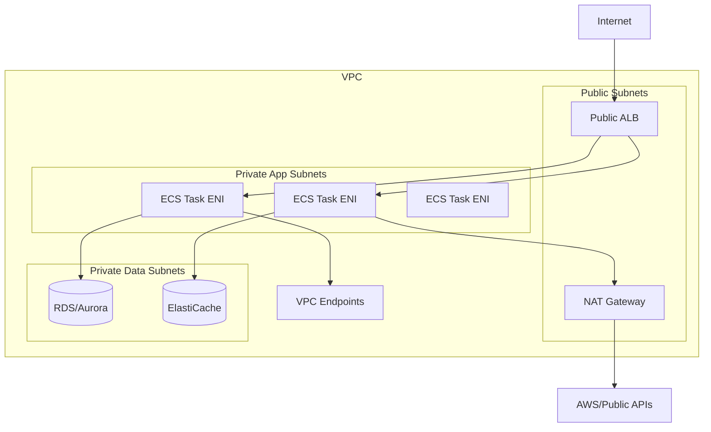
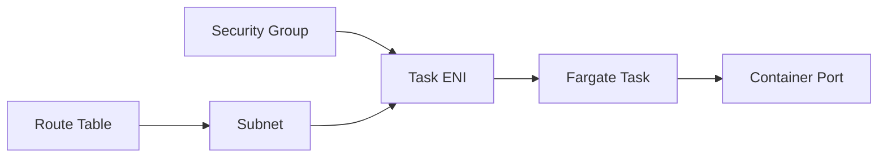
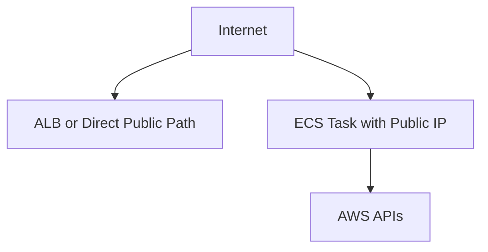
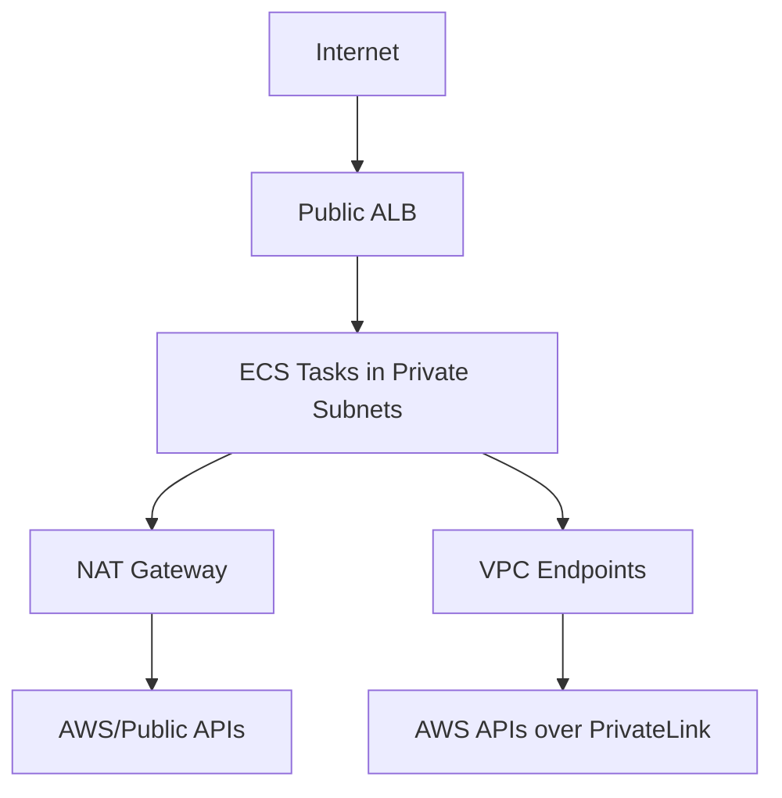
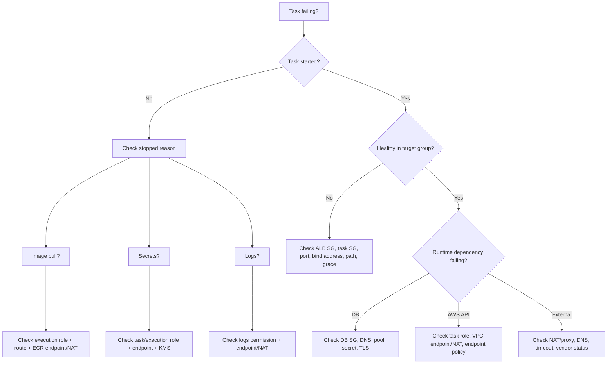

# Part 016 — ECS Networking for Services

ECS networking is where many “simple” Fargate deployments become production systems.

A container can be correct. The task definition can be correct. The service can be correctly deployed. But if the task cannot pull its image, retrieve secrets, emit logs, pass health checks, reach dependencies, or receive traffic, the system is down.

The production mental model:

> ECS networking is not only request traffic. It is every network dependency needed to start, serve, observe, and shut down a task.

That includes:

- image pull from ECR;
- secret retrieval from Secrets Manager or SSM Parameter Store;
- KMS decryption where applicable;
- CloudWatch Logs delivery;
- ALB/NLB health checks;
- service-to-service traffic;
- database/cache calls;
- outbound calls to AWS APIs;
- outbound calls to third-party APIs;
- telemetry exporters;
- DNS resolution;
- deployment control-plane interactions;
- VPC endpoint paths;
- NAT paths;
- security group rules;
- subnet IP capacity.



## 1. The Big Shift: Container Networking Becomes VPC Networking

With ECS Fargate, tasks use `awsvpc` network mode. Each task gets VPC-native networking behavior. You are no longer thinking in terms of host ports on a shared EC2 instance. You are thinking in terms of task-level network identity.

This is good.

It gives you:

- security group control per service/task;
- direct private IP addressing;
- no host port conflicts;
- cleaner ALB/NLB target registration;
- clearer network blast-radius boundaries;
- easier reasoning about service dependencies.

But it also means:

- subnet IP capacity matters;
- security group rules matter immediately;
- route tables matter;
- DNS and VPC resolver behavior matter;
- NAT or VPC endpoints matter;
- endpoint policies may block startup;
- image pull is a network problem;
- logs can fail because networking is wrong.

A useful rule:

> In Fargate, every task is a small VPC citizen.

Do not treat it as an invisible process hiding behind infrastructure.

## 2. The Four Network Paths of an ECS Service

When designing ECS networking, split the system into four paths.

| Path | Description | Common Failure |
|---|---|---|
| Ingress path | Client/load balancer to task | Wrong target group, health check, SG, port mapping |
| Egress path | Task to external/AWS services | No NAT, missing endpoint, wrong route table |
| East-west path | Task to internal services | SG denial, DNS issue, wrong service discovery |
| Bootstrap path | Task startup dependencies | Cannot pull image, cannot fetch secret, cannot create log stream |

Most teams design ingress and forget bootstrap. Then they wonder why a task in a private subnet never starts.

## 3. `awsvpc` Mode

`awsvpc` mode gives ECS tasks VPC networking properties similar to EC2 instances.

In practice, for Fargate:

- the task receives its own network interface behavior;
- the task is placed in configured subnets;
- the task uses configured security groups;
- the task receives a private IP address;
- optional public IP assignment is possible for public subnet placement;
- load balancers register task IPs, not host instance ports.



This makes ECS easier to reason about, but it removes a common excuse: you cannot blame random Docker port mapping once the task has its own network identity.

If traffic fails, inspect:

1. task subnet;
2. route table;
3. security group inbound/outbound;
4. NACL if used;
5. target group type and health;
6. app bind address and port;
7. DNS resolution;
8. VPC endpoint/NAT path;
9. IAM permission only after network path is proven.

## 4. Public Subnet vs Private Subnet Placement

There are two common Fargate placement models.

### 4.1 Public Subnet with Public IP



This can be simple for small workloads, but it increases public exposure risk if not designed carefully.

Use this only when:

- the task must be directly reachable publicly, or
- the architecture is intentionally simple and tightly secured, or
- cost constraints make NAT/endpoints impractical for a tiny non-sensitive workload.

Even then, prefer an ALB as the public entrypoint and keep tasks private where possible.

### 4.2 Private Subnet without Public IP



This is the usual production pattern.

Tasks do not receive public IPs. Ingress comes through ALB/NLB or private service discovery. Egress uses NAT gateways or VPC endpoints.

Benefits:

- reduced public attack surface;
- centralized ingress controls;
- cleaner security group boundaries;
- easier compliance argument;
- private access to AWS services via endpoints.

Costs and constraints:

- NAT gateways cost money;
- VPC endpoints cost money and require setup;
- endpoint policies can break access;
- route tables must be correct;
- subnet IP capacity must support task scale;
- troubleshooting needs discipline.

## 5. Bootstrap Networking: The Hidden Critical Path

A task in private subnets may need network access before the app starts.

Startup may require:

- ECR API access;
- ECR Docker registry access;
- S3 access for image layer storage path used by ECR flows;
- Secrets Manager or SSM Parameter Store;
- KMS;
- CloudWatch Logs;
- X-Ray or telemetry endpoints;
- external license/config services;
- DNS.

If these paths are broken, the app never gets a chance to fail gracefully.

Common startup errors:

```txt
CannotPullContainerError
ResourceInitializationError
CannotCreateContainerError
AccessDeniedException
The task cannot pull registry auth from Amazon ECR
The task cannot retrieve secrets from AWS Systems Manager
The task cannot create log stream
```

When a task fails before app startup, debug in this order:

1. task stopped reason;
2. execution role permissions;
3. subnet route table;
4. NAT gateway or VPC endpoint availability;
5. endpoint security group;
6. endpoint policy;
7. ECR repository policy;
8. Secrets/KMS policy;
9. CloudWatch Logs log group permission;
10. DNS support and hostnames enabled in VPC.

## 6. NAT Gateway vs VPC Endpoints

For private tasks, outbound access usually uses one of two patterns.

### 6.1 NAT Gateway

NAT gateway allows private subnet tasks to reach public internet/AWS public endpoints through a public subnet gateway.

Pros:

- simple mental model;
- broad outbound compatibility;
- works for third-party APIs;
- fewer endpoint-specific configurations.

Cons:

- hourly and data processing cost;
- centralized egress dependency;
- not private service access in the strictest sense;
- route table and AZ design matter;
- can become hidden cost center.

NAT is often the fastest path to working architecture. It is not always the best long-term path.

### 6.2 VPC Endpoints

VPC endpoints allow private access to supported AWS services without routing through the public internet.

For ECS/Fargate workloads, common endpoints include:

- ECR API;
- ECR Docker registry;
- S3 gateway endpoint where required;
- CloudWatch Logs;
- Secrets Manager;
- SSM;
- KMS;
- X-Ray;
- STS depending on usage;
- EventBridge/SQS/SNS depending on app behavior.

Pros:

- private AWS service access;
- avoids NAT for supported AWS services;
- can reduce data path exposure;
- endpoint policies provide additional control;
- better compliance story for private workloads.

Cons:

- each endpoint has cost and configuration;
- endpoint security group must allow traffic;
- endpoint policies can create confusing denies;
- unsupported third-party internet calls still need NAT/proxy;
- multi-AZ endpoint design needs care.

The mature design is not “always NAT” or “always endpoints”.

Use a decision table:

| Requirement | Prefer |
|---|---|
| Mostly AWS API access | VPC endpoints |
| Many third-party internet APIs | NAT or controlled egress proxy |
| Tiny workload, low compliance sensitivity | Simpler NAT/public-IP design may be acceptable |
| Regulated private workload | Private subnets + endpoints + controlled egress |
| High outbound data volume to AWS services | Evaluate endpoints to reduce NAT data processing cost |
| Need central inspection | Egress proxy/firewall architecture |

## 7. Security Groups as Service Contracts

A security group is not only a firewall. In ECS service design, it is a service contract.

Example:

```txt
alb-sg
  inbound: 443 from internet or corporate network
  outbound: 8080 to app-sg

app-sg
  inbound: 8080 from alb-sg
  outbound: 5432 to db-sg
  outbound: 443 to vpce-sg/nat

db-sg
  inbound: 5432 from app-sg
```

This model says:

- only ALB can call the app;
- only app can call DB;
- app egress is explicit;
- DB is not exposed to the whole VPC.

Avoid broad patterns like:

```txt
inbound 0.0.0.0/0 on app port
outbound 0.0.0.0/0 all ports forever
all services share one security group
DB allows entire VPC CIDR
```

Those patterns work until they become incident accelerators.

### 7.1 Service-to-Service Security Groups

For internal services:

```txt
orders-sg -> payments-sg: 8080
payments-sg -> ledger-sg: 8080
ledger-sg -> aurora-sg: 5432
```

This creates an inspectable dependency graph.

When an incident happens, you can ask:

- Which services can call payments?
- Which services can reach the database?
- Can a compromised worker call admin APIs?
- Can a public-facing service reach internal-only services?

Security group design should mirror architecture boundaries.

## 8. Load Balancer Integration

ECS services commonly use ALB or NLB.

### 8.1 ALB

Use ALB when you need:

- HTTP/HTTPS routing;
- path/host-based routing;
- TLS termination;
- HTTP health checks;
- WAF integration;
- request-level metrics;
- sticky sessions where absolutely necessary;
- blue/green or weighted routing patterns.

### 8.2 NLB

Use NLB when you need:

- TCP/UDP/TLS pass-through;
- very high throughput;
- static IP support;
- lower-level network behavior;
- private link exposure patterns;
- non-HTTP protocols.

### 8.3 Target Type

For Fargate tasks using `awsvpc`, target groups use IP targets.

Important implications:

- target registration is per task IP;
- health checks hit the task IP and container port;
- security groups must allow load balancer to task;
- deregistration delay affects graceful deployment;
- app must listen on the expected port and address.

## 9. Health Check Networking

A load balancer health check is a network request. It must pass through:

1. load balancer security group;
2. task security group;
3. route path inside VPC;
4. container port mapping;
5. app listener;
6. health endpoint implementation.

Bad health checks cause deployment failure loops.

Common mistakes:

- app listens on `127.0.0.1` instead of `0.0.0.0`;
- health check path requires auth;
- health check endpoint calls slow downstream dependency;
- app startup exceeds health grace period;
- target group port differs from container port;
- task SG does not allow ALB SG;
- ALB is in wrong subnets;
- target group protocol mismatch;
- deregistration delay too long or too short.

A health check should answer:

```txt
Can this task safely receive traffic now?
```

Not:

```txt
Are all downstream systems perfect?
```

## 10. DNS and Service Discovery

ECS services can use several discovery patterns:

- ALB/NLB DNS name;
- Cloud Map service discovery;
- ECS Service Connect;
- private Route 53 records;
- environment-configured endpoints;
- service mesh/proxy model.

The risk with DNS is assuming it is instant, perfect, and always correctly cached.

Production concerns:

- TTL behavior;
- stale client-side DNS caches;
- JVM DNS cache settings;
- target replacement during deployments;
- connection pool reuse after endpoint changes;
- split-horizon DNS;
- cross-VPC resolution;
- service discovery consistency during scale events.

For Java applications, DNS and connection pooling interact. If a dependency endpoint changes but the HTTP client keeps old pooled connections, traffic may fail until the pool refreshes.

Design clients with:

- finite connection lifetime;
- bounded pool size;
- sane DNS TTL behavior;
- retry with jitter;
- circuit breaking;
- timeout budgets.

## 11. Database Networking

ECS tasks often connect to RDS/Aurora.

The network path seems simple:

```txt
app task -> db security group -> database port
```

But production issues are usually not simple connectivity issues.

They are fleet-level issues:

- each task opens too many connections;
- autoscaling creates connection storms;
- deployment replaces all tasks and reconnects at once;
- health check endpoint opens DB connections;
- connection pool has no max lifetime;
- DNS failover is not respected;
- database SG allows too broad access;
- secrets rotation breaks new connections but old tasks continue.

A safe database networking design includes:

- DB security group only allowing app SGs;
- connection pool max size per task;
- fleet-level connection budget;
- RDS Proxy where appropriate;
- timeout smaller than request timeout budget;
- graceful drain during deployments;
- retry policy that does not overload DB during failover;
- observability for connection count and acquisition latency.

## 12. Subnet IP Capacity

Because tasks consume VPC addresses, subnet sizing is a scaling constraint.

Do not design subnets only for current desired count.

Consider:

- current desired tasks;
- deployment surge tasks;
- autoscaling maximum;
- blue/green overlap;
- failed deployment replacement attempts;
- other resources in the same subnet;
- ENI/IP reservations;
- future services;
- multi-AZ distribution.

Example:

```txt
service desired count: 20
maxPercent during deployment: 200%
max autoscale: 80
blue/green overlap possible: yes
minimum subnet headroom needed: far more than 20 IPs
```

A deployment can fail not because the app is bad, but because the subnet cannot allocate more task IPs.

## 13. Multi-AZ Placement

Production ECS services should normally span multiple Availability Zones.

Why:

- AZ fault tolerance;
- better load distribution;
- deployment resilience;
- capacity availability;
- reduced blast radius.

But multi-AZ has design consequences:

- ALB should be in matching AZ subnets;
- private app subnets should exist per AZ;
- NAT gateway per AZ avoids cross-AZ egress dependency and data charges;
- VPC endpoints should be considered per AZ;
- database/cache placement should align with latency and failover requirements;
- autoscaling should not concentrate all tasks in one subnet.

A common weak architecture uses private subnets in multiple AZs but only one NAT gateway. It works until that AZ or NAT path becomes the bottleneck or failure point.

## 14. Outbound Egress Control

Many services need outbound internet:

- payment gateways;
- identity providers;
- SaaS APIs;
- license validation;
- telemetry vendors;
- public package registries during bad build practices;
- external webhooks.

Uncontrolled egress is risky.

Better patterns:

- explicit NAT route plus monitored destination logs;
- egress proxy;
- AWS Network Firewall where justified;
- allowlist-based outbound policy;
- VPC endpoint for AWS APIs;
- no runtime package downloads;
- no build-time behavior during container startup;
- synthetic checks for critical third-party dependencies.

The worst pattern is a task that downloads executable code from the internet at startup. That makes deployment non-reproducible and turns network instability into release instability.

## 15. Logs and Telemetry Networking

Logging is part of the runtime network contract.

If tasks cannot emit logs, incident response becomes blind.

For CloudWatch Logs, verify:

- execution role permission;
- log group exists or can be created by authorized path;
- private tasks have NAT or CloudWatch Logs VPC endpoint;
- log driver configuration is correct;
- application emits structured logs to stdout/stderr;
- log volume is cost-controlled;
- multiline Java stack traces are handled intentionally.

Telemetry exporters may require:

- OTLP collector endpoint;
- X-Ray endpoint;
- vendor endpoint;
- proxy;
- TLS trust configuration;
- retry/backoff to avoid telemetry storm.

Telemetry should degrade gracefully. A monitoring vendor outage should not crash your service.

## 16. Common Failure Modes

### 16.1 Cannot Pull Container Image

Likely causes:

- no NAT path from private subnet;
- missing ECR VPC endpoints;
- missing S3 endpoint where needed;
- execution role lacks ECR permission;
- repository policy denies access;
- image tag/digest does not exist;
- DNS issue;
- endpoint security group denies task access.

### 16.2 Task Starts but Never Becomes Healthy

Likely causes:

- wrong health check path;
- app listens on wrong port;
- app binds to localhost only;
- startup slower than grace period;
- SG denies ALB to task;
- container port mismatch;
- dependency check blocks readiness;
- app crashes after startup.

### 16.3 Task Cannot Reach Database

Likely causes:

- DB SG does not allow task SG;
- task SG outbound restricted;
- route table issue;
- DNS issue;
- database in isolated subnet with wrong routing assumptions;
- wrong port;
- TLS/certificate issue;
- secret credentials wrong, misread as network error.

### 16.4 Deployment Stuck

Likely causes:

- new tasks cannot pull image;
- new tasks cannot pass health check;
- subnet IP exhaustion;
- insufficient Fargate capacity;
- ALB target group misconfiguration;
- service deployment parameters too strict;
- app startup regression;
- missing secret permission.

### 16.5 Intermittent Downstream Failures

Likely causes:

- NAT saturation/cost path;
- DNS cache issue;
- connection pool stale endpoints;
- cross-AZ dependency path;
- security group changed during deployment;
- third-party throttling;
- retry storm from all tasks;
- database failover not handled.

## 17. Debugging Flow

Use this flow when an ECS task networking issue appears.



This prevents random debugging.

Always separate:

- control plane failure;
- bootstrap failure;
- ingress failure;
- dependency failure;
- application failure.

## 18. Recommended Baseline Architecture

For most production internal/public APIs:

```txt
Public ALB in public subnets
ECS/Fargate tasks in private app subnets
RDS/ElastiCache in private data subnets
Security group from ALB -> app only
Security group from app -> data only
NAT per AZ or VPC endpoints for AWS APIs
CloudWatch Logs endpoint or NAT path
ECR endpoints for private image pull where NAT is avoided
Secrets Manager/SSM endpoint for secret retrieval
Autoscaling based on request count or CPU/memory/queue depth
Structured logs + traces + deployment events
```

For private internal services:

```txt
Internal ALB/NLB or Service Connect/Cloud Map
Tasks in private subnets
No public IPs
Private DNS/service discovery
Strict service-to-service SGs
VPC endpoints for AWS APIs
Controlled egress for third-party calls
```

For workers:

```txt
Tasks in private subnets
No ingress from ALB
Outbound to SQS/EventBridge/Kinesis/database
Autoscaling from queue/backlog metrics
No public IPs
NAT/endpoints for AWS APIs
Task SG allows only required dependencies
```

## 19. Production Checklist

Before shipping an ECS service, validate:

- Are tasks in the intended subnets?
- Do tasks need public IPs? If yes, why?
- Is ingress routed through ALB/NLB or private discovery?
- Does ALB SG allow only expected client traffic?
- Does task SG allow inbound only from ALB/internal caller SGs?
- Does DB/cache SG allow inbound only from task SGs?
- Can private tasks pull ECR images?
- Can private tasks retrieve secrets?
- Can private tasks emit logs?
- Is NAT or VPC endpoint strategy documented?
- Are endpoint policies tested?
- Is DNS resolution enabled and understood?
- Is subnet IP capacity enough for deployment surge and autoscaling max?
- Are tasks spread across multiple AZs?
- Is health check path reachable from load balancer?
- Does app bind to `0.0.0.0` on the expected port?
- Are database connections budgeted per task and fleet?
- Are outbound third-party calls controlled and observable?
- Is there a runbook for image pull, unhealthy target, and dependency connection failure?

## 20. Mental Model Summary

ECS networking is not a side concern. It is the runtime circulatory system.

The system works only when these paths are all correct:

```txt
client -> load balancer -> task
app task -> downstream services
task startup -> ECR/secrets/logging
task runtime -> AWS APIs/external APIs
observability -> logs/traces/metrics
```

The top-level invariant:

> A task that cannot start, be reached, observe itself, or reach its dependencies is not deployed, even if ECS says it exists.

In production, “task is running” is not the same as “service is usable”. Networking is the difference.

## References

- AWS ECS Developer Guide — Fargate task networking: https://docs.aws.amazon.com/AmazonECS/latest/developerguide/fargate-task-networking.html
- AWS ECS Developer Guide — Task networking with `awsvpc`: https://docs.aws.amazon.com/AmazonECS/latest/developerguide/task-networking-awsvpc.html
- AWS ECS Developer Guide — Connecting ECS to AWS services from a VPC: https://docs.aws.amazon.com/AmazonECS/latest/developerguide/networking-connecting-vpc.html
- AWS ECS Developer Guide — ECS interface VPC endpoints: https://docs.aws.amazon.com/AmazonECS/latest/developerguide/vpc-endpoints.html
- AWS ECS Developer Guide — Service load balancing: https://docs.aws.amazon.com/AmazonECS/latest/developerguide/service-load-balancing.html
- AWS ECS Developer Guide — Troubleshooting stopped tasks: https://docs.aws.amazon.com/AmazonECS/latest/developerguide/stopped-task-errors.html
