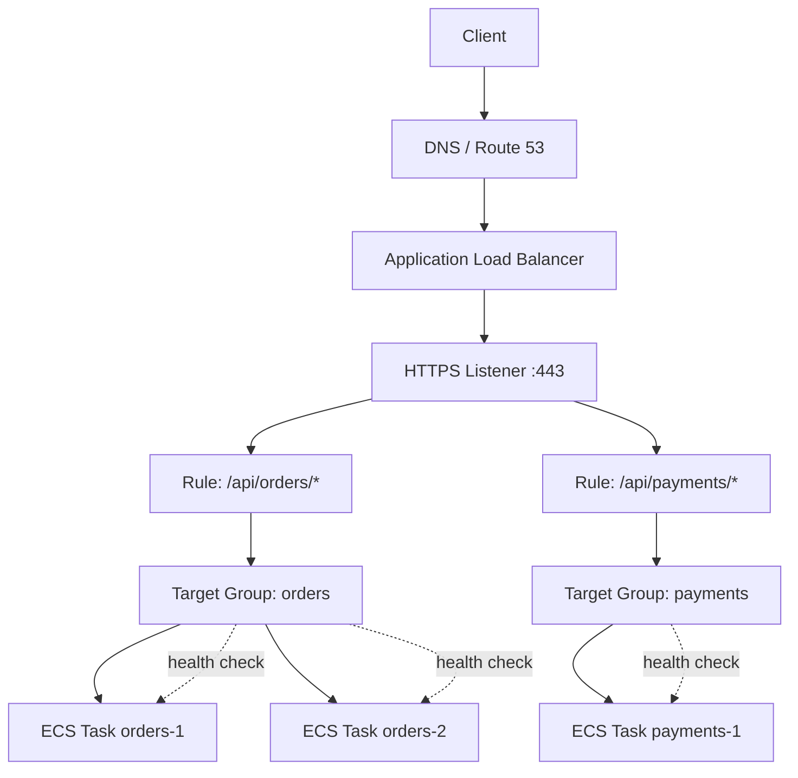
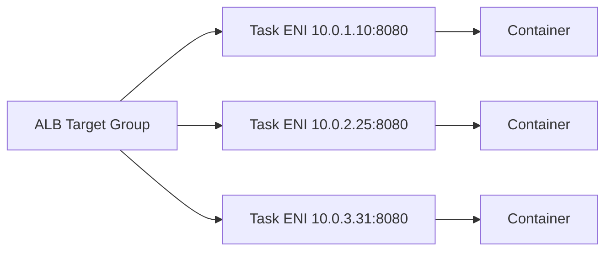
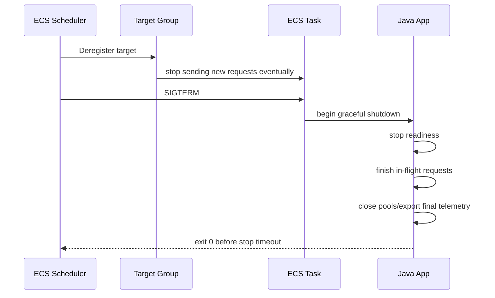

# Part 017 — Load Balancing ECS Services

Load balancing is not just “put an ALB in front of the service”.

For ECS, the load balancer is the public runtime contract between the outside world and a moving set of tasks. Tasks start, warm up, become healthy, receive traffic, fail, drain, and disappear. The load balancer is the component that decides which task is currently safe to receive a request.

A production engineer should model ECS load balancing as four contracts:

1. **routing contract** — which listener rule maps a request to which target group;
2. **health contract** — how the load balancer decides a task is safe;
3. **draining contract** — how traffic is removed before a task stops;
4. **deployment contract** — how new task sets replace old task sets without user-visible failure.

If any one of these is wrong, the service can be “deployed successfully” but still be unavailable.



## 1. The Load Balancer Is a Runtime Boundary

An ECS service is dynamic. Its tasks are not stable infrastructure.

A task can be replaced because of:

- deployment;
- failed health check;
- scaling event;
- Fargate platform maintenance;
- Spot interruption;
- failed image pull retry;
- memory pressure;
- dependency failure causing application crash;
- manual force deployment;
- infrastructure drift repair.

Therefore, clients must not target tasks directly. Clients should target a stable endpoint, and the stable endpoint should route to currently healthy tasks.

The load balancer gives you this stable endpoint.

But the important phrase is **currently healthy**. Healthy means “safe to receive traffic now”, not “process exists”.

A Spring Boot process can be running while:

- database migrations are still running;
- connection pools are not initialized;
- downstream dependencies are unavailable;
- cache warming is incomplete;
- the service is in read-only mode;
- worker threads are saturated;
- shutdown has begun;
- the app is alive but no longer ready.

That is why a production ECS load-balancer design must align load-balancer health checks with application readiness.

## 2. ALB vs NLB: Do Not Start with Preference

Start with traffic shape.

| Requirement | Prefer ALB | Prefer NLB |
|---|---:|---:|
| HTTP/HTTPS routing | yes | sometimes, but not the primary fit |
| path-based routing | yes | no |
| host-based routing | yes | no |
| WAF integration | yes | not the normal choice |
| Layer 7 request metrics | yes | no |
| Web API / REST / GraphQL | yes | usually no |
| gRPC over HTTP/2 | often yes | possible depending architecture |
| raw TCP | no | yes |
| TLS passthrough | no | yes |
| static IP per AZ | no | yes |
| extremely low L4 overhead | no | yes |
| private service endpoint via PrivateLink | no | yes |
| millions of long-lived TCP connections | usually no | often yes |

Use **ALB** for most HTTP services: REST APIs, web apps, public APIs, internal HTTP APIs, GraphQL, HTTP-based Java microservices, and most containerized backend services.

Use **NLB** when you need Layer 4 behavior: TCP, TLS passthrough, fixed IPs, PrivateLink provider services, non-HTTP protocols, or architecture that intentionally avoids Layer 7 inspection.

A weak rule of thumb:

```txt
If your routing decision needs HTTP semantics, use ALB.
If your routing decision must not inspect HTTP, use NLB.
```

A stronger rule:

```txt
Pick the load balancer whose failure semantics you are willing to operate.
```

ALB gives better application-level visibility and routing. NLB gives lower-level transport behavior but pushes more interpretation to the application and clients.

## 3. Target Groups Are the Deployment Unit

A target group is not just “where the ALB sends traffic”.

For ECS services, a target group is the health and draining boundary for a specific backend runtime.

A good design usually maps:

```txt
one ECS service runtime surface -> one target group
```

Examples:

| Service | Target Group | Reason |
|---|---|---|
| `orders-api` | `tg-orders-api-prod` | HTTP request-serving surface |
| `orders-admin-api` | `tg-orders-admin-prod` | different auth/routing surface |
| `payments-api` | `tg-payments-api-prod` | different scaling and failure boundary |
| `billing-webhook` | `tg-billing-webhook-prod` | different timeout/retry behavior |

Avoid sharing one target group across unrelated services. That makes health, scaling, deployment, and incident response ambiguous.

Bad smell:

```txt
one giant target group called backend-prod
```

This usually means:

- listener rules are vague;
- health check path is generic;
- deployment rollback is risky;
- per-service metrics are polluted;
- ownership is unclear;
- incident blast radius is larger than necessary.

## 4. Target Type: `ip` vs `instance`

For Fargate tasks, use target type `ip` because each task receives its own elastic network interface in `awsvpc` mode.

For ECS on EC2, both patterns exist:

- `instance` target type routes to EC2 instance + host port;
- `ip` target type routes to task IP.

In modern ECS architectures, `awsvpc` + `ip` target type is easier to reason about because the target is the task, not the host.



The operational benefit:

- security group rules can describe service-to-service boundaries;
- target health maps directly to task health;
- logs and metrics map naturally to task IDs;
- Fargate and EC2 launch types become more consistent;
- container host port scheduling complexity is reduced.

## 5. Listener Rules Are API Gateway-Lite, Not Business Logic

ALB listener rules can match host, path, header, method, query string, and source IP conditions. This is useful, but it can become dangerous if the load balancer becomes a hidden application router.

Good uses:

- `api.example.com` -> API service;
- `/orders/*` -> orders service;
- `/payments/*` -> payments service;
- `/internal/*` -> internal service;
- redirect HTTP to HTTPS;
- attach WAF at edge;
- route to maintenance page during controlled cutover.

Bad uses:

- business workflow branching;
- tenant-specific behavior hidden in listener rules;
- authentication bypass logic;
- complex version negotiation;
- dozens of fragile path hacks created by historical accidents.

Rule:

> Listener rules should express stable traffic boundaries, not business behavior.

If a rule is difficult to explain in an architecture review, it probably belongs in an application gateway layer or service code.

## 6. Health Checks: Readiness, Not Just Liveness

ALB health checks periodically request a configured path on each registered target. A target that passes health checks is eligible for traffic. A target that fails is removed from normal routing.

The health check endpoint should answer one question:

```txt
Can this task safely receive real production requests right now?
```

Do not make `/health` return `200` just because the JVM is alive.

A better model:

| Endpoint | Purpose | Should ALB use it? |
|---|---|---:|
| `/livez` | process is alive | no |
| `/readyz` | service can receive traffic | yes |
| `/startupz` | initialization status | maybe, for debugging |
| `/deep-health` | expensive dependency inspection | usually no |

A production readiness check should usually verify:

- HTTP server is accepting requests;
- application has completed startup;
- critical configuration is loaded;
- required secret/config references are present;
- database pool is initialized, if every request needs it;
- the service is not in shutdown/draining mode.

It should not usually perform expensive checks on every health probe.

Bad health check:

```java
@GetMapping("/health")
public ResponseEntity<String> health() {
    callPaymentProvider();
    callFraudSystem();
    callEmailGateway();
    runSelectCountOnLargeTable();
    return ResponseEntity.ok("ok");
}
```

This health check can amplify downstream incidents. If a payment provider has a transient issue, all tasks may mark themselves unhealthy, ECS may replace them, and the deployment/availability problem becomes worse.

Better pattern:

```java
@GetMapping("/readyz")
public ResponseEntity<Map<String, Object>> ready() {
    if (lifecycle.isShuttingDown()) {
        return ResponseEntity.status(503).body(Map.of("ready", false, "reason", "draining"));
    }
    if (!startupGate.isOpen()) {
        return ResponseEntity.status(503).body(Map.of("ready", false, "reason", "starting"));
    }
    if (!criticalPools.databasePoolInitialized()) {
        return ResponseEntity.status(503).body(Map.of("ready", false, "reason", "db-pool-not-ready"));
    }
    return ResponseEntity.ok(Map.of("ready", true));
}
```

## 7. Health Check Timing Controls Deployment Speed

For ECS services behind a load balancer, the scheduler waits for target health before considering a task healthy.

The key timing knobs are:

- health check path;
- interval;
- timeout;
- healthy threshold;
- unhealthy threshold;
- ECS service health check grace period;
- application startup time;
- deployment minimum healthy percent;
- deployment maximum percent.

Default-style settings are often too slow for mature services and too aggressive for slow-starting services.

Example failure:

```txt
Spring Boot startup: 75 seconds
ALB health check starts immediately
unhealthy threshold reached before app is ready
ECS kills task
new task starts
repeat forever
```

The correct fix is not “disable health checks”.

The correct fix is to align startup, grace period, and readiness:

```txt
startup time budget:            75 seconds
ECS health check grace period:  120 seconds
readiness endpoint:             only returns 200 when ready
target group timeout:           less than interval
target group interval:          balanced for speed and noise
```

For fast-starting services, reduce unnecessary delay. ECS documentation notes that after initial registration, only one successful load-balancer health check is required for a new target to become healthy. The healthy threshold is mainly relevant when an unhealthy target transitions back to healthy.

## 8. The Fail-Open Edge Case

There is a dangerous behavior many teams do not know: if an ALB target group has only unhealthy registered targets, the load balancer can route to all targets anyway.

This fail-open behavior exists to avoid complete blackholing when every target is marked unhealthy, but it changes the incident model.

Implication:

```txt
health check failure does not always mean traffic fully stops.
```

During a total unhealthy state, clients may still hit broken tasks. Your app must still defend itself:

- return meaningful 503/429 errors;
- avoid destructive partial writes;
- use idempotency keys;
- expose clear error telemetry;
- preserve request correlation IDs;
- avoid self-DDoS retry storms.

Health checks are a routing signal, not a complete safety system.

## 9. Deregistration Delay and Graceful Draining

When ECS stops or replaces a task, the target should be deregistered from the target group and allowed to drain in-flight requests.

The shutdown sequence should look like this:



The important budgets:

```txt
deregistration delay >= max expected in-flight request duration
ECS stop timeout      >= app graceful shutdown duration
client timeout        < user-facing SLA budget
server timeout        aligned with ALB idle timeout
```

If deregistration delay is too short, long requests are cut.

If it is too long, deployments and scale-in are slow.

If the app keeps reporting ready during shutdown, the load balancer may continue sending traffic to a task that is trying to terminate.

A simple shutdown gate:

```java
@Component
public class LifecycleGate {
    private final AtomicBoolean shuttingDown = new AtomicBoolean(false);

    @EventListener(ContextClosedEvent.class)
    public void onShutdown() {
        shuttingDown.set(true);
    }

    public boolean isReady() {
        return !shuttingDown.get();
    }
}
```

Then `/readyz` returns `503` when shutdown begins.

## 10. Health Check Endpoint Must Bypass Most Middleware

Your health endpoint should be boring.

It should not require:

- user authentication;
- CSRF token;
- tenant header;
- request signature;
- expensive request logging enrichment;
- rate limiting designed for user traffic;
- request body parsing;
- database transaction;
- outbound third-party call.

Common failure:

```txt
ALB health check GET /health
application security middleware requires Authorization header
returns 401
ALB marks task unhealthy
ECS replaces healthy service forever
```

If your service requires auth for normal endpoints, carve out `/readyz` explicitly and defensibly.

Example Spring Security shape:

```java
@Bean
SecurityFilterChain security(HttpSecurity http) throws Exception {
    return http
        .authorizeHttpRequests(auth -> auth
            .requestMatchers("/readyz", "/livez").permitAll()
            .anyRequest().authenticated()
        )
        .build();
}
```

This does not mean health data should reveal secrets. Return minimal status and reason codes.

## 11. Path Routing and Versioning

Path routing is useful for coarse service boundaries.

Example:

```txt
/api/orders/*       -> orders-api
/api/payments/*     -> payments-api
/api/customers/*    -> customers-api
```

Version routing is more subtle.

Avoid creating a new target group for every minor API version unless versions have genuinely different runtime or rollout needs.

Better:

```txt
/api/v1/orders/* -> orders-api target group
/api/v2/orders/* -> orders-api-v2 target group only if v2 is separately deployed
```

Do not use ALB rules as a substitute for contract versioning.

If old and new versions share the same runtime, handle compatibility in the application. If old and new versions have different scaling, release, or risk boundaries, separate target groups make sense.

## 12. Sticky Sessions Are Usually a Smell

ALB supports stickiness, but sticky sessions should not be the default answer.

A stateless ECS service should tolerate any request going to any task.

Sticky sessions can hide:

- in-memory session state;
- unsafe local cache mutation;
- missing distributed session store;
- non-idempotent request design;
- websocket affinity assumptions;
- uneven load distribution;
- task-level hot spots.

Use stickiness only when the runtime contract demands it and you understand the failure behavior.

Questions before enabling stickiness:

1. What happens when the sticky target is drained?
2. Can the session move safely to another task?
3. Does stickiness break multi-AZ distribution?
4. Does scale-out actually help if old clients remain pinned?
5. Is the state better stored in Redis/DynamoDB/session store?

## 13. TLS Placement

Typical HTTP service pattern:

```txt
client -> HTTPS ALB -> HTTP task
```

This is simple and common. TLS terminates at ALB, and traffic inside the VPC goes to the task.

Stricter pattern:

```txt
client -> HTTPS ALB -> HTTPS task
```

This is useful when compliance or internal trust boundaries require encryption to the task.

NLB TLS passthrough pattern:

```txt
client -> NLB TCP/TLS passthrough -> task terminates TLS
```

This is useful when the backend must own TLS negotiation, client certificate validation, or non-HTTP protocol semantics.

Do not choose TLS placement by habit. Choose it based on trust boundary, observability needs, certificate operations, compliance, and debugging trade-offs.

## 14. WAF, Rate Limits, and Edge Protection

For public ALB-backed ECS services, consider:

- AWS WAF at ALB or CloudFront layer;
- request size limits;
- IP reputation rules;
- bot controls where applicable;
- per-route throttling at application/API gateway layer;
- origin protection if CloudFront is used;
- structured 4xx/5xx telemetry.

ALB itself is not your complete abuse-control layer.

Use ALB for routing and target health. Use WAF, CloudFront, API Gateway, or application-level controls depending on the threat model.

## 15. Autoscaling with ALB Metrics

For request-serving services, CPU is often a lagging or misleading autoscaling signal.

Better signals include:

- `RequestCountPerTarget`;
- target response time;
- active connections;
- queue depth for async workloads;
- custom business workload units;
- JVM thread pool saturation;
- p95/p99 latency;
- 5xx rate.

A common ECS service scaling model:

```txt
scale out when request count per target exceeds threshold
scale out faster on latency/5xx composite alarm
scale in slowly to avoid oscillation
keep minimum capacity per AZ
```

CPU-only scaling can fail when:

- a service blocks on database calls;
- thread pools saturate before CPU rises;
- request latency increases due to downstream IO;
- GC pressure appears as latency before sustained CPU;
- task is memory-bound;
- external API calls dominate request time.

## 16. Deployment Strategies with Load Balancers

### Rolling Deployment

The default ECS rolling deployment gradually replaces old tasks with new tasks while maintaining desired availability.

You must tune:

- `minimumHealthyPercent`;
- `maximumPercent`;
- health check grace period;
- task startup time;
- target group health check settings;
- deregistration delay;
- application graceful shutdown.

A typical safe shape for a small service:

```txt
desired count:          4
minimum healthy:        100%
maximum percent:        200%
can start new tasks:    yes, up to 8
can stop old tasks:     only after new tasks healthy
```

For constrained capacity, `maximumPercent=200` may not be possible. For strict availability, `minimumHealthyPercent=50` may be too risky.

### Blue/Green Deployment

Blue/green uses separate target groups or task sets so traffic can shift from old to new.

It is useful when:

- rollback must be fast;
- health validation is more involved;
- deployment risk is high;
- you need pre-traffic tests;
- release evidence matters;
- traffic shifting should be controlled explicitly.

Blue/green is not automatically safer. It adds more moving parts: target groups, listener updates, CodeDeploy or deployment controller, alarms, test traffic, and rollback hooks.

## 17. Common Failure Modes

### Failure Mode 1 — Health Check Path Returns 404

Symptom:

```txt
service deploys, tasks start, target group marks tasks unhealthy
```

Likely causes:

- wrong path;
- app context path changed;
- health route protected by auth;
- container listens on different port;
- ALB target group points at wrong port;
- application returns 301/302 but matcher expects 200 only.

Debug:

```bash
aws elbv2 describe-target-health \
  --target-group-arn "$TG_ARN"
```

Then inspect reason codes and ECS service events.

### Failure Mode 2 — Health Check Works Locally but Fails in ECS

Likely causes:

- app binds to `127.0.0.1` instead of `0.0.0.0`;
- security group does not allow ALB to task port;
- container port mismatch;
- private subnet route issue;
- app startup exceeds grace period;
- target group protocol mismatch;
- health endpoint depends on unavailable cloud dependency.

### Failure Mode 3 — Deployments Hang

Likely causes:

- new tasks never become healthy;
- old tasks cannot be drained due to min healthy constraint;
- insufficient subnet IPs;
- insufficient Fargate quota;
- target group stuck draining;
- app shutdown does not exit;
- capacity provider cannot place tasks.

### Failure Mode 4 — 502 from ALB

Common causes:

- target closed connection unexpectedly;
- target port wrong;
- app crashed after health check passed;
- response malformed;
- TLS mismatch between ALB and target;
- target reset connection during shutdown.

### Failure Mode 5 — 504 from ALB

Common causes:

- target did not respond before timeout;
- downstream dependency is slow;
- thread pool saturated;
- database connection pool exhausted;
- ALB idle timeout lower than backend behavior;
- long request should be async but is implemented as synchronous HTTP.

## 18. Debugging Flow: Unhealthy ECS Targets

Use this order. Do not randomly change target group settings first.

```txt
1. Check ECS service events.
2. Check target health reason codes.
3. Confirm target group target type and port.
4. Confirm ALB security group -> task security group rule.
5. Confirm task is listening on 0.0.0.0:<containerPort>.
6. Curl readiness endpoint from inside VPC if possible.
7. Check app logs during startup.
8. Check health check grace period vs startup time.
9. Check matcher status code.
10. Check container health check and essential container status.
11. Check subnet IP capacity and task placement errors.
12. Check deployment circuit breaker/rollback events.
```

A target-health reason code is often more useful than application guessing.

## 19. Reference CDK Shape

The exact CDK construct style depends on your organization, but the architecture shape should be explicit.

```ts
const service = new ecs.FargateService(this, "OrdersService", {
  cluster,
  taskDefinition,
  desiredCount: 4,
  assignPublicIp: false,
  circuitBreaker: { rollback: true },
  healthCheckGracePeriod: Duration.seconds(120),
});

const tg = new elbv2.ApplicationTargetGroup(this, "OrdersTargetGroup", {
  vpc,
  port: 8080,
  protocol: elbv2.ApplicationProtocol.HTTP,
  targetType: elbv2.TargetType.IP,
  healthCheck: {
    path: "/readyz",
    healthyHttpCodes: "200",
    interval: Duration.seconds(15),
    timeout: Duration.seconds(5),
  },
  deregistrationDelay: Duration.seconds(30),
});

service.attachToApplicationTargetGroup(tg);

listener.addTargetGroups("OrdersRule", {
  priority: 100,
  conditions: [elbv2.ListenerCondition.pathPatterns(["/api/orders/*"])],
  targetGroups: [tg],
});
```

The important parts are not the syntax. The important parts are:

- target type is `IP`;
- health path is readiness, not liveness;
- grace period matches startup;
- deregistration delay matches in-flight request budget;
- circuit breaker rollback exists;
- listener rule is stable and understandable.

## 20. Design Review Questions

Ask these before approving an ECS service behind ALB/NLB:

1. What exactly makes a task ready for traffic?
2. Is the health check endpoint auth-free but information-safe?
3. Does the task bind to the correct interface and port?
4. Is the target type correct for the network mode?
5. Does the security group allow only intended traffic?
6. What happens during shutdown with in-flight requests?
7. Is deregistration delay aligned with request timeout?
8. Does deployment have enough capacity to start new tasks before stopping old ones?
9. Are listener rules simple enough to audit?
10. Does the service need sticky sessions? Why?
11. Are ALB 4xx/5xx and target 5xx separated in dashboards?
12. What is the rollback signal?
13. What is the customer-visible symptom if every target is unhealthy?
14. Can autoscaling use request count per target instead of CPU only?
15. Are target group metrics part of the incident runbook?

## 21. The Production Invariant

A production ECS load-balancing design is correct when:

```txt
only ready tasks receive traffic,
terminating tasks stop receiving traffic before they die,
deployment can introduce new tasks without reducing availability,
rollback can restore old traffic quickly,
and target health reflects real request safety rather than process existence.
```

That is the invariant.

Everything else is configuration.

## References

- AWS Documentation — Health checks for Application Load Balancer target groups: https://docs.aws.amazon.com/elasticloadbalancing/latest/application/target-group-health-checks.html
- AWS Documentation — Optimize load balancer health check parameters for Amazon ECS: https://docs.aws.amazon.com/AmazonECS/latest/developerguide/load-balancer-healthcheck.html
- AWS Documentation — Edit target group attributes for Application Load Balancer: https://docs.aws.amazon.com/elasticloadbalancing/latest/application/edit-target-group-attributes.html
- AWS Documentation — Amazon ECS services: https://docs.aws.amazon.com/AmazonECS/latest/developerguide/ecs_services.html
