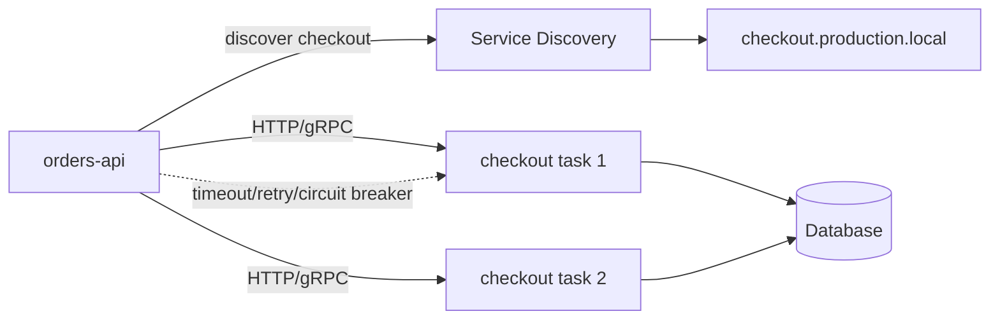
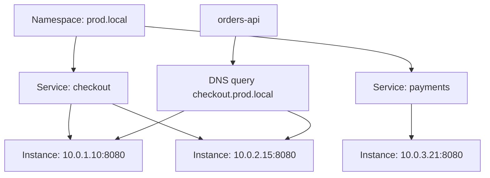
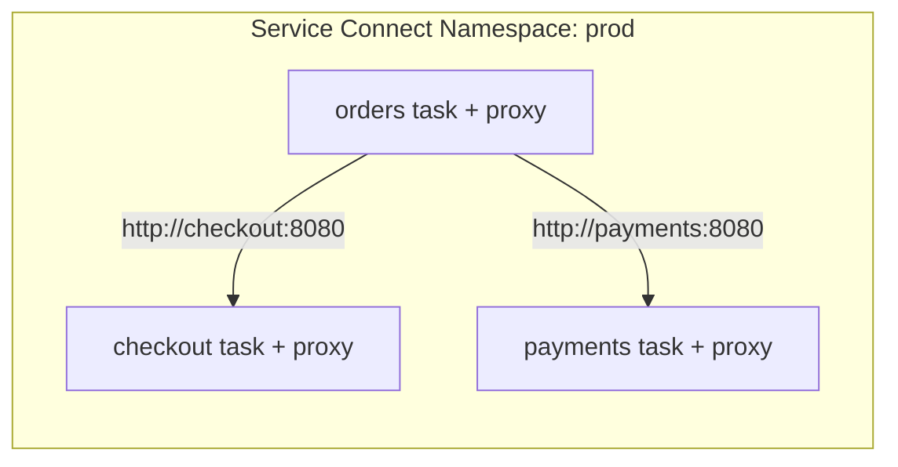
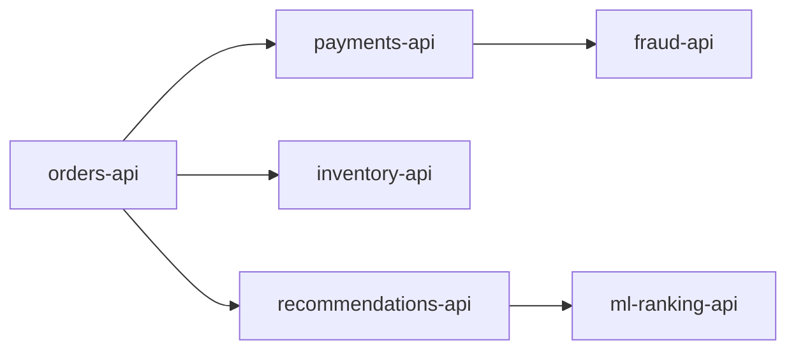

# Part 018 — Service Discovery and East-West Traffic

North-south traffic is traffic entering the platform from users or external clients.

East-west traffic is traffic between services inside the platform.

ECS teams often spend a lot of time on north-south traffic because it is visible: ALB, DNS, TLS, WAF, public endpoints. But many production incidents come from east-west mistakes: stale DNS, retry storms, missing timeouts, overloaded dependencies, bad service names, hidden coupling, and health signals that do not match client behavior.

The core model:

```txt
service discovery tells a client where to send traffic.
resilience engineering decides what the client does when that location fails.
```

Service discovery is not enough.

A client that discovers the right endpoint can still destroy the system if it retries forever, holds stale connections, ignores timeouts, or treats every dependency as mandatory.



## 1. What Service Discovery Actually Solves

Service discovery solves the problem:

```txt
I know the logical service name. Which network endpoint should I call now?
```

It does not solve:

- whether the endpoint is semantically healthy;
- whether the dependency has capacity;
- whether the caller should retry;
- whether the operation is idempotent;
- whether the response is stale;
- whether the callee is in the same trust zone;
- whether the caller should degrade gracefully;
- whether traffic should shift gradually;
- whether the dependency should exist as synchronous HTTP at all.

For a senior engineer, the main question is not “how do services find each other?”

The main question is:

> What coupling does this discovery mechanism create, and how does it fail?

## 2. East-West Options in ECS

Common ECS service-to-service patterns:

| Pattern | Example | Good For | Main Risk |
|---|---|---|---|
| Static config | `PAYMENTS_URL=https://...` | few stable dependencies | drift and manual changes |
| Internal ALB | `https://payments.internal.example.com` | HTTP services with L7 routing | extra hop/cost/config |
| Internal NLB | TCP/gRPC/custom protocol | L4 protocols, PrivateLink | less L7 visibility |
| Cloud Map DNS | `payments.prod.local` | direct task discovery | DNS cache/stale endpoint risk |
| ECS Service Connect | `http://payments:8080` style endpoint | ECS-to-ECS inside namespace | proxy/config abstraction and namespace boundary |
| Service mesh | App Mesh/Istio/Linkerd | deep traffic policy/mTLS | operational complexity |
| Event-driven | EventBridge/SQS/SNS | decoupled async flow | eventual consistency/replay/ordering |

The correct answer is workload-specific.

For many ECS teams:

- external HTTP traffic enters through ALB;
- internal HTTP traffic uses internal ALB or Service Connect;
- simple direct discovery uses Cloud Map;
- high-control platform teams may use service mesh;
- workflows that do not require immediate response should be event-driven.

## 3. Cloud Map Mental Model

AWS Cloud Map maps logical service names to resources. For ECS service discovery, ECS can register and deregister task endpoints into Cloud Map as tasks appear and disappear.

Cloud Map has three useful concepts:

```txt
Namespace -> Service -> Service Instance
```

Example:

```txt
namespace:        prod.local
service:          checkout
service instance: checkout task IP + port + metadata
```



For ECS tasks, service discovery records include useful metadata such as task IP, port, Availability Zone, Region, ECS service name, ECS cluster name, and task definition family.

The important operational point:

> Cloud Map gives a name to moving task endpoints. It does not make synchronous calls safe by itself.

## 4. DNS Discovery Failure Modes

DNS-based discovery is simple and attractive, but it has hidden failure modes.

### Failure Mode 1 — Stale DNS Cache

A task is stopped. ECS removes it from discovery. But a caller, runtime, sidecar, or library may keep using the old IP until its DNS cache expires.

Impact:

```txt
caller keeps sending traffic to dead task IP
requests fail even though new healthy tasks exist
```

Java-specific trap:

- JVM DNS caching behavior depends on security properties and runtime configuration;
- HTTP clients may keep connection pools to old addresses;
- long-lived clients may not re-resolve often;
- retry logic may retry the same stale endpoint.

Mitigation:

- set sane DNS TTL behavior;
- configure HTTP connection pool max lifetime;
- retry only with bounded attempts;
- reconnect and re-resolve after connection failure;
- use Service Connect/internal ALB when you need stronger routing behavior;
- expose dependency error metrics by target/service.

### Failure Mode 2 — All Instances Returned, None Actually Ready

Discovery may return registered instances, but the application can still be overloaded or semantically not ready.

Mitigation:

- align ECS container health with discovery health;
- make readiness reflect serving safety;
- use load balancer or proxy health when you need continuous routing decisions;
- avoid deep health checks that amplify dependency failures.

### Failure Mode 3 — DNS Is Healthy, Dependency Is Saturated

Discovery tells you where the service is. It does not tell you whether it has capacity.

Mitigation:

- enforce client timeouts;
- use circuit breakers;
- use bulkheads;
- use queueing for non-immediate work;
- publish saturation metrics;
- avoid unbounded concurrency from callers.

## 5. Service Discovery Behind a Load Balancer

ECS service discovery can be configured for a service that is also behind a load balancer, but discovery traffic routes to task endpoints, not to the load balancer.

That means these are not equivalent:

```txt
orders -> internal ALB -> payments tasks
orders -> Cloud Map DNS -> payments tasks directly
```

The load balancer path gives you:

- target group health routing;
- L7 metrics;
- one stable endpoint;
- listener rules;
- target draining semantics;
- optional WAF/TLS policies depending placement.

The direct Cloud Map path gives you:

- fewer hops;
- simpler network path;
- per-task discovery;
- less load balancer cost;
- more responsibility in the client.

Use direct discovery when clients are mature enough to handle endpoint churn.

Use an internal load balancer when you want routing and health behavior outside the client.

## 6. ECS Service Connect Mental Model

ECS Service Connect adds a managed service-to-service communication layer for ECS services. It uses a Cloud Map namespace as a logical grouping and creates endpoints that ECS tasks can use to connect to other services in that namespace.

The basic idea:

```txt
service publishes named port -> Service Connect endpoint
client service joins namespace -> client calls short endpoint name
proxy handles connection to destination task/service
```



Service Connect is useful when:

- services are ECS-native;
- teams want short names and consistent service-to-service routing;
- direct DNS behavior is too primitive;
- you want managed traffic visibility without running a full mesh;
- clients are inside the same Service Connect namespace.

It is less suitable when:

- dependencies live outside ECS;
- services span unsupported namespace/account/region patterns;
- you need full mesh policy/mTLS/control-plane features;
- your platform already standardizes on another mesh;
- you need non-ECS clients to use the exact same mechanism.

## 7. Service Connect vs Cloud Map vs Internal ALB

| Question | Cloud Map DNS | Service Connect | Internal ALB |
|---|---|---|---|
| Is it ECS-native? | yes | yes | no, but works well with ECS |
| Does it use Cloud Map? | yes | yes | not necessarily |
| Does client call task endpoints directly? | yes | abstracted through proxy behavior | no, client calls ALB |
| Does it provide L7 listener rules? | no | limited service endpoint abstraction | yes |
| Good for simple internal HTTP? | yes | yes | yes |
| Good for public ingress? | no | no | yes, with public ALB |
| Handles endpoint churn outside client? | partially | better than raw DNS | yes |
| Extra runtime component? | no sidecar-style proxy | yes, managed proxy container behavior | external load balancer |
| Cost surface | Cloud Map + DNS/API | ECS resources/proxy + Cloud Map | ALB LCU/hour + data |

A practical rule:

```txt
Use Cloud Map when direct discovery is acceptable.
Use Service Connect when ECS-to-ECS traffic needs managed discovery/routing simplicity.
Use internal ALB when you want mature L7 routing, health, metrics, and a stable endpoint.
```

## 8. Internal ALB for East-West HTTP

An internal ALB is often underrated.

It is not as fashionable as service mesh, but it is easy to operate.

Benefits:

- stable DNS endpoint;
- target group health checks;
- path/host routing;
- clear metrics;
- familiar debugging;
- graceful target draining;
- easy integration with ECS service deployments;
- no client-side DNS endpoint churn;
- simpler migration from monolith to services.

Costs:

- additional hop;
- ALB cost;
- listener/target group management;
- less direct per-task control;
- may become centralized routing sprawl if abused.

Use internal ALB when the dependency is important enough that routing behavior should not be embedded in every client.

## 9. Internal NLB for East-West L4 Traffic

Use an internal NLB when you need:

- raw TCP;
- TLS passthrough;
- static IPs;
- PrivateLink provider service;
- high-volume L4 traffic;
- non-HTTP protocols;
- backend-owned TLS semantics.

But do not use NLB just because it is “faster”.

If your service is HTTP and you need path routing, target 5xx separation, and L7 request metrics, ALB is usually easier to operate.

## 10. The Client Is Part of the Architecture

Service-to-service communication is not only infrastructure. The caller implementation is a production component.

A Java service client should have explicit policies:

```java
public final class DependencyPolicy {
    public static final Duration CONNECT_TIMEOUT = Duration.ofMillis(300);
    public static final Duration READ_TIMEOUT = Duration.ofSeconds(2);
    public static final int MAX_RETRIES = 2;
    public static final Duration RETRY_BASE_DELAY = Duration.ofMillis(100);
    public static final Duration CONNECTION_MAX_LIFETIME = Duration.ofMinutes(5);
}
```

The exact values depend on workload, but the existence of values is not optional.

Every dependency call should answer:

1. What is the timeout?
2. Is the call idempotent?
3. Should it retry?
4. How many times?
5. What backoff?
6. What happens if dependency is unavailable?
7. Which metric/alarm detects degradation?
8. Does the caller have a concurrency limit?
9. Is the error returned, degraded, queued, or compensated?

If those answers are absent, service discovery will only help the caller find the next failure faster.

## 11. Retry Semantics

A retry is a load multiplier.

If one service calls another service and retries three times, one user request can become four downstream requests.

If five callers do this during an outage, the failing service may never recover.

Bad pattern:

```txt
retry all errors, immediately, forever
```

Better pattern:

```txt
retry only transient errors,
only for idempotent operations,
with low max attempts,
with jittered backoff,
inside the caller's deadline,
and with circuit breaker protection.
```

Example policy:

| Error | Retry? | Reason |
|---|---:|---|
| connection refused | maybe | endpoint churn or task restart |
| timeout | maybe | transient saturation, but dangerous |
| 429 | yes, with backoff | callee asks you to slow down |
| 500 | maybe | transient, but cap attempts |
| 400 | no | caller bug/input issue |
| 401/403 | no | auth/config issue |
| non-idempotent POST | usually no | duplicate side effects |

## 12. Timeout Budgeting

A service-to-service call must fit inside the upstream request deadline.

Example:

```txt
external client timeout:       5.0s
ALB idle/request budget:       service-specific
orders-api endpoint budget:    3.0s
checkout dependency budget:    1.0s
payments dependency budget:    1.0s
logging/response overhead:     0.2s
```

If every nested call has a 30-second default timeout, the architecture has no real SLO.

Timeouts should shrink as calls go deeper.

Bad:

```txt
client -> API timeout 30s
API -> service A timeout 30s
A -> service B timeout 30s
B -> database timeout 30s
```

Good:

```txt
client -> API deadline 5s
API -> service A timeout 1.5s
A -> service B timeout 800ms
B -> database query timeout 300ms
```

The exact numbers are domain-specific. The invariant is not:

```txt
all services use 2 seconds
```

The invariant is:

```txt
downstream budgets must fit within upstream deadlines.
```

## 13. Circuit Breakers and Bulkheads

A circuit breaker prevents a caller from hammering a dependency that is already failing.

A bulkhead prevents one bad dependency from consuming all caller resources.

Example:

```txt
orders-api thread pool: 200 threads
payment client max concurrency: 40
inventory client max concurrency: 40
recommendation client max concurrency: 20
remaining capacity reserved for core processing
```

Without bulkheads, a slow optional dependency can consume every worker thread and take down the whole service.

This matters more in ECS than many teams expect because scaling out is not instant. New Fargate tasks need scheduling, image pull, startup, readiness, and target registration.

Client-side containment buys time for infrastructure scaling to work.

## 14. Synchronous vs Asynchronous Boundary

Before adding service discovery, ask whether the call should be synchronous at all.

Synchronous HTTP is appropriate when:

- caller needs immediate answer;
- operation is small and bounded;
- dependency is reliable enough for user-facing path;
- timeout and fallback are clear;
- business process cannot proceed without result.

Asynchronous messaging is better when:

- operation can complete later;
- caller only needs acknowledgment;
- dependency can be temporarily unavailable;
- workload spikes need buffering;
- retries and DLQ are needed;
- business process can be represented as workflow or event stream.

Example:

```txt
checkout -> payment authorization: synchronous
checkout -> send receipt email: asynchronous
checkout -> update recommendation model: event-driven
checkout -> fraud review workflow: Step Functions/EventBridge
```

Do not make every internal dependency an HTTP call just because service discovery makes it easy.

## 15. Naming Strategy

Service names become architecture.

Bad names:

```txt
backend
api
service1
temp-payment
new-checkout
```

Good names:

```txt
orders-api.prod.local
payments-api.prod.local
case-lifecycle-worker.prod.local
fraud-decision-api.prod.local
```

Naming should encode stable responsibility, not deployment history.

A useful convention:

```txt
<capability>-<surface>.<environment>.<namespace>
```

Examples:

```txt
orders-api.prod.local
orders-worker.prod.local
payments-api.prod.local
payments-webhook.prod.local
case-lifecycle-api.prod.local
case-lifecycle-worker.prod.local
```

Avoid names that imply implementation details unless the implementation is the contract.

Bad:

```txt
orders-fargate.prod.local
payments-springboot.prod.local
```

The caller should not care whether the callee runs on Fargate, ECS on EC2, EKS, or Lambda behind an adapter.

## 16. Security Boundary for East-West Traffic

Service discovery does not authorize traffic.

A discovered endpoint is not automatically allowed.

Use layered controls:

- security group from caller to callee;
- IAM where AWS API calls are involved;
- application authentication/authorization where business identity matters;
- mTLS or service mesh identity if required;
- least-privilege egress rules where feasible;
- separate namespaces/environments;
- audit logs for sensitive internal APIs.

For ECS `awsvpc` tasks, task security groups are a powerful boundary.

Example:

```txt
orders-api SG -> payments-api SG on 8080: allowed
orders-api SG -> database SG: denied
payments-api SG -> database SG: allowed
```

This makes service-to-service assumptions explicit.

## 17. Observability for East-West Traffic

You need telemetry at three layers:

### Client Layer

- dependency name;
- method/route;
- timeout count;
- retry count;
- circuit breaker state;
- connection pool saturation;
- DNS resolution errors;
- p50/p95/p99 latency;
- response code distribution.

### Network/Routing Layer

- target health;
- target response time;
- load balancer 4xx/5xx vs target 4xx/5xx;
- Cloud Map/service discovery registration state;
- Service Connect proxy metrics if used.

### Business Layer

- checkout failed due to payment unavailable;
- case escalation delayed due to workflow dependency;
- email receipt queued but not sent;
- fraud decision degraded to manual review.

Infrastructure metrics tell you what broke. Business metrics tell you why it matters.

## 18. Failure Propagation Example

Bad architecture:



All calls are synchronous. All have 30-second timeouts. All retry three times. No bulkheads.

Incident:

```txt
fraud-api slows down
payments-api threads block
orders-api payment calls timeout
orders-api retries
payments-api gets more overloaded
orders-api threads saturate
inventory and recommendation paths also fail
entire checkout API fails
```

Better architecture:

```txt
payment authorization: synchronous, strict timeout, idempotency key
fraud deep review: async workflow if score unavailable
recommendations: optional, short timeout, fallback empty list
inventory reservation: synchronous but bulkheaded
email receipt: async event
```

The goal is not to avoid dependency failure. The goal is to prevent one dependency failure from becoming platform failure.

## 19. Runbook: East-West Dependency Errors

When service A cannot call service B:

```txt
1. Identify dependency endpoint used by A.
2. Determine mechanism: Cloud Map, Service Connect, internal ALB/NLB, static URL.
3. Check whether B has healthy running tasks.
4. Check B readiness and target/discovery health.
5. Check security group path from A to B.
6. Check DNS resolution from A task.
7. Check whether A is caching stale addresses/connections.
8. Check client timeout/retry/circuit breaker metrics.
9. Check B saturation: CPU, memory, threads, DB pool, downstream latency.
10. Check recent deployments for A and B.
11. Check whether errors are connect failures, read timeouts, 5xx, 4xx, or TLS errors.
12. Check if fallback/degradation path worked.
```

Useful inside-task checks with ECS Exec:

```bash
# DNS resolution
getent hosts payments-api.prod.local

# HTTP readiness
curl -v --max-time 2 http://payments-api.prod.local:8080/readyz

# Connection test
nc -vz payments-api.prod.local 8080
```

Do not stop at “DNS resolves”. Resolution only proves naming, not readiness or correctness.

## 20. Decision Heuristics

Use this table during architecture review.

| Situation | Recommendation |
|---|---|
| Simple ECS-to-ECS HTTP inside same platform | Service Connect or internal ALB |
| Need path-based internal routing | internal ALB |
| Need direct task discovery and mature clients | Cloud Map DNS |
| Need TCP/TLS passthrough | internal NLB |
| Need cross-account private service exposure | NLB + PrivateLink pattern |
| Need rich traffic policy/mTLS | service mesh, if team can operate it |
| Need async decoupling | SQS/EventBridge/SNS/Step Functions |
| Need user-facing ingress | public ALB/API Gateway/CloudFront depending API shape |
| Client cannot safely handle retries/timeouts | avoid direct discovery; use load balancer/proxy |

## 21. Design Review Questions

Before approving east-west traffic design, ask:

1. What is the logical service name?
2. Does the name encode capability rather than infrastructure?
3. What discovery mechanism is used?
4. Does the caller hit a task directly, proxy, or load balancer?
5. What is the connection timeout?
6. What is the read timeout?
7. Which errors are retried?
8. Are operations idempotent under retry?
9. Is there jittered backoff?
10. Is there a circuit breaker?
11. Is there a bulkhead/concurrency limit?
12. Can the caller degrade if callee fails?
13. What is the security group path?
14. What metric proves dependency health from the caller view?
15. What happens during callee deployment/draining?
16. Does DNS caching create stale endpoint risk?
17. Is synchronous communication actually required?
18. Does this dependency increase blast radius?

## 22. The Production Invariant

A production east-west traffic design is correct when:

```txt
callers can find callees,
only intended callers can reach callees,
endpoint churn does not cause prolonged failure,
timeouts and retries fit within upstream deadlines,
dependency failures are contained,
and service names remain stable even as runtime implementation changes.
```

That is the invariant.

Discovery is only the beginning.

## References

- AWS Documentation — Use service discovery to connect Amazon ECS services with DNS names: https://docs.aws.amazon.com/AmazonECS/latest/developerguide/service-discovery.html
- AWS Documentation — Use Service Connect to connect Amazon ECS services with short names: https://docs.aws.amazon.com/AmazonECS/latest/developerguide/service-connect.html
- AWS Documentation — What Is AWS Cloud Map?: https://docs.aws.amazon.com/cloud-map/latest/dg/what-is-cloud-map.html
- AWS Documentation — Amazon ECS service load balancing: https://docs.aws.amazon.com/AmazonECS/latest/developerguide/service-load-balancing.html
