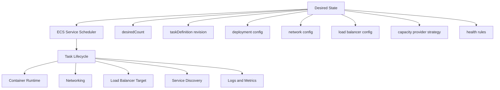
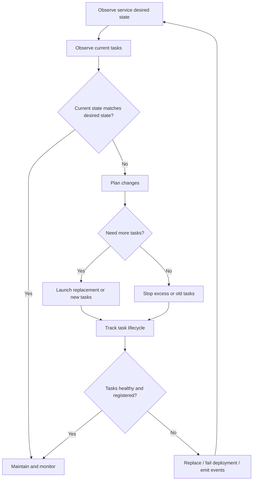
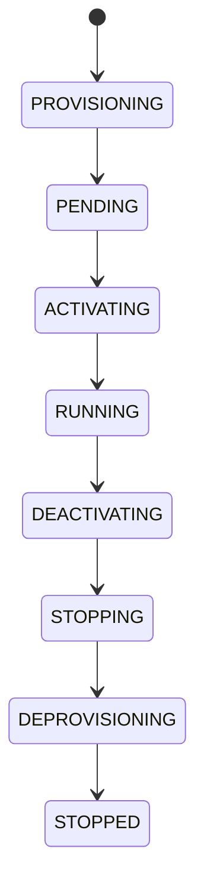
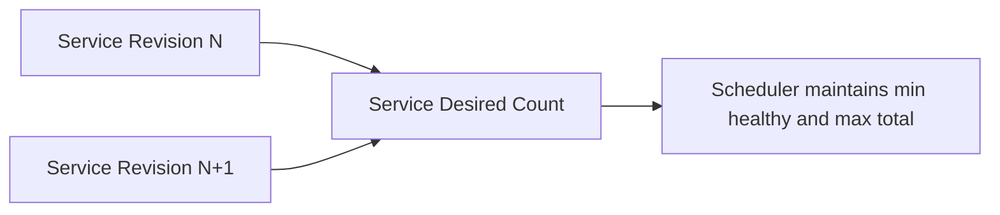
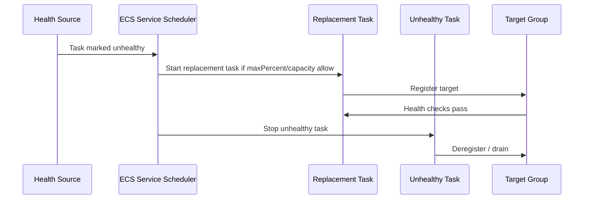
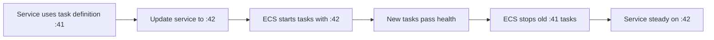
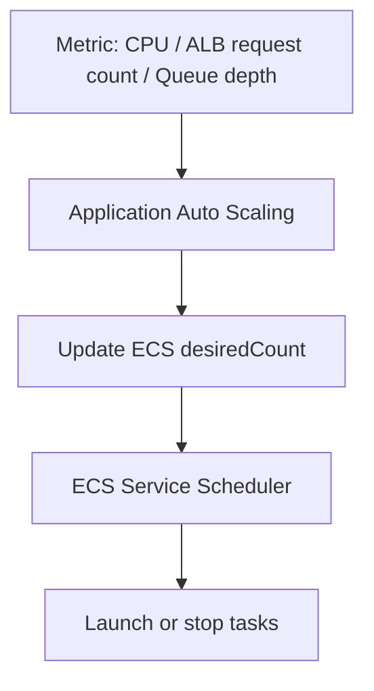

# Part 019 — ECS Service Scheduler and Desired State

ECS is easy to underestimate because the surface area looks small: cluster, task definition, service, desired count.

That simplicity is intentional. The real production behavior lives in the **scheduler loop**.

An ECS service is not just “run this image”. An ECS service is a control loop that continuously tries to make the actual task fleet match the service’s declared state:

```txt
actual running tasks ≈ desired count + task definition + deployment config + capacity + health rules
```

Once you understand that, ECS incidents become much easier to reason about. A stuck deployment is not random. It usually means the scheduler cannot satisfy one of the required invariants: capacity, networking, image pull, health, permissions, target group registration, service discovery, or deployment math.

The scheduler is the part of ECS that protects the service shape over time. It launches replacement tasks, stops unhealthy tasks, keeps the desired count, coordinates deployments, and respects limits such as `minimumHealthyPercent` and `maximumPercent`.

AWS describes an ECS service as a mechanism for running and maintaining a specified number of task instances from a task definition. When tasks fail or become unhealthy, the service scheduler launches replacements to maintain service operation.

## 1. The Mental Model

Think of an ECS service as three layers:



The key idea:

> ECS does not run “a container”. ECS reconciles a declared service shape into task instances.

That means you should not debug ECS from the image outward. Debug from the desired state inward.

Ask:

1. What did we declare?
2. What did ECS try to create?
3. Which lifecycle state did the task reach?
4. Which invariant failed?
5. Did ECS stop it because the service contract failed, or did the application exit by itself?

## 2. Desired State Is Not Only `desiredCount`

Many engineers think desired state means:

```txt
desiredCount = 4
```

That is incomplete.

For an ECS service, desired state includes:

| Dimension | Example | Why it matters |
|---|---|---|
| Service count | `desiredCount = 4` | Number of task replicas ECS tries to maintain. |
| Task definition | `order-api:72` | Runtime contract: image, CPU, memory, ports, env, secrets, roles. |
| Launch type / capacity provider | `FARGATE`, `FARGATE_SPOT`, EC2 provider | Determines where and how tasks can be placed. |
| Network configuration | subnets, security groups, public IP | Determines if tasks can pull images, reach dependencies, register with targets. |
| Load balancer binding | target group, container name, port | Determines external health and traffic eligibility. |
| Service discovery | Cloud Map / Service Connect | Determines east-west discovery and registration behavior. |
| Deployment config | min/max healthy, circuit breaker, alarms | Determines rollout batch size and rollback behavior. |
| Health rules | container health + target group health | Determines if tasks are considered service-valid. |
| Placement rules | AZ/subnet/capacity constraints | Determines where tasks can run. |
| Tags/propagation | service/task tagging | Determines audit, cost, and operational filtering. |

So a service is better modelled as:

```txt
ServiceDesiredState = {
  task_definition_revision,
  desired_count,
  networking,
  capacity_provider_strategy,
  deployment_configuration,
  load_balancer_binding,
  service_discovery_binding,
  health_contract,
  IAM_runtime_identity,
  placement_rules
}
```

The scheduler reconciles all of that, not just replica count.

## 3. The ECS Service Control Loop

At a high level, the scheduler loop looks like this:



This is reconciliation, similar in spirit to Kubernetes controllers, but with ECS-specific abstractions.

Important consequence:

> ECS service behavior is eventual. API updates may not be visible in every downstream observation immediately.

Do not build deployment automation that assumes `update-service` means the fleet is already stable. Treat the update API as a request to change desired state, not as completion.

## 4. Service Types: Replica vs Daemon

ECS services support two scheduler strategies:

| Scheduler strategy | Meaning | Common use |
|---|---|---|
| `REPLICA` | Run and maintain a desired number of tasks. | APIs, workers, consumers, web services. |
| `DAEMON` | Run one task on each selected EC2 container instance. | Agents, log collectors, node-level side workloads. |

For Fargate, `REPLICA` is the normal model. Fargate abstracts host placement, so daemon-style host-level workloads usually do not map cleanly.

Most production services should be `REPLICA`.

Use `DAEMON` only when the workload is logically tied to EC2 host lifecycle.

## 5. Task Lifecycle States

A task does not jump directly from “requested” to “serving traffic”. ECS has lifecycle states.



For production debugging, the most important states are:

| State | Meaning | Common failure class |
|---|---|---|
| `PROVISIONING` | ECS is preparing resources, such as ENI for `awsvpc`. | ENI/subnet/IP capacity, Fargate capacity, platform issue. |
| `PENDING` | ECS is waiting for placement or agent/runtime action. | Insufficient CPU/memory, capacity provider, EC2 instance resource pressure. |
| `ACTIVATING` | ECS pulls image, creates containers, configures networking, registers target/service discovery. | ECR access, secret access, image pull, port binding, target registration. |
| `RUNNING` | Task is running. | Application may still not be ready; target health matters. |
| `DEACTIVATING` | ECS is deregistering LB target/service discovery before stop. | Slow draining, deployment delay, target deregistration timeout. |
| `STOPPING` | Containers are being stopped. | Graceful shutdown, SIGTERM handling, long request draining. |
| `STOPPED` | Task has ended. | Check `stoppedReason`, exit code, stop code. |

A strong ECS engineer does not say “the task failed”. They say:

```txt
The task reached ACTIVATING, pulled the image, but failed during target registration.
```

or:

```txt
The task reached RUNNING, then became unhealthy from target group health check and was replaced by the service scheduler.
```

That is the difference between guessing and operating.

## 6. The Service Scheduler’s Core Invariants

The scheduler is constantly trying to preserve several invariants.

### Invariant 1 — Desired Count

For a `REPLICA` service:

```txt
healthy service-valid task count should converge toward desiredCount
```

If `desiredCount = 6`, ECS tries to keep six tasks active according to the service contract.

But during deployment or replacement, the number of actual tasks may temporarily be above or below six depending on:

- `minimumHealthyPercent`
- `maximumPercent`
- capacity availability
- task health
- target group registration
- deregistration delay
- deployment configuration

### Invariant 2 — Health Validity

A task is not always service-valid just because the process is running.

For an ECS service with a load balancer, a task must typically satisfy multiple conditions:

```txt
container started
+ essential container alive
+ container health check healthy, if configured
+ target group health check healthy
+ grace period not hiding failure anymore
+ service discovery / target registration complete
```

A task can be `RUNNING` but not useful.

### Invariant 3 — Deployment Availability

During replacement, ECS tries to avoid dropping below the configured minimum number of healthy tasks.

The lower bound is calculated from:

```txt
ceil(desiredCount * minimumHealthyPercent / 100)
```

The upper bound is calculated from:

```txt
floor(desiredCount * maximumPercent / 100)
```

Example:

```txt
desiredCount = 10
minimumHealthyPercent = 100
maximumPercent = 200

minimum healthy = 10
maximum running/pending/stopping = 20
```

This allows ECS to start up to ten replacement tasks before stopping old ones, assuming capacity exists.

### Invariant 4 — Capacity Compatibility

A service can declare valid desired state that cannot be placed.

Common examples:

- CPU/memory combination unsupported for Fargate.
- Subnets out of free IP addresses.
- Security group rules block needed bootstrap calls.
- Capacity provider has no available EC2 capacity.
- Placement constraints exclude all instances.
- Architecture mismatch: ARM image on x86 runtime or vice versa.
- Platform version incompatibility.

In this case, the scheduler is not “broken”. It cannot satisfy the contract you declared.

### Invariant 5 — Deployment Revision Separation

During rolling deployment, source revision and target revision coexist.



This matters because failures in the new revision should not automatically destroy the stable old revision if rollback is configured properly.

## 7. Health Sources: Container vs Load Balancer

ECS can derive health from more than one place.

| Health source | What it sees | What it cannot see |
|---|---|---|
| Essential container exit | Process died. | Whether the service is actually ready. |
| Container health check | Command inside container succeeds/fails. | External reachability through ALB/NLB path. |
| ALB target health | Load balancer can call health endpoint. | Internal worker-only health or dependencies not checked. |
| Service discovery registration | Task can be registered/discovered. | Whether the app is semantically correct. |

Bad production design usually comes from mixing these concerns.

Example of weak health:

```http
GET /health
200 OK
```

Even if:

- database connection pool is exhausted,
- required config is missing,
- migration has not completed,
- downstream is permanently unavailable,
- worker thread pool is dead.

Better health model:

| Endpoint | Purpose | Should include dependency checks? |
|---|---|---|
| `/live` | Is the process alive? | Usually no. |
| `/ready` | Should traffic be sent here? | Only critical local dependencies. |
| `/startup` | Has initialization completed? | Yes, startup-critical checks. |
| `/diag` | Deep diagnosis. | Yes, but not used by ALB directly. |

For ECS + ALB, the target group health check should normally hit readiness, not liveness.

## 8. `minimumHealthyPercent` and `maximumPercent`

These two fields control deployment batch math.

### `minimumHealthyPercent`

This is the lower bound of tasks that must remain healthy during deployment.

If the value is too high:

- availability is protected,
- but deployments require extra capacity,
- bad new tasks may stall the deployment,
- services with no spare capacity may not roll.

If the value is too low:

- deployments can happen with less extra capacity,
- but availability may drop,
- small services may experience full outage.

### `maximumPercent`

This is the upper bound of tasks allowed during deployment.

If the value is high:

- ECS can launch replacements before stopping old tasks,
- rollouts are safer,
- but require extra capacity/IPs/cost.

If the value is low:

- deployment uses less headroom,
- but may need to stop old tasks before starting new ones,
- risk increases if new tasks fail.

### Example: Desired Count 4

| `minimumHealthyPercent` | `maximumPercent` | Behavior |
|---:|---:|---|
| 100 | 200 | Can run up to 8 tasks; safest if capacity exists. |
| 100 | 125 | Can run up to 5 tasks; replaces roughly one at a time. |
| 50 | 100 | Can stop up to 2 old tasks before starting replacement; risky for APIs. |
| 0 | 100 | Can temporarily stop all tasks; usually bad for user-facing services. |

For production APIs, a common starting point is:

```yaml
minimumHealthyPercent: 100
maximumPercent: 200
```

Then tune based on:

- task startup latency,
- subnet IP capacity,
- target group health time,
- cost tolerance,
- deployment blast radius,
- traffic volume,
- desired count.

## 9. Desired Count for Small Services

Small services behave differently.

A service with `desiredCount = 1` is fragile. Deployment math gets awkward:

```txt
desiredCount = 1
minimumHealthyPercent = 100
maximumPercent = 200

minimum healthy = 1
maximum total = 2
```

This allows ECS to start a new task before stopping the old one. That is good, but only if capacity and target group health succeed.

If `maximumPercent = 100`, then ECS cannot run a second task, so it may need to stop the existing task before replacement. That creates downtime.

For user-facing production APIs, `desiredCount = 1` is usually not production-grade unless the business explicitly accepts downtime and reduced availability.

A better minimum is often:

```txt
desiredCount >= number of active AZs
```

For a 2-AZ service:

```txt
desiredCount = 2 or more
```

For a 3-AZ service:

```txt
desiredCount = 3 or more
```

This is not just about capacity. It is about replacement behavior, AZ impairment tolerance, and deployment safety.

## 10. Scheduler Replacement of Unhealthy Tasks

When a service task becomes unhealthy, ECS tries to replace it.

The replacement process usually looks like this:



This replacement ordering matters.

If `maximumPercent` and capacity allow, ECS can start replacement first. If not, it may need to stop unhealthy tasks first to free capacity.

This is why capacity headroom is a reliability feature, not only a cost issue.

## 11. Load Balancer Health Grace Period

When a service starts a task behind a load balancer, the target may need time before it becomes healthy.

The app may need to:

- start the JVM,
- warm class metadata,
- initialize Spring context,
- load config,
- connect to database,
- warm caches,
- start HTTP server,
- expose readiness endpoint.

If ALB health checks begin judging the task too early, ECS may kill it repeatedly.

`healthCheckGracePeriodSeconds` tells ECS to ignore unhealthy load balancer checks for a period after task startup.

A reasonable value is not a random large number. It should be based on measured startup distribution:

```txt
health check grace period ≈ P99 startup time + safety margin
```

For example:

```txt
P99 startup = 42s
grace period = 60s
```

Do not set it to 30 minutes to hide broken startup. That turns fast failure into slow deployment pain.

## 12. Placement: Fargate vs ECS on EC2

The scheduler must place tasks somewhere.

For Fargate:

```txt
placement = choose compatible serverless capacity + attach networking + start runtime
```

For ECS on EC2:

```txt
placement = choose container instance matching CPU/memory/ports/attributes/constraints
```

### Fargate Placement Failure Modes

Common causes:

- Unsupported CPU/memory combination.
- Subnet lacks free IPs.
- Fargate capacity issue in selected AZ.
- Security group blocks bootstrap path indirectly.
- Image architecture mismatch.
- Platform version issue.

### EC2 Placement Failure Modes

Common causes:

- No instance has enough CPU/memory.
- Host port conflict.
- Placement constraint excludes all instances.
- Wrong instance attributes.
- Container agent disconnected.
- EC2 capacity provider scaling lag.
- Draining instances reduce effective capacity.

## 13. Capacity Provider Strategy

Capacity providers are a way to express where tasks should run.

Example:

```json
{
  "capacityProviderStrategy": [
    { "capacityProvider": "FARGATE", "weight": 1 },
    { "capacityProvider": "FARGATE_SPOT", "weight": 2 }
  ]
}
```

This says:

```txt
Prefer two shares of Fargate Spot for every one share of regular Fargate.
```

Production caution:

Fargate Spot is not a deployment strategy. It is an interruption-prone capacity class. It should be used only when the workload can tolerate interruption.

Good candidates:

- async workers,
- batch jobs,
- idempotent consumers,
- low-priority processing,
- horizontally redundant services with enough regular capacity.

Weak candidates:

- single-replica API,
- latency-critical control plane,
- stateful singleton,
- non-idempotent processor,
- service without graceful interruption handling.

## 14. Steady State

A service is steady when ECS has converged.

For a load-balanced API, steady state usually means:

```txt
running tasks == desired count
+ primary deployment completed
+ no old deployment draining
+ all required targets healthy
+ no deployment rollback in progress
+ no repeated task replacement
```

Do not confuse “tasks are RUNNING” with steady state.

A service can have all tasks in `RUNNING` but still not be steady because:

- target health is failing,
- old tasks are draining,
- deployment has not completed,
- circuit breaker is evaluating,
- CloudWatch alarm is pending,
- tasks restart repeatedly after brief running periods.

## 15. Deployment Is Scheduler-Driven Replacement

When you update a service task definition from revision 41 to revision 42, ECS does not mutate running containers.

It creates new tasks and stops old tasks according to deployment configuration.



This replacement model gives you rollback capability, but only if the old revision remains healthy long enough and the scheduler can distinguish good from bad.

## 16. The Hidden Cost of Bad Readiness

Bad readiness checks cause the scheduler to make bad decisions.

### False Positive Readiness

The target becomes healthy before the app can safely serve traffic.

Result:

- traffic routed too early,
- user-facing errors,
- deployment appears successful,
- rollback does not trigger,
- incident becomes application-level.

### False Negative Readiness

The app is healthy but the health check fails.

Result:

- ECS kills good tasks,
- deployment stuck,
- replacement loop,
- capacity churn,
- false incident.

### Strong Readiness Contract

For Java API services, readiness should usually check:

- HTTP server accepting requests,
- main dependency pool initialized,
- required config loaded,
- migrations compatibility checked,
- app not in shutdown mode,
- no fatal background initialization failure.

It should usually avoid checking optional downstream dependencies unless serving traffic without them is unsafe.

## 17. The Scheduler Does Not Understand Business Correctness

ECS can know that:

- the process started,
- the health command passed,
- the ALB health endpoint returned success,
- the task is registered,
- the container did not exit.

ECS cannot know that:

- your authorization model is wrong,
- a migration broke a query,
- Kafka offset handling duplicates payments,
- a feature flag corrupts case state,
- downstream semantics changed.

That is why deployment safety needs both infrastructure health and application correctness signals.

Good production deployment uses:

```txt
ECS health checks
+ ALB target health
+ CloudWatch alarms
+ synthetic checks
+ business KPI alarms
+ error budget alarms
+ rollback automation
```

## 18. Event Timeline Debugging

When ECS deployment fails, build a timeline.

Do not jump directly to logs.

Start with service events:

```bash
aws ecs describe-services \
  --cluster prod-cluster \
  --services order-api \
  --query 'services[0].events[0:20]'
```

Then inspect deployments:

```bash
aws ecs describe-services \
  --cluster prod-cluster \
  --services order-api \
  --query 'services[0].deployments'
```

Then inspect stopped tasks:

```bash
aws ecs list-tasks \
  --cluster prod-cluster \
  --service-name order-api \
  --desired-status STOPPED
```

Then describe a task:

```bash
aws ecs describe-tasks \
  --cluster prod-cluster \
  --tasks arn:aws:ecs:region:acct:task/prod-cluster/task-id
```

Look for:

- `lastStatus`
- `desiredStatus`
- `stopCode`
- `stoppedReason`
- container exit code
- reason per container
- pull failure
- secret failure
- resource failure
- essential container exit

Only then read application logs.

## 19. Common Scheduler Incidents

### Incident 1 — Deployment Stuck in Progress

Symptoms:

- New task starts but never becomes healthy.
- Old tasks remain running.
- Deployment never completes.

Likely causes:

- ALB health check path wrong.
- App readiness too slow.
- security group blocks ALB to task.
- target group configured wrong port.
- container starts but app binds wrong interface or port.
- health check grace period too short.

Debug path:

```txt
Service events → target group health reason → task logs → network config → port mapping
```

### Incident 2 — Task Stops Immediately

Symptoms:

- Task reaches `RUNNING`, then `STOPPED` quickly.
- Service launches replacements repeatedly.

Likely causes:

- app process exits,
- missing required env var,
- secret injection failure,
- bad command/entrypoint,
- JVM OOM,
- migration failure,
- essential sidecar exits.

Debug path:

```txt
Stopped reason → container reason → exit code → application logs → config/secrets
```

### Incident 3 — Tasks Pending Forever

Symptoms:

- Deployment creates tasks that stay in `PENDING` or `PROVISIONING`.

Likely causes:

- no capacity,
- subnet IP exhaustion,
- unsupported Fargate shape,
- EC2 instance resource shortage,
- placement constraint too strict,
- capacity provider scaling lag.

Debug path:

```txt
Task status → service events → capacity provider → subnet free IP → CPU/memory request
```

### Incident 4 — New Tasks Healthy but Traffic Still Failing

Symptoms:

- Target group says healthy.
- Deployment completes.
- Users receive errors.

Likely causes:

- health check too shallow,
- route-specific bug,
- dependency path not covered,
- schema compatibility issue,
- feature flag mistake,
- traffic split sends to incompatible version.

Debug path:

```txt
ALB logs → app logs → route metrics → synthetic checks → business metrics
```

### Incident 5 — Scheduler Kills Healthy-Looking Tasks

Symptoms:

- App logs look healthy.
- ECS marks task unhealthy.
- Replacements loop.

Likely causes:

- container health command failing,
- health endpoint returns non-2xx,
- ALB matcher mismatch,
- response timeout,
- high startup CPU causing slow health response,
- health endpoint depends on flaky downstream.

Debug path:

```txt
Health source → matcher/status code → timeout → endpoint logic → task CPU/memory
```

## 20. Deployment Math Examples

### Example A — Safe API Rollout

```yaml
desiredCount: 6
minimumHealthyPercent: 100
maximumPercent: 200
healthCheckGracePeriodSeconds: 60
```

Behavior:

- ECS may run up to 12 tasks during deployment.
- Old tasks remain until new tasks are healthy.
- Requires capacity/IP headroom.
- Good default for important APIs.

### Example B — Capacity-Constrained Rollout

```yaml
desiredCount: 6
minimumHealthyPercent: 50
maximumPercent: 100
```

Behavior:

- ECS may stop old tasks before starting new ones.
- Lower capacity requirement.
- Higher availability risk.
- Not ideal for user-facing services unless acceptable.

### Example C — Single-Replica Internal Tool

```yaml
desiredCount: 1
minimumHealthyPercent: 100
maximumPercent: 200
```

Behavior:

- ECS can start new task before stopping old one.
- Still vulnerable to AZ/subnet/capacity issues.
- Acceptable for low-criticality internal services.

### Example D — Queue Worker

```yaml
desiredCount: 20
minimumHealthyPercent: 50
maximumPercent: 150
```

Behavior:

- Temporary worker capacity reduction may be acceptable.
- Queue absorbs reduced throughput.
- Idempotency and visibility timeout matter more than user-facing zero-downtime.

## 21. Queue Worker Scheduling Semantics

For ECS workers, desired state is not just availability. It is throughput.

An API service asks:

```txt
Can I serve traffic now?
```

A worker service asks:

```txt
Can I safely process messages at the target rate?
```

For workers, scaling and scheduling should be tied to:

- queue depth,
- age of oldest message,
- processing latency,
- failure rate,
- downstream capacity,
- DLQ rate,
- idempotency guarantees.

A worker task should shut down gracefully:

```txt
on SIGTERM:
  stop polling new messages
  finish current message if time budget allows
  checkpoint or release message safely
  close connections
  exit 0
```

Do not let ECS stop a worker while it is halfway through a non-idempotent side effect.

## 22. ECS Desired State and Databases

ECS can replace stateless application tasks easily. It cannot make your database migration safe.

During rolling deployment, old and new code versions may run together.

Therefore database changes must be compatible with mixed versions.

Safe sequence:

```txt
1. Expand schema: add nullable column/table/index.
2. Deploy app version that writes both or tolerates both.
3. Backfill safely.
4. Switch reads.
5. Remove old schema later.
```

Unsafe sequence:

```txt
1. Drop old column.
2. Deploy new app.
3. Old task still running queries old column.
4. Runtime failure.
```

The ECS scheduler preserves task availability. It does not preserve data compatibility.

## 23. Desired State and Service Discovery

If service discovery is enabled, task lifecycle includes registration and deregistration.

This creates timing windows:

```txt
new task running but not discoverable yet
old task stopped but DNS client cache still points to it
task unhealthy but DNS record not expired at client
```

Do not rely on DNS alone for correctness.

Client should have:

- connection timeout,
- request timeout,
- retry with jitter,
- circuit breaker,
- DNS refresh behavior,
- stale endpoint handling.

Service discovery gives you names. It does not give you perfect traffic control.

## 24. Desired State and Multi-AZ

For multi-AZ services, desired count must be considered with placement.

If `desiredCount = 2` across three AZs, one AZ will have no replica.

For user-facing HA:

```txt
desiredCount >= active AZ count
```

Then use load balancing across AZs and confirm the scheduler can place tasks in each subnet.

Watch for:

- subnet IP imbalance,
- AZ-specific Fargate capacity issue,
- target group cross-zone behavior,
- NAT gateway per-AZ design,
- database endpoint locality,
- uneven traffic distribution.

## 25. Service Scheduler vs Auto Scaling

The ECS service scheduler maintains desired count.

Application Auto Scaling changes desired count.



So there are two loops:

1. Scaling loop decides desired count.
2. Scheduler loop makes actual tasks match desired count.

If scaling is wrong, the scheduler may faithfully maintain the wrong number of tasks.

## 26. The Right Debugging Order

Use this order for ECS service incidents:

```txt
1. Service desired state
2. Deployment state
3. Service events
4. Task lifecycle state
5. Stopped task reason
6. Target group health
7. Capacity provider / subnet / placement
8. Application logs
9. Metrics and traces
10. Recent changes
```

Most teams start at step 8. That wastes time.

## 27. Production Checklist

For every ECS service, verify:

- [ ] Desired count matches availability requirement.
- [ ] `minimumHealthyPercent` and `maximumPercent` are intentionally chosen.
- [ ] Health check path represents readiness, not merely process liveness.
- [ ] Health check grace period is based on measured startup time.
- [ ] Container listens on the expected port and interface.
- [ ] Security groups allow ALB/NLB to task traffic.
- [ ] Subnets have enough IP headroom for deployment surge.
- [ ] NAT/VPC endpoints support image pull, logs, secrets, and AWS APIs.
- [ ] Task role and execution role are separated.
- [ ] Application handles SIGTERM.
- [ ] Worker tasks stop polling before shutdown.
- [ ] Deployment circuit breaker or alarms are configured.
- [ ] Rollback path is tested.
- [ ] Database migration is backward compatible.
- [ ] Service events are monitored.
- [ ] Stopped task reasons are captured before they age out of easy visibility.

## 28. Design Review Questions

Ask these in architecture review:

1. What is the desired count and why?
2. What happens if one AZ cannot place tasks?
3. Can a new task become healthy before it is actually ready?
4. Can an unhealthy old task be replaced before being stopped?
5. What is the maximum number of tasks during deployment?
6. Is there subnet IP capacity for that maximum?
7. How long does startup take at P50, P95, and P99?
8. What does SIGTERM do?
9. Is the service still correct while old and new versions run together?
10. Which metric tells us the deployment is semantically bad even if ECS health is green?

## 29. Key Takeaways

The ECS service scheduler is a reconciliation engine.

The strongest mental model is:

```txt
ECS service = desired runtime contract + scheduler control loop + health-driven replacement
```

Do not think of ECS deployment as replacing containers. Think of it as controlled convergence from one service revision to another.

Operational excellence comes from making the scheduler’s job easy:

- accurate task definitions,
- enough capacity headroom,
- correct health checks,
- graceful shutdown,
- compatible migrations,
- useful alarms,
- explicit rollback path.

If those are weak, ECS will still do exactly what you asked. The problem is that what you asked was not what production needed.

## References

- Amazon ECS services: https://docs.aws.amazon.com/AmazonECS/latest/developerguide/ecs_services.html
- Amazon ECS task lifecycle: https://docs.aws.amazon.com/AmazonECS/latest/developerguide/task-lifecycle-explanation.html
- Amazon ECS deployment type — rolling replacement: https://docs.aws.amazon.com/AmazonECS/latest/developerguide/deployment-type-ecs.html
- Amazon ECS service definition parameters: https://docs.aws.amazon.com/AmazonECS/latest/developerguide/service_definition_parameters.html
- Amazon ECS service update parameters: https://docs.aws.amazon.com/AmazonECS/latest/developerguide/update-service-parameters.html
- Amazon ECS stopped task errors: https://docs.aws.amazon.com/AmazonECS/latest/developerguide/stopped-task-errors.html
