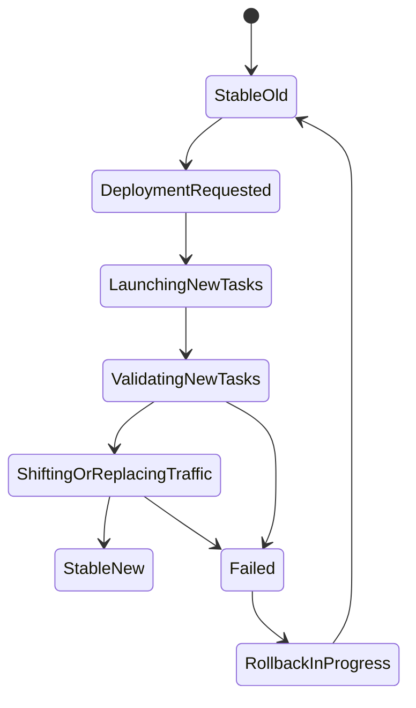
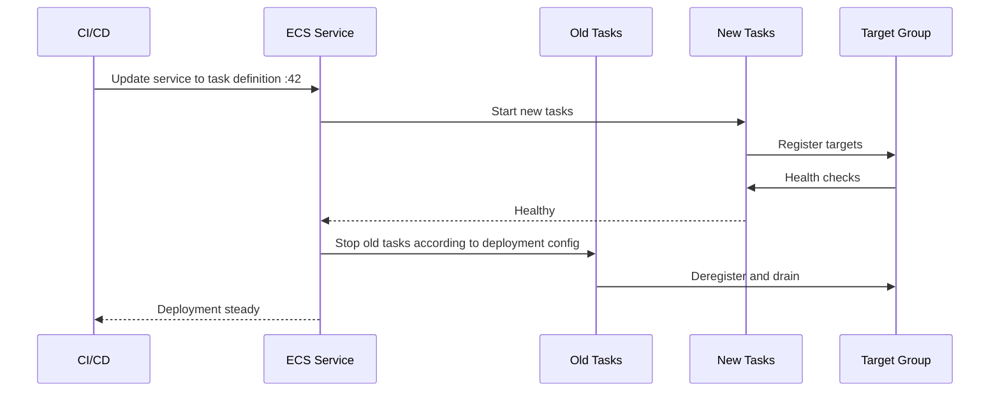
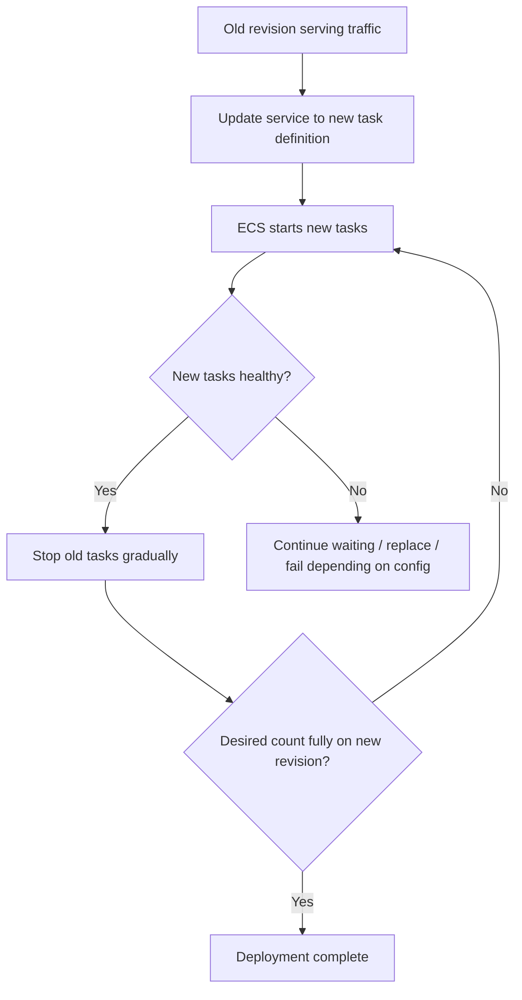
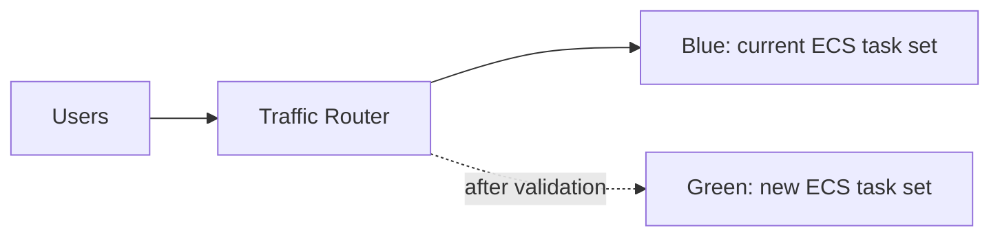
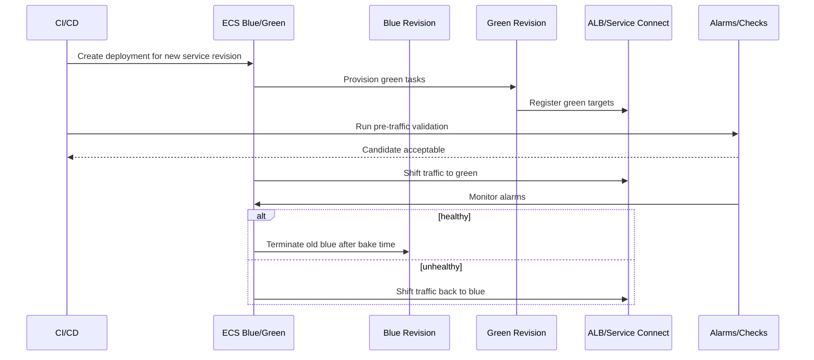
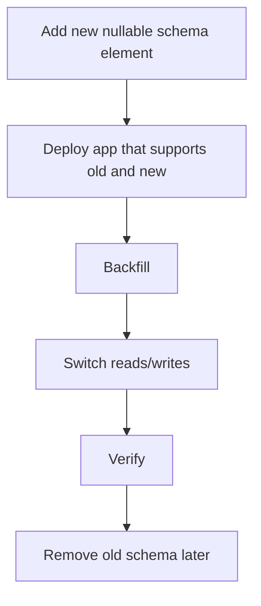
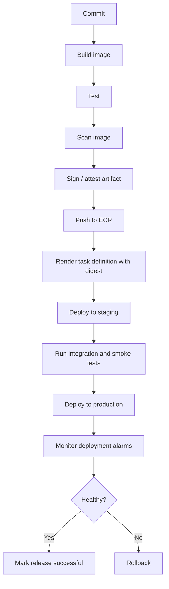
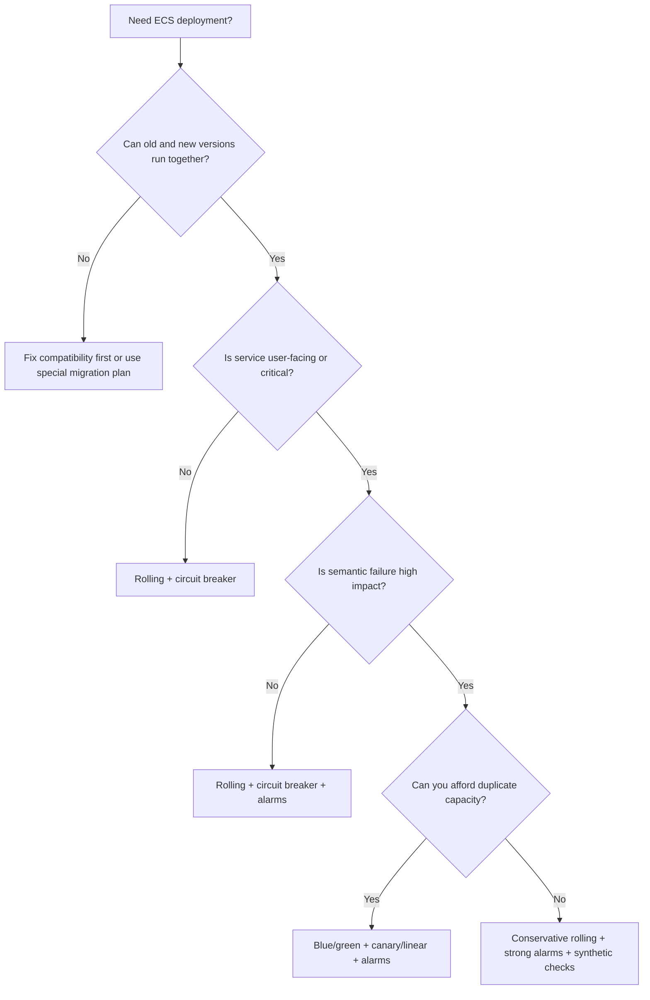

# Part 020 — ECS Deployment Strategies

A deployment strategy is not a button in the console.

It is a controlled state transition from one production reality to another.

For ECS, a deployment changes one or more parts of the service contract:

- task definition revision,
- container image digest,
- environment variables,
- secrets references,
- CPU/memory,
- port mapping,
- platform version,
- networking,
- load balancer binding,
- service discovery,
- deployment configuration.

A production-grade deployment strategy answers four questions:

```txt
1. How do we introduce the new revision?
2. How do we decide it is safe?
3. How do we limit blast radius if it is bad?
4. How do we return to the previous known-good state?
```

Without those answers, a deployment is just mutation with hope.

## 1. ECS Deployment Strategy Map

ECS services primarily use these release patterns:

| Strategy | ECS mechanism | Best for | Main trade-off |
|---|---|---|---|
| Rolling replacement | ECS rolling deployment | Most stateless services | Simpler, but old/new versions overlap. |
| Rolling + circuit breaker | ECS rolling deployment + circuit breaker | Detecting tasks that cannot reach steady state | Catches infrastructure/startup health failures, not all business bugs. |
| Rolling + CloudWatch alarms | ECS rolling deployment + alarms | Rolling back on app/infra metrics | Requires high-quality alarms. |
| Blue/green | ECS blue/green / CodeDeploy-style traffic shifting | Higher safety, pre-traffic validation, controlled cutover | More moving parts and more capacity. |
| Canary/linear traffic shift | Blue/green traffic routing | Risk-limited rollout | Requires observability and rollback discipline. |
| Manual one-off replacement | `force-new-deployment`, desired count changes | Emergency refresh, rotated secrets, platform refresh | Easy to misuse if not tied to evidence. |

AWS ECS supports rolling deployments that replace tasks, deployment circuit breaker/CloudWatch alarm failure detection with rollback, and blue/green deployment flows where a new environment is validated before production traffic is shifted.

## 2. Deployment as State Transition

Deployment is easiest to understand as a state machine.



A good deployment strategy defines:

- entry criteria,
- validation criteria,
- timeout criteria,
- rollback criteria,
- evidence produced,
- human override path.

## 3. What Actually Changes During an ECS Deployment

When you deploy a new task definition revision, ECS does not patch running containers.

It creates tasks from the new revision and terminates tasks from the old revision according to service deployment settings.



Key insight:

> The deployment is successful only if the new service revision can satisfy the service health contract.

If your health contract is weak, ECS may call a bad deployment successful.

## 4. Rolling Deployment

Rolling deployment is the default mental model for ECS services.

ECS gradually replaces old tasks with new tasks while respecting:

- `minimumHealthyPercent`,
- `maximumPercent`,
- desired count,
- capacity availability,
- task health,
- load balancer target health,
- service discovery/Service Connect registration,
- deployment circuit breaker/alarm settings if configured.

### Rolling Deployment Flow



### Strengths

Rolling deployment is good because:

- operational model is simple,
- no duplicate full environment required in many cases,
- works well for horizontally scalable stateless services,
- integrates naturally with ECS service scheduler,
- can be safe with good health checks and alarms.

### Weaknesses

Rolling deployment has traps:

- old and new versions run together,
- traffic may hit both versions,
- database schema must be backward/forward compatible,
- partial deployment may expose mixed behavior,
- shallow health checks miss semantic bugs,
- rollback may not undo data changes.

## 5. Rolling Deployment Math

The two most important fields are:

```yaml
minimumHealthyPercent: 100
maximumPercent: 200
```

For `desiredCount = 8`:

```txt
minimum healthy = ceil(8 * 100 / 100) = 8
maximum tasks   = floor(8 * 200 / 100) = 16
```

This lets ECS launch up to eight new tasks before stopping old tasks.

For `desiredCount = 8`, `minimumHealthyPercent = 50`, `maximumPercent = 100`:

```txt
minimum healthy = 4
maximum tasks   = 8
```

This means ECS may stop old tasks before starting new tasks to stay within max count. That lowers capacity need but increases risk.

### Production Heuristic

For important APIs:

```yaml
minimumHealthyPercent: 100
maximumPercent: 200
```

For async workers where queue buffering is acceptable:

```yaml
minimumHealthyPercent: 50
maximumPercent: 150
```

For extremely capacity-constrained environments:

```yaml
minimumHealthyPercent: 50
maximumPercent: 100
```

But this should be a conscious risk decision, not a default.

## 6. Deployment Circuit Breaker

The ECS deployment circuit breaker exists to stop deployments that cannot reach steady state.

Conceptually:

```txt
if new deployment repeatedly fails to launch healthy tasks:
    mark deployment failed
    optionally rollback to last completed deployment
```

AWS documents that deployment circuit breaker applies to services using the rolling update deployment type and can roll back to the last successfully completed deployment.

### Configuration Shape

Example CloudFormation-style configuration:

```yaml
DeploymentConfiguration:
  DeploymentCircuitBreaker:
    Enable: true
    Rollback: true
  MinimumHealthyPercent: 100
  MaximumPercent: 200
```

Example ECS API-style shape:

```json
{
  "deploymentConfiguration": {
    "deploymentCircuitBreaker": {
      "enable": true,
      "rollback": true
    },
    "minimumHealthyPercent": 100,
    "maximumPercent": 200
  }
}
```

### What It Catches Well

Circuit breaker is strong at detecting:

- image pull failure,
- container exits during startup,
- failing container health checks,
- failing target group health checks,
- task cannot reach steady state,
- wrong port/health path,
- bad environment configuration that prevents startup.

### What It Does Not Catch Reliably

Circuit breaker does not prove:

- business logic is correct,
- every route works,
- latency is acceptable,
- downstream writes are semantically valid,
- authorization is correct,
- event processing is idempotent,
- database migration is safe.

Circuit breaker is necessary but not sufficient.

## 7. CloudWatch Alarm-Based Rollback

ECS deployments can use CloudWatch alarms as failure detection signals.

This lets you roll back not only when tasks fail to start, but also when production metrics degrade.

Good alarm candidates:

| Metric | Why it matters |
|---|---|
| 5xx rate | Detects user-visible server errors. |
| Target response time p95/p99 | Detects latency regression. |
| ALB target 5xx | Distinguishes target errors from LB errors. |
| JVM memory pressure | Detects heap/metaspace leak. |
| Task restarts/stopped task count | Detects crash loop. |
| Queue age | Detects worker throughput collapse. |
| DLQ message count | Detects processing failure. |
| Business invariant metric | Detects semantic failure. |

Weak alarms:

- CPU > 80% for 1 datapoint,
- any single transient 5xx,
- latency average,
- log keyword matching without context,
- alarm too slow to protect rollout.

### Alarm Design Rule

A rollback alarm should be:

```txt
fast enough to prevent blast radius
+ specific enough to avoid false rollback
+ meaningful enough to catch actual user/business harm
```

If the alarm is noisy, people will disable rollback. If it is too slow, rollback happens after the incident is already large.

## 8. Blue/Green Deployment

Blue/green deployment runs two production-like environments:

- **blue**: current stable revision,
- **green**: candidate new revision.

Traffic shifts from blue to green after validation.



AWS ECS blue/green deployments allow validating new service revisions before directing production traffic to them, reducing risk and enabling quicker rollback.

### Blue/Green Flow



### Strengths

Blue/green is useful when:

- you need pre-traffic validation,
- rollback must be fast,
- deployments are high-risk,
- startup is slow,
- schema changes are carefully staged,
- operational governance requires evidence,
- you want traffic shifting instead of task-by-task replacement.

### Weaknesses

Blue/green costs more operationally:

- duplicate task capacity during deployment,
- more target groups/listener rules or Service Connect routing,
- more CI/CD complexity,
- more IAM permissions,
- more rollback paths to test,
- more observability requirements.

Do not choose blue/green because it sounds mature. Choose it because its safety properties solve a real risk.

## 9. Canary and Linear Traffic Shifting

With traffic-shift deployments, you can expose the new revision gradually.

Common patterns:

| Pattern | Example | Good for |
|---|---|---|
| All-at-once | 100% traffic to green | Low-risk internal services. |
| Canary | 10% for 5 minutes, then 100% | Risk-limited validation. |
| Linear | +10% every 5 minutes | Gradual exposure and monitoring. |

Canary is not magic. It only helps if:

- the canary receives representative traffic,
- metrics are segmented by revision,
- alarms fire quickly,
- rollback is automated or fast,
- side effects are safe,
- database changes are compatible.

### Canary Trap

A 5% canary may not exercise:

- low-frequency endpoints,
- tenant-specific logic,
- rare regulatory workflows,
- large payload cases,
- background jobs,
- scheduled operations,
- integrations used by only one customer segment.

For complex systems, canary should be combined with synthetic and scenario tests.

## 10. Deployment Strategy Decision Matrix

| Situation | Recommended strategy | Reason |
|---|---|---|
| Stateless internal API, low criticality | Rolling + circuit breaker | Simple and sufficient. |
| User-facing API with meaningful traffic | Rolling + circuit breaker + alarms | Balance simplicity and safety. |
| High-risk release or critical API | Blue/green + canary/linear + alarms | Limits blast radius and enables fast rollback. |
| Worker service with queue buffering | Rolling with tuned min/max | Temporary capacity reduction may be acceptable. |
| Batch-like ECS task | Versioned task definition + orchestrated run | No long-lived traffic cutover needed. |
| Regulatory workflow service | Blue/green or rolling with strong scenario validation | Semantic correctness matters more than process health. |
| Service with incompatible DB migration | Do not deploy yet | Fix migration strategy first. |
| Single-replica API | Increase replicas before deployment | Deployment strategy cannot compensate for no redundancy. |

## 11. Deployment and Database Compatibility

The most dangerous deployment failures are not task failures. They are compatibility failures.

During rolling deployment, old and new tasks run concurrently.

Therefore, database schema and event contracts must be compatible across versions.

### Safe Expand/Contract Pattern



### Unsafe Pattern

```txt
1. Drop column used by old code.
2. Deploy new task definition.
3. Old tasks still serve traffic during rollout.
4. Old tasks fail.
5. Rollback cannot restore dropped data.
```

Rollback is not time travel. It only returns code/config. It does not undo external side effects unless you designed compensation.

## 12. Deployment and Event Compatibility

For event-driven systems, deployment affects more than HTTP traffic.

Old and new versions may produce/consume different event shapes.

Safe event evolution rules:

- add optional fields, do not remove required fields abruptly,
- tolerate unknown fields,
- version semantic meaning explicitly,
- avoid changing enum behavior silently,
- support old and new consumers during migration,
- keep replay compatibility,
- validate schema before deploy,
- maintain idempotency across versions.

A deployment can be infrastructure-green and event-semantics-red.

## 13. Rollback Is a Product Feature

A rollback path must be designed, not improvised.

A rollback-capable ECS service has:

- previous task definition revision preserved,
- previous image digest still available in ECR,
- old config/secrets still valid,
- database still compatible with old code,
- event contracts backward compatible,
- alarms that identify bad deployment quickly,
- humans who know when rollback is safe,
- audit record of rollback reason.

### Rollback Failure Cases

Rollback may fail if:

- old image was deleted by lifecycle policy,
- old secret version was removed,
- DB migration was destructive,
- event producer emitted irreversible events,
- old code cannot parse new data,
- IAM policy changed globally,
- target group/listener config was mutated incompatibly,
- capacity is no longer available.

A top engineer asks before deploy:

```txt
If this goes wrong, can we return safely in under five minutes?
```

If the answer is no, the deployment needs stronger controls.

## 14. `force-new-deployment`

`force-new-deployment` tells ECS to start a new deployment even if the task definition did not change.

Common uses:

- refresh tasks after secret rotation,
- recycle tasks after base infrastructure change,
- pull same tag again when not using digest discipline,
- restart tasks to recover from known bad runtime state,
- move tasks onto refreshed Fargate platform or EC2 fleet.

Production caution:

If you rely on mutable tags and `force-new-deployment`, you have weak artifact traceability.

Better:

```txt
immutable image digest → new task definition revision → normal deployment
```

`force-new-deployment` is operationally useful, but it should not replace a real release model.

## 15. Safe Deployment Pipeline

A production ECS deployment pipeline should look like this:



Important details:

- deploy by digest, not mutable tag,
- record task definition revision,
- attach release ID to logs/traces/metrics,
- validate health before traffic,
- monitor after traffic,
- keep rollback artifacts available.

## 16. Version Attribution

During deployment, you must be able to answer:

```txt
Which request was served by which revision?
```

Add these labels to logs and metrics:

- service name,
- environment,
- release ID,
- git SHA,
- image digest,
- task definition revision,
- ECS cluster,
- ECS service,
- task ARN,
- AZ.

In Java, expose build info:

```json
{
  "service": "order-api",
  "version": "2026.07.06.1320",
  "gitSha": "abc1234",
  "imageDigest": "sha256:...",
  "taskDefinition": "order-api:42"
}
```

This makes canary analysis possible.

Without version attribution, deployment debugging becomes guesswork.

## 17. Deployment Alarms: Infrastructure vs Application vs Business

Use layered alarms.

### Infrastructure Alarms

- task stopped count,
- deployment failed,
- unhealthy target count,
- CPU/memory saturation,
- target connection errors.

### Application Alarms

- route-level 5xx,
- p95/p99 latency,
- exception rate,
- dependency timeout rate,
- thread pool exhaustion,
- database connection pool exhaustion.

### Business Alarms

- order creation failure,
- payment authorization failure,
- case transition failure,
- event processing lag,
- regulatory SLA breach,
- workflow compensation spike.

The deeper the domain risk, the more important business alarms become.

## 18. Deployment Bake Time

A deployment can pass initial health and fail after a few minutes.

Bake time is the observation window before declaring success.

Bake time should depend on:

- request volume,
- traffic diversity,
- cache warmup behavior,
- async processing delay,
- downstream load,
- batch/scheduled timing,
- business workflow duration.

For a high-volume API, 5–15 minutes may reveal enough.

For a low-volume regulatory workflow, you may need synthetic scenarios because real traffic is too sparse.

## 19. Deployment Failure Modes

### Failure Mode 1 — Bad Image

Symptoms:

- image pull fails,
- task stuck in `ACTIVATING`,
- deployment never stabilizes.

Causes:

- ECR permission issue,
- image deleted,
- wrong region/account,
- mutable tag points to wrong artifact,
- architecture mismatch.

Prevention:

- digest pinning,
- deployment preflight check,
- ECR lifecycle policy guardrail,
- cross-account replication test.

### Failure Mode 2 — Bad Startup

Symptoms:

- task starts then exits,
- repeated replacement,
- circuit breaker triggers.

Causes:

- missing env var,
- bad secret,
- failed migration,
- JVM memory misconfiguration,
- bad entrypoint.

Prevention:

- startup tests,
- config validation,
- fail-fast with clear logs,
- canary environment.

### Failure Mode 3 — Bad Health Check

Symptoms:

- task runs but target unhealthy,
- deployment stuck,
- old tasks never drained.

Causes:

- wrong path,
- wrong port,
- status matcher mismatch,
- app binds localhost only,
- security group issue,
- readiness too slow.

Prevention:

- standard health endpoints,
- health contract tests,
- measured startup grace,
- target group validation.

### Failure Mode 4 — Semantic Regression

Symptoms:

- deployment green,
- customers fail,
- alarms fire after traffic.

Causes:

- shallow health,
- missing integration tests,
- incompatible schema,
- feature flag bug,
- authorization regression.

Prevention:

- synthetic checks,
- business KPI alarms,
- canary traffic,
- compatibility tests,
- domain scenario tests.

### Failure Mode 5 — Rollback Cannot Save You

Symptoms:

- rollback starts,
- old code still fails.

Causes:

- destructive migration,
- irreversible side effect,
- invalid new events persisted,
- old image unavailable,
- config no longer compatible.

Prevention:

- expand/contract migration,
- idempotency,
- compensation design,
- artifact retention,
- rollback rehearsal.

## 20. Deployment Strategy by Workload Type

### User-Facing API

Recommended:

```yaml
strategy: rolling or blue-green
minimumHealthyPercent: 100
maximumPercent: 200
circuitBreaker: enabled with rollback
alarms: 5xx, latency, unhealthy targets, business KPI
```

Validation:

- smoke test health endpoint,
- synthetic critical routes,
- observe p95/p99 latency,
- monitor target health,
- monitor logs by release ID.

### Async Worker

Recommended:

```yaml
strategy: rolling
minimumHealthyPercent: 50-100
maximumPercent: 150-200
alarms: queue age, DLQ, error rate, throughput
```

Validation:

- process can stop gracefully,
- message idempotency,
- visibility timeout correct,
- poison message handling,
- downstream capacity safe.

### Internal Admin Service

Recommended:

```yaml
strategy: rolling
circuitBreaker: enabled
alarms: basic app health
```

But still avoid single-replica downtime if users depend on it operationally.

### Regulatory Workflow Service

Recommended:

```yaml
strategy: blue-green or conservative rolling
alarms: domain invariants, workflow transition failures, DLQ, SLA risk
```

Validation:

- scenario replay,
- state transition invariants,
- audit trail continuity,
- compensation path,
- old/new event compatibility.

## 21. Practical ECS Deployment Configuration

Example service deployment configuration:

```json
{
  "deploymentConfiguration": {
    "minimumHealthyPercent": 100,
    "maximumPercent": 200,
    "deploymentCircuitBreaker": {
      "enable": true,
      "rollback": true
    },
    "alarms": {
      "alarmNames": [
        "order-api-prod-5xx-rate-high",
        "order-api-prod-latency-p99-high",
        "order-api-prod-unhealthy-targets"
      ],
      "enable": true,
      "rollback": true
    }
  }
}
```

This configuration says:

```txt
Keep availability during rollout,
allow surge capacity,
fail if tasks cannot stabilize,
rollback if key production alarms fire.
```

## 22. CI/CD Deployment Guardrails

Before calling `update-service`, validate:

- ECR image digest exists,
- task definition renders correctly,
- CPU/memory shape valid,
- secret ARNs exist and are accessible,
- execution role can pull image and write logs,
- task role least privilege is acceptable,
- subnets have IP headroom,
- target group exists,
- health path is reachable in staging,
- migration is backward compatible,
- rollback artifact exists.

After deployment starts, watch:

- ECS deployment state,
- service events,
- task stopped reasons,
- target group health,
- CloudWatch alarms,
- logs by release ID,
- traces by release ID.

## 23. Manual Rollback Runbook

Manual rollback should be boring.

### Step 1 — Identify last known-good task definition

```bash
aws ecs describe-services \
  --cluster prod-cluster \
  --services order-api \
  --query 'services[0].deployments'
```

### Step 2 — Update service to previous revision

```bash
aws ecs update-service \
  --cluster prod-cluster \
  --service order-api \
  --task-definition order-api:41
```

### Step 3 — Watch service events

```bash
aws ecs describe-services \
  --cluster prod-cluster \
  --services order-api \
  --query 'services[0].events[0:20]'
```

### Step 4 — Validate user impact

Check:

- 5xx rate,
- latency,
- unhealthy targets,
- application errors,
- business KPIs,
- queue age/DLQ if applicable.

### Step 5 — Freeze the bad artifact

Do not delete evidence.

Record:

- bad task definition,
- image digest,
- commit SHA,
- config diff,
- alarms fired,
- stopped task reason,
- rollback timestamp,
- affected tenants/routes.

## 24. Deployment Review Template

Before production deployment, answer:

```md
## Deployment Review

Service: order-api
Environment: production
Release ID: 2026.07.06.1320
Image digest: sha256:...
Task definition: order-api:42
Previous known-good: order-api:41

### Change Type
- [ ] Code only
- [ ] Config
- [ ] Secret
- [ ] Database schema
- [ ] Event contract
- [ ] IAM
- [ ] Networking

### Compatibility
- Old and new app versions can run together: yes/no
- DB migration backward compatible: yes/no
- Event consumers tolerate new payload: yes/no
- Rollback safe after migration: yes/no

### Deployment Controls
- Circuit breaker enabled: yes/no
- Rollback enabled: yes/no
- CloudWatch alarms attached: yes/no
- Synthetic tests ready: yes/no
- Bake time: __ minutes

### Rollback
- Previous task definition exists: yes/no
- Previous image digest retained: yes/no
- Previous config/secrets valid: yes/no
- Manual rollback command tested: yes/no
```

This looks bureaucratic until the first incident. Then it looks like oxygen.

## 25. How to Choose the Right Strategy

Use this decision flow:



Do not choose strategy based on fashion. Choose based on failure cost.

## 26. Production Checklist

For ECS deployments:

- [ ] Deploy immutable image digest.
- [ ] Task definition revision is recorded.
- [ ] Previous revision is retained.
- [ ] ECR lifecycle policy will not delete rollback image too early.
- [ ] `minimumHealthyPercent` protects availability.
- [ ] `maximumPercent` allows safe surge capacity.
- [ ] Subnets have IP headroom for surge.
- [ ] Circuit breaker is enabled with rollback.
- [ ] CloudWatch alarms are attached for app-level regression.
- [ ] Health checks are readiness checks.
- [ ] Health grace period matches startup distribution.
- [ ] Logs/metrics/traces include release ID.
- [ ] Synthetic checks cover critical routes.
- [ ] Database migration is expand/contract safe.
- [ ] Event schema changes are backward compatible.
- [ ] Worker shutdown is graceful.
- [ ] Manual rollback command is known.
- [ ] Bake time is defined.
- [ ] Deployment evidence is stored.

## 27. Key Takeaways

ECS deployment strategy is about controlled convergence.

Rolling deployment is simple and powerful, but it requires compatibility between old and new revisions.

Circuit breaker catches deployments that cannot stabilize, but it cannot prove business correctness.

CloudWatch alarms extend rollback to production symptoms, but only if the alarms are meaningful.

Blue/green gives stronger validation and rollback properties, but requires more capacity and operational discipline.

The best deployment strategy is the one that matches the failure cost of the workload.

For top-tier engineering, the deployment question is never:

```txt
Can we deploy this?
```

The real question is:

```txt
Can we deploy this, detect harm quickly, limit blast radius, and return safely if wrong?
```

## References

- Amazon ECS rolling deployments: https://docs.aws.amazon.com/AmazonECS/latest/developerguide/deployment-type-ecs.html
- Amazon ECS deployment circuit breaker: https://docs.aws.amazon.com/AmazonECS/latest/developerguide/deployment-circuit-breaker.html
- Amazon ECS deployment configuration API: https://docs.aws.amazon.com/AmazonECS/latest/APIReference/API_DeploymentConfiguration.html
- Amazon ECS blue/green deployments: https://docs.aws.amazon.com/AmazonECS/latest/developerguide/deployment-type-blue-green.html
- Amazon ECS blue/green deployment workflow: https://docs.aws.amazon.com/AmazonECS/latest/developerguide/blue-green-deployment-how-it-works.html
- Amazon ECS service deployment history: https://docs.aws.amazon.com/AmazonECS/latest/developerguide/service-deployment.html
- Stopping Amazon ECS service deployments: https://docs.aws.amazon.com/AmazonECS/latest/developerguide/stop-service-deployment.html
