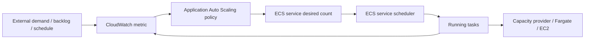
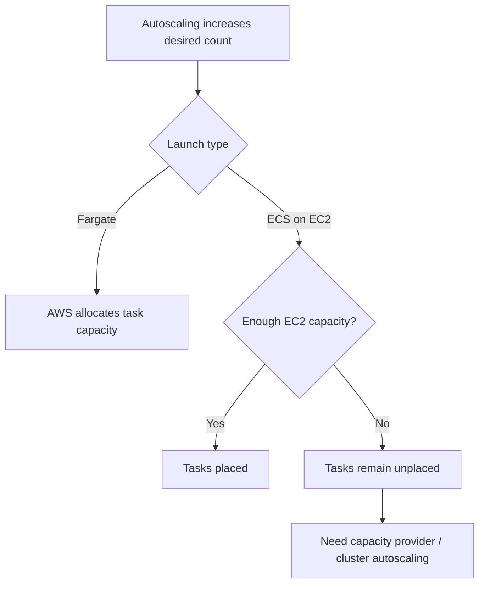
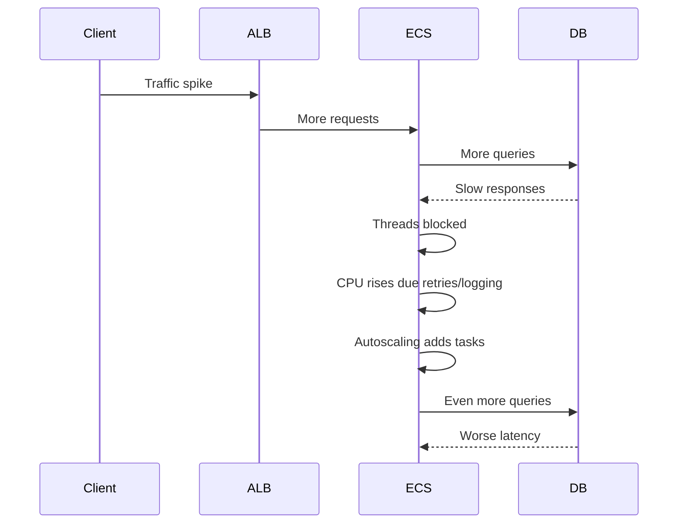
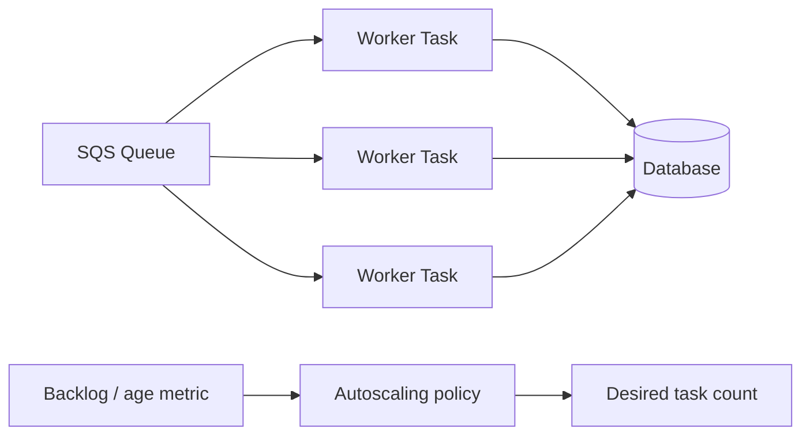
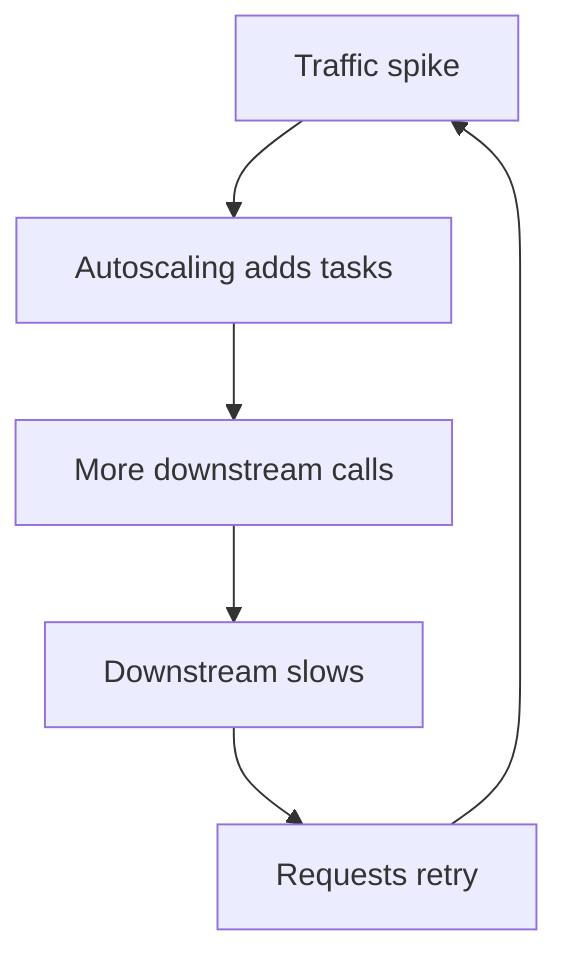

# Part 021 — ECS Autoscaling and Capacity

Autoscaling is not “add more containers when CPU is high”.

Autoscaling is a control loop that changes production capacity based on a signal. The quality of the system depends on whether the signal actually represents user demand, backlog, resource saturation, or business pressure.

A weak autoscaling design creates one of these production pathologies:

- it scales late,
- it scales too much,
- it oscillates,
- it scales the wrong layer,
- it hides application inefficiency,
- it amplifies downstream failure,
- it reduces cost while increasing incident risk,
- it makes deployment behavior unpredictable.

For ECS, there are two capacity questions that must not be mixed:

```txt
1. How many tasks should this service run?
2. Is there enough underlying capacity to place those tasks?
```

With Fargate, AWS handles the infrastructure placement layer, but the service still needs the right desired task count. With ECS on EC2, you must handle both service desired count and cluster instance capacity.

AWS ECS Service Auto Scaling uses Application Auto Scaling to increase or decrease the desired number of tasks for a service. ECS publishes service CPU and memory metrics to CloudWatch, and service autoscaling can use target tracking, step scaling, scheduled scaling, and predictive scaling.

## 1. The Mental Model

An ECS service is a desired-state object.

Autoscaling changes the service desired count.

The ECS scheduler then tries to make reality match that desired count.



The loop is simple. The hard part is choosing the right metric and the right bounds.

A production ECS autoscaling design needs five explicit choices:

| Choice | Question |
|---|---|
| Scaling signal | What metric represents pressure? |
| Scaling policy | How should desired count change? |
| Bounds | What are the minimum and maximum safe task counts? |
| Cooldown | How long should the loop wait before another action? |
| Capacity layer | Can the cluster/provider actually place the new tasks? |

If you cannot answer all five, you do not yet have autoscaling. You have an uncontrolled feedback loop.

## 2. Service Scaling vs Capacity Scaling

ECS has two different scaling layers.

```txt
Service scaling:
  changes desired task count

Capacity scaling:
  changes underlying compute supply
```

For Fargate:

```txt
Service desired count -> Fargate starts more task capacity
```

You do not manage EC2 instances, but you still need:

- subnet IP capacity,
- service quotas,
- image pull path,
- load balancer target capacity,
- downstream capacity,
- account concurrency/cost guardrails.

For ECS on EC2:

```txt
Service desired count -> scheduler places tasks -> EC2 capacity must exist
```

If service desired count increases but cluster capacity cannot fit the tasks, tasks remain pending/provisioning instead of running.



This distinction matters because many incidents are misdiagnosed:

| Symptom | Wrong interpretation | Better interpretation |
|---|---|---|
| Desired count increased but running count did not | Autoscaling failed | Placement/capacity failed. |
| CPU high despite more tasks | Need more tasks | Maybe downstream bottleneck or load balancer imbalance. |
| Queue backlog still rising | Need more workers | Maybe per-worker throughput degraded. |
| Tasks pending during scale-out | ECS broken | Cluster capacity, subnet IPs, ENI, quota, or image pull path. |
| Cost spike after traffic spike | Autoscaling worked | Bounds/cooldowns/cost guardrails were weak. |

## 3. Autoscaling Should Preserve an Invariant

A good scaling policy is built around an invariant.

Examples:

```txt
API service:
  Keep p95 latency below 250 ms while CPU stays below saturation.

Worker service:
  Drain queue backlog within 5 minutes under normal downstream capacity.

Stream consumer:
  Keep iterator age below 60 seconds without overwhelming the sink.

Regulatory case processor:
  Preserve throughput SLA while never exceeding downstream case-lock capacity.
```

Notice that the invariant is not “keep CPU at 50%”. CPU is only a proxy. Sometimes it is a good proxy. Sometimes it is misleading.

A top-level autoscaling invariant usually combines:

- user-visible outcome,
- internal saturation signal,
- backlog or demand metric,
- downstream safety limit,
- cost envelope.

## 4. Scaling Signal Taxonomy

Autoscaling signals fall into five categories.

| Signal type | Example | Good for | Risk |
|---|---|---|---|
| Resource utilization | CPU, memory | CPU-bound or memory-bound services | Misleading for I/O-bound systems. |
| Request load | ALB requests per target | HTTP APIs | Ignores request cost variance. |
| Backlog | Queue depth, age, lag | Workers/consumers | Needs throughput model. |
| Business demand | active jobs, tenant load, case volume | Domain-aware scaling | Needs custom metrics. |
| Schedule/prediction | known peak windows | predictable traffic | Can overprovision or miss anomalies. |

The more mature the system, the more the metric moves away from raw CPU and toward workload-specific pressure.

## 5. CPU-Based Scaling

CPU target tracking is simple and often sufficient for CPU-bound stateless services.

Example use cases:

- CPU-heavy REST API,
- Java service doing expensive transformations,
- compute-bound background workers,
- compression/encryption workload,
- CPU-sensitive synchronous API.

A CPU scaling policy says:

```txt
Keep average CPU utilization near X% by adding/removing tasks.
```

Reasonable target values depend on latency sensitivity:

| Service type | CPU target starting point | Why |
|---|---:|---|
| Latency-sensitive API | 40–55% | Keeps headroom for bursts and GC. |
| Normal API | 55–70% | Balanced cost and performance. |
| Async worker | 65–80% | Higher utilization acceptable if queue absorbs delay. |
| Batch worker | 75–90% | Throughput/cost often more important than latency. |

For Java services, be careful. CPU high may mean:

- real work,
- GC pressure,
- thread contention,
- excessive logging,
- TLS overhead,
- retry storm,
- inefficient serialization,
- downstream latency causing thread pool churn.

Scaling out can reduce pressure, but it can also hide a broken runtime.

### CPU Scaling Failure Mode



Adding tasks to a downstream-saturated system can amplify failure.

Before using CPU scaling, ask:

```txt
If I double the task count, can the downstream system absorb double the concurrency?
```

If the answer is no, autoscaling must be paired with:

- connection pool limits,
- request concurrency limits,
- circuit breaker,
- queue buffering,
- retry budget,
- maximum task bound,
- downstream-aware alarms.

## 6. Memory-Based Scaling

Memory scaling is usually not a demand signal. It is often a leak or cache behavior signal.

Useful cases:

- predictable memory growth per request,
- memory-bound processing,
- large in-memory caches,
- batch jobs with known memory pressure,
- services that degrade before OOM.

Dangerous cases:

- memory leak,
- unbounded cache,
- off-heap memory growth,
- Netty direct buffer leak,
- large per-tenant state retained in-process,
- queue prefetch too high.

Scaling on memory can make a leak more expensive without fixing it.

Better approach:

| Problem | Better control |
|---|---|
| Java heap pressure | Heap sizing, GC tuning, object allocation reduction. |
| Unbounded cache | Cache limit and eviction policy. |
| Native/off-heap growth | Direct memory limits and instrumentation. |
| Per-task queue buffer | Prefetch limit and backpressure. |
| Memory leak | Fix leak; alert on slope. |

Memory should often be an alarm and placement-sizing signal, not the primary scaling signal.

## 7. ALB Request Count Per Target

For HTTP services behind an Application Load Balancer, `ALBRequestCountPerTarget` is often better than CPU.

It models demand as:

```txt
average request volume per task
```

If request volume per target exceeds the configured target, Application Auto Scaling increases task count. If it drops, it scales in gradually.

This works well when:

- requests have relatively similar cost,
- latency correlates with request pressure,
- traffic enters through ALB,
- service is horizontally scalable,
- downstream can absorb concurrency.

It works poorly when:

- requests have wildly different cost,
- long-polling/websocket behavior exists,
- background work is triggered after response,
- one endpoint dominates load,
- request count is not correlated with CPU, memory, or latency.

A better metric may be weighted request units.

```txt
cheap request  = 1 unit
normal request = 3 units
heavy request  = 20 units
```

Then publish a custom metric:

```txt
work_units_per_task
```

This is often more honest than raw request count.

## 8. Queue-Depth Scaling

For ECS workers, queue depth is usually the most natural scaling signal.

But do not use raw queue depth alone.

Raw queue depth means nothing without throughput.

What you actually care about is drain time:

```txt
estimated_drain_time_seconds = visible_messages / total_processing_rate_per_second
```

Or per-task backlog:

```txt
backlog_per_task = visible_messages / running_task_count
```

A worker autoscaling invariant might be:

```txt
Keep estimated drain time below 300 seconds.
```

This requires knowing:

- average processing time,
- p95 processing time,
- downstream write limit,
- maximum safe worker concurrency,
- retry and DLQ behavior,
- poison message handling,
- visibility timeout.

### Queue Worker Scaling Model



The autoscaling policy should be constrained by downstream capacity:

```txt
max_tasks <= floor(downstream_safe_concurrency / concurrency_per_task)
```

Example:

```txt
Database safe concurrent writes: 100
Each worker task uses max 5 DB connections
Max worker tasks: 20
```

Without this cap, autoscaling converts queue backlog into database failure.

## 9. Queue Age vs Queue Depth

For production workers, message age is often a stronger signal than queue depth.

| Metric | Meaning | When useful |
|---|---|---|
| Queue depth | How many messages are waiting | Throughput sizing. |
| Oldest message age | How long work has waited | SLA/SLO protection. |
| In-flight messages | How much work is being processed | Concurrency/saturation. |
| DLQ size | How much work failed permanently | Correctness and data quality. |

Raw queue depth can be high but acceptable if workers are draining quickly. Queue age tells you whether users or business processes are waiting too long.

A mature worker scaling policy may use:

- target tracking on backlog per task,
- alarm on oldest message age,
- max desired count based on downstream capacity,
- DLQ alarm as correctness failure,
- scheduled floor during known batch windows.

## 10. Custom Metrics

Custom metrics are often required for top-tier autoscaling.

Examples:

| Workload | Custom metric |
|---|---|
| Regulatory case processing | open_cases_waiting_assignment_per_task |
| PDF generation | pending_pages_per_task |
| Search indexing | documents_lag_seconds |
| Fraud analysis | risk_jobs_waiting_per_worker |
| Tenant workload | normalized_work_units_per_tenant |
| API gateway service | weighted_request_units_per_task |

The best autoscaling metric is monotonic with capacity need.

A useful metric should satisfy:

```txt
If demand doubles and capacity stays fixed, the metric rises.
If capacity doubles and demand stays fixed, the metric falls.
```

This is why CPU can work for CPU-bound services and fail for I/O-bound services.

## 11. Target Tracking Scaling

Target tracking is the default choice for most ECS services.

It works like a thermostat:

```txt
Keep metric close to target value.
```

AWS ECS Service Auto Scaling creates and manages the CloudWatch alarms for target tracking policies.

Example concept:

```txt
metric: ECSServiceAverageCPUUtilization
target: 60%
min tasks: 2
max tasks: 20
```

For ALB:

```txt
metric: ALBRequestCountPerTarget
target: 800 requests/minute/target
min tasks: 3
max tasks: 30
```

For queue workers, use a custom metric:

```txt
metric: backlog_per_task
target: 100 messages/task
min tasks: 1
max tasks: 50
```

Target tracking properties that matter operationally:

- scale-out is more aggressive than scale-in,
- insufficient metric data does not mean low utilization,
- managed CloudWatch alarms should not be edited manually,
- multiple policies scale out if any policy wants scale-out,
- scale-in happens only when all scale-in-enabled target tracking policies agree,
- ECS disables scale-in during ECS deployments, while scale-out can continue.

This is a safety-oriented behavior. Availability is favored over cost reduction.

## 12. Step Scaling

Step scaling is useful when you want explicit control over scaling increments.

Example:

| Queue depth breach | Add tasks |
|---:|---:|
| 100–500 messages | +2 |
| 500–2,000 messages | +5 |
| 2,000+ messages | +15 |

Step scaling is good when:

- scaling response should be non-linear,
- backlog has clear bands,
- startup time is known,
- demand spikes are sharp,
- custom control is more important than simplicity.

It is dangerous when:

- thresholds are guessed,
- cooldowns are too short,
- workload cost varies widely,
- downstream limits are ignored,
- alarms flap.

Step scaling should be treated like control-system engineering, not as a random set of thresholds.

## 13. Scheduled Scaling

Scheduled scaling sets capacity at known times.

Use it when demand is predictable:

- office-hour traffic,
- payroll windows,
- daily batch ingestion,
- regulatory filing deadlines,
- weekly report generation,
- market open/close windows,
- campaign-driven load.

Example pattern:

```txt
08:00 -> min tasks = 10
18:00 -> min tasks = 3
```

Scheduled scaling is not a replacement for dynamic scaling. It is a floor/ceiling shaping tool.

Production pattern:

```txt
scheduled scaling sets minimum capacity
actual autoscaling responds within that envelope
```

This avoids cold scale-out during known peaks.

## 14. Predictive Scaling

Predictive scaling uses historical load patterns to anticipate capacity need.

It is useful when traffic has strong daily/weekly periodicity:

- predictable business hours,
- repeatable batch windows,
- recurring scheduled traffic,
- known seasonal flows.

It is not magic. It will not correctly predict:

- one-off incident spikes,
- viral traffic,
- sudden downstream degradation,
- new product launch behavior,
- external partner retry storm.

Treat predictive scaling as pre-warming based on history, not as a substitute for live safety controls.

## 15. Minimum Desired Count

Minimum capacity encodes availability posture.

| Minimum count | Meaning |
|---:|---|
| 0 | Scale-to-zero, no always-on availability. |
| 1 | Cheapest always-on, no task-level redundancy. |
| 2 | Basic redundancy across AZs if placement works. |
| 3+ | Better rolling deploy and AZ failure tolerance. |

For production APIs, `min=1` is usually weak. It creates:

- no spare during deployment,
- no redundancy if the task dies,
- higher cold path risk,
- poor AZ fault tolerance,
- slower failure recovery.

For async workers, `min=0` or `min=1` may be acceptable depending on SLA.

Decision model:

```txt
Can work wait?        -> lower min may be fine
Is user waiting?      -> keep warm capacity
Is SLA strict?        -> keep redundancy
Is deployment frequent? -> keep enough capacity for rolling update
Is AZ resilience needed? -> min must support AZ spread
```

## 16. Maximum Desired Count

Maximum capacity is not just cost control. It is blast-radius control.

It protects downstream systems from autoscaling-driven overload.

Set max desired count based on:

- database connection capacity,
- queue visibility behavior,
- external API rate limits,
- service quota,
- per-task concurrency,
- load balancer target limits,
- budget guardrail,
- tenant fairness.

Example:

```txt
External partner API limit: 1,000 req/s
Each task can issue:        50 req/s
Safe headroom:              70%
Max tasks:                  floor(1000 * 0.7 / 50) = 14
```

The autoscaling max is part of reliability design.

## 17. Cooldown

Cooldown tells the control loop how long to wait for a scaling activity to take effect.

Too short:

- oscillation,
- over-scaling,
- unstable desired count,
- cost spikes,
- target churn.

Too long:

- late response,
- sustained latency,
- backlog growth,
- missed SLA.

Choose cooldown based on real timing:

```txt
container image pull time
JVM startup time
health check grace period
ALB target registration time
application warmup time
metric publication interval
request latency response time
queue drain response time
```

For Java ECS API services, the real scale-out response may be:

```txt
image pull:              10–60s
JVM startup:             5–45s
Spring warmup:           10–90s
health check pass:       15–120s
ALB routing:             seconds to minutes depending checks
metric reflection:       1+ CloudWatch periods
```

Autoscaling is not instant. Design for the delay.

## 18. Deployment Interaction

Autoscaling and deployment interact.

During a deployment:

- ECS may launch replacement tasks,
- old and new tasks may overlap,
- capacity demand may temporarily increase,
- scale-out can continue,
- scale-in is disabled for target tracking during ECS deployments,
- ALB target health determines task readiness,
- deployment configuration controls batch size.

This means deployment can fail if autoscaling bounds and deployment configuration are incompatible.

Example:

```txt
service desired count: 10
maximumPercent: 200
possible tasks during deploy: 20
Fargate/subnet/quota must support 20 tasks
```

If you run ECS on EC2, cluster capacity must support deployment surge.

If you set `maximumPercent` too low, deployment may be slow or blocked.

If you set it too high, you may exceed downstream or cost limits during rollout.

## 19. API Service Scaling Blueprint

A production API service scaling blueprint:

```txt
Minimum tasks:
  2 or 3 for baseline availability

Primary scaling metric:
  ALBRequestCountPerTarget or custom weighted request units

Safety alarms:
  p95/p99 latency
  5xx rate
  target response time
  CPU saturation
  memory saturation
  downstream error rate

Maximum tasks:
  derived from downstream capacity and budget

Cooldown:
  based on startup + health check + metric delay

Deployment:
  min/max healthy percent verified against max capacity
```

Example policy logic:

```txt
Scale target:
  700 requests/target/minute

Bounds:
  min=3
  max=30

Guardrails:
  DB connection pool per task = 10
  DB safe service connections = 250
  max tasks by DB = 25
  choose autoscaling max = 25 or add DB proxy/pooler
```

## 20. Worker Scaling Blueprint

A production worker scaling blueprint:

```txt
Minimum tasks:
  0, 1, or N depending on latency/SLA

Primary scaling metric:
  backlog per task or estimated drain time

Safety alarms:
  oldest message age
  DLQ depth
  processing error rate
  downstream latency
  downstream throttle rate

Maximum tasks:
  derived from downstream concurrency/rate limit

Cooldown:
  based on task startup + average processing time + metric period

Failure control:
  idempotency
  visibility timeout
  retry limit
  DLQ redrive process
```

Example:

```txt
Goal:
  drain normal backlog within 5 minutes

Average processing rate:
  2 messages/second/task

Target backlog per task:
  2 msg/s * 300s = 600 messages/task

Scale metric:
  visible_messages / running_tasks

Max tasks:
  min(downstream limit, budget limit, quota limit)
```

## 21. Stream Consumer Scaling Blueprint

For stream consumers, scaling is constrained by partition/shard concurrency.

Scaling more tasks than partitions may not increase throughput.

Important metrics:

- iterator age,
- records behind latest,
- processing latency,
- batch failure rate,
- retry rate,
- sink throttling,
- partition skew.

A scaling policy should consider:

```txt
max useful tasks <= number of partitions/shards or consumer-group parallelism
```

If one shard is hot, adding more generic workers may not fix it. You may need:

- better partition key,
- shard split,
- workload rebalancing,
- per-key concurrency control,
- downstream write optimization.

## 22. Autoscaling and Backpressure

Autoscaling is not a substitute for backpressure.

Backpressure is how a system refuses to accept unlimited work.

Examples:

| Workload | Backpressure mechanism |
|---|---|
| API | rate limit, queue, 429/503, concurrency limit |
| Worker | queue depth, visibility timeout, max consumers |
| Stream | consumer lag, batch window, partition throttling |
| Downstream API | circuit breaker, token bucket, retry budget |
| Database | connection pool cap, query timeout |

Without backpressure, autoscaling becomes a failure amplifier.



The goal is not infinite scaling. The goal is controlled degradation.

## 23. Autoscaling and Java Runtime Design

Java ECS services need explicit runtime alignment.

Checklist:

```txt
Task memory > heap + metaspace + direct memory + thread stacks + native libs + log buffers.
CPU target accounts for GC and JIT warmup.
Connection pool max * max task count <= downstream capacity.
Thread pool does not grow unbounded.
Async executor has bounded queue.
Health check fails on real unavailability, not minor dependency slowness.
Shutdown drains in-flight requests before task stop timeout.
Metrics distinguish business work from framework noise.
```

Bad pattern:

```txt
max tasks = 100
connection pool per task = 30
potential DB connections = 3,000
DB safe connections = 400
```

Good pattern:

```txt
max tasks = 20
connection pool per task = 10
potential DB connections = 200
DB safe connections = 400
headroom = 200
```

## 24. Metric Publication and Delay

Autoscaling operates on metrics, and metrics arrive with delay.

AWS ECS sends service metrics to CloudWatch at one-minute intervals. Application Auto Scaling then evaluates policies based on CloudWatch data and cooldowns.

This has consequences:

- autoscaling is reactive unless scheduled/predictive scaling is used,
- short spikes may not be fully visible,
- delayed metrics can cause overshoot,
- application warmup must be included in cooldown,
- alarms should be based on multiple periods for noise reduction.

If a spike lasts 20 seconds, service autoscaling may not respond in time. You need baseline capacity and fast in-process backpressure.

## 25. Oscillation

Oscillation happens when capacity changes too frequently.

Symptoms:

- desired count jumps up/down repeatedly,
- target group constantly registers/deregisters tasks,
- JVM warmup never stabilizes,
- CPU averages look noisy,
- cost rises without throughput improvement,
- deployments are slow or unstable.

Causes:

- metric too noisy,
- cooldown too short,
- min/max bounds too narrow,
- target too aggressive,
- request cost variance,
- insufficient warm capacity,
- downstream latency feedback loop.

Fixes:

- use a better metric,
- increase cooldown,
- use higher min capacity,
- disable scale-in on one policy,
- add scale-in stabilization,
- separate heavy endpoints/workloads,
- use queue buffer for burst absorption.

## 26. Multi-Policy Scaling

A service can have multiple target tracking policies using different metrics.

Example API service:

```txt
Policy A: CPU target 60%
Policy B: ALB requests per target 800/min
```

Operational behavior favors availability:

```txt
Scale out if any policy says scale out.
Scale in only when all scale-in-enabled policies agree.
```

This is useful because different failure modes surface through different metrics.

But too many policies can make behavior difficult to reason about. Use multiple policies only when each policy protects a different important invariant.

## 27. Scale-In Safety

Scale-out protects availability. Scale-in protects cost but can harm availability.

Before allowing aggressive scale-in, verify:

- task shutdown drains requests,
- ALB deregistration delay is correct,
- worker stops polling before termination,
- in-flight messages are not lost,
- service can absorb traffic after removing tasks,
- scale-in does not fight deployment,
- Java warmup cost is not too high.

For queue workers, scale-in must consider visibility timeout and in-flight work.

Bad shutdown:

```txt
SIGTERM received
process exits immediately
message processing interrupted
message becomes visible again
another task processes duplicate
side effect duplicated
```

Good shutdown:

```txt
SIGTERM received
stop polling new messages
finish current message within timeout
commit/delete message
exit cleanly
```

## 28. Capacity Planning Before Autoscaling

Autoscaling does not remove capacity planning. It changes the shape of capacity planning.

Before enabling autoscaling, benchmark:

```txt
per-task max safe RPS
per-task p95 latency at load
per-task CPU curve
per-task memory curve
per-task downstream connection usage
startup time
shutdown time
image pull time
queue processing rate
failure behavior under downstream slowness
```

Then derive policy values from measurement.

Example:

```txt
Measured safe capacity per task:
  100 RPS at p95 < 200 ms and CPU < 65%

Expected peak:
  1,500 RPS

Required tasks:
  ceil(1500 / 100) = 15

Availability headroom:
  +30% => 20 tasks

Set max:
  min(20, downstream limit, budget limit)
```

## 29. Cost Model

Autoscaling changes cost in three ways:

```txt
more tasks
more data transfer / NAT / endpoints / logs / metrics
more downstream usage
```

For Fargate, cost is strongly tied to:

- task vCPU,
- task memory,
- runtime duration,
- architecture,
- Spot usage,
- ephemeral storage above default,
- data transfer/NAT,
- log volume.

Autoscaling that adds tasks can also increase:

- database I/O,
- third-party API cost,
- CloudWatch logs cost,
- tracing cost,
- load balancer LCU usage.

A scaling policy should have a cost review:

```txt
At max desired count, what is the hourly burn rate?
At max desired count for 24 hours, what is the incident cost?
Can this be triggered accidentally by bad traffic or retry storms?
```

## 30. Production Observability

Autoscaling needs its own observability.

Track:

| Metric/Event | Why it matters |
|---|---|
| desired task count | What autoscaling wants. |
| running task count | What ECS achieved. |
| pending/provisioning count | Capacity/placement issue. |
| scaling activity history | Why desired count changed. |
| policy metric value | Trigger signal. |
| CPU/memory | Resource saturation. |
| ALB request count/target | API demand. |
| target response time | Latency pressure. |
| queue depth/age | Backlog pressure. |
| deployment state | Scaling/deploy interaction. |
| task stop reasons | Runtime/capacity failure. |
| capacity provider metrics | EC2 cluster supply. |

Dashboard layout:

```txt
Row 1: user-facing latency/errors/throughput
Row 2: desired/running/pending task count
Row 3: autoscaling metric and target
Row 4: CPU/memory/GC/downstream latency
Row 5: deployment events and task stops
Row 6: queue/backlog/DLQ if async
```

Do not debug autoscaling from CPU alone.

## 31. Common Failure Modes

### 31.1 Desired Count Increased, Running Count Did Not

Likely causes:

- no Fargate capacity in selected AZ/platform,
- subnet IP exhaustion,
- service quota,
- image pull failure,
- invalid task definition,
- security group/VPC endpoint issue,
- EC2 cluster lacks resources,
- capacity provider misconfigured.

Debug flow:

```txt
Check ECS service events.
Check desired vs running vs pending.
Check task stop/provisioning reason.
Check subnets and ENI/IP capacity.
Check ECR/secrets/log endpoint reachability.
Check capacity provider/cluster capacity.
```

### 31.2 Autoscaling Adds Tasks but Latency Stays High

Likely causes:

- downstream bottleneck,
- request cost variance,
- DB connection saturation,
- load balancer imbalance,
- JVM warmup delay,
- thread pool saturation,
- retry storm,
- heavy endpoint not isolated.

### 31.3 Queue Backlog Grows Despite More Workers

Likely causes:

- downstream throttling,
- poison messages,
- visibility timeout too short,
- task processing rate lower than assumed,
- batch size too small,
- per-message work changed,
- database lock contention.

### 31.4 Service Scales Down Too Far

Likely causes:

- minimum capacity too low,
- scale-in cooldown too short,
- misleading low CPU during blocked threads,
- request count target too high,
- scheduled scale-down too aggressive,
- metric missing interpreted incorrectly by non-target-tracking alarm.

### 31.5 Autoscaling Causes Incident

Likely causes:

- max count exceeds downstream capacity,
- retry storm interpreted as demand,
- each task opens too many connections,
- traffic spike from bot/abuse,
- no rate limits,
- no circuit breakers,
- no cost guardrail.

## 32. Design Review Questions

Use these questions before approving ECS autoscaling in production.

```txt
What user or business invariant does this scaling policy protect?
Is the metric a real demand signal or only a resource symptom?
What is the minimum capacity and why?
What is the maximum capacity and which downstream limit defines it?
What happens during deployment surge?
What happens if scale-out fails?
What happens if scale-in interrupts work?
Can a retry storm trigger scale-out?
Can an attacker or bad tenant trigger max capacity?
How long from demand spike to healthy task receiving traffic?
What dashboard shows desired/running/pending and scaling activity?
What alarm fires when autoscaling cannot keep up?
What alarm fires when autoscaling makes things worse?
```

## 33. Implementation Pattern: API Service

Example AWS CLI style shape:

```bash
aws application-autoscaling register-scalable-target \
  --service-namespace ecs \
  --scalable-dimension ecs:service:DesiredCount \
  --resource-id service/prod-cluster/case-api \
  --min-capacity 3 \
  --max-capacity 25
```

Target tracking policy concept:

```json
{
  "TargetValue": 700.0,
  "PredefinedMetricSpecification": {
    "PredefinedMetricType": "ALBRequestCountPerTarget",
    "ResourceLabel": "app/prod-alb/abc123/targetgroup/case-api/def456"
  },
  "ScaleOutCooldown": 90,
  "ScaleInCooldown": 300
}
```

The important part is not the JSON. The important part is the reasoning:

```txt
700 requests/target/min is safe from load test.
min=3 preserves AZ/deployment baseline.
max=25 preserves DB connection budget.
scale-out cooldown accounts for startup + health checks.
scale-in cooldown avoids flapping after short drops.
```

## 34. Implementation Pattern: Queue Worker

Application metric publisher concept:

```java
public final class QueueScalingMetricPublisher {
    private final CloudWatchClient cloudWatch;
    private final SqsClient sqs;
    private final EcsClient ecs;

    public void publishBacklogPerTask() {
        long visible = readApproximateVisibleMessages();
        int runningTasks = Math.max(readRunningTaskCount(), 1);
        double backlogPerTask = (double) visible / runningTasks;

        cloudWatch.putMetricData(req -> req
            .namespace("Production/Workers")
            .metricData(metric -> metric
                .metricName("BacklogPerTask")
                .unit(StandardUnit.COUNT)
                .value(backlogPerTask)
                .dimensions(d -> d.name("Service").value("case-worker"))));
    }
}
```

Policy concept:

```txt
Target BacklogPerTask: 500
min tasks: 1
max tasks: 20
scale-out cooldown: 60s
scale-in cooldown: 600s
```

Why scale-in cooldown is longer:

```txt
Workers often need time to drain and queue metrics are approximate/noisy.
Aggressive scale-in can leave backlog oscillating.
```

## 35. Production Runbook

When autoscaling behaves unexpectedly, follow this order.

```txt
1. Confirm the service desired count.
2. Confirm running and pending task count.
3. Check autoscaling activity history.
4. Check the metric that triggered the policy.
5. Check CloudWatch alarm state if using step scaling.
6. Check ECS service events.
7. Check task stop/provisioning reasons.
8. Check deployment status.
9. Check capacity provider or Fargate placement issues.
10. Check downstream saturation.
11. Check recent releases/config changes.
12. Check whether traffic is legitimate demand, retry storm, or abuse.
```

Key distinction:

```txt
Policy problem:
  desired count did not change when it should have.

Placement problem:
  desired count changed, but running count did not.

Application problem:
  running count increased, but user/business metric did not improve.
```

## 36. Anti-Patterns

Avoid these.

```txt
Scale every service on CPU by default.
Set max capacity based only on budget.
Ignore downstream connection pools.
Use raw queue depth without throughput model.
Use memory scaling to hide a leak.
Use min=1 for critical APIs.
Use autoscaling without load testing.
Use scheduled scale-down without checking in-flight work.
Allow scale-out during retry storms without circuit breakers.
Debug autoscaling from one CloudWatch graph.
Treat Fargate as infinite capacity.
```

## 37. The Final Mental Model

Autoscaling is a feedback loop.

A feedback loop needs:

```txt
accurate signal
safe actuator
bounded response
observable behavior
failure containment
```

For ECS:

```txt
signal      = metric
actuator    = desired count
executor    = ECS scheduler
capacity    = Fargate or EC2 capacity provider
constraint  = downstream capacity and service quotas
outcome     = latency, backlog, throughput, cost, reliability
```

A top-tier engineer does not ask:

```txt
Should I autoscale this ECS service?
```

They ask:

```txt
What pressure should this service respond to, how fast, within what safety bounds, and how do we know the response improved the user/business outcome?
```

That is the difference between using autoscaling and engineering autoscaling.

## References

- AWS ECS Developer Guide — Automatically scale your Amazon ECS service: https://docs.aws.amazon.com/AmazonECS/latest/developerguide/service-auto-scaling.html
- AWS ECS Developer Guide — Target tracking scaling policies for ECS services: https://docs.aws.amazon.com/AmazonECS/latest/developerguide/service-autoscaling-targettracking.html
- AWS Application Auto Scaling User Guide — Target tracking scaling policies: https://docs.aws.amazon.com/autoscaling/application/userguide/application-auto-scaling-target-tracking.html
- AWS ECS Developer Guide — Cluster auto scaling: https://docs.aws.amazon.com/AmazonECS/latest/developerguide/cluster-auto-scaling.html
