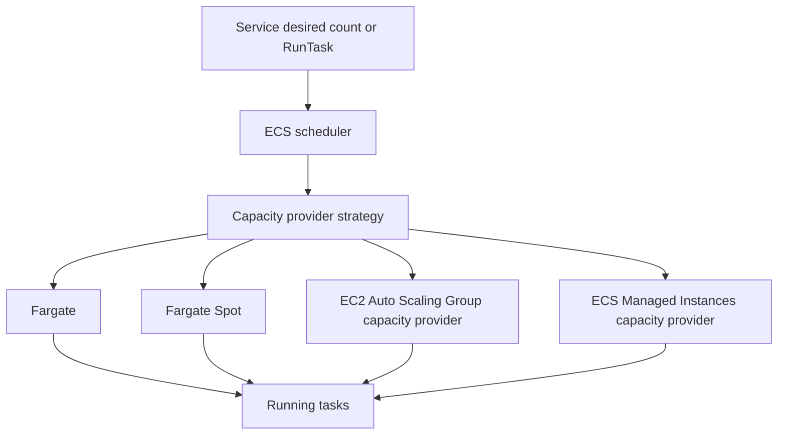
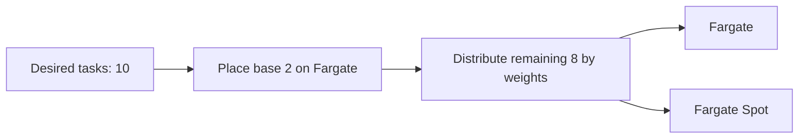
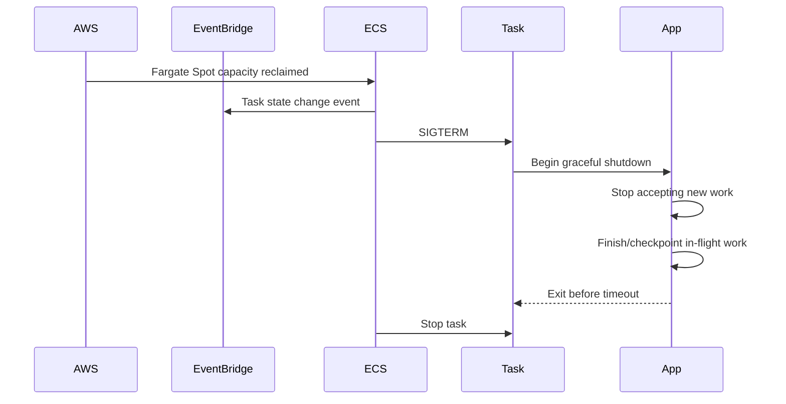
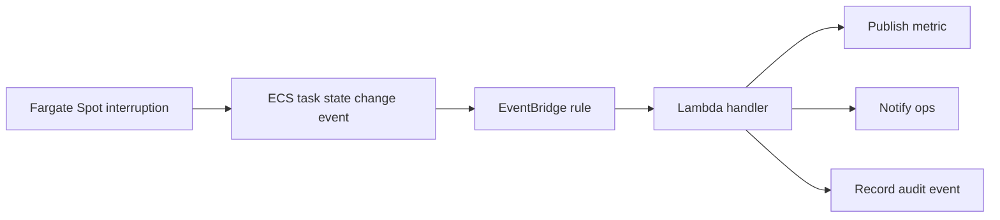
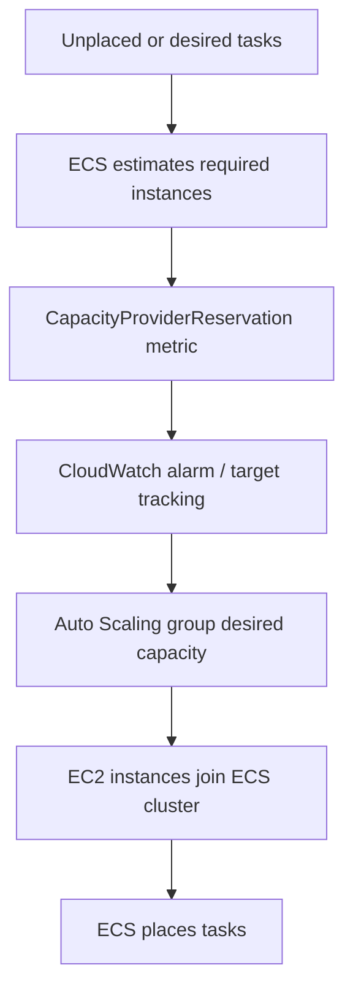

# Part 022 — Capacity Providers and Spot

A capacity provider is where ECS gets compute capacity for tasks.

A capacity provider strategy is how ECS chooses among those sources of capacity.

This sounds small. It is not.

Capacity providers decide whether your service runs on:

- serverless Fargate capacity,
- discounted interruption-tolerant Fargate Spot capacity,
- EC2 Auto Scaling group capacity,
- ECS Managed Instances capacity,
- a weighted combination inside the same provider family.

A bad capacity provider design creates these production failures:

- tasks stuck in `PROVISIONING`,
- all tasks interrupted at once,
- deployment cannot surge,
- cost optimization breaks availability,
- Spot is used for stateful or non-idempotent work,
- EC2 scale-in kills active workloads,
- cluster capacity exists but cannot fit task shape,
- services silently use the wrong default strategy.

This part is about compute supply, not service demand. Part 021 covered how desired task count changes. This part covers where those tasks land.

## 1. The Mental Model

ECS placement has three layers.



Think of the scheduler as asking:

```txt
I need to place N tasks. Which capacity source should I use, and is there enough capacity there?
```

A service can specify:

```txt
launch type
or
capacity provider strategy
```

A cluster can also have a default capacity provider strategy, but the default only applies when the service/task does not explicitly specify launch type or capacity provider strategy.

## 2. Capacity Provider Types

ECS capacity providers can be grouped as follows.

| Provider type | What it means | Best for | Main trade-off |
|---|---|---|---|
| Fargate | AWS-managed serverless container capacity | Most standard services/workers | Less host control, Fargate pricing. |
| Fargate Spot | Spare Fargate capacity with interruption risk | Fault-tolerant workers, non-critical replicas | Can be interrupted with two-minute warning. |
| Auto Scaling group capacity provider | ECS uses EC2 instances from an ASG | Specialized instances, cost control, daemon needs | You own more infrastructure. |
| ECS Managed Instances | AWS-managed EC2-style capacity for ECS | Lower ops than self-managed EC2, more infra abstraction | Newer model; requires understanding provider boundaries. |

The first rule:

```txt
Choose the capacity provider based on workload tolerance, not only price.
```

## 3. Launch Type vs Capacity Provider Strategy

Old ECS mental model:

```txt
Launch type = FARGATE or EC2
```

Modern ECS mental model:

```txt
Capacity provider strategy = policy for where tasks are placed
```

Capacity provider strategies give you:

- weighted placement,
- base capacity,
- Fargate + Fargate Spot mix,
- EC2 ASG managed scaling,
- cluster defaults,
- service-specific overrides.

Use launch type for simple explicit placement. Use capacity provider strategy when capacity choice is part of architecture.

## 4. Strategy: Base and Weight

A capacity provider strategy uses two key concepts:

```txt
base:
  minimum number of tasks to place on one capacity provider

weight:
  relative distribution of tasks after base is satisfied
```

Only one capacity provider in a strategy can have `base`.

Example:

```txt
FARGATE:
  base: 2
  weight: 1

FARGATE_SPOT:
  base: 0
  weight: 4
```

Meaning:

```txt
First 2 tasks go to FARGATE.
Remaining tasks are distributed with roughly 1:4 weight between FARGATE and FARGATE_SPOT.
```

This pattern preserves a small stable on-demand floor while pushing burst capacity to Spot.



## 5. Important Constraint: Provider Families

A cluster can contain different capacity provider types, but a single capacity provider strategy cannot arbitrarily mix every family.

For example, AWS documentation states that a capacity provider strategy can contain Fargate providers or Auto Scaling group providers, but not both in the same strategy. ECS cluster-level capability and service-level strategy must be understood separately.

Design implication:

```txt
Do not assume one ECS service can seamlessly distribute a single strategy across Fargate and EC2 ASG providers.
```

If you need a hybrid Fargate/EC2 architecture, you usually separate services or use different deployment units.

## 6. Fargate Capacity Provider

Fargate is the default production choice for many ECS services because it removes host management.

You do not manage:

- EC2 instance provisioning,
- AMI patching,
- cluster bin packing,
- host-level daemon lifecycle,
- EC2 scale-in draining,
- instance type selection.

You still manage:

- task CPU/memory sizing,
- platform version constraints,
- networking path,
- subnet IP capacity,
- service quotas,
- deployment surge,
- image pull failure,
- secrets/log endpoints,
- application graceful shutdown,
- cost.

Fargate is not infinite capacity. It is an abstraction over infrastructure capacity.

## 7. Fargate Spot

Fargate Spot runs tasks on spare Fargate capacity at a discount compared with standard Fargate, but tasks can be interrupted when AWS needs the capacity back.

AWS documents that Fargate Spot tasks receive a two-minute warning before interruption. The warning is delivered as an ECS task state change event to EventBridge and as a `SIGTERM` to the running task.

That two-minute warning is a contract. Your application must be able to use it.

Fargate Spot is good for:

- idempotent async workers,
- queue consumers,
- stateless background processors,
- horizontally replicated services with on-demand floor,
- batch-ish work that can resume,
- non-critical preview environments,
- cost-sensitive burst capacity.

Fargate Spot is bad for:

- single critical API replica,
- non-idempotent side effects,
- long-running work without checkpointing,
- stateful in-memory workloads,
- services that cannot drain in two minutes,
- workloads with strict uninterrupted latency/SLA,
- jobs that cannot tolerate duplicate execution.

## 8. The Two-Minute Interruption Window

Interruption flow:



Your shutdown handler should:

```txt
stop accepting new requests/messages
stop polling queues
finish current unit of work if safe
checkpoint progress if work is long
release distributed locks
flush telemetry
close network resources
exit before stop timeout
```

For Java/Spring services:

```properties
server.shutdown=graceful
spring.lifecycle.timeout-per-shutdown-phase=30s
```

For workers:

```txt
On SIGTERM:
  stop polling
  finish current message if possible
  delete/ack only after side effect committed
  otherwise allow message to reappear
```

The application must be idempotent because interruption can happen after a side effect but before acknowledgement.

## 9. Spot Is a Failure Mode, Not Just a Discount

A common weak design:

```txt
capacity provider strategy:
  FARGATE_SPOT weight 1

minimum tasks:
  2

critical API:
  yes
```

This is not cost optimization. This is availability gambling.

A safer design:

```txt
critical API:
  FARGATE base 2
  FARGATE_SPOT weight for excess capacity only

worker:
  FARGATE base 1
  FARGATE_SPOT weight 4

batch:
  FARGATE_SPOT dominant, with checkpoint/retry
```

Spot should be tied to workload tolerance.

## 10. Stable Floor + Spot Burst Pattern

Pattern:

```txt
Base capacity runs on Fargate.
Burst capacity uses Fargate Spot.
```

Example for API:

```txt
FARGATE:
  base = 3
  weight = 1

FARGATE_SPOT:
  base = 0
  weight = 2
```

This means:

- minimum stable replicas are interruption-resistant,
- burst replicas are cheaper,
- interruption reduces capacity but does not remove all capacity,
- autoscaling can replace interrupted Spot if capacity is available,
- alarms detect reduced healthy task count.

This pattern is useful when traffic can tolerate temporary capacity reduction but not full service loss.

## 11. Worker Spot Pattern

For workers, Spot can be more aggressive.

Example:

```txt
FARGATE:
  base = 1
  weight = 1

FARGATE_SPOT:
  base = 0
  weight = 5
```

Requirements:

```txt
queue-based input
idempotent processing
visibility timeout configured
DLQ configured
checkpointing for long work
max task count respects downstream capacity
interruption alarms configured
```

Queue makes interruption survivable because unfinished messages can be retried.

But queue does not make side effects safe. Idempotency does.

## 12. Batch-ish Spot Pattern

For resumable batch workloads:

```txt
FARGATE_SPOT dominant
checkpoint after each chunk
store progress outside task memory
retry failed chunks
separate poison data from infrastructure interruption
```

Bad batch design:

```txt
Task processes 6-hour file.
Progress only in memory.
Spot interruption at hour 5.
All work lost.
```

Good batch design:

```txt
Task processes file in chunks.
Each chunk writes checkpoint.
Interruption loses at most one chunk.
Retry resumes from checkpoint.
```

## 13. EventBridge Interruption Handling

Because Fargate Spot interruption creates a task state change event, you can build operational responses.

Possible EventBridge targets:

- CloudWatch alarm/logging,
- SNS notification,
- Lambda to annotate incident timeline,
- Step Functions compensation flow,
- custom metric increment,
- workload-specific rescheduler.

Example event handling model:



Do not rely only on application logs. Interruption is a platform event and should be visible in platform telemetry.

## 14. EC2 Auto Scaling Group Capacity Providers

An Auto Scaling group capacity provider connects ECS to an EC2 Auto Scaling group.

Use it when you need:

- specialized instances,
- GPU workloads,
- high local disk throughput,
- daemon/agent host control,
- EC2 reserved/savings strategy,
- custom networking/host tuning,
- lower cost at high steady utilization,
- specific AMI/hardening model.

Trade-off:

```txt
You get more control.
You inherit more operational responsibility.
```

You must think about:

- instance type mix,
- AMI patching,
- ECS agent/container runtime,
- cluster autoscaling,
- bin packing,
- ENI/port/GPU constraints,
- managed termination protection,
- draining during scale-in,
- security patch cadence.

## 15. Cluster Auto Scaling

With Auto Scaling group capacity providers, ECS can manage cluster auto scaling.

ECS estimates how many EC2 instances are needed to run tasks and publishes capacity provider metrics such as `CapacityProviderReservation`. ECS then uses a target tracking scaling policy attached to the Auto Scaling group.

Mental model:



This is capacity scaling, not service scaling.

You often need both:

```txt
Service Auto Scaling:
  desired task count increases

Cluster Auto Scaling:
  EC2 instances increase to fit those tasks
```

If you only configure service scaling, tasks may be desired but unplaced.

## 16. Managed Scaling Constraints

For Auto Scaling group capacity providers, production constraints matter.

AWS documentation highlights considerations such as:

- the Auto Scaling group must have `MaxSize` greater than zero to scale out,
- do not modify the ECS-managed scaling policy directly,
- if the ASG cannot scale out, tasks can fail to move beyond `PROVISIONING`,
- each strategy can have a limited number of capacity providers,
- at least one capacity provider in a strategy must have weight greater than zero,
- only one capacity provider can define `base`,
- service updates cannot freely switch between ASG capacity providers and Fargate capacity providers.

The operational lesson:

```txt
The capacity provider is part of the service contract.
Do not treat it as a cosmetic deployment parameter.
```

## 17. Instance Shape and Task Shape

For ECS on EC2, placement succeeds only if tasks fit instances.

Task needs:

```txt
CPU
memory
ports
ENI capacity
GPU
ephemeral disk
placement constraints
availability zone
architecture
```

Instance offers:

```txt
vCPU
memory
ENI limits
ports
GPU
disk
AZ
architecture
```

A task can be unplaceable even when aggregate cluster resources look sufficient.

Example:

```txt
Cluster aggregate free memory: 64 GB
Task memory requirement: 16 GB
But every instance has only 8 GB free
Result: task cannot be placed
```

This is fragmentation.

## 18. Bin Packing vs Spread

ECS placement strategy can optimize for different goals.

| Strategy | Effect | Trade-off |
|---|---|---|
| binpack | pack tasks tightly by CPU/memory | Better cost, more blast radius per instance. |
| spread | spread across AZ/instance attribute | Better availability, potentially lower utilization. |
| random | simple distribution | Less predictable. |

For EC2 capacity providers, bin packing improves cost but can concentrate risk.

For critical services, use spread across AZs and careful task placement.

Capacity strategy and placement strategy must be designed together.

## 19. Managed Termination Protection and Draining

Scale-in is dangerous if active tasks are killed abruptly.

For ECS on EC2, managed termination protection and instance draining help avoid terminating instances that still run important tasks.

Operational goal:

```txt
When cluster capacity scales in, ECS should drain tasks before EC2 termination disrupts workloads.
```

Bad scale-in:

```txt
ASG terminates instance
running tasks disappear
requests fail
messages duplicate
service drops below healthy capacity
```

Better scale-in:

```txt
instance selected for termination
container instance enters draining
ECS stops/replaces tasks safely
ALB deregisters targets
tasks exit gracefully
instance terminates after empty/safe
```

For critical services, test scale-in behavior intentionally.

## 20. Capacity Provider Strategy Examples

### 20.1 Critical API, Fargate Only

```json
[
  {
    "capacityProvider": "FARGATE",
    "base": 3,
    "weight": 1
  }
]
```

Use when:

- service is critical,
- interruption tolerance is low,
- cost is less important than stability,
- team does not need host control.

### 20.2 API with Stable Floor and Spot Burst

```json
[
  {
    "capacityProvider": "FARGATE",
    "base": 3,
    "weight": 1
  },
  {
    "capacityProvider": "FARGATE_SPOT",
    "base": 0,
    "weight": 2
  }
]
```

Use when:

- baseline must survive interruption,
- burst traffic can tolerate partial reduction,
- autoscaling maximum is bounded,
- interruption events are monitored.

### 20.3 Queue Worker with Strong Spot Bias

```json
[
  {
    "capacityProvider": "FARGATE",
    "base": 1,
    "weight": 1
  },
  {
    "capacityProvider": "FARGATE_SPOT",
    "base": 0,
    "weight": 5
  }
]
```

Use when:

- input is durable queue,
- handlers are idempotent,
- backlog can absorb interruption,
- DLQ/redrive exists,
- max tasks protect downstream.

### 20.4 EC2 Capacity Provider for Specialized Workload

```json
[
  {
    "capacityProvider": "gpu-asg-capacity-provider",
    "base": 0,
    "weight": 1
  }
]
```

Use when:

- task needs GPU,
- task needs host-level configuration,
- Fargate unsupported shape,
- EC2 cost model wins at steady utilization.

## 21. Service Defaults and Hidden Risk

Cluster default capacity provider strategy is convenient. It is also dangerous if teams forget it exists.

Example problem:

```txt
Cluster default = FARGATE_SPOT
New critical service created without explicit strategy
Service runs entirely on Spot
Interruption event removes capacity
Incident follows
```

Platform rule:

```txt
Critical production services should declare their capacity provider strategy explicitly.
```

Cluster defaults should be safe, conservative, and documented.

## 22. Cost Engineering

Capacity providers are one of ECS's main cost levers.

| Option | Cost posture | Operational posture |
|---|---|---|
| Fargate | Pay per task resources/time | Low infra ops. |
| Fargate Spot | Lower cost, interruption risk | Requires graceful/idempotent design. |
| EC2 ASG | Potentially cheaper at high utilization | More ops and bin-packing work. |
| ECS Managed Instances | AWS manages more instance lifecycle | Reduces EC2 ops, still needs capacity model. |

Cost decision should consider total cost, not compute only:

- task CPU/memory sizing,
- idle baseline,
- deployment surge,
- Spot interruption rework,
- NAT/data transfer,
- observability volume,
- operational labor,
- incident blast radius,
- compliance/audit requirements.

Cheap compute can be expensive if it increases failure recovery, duplicate processing, or operational complexity.

## 23. Spot Readiness Checklist

Before using Fargate Spot, verify:

```txt
Workload can receive SIGTERM and shut down gracefully.
Shutdown completes within the configured stop timeout / interruption window.
Work is idempotent.
In-flight work can be retried safely.
Queue visibility timeout is correct.
External side effects have idempotency keys.
Minimum on-demand floor is set for critical availability.
Interruption events are captured through EventBridge.
Autoscaling can recover if Spot capacity exists.
Alarms detect healthy capacity below threshold.
Max desired count protects downstream on recovery.
Runbook explains whether interruption is expected or incident-worthy.
```

If these are not true, Spot is not ready for that service.

## 24. Fargate Spot Interruption Runbook

When Spot tasks stop:

```txt
1. Confirm ECS service desired/running count.
2. Check ECS service events for SpotInterruption or capacity errors.
3. Check EventBridge task state change events.
4. Verify whether on-demand base tasks remain healthy.
5. Check whether replacement Spot tasks were launched.
6. Check backlog/latency impact.
7. Check application shutdown logs.
8. Check duplicate processing/idempotency metrics.
9. Check downstream load during recovery.
10. Decide whether to temporarily increase Fargate on-demand weight/base.
```

Important distinction:

```txt
Expected interruption:
  Some Spot tasks stop; stable floor remains; backlog recovers.

Capacity risk:
  Spot replacement unavailable; backlog grows; service has insufficient on-demand floor.

Application bug:
  Interruption causes lost/duplicated/corrupt work.
```

## 25. Capacity Shortage Runbook

Symptoms:

- tasks stuck in provisioning/pending,
- desired count greater than running count,
- service event says capacity unavailable,
- deployments stuck,
- worker backlog grows while service wants more tasks.

Debug flow:

```txt
1. Desired count vs running count.
2. ECS service events.
3. Task provisioning failure reason.
4. Capacity provider strategy.
5. Fargate vs Fargate Spot availability.
6. Subnet IP capacity.
7. Service quotas.
8. Task CPU/memory shape.
9. Platform version/architecture.
10. EC2 ASG max size if EC2 provider.
11. ECS agent/container instance health if EC2 provider.
12. Placement constraints and AZ constraints.
```

Mitigations:

```txt
increase Fargate on-demand base/weight
spread across more subnets/AZs
increase service quotas
reduce task shape if oversized
increase ASG max capacity
add instance types/capacity providers
remove incompatible placement constraints
rollback deployment surge if capacity constrained
```

## 26. Capacity Provider and Deployment Surge

Deployment may temporarily require more capacity than steady state.

Example:

```txt
desired count: 20
maximumPercent: 200
possible concurrent tasks during rolling deploy: 40
```

Capacity provider strategy must support the surge.

If capacity cannot surge:

- deployment slows,
- deployment stalls,
- old tasks cannot be replaced safely,
- service runs below expected redundancy,
- rollback may also lack capacity.

Production review:

```txt
Can capacity provider support steady max desired count?
Can it support deployment surge at max desired count?
Can it support AZ failure during deployment?
Can it support rollback while new tasks are draining?
```

The worst time to discover capacity limits is during rollback.

## 27. Multi-AZ Thinking

Fargate and EC2 capacity should be spread across Availability Zones.

But multi-AZ only helps if:

- subnets have enough IPs,
- route tables/endpoints exist in each AZ path,
- ALB target groups see healthy tasks in each AZ,
- service placement spreads tasks,
- on-demand base is not accidentally concentrated,
- EC2 ASGs span AZs with real capacity.

Spot capacity can vary by AZ. Running across multiple AZs increases capacity options but does not eliminate interruption risk.

## 28. Capacity Provider Strategy and Autoscaling

Service autoscaling changes desired count. Capacity provider strategy decides how new tasks are distributed.

Example:

```txt
current desired count: 4
new desired count: 12
strategy: FARGATE base 2 weight 1, FARGATE_SPOT weight 3
```

The eight new tasks are not necessarily all on the same provider. Distribution follows base/weight behavior.

Operational consequence:

```txt
Scaling events can change the interruption profile of the service.
```

At low desired count, base may dominate. At high desired count, weight dominates.

This is often desired, but it must be understood.

## 29. Capacity Provider Strategy and Compliance

In regulated systems, capacity choice may affect evidence and risk posture.

Consider documenting:

- which services may use Spot,
- which services require on-demand floor,
- which workloads require EC2 host control,
- which base images/architectures are permitted,
- how interruption events are audited,
- how duplicate processing is prevented,
- how capacity-related incidents are classified.

For enforcement/case-management workflows, do not let cost optimization compromise auditability or data correctness.

A regulatory-safe policy might be:

```txt
Synchronous user-facing case actions:
  no Spot-only services

Async enrichment/re-indexing:
  Spot allowed if idempotent and replayable

Workflow coordinator:
  no Spot-only runtime for non-replayable coordination state

Batch document generation:
  Spot allowed with checkpointing and evidence trace
```

## 30. ECS Managed Instances

AWS documentation now describes Amazon ECS Managed Instances capacity providers as a way for AWS to fully manage underlying EC2 instances, including provisioning, patching, scaling, and lifecycle management, while ECS optimizes instance selection and scaling based on workload needs.

Architectural positioning:

```txt
Fargate:
  highest compute abstraction

ECS Managed Instances:
  managed EC2-style capacity with less host operations

ASG capacity provider:
  explicit EC2 Auto Scaling group ownership

EC2 launch type:
  older/simple EC2 placement model, less integrated capacity management
```

Use managed instances when you want less EC2 lifecycle burden but need something between Fargate and fully self-managed ASG capacity.

Review current regional support and service constraints before standardizing on it.

## 31. Decision Matrix

| Requirement | Recommended direction |
|---|---|
| Standard stateless API, low ops | Fargate |
| Critical API with burst savings | Fargate base + Fargate Spot weight |
| Queue worker, idempotent | Fargate Spot-heavy strategy |
| Long non-checkpointed job | Avoid Spot or add checkpointing first |
| GPU/special hardware | EC2 ASG capacity provider |
| Host daemon/agent required | EC2 ASG capacity provider |
| High steady utilization, cost optimized | EC2 ASG or Managed Instances |
| Minimal infrastructure ownership | Fargate |
| Regulated non-replayable workflow | Stable on-demand capacity |
| Preview/dev environments | Fargate Spot often acceptable |

## 32. Failure Modelling Table

| Failure | Cause | Detection | Mitigation |
|---|---|---|---|
| Spot interruption | AWS reclaims spare capacity | EventBridge task state change, ECS service events | Graceful shutdown, on-demand base, retry/checkpoint. |
| Spot unavailable | No spare capacity | Tasks not placed, service events | Increase Fargate weight/base, more AZs, reduce Spot dependence. |
| EC2 tasks unplaced | ASG max/resource fragmentation | Pending/provisioning tasks | Increase ASG max, add instance shapes, split providers. |
| Scale-in kills work | poor draining/termination | task stops, errors, duplicates | managed termination, graceful shutdown, visibility timeout. |
| Deployment stuck | insufficient surge capacity | deployment not steady | lower surge, increase capacity, fix placement. |
| Wrong provider used | cluster default or config drift | task placement metadata | explicit service strategy, policy checks. |
| Cost spike | autoscaling to expensive provider | billing/desired count | max caps, scheduled bounds, Spot strategy. |

## 33. Platform Guardrails

A platform team should encode capacity rules.

Examples:

```txt
Critical services must use explicit capacity provider strategy.
Spot-only strategy forbidden for services tagged tier=critical.
Any service using Spot must expose SIGTERM graceful shutdown test evidence.
Any worker using Spot must declare idempotency key strategy.
Any EC2 ASG provider must enable managed draining/termination protection where appropriate.
Any production service must document max desired count and downstream capacity basis.
Cluster default strategy must be reviewed by platform team.
```

These guardrails prevent cost optimization from becoming hidden reliability debt.

## 34. Testing Strategy

Capacity provider designs must be tested.

Test cases:

```txt
Scale service from min to max desired count.
Deploy new task definition at max desired count.
Force task stop and verify replacement.
Simulate SIGTERM and verify graceful shutdown.
Use Spot in staging and observe interruption behavior where possible.
Temporarily reduce capacity and verify backlog handling.
Drain EC2 container instance and verify task replacement.
Reduce ASG max and verify pending task alarms.
Check EventBridge interruption event pipeline.
Verify dashboards show desired/running/pending by provider.
```

Do not approve Spot usage based only on architecture diagrams.

## 35. Design Review Questions

Before approving ECS capacity provider strategy, ask:

```txt
What capacity provider does this service use and why?
Is the strategy explicit or inherited from cluster default?
Is any portion of this service on Spot?
Can the workload tolerate interruption?
What is the on-demand floor?
What happens if all Spot capacity disappears for 30 minutes?
What is the max desired count and can the provider support it?
Can deployment surge be placed?
Can rollback be placed?
Are subnets large enough for Fargate task ENIs?
For EC2, can the smallest instance type fit the largest task?
Is managed scaling enabled where appropriate?
Is managed termination/draining configured?
Are interruption/capacity events observable?
Is cost saving worth the failure mode introduced?
```

## 36. Anti-Patterns

Avoid these.

```txt
Run critical production API entirely on Fargate Spot.
Use Spot for non-idempotent workers.
Use cluster default strategy without service-level review.
Set FARGATE_SPOT weight high with no FARGATE base.
Assume Spot falls back automatically in all cases.
Ignore EventBridge interruption events.
Use EC2 ASG provider without draining/termination design.
Use mixed instance types where small instances cannot fit task shape.
Set ASG max too low for deployment surge.
Let cost team choose capacity provider without reliability review.
Treat capacity provider changes as harmless config edits.
```

## 37. The Final Mental Model

Capacity provider strategy answers:

```txt
Where do tasks run?
How much of the fleet is stable vs interruptible?
Can the system place tasks during scale-out, deploy, and rollback?
What happens when cheap capacity disappears?
Who owns the underlying host lifecycle?
```

The top-tier framing is:

```txt
Capacity is not a pool of machines.
Capacity is a reliability contract.
```

For ECS:

```txt
Fargate gives low operational ownership.
Fargate Spot gives lower cost with interruption semantics.
EC2 ASG capacity providers give control with responsibility.
Managed scaling connects task demand to infrastructure supply.
Provider strategy encodes cost/resilience trade-off.
```

A strong engineer does not ask:

```txt
Can we use Spot to save money?
```

They ask:

```txt
Which units of work are interruption-tolerant, how is correctness preserved, what stable floor remains, and how will we detect when capacity strategy becomes a production risk?
```

That is the production-grade way to use ECS capacity providers.

## References

- AWS ECS Developer Guide — Fargate capacity providers: https://docs.aws.amazon.com/AmazonECS/latest/developerguide/fargate-capacity-providers.html
- AWS ECS Developer Guide — Fargate for ECS: https://docs.aws.amazon.com/AmazonECS/latest/developerguide/AWS_Fargate.html
- AWS ECS Developer Guide — Cluster auto scaling: https://docs.aws.amazon.com/AmazonECS/latest/developerguide/cluster-auto-scaling.html
- AWS ECS Developer Guide — Auto Scaling group capacity providers: https://docs.aws.amazon.com/AmazonECS/latest/developerguide/asg-capacity-providers.html
- AWS ECS Developer Guide — Managed scaling behavior: https://docs.aws.amazon.com/AmazonECS/latest/developerguide/managed-scaling-behavior.html
- AWS ECS Developer Guide — ECS clusters and capacity providers: https://docs.aws.amazon.com/AmazonECS/latest/developerguide/clusters.html
