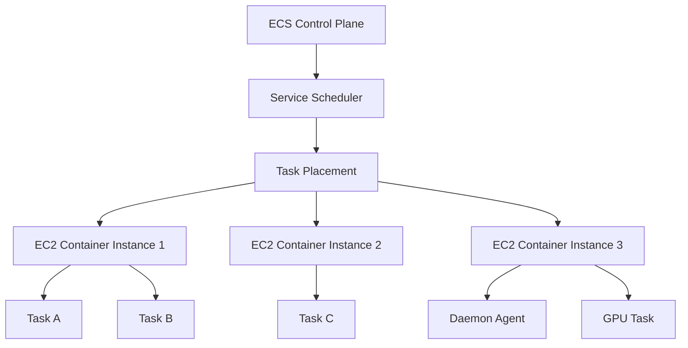
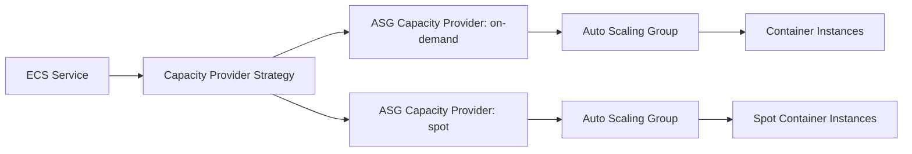
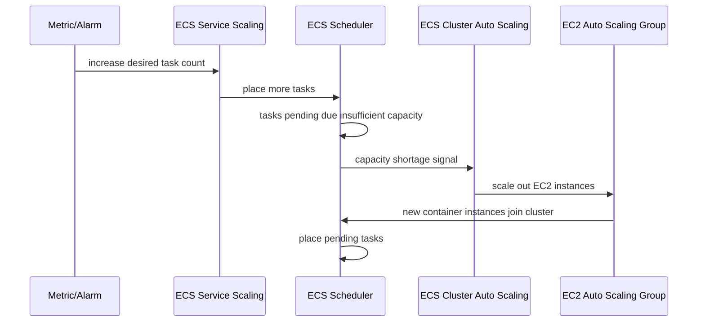
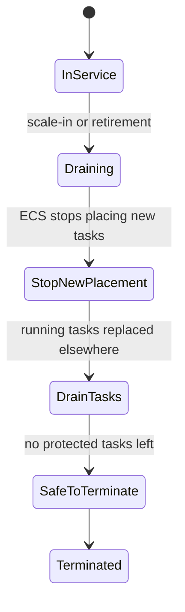
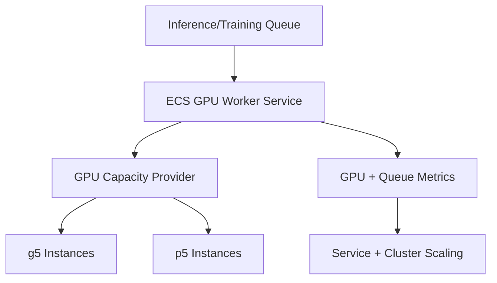
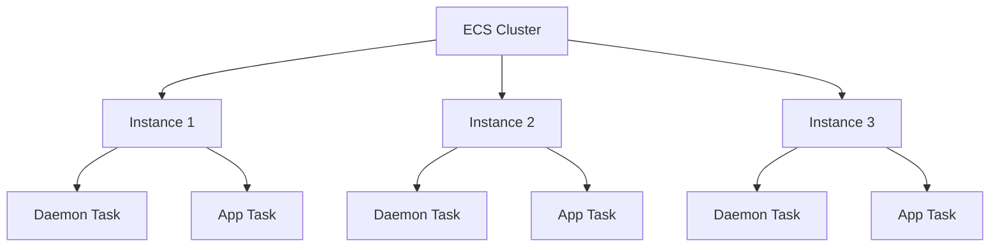
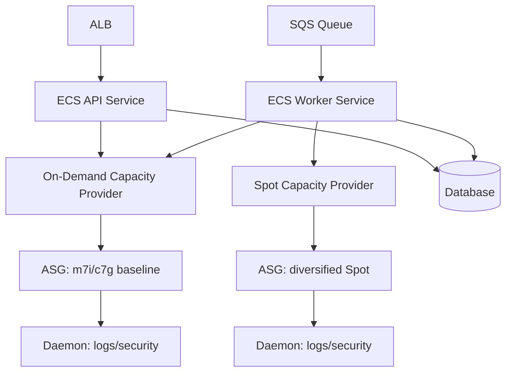

# Part 023 — ECS on EC2: When Fargate Is Not Enough

Fargate adalah default yang bagus untuk banyak tim: tidak perlu mengelola host, patching lebih ringan, capacity planning lebih sederhana, dan failure boundary lebih kecil. Tetapi **Fargate bukan jawaban universal**.

Begitu workload membutuhkan kontrol atas host, device, kernel-adjacent behavior, specialized instance, daemon agent, extreme cost optimization, atau placement yang sangat presisi, kamu mulai keluar dari batas nyaman Fargate. Di titik itu, ECS on EC2 menjadi opsi yang sangat kuat: masih memakai ECS sebagai orchestrator, tetapi data plane-nya berada di EC2 capacity yang kamu kelola.

Intinya:

> ECS on EC2 bukan “versi lama” dari ECS. ECS on EC2 adalah mode ketika kamu menukar operational simplicity dengan kontrol, kapasitas khusus, dan optimasi yang tidak bisa diberikan Fargate.

## 1. Mental Model: Fargate Menghapus Host, EC2 Mengembalikan Host

Pada Fargate, unit capacity yang kamu pikirkan adalah task. Pada ECS on EC2, ada dua level capacity:

1. **Task capacity**: CPU, memory, port, GPU, volume, runtime dependency.
2. **Host capacity**: instance type, AMI, kernel, disk, network, ENI, daemon, agent, instance lifecycle.



ECS tetap melakukan scheduling dan mempertahankan desired state. Tetapi **EC2 instance adalah bagian dari desain arsitektur**, bukan detail tersembunyi.

Konsekuensinya:

- kamu harus mengelola kapasitas host;
- kamu harus memperhatikan patching dan AMI lifecycle;
- kamu harus memperhatikan bin packing;
- kamu harus menangani drain saat scale-in atau instance retirement;
- kamu bisa memilih instance family, storage, GPU, network, kernel feature, dan daemon;
- kamu punya surface area failure yang lebih besar, tetapi juga kontrol yang lebih besar.

## 2. Kapan Fargate Tidak Cukup?

Gunakan ECS on EC2 ketika setidaknya satu kondisi berikut benar.

| Kebutuhan | Mengapa Fargate Bisa Tidak Cukup | Mengapa EC2 Cocok |
|---|---|---|
| GPU/accelerator | Tidak semua specialized device cocok dengan abstraksi Fargate | Pilih GPU instance dan pin GPU ke task |
| Daemon per host | Fargate tidak memberi host yang dapat kamu pasang daemon global | EC2 bisa menjalankan daemon via daemon scheduling/agent |
| Kernel/runtime tuning | Fargate membatasi kontrol host/kernel | EC2 memberi kontrol AMI, sysctl, runtime, disk |
| Specialized instance | Butuh high network, local NVMe, memory-optimized, Graviton mix | Pilih instance family sesuai workload |
| Cost optimization besar | Fargate bayar per task resource; idle/waste pattern bisa mahal | EC2 bisa bin pack, Savings Plans/Reserved/Spot mix |
| Legacy agent | Ada agent host-level untuk security, observability, compliance | Install di AMI/user data/daemon service |
| Heavy sidecar/mesh | Sidecar tax terlalu besar per task di Fargate | Bisa amortize agent/daemon di host |
| Custom storage | Butuh local disk/high IOPS/host path tertentu | Gunakan EC2 instance storage/EBS tuning |
| Extremely high pod/task density | Fargate task isolation bisa lebih mahal | EC2 memungkinkan packing lebih agresif |
| Regulated host evidence | Perlu bukti patch, CIS baseline, EDR, host hardening | EC2 memberi control dan audit trail |

Salah satu tanda paling jelas: ketika desainmu mulai berkata, “Saya butuh tahu host apa yang menjalankan task ini.” Jika pertanyaan host menjadi penting, Fargate mungkin bukan boundary yang tepat.

## 3. Launch Type vs Capacity Provider

Di ECS modern, kamu sebaiknya berpikir menggunakan **capacity provider**, bukan sekadar launch type.

- Launch type menjawab: task berjalan di Fargate atau EC2?
- Capacity provider menjawab: dari pool capacity mana task ditempatkan, bagaimana scaling capacity dilakukan, dan bagaimana strategi campuran diterapkan?

Untuk ECS on EC2, capacity provider biasanya terhubung ke Auto Scaling Group. ECS bisa memakai managed scaling untuk menambah/mengurangi EC2 instance berdasarkan kebutuhan task.



Capacity provider strategy punya dua konsep penting:

- **base**: jumlah task minimum yang harus ditempatkan pada provider tertentu.
- **weight**: distribusi relatif task setelah base terpenuhi.

Contoh pola:

```txt
base on-demand = 4
weight on-demand = 1
weight spot = 4
```

Maknanya: empat task pertama harus aman di on-demand; sisanya mayoritas boleh berjalan di Spot.

## 4. Container Instance Adalah Runtime Substrate

Sebuah ECS container instance adalah EC2 instance yang menjalankan ECS agent dan terdaftar ke ECS cluster. Scheduler menempatkan task ke instance yang punya resource dan memenuhi constraints.

Container instance membawa beberapa tanggung jawab:

- AMI version;
- ECS agent version;
- Docker/container runtime version;
- kernel version;
- instance profile;
- disk layout;
- log driver support;
- GPU driver jika perlu;
- monitoring/security agent;
- user data bootstrap;
- network configuration;
- instance lifecycle hook.

Pada Fargate, semua ini tersembunyi. Pada EC2, semua ini menjadi bagian dari platform.

## 5. ECS-Optimized AMI vs Custom AMI

Default yang sehat adalah memakai ECS-optimized AMI, kecuali ada alasan kuat untuk custom.

Gunakan ECS-optimized AMI ketika:

- workload standar;
- tidak butuh custom kernel/module;
- agent/security bisa dipasang via user data atau daemon;
- ingin mengikuti jalur yang paling sedikit friction.

Gunakan custom AMI ketika:

- perlu preinstall heavy agent;
- perlu hardening baseline khusus;
- perlu driver GPU/accelerator tertentu;
- perlu konfigurasi disk/container runtime khusus;
- perlu compliance evidence yang harus repeatable;
- bootstrap time dari user data terlalu lama.

Anti-pattern umum: membuat custom AMI karena “lebih enterprise”, lalu lupa patch lifecycle. Custom AMI tanpa patch pipeline adalah utang keamanan.

## 6. Placement: Scheduler Membutuhkan Constraint yang Benar

Pada Fargate, placement relatif sederhana: task butuh CPU/memory dan subnet. Pada EC2, placement harus memperhitungkan resource host.

ECS placement terdiri dari:

1. **filtering**: instance mana yang eligible?
2. **strategy**: dari eligible instance, pilih yang mana?

Contoh constraint:

- hanya instance dengan attribute `workload=gpu`;
- hanya instance di AZ tertentu;
- hindari menaruh dua task replika di instance yang sama;
- tempatkan daemon satu per host;
- tempatkan batch task di pool Spot.

Strategi placement umum:

| Strategy | Makna | Cocok Untuk |
|---|---|---|
| `spread` | Sebar task berdasarkan attribute seperti AZ atau instance ID | High availability |
| `binpack` | Padatkan task berdasarkan CPU/memory | Cost optimization |
| `random` | Pilih acak dari eligible instances | Workload sederhana |

Production biasanya menggabungkan `spread` dan `binpack`:

```txt
spread by attribute:ecs.availability-zone
then binpack memory
```

Artinya: sebar antar-AZ dulu, lalu dalam AZ padatkan berdasarkan memory. Ini menjaga availability tanpa membuang capacity terlalu banyak.

## 7. Bin Packing: Optimasi Cost yang Bisa Menjadi Failure Mode

Bin packing adalah seni menaruh task sebanyak mungkin di instance yang tersedia. Tujuannya mengurangi idle resource.

Masalahnya: bin packing agresif bisa meningkatkan blast radius.

Misalnya satu instance `m7i.4xlarge` menjalankan:

- 12 API task;
- 4 worker task;
- 1 log router;
- 1 security agent.

Jika instance mati, kamu kehilangan banyak task sekaligus. ECS akan mengganti task, tetapi recovery tergantung:

- apakah ada spare capacity;
- apakah cluster autoscaling cepat;
- apakah image pull cepat;
- apakah service bisa menerima capacity drop sementara;
- apakah load balancer health check cukup tepat.

Rule praktis:

> Jangan optimasi bin packing sampai kamu tahu berapa task yang boleh hilang bersamaan tanpa melanggar SLO.

## 8. Cluster Autoscaling: Dua Control Loop yang Harus Sinkron

ECS on EC2 punya dua scaling loop:

1. **Service Auto Scaling** mengubah desired task count.
2. **Cluster Auto Scaling** mengubah jumlah EC2 instance.



Failure mode klasik:

- service scaling naik cepat;
- task masuk `PENDING` karena tidak ada capacity;
- ASG scale out lambat;
- instance bootstrap lama;
- ALB melihat capacity rendah;
- autoscaling menaikkan desired count lagi;
- backlog makin besar.

Mitigasi:

- maintain warm capacity untuk workload latency-sensitive;
- gunakan base on-demand capacity;
- pre-bake AMI agar bootstrap cepat;
- pakai image pull cache jika sesuai;
- sizing instance sesuai task shape;
- gunakan scaling metric yang stabil, bukan noise;
- set cooldown secara sadar.

## 9. Managed Scaling dan Target Capacity

Managed scaling pada ASG capacity provider membantu ECS mengatur jumlah instance yang dibutuhkan. `targetCapacity` kira-kira menyatakan tingkat utilisasi cluster yang diinginkan.

Contoh:

- `targetCapacity = 100`: ECS mencoba menggunakan capacity penuh sebelum scale out.
- `targetCapacity = 80`: sisakan sekitar 20% headroom.

Untuk API production yang harus cepat menyerap traffic spike, target 100% sering terlalu agresif. Untuk batch murah, target tinggi bisa masuk akal.

Model keputusan:

| Workload | Target Capacity Cenderung | Alasan |
|---|---:|---|
| Critical API | 70–85% | Butuh headroom |
| Async worker | 80–95% | Backlog bisa menyerap delay |
| Batch | 90–100% | Cost lebih penting dari latency |
| Spot-heavy | 70–85% | Perlu ruang saat interruption |
| GPU | Sangat tergantung | GPU fragmentation sering lebih penting dari CPU |

## 10. Managed Termination Protection dan Draining

Scale-in EC2 bisa berbahaya jika instance yang dihentikan masih menjalankan task penting. ECS mendukung managed termination protection agar ASG tidak menghentikan instance yang masih dibutuhkan sampai task di-drain.

Lifecycle yang diinginkan:



Checklist scale-in aman:

- capacity provider managed termination protection aktif;
- ASG instance scale-in protection sesuai requirement;
- ECS container instance masuk `DRAINING` sebelum terminate;
- task punya graceful shutdown;
- ALB deregistration delay sinkron dengan shutdown budget;
- worker berhenti mengambil job baru saat termination;
- log flush selesai sebelum container mati.

## 11. Workload GPU dan Accelerator

ECS on EC2 cocok untuk GPU karena kamu bisa memilih GPU instance dan task definition dapat meminta GPU resource.

Pola umum:

- cluster capacity provider khusus GPU;
- instance attribute `accelerator=nvidia`;
- placement constraint untuk task GPU;
- AMI dengan driver/container runtime yang benar;
- autoscaling berbasis queue depth/job demand;
- observability GPU memory/utilization;
- fallback queue saat GPU capacity tidak tersedia.



Failure modes GPU:

- task pending karena tidak ada GPU yang cukup;
- driver mismatch;
- GPU fragmentation;
- instance bootstrap lama;
- Spot interruption mahal karena job tidak checkpoint;
- GPU utilization rendah karena bottleneck CPU/network/storage;
- satu host GPU mati menghilangkan banyak kapasitas mahal.

Untuk GPU, jangan hanya autoscale berdasarkan CPU. CPU bisa rendah sementara GPU penuh, atau GPU rendah karena data loader bottleneck.

## 12. Daemon Workloads

Kadang kamu butuh satu agent per host:

- log collector;
- security scanner;
- runtime monitor;
- service mesh node agent;
- custom metrics exporter;
- node-local cache;
- file shipping agent;
- compliance agent.

Pada ECS on EC2, kamu bisa menjalankan daemon service yang menempatkan satu task per container instance.

Pola:



Perhatikan daemon tax. Jika setiap host butuh 300 MiB memory dan 0.1 vCPU untuk daemon, capacity planning harus menguranginya dari allocatable capacity. Banyak platform gagal bin packing karena lupa menghitung daemon overhead.

## 13. Host-Level Observability

Fargate memaksa kamu berpikir task-level. EC2 memungkinkan host-level observability.

Tambahkan telemetry untuk:

- CPU steal;
- memory pressure;
- disk utilization;
- inode usage;
- network packets/errors;
- conntrack usage;
- ECS agent status;
- Docker/container runtime health;
- image pull latency;
- daemon resource usage;
- GPU health jika ada;
- instance retirement/interruption events.

Golden signals untuk ECS on EC2:

| Layer | Signal |
|---|---|
| Service | request rate, error rate, latency, saturation |
| Task | CPU, memory, restart, stop reason, health |
| Scheduler | pending tasks, placement failures, deployment state |
| Cluster | registered instances, draining instances, capacity reservation |
| Host | disk, memory, network, agent health, instance events |
| Autoscaling | desired tasks, desired instances, scaling lag |

## 14. Disk dan Image Pressure

Pada EC2, container image layers dan logs memakai disk host. Jika disk penuh, host bisa menjadi failure amplifier.

Masalah umum:

- image lama tidak dibersihkan;
- log file tumbuh tanpa batas;
- application temp files tidak dikontrol;
- ephemeral jobs meninggalkan artifact;
- Docker overlay storage penuh;
- inode habis meskipun byte masih tersedia.

Mitigasi:

- atur ECS/container runtime cleanup;
- gunakan log driver yang tidak menyimpan file besar lokal;
- monitor disk dan inode;
- gunakan AMI dengan disk size yang masuk akal;
- pisahkan workload heavy temp storage ke pool sendiri;
- jangan menjalankan batch scratch-heavy bersama API latency-sensitive.

## 15. Networking: EC2 Memberi Lebih Banyak Knob

Pada Fargate, `awsvpc` adalah model utama. Pada ECS on EC2, kamu bisa memiliki mode jaringan berbeda, tetapi untuk production modern `awsvpc` tetap sering paling aman karena security group per task dan isolation lebih jelas.

Namun, EC2 membawa constraint tambahan:

- ENI density per instance;
- IP address pressure;
- port mapping jika memakai bridge/host;
- security group model;
- agent/daemon traffic;
- instance-level egress;
- metadata service protection;
- noisy neighbor network issue.

Rule praktis:

> Kalau compliance dan service boundary penting, pilih network model yang membuat identity dan traffic boundary mudah diaudit, bukan hanya yang paling hemat IP.

## 16. Security Boundary ECS on EC2

ECS on EC2 lebih fleksibel, tetapi boundary-nya lebih lemah dibanding Fargate jika tidak di-hardening.

Risiko utama:

- container dapat mencoba mengakses EC2 Instance Metadata Service;
- task role dan instance profile tercampur secara mental;
- privileged container membuka host escape risk;
- host agent menjadi high-privilege component;
- custom AMI tertinggal patch;
- shared host memperbesar lateral movement;
- log/secret file tertinggal di disk host.

Minimum controls:

- gunakan IAM role for tasks untuk app permission;
- block akses container ke IMDS jika task tidak membutuhkannya;
- minimalkan instance profile;
- hindari privileged container;
- non-root container;
- read-only filesystem jika memungkinkan;
- security group ketat;
- patch pipeline untuk AMI;
- runtime monitoring;
- drain sebelum terminate;
- audit ECS API dan instance access.

Part 024 akan membahas hardening ini lebih dalam.

## 17. Cost Model ECS on EC2

Fargate cost mudah dihitung: vCPU/memory per task duration. ECS on EC2 cost lebih kompleks, tetapi bisa lebih murah pada scale tertentu.

Cost surface ECS on EC2:

- EC2 instance hourly cost;
- idle headroom;
- Spot interruption/retry cost;
- EBS volume cost;
- NAT/VPC endpoint cost;
- log/metric/tracing cost;
- AMI maintenance;
- platform engineering time;
- security tooling;
- incident cost karena host-level issue.

ECS on EC2 menang ketika:

- task density tinggi dan stabil;
- workload punya predictable baseline;
- kamu bisa bin pack dengan aman;
- ada Savings Plans/Reserved/Spot strategy;
- operational team mature;
- host customization memberi value nyata.

Fargate menang ketika:

- traffic bursty;
- team kecil;
- workload stateless sederhana;
- host management bukan value differentiator;
- compliance tidak membutuhkan host-level custom control;
- ingin meminimalkan platform surface area.

## 18. Instance Family Selection

Jangan pilih instance berdasarkan “besar”. Pilih berdasarkan shape.

| Workload Shape | Instance Family Bias | Catatan |
|---|---|---|
| Java API CPU-bound | compute/general purpose | Perhatikan p95 latency saat GC |
| Java API memory-heavy | memory optimized | Hindari swap/host pressure |
| Async worker mixed | general purpose | Scaling via queue depth |
| ML inference | GPU/accelerated | Monitor GPU, CPU, memory, network |
| Log/telemetry heavy | network/storage optimized | Hindari disk bottleneck |
| Batch scratch-heavy | storage optimized | Pisahkan dari API |
| Arm-compatible services | Graviton | Validasi image architecture dan deps |

Production rule:

> Instance type adalah bagian dari API kapasitas platform. Ubah dengan change management, benchmark, dan rollback plan.

## 19. AMI and Node Rotation Strategy

ECS on EC2 tidak boleh bergantung pada instance yang hidup selamanya.

Targetkan:

- immutable AMI;
- launch template versioning;
- rolling instance refresh;
- drain before terminate;
- health validation setelah join cluster;
- canary instance pool;
- automatic rollback jika new AMI menyebabkan placement failure;
- patch cadence jelas.

Anti-pattern:

- SSH ke host untuk memperbaiki manual;
- patch in-place tanpa replacement;
- launch template tidak versioned;
- custom AMI tidak reproducible;
- tidak tahu agent version yang berjalan;
- tidak ada inventory instance.

## 20. Decision Framework: ECS on EC2 vs Fargate

Gunakan pertanyaan berikut.

### 20.1 Apakah host control memberi value nyata?

Jika tidak, tetap Fargate.

Host control bernilai jika:

- butuh GPU/device;
- butuh daemon;
- butuh custom kernel/runtime;
- butuh local disk khusus;
- perlu host-level security evidence;
- cost saving lebih besar daripada operational cost.

### 20.2 Apakah tim siap mengoperasikan host lifecycle?

Jika belum, jangan masuk ECS on EC2 hanya untuk menghemat sedikit biaya.

Tim harus mampu:

- patch AMI;
- debug placement failure;
- debug disk/network/agent issue;
- mengelola draining;
- menjalankan capacity simulation;
- menangani Spot interruption;
- menjaga observability host-level.

### 20.3 Apakah failure blast radius diterima?

EC2 packing bisa membuat satu host failure menjatuhkan banyak task. Jika service tidak punya redundancy cukup, Fargate isolation bisa lebih aman.

### 20.4 Apakah workload stabil?

ECS on EC2 lebih mudah dioptimasi untuk baseline stabil. Untuk burst kecil tidak menentu, Fargate sering lebih sederhana.

## 21. Production Blueprint: Mixed ECS Capacity

Arsitektur umum yang matang:



Policy:

- API baseline on-demand;
- API optional burst on Fargate atau EC2 on-demand;
- workers Spot-heavy dengan checkpoint/idempotency;
- daemon observability per host;
- managed termination protection;
- ASG instance refresh with draining;
- capacity provider target capacity berbeda per pool.

## 22. Runbook: Task Stuck in PENDING on ECS on EC2

Gejala: desired task naik, tetapi task tidak `RUNNING`.

Debug flow:

1. Cek service events.
2. Cek stopped/pending task reason.
3. Cek apakah cluster punya registered container instances.
4. Cek CPU/memory available.
5. Cek port/GPU/attribute constraint.
6. Cek subnet/security group jika `awsvpc`.
7. Cek ENI/IP capacity.
8. Cek capacity provider dan ASG desired capacity.
9. Cek instance bootstrap dan ECS agent status.
10. Cek image pull permission/network.
11. Cek daemon overhead yang menghabiskan resource.
12. Cek placement strategy terlalu ketat.

Common root causes:

- task memory lebih besar dari instance capacity tersisa;
- placement constraint salah;
- GPU task tidak punya GPU pool;
- ASG max capacity terlalu kecil;
- capacity provider tidak attached;
- instance tidak join cluster;
- ECS agent outdated/broken;
- subnet kehabisan IP;
- execution role tidak bisa pull image/secrets;
- image architecture tidak cocok dengan instance architecture.

## 23. Runbook: Instance Terminated, Banyak Task Hilang

Pertanyaan utama: apakah ini expected scale-in, Spot interruption, instance failure, atau manual termination?

Langkah:

1. Cek EC2 instance state transition reason.
2. Cek Auto Scaling activity.
3. Cek ECS container instance status: `ACTIVE`, `DRAINING`, atau gone.
4. Cek apakah managed termination protection aktif.
5. Cek task stopped reason.
6. Cek apakah replacement task berhasil ditempatkan.
7. Cek ALB target health dan traffic impact.
8. Cek apakah service desired count terpenuhi.
9. Cek apakah capacity provider scale out.
10. Cek SLO impact dan error budget.

Mitigasi jangka panjang:

- aktifkan draining path yang benar;
- spread task across instances/AZ;
- jangan binpack replika critical di satu host;
- tambahkan warm spare capacity;
- gunakan lifecycle hook;
- uji Spot interruption;
- pastikan app graceful shutdown.

## 24. Lab: Migrasi Service dari Fargate ke ECS on EC2

Tujuan lab:

- memahami apa yang berubah saat host kembali terlihat;
- menguji placement dan autoscaling;
- mengamati failure mode EC2 capacity.

Langkah besar:

1. Ambil service Fargate stateless sederhana.
2. Buat ECS cluster dengan ASG capacity provider.
3. Gunakan ECS-optimized AMI.
4. Tambahkan daemon log/security dummy.
5. Deploy service dengan placement `spread` by AZ.
6. Ubah strategy menjadi `binpack` memory.
7. Jalankan load test ringan.
8. Naikkan desired count sampai ada pending task.
9. Amati cluster autoscaling.
10. Drain satu instance.
11. Validasi task replacement dan ALB health.
12. Simulasikan disk pressure.
13. Dokumentasikan runbook.

Output yang harus kamu hasilkan:

- decision memo Fargate vs EC2;
- capacity model;
- placement policy;
- autoscaling policy;
- runbook task pending;
- runbook instance drain;
- security checklist host-level.

## 25. Engineering Heuristics

1. **Fargate first, EC2 when justified.** Jangan pilih EC2 karena nostalgia atau micro-optimization.
2. **Host control is not free.** Setiap knob host membawa lifecycle, patch, monitoring, dan incident mode.
3. **Bin packing harus tunduk pada SLO.** Cost saving tidak boleh menghancurkan blast radius.
4. **Daemon tax harus dihitung.** Agent kecil per host bisa menjadi cost besar di fleet besar.
5. **Warm capacity adalah reliability feature.** Cluster yang selalu 100% penuh mudah collapse saat spike.
6. **Spot cocok untuk workload yang bisa kehilangan progress.** Jika job tidak idempotent atau checkpointable, Spot bisa mahal.
7. **AMI adalah artifact.** Treat AMI seperti container image: versioned, tested, promoted, rollbackable.
8. **Placement constraints adalah policy.** Salah constraint bisa membuat capacity tampak ada tetapi tidak usable.
9. **Scale-in lebih berbahaya daripada scale-out.** Scale-out gagal biasanya lambat; scale-in buruk bisa langsung menjatuhkan task sehat.
10. **Jangan SSH sebagai operasi normal.** Jika debugging butuh SSH rutin, platform belum matang.

## 26. Checklist Production Readiness ECS on EC2

| Area | Pertanyaan |
|---|---|
| Capacity | Apakah ASG max cukup untuk worst-case? |
| Placement | Apakah replika critical tersebar antar instance/AZ? |
| Scaling | Apakah service scaling dan cluster scaling sinkron? |
| Draining | Apakah scale-in melakukan draining sebelum terminate? |
| AMI | Apakah AMI reproducible dan punya patch cadence? |
| Agent | Apakah ECS agent/container runtime dimonitor? |
| Disk | Apakah disk dan inode dimonitor? |
| Security | Apakah container tidak bisa mengambil instance profile credential? |
| IAM | Apakah task role dan execution role dipisah? |
| Spot | Apakah interruption handling diuji? |
| Observability | Apakah host, task, scheduler, dan ASG event terkorelasi? |
| Runbook | Apakah pending task dan instance drain punya runbook? |

## 27. Kesimpulan

ECS on EC2 adalah pilihan untuk engineer yang butuh kontrol lebih dalam atas data plane container. Ia memberi akses ke GPU, daemon, host tuning, specialized instance, dan cost optimization yang sulit dilakukan di Fargate. Tetapi trade-off-nya nyata: kamu mengambil kembali host lifecycle, capacity engineering, placement complexity, patching, security hardening, dan host-level failure modes.

Mental model paling penting:

> Fargate mengoptimalkan simplicity. ECS on EC2 mengoptimalkan control. Pilih EC2 hanya ketika control itu menghasilkan value yang lebih besar daripada operational complexity-nya.

Jika kamu memilih ECS on EC2, perlakukan cluster sebagai platform: punya AMI pipeline, capacity provider strategy, draining policy, placement rules, security baseline, observability, runbook, dan failure drills.

## References

- AWS ECS Developer Guide — Cluster Auto Scaling: https://docs.aws.amazon.com/AmazonECS/latest/developerguide/cluster-auto-scaling.html
- AWS ECS Developer Guide — EC2 Capacity Providers: https://docs.aws.amazon.com/AmazonECS/latest/developerguide/asg-capacity-providers.html
- AWS ECS Developer Guide — Container Instances: https://docs.aws.amazon.com/AmazonECS/latest/developerguide/create-capacity.html
- AWS ECS Developer Guide — Task Placement: https://docs.aws.amazon.com/AmazonECS/latest/developerguide/task-placement.html
- AWS ECS Developer Guide — Task Placement Strategies: https://docs.aws.amazon.com/AmazonECS/latest/developerguide/task-placement-strategies.html
- AWS ECS Developer Guide — Managed Termination Protection: https://docs.aws.amazon.com/AmazonECS/latest/developerguide/managed-termination-protection.html
- AWS ECS Developer Guide — GPU Workloads: https://docs.aws.amazon.com/AmazonECS/latest/developerguide/ecs-gpu.html
