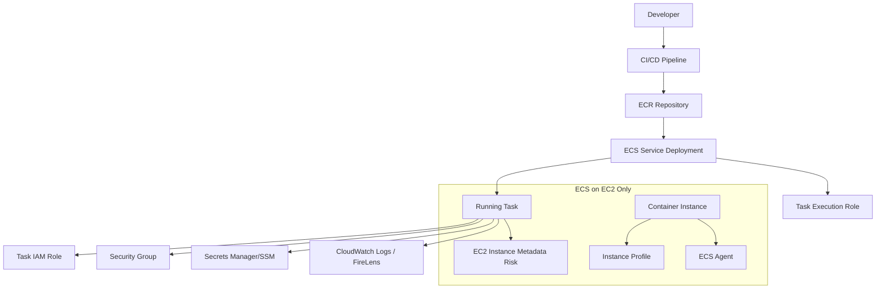
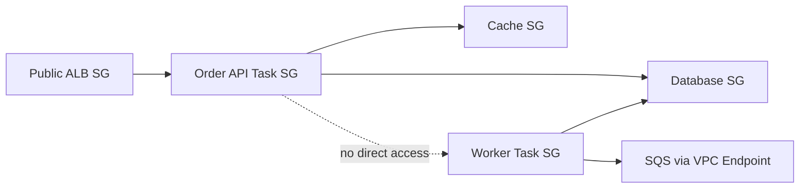
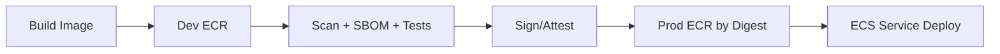
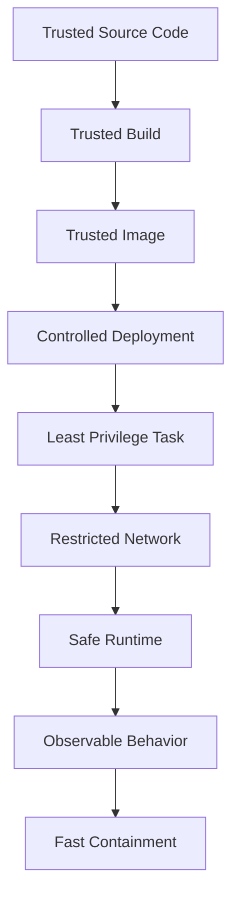

# Part 024 — ECS Security Hardening

Security ECS yang matang bukan hanya “task role least privilege”. ECS security adalah rangkaian boundary:

- siapa boleh deploy;
- image apa yang boleh dijalankan;
- container boleh mengakses apa;
- task boleh berbicara ke service mana;
- secret masuk lewat jalur apa;
- metadata/credential diekspos sejauh mana;
- host dikontrol siapa;
- log dan audit evidence disimpan di mana;
- bagaimana insiden container ditahan agar tidak menjadi insiden akun.

ECS memberi kamu orchestrator. Security-nya tetap harus kamu desain.

> Container security yang baik tidak mengandalkan satu dinding besar. Ia memakai banyak boundary kecil: identity, image, network, runtime, secret, deployment, audit, dan blast-radius control.

## 1. Threat Model ECS

Sebelum hardening, definisikan apa yang kamu cegah.

Threat model umum:

| Threat | Contoh |
|---|---|
| Compromised application | RCE di service Java lalu attacker memakai task role |
| Overprivileged task role | API service bisa menghapus data yang seharusnya hanya worker boleh akses |
| Image supply-chain compromise | Base image berisi malware atau dependency vulnerable |
| Secret leakage | Secret muncul di env dump, logs, crash report, atau shell |
| Metadata credential theft | Container mencoba mengambil instance profile credential di ECS on EC2 |
| Lateral movement | Service A bisa mengakses Service B/database tanpa boundary |
| Bad deployment | Image tidak terscan/ditandatangani masuk production |
| Host escape | Privileged container/host mount memberi akses host |
| Log exfiltration | Sensitive payload masuk log dan bisa dibaca banyak pihak |
| Debug backdoor | ECS Exec/SSM/SSH terlalu longgar |

Hardening dimulai dari pertanyaan:

> Jika container ini compromise, apa batas kerusakan maksimal dalam 5 menit pertama?

## 2. Security Boundary Map



Boundary penting:

- **CI/CD boundary**: siapa boleh membuat image/deploy.
- **Registry boundary**: image mana yang trusted.
- **Task execution role**: permission untuk ECS agent menarik image, menulis log, mengambil secret saat startup.
- **Task role**: permission aplikasi di dalam container.
- **Network boundary**: security group, subnet, endpoint, route.
- **Runtime boundary**: user, filesystem, capabilities, privileged mode.
- **Host boundary**: khusus ECS on EC2.
- **Audit boundary**: CloudTrail, deployment record, image digest, log correlation.

## 3. Task Role vs Task Execution Role

Ini konsep yang wajib benar.

| Role | Dipakai Oleh | Untuk Apa | Contoh Permission |
|---|---|---|---|
| Task execution role | ECS agent/Fargate agent | Pull image, send logs, fetch startup secrets | `ecr:GetAuthorizationToken`, `logs:PutLogEvents`, `secretsmanager:GetSecretValue` |
| Task role | Application code di container | Akses AWS service saat runtime | `s3:GetObject`, `sqs:SendMessage`, `dynamodb:PutItem` |

Kesalahan umum:

- memberi permission aplikasi ke execution role;
- memberi permission pull/log/secrets ke task role;
- memakai satu role untuk semua service;
- role terlalu luas karena “biar deploy jalan dulu”;
- tidak membatasi resource ARN;
- tidak memakai condition key ketika bisa.

Rule:

> Execution role adalah permission platform untuk menjalankan container. Task role adalah permission aplikasi untuk melakukan pekerjaan bisnis.

## 4. IAM Role Design per Service

Jangan membuat satu role `ecsTaskRole` untuk semua service. Buat role per service atau per capability.

Contoh:

```txt
prod-order-api-task-role
prod-order-worker-task-role
prod-invoice-generator-task-role
prod-case-escalation-worker-task-role
```

Role harus menjawab:

- service apa yang memakai role ini?
- AWS API apa yang dibutuhkan?
- resource ARN mana yang boleh diakses?
- apakah akses read/write dipisah?
- apakah environment/account dibatasi?
- apakah ada permission temporal yang harus expire?
- apakah CloudTrail bisa mengatribusikan aksi ke service?

Contoh policy pattern untuk worker yang hanya boleh consume queue tertentu dan menulis object ke prefix tertentu:

```json
{
  "Version": "2012-10-17",
  "Statement": [
    {
      "Effect": "Allow",
      "Action": [
        "sqs:ReceiveMessage",
        "sqs:DeleteMessage",
        "sqs:ChangeMessageVisibility",
        "sqs:GetQueueAttributes"
      ],
      "Resource": "arn:aws:sqs:ap-southeast-1:111122223333:prod-case-work-queue"
    },
    {
      "Effect": "Allow",
      "Action": [
        "s3:PutObject",
        "s3:AbortMultipartUpload"
      ],
      "Resource": "arn:aws:s3:::prod-case-artifacts/generated/*"
    }
  ]
}
```

Security review question:

> Jika service ini compromise, apakah role-nya cukup sempit sehingga attacker hanya bisa merusak bounded context service ini?

## 5. Confused Deputy dan Trust Policy

Task role perlu trust policy yang mengizinkan ECS tasks mengasumsikan role. Jangan hanya fokus pada permission policy; trust policy juga boundary.

Hal yang perlu dicek:

- role hanya diasumsikan oleh service principal yang benar;
- gunakan condition untuk membatasi source account jika tersedia;
- hindari role yang dapat diasumsikan cross-account tanpa guardrail;
- jangan reuse role yang juga dipakai humans atau CI/CD.

Mental model:

- Permission policy menjawab: setelah punya role, boleh melakukan apa?
- Trust policy menjawab: siapa yang boleh mendapatkan role itu?

Keduanya harus benar.

## 6. Network Isolation: Security Group sebagai Service Contract

Security group bukan hanya firewall. Untuk ECS, security group adalah kontrak komunikasi service.

Pola sehat:



Aturan:

- expose public hanya di ALB/API Gateway/CloudFront layer;
- task di private subnet jika tidak harus public;
- inbound task hanya dari ALB/internal callers yang sah;
- outbound jangan `0.0.0.0/0` tanpa alasan;
- gunakan VPC endpoints untuk AWS service traffic jika butuh private path dan mengurangi NAT dependency;
- database hanya menerima dari task SG tertentu;
- pisahkan SG per service, bukan satu SG untuk semua ECS tasks.

Anti-pattern:

```txt
all-ecs-tasks-sg
inbound: 0.0.0.0/0 all ports
outbound: 0.0.0.0/0 all ports
```

Ini bukan engineering shortcut; ini menghapus boundary antar-service.

## 7. Private Subnet, NAT, dan VPC Endpoint

Private subnet bukan otomatis aman. Private subnet hanya berarti tidak punya direct public route. Task masih bisa keluar via NAT dan masih bisa mengakses banyak AWS services jika IAM/network membolehkan.

Hardening path:

- gunakan private subnet untuk task internal;
- gunakan interface/gateway VPC endpoints untuk ECR, CloudWatch Logs, Secrets Manager, SSM, SQS/SNS jika sesuai;
- batasi endpoint policy jika memungkinkan;
- monitor NAT traffic dan unexpected egress;
- gunakan egress proxy jika regulated environment membutuhkan traffic inspection.

Bootstrap dependency ECS/Fargate umumnya melibatkan:

- ECR API untuk auth;
- ECR DKR untuk image pull;
- S3 untuk layer/object path tertentu;
- CloudWatch Logs;
- Secrets Manager/SSM jika injecting secrets;
- ECS APIs;
- KMS jika decrypting secret/log/storage.

Jika kamu membuat private-only cluster, pastikan dependency ini reachable secara sadar, bukan kebetulan lewat NAT besar.

## 8. Secrets: Inject, Rotate, Do Not Leak

Secret handling di ECS biasanya melalui:

- Secrets Manager;
- Systems Manager Parameter Store;
- environment variable injection;
- sidecar/volume pattern;
- application fetch at runtime.

Security trade-off:

| Pattern | Kelebihan | Risiko |
|---|---|---|
| Env var injection | Sederhana, native ECS | Secret dapat terlihat dalam process env/dump jika akses runtime bocor |
| Runtime fetch | Bisa refresh/rotate lebih fleksibel | App butuh IAM permission dan caching benar |
| File/volume | Cocok untuk cert/key material | File permission dan lifecycle harus dijaga |
| Sidecar secret agent | Dynamic dan centralized | Tambah komponen privileged/complexity |

Rule praktis:

- jangan masukkan secret ke image;
- jangan simpan secret di task definition plaintext;
- jangan log env vars;
- pisahkan secret per service/environment;
- task execution role hanya boleh membaca startup secret yang diperlukan;
- task role hanya boleh membaca runtime secret yang memang harus diambil app;
- rotasi secret harus punya deployment/reload plan;
- pastikan secret tidak muncul di exception/error payload.

Secret rotation failure mode:

1. secret dirotasi;
2. existing task masih memakai connection lama;
3. database menolak credential lama;
4. service error massal;
5. autoscaling menambah task, tetapi task baru mengambil secret baru;
6. sebagian fleet sehat, sebagian gagal;
7. debugging sulit karena versi credential tidak terlihat.

Mitigasi:

- dual credential rotation;
- connection pool reconnect policy;
- task restart strategy;
- config version metric;
- secret version audit;
- alarm pada auth failure.

## 9. Image Hardening

Image adalah executable supply chain. Hardening image minimal:

- gunakan base image yang jelas owner-nya;
- pin by digest untuk production deployment;
- non-root user;
- minimalkan package manager/tooling di runtime;
- hapus build tools dari runtime image;
- `.dockerignore` benar;
- scan OS dan language dependencies;
- SBOM generated;
- sign image jika pipeline mendukung;
- enforce immutable tags atau digest promotion;
- patch base image secara berkala;
- jangan deploy image yang belum melewati gate.

Runtime Dockerfile pattern:

```dockerfile
FROM eclipse-temurin:21-jre-alpine

RUN addgroup -S app && adduser -S app -G app
WORKDIR /app
COPY --chown=app:app app.jar /app/app.jar
USER app

EXPOSE 8080
ENTRYPOINT ["java", "-XX:MaxRAMPercentage=75", "-jar", "/app/app.jar"]
```

Catatan: Alpine/musl vs glibc harus diuji. Jangan pilih base image kecil jika native dependency atau JVM behavior menjadi unpredictable.

## 10. Runtime Hardening Container

Task definition harus mengekspresikan runtime boundary.

Controls:

- `readonlyRootFilesystem` jika app bisa;
- `user` non-root;
- drop Linux capabilities jika memakai EC2 launch type dengan config yang relevan;
- hindari `privileged`;
- batasi mount volume;
- jangan mount Docker socket;
- set resource limits realistis;
- health check tidak membocorkan secret;
- log driver aman;
- firelens config tidak mengirim data sensitif ke tujuan tidak sah.

Anti-pattern berbahaya:

```json
{
  "privileged": true,
  "mountPoints": [
    { "sourceVolume": "docker-sock", "containerPath": "/var/run/docker.sock" }
  ]
}
```

Mount Docker socket sering setara dengan memberi kontrol host/container runtime. Hindari kecuali benar-benar desain platform security yang matang.

## 11. Fargate-Specific Hardening

Fargate mengurangi host management, tetapi bukan berarti zero security work.

Checklist Fargate:

- task role least privilege;
- execution role least privilege;
- private subnet jika workload internal;
- SG per service;
- secrets via Secrets Manager/SSM;
- image scan gate;
- read-only root filesystem jika possible;
- disable unnecessary debug shell/tooling;
- CloudWatch/FireLens log routing aman;
- ECS Exec dibatasi;
- ephemeral storage encryption/KMS requirement dievaluasi;
- GuardDuty Runtime Monitoring dipertimbangkan untuk sensitive workloads.

Kelebihan Fargate:

- tidak ada shared EC2 host yang kamu kelola;
- instance profile leakage bukan mode utama;
- patching host underlying dikelola AWS;
- blast radius host-level lebih kecil dari cluster EC2 shared.

Tetapi task compromise tetap bisa menggunakan task role, network access, dan data-plane permission.

## 12. ECS on EC2-Specific Hardening

ECS on EC2 butuh tambahan kontrol.

### 12.1 Block Container Access to IMDS

Risiko terbesar: container mengakses EC2 Instance Metadata Service dan mengambil instance profile credentials. Jika instance profile punya permission luas, compromised container naik level menjadi compromised instance role.

Mitigasi:

- gunakan IAM roles for tasks;
- minimalkan instance profile;
- block container access ke IMDS jika tidak dibutuhkan;
- gunakan IMDSv2 untuk instance;
- monitor metadata access anomaly;
- jangan beri instance profile permission aplikasi.

### 12.2 Instance Profile Harus Minimal

Instance profile hanya untuk host/agent needs, bukan aplikasi.

Instance profile tidak boleh punya:

- akses database aplikasi;
- akses bucket bisnis luas;
- permission admin;
- permission deploy;
- permission decrypt secret aplikasi luas.

### 12.3 Host Patch dan AMI Lifecycle

Controls:

- ECS-optimized AMI atau custom AMI reproducible;
- patch cadence;
- instance refresh;
- vulnerability scanning host;
- EDR/security agent jika dibutuhkan;
- no persistent manual changes;
- SSH disabled atau sangat dibatasi;
- SSM Session Manager dengan audit jika akses break-glass diperlukan.

### 12.4 Privileged Container Review

Privileged container harus menjadi exception dengan approval. Jika perlu privileged untuk agent, pisahkan cluster/pool-nya dan batasi service lain dari host tersebut.

## 13. ECS Exec Security

ECS Exec berguna untuk debugging, tetapi berbahaya jika tidak digovern.

Risiko:

- shell access ke production container;
- secret/env inspection;
- command execution yang tidak tercatat cukup detail;
- bypass deployment pipeline;
- perubahan manual yang tidak reproducible.

Policy sehat:

- disabled by default;
- enabled per service dengan justification;
- IAM condition membatasi siapa boleh exec;
- require MFA/session controls jika organisasi mendukung;
- log session command/output sesuai kebutuhan compliance;
- break-glass process;
- time-bound access;
- no ECS Exec untuk container yang memegang secret sangat sensitif kecuali ada approval.

Pertanyaan review:

> Apakah engineer bisa membuka shell production tanpa ticket, tanpa audit, dan tanpa expiry?

Jika iya, hardening belum selesai.

## 14. Deployment Permission Boundary

Sering kali yang paling berbahaya bukan task role, tetapi permission deploy.

Jika seseorang bisa update task definition production ke image arbitrary, ia bisa menjalankan kode dengan task role production. Maka deploy permission adalah permission untuk mengeksekusi kode dalam trust boundary production.

Controls:

- hanya CI/CD role yang boleh update ECS service production;
- humans tidak deploy langsung kecuali break-glass;
- task definition registration dibatasi;
- ECR repository policy membatasi push;
- production deploy hanya dari signed/approved artifact;
- image digest dicatat;
- deployment approval untuk service sensitif;
- CloudTrail alert untuk manual update service.

Security invariant:

> Siapa pun yang bisa mengubah image production secara efektif bisa menggunakan semua permission task role production.

## 15. ECR and Registry Policy

ECR hardening:

- immutable tags untuk production repos;
- lifecycle policy jelas;
- scan on push atau enhanced scanning;
- cross-account pull dibatasi;
- repository policy least privilege;
- deny unencrypted/insecure transport jika applicable;
- replication hanya ke account/region yang sah;
- pull-through cache governance;
- protected repository untuk base image internal.

Promotion model sehat:



Jangan deploy production dari mutable `latest`.

## 16. Logging Without Leaking

Container logs sering menjadi exfiltration channel tidak sengaja.

Controls:

- structured logging;
- redaction middleware;
- no full request body by default;
- no authorization header;
- no cookies/token;
- no secret/env dump;
- no stack trace dengan sensitive context di production response;
- restrict log group access;
- log retention policy;
- encrypt logs if required;
- audit queries untuk sensitive logs.

Java-specific traps:

- exception message dari JDBC/HTTP client bisa membawa credential/URL;
- debug logging framework aktif di production;
- actuator/env endpoint terekspos;
- thread dump menyimpan secret di memory string;
- request/response logging interceptor terlalu agresif.

## 17. Multi-Tenancy Boundary

Jika satu ECS cluster menjalankan banyak team/service, cluster bukan otomatis security boundary yang kuat.

Boundary yang bisa dipakai:

- account per environment/domain;
- cluster per trust zone;
- security group per service;
- IAM role per service;
- ECR repo per service/domain;
- CI/CD permission per service;
- log group per service;
- secret namespace per service;
- capacity provider per trust zone jika host-level isolation perlu.

Untuk regulated workload, account boundary sering lebih kuat daripada cluster boundary.

Decision heuristic:

| Risiko | Boundary yang Disarankan |
|---|---|
| Team berbeda, data sama sensitif | Cluster/shared account masih mungkin |
| Data sensitivity berbeda jauh | Account/cluster terpisah |
| Privileged host agent | Capacity pool/cluster terpisah |
| PCI/regulated enclave | Account + network + deployment boundary terpisah |
| Untrusted tenant code | Jangan campur dengan workload internal biasa |

## 18. Service-to-Service Authorization

Security group membatasi network path, tetapi bukan authorization bisnis.

Layer yang perlu dipisah:

1. **Network reachability**: apakah packet bisa sampai?
2. **Service authentication**: siapa caller?
3. **Service authorization**: operasi apa yang boleh dilakukan caller?
4. **Data authorization**: entity/tenant/resource mana yang boleh diakses?

ECS tidak menyelesaikan service authorization otomatis. Kamu perlu pattern seperti:

- JWT/service token;
- mTLS via mesh/internal gateway;
- IAM SigV4 untuk AWS-native APIs;
- API gateway internal;
- policy engine untuk fine-grained auth;
- event contract dengan producer identity.

Anti-pattern:

> “Service ini private subnet, jadi aman.”

Private subnet hanya mengurangi exposure, bukan menggantikan authz.

## 19. Runtime Detection and GuardDuty

Preventive controls tidak cukup. Kamu butuh detection.

Signal yang berguna:

- unexpected AWS API call by task role;
- denied IAM spike;
- unusual egress destination;
- container opening shell/network scanner;
- image digest not in approved list;
- ECS Exec session in production;
- task role used from unexpected service;
- repeated secret access;
- CloudTrail manual deployment;
- GuardDuty findings;
- anomalous DNS queries.

Detection harus punya response path:

- isolate service security group;
- scale service to zero jika perlu;
- revoke/rotate task role credentials by replacing task/role policy;
- rotate secrets;
- stop compromised tasks;
- quarantine image digest;
- preserve logs/evidence;
- redeploy known-good image;
- post-incident permission tightening.

## 20. Incident Scenario: RCE in ECS Task

Misalnya ada RCE di API Java.

Attacker bisa mencoba:

1. membaca env vars;
2. membaca filesystem;
3. melakukan AWS API call memakai task role;
4. scan network internal;
5. akses metadata endpoint;
6. membuka reverse shell;
7. mengubah data via downstream API;
8. mencuri logs/secrets.

Hardening yang membatasi:

- task role sempit;
- no secret broad env dump;
- outbound SG terbatas;
- DB hanya menerima dari service tertentu;
- app-level authorization;
- read-only filesystem;
- no package manager/debug tools;
- ECS Exec gated;
- metadata blocked on EC2;
- GuardDuty/runtime detection;
- CloudTrail anomaly alert.

Insiden yang sama dengan role admin dan outbound bebas akan menjadi account compromise. Dengan boundary sempit, bisa menjadi service-level incident.

## 21. Security Review Checklist per ECS Service

Gunakan checklist ini sebelum production.

### Identity

- [ ] Task role unik per service.
- [ ] Execution role terpisah dari task role.
- [ ] Task role hanya punya permission yang dibutuhkan.
- [ ] Resource ARN dibatasi.
- [ ] Trust policy dicek.
- [ ] Instance profile minimal jika ECS on EC2.

### Network

- [ ] Task berjalan di subnet yang sesuai.
- [ ] Inbound hanya dari caller sah.
- [ ] Outbound dibatasi atau dimonitor.
- [ ] Database/cache hanya menerima dari SG service sah.
- [ ] VPC endpoints dipakai jika private path diperlukan.
- [ ] Public exposure hanya melalui controlled ingress.

### Image

- [ ] Image berasal dari pipeline trusted.
- [ ] Production deploy menggunakan digest atau immutable tag.
- [ ] Scan result melewati gate.
- [ ] Base image ownership jelas.
- [ ] Runtime image minimal.
- [ ] Non-root user.
- [ ] Tidak ada secret di image layer.

### Runtime

- [ ] No privileged container kecuali exception approved.
- [ ] No Docker socket mount.
- [ ] Read-only root filesystem jika possible.
- [ ] Resource limits tepat.
- [ ] Health check tidak membocorkan data.
- [ ] Debug tooling tidak berlebihan.

### Secrets

- [ ] Secret dari Secrets Manager/SSM, bukan plaintext.
- [ ] Secret scope per service/environment.
- [ ] Rotation plan ada.
- [ ] Logs tidak membocorkan secret.
- [ ] Task execution role secret permission minimal.

### Operations

- [ ] ECS Exec disabled atau governed.
- [ ] Manual deployment dibatasi.
- [ ] CloudTrail alert untuk update service/task definition.
- [ ] Log retention dan access control jelas.
- [ ] Incident runbook tersedia.
- [ ] Image rollback path tersedia.

## 22. Guardrail as Code

Hardening manual tidak tahan skala. Jadikan guardrail sebagai code.

Contoh policy yang bisa divalidasi di pipeline/IaC:

- deny ECS task definition dengan `privileged=true`;
- deny image tag `latest` untuk production;
- require log configuration;
- require task role not equal execution role;
- require readonly root filesystem untuk service tertentu;
- require secrets not plaintext env;
- require security group not open inbound 0.0.0.0/0 except approved ALB;
- require container user non-root;
- require ECR scan gate;
- require deployment alarm/circuit breaker.

Tools bisa berbeda: Terraform policy, CDK Aspect, OPA/Conftest, Checkov, custom CI linter. Yang penting invariant-nya eksplisit.

## 23. Example: ECS Service Security Contract

Setiap service production sebaiknya punya contract seperti ini.

```yaml
service: order-api
environment: prod
image:
  repository: prod/order-api
  deployment: digest-only
  scan_gate: critical=0 high=approved-only
identity:
  task_role: prod-order-api-task-role
  execution_role: prod-ecs-execution-role
network:
  inbound:
    - from: prod-public-alb-sg
      port: 8080
  outbound:
    - to: prod-order-db-sg
      port: 5432
    - to: vpce-secretsmanager
    - to: vpce-sqs
secrets:
  - name: /prod/order-api/db
    source: secrets-manager
    rotation: dual-credential
runtime:
  user: non-root
  privileged: false
  root_fs: read-only-if-compatible
  ecs_exec: break-glass-only
observability:
  log_group: /prod/ecs/order-api
  pii_redaction: required
  trace_correlation: required
incident:
  rollback: previous digest
  isolate: remove outbound except required database
  owner: payments-platform-team
```

Ini bukan dokumentasi cantik. Ini kontrak yang bisa diaudit.

## 24. Hardening Roadmap

Jika sistem sudah telanjur longgar, jangan mencoba mengubah semuanya sekaligus. Pakai roadmap bertahap.

### Phase 1 — Stop the Bleeding

- Pisahkan task role dan execution role.
- Hapus permission admin/wildcard paling berbahaya.
- Tutup public inbound task.
- Pastikan image tidak memakai `latest` di production.
- Aktifkan log retention.
- Batasi deploy production ke CI/CD.

### Phase 2 — Reduce Blast Radius

- Role per service.
- SG per service.
- Secret per service/environment.
- ECR immutability/scanning.
- Private subnet + endpoint design.
- ECS Exec governance.

### Phase 3 — Governance and Detection

- Policy-as-code.
- Runtime detection.
- CloudTrail deployment alerts.
- GuardDuty/runtime monitoring.
- Image signing/SBOM/provenance.
- Incident drills.

### Phase 4 — Continuous Hardening

- Permission audit cadence.
- Base image patch cadence.
- Secret rotation drills.
- Chaos/security exercise.
- Production readiness review per service.

## 25. Common Anti-Patterns

| Anti-Pattern | Mengapa Berbahaya | Perbaikan |
|---|---|---|
| One task role for all services | Compromise satu service menjadi compromise semua capability | Role per service/capability |
| `AdministratorAccess` on task role | RCE menjadi account compromise | Least privilege |
| Public task IP untuk internal service | Exposure tidak perlu | Private subnet + controlled ingress |
| Deploy `latest` | Tidak reproducible, rollback ambigu | Digest/immutable tag |
| Secret in image/env logs | Secret sulit dicabut dan tersebar | Secrets Manager + redaction |
| ECS Exec always on | Shell prod tanpa governance | Break-glass with audit |
| Instance profile broad on EC2 | Metadata theft fatal | Minimal instance profile + block IMDS |
| Privileged container | Host escape risk | Remove or isolate |
| No log access control | Sensitive data terbuka | Log group RBAC/retention/redaction |
| Manual console deploy | No evidence, no gate | CI/CD-only deploy |

## 26. Final Mental Model

ECS security bukan satu fitur. ECS security adalah sistem boundary.



Jika salah satu boundary gagal, boundary berikutnya harus menahan kerusakan.

## 27. Kesimpulan

Security hardening ECS harus dimulai dari blast radius, bukan checklist kosmetik. Pertanyaan kuncinya:

- Apa yang bisa dilakukan container jika compromise?
- Credential apa yang tersedia?
- Network mana yang bisa dijangkau?
- Secret apa yang bisa dibaca?
- Image apa yang boleh dijalankan?
- Siapa yang bisa deploy image baru?
- Apakah tindakan berbahaya akan terlihat dalam audit?
- Apakah kita bisa isolate dan rollback cepat?

Engineer production-grade tidak hanya membuat service berjalan. Ia membuat service berjalan dengan boundary yang jelas, failure yang tertahan, dan evidence yang bisa dipertanggungjawabkan.

## References

- AWS ECS Developer Guide — Task IAM Role: https://docs.aws.amazon.com/AmazonECS/latest/developerguide/task-iam-roles.html
- AWS ECS Developer Guide — Task Execution IAM Role: https://docs.aws.amazon.com/AmazonECS/latest/developerguide/task_execution_IAM_role.html
- AWS ECS Developer Guide — IAM Roles Overview: https://docs.aws.amazon.com/AmazonECS/latest/developerguide/security-ecs-iam-role-overview.html
- AWS ECS Developer Guide — IAM Best Practices: https://docs.aws.amazon.com/AmazonECS/latest/developerguide/security-iam-bestpractices.html
- AWS ECS Developer Guide — Best Practices for IAM Roles in ECS: https://docs.aws.amazon.com/AmazonECS/latest/developerguide/security-iam-roles.html
- AWS ECS Developer Guide — Task and Container Security Best Practices: https://docs.aws.amazon.com/AmazonECS/latest/developerguide/security-tasks-containers.html
- AWS ECS Developer Guide — Fargate Security Best Practices: https://docs.aws.amazon.com/AmazonECS/latest/developerguide/security-fargate.html
- AWS ECS Developer Guide — Secrets Manager Secrets in ECS: https://docs.aws.amazon.com/AmazonECS/latest/developerguide/secrets-envvar-secrets-manager.html
