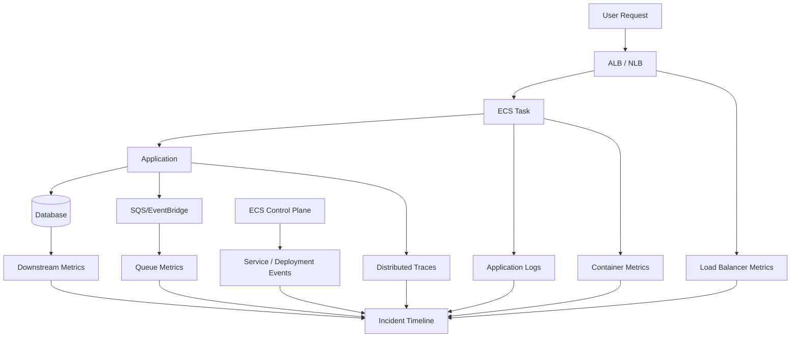
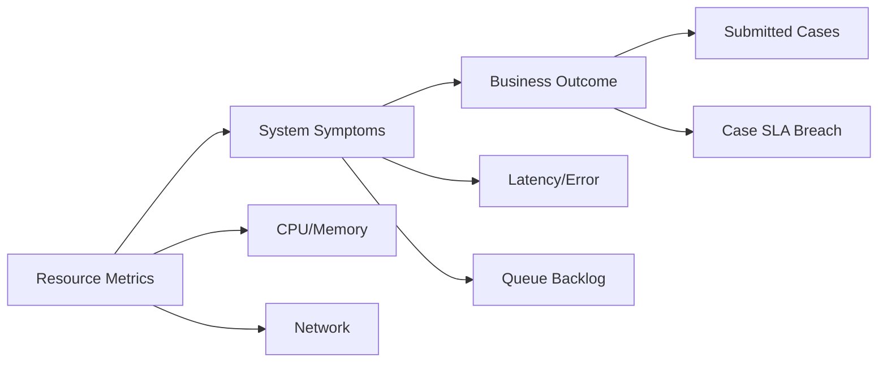
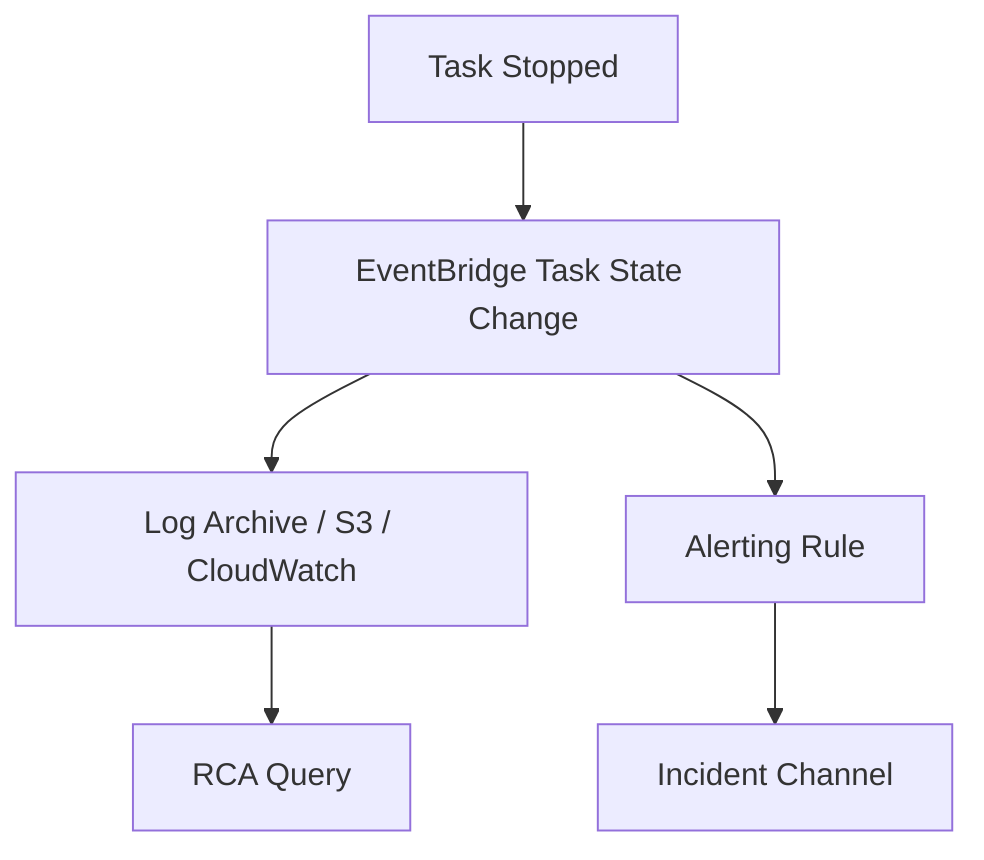
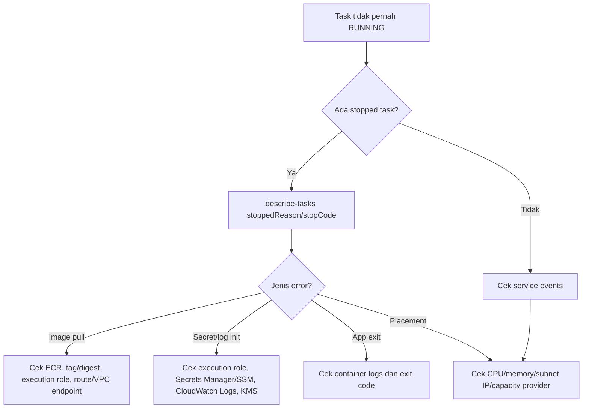
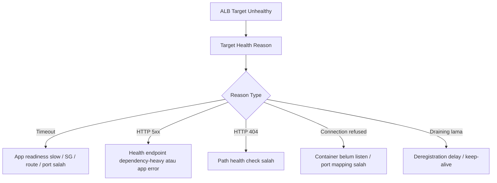
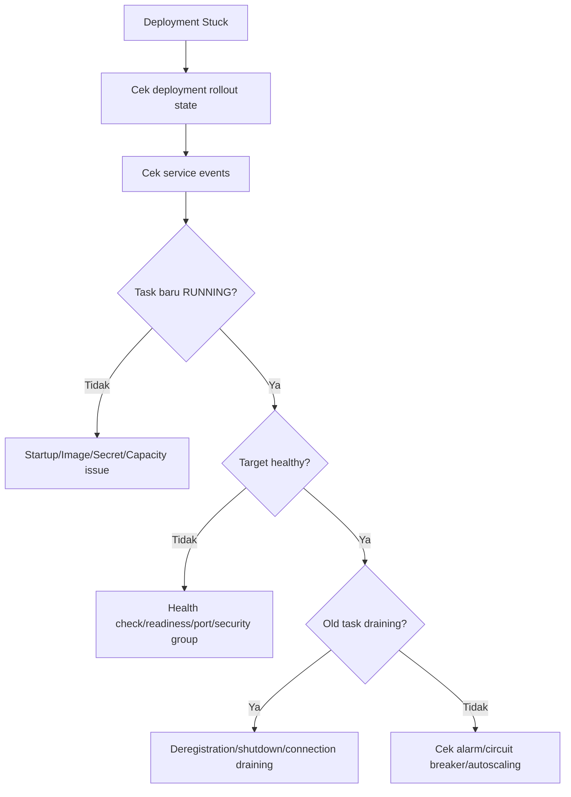
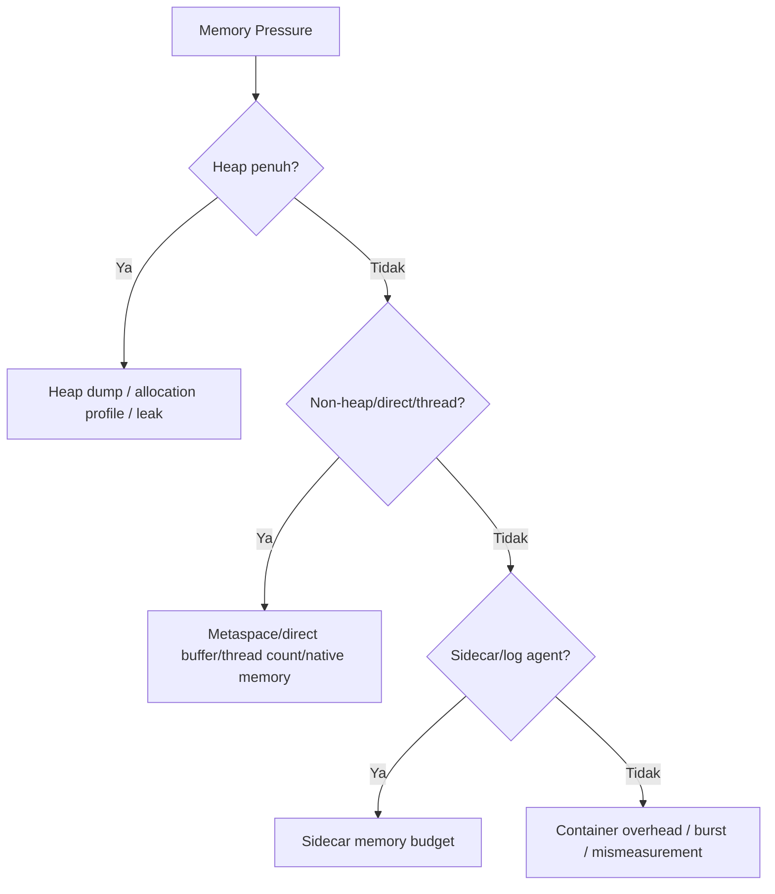
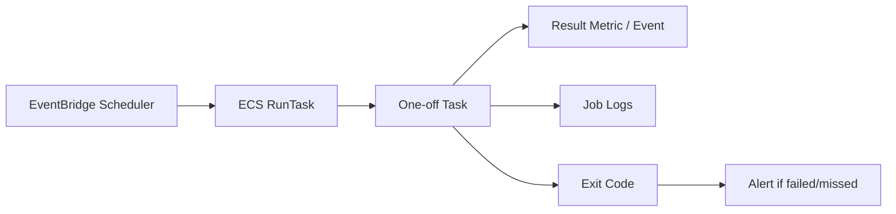
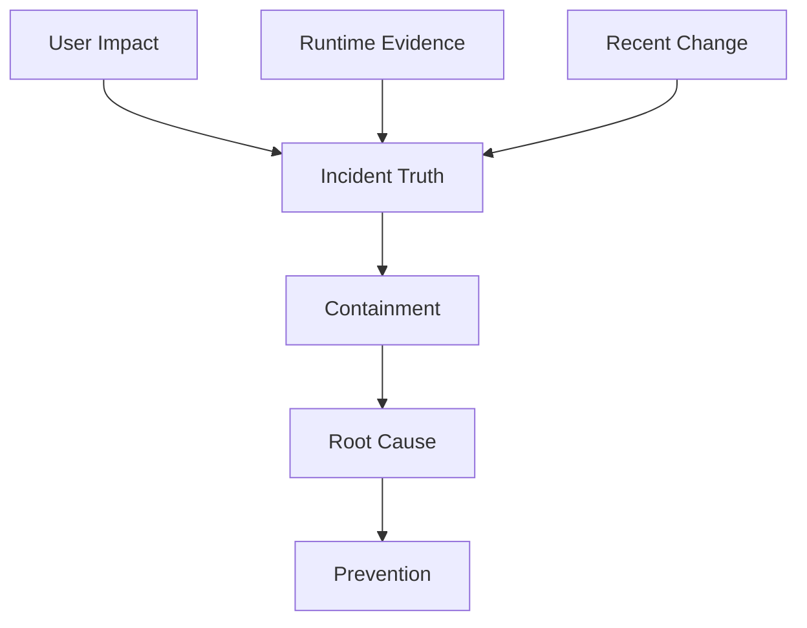

# Part 025 — ECS Observability and Debugging

Service ECS yang terlihat sehat di dashboard belum tentu sehat untuk user. Container bisa `RUNNING`, tetapi request gagal. Target bisa `healthy`, tetapi p95 latency meledak. Deployment bisa `COMPLETED`, tetapi worker diam karena tidak punya permission membaca queue. Observability ECS harus membaca sistem dari beberapa lapisan sekaligus:

- **application behavior**: log, metric bisnis, trace, error rate, latency;
- **container behavior**: CPU, memory, restart, exit code, stdout/stderr;
- **ECS service behavior**: desired/running/pending count, deployment state, task replacement;
- **load balancer behavior**: target health, 5xx, target response time, deregistration;
- **network behavior**: DNS, connection timeout, NAT, VPC endpoint, security group;
- **AWS integration behavior**: IAM, ECR pull, Secrets Manager, CloudWatch Logs, SQS, EventBridge;
- **release behavior**: image digest, task definition revision, deployment event, rollback decision.

> Debugging ECS yang matang bukan mencari “log error” saja. Ia membangun timeline: apa yang berubah, control loop mana yang bereaksi, task mana yang terpengaruh, dan boundary mana yang gagal.

## 1. Mental Model: ECS Observability Adalah Multi-Layer Timeline

ECS adalah orchestrator. Ia tidak otomatis tahu apakah bisnis kamu benar. ECS hanya tahu task diminta, task ditempatkan, container start, health check, exit code, dan deployment state. Maka observability harus menggabungkan sinyal platform dan sinyal aplikasi.



Ketika terjadi insiden, timeline minimal harus menjawab:

1. Kapan gejala user mulai terlihat?
2. Apakah ada deployment/config/capacity change sebelum gejala?
3. Task mana yang mulai gagal?
4. Apakah failure berada di startup, runtime, shutdown, atau dependency?
5. Apakah ECS mengganti task? Berapa cepat?
6. Apakah ALB/NLB menahan traffic ke target buruk?
7. Apakah autoscaling memperbaiki atau memperburuk kondisi?
8. Apakah rollback aman?

Tanpa timeline, debugging berubah menjadi tebak-tebakan.

## 2. Observability Layers

Gunakan model lapisan berikut.

| Layer | Pertanyaan | Sinyal Utama |
|---|---|---|
| User/API | Apakah user menerima error/latency? | ALB 4xx/5xx, target response time, synthetic check |
| Application | Apakah kode melakukan hal benar? | structured logs, app metrics, traces, business counters |
| Container | Apakah proses hidup dan cukup resource? | CPU, memory, exit code, OOM, restart, stdout/stderr |
| ECS Service | Apakah desired state tercapai? | desired/running/pending count, deployment events, task state |
| Scheduler/Capacity | Apakah task bisa ditempatkan? | pending task, capacity provider, subnet IP, CPU/memory availability |
| Network | Apakah dependency reachable? | timeout, DNS error, connection refused, security group, endpoint |
| AWS Integration | Apakah service AWS dapat diakses? | IAM denial, throttling, ECR pull, Secrets Manager, logs driver |
| Release | Apa yang berubah? | task definition revision, image digest, config version, deployment ID |

Rule:

> Jangan membaca metric ECS tanpa membaca metric aplikasi. Jangan membaca log aplikasi tanpa membaca event ECS.

## 3. The Minimum Production Signal Set

Untuk ECS service production, minimum signal set:

### Application Signals

- request count;
- error count dan error rate;
- latency p50/p90/p95/p99;
- dependency latency;
- dependency error count;
- business throughput;
- business failure count;
- queue processing success/failure jika worker;
- retry count;
- idempotency conflict count;
- circuit breaker open count;
- JVM heap/non-heap/gc/thread metrics untuk Java service.

### Container Signals

- CPU utilization;
- memory utilization;
- memory reserved vs used;
- OOM/exit code;
- container restart/stop count;
- ephemeral storage usage;
- network rx/tx;
- log volume;
- health check result.

### ECS Service Signals

- desired task count;
- running task count;
- pending task count;
- deployment state;
- task stopped reason;
- service event;
- deployment rollback/circuit breaker event;
- task launch failures.

### Load Balancer Signals

- healthy/unhealthy target count;
- target response time;
- target 5xx;
- load balancer 5xx;
- request count;
- rejected connection count;
- TLS negotiation error jika relevan;
- target deregistration behavior saat deployment.

### Queue/Async Signals

- approximate visible messages;
- approximate age of oldest message;
- messages processed per second;
- messages failed per second;
- DLQ depth;
- backlog per task;
- worker concurrency.

Minimum bukan berarti cukup untuk semua kasus, tetapi tanpa ini kamu buta.

## 4. Logs: Structured, Correlated, and Bounded

ECS biasanya mengirim stdout/stderr container ke CloudWatch Logs melalui `awslogs` driver, atau ke collector seperti FireLens. Untuk production, log harus:

- structured JSON;
- punya timestamp eksplisit;
- punya level;
- punya service name;
- punya environment;
- punya task/container metadata jika tersedia;
- punya correlation ID/trace ID;
- punya request ID;
- punya tenant/case/workflow ID jika aman;
- tidak memuat secret/PII sensitif;
- punya retention policy;
- bisa difilter cepat saat incident.

Contoh JSON log:

```json
{
  "ts": "2026-07-06T08:15:30.012Z",
  "level": "ERROR",
  "service": "case-command-api",
  "env": "prod",
  "traceId": "1-686b8d41-6f3a2e...",
  "correlationId": "corr-01J...",
  "tenantId": "tenant-42",
  "caseId": "case-98211",
  "operation": "submitCase",
  "errorType": "DownstreamTimeout",
  "dependency": "case-ledger",
  "durationMs": 2450,
  "message": "Failed to submit case due to ledger timeout"
}
```

Bad log:

```txt
Something went wrong
```

Lebih buruk lagi:

```txt
Failed with password=... token=...
```

### Log Design Rules

| Rule | Alasan |
|---|---|
| Log domain event penting | Memudahkan rekonstruksi state bisnis |
| Log transition, bukan semua noise | Mengurangi cost dan cognitive overload |
| Log dengan ID stabil | Memudahkan join antarsistem |
| Log error dengan cause chain | Mempercepat RCA |
| Jangan log secret | Secret leak sulit diperbaiki |
| Jangan log payload besar default | Cost, privacy, dan latency |
| Redact di boundary | Jangan berharap engineer ingat manual |

## 5. Metrics: From Resource to Outcome

Metric ECS bawaan bagus untuk resource, tetapi metric bisnis harus dibuat oleh aplikasi.



Contoh metric yang harus ada untuk API:

| Metric | Type | Label/Dimension Aman |
|---|---|---|
| `http.server.requests` | counter/timer | service, route template, method, status class |
| `dependency.calls` | counter/timer | dependency, operation, status |
| `business.case.submitted` | counter | service, environment |
| `business.case.rejected` | counter | reason code, environment |
| `idempotency.conflict` | counter | operation |
| `circuit_breaker.open` | gauge | dependency |

Hati-hati dengan cardinality. Jangan jadikan `caseId`, `userId`, atau `requestId` sebagai metric dimension. Itu tugas log/trace, bukan metric dimension.

## 6. Traces: Melihat Jalur Request yang Sebenarnya

Distributed tracing menjawab:

- request melewati service mana saja;
- dependency mana yang lambat;
- retry terjadi berapa kali;
- error berasal dari service mana;
- apakah latency berasal dari aplikasi, database, queue, atau network;
- apakah satu deployment revision lebih buruk daripada revision lain.

Untuk ECS, tracing bisa menggunakan AWS X-Ray, OpenTelemetry Collector, atau vendor APM. Yang penting bukan vendor-nya, tetapi disiplin propagation.

Header yang umum:

- `traceparent` untuk W3C Trace Context;
- `x-amzn-trace-id` untuk X-Ray context;
- custom `x-correlation-id` untuk domain correlation.

Rule:

> Trace ID mengikuti request teknis. Correlation ID mengikuti proses bisnis.

Pada event-driven flow, trace tidak selalu berlanjut natural seperti HTTP. Maka event payload atau message attribute perlu membawa correlation ID.

## 7. ECS Metadata: Identitas Runtime di Dalam Container

Saat debugging, aplikasi sebaiknya bisa menyertakan metadata runtime:

- cluster name;
- task ARN;
- task definition family/revision;
- container name;
- availability zone;
- image digest;
- deployment/environment.

Metadata ini berguna untuk menjawab:

- apakah error hanya terjadi pada revision tertentu;
- apakah error hanya terjadi di AZ tertentu;
- apakah error hanya terjadi di task yang baru start;
- apakah deployment baru memiliki image digest yang benar;
- apakah traffic masih masuk ke old revision.

Jangan mengandalkan hostname container sebagai identitas bisnis. Task replacement membuat identitas runtime ephemeral.

## 8. Container Insights

CloudWatch Container Insights mengumpulkan dan merangkum metric/log containerized workload. Untuk ECS, ini membantu melihat:

- cluster/service/task level resource usage;
- CPU/memory reservation vs utilization;
- network behavior;
- storage/ephemeral storage metric;
- service-level aggregate;
- korelasi metric dengan log.

Container Insights bukan pengganti application metric. Ia memberi lapisan platform. Kamu tetap butuh metric domain dari aplikasi.

Pola penggunaan:

1. Lihat service-level CPU/memory untuk gejala umum.
2. Drill down ke task yang outlier.
3. Korelasikan dengan deployment revision.
4. Buka logs task tertentu.
5. Jika perlu, gunakan ECS Exec dengan governance.

## 9. ECS Service Events

ECS service events adalah jurnal control loop. Event ini sering lebih berguna daripada log aplikasi untuk masalah startup/deployment.

Contoh informasi yang bisa muncul:

- service started task;
- service stopped task;
- unable to place task;
- target group health check failed;
- deployment reached steady state;
- deployment failed;
- task failed to start;
- image pull failure;
- insufficient CPU/memory;
- security group/subnet misconfiguration symptoms.

Jika deployment stuck, baca service events sebelum membaca ribuan baris log.

## 10. Task Stop Reason: Bukti Pertama Saat Task Mati

Saat task berhenti, ECS menyediakan `stoppedReason`, `stopCode`, dan container exit code di `describe-tasks`. Ini adalah titik awal RCA.

Pattern umum:

| Symptom | Kemungkinan Penyebab | Evidence |
|---|---|---|
| `Essential container in task exited` | process utama keluar | exit code, app logs |
| `CannotPullContainerError` | ECR/network/IAM/image tag/digest salah | stopped reason, execution role, route |
| `ResourceInitializationError` | secret/log/network bootstrap gagal | stopped reason, CloudWatch/ECR/Secrets access |
| Exit code `137` | kemungkinan memory kill/SIGKILL | memory metrics, app heap, exit code |
| Health check failed | readiness endpoint salah atau startup terlalu lambat | target health reason, app logs |
| Task pending terus | capacity/subnet IP/placement issue | service events, capacity provider |
| Task stopped saat deployment | normal replacement atau failed rollout | deployment events, desired count math |

Penting: stopped tasks hanya tersedia terbatas di console. Untuk audit/RCA jangka panjang, kirim ECS task state change event ke EventBridge lalu simpan ke log/archive.



## 11. ECS Exec: Break-Glass, Bukan Observability Utama

ECS Exec memungkinkan engineer menjalankan command di container ECS tanpa SSH ke host, baik di EC2 maupun Fargate. Ini sangat berguna untuk debugging produksi, tetapi juga berbahaya jika tidak dikontrol.

Gunakan ECS Exec untuk:

- inspect environment non-secret;
- cek file/config runtime;
- cek koneksi DNS/network dari dalam container;
- mengambil thread dump Java;
- mengambil heap histogram dalam kondisi tertentu;
- menjalankan diagnostic command yang read-only;
- emergency verification ketika telemetry tidak cukup.

Jangan gunakan ECS Exec untuk:

- rutin mengubah state container;
- hotfix manual;
- bypass deployment pipeline;
- membaca secret sembarangan;
- menjalankan command destructive;
- menggantikan log/metric/trace.

Governance minimal:

- hanya break-glass role tertentu;
- MFA/approval jika diperlukan;
- session logging ke CloudWatch/S3;
- command audit via CloudTrail/SSM;
- disabled by default untuk service sensitif;
- enable hanya saat incident jika memungkinkan;
- dokumentasikan setiap penggunaan di incident timeline.

Rule:

> Jika kamu sering butuh ECS Exec untuk memahami service, observability-mu kurang.

## 12. Java Service Debugging on ECS

Untuk Java service, debugging ECS sering jatuh ke beberapa area:

- heap terlalu kecil karena container memory limit;
- direct memory/metaspace/thread stack tidak dihitung dalam heap budget;
- GC pause menyebabkan health check timeout;
- connection pool terlalu besar per task;
- thread pool starvation;
- DNS cache terlalu lama;
- startup lambat karena dependency initialization;
- graceful shutdown tidak selesai sebelum deregistration/stop timeout;
- log terlalu verbose menyebabkan IO/cost pressure.

### JVM Runtime Budget

Jika task memory 1024 MiB, jangan set heap 1024 MiB. Container butuh memory untuk:

- heap;
- metaspace;
- direct buffer;
- thread stack;
- JIT/code cache;
- native library;
- agent/APM;
- OS/container overhead.

Contoh rule of thumb:

```txt
container memory = 1024 MiB
max heap         = 512-650 MiB
non-heap budget  = 250-350 MiB
headroom         = 100-200 MiB
```

Gunakan metric JVM, bukan hanya ECS memory utilization.

### Thread Dump via ECS Exec

Contoh diagnostic command:

```bash
jcmd 1 Thread.print > /tmp/thread-dump.txt
jcmd 1 GC.heap_info
jcmd 1 VM.native_memory summary
```

Gunakan hanya jika image memuat tooling JDK. Untuk distroless/JRE minimal, siapkan mekanisme diagnostic lain: actuator endpoint aman, JFR on demand, atau sidecar observability.

## 13. Debugging Flow: Task Gagal Start



Checklist:

1. `aws ecs describe-services` untuk event terbaru.
2. `aws ecs list-tasks --desired-status STOPPED` lalu `describe-tasks`.
3. Baca `stoppedReason`, `stopCode`, dan container `reason`.
4. Cek CloudWatch Logs task.
5. Cek execution role jika image/secret/log gagal.
6. Cek network path ke ECR/Secrets/Logs jika private subnet.
7. Cek capacity provider dan subnet IP jika task pending.

## 14. Debugging Flow: Service Unhealthy di ALB



Rules untuk health endpoint:

- readiness endpoint harus murah;
- jangan memanggil semua downstream dependency berat;
- pisahkan liveness dan readiness;
- saat shutdown, readiness harus gagal dulu sebelum proses berhenti;
- startup grace harus sesuai cold start aplikasi;
- health check timeout harus lebih kecil dari request timeout umum.

## 15. Debugging Flow: Deployment Stuck

Deployment ECS stuck biasanya karena salah satu:

- task baru gagal start;
- task baru start tapi gagal health check;
- capacity tidak cukup;
- `minimumHealthyPercent` terlalu tinggi untuk kapasitas tersedia;
- `maximumPercent` terlalu rendah untuk replacement;
- ALB deregistration delay terlalu panjang;
- app tidak graceful shutdown;
- deployment circuit breaker belum aktif;
- alarm rollback tidak mewakili gejala nyata.

Flow:



Deployment yang baik punya:

- clear alarm;
- rollback otomatis;
- image digest traceability;
- task definition diff;
- database compatibility;
- graceful termination;
- post-deployment verification.

## 16. Debugging Flow: High Latency

High latency sering bukan CPU. Gunakan pembagian budget.

```txt
end-to-end latency = ALB overhead
                   + app queueing
                   + request processing
                   + downstream calls
                   + retry amplification
                   + serialization/logging
                   + network latency
```

Checklist:

1. Apakah latency terjadi di semua endpoint atau endpoint tertentu?
2. Apakah hanya task revision baru?
3. Apakah hanya AZ tertentu?
4. Apakah ALB target response time naik?
5. Apakah app p95/p99 naik?
6. Apakah dependency latency naik?
7. Apakah GC pause naik?
8. Apakah thread pool queue naik?
9. Apakah connection pool exhausted?
10. Apakah retry count naik?
11. Apakah log volume melonjak?
12. Apakah autoscaling menambah task terlalu lambat?

High latency yang disebabkan retry sering terlihat seperti traffic spike. Bedakan user load dan internal amplification.

## 17. Debugging Flow: Memory Pressure and OOM

Memory failure pada ECS biasanya muncul sebagai:

- container exit code 137;
- task stopped karena essential container exited;
- memory utilization mendekati limit;
- JVM OOM;
- health check timeout sebelum OOM;
- GC thrashing;
- slow response.

Untuk Java:



Prinsip:

- task memory limit adalah hard boundary;
- heap harus lebih kecil dari task memory;
- sidecar juga memakan memory task;
- APM agent punya overhead;
- high thread count memakan stack memory;
- direct buffer sering terlupakan.

## 18. Debugging Flow: Network Timeout

Network timeout di ECS bisa berasal dari:

- security group outbound/inbound;
- route table;
- NAT gateway;
- missing VPC endpoint;
- DNS resolution;
- NACL;
- target port salah;
- dependency overload;
- TLS/SNI/certificate issue;
- connection pool stale;
- cross-AZ routing/cost;
- private hosted zone conflict.

Flow dari dalam task:

```bash
# contoh diagnostic, tergantung image punya tool atau tidak
getent hosts service.internal
nc -vz host 443
curl -v https://dependency.example/health
```

Untuk image minimal, jangan install tool sembarangan di production hanya demi debug. Alternatif:

- debug task khusus dengan network/security group sama;
- ECS Exec pada image diagnostic terkontrol;
- synthetic canary dari subnet yang sama;
- VPC Flow Logs jika perlu.

## 19. Observability for Workers

Worker ECS tidak punya ALB health signal. Maka signal worker harus explicit.

Minimum worker metrics:

- messages received;
- messages processed successfully;
- messages failed;
- processing duration;
- retry count;
- visibility timeout extension count;
- DLQ sent count;
- backlog;
- age of oldest message;
- backlog per task;
- active workers;
- idempotency dedupe hit;
- poison message detection.

Worker log minimal:

```json
{
  "event": "message_processed",
  "queue": "case-events-prod",
  "messageId": "...",
  "correlationId": "...",
  "attempt": 2,
  "durationMs": 340,
  "result": "success"
}
```

Jangan hanya log error. Worker yang diam tanpa error bisa lebih berbahaya daripada worker yang gagal keras.

## 20. Observability for Scheduled and One-Off Tasks

Untuk scheduled/one-off task, service dashboard tidak cukup karena task selesai normal.

Sinyal wajib:

- task started;
- task completed;
- exit code;
- duration;
- records processed;
- records failed;
- output artifact location;
- next retry/schedule;
- missed schedule detection;
- task state change event archived.

Pattern:



A scheduled job yang gagal harus terlihat tanpa ada user yang membuka dashboard.

## 21. Alert Design

Alert bukan semua alarm. Alert adalah sinyal yang membutuhkan tindakan manusia atau otomatis.

### Good Alerts

| Alert | Mengapa Berguna |
|---|---|
| API 5xx rate above SLO | User impact langsung |
| p95 latency above SLO | User impact langsung |
| deployment failed/rolled back | Release issue |
| running task count below desired for N minutes | Service capacity issue |
| pending task count high | Capacity/placement issue |
| target unhealthy count > 0 sustained | Traffic routing risk |
| DLQ depth > 0 | Async data loss/poison risk |
| age of oldest message high | SLA breach risk |
| task stopped unexpectedly > baseline | Runtime crash |
| task launch failure | Bootstrap/config issue |

### Bad Alerts

| Alert | Mengapa Buruk |
|---|---|
| CPU > 80% sekali | Bisa normal/burst |
| Semua ERROR log | Banyak error recoverable |
| Setiap task replacement | Deployment normal akan noisy |
| Memory > 70% tanpa konteks | JVM bisa stabil di angka tinggi |
| Queue depth > 0 | Queue memang untuk buffering |

Alert harus punya runbook. Jika tidak ada tindakan, itu bukan alert; itu dashboard.

## 22. Incident Debugging Checklist

Gunakan urutan ini saat ECS incident.

### Step 1 — Define Impact

- Endpoint/service mana terdampak?
- Error/latency/backlog berapa?
- Sejak kapan?
- Semua tenant atau subset?
- Semua AZ atau subset?

### Step 2 — Identify Recent Change

- Deployment baru?
- Task definition revision baru?
- Image digest baru?
- Config/secret change?
- Scaling policy change?
- Security group/routing change?
- Downstream change?

### Step 3 — Read ECS Control Loop

- desired/running/pending count;
- deployment rollout state;
- service events;
- stopped task reasons;
- target health;
- capacity provider behavior.

### Step 4 — Read Application Signals

- error rate;
- p95/p99 latency;
- dependency errors;
- trace outliers;
- business metric drop;
- queue backlog/age.

### Step 5 — Contain

- rollback deployment;
- scale out if safe;
- disable feature flag;
- shift traffic;
- pause consumer;
- increase visibility timeout;
- isolate bad tenant;
- route to degraded mode.

### Step 6 — Preserve Evidence

- task stopped reason;
- deployment ID;
- task definition revision;
- image digest;
- logs around failure;
- metric screenshots/query links;
- trace IDs;
- CloudTrail deploy actor;
- incident timeline.

## 23. Debugging Commands

Useful AWS CLI snippets.

### Services

```bash
aws ecs describe-services \
  --cluster prod-cluster \
  --services case-command-api
```

### Running Tasks

```bash
aws ecs list-tasks \
  --cluster prod-cluster \
  --service-name case-command-api \
  --desired-status RUNNING
```

### Stopped Tasks

```bash
aws ecs list-tasks \
  --cluster prod-cluster \
  --service-name case-command-api \
  --desired-status STOPPED
```

### Describe Task

```bash
aws ecs describe-tasks \
  --cluster prod-cluster \
  --tasks arn:aws:ecs:...
```

### ECS Exec

```bash
aws ecs execute-command \
  --cluster prod-cluster \
  --task arn:aws:ecs:... \
  --container app \
  --interactive \
  --command "/bin/sh"
```

Gunakan command ini dengan policy break-glass dan session logging.

## 24. Common Anti-Patterns

| Anti-Pattern | Dampak | Perbaikan |
|---|---|---|
| Log plain text random | Sulit query saat incident | Structured JSON logs |
| Tidak punya correlation ID | Tidak bisa join request/event | Propagate correlation ID |
| Hanya memantau CPU/memory | User impact tidak terlihat | SLO/app metrics |
| Tidak menyimpan stopped task event | RCA hilang setelah window console | Archive task state changes |
| ECS Exec jadi cara debug utama | Observability lemah dan audit risk | Telemetry first, exec break-glass |
| Health endpoint terlalu berat | False unhealthy saat dependency lambat | Readiness ringan dan deterministik |
| Metric cardinality liar | Cost meledak, query lambat | Batasi dimensions |
| Alert semua error | Alert fatigue | Alert pada SLO/actionable signals |
| Tidak trace deployment revision | Tidak tahu revision mana buruk | Inject image digest/revision metadata |
| Worker tanpa progress metric | Backlog tersembunyi | Queue age + processed/failure metrics |

## 25. Final Mental Model

Observability ECS harus menjawab tiga hal:

1. **Apa yang user alami?**
2. **Apa yang runtime lakukan?**
3. **Apa yang berubah?**



Jika salah satu dari tiga input itu tidak tersedia, incident response akan lambat dan spekulatif.

## 26. Kesimpulan

ECS observability yang baik bukan dashboard cantik. Ia adalah sistem bukti. Ia membuat failure dapat dilihat, dipersempit, dikorelasikan, dan ditindaklanjuti.

Untuk engineer production-grade, standar minimalnya:

- setiap request punya correlation ID;
- setiap task punya image digest dan revision metadata;
- setiap deployment punya timeline;
- setiap worker punya progress metric;
- setiap task stop reason bisa diaudit;
- setiap alert punya runbook;
- setiap break-glass shell terekam;
- setiap rollback punya bukti.

Debugging ECS bukan seni gelap jika sistem dirancang untuk memberi bukti sejak awal.

## References

- AWS ECS Developer Guide — Monitor Amazon ECS containers using Container Insights: https://docs.aws.amazon.com/AmazonECS/latest/developerguide/cloudwatch-container-insights.html
- Amazon CloudWatch User Guide — Amazon ECS Container Insights metrics: https://docs.aws.amazon.com/AmazonCloudWatch/latest/monitoring/Container-Insights-metrics-ECS.html
- AWS ECS Developer Guide — Send Amazon ECS logs to CloudWatch: https://docs.aws.amazon.com/AmazonECS/latest/developerguide/using_awslogs.html
- AWS ECS Developer Guide — Monitor Amazon ECS containers with ECS Exec: https://docs.aws.amazon.com/AmazonECS/latest/developerguide/ecs-exec.html
- AWS ECS API Reference — ExecuteCommand: https://docs.aws.amazon.com/AmazonECS/latest/APIReference/API_ExecuteCommand.html
- AWS ECS Developer Guide — Resolve Amazon ECS stopped task errors: https://docs.aws.amazon.com/AmazonECS/latest/developerguide/resolve-stopped-errors.html
- AWS ECS Developer Guide — Viewing Amazon ECS stopped task errors: https://docs.aws.amazon.com/AmazonECS/latest/developerguide/stopped-task-errors.html
- AWS ECS Developer Guide — Viewing CloudWatch Logs Live Tail for Amazon ECS services: https://docs.aws.amazon.com/AmazonECS/latest/developerguide/monitoring-cloudwatchlogs-view.html
- Elastic Load Balancing User Guide — Health checks for Application Load Balancer target groups: https://docs.aws.amazon.com/elasticloadbalancing/latest/application/target-group-health-checks.html
- AWS X-Ray Developer Guide: https://docs.aws.amazon.com/xray/latest/devguide/aws-xray.html
- OpenTelemetry Documentation: https://opentelemetry.io/docs/
