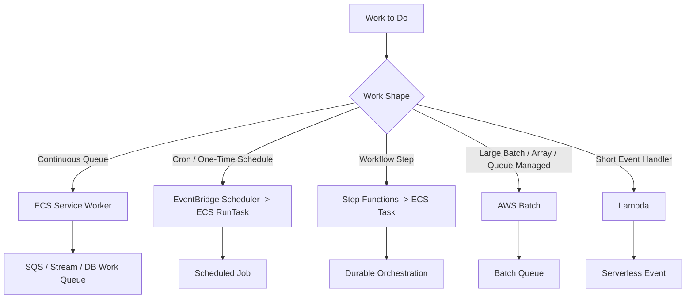
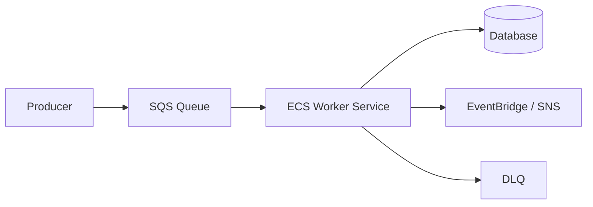
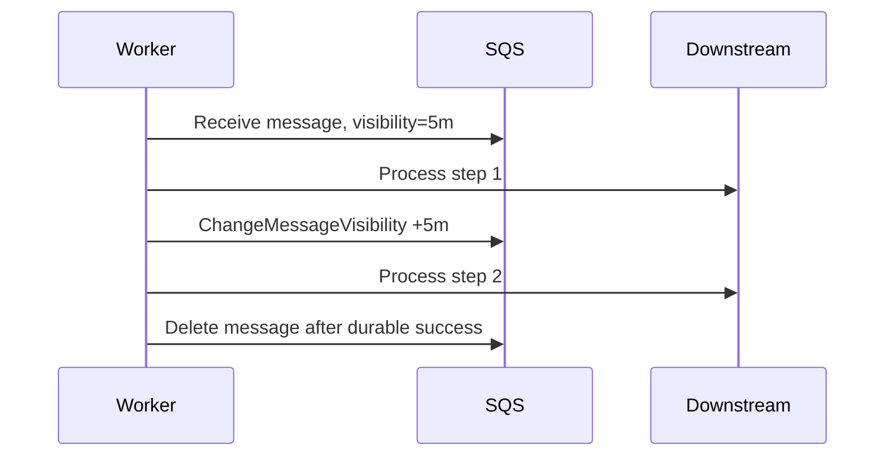
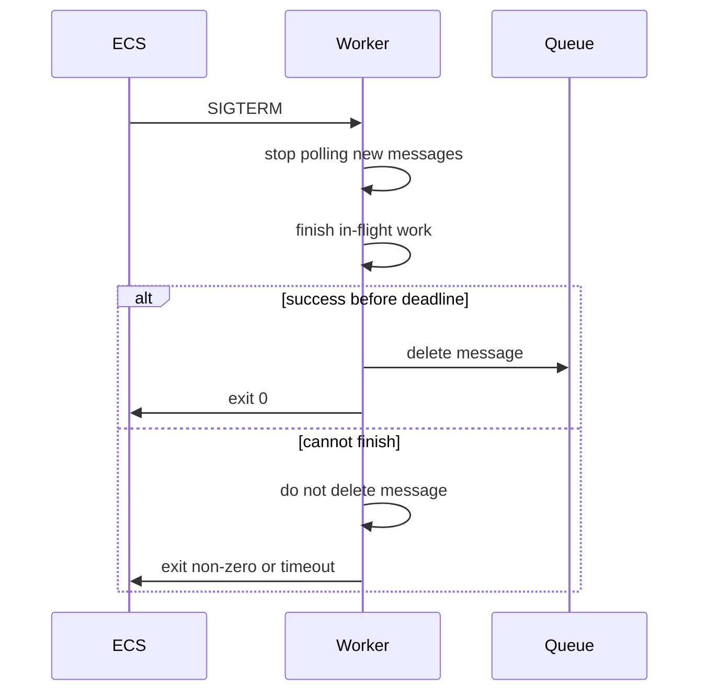
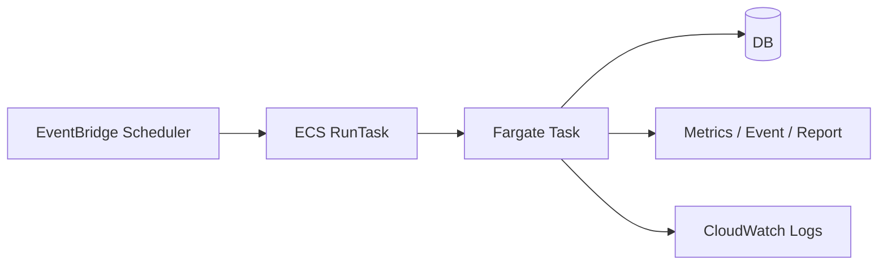
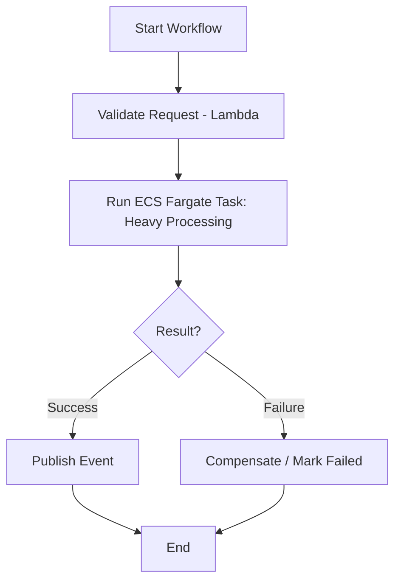
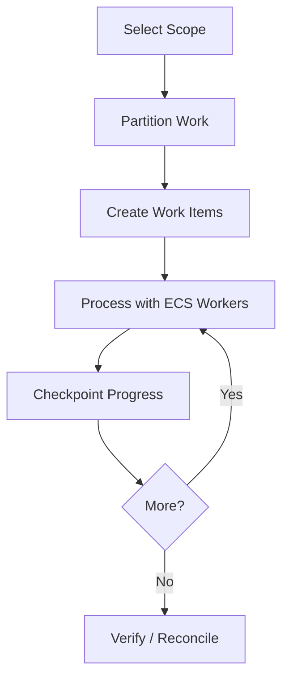
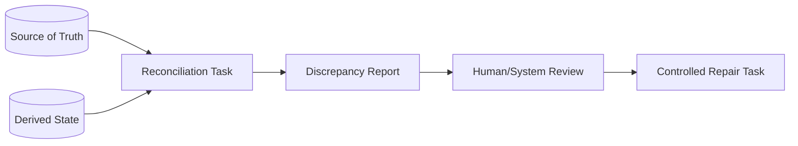
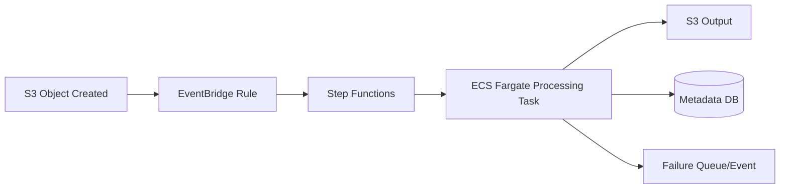
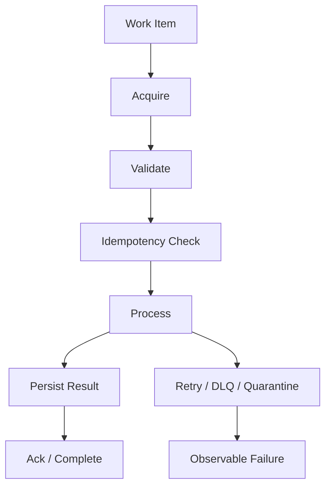

# Part 026 — ECS Worker and Job Patterns

Tidak semua ECS workload adalah HTTP service di belakang ALB. Banyak sistem production justru digerakkan oleh pekerjaan non-HTTP:

- queue consumer;
- scheduled job;
- one-off migration;
- batch processing;
- report generation;
- file processing;
- event projector;
- reconciliation job;
- backfill;
- long-running workflow step;
- human-triggered operational task.

Pola ini sering terlihat sederhana: “jalankan container, proses data, selesai.” Namun failure semantics-nya lebih sulit daripada API biasa. API gagal langsung terlihat oleh user. Worker bisa gagal diam-diam selama berjam-jam dan baru ketahuan ketika backlog menumpuk atau data tidak konsisten.

> Worker dan job bukan service kelas dua. Mereka adalah state transition engine. Jika salah, mereka merusak data tanpa selalu membuat dashboard merah.

## 1. Mental Model: Service vs Worker vs Job

ECS bisa menjalankan container dalam beberapa bentuk.

| Bentuk | Runtime Shape | ECS Mechanism | Contoh |
|---|---|---|---|
| Long-running API service | Hidup terus, menerima traffic | ECS Service + ALB/NLB | REST API, gRPC service |
| Long-running worker service | Hidup terus, polling queue/stream | ECS Service | SQS consumer, event projector |
| Scheduled task | Jalan pada waktu tertentu, lalu selesai | EventBridge Scheduler + ECS RunTask | nightly reconciliation, cleanup |
| One-off task | Dipicu manual/pipeline/API, lalu selesai | ECS RunTask | DB migration, backfill kecil |
| Orchestrated task | Satu step dalam workflow durable | Step Functions + ECS/Fargate task | file processing pipeline |
| Batch job | Banyak job/array/dependency | AWS Batch on ECS/Fargate/EKS | simulation, large transform |

Pertanyaan utama bukan “bisa dijalankan di ECS atau tidak”. Pertanyaannya:

1. Siapa yang memutuskan kapan task dibuat?
2. Siapa yang mempertahankan desired count?
3. Siapa yang retry jika gagal?
4. Siapa yang tahu job sudah selesai?
5. Siapa yang menyimpan state progress?
6. Bagaimana duplicate execution ditangani?
7. Bagaimana failure terlihat?
8. Bagaimana capacity diskalakan?

## 2. Pattern Map



Gunakan ECS worker/job ketika:

- runtime lebih panjang dari Lambda nyaman;
- dependency/runtime container custom;
- memory/CPU lebih besar atau lebih stabil;
- butuh long-lived connection/polling;
- proses membutuhkan binary/tooling kompleks;
- container image sudah menjadi deployment artifact utama;
- workload cocok dengan task-level isolation;
- orchestration eksternal bisa mengatur lifecycle.

Gunakan Lambda ketika:

- event kecil;
- runtime pendek;
- scale-to-zero sangat penting;
- provisioning task container terlalu berat;
- event source mapping Lambda sudah cocok.

Gunakan AWS Batch ketika:

- job queue/dependency/array/priority adalah domain utama;
- banyak job paralel;
- scheduling compute menjadi kompleks;
- workload batch lebih penting daripada service semantics.

## 3. Long-Running Queue Worker Service

Pola paling umum:



Worker ECS service menjalankan N task. Setiap task polling queue, mengambil message, memproses, lalu delete message jika sukses.

Kontrak worker:

1. Poll message.
2. Parse dan validasi.
3. Cek idempotency.
4. Ambil lock jika perlu.
5. Jalankan side effect.
6. Persist result/progress.
7. Publish event jika perlu.
8. Delete/ack message hanya setelah sukses.
9. Jika gagal recoverable, biarkan retry.
10. Jika gagal terminal, kirim ke DLQ atau mark rejected.

Pseudo-code:

```java
while (running) {
    List<Message> messages = sqs.receiveMessage(queueUrl, batchSize, waitTime);

    for (Message message : messages) {
        String idempotencyKey = extractKey(message);
        try {
            if (dedupeStore.alreadyProcessed(idempotencyKey)) {
                sqs.deleteMessage(message.receiptHandle());
                continue;
            }

            ProcessingResult result = processor.process(message.body());
            dedupeStore.markProcessed(idempotencyKey, result);
            sqs.deleteMessage(message.receiptHandle());
        } catch (RetryableException e) {
            metrics.increment("worker.retryable_failure");
            // do not delete; SQS visibility timeout will make it visible again
        } catch (PoisonMessageException e) {
            metrics.increment("worker.poison_message");
            quarantine.persist(message, e);
            sqs.deleteMessage(message.receiptHandle());
        }
    }
}
```

## 4. The Worker Correctness Invariants

Worker harus punya invariants eksplisit.

| Invariant | Makna |
|---|---|
| Message is deleted only after durable success | Jangan ack sebelum side effect aman |
| Processing is idempotent | Duplicate delivery tidak merusak data |
| Retry is bounded or observable | Retry infinite tidak boleh diam |
| Poison message is isolated | Satu message buruk tidak menahan queue |
| Progress is measurable | Backlog dan throughput terlihat |
| Shutdown is graceful | Task stop tidak kehilangan message in-flight |
| Visibility timeout covers processing | Message tidak diproses dua worker karena timeout terlalu pendek |
| Scaling signal follows backlog age | Scale out berdasarkan tekanan kerja nyata |
| Side effects are ordered only when required | Jangan memakai FIFO jika tidak butuh |
| DLQ has owner and replay process | DLQ bukan kuburan permanen |

Worker yang benar lebih mirip mini transaction processor daripada loop polling.

## 5. SQS Standard vs FIFO for ECS Workers

| Aspek | SQS Standard | SQS FIFO |
|---|---|---|
| Delivery | At-least-once, best-effort ordering | Exactly-once processing aid + ordering per group, tetap desain idempotent |
| Throughput | Tinggi | Lebih terbatas oleh message group |
| Ordering | Tidak dijamin global | Dijamin per message group |
| Duplicate | Bisa terjadi | Deduplication window membantu, bukan pengganti idempotency domain |
| Cocok untuk | Work item independen | State transition yang butuh ordering per entity |

Untuk regulatory/case lifecycle, ordering biasanya diperlukan **per case**, bukan global. Gunakan `caseId` sebagai message group jika memakai FIFO. Jangan membuat satu global group karena itu mengubah sistem menjadi single-threaded.

## 6. Visibility Timeout and Processing Budget

SQS visibility timeout harus lebih panjang dari waktu proses normal, tetapi tidak terlalu panjang sehingga retry tertunda lama.

Budget:

```txt
visibility timeout >= p99 processing time
                    + downstream timeout budget
                    + retry inside worker budget
                    + delete message margin
```

Jika proses bisa sangat panjang, worker perlu extend visibility timeout secara eksplisit.



Anti-pattern:

- visibility timeout 30 detik untuk proses 2 menit;
- visibility timeout 12 jam untuk proses yang biasanya 10 detik;
- retry internal worker 5 kali sementara SQS juga retry;
- delete message sebelum database commit;
- tidak punya idempotency karena “SQS sudah reliable”.

## 7. Backpressure and Scaling

Worker scaling harus mengikuti **work pressure**, bukan hanya CPU.

Sinyal lebih baik:

```txt
backlog_per_task = visible_messages / running_worker_tasks
```

Atau untuk SLA:

```txt
queue_delay_risk = approximate_age_of_oldest_message
```

CPU tinggi bisa berarti worker sibuk. Tetapi CPU rendah dengan backlog tinggi bisa berarti worker blocked oleh database/API downstream. Jika kamu scale out saat downstream sudah overload, kamu memperbesar insiden.

Scaling decision:

| Signal | Interpretasi | Action |
|---|---|---|
| Backlog naik, downstream sehat | Scale out worker |
| Backlog naik, downstream lambat | Throttle/limit concurrency, jangan scale agresif |
| Age oldest naik | Risiko SLA, investigasi capacity/downstream |
| DLQ naik | Stop/replay policy, inspect poison |
| Failure rate naik | Contain, bukan scale |
| CPU tinggi, backlog stabil | Mungkin normal |
| CPU rendah, backlog naik | Worker blocked, permission/network/downstream issue |

## 8. Worker Concurrency Model

Ada dua level concurrency:

1. **Task count**: jumlah ECS task.
2. **In-process concurrency**: thread/async worker di dalam satu task.

Jangan membuat keduanya liar.

Contoh:

```txt
running tasks = 20
threads per task = 50
total concurrency = 1000
```

Jika setiap unit kerja membuka DB connection, kamu bisa membunuh database.

Production rule:

- tentukan max concurrency global;
- bagi antara task count dan thread count;
- batasi connection pool per task;
- gunakan semaphore untuk downstream sensitif;
- expose metric active jobs dan queue internal;
- gunakan circuit breaker/bulkhead.

## 9. Graceful Shutdown for Workers

ECS akan menghentikan task saat deployment, scale-in, Spot interruption, atau manual stop. Worker harus:

1. Berhenti polling message baru.
2. Selesaikan in-flight message jika masih dalam timeout.
3. Delete/ack message yang sukses.
4. Biarkan message gagal menjadi visible lagi.
5. Flush logs/metrics.
6. Exit cleanly.



Bad shutdown:

- worker terus polling setelah SIGTERM;
- worker delete message di `finally` walau proses gagal;
- worker tidak flush metrics;
- worker spawn child process yang tidak menerima signal;
- task stop timeout lebih pendek dari pekerjaan normal.

## 10. Poison Message Handling

Poison message adalah message yang tidak akan sukses dengan retry biasa. Penyebab:

- schema invalid;
- referensi entity tidak ada;
- state transition ilegal;
- bug deterministik;
- dependency menolak karena constraint;
- data korup;
- payload terlalu besar;
- versi event tidak didukung.

Strategi:

| Strategy | Kapan Cocok |
|---|---|
| DLQ after max receives | Failure tidak langsung bisa diklasifikasi |
| Quarantine table | Butuh metadata domain dan review manual |
| Terminal reject event | Domain mengakui event tidak valid |
| Skip with audit | Untuk backfill non-critical yang bisa dilaporkan |
| Pause consumer | Jika poison menyebabkan retry storm atau data risk |

DLQ harus punya:

- alarm;
- owner;
- triage dashboard;
- replay tool;
- redrive policy;
- data retention;
- audit trail;
- rule kapan replay dilarang.

DLQ tanpa proses adalah tempat sampah yang menunda insiden.

## 11. Scheduled ECS Tasks

Scheduled task cocok untuk pekerjaan periodik:

- daily reconciliation;
- cleanup expired sessions;
- generate report;
- sync external reference data;
- run consistency check;
- scan log/object bucket;
- periodic compaction;
- regulatory deadline checker.

EventBridge Scheduler dapat memanggil ECS `RunTask` pada jadwal rate/cron/one-time.



Kontrak scheduled task:

- task harus aman jika jadwal overlap;
- task harus idempotent per schedule window;
- task harus emit completion/failure metric;
- task harus punya timeout;
- task harus punya owner;
- missed schedule harus terdeteksi;
- retry harus tidak membuat duplicate side effect.

### Overlap Problem

Jika job harian normalnya 10 menit tetapi suatu hari berjalan 2 jam, jadwal berikutnya bisa overlap.

Solusi:

- distributed lock per job name + window;
- idempotency key berbasis schedule time;
- max runtime;
- Step Functions orchestration;
- queue work items daripada job monolitik;
- allow overlap hanya jika data partition berbeda.

## 12. One-Off ECS Tasks

One-off task cocok untuk:

- database migration;
- one-time data repair;
- backfill kecil;
- export/import manual;
- operational diagnostic;
- tenant migration;
- index rebuild terbatas.

Namun one-off task berbahaya karena sering dijalankan manual dan kurang governance.

Production checklist:

- command disimpan di Git/pipeline, bukan hanya terminal history;
- image digest pinned;
- task role scoped;
- input parameter dicatat;
- dry-run mode tersedia;
- output/audit log disimpan;
- timeout ada;
- approval untuk destructive task;
- rollback/compensation plan ada;
- task result terlihat.

Contoh command override:

```json
{
  "containerOverrides": [
    {
      "name": "app",
      "command": [
        "java",
        "-jar",
        "app.jar",
        "repair-case-ledger",
        "--case-id",
        "case-98211",
        "--dry-run=false"
      ]
    }
  ]
}
```

Jangan membiarkan one-off task menjadi backdoor deployment.

## 13. Step Functions + ECS/Fargate Tasks

Step Functions cocok ketika job adalah bagian dari workflow durable:

- ada beberapa step;
- ada retry/catch berbeda per step;
- ada kompensasi;
- ada wait/human approval;
- ada audit trail state transition;
- ada branching;
- ada task yang lebih cocok di container daripada Lambda.



Step Functions mendukung integrasi ECS/Fargate. Pola umum:

- **Request Response**: start task dan lanjut setelah request berhasil dikirim.
- **Run a Job (`.sync`)**: workflow menunggu ECS task selesai.
- **Wait for Callback (`waitForTaskToken`)**: container mengembalikan callback ke Step Functions.

Gunakan `.sync` untuk job yang selesai sendiri dan statusnya cukup dari exit code/result. Gunakan callback token ketika task harus menunggu proses eksternal atau ingin mengirim result domain eksplisit.

## 14. Designing ECS Task Result Contract

ECS task yang dijalankan sebagai job harus punya result contract, bukan hanya exit code.

Minimal result:

```json
{
  "jobId": "job-20260706-001",
  "status": "SUCCEEDED",
  "startedAt": "2026-07-06T01:00:00Z",
  "finishedAt": "2026-07-06T01:04:12Z",
  "recordsRead": 100000,
  "recordsWritten": 99980,
  "recordsSkipped": 20,
  "outputLocation": "s3://.../result.json",
  "warnings": [
    "20 records skipped due to invalid status"
  ]
}
```

Exit code tetap penting:

| Exit Code | Makna |
|---|---|
| 0 | Job sukses sesuai kontrak |
| 1 | Failure umum |
| 2 | Invalid input/config |
| 3 | Downstream unavailable |
| 4 | Partial failure melebihi threshold |
| 5 | Lock/overlap conflict |

Untuk workflow, simpan result di S3/DynamoDB jika terlalu besar untuk payload Step Functions.

## 15. Backfill Pattern

Backfill adalah job yang memproses data historis. Risiko backfill:

- overload database;
- publish event lama yang memicu side effect baru;
- mengubah state yang sudah final;
- duplikasi output;
- mengganggu traffic production;
- berjalan terlalu lama;
- sulit pause/resume;
- tidak punya checkpoint.

Pola aman:



Guidelines:

- partition by tenant/date/entity range;
- write checkpoint per partition;
- make operation idempotent;
- throttle downstream calls;
- run in off-peak if needed;
- start with dry-run/sample;
- emit progress metric;
- support pause/resume;
- define abort condition.

## 16. Reconciliation Job Pattern

Reconciliation job membandingkan source of truth dengan derived state.

Contoh:

- case status table vs event ledger;
- payment status vs external gateway;
- S3 object inventory vs database record;
- search index vs primary DB;
- workflow execution vs domain state.

Pattern:

1. Read source of truth.
2. Read derived/secondary state.
3. Compare by invariant.
4. Emit discrepancy report.
5. Optionally repair with explicit approval.

Jangan langsung repair tanpa audit jika domain regulated.



## 17. Database Migration as ECS Task

Database migration sering dijalankan sebagai one-off ECS task dalam deployment pipeline. Ini baik jika disciplined.

Rules:

- migration harus backward-compatible dengan old dan new app selama rollout;
- jangan lakukan destructive migration sebelum old revision tidak aktif;
- lock migration agar tidak berjalan dua kali;
- record migration version;
- timeout dan failure policy jelas;
- log SQL step dan duration;
- dry-run untuk large migration;
- pisahkan schema migration dan data migration besar.

Safe sequence:

```txt
1. Add nullable column / new table
2. Deploy app that writes both if needed
3. Backfill data gradually
4. Switch reads to new path
5. Verify
6. Remove old column/path later
```

Jangan coupling deployment ECS rolling dengan migration destructive yang tidak bisa rollback.

## 18. File Processing Pattern

Untuk file besar, ECS/Fargate task sering lebih cocok daripada Lambda.

Architecture:



Design points:

- jangan taruh file besar di container filesystem tanpa sizing ephemeral storage;
- stream jika bisa;
- validate checksum/content type;
- use idempotency key dari bucket/key/version;
- simpan output path deterministik;
- pisahkan parse, transform, write;
- emit progress untuk file besar;
- handle partial output cleanup.

## 19. Worker Deployment Strategy

Deploy worker berbeda dari API:

- tidak ada ALB health check user-facing;
- old dan new worker bisa memproses message bersamaan;
- schema event harus kompatibel;
- idempotency harus cross-version;
- retry message lama bisa masuk ke worker baru;
- worker baru bisa menghasilkan event versi baru;
- scale-in bisa memotong in-flight work.

Safe worker rollout:

1. Deploy consumer yang kompatibel dengan event lama dan baru.
2. Pastikan producer belum mengirim field wajib baru tanpa default.
3. Deploy producer event baru.
4. Monitor DLQ/retry/error/backlog.
5. Setelah backlog lama habis, boleh hapus support event lama.

Untuk perubahan besar, gunakan queue baru atau routing by version.

## 20. Worker Observability

Dashboard worker harus menjawab:

- apakah worker hidup;
- apakah worker memproses message;
- apakah backlog bertambah;
- apakah message tertua melewati SLA;
- apakah failure rate naik;
- apakah DLQ naik;
- apakah downstream overload;
- apakah concurrency efektif;
- apakah task sering berhenti;
- apakah deployment baru mengubah throughput.

Minimum metrics:

| Metric | Alert? | Catatan |
|---|---|---|
| visible messages | Kadang | Bukan selalu buruk |
| age of oldest message | Ya | SLA risk |
| processed count | Ya jika drop ke nol | Worker stuck |
| failed count/rate | Ya | Failure risk |
| DLQ depth | Ya | Poison/data loss risk |
| processing duration p95 | Ya jika SLA | Downstream/performance |
| active tasks | Ya jika below desired | Capacity issue |
| in-flight messages | Watch | Visibility/concurrency |
| idempotency duplicates | Watch | Producer/retry behavior |

## 21. Cost Model for Workers and Jobs

Cost worker berasal dari:

- running Fargate vCPU/memory;
- idle polling;
- SQS/API calls;
- NAT Gateway traffic jika private subnet tanpa endpoint;
- CloudWatch Logs volume;
- telemetry metric cardinality;
- Step Functions state transitions jika orchestrated;
- ECR image storage/pull;
- data transfer ke downstream.

Optimization:

| Problem | Optimization |
|---|---|
| Worker idle 24/7 | Scale to low baseline or scheduled scale |
| Bursty queue | Scale by backlog per task |
| NAT cost high | Use VPC endpoints where appropriate |
| Logs too expensive | Reduce noisy logs, sample debug logs |
| Step Functions cost high | Combine trivial states carefully or use Express where suitable |
| Fargate memory overprovisioned | Profile and right-size task |
| Reprocessing too much | Better checkpoint/idempotency |

Jangan menurunkan cost dengan menghapus observability yang mencegah data corruption. Optimasi pertama adalah right-sizing dan scaling signal.

## 22. Security Model

Worker/job sering punya permission lebih besar daripada API karena mereka memproses data bulk. Maka security boundary harus lebih ketat.

Rules:

- task role per worker/job;
- one-off repair task role berbeda dari normal worker;
- destructive job butuh approval;
- command override dibatasi;
- input scope dibatasi by tenant/date/entity;
- secrets hanya yang diperlukan;
- output bucket/table scoped;
- ECS Exec disabled kecuali break-glass;
- CloudTrail audit untuk `RunTask`;
- EventBridge Scheduler role scoped hanya ke task definition/cluster tertentu.

Threat model khusus:

| Threat | Mitigasi |
|---|---|
| Manual one-off task destructive | Approval, scoped role, dry-run, audit |
| Worker compromised | Least privilege, network egress boundary |
| Poison message exploit | Payload validation, size limits, quarantine |
| Replay attack | Idempotency key, event version, signature if needed |
| Bad schedule | Lock, max runtime, alert missed/overlap |
| Overbroad scheduler role | Restrict `ecs:RunTask` and `iam:PassRole` |

## 23. Choosing Between ECS Worker, Lambda, Step Functions, and Batch

| Need | Better Fit | Reason |
|---|---|---|
| Poll SQS continuously with heavy Java runtime | ECS Service Worker | Stable runtime, connection reuse, custom tuning |
| Small event transform | Lambda | Simpler, scale-to-zero |
| Long file transform with custom binary | ECS/Fargate Task | Container runtime, more control |
| Durable multi-step process | Step Functions + ECS/Lambda | Retry/catch/audit/orchestration |
| Thousands of independent batch jobs | AWS Batch | Job queue/dependency/capacity management |
| Nightly cleanup | EventBridge Scheduler + ECS RunTask or Lambda | Depends on runtime length/tooling |
| DB migration in release pipeline | ECS RunTask | Same app image/tooling, controlled execution |
| Human-approved regulatory saga | Step Functions | State audit and explicit transitions |

Wrong framing:

> “Can Lambda do this?”

Better framing:

> “Which runtime contract gives the safest failure semantics, observability, and ownership model for this workload?”

## 24. Runbook: Worker Backlog Rising

1. Check age of oldest message.
2. Check processed/sec.
3. Check failure rate and DLQ.
4. Check running task count vs desired.
5. Check pending tasks/capacity.
6. Check downstream latency/error.
7. Check deployment/config change.
8. Check if worker is polling.
9. Check visibility timeout and in-flight count.
10. Decide action:
    - scale out if downstream healthy;
    - throttle if downstream overloaded;
    - rollback if new revision broke processing;
    - pause/redrive if poison message dominates;
    - increase visibility timeout only if duplicate processing is the issue.

Do not blindly scale out. Backlog is a symptom, not always the root cause.

## 25. Runbook: Scheduled Job Failed

1. Confirm schedule fired.
2. Find ECS task ARN from EventBridge/Scheduler logs or task state changes.
3. Read stopped reason and exit code.
4. Read job logs.
5. Check input parameters for schedule window.
6. Check lock/overlap conflict.
7. Check downstream dependency.
8. Check partial output.
9. Decide replay:
    - same window;
    - adjusted input;
    - dry-run first;
    - manual approval if destructive.
10. Record completion/failure evidence.

A failed schedule without alert is a design bug.

## 26. Runbook: One-Off Task Needed in Production

Before running:

- What exact data scope?
- Is there dry-run?
- What role/permission?
- What image digest?
- What command?
- What rollback/compensation?
- Who approves?
- What metric/log proves success?
- What is max runtime?
- What happens if it runs twice?

After running:

- Save task ARN;
- save command/input;
- save image digest;
- save exit code;
- save output report;
- verify domain invariant;
- attach evidence to ticket/incident.

## 27. Common Anti-Patterns

| Anti-Pattern | Mengapa Buruk | Perbaikan |
|---|---|---|
| Worker deletes message before commit | Data loss | Ack only after durable success |
| No idempotency | Duplicate corrupts state | Idempotency store/key |
| Visibility timeout too short | Duplicate concurrent processing | Budget timeout properly |
| Visibility timeout too long | Retry delayed | Tune by p99 + margin |
| Infinite retry without DLQ | Poison blocks progress | DLQ/quarantine |
| Scale by CPU only | Backlog ignored or downstream amplified | Backlog/age-aware scaling |
| One huge backfill task | No pause/resume, high blast radius | Partition + checkpoint |
| Manual one-off task from laptop | No audit/reproducibility | Pipeline-controlled RunTask |
| Scheduled job no completion metric | Silent failure | Emit success/failure/result |
| Worker rollout ignores event compatibility | Old messages fail on new code | Versioned schema and compatibility window |
| DLQ no owner | Failure hidden | Alert + triage + replay process |
| All workers share one task role | Large blast radius | Role per worker/capability |

## 28. Final Mental Model

ECS worker/job design is about safe state transitions.



Jika work item bisa hilang, diproses dua kali, atau gagal diam-diam, desain belum production-grade.

## 29. Kesimpulan

ECS worker dan job pattern memberi fleksibilitas besar: kamu bisa menjalankan runtime Java penuh, binary custom, memory besar, proses panjang, dan workflow step kompleks tanpa mengelola host jika memakai Fargate. Tetapi fleksibilitas itu datang dengan tanggung jawab:

- idempotency;
- visibility timeout;
- retry semantics;
- DLQ ownership;
- backlog-aware scaling;
- graceful shutdown;
- result contract;
- schedule/one-off audit;
- safe replay;
- security boundary.

Engineer yang matang tidak melihat worker sebagai `while(true) poll()`. Ia melihat worker sebagai state machine yang harus mempertahankan invariants meski message duplicate, task mati, deployment berganti, downstream lambat, dan operator perlu replay data.

## References

- AWS ECS Developer Guide — Amazon ECS standalone tasks: https://docs.aws.amazon.com/AmazonECS/latest/developerguide/standalone-tasks.html
- AWS ECS API Reference — RunTask: https://docs.aws.amazon.com/AmazonECS/latest/APIReference/API_RunTask.html
- AWS ECS Developer Guide — Schedule your containers on Amazon ECS: https://docs.aws.amazon.com/AmazonECS/latest/developerguide/scheduling_tasks.html
- AWS ECS Developer Guide — Using Amazon EventBridge Scheduler to schedule Amazon ECS tasks: https://docs.aws.amazon.com/AmazonECS/latest/developerguide/tasks-scheduled-eventbridge-scheduler.html
- Amazon EventBridge Scheduler User Guide — What is Amazon EventBridge Scheduler?: https://docs.aws.amazon.com/scheduler/latest/UserGuide/what-is-scheduler.html
- AWS Step Functions Developer Guide — Run Amazon ECS or Fargate tasks with Step Functions: https://docs.aws.amazon.com/step-functions/latest/dg/connect-ecs.html
- AWS Step Functions Developer Guide — Service integration patterns: https://docs.aws.amazon.com/step-functions/latest/dg/connect-to-resource.html
- Amazon SQS Developer Guide — Amazon SQS visibility timeout: https://docs.aws.amazon.com/AWSSimpleQueueService/latest/SQSDeveloperGuide/sqs-visibility-timeout.html
- Application Auto Scaling User Guide — Target tracking with metric math, SQS backlog per task: https://docs.aws.amazon.com/autoscaling/application/userguide/application-auto-scaling-target-tracking-metric-math.html
- Amazon EC2 Auto Scaling User Guide — Scaling policy based on Amazon SQS: https://docs.aws.amazon.com/autoscaling/ec2/userguide/as-using-sqs-queue.html
- AWS Batch User Guide — Multi-container jobs using EcsProperties: https://docs.aws.amazon.com/batch/latest/userguide/multi-container-jobs.html
