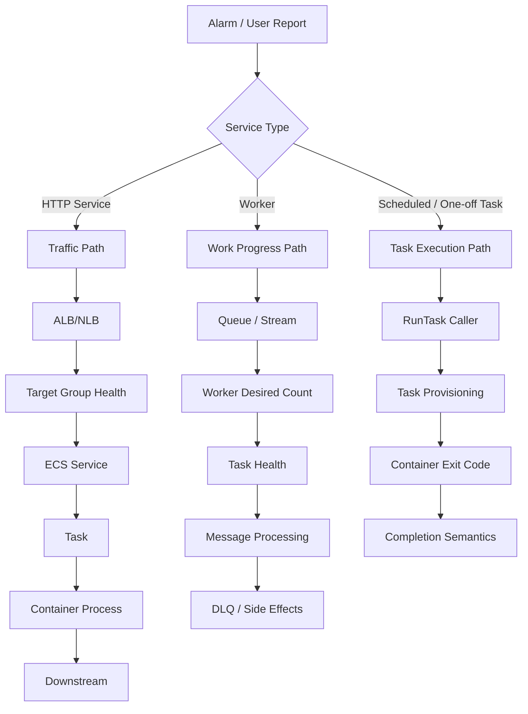
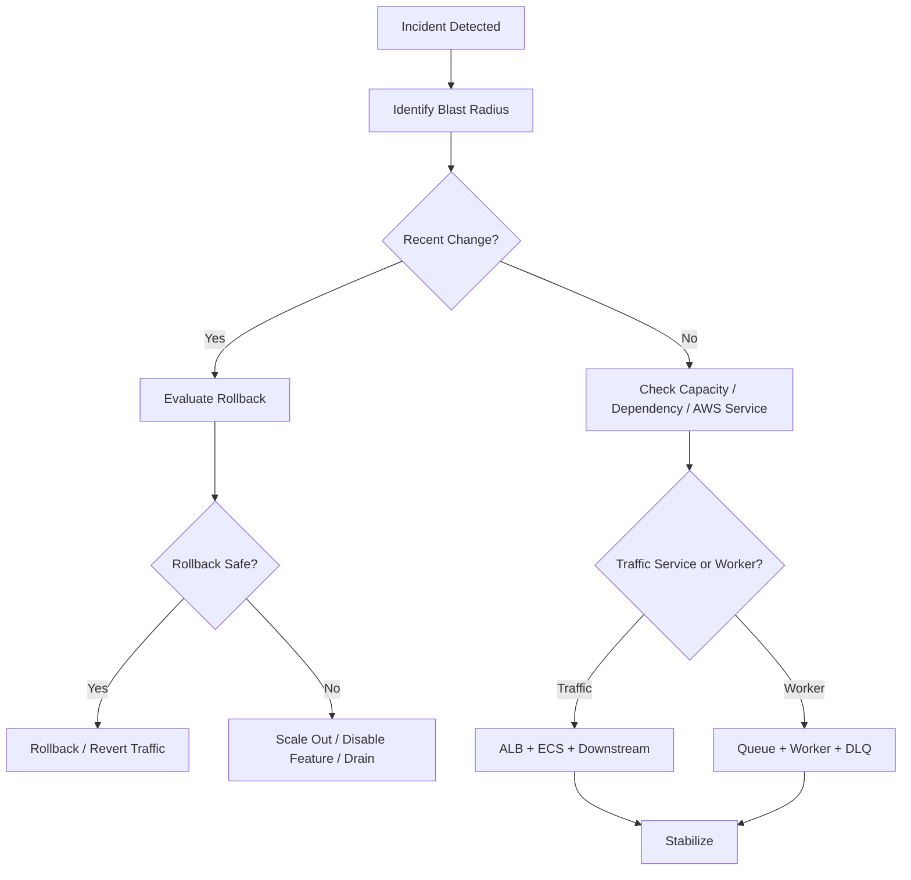
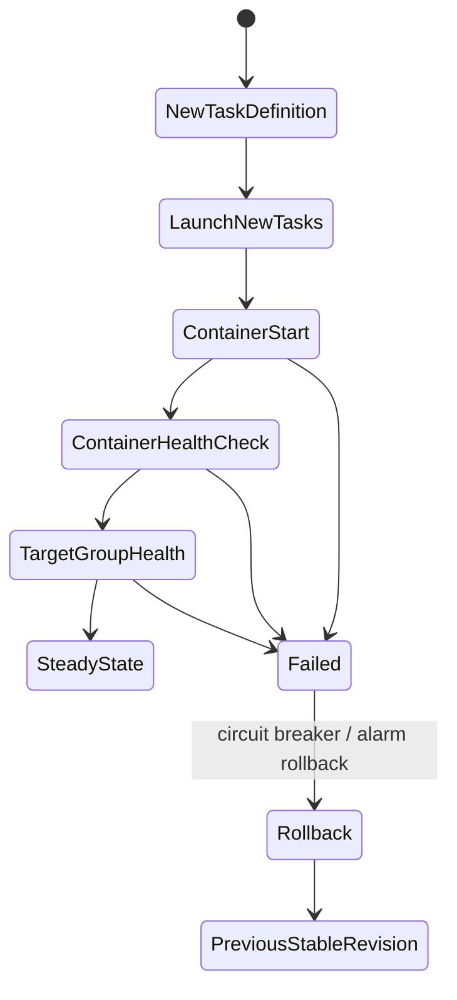
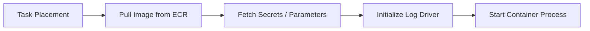
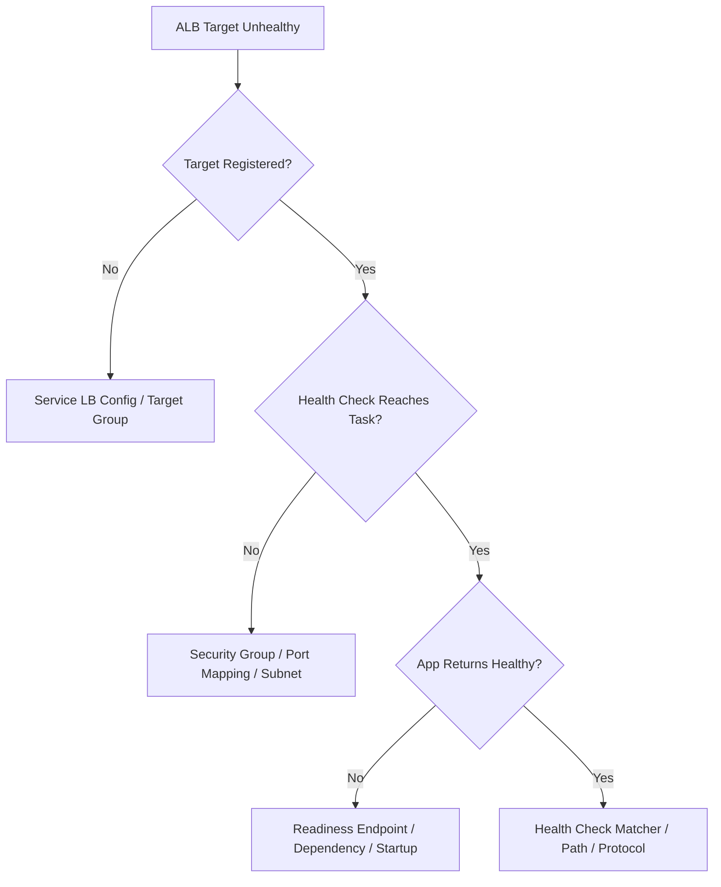
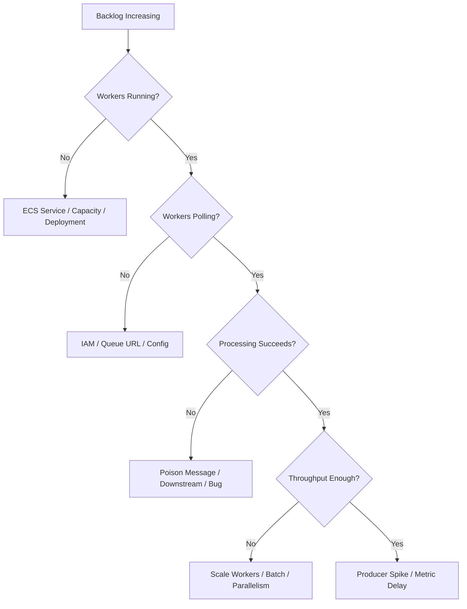
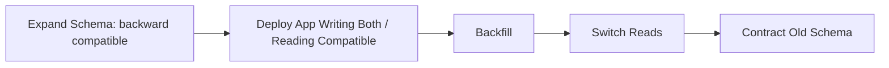
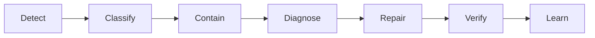

# Part 027 — ECS Production Runbook

Runbook adalah dokumentasi yang ditulis untuk kondisi ketika otak manusia sedang tidak ideal: jam 02:00, dashboard merah, stakeholder bertanya, dan deploy terakhir baru saja jalan.

Runbook ECS yang baik tidak dimulai dari daftar error message. Ia dimulai dari **model sistem**:

- apa invariant normalnya;
- siapa control loop yang bertanggung jawab;
- sinyal apa yang membuktikan sistem sehat;
- failure boundary ada di mana;
- tindakan apa yang aman dilakukan;
- kapan harus rollback, scale, drain, atau escalate.

ECS incident hampir selalu terlihat sebagai salah satu dari lima bentuk:

1. task tidak bisa dibuat;
2. task dibuat tetapi tidak bisa masuk `RUNNING`;
3. task `RUNNING` tetapi tidak sehat;
4. service sehat tetapi user traffic gagal;
5. worker berjalan tetapi progress berhenti.

> Jangan debug ECS dari gejala paling dekat. Debug dari lifecycle. Task memiliki perjalanan. Deployment memiliki state machine. Traffic memiliki jalur. Worker memiliki progress model.

## 1. ECS Incident Mental Model



Dalam insiden ECS, jangan langsung bertanya: “kenapa service down?”

Tanyakan lebih tajam:

1. Apakah desired task count berubah?
2. Apakah ECS berhasil menempatkan task?
3. Apakah task berhasil menarik image?
4. Apakah task berhasil mengambil secret/config/log driver?
5. Apakah container process berhasil start?
6. Apakah container health check lulus?
7. Apakah load balancer health check lulus?
8. Apakah traffic benar-benar mencapai task?
9. Apakah downstream sehat?
10. Apakah deployment baru sedang mengganti task lama?

ECS adalah control loop. Banyak insiden terjadi karena engineer membaca snapshot, bukan timeline.

## 2. Minimal Production Observability Contract

Sebelum punya runbook, service harus punya observability contract.

### 2.1 Wajib Ada untuk HTTP Service

| Area | Sinyal Minimum | Kenapa Penting |
|---|---|---|
| ALB | `HTTPCode_Target_5XX_Count`, `TargetResponseTime`, `UnHealthyHostCount` | Membuktikan apakah failure di edge/target/downstream |
| ECS Service | desired/running/pending task count | Membaca apakah scheduler berhasil menjaga kapasitas |
| Task | stopped reason, stop code, exit code | Root cause start/stop |
| Container | CPU, memory, restart/exit, application logs | Membaca pressure dan crash |
| Deployment | deployment state, rollout state, service events | Menjawab apakah bad deploy sedang terjadi |
| App | request count, latency, error rate, dependency metrics | Menjawab apakah user impact nyata |
| Trace | correlation ID lintas API/downstream | Membaca request path end-to-end |

### 2.2 Wajib Ada untuk Worker

| Area | Sinyal Minimum | Kenapa Penting |
|---|---|---|
| Queue | visible messages, age of oldest message, DLQ count | Membaca backlog dan poison message |
| ECS Service | desired/running/pending workers | Membaca capacity worker |
| Worker | messages processed, failures, retry count, processing latency | Membaca progress |
| Idempotency | duplicate count / idempotency conflict | Membaca retry safety |
| Downstream | DB/API latency, throttling, error rate | Membaca bottleneck |

### 2.3 Jangan Bergantung pada Log Saja

Log adalah forensic evidence, bukan primary health signal.

Service production butuh:

- metrics untuk alarm;
- logs untuk detail;
- traces untuk causal path;
- ECS events untuk scheduler decisions;
- deployment history untuk perubahan;
- queue metrics untuk async progress;
- CloudTrail untuk operasi manusia/pipeline.

Jika satu-satunya cara memahami incident adalah membaca log mentah secara manual, sistem belum siap production.

## 3. First Five Minutes Triage

Tujuan lima menit pertama bukan menemukan root cause sempurna. Tujuannya adalah menentukan **arah containment**.



Checklist lima menit:

1. Apakah ada deploy/config change dalam 30 menit terakhir?
2. Apakah semua AZ terdampak atau hanya satu?
3. Apakah desired count sama dengan running count?
4. Apakah pending task naik?
5. Apakah task baru berhenti dengan alasan sama?
6. Apakah target group kehilangan healthy targets?
7. Apakah error rate naik sebelum atau sesudah deployment?
8. Apakah CPU/memory/network mendekati limit?
9. Apakah queue backlog naik?
10. Apakah downstream dependency error/throttle?

Containment pertama biasanya salah satu dari:

- rollback deployment;
- scale out task;
- scale down bad worker;
- disable feature flag;
- increase reserved/desired capacity;
- pause producer;
- redrive/hold DLQ;
- drain bad AZ/subnet;
- revert config/secret;
- route traffic away dari service yang rusak.

## 4. Command Cheat Sheet

Gunakan CLI untuk membaca state mentah. Console membantu visualisasi, tetapi CLI membuat incident response lebih repeatable.

```bash
# Service overview
aws ecs describe-services \
  --cluster <cluster-name> \
  --services <service-name>

# List running tasks
aws ecs list-tasks \
  --cluster <cluster-name> \
  --service-name <service-name> \
  --desired-status RUNNING

# List stopped tasks
aws ecs list-tasks \
  --cluster <cluster-name> \
  --service-name <service-name> \
  --desired-status STOPPED

# Describe tasks including stoppedReason, stopCode, containers[].exitCode
aws ecs describe-tasks \
  --cluster <cluster-name> \
  --tasks <task-arn-1> <task-arn-2>

# Service events
aws ecs describe-services \
  --cluster <cluster-name> \
  --services <service-name> \
  --query 'services[0].events[0:20]'

# Target health
aws elbv2 describe-target-health \
  --target-group-arn <target-group-arn>

# Scale service manually during containment
aws ecs update-service \
  --cluster <cluster-name> \
  --service <service-name> \
  --desired-count <n>

# Force new deployment after config/image correction
aws ecs update-service \
  --cluster <cluster-name> \
  --service <service-name> \
  --force-new-deployment
```

Untuk Fargate private subnet, debugging sering membutuhkan korelasi antara ECS event, VPC route, security group, endpoint, NAT, dan IAM execution role. Jangan hanya membaca container log; task mungkin gagal sebelum aplikasi sempat start.

## 5. Runbook: Deployment Stuck

### Gejala

- deployment tidak mencapai steady state;
- task baru terus diganti;
- service events berulang;
- target group tetap unhealthy;
- running count fluktuatif;
- deployment circuit breaker aktif;
- rollback otomatis terjadi atau deployment berhenti.

### Model

Deployment ECS adalah state transition:



### Pertanyaan Diagnostik

1. Apakah task baru masuk `RUNNING`?
2. Apakah container essential exit?
3. Apakah task berhenti karena image pull, secret, log driver, atau app crash?
4. Apakah container health check gagal atau ALB health check gagal?
5. Apakah health check path salah?
6. Apakah `minimumHealthyPercent` dan `maximumPercent` memungkinkan replacement?
7. Apakah cluster/capacity provider punya kapasitas cukup?
8. Apakah deployment alarm masuk `ALARM`?
9. Apakah perubahan schema/config membuat versi baru incompatible?

### Tindakan Aman

- Jika user impact tinggi dan revisi lama stabil: rollback.
- Jika hanya capacity shortage: tambah desired/capacity sementara.
- Jika health check terlalu agresif: jangan langsung longgarkan tanpa bukti; cek startup latency dan readiness path.
- Jika app crash: stop deployment, inspect logs/exit code, revert image/config.
- Jika database migration incompatible: rollback aplikasi saja mungkin tidak cukup; aktifkan compatibility plan.

### Anti-Pattern

- menaikkan `healthCheckGracePeriodSeconds` untuk menyembunyikan crash;
- disable health check agar deployment “hijau”;
- force deployment berkali-kali tanpa mengubah root cause;
- rollback image tetapi tidak rollback config;
- menaikkan desired count saat semua task baru pasti crash.

## 6. Runbook: Task Tidak Bisa Pull Image

### Gejala

- task berhenti dengan `CannotPullContainerError`;
- service event menyebut gagal resolve/pull image;
- deployment stuck di task provisioning/start;
- tidak ada application log karena container belum start.

### Root Cause Umum

| Area | Contoh Root Cause |
|---|---|
| Network | private subnet tanpa NAT/VPC endpoint yang benar |
| IAM | task execution role tidak punya akses ECR |
| ECR | image/tag tidak ada, salah region/account |
| Registry | pull-through cache gagal, upstream rate limit |
| Security Group/NACL | egress ke endpoint diblokir |
| DNS | VPC DNS resolver/config salah |
| Image | image manifest architecture tidak cocok |

### Diagnosis

```bash
aws ecs describe-tasks \
  --cluster <cluster-name> \
  --tasks <stopped-task-arn> \
  --query 'tasks[0].{stopCode:stopCode,stoppedReason:stoppedReason,containers:containers}'

aws ecr describe-images \
  --repository-name <repo> \
  --image-ids imageTag=<tag>
```

Periksa:

1. Apakah task berada di private subnet?
2. Apakah subnet punya route ke NAT Gateway atau VPC endpoint yang diperlukan?
3. Apakah endpoint ECR API, ECR DKR, S3 gateway endpoint/logs/secrets tersedia sesuai kebutuhan?
4. Apakah execution role punya permission pull image?
5. Apakah image digest benar ada di ECR?
6. Apakah platform architecture cocok, misalnya `X86_64` vs `ARM64`?

### Containment

- rollback ke image digest yang terbukti ada;
- gunakan image tag/digest immutable;
- perbaiki VPC endpoint/NAT;
- perbaiki task execution role;
- hindari deploy tag mutable yang bisa hilang/berubah;
- tambahkan pre-deploy validation untuk `ecr:BatchGetImage`.

## 7. Runbook: ResourceInitializationError

### Gejala

- task gagal sebelum container app start;
- stopped reason menyebut tidak bisa menarik secret, registry auth, atau log configuration;
- sering terjadi pada Fargate private subnet.

### Model

Task startup bukan hanya menjalankan image.



Jika gagal di B/C/D, aplikasi belum punya kesempatan logging.

### Root Cause Umum

- execution role tidak punya `secretsmanager:GetSecretValue` atau `ssm:GetParameters`;
- secret ARN salah region/account;
- VPC endpoint Secrets Manager/SSM/logs/ECR tidak ada;
- security group endpoint menolak inbound dari task;
- route table private subnet tidak keluar ke NAT/endpoints;
- KMS key policy tidak mengizinkan decrypt;
- log group tidak ada dan execution role tidak bisa create stream.

### Diagnosis Cepat

1. Baca `stoppedReason` dan container reason.
2. Cek task execution role, bukan task role.
3. Cek route table subnet task.
4. Cek security group endpoint dan task.
5. Cek secret/parameter ARN.
6. Cek KMS key policy.
7. Cek CloudWatch Logs group/stream permission.

### Pencegahan

- buat synthetic `RunTask` check di pipeline setelah infra change;
- validate secret ARN dan permission sebelum deploy;
- gunakan VPC endpoints untuk private workload;
- bedakan task role dan execution role dengan jelas;
- jangan inject terlalu banyak secret jika hanya sebagian dibutuhkan;
- observability startup harus mencakup ECS stopped task reason, bukan hanya application log.

## 8. Runbook: Unhealthy Target di ALB

### Gejala

- ECS task `RUNNING`, tetapi target group unhealthy;
- ALB 5xx naik;
- deployment stuck karena target baru tidak sehat;
- app log terlihat normal tetapi traffic tidak masuk.

### Diagnosis Path



### Root Cause Umum

| Area | Root Cause |
|---|---|
| Port | containerPort salah, app listen di port berbeda |
| Bind Address | app bind ke `127.0.0.1`, bukan `0.0.0.0` |
| Security Group | ALB SG tidak boleh akses task SG |
| Path | health check path salah |
| Protocol | HTTP vs HTTPS mismatch |
| Matcher | expected status code salah |
| Startup | app belum ready ketika ALB mulai check |
| Dependency | readiness bergantung DB/cache yang lambat/down |
| Grace Period | terlalu pendek untuk startup normal |

### Prinsip Health Check

Health endpoint ALB harus menjawab: “apakah instance ini siap menerima traffic sekarang?”

Bukan:

- apakah process hidup;
- apakah semua dependency eksternal sempurna;
- apakah deployment sudah berhasil;
- apakah database schema terbaru.

Untuk Java service, pisahkan:

- `/livez`: process hidup;
- `/readyz`: siap menerima traffic;
- `/startupz` bila framework mendukung startup lifecycle;
- dependency health dengan timeout pendek dan caching defensif.

### Tindakan Aman

- Jika task baru unhealthy setelah deploy: rollback.
- Jika semua target lama juga unhealthy: cek dependency/networking.
- Jika hanya satu AZ unhealthy: cek subnet/route/security/NACL.
- Jika health path salah: fix task definition/service config dan force deployment.
- Jika startup terlalu lambat: ukur startup, tune JVM/image, lalu atur grace period sesuai data.

## 9. Runbook: Task OOM / Memory Kill

### Gejala

- container exit code 137;
- task stopped reason menunjukkan essential container exited;
- memory utilization mendekati limit;
- Java app restart terus;
- latency naik sebelum crash;
- worker memproses pesan besar lalu mati.

### Model Java di Container

Memory task bukan hanya heap.

```txt
Task Memory = JVM Heap + Metaspace + Thread Stack + Direct Buffer + Code Cache + Native Memory + Agent + OS Overhead
```

Jika heap diset terlalu dekat dengan container limit, proses terlihat sehat sampai native/off-heap/thread memory membuat task dibunuh.

### Diagnosis

1. Cek exit code dan reason.
2. Cek memory utilization sebelum stop.
3. Cek apakah workload baru memproses payload besar.
4. Cek perubahan dependency/agent.
5. Cek jumlah thread/connection pool.
6. Cek batch size worker.
7. Cek JVM flags: `MaxRAMPercentage`, `InitialRAMPercentage`, direct memory, metaspace.

### Tindakan

- turunkan heap percentage agar ada headroom;
- naikkan task memory jika workload valid;
- batasi batch size/payload size;
- batasi thread pool dan connection pool;
- tambahkan memory profiling pada staging;
- alarm pada memory slope, bukan hanya threshold statis;
- jangan cuma restart service tanpa mengubah memory behavior.

Contoh baseline container JVM:

```bash
JAVA_TOOL_OPTIONS="-XX:MaxRAMPercentage=70 -XX:InitialRAMPercentage=30 -XX:+ExitOnOutOfMemoryError"
```

Nilai ini bukan angka universal. Untuk service dengan agent, Netty, compression, TLS, dan banyak thread, headroom bisa perlu lebih besar.

## 10. Runbook: CPU Saturation dan Latency Spike

### Gejala

- CPU utilization tinggi;
- latency naik;
- ALB target response time naik;
- autoscaling menambah task tetapi tidak cukup cepat;
- GC time naik;
- downstream call timeout.

### Diagnosis

CPU tinggi bisa berarti:

- traffic valid naik;
- request lebih mahal;
- loop/bug;
- GC thrashing;
- encryption/compression overhead;
- thread pool saturated;
- retry storm;
- noisy sidecar;
- insufficient CPU allocation.

Pertanyaan penting:

1. Apakah request rate naik proporsional?
2. Apakah p95/p99 latency naik sebelum CPU?
3. Apakah error rate naik karena timeout?
4. Apakah downstream latency naik?
5. Apakah GC pause/time naik?
6. Apakah deployment baru mengubah behavior?
7. Apakah autoscaling policy memakai signal tepat?

### Tindakan

- scale out jika traffic valid;
- rollback jika CPU naik setelah deploy tanpa traffic naik;
- aktifkan rate limit/admission control;
- turunkan retry aggressiveness;
- tambah CPU task jika single-request CPU-bound;
- ubah autoscaling dari CPU-only ke request count/queue depth bila lebih tepat;
- cek JVM thread pool agar tidak membuat CPU contention.

## 11. Runbook: Pending Task / Capacity Shortage

### Gejala

- desired count naik tetapi running count tidak naik;
- pending count tinggi;
- service events menyebut tidak ada capacity;
- deployment stuck karena task baru tidak bisa ditempatkan.

### Fargate Root Cause

- service quota Fargate reached;
- subnet IP habis;
- unsupported CPU/memory/runtime platform;
- capacity temporarily unavailable di AZ tertentu;
- security/network config invalid;
- account/region capacity constraint.

### ECS on EC2 Root Cause

- container instance tidak cukup CPU/memory;
- port constraint;
- placement constraint terlalu ketat;
- ASG belum scale;
- capacity provider target capacity salah;
- instance draining;
- AMI/agent issue;
- disk pressure.

### Tindakan

- cek service events;
- cek subnet free IP;
- tambah capacity provider/ASG desired capacity;
- relax placement constraint bila aman;
- gunakan multi-AZ dengan subnet cukup besar;
- request quota increase untuk Fargate jika perlu;
- fallback ke capacity provider lain bila strategi memungkinkan.

## 12. Runbook: Logs Tidak Muncul

### Gejala

- task running tetapi tidak ada log;
- CloudWatch log stream tidak dibuat;
- task gagal start dengan log driver error;
- debugging blind.

### Root Cause

- `awslogs` configuration salah;
- log group tidak ada dan execution role tidak boleh create;
- execution role tidak punya `logs:CreateLogStream`/`logs:PutLogEvents`;
- private subnet tidak punya path ke CloudWatch Logs;
- aplikasi log ke file, bukan stdout/stderr;
- JSON log rusak atau terlalu besar;
- sidecar log router gagal.

### Aturan Production

Container harus menulis log utama ke stdout/stderr. File log di container ephemeral bukan primary observability.

Minimal log field:

```json
{
  "timestamp": "2026-07-06T10:15:30.000Z",
  "level": "INFO",
  "service": "orders-api",
  "env": "prod",
  "traceId": "...",
  "spanId": "...",
  "requestId": "...",
  "message": "order accepted"
}
```

## 13. Runbook: Secret / Config Failure

### Gejala

- task gagal start setelah secret rotation;
- config deploy membuat app crash;
- semua task baru gagal, task lama masih sehat;
- worker salah endpoint/tenant;
- Lambda/serverless peer tetap berjalan tetapi ECS service gagal.

### Diagnosis

1. Apakah perubahan secret/config baru saja terjadi?
2. Apakah task definition menunjuk ARN/version yang benar?
3. Apakah KMS policy berubah?
4. Apakah execution role punya permission fetch secret saat startup?
5. Apakah aplikasi memvalidasi config secara fail-fast?
6. Apakah config kompatibel dengan versi aplikasi?
7. Apakah secret rotation memutus koneksi lama?

### Pencegahan

- schema validation untuk config;
- canary environment sebelum prod;
- versioned secret untuk perubahan breaking;
- dual credential rotation;
- avoid changing many unrelated config values in one release;
- feature flag untuk behavior, secret/config untuk capability.

## 14. Runbook: Worker Backlog Naik

### Gejala

- SQS visible messages naik;
- age of oldest message naik;
- DLQ naik;
- worker CPU rendah tetapi backlog tinggi;
- downstream error naik;
- pesan diproses berulang.

### Diagnosis Path



### Pertanyaan Utama

1. Apakah producer rate naik?
2. Apakah worker desired count naik sesuai autoscaling?
3. Apakah message processing latency naik?
4. Apakah downstream men-throttle worker?
5. Apakah visibility timeout cukup panjang?
6. Apakah pesan poison mengunci FIFO group?
7. Apakah DLQ policy benar?
8. Apakah worker idempotent?

### Tindakan Aman

- scale out worker bila downstream mampu;
- pause producer bila backlog menyebabkan kerusakan data;
- isolate poison message ke DLQ;
- turunkan batch size jika satu batch sering gagal;
- naikkan visibility timeout bila proses valid lebih lama;
- gunakan partial failure handling bila applicable;
- jangan redrive DLQ sebelum bug diperbaiki.

## 15. Runbook: Service Discovery Failure

### Gejala

- service A tidak bisa memanggil service B;
- DNS resolve kadang gagal;
- connection refused/intermittent timeout;
- retry storm antar service;
- deployment service B menyebabkan service A error.

### Root Cause

- stale DNS cache di client;
- target task B belum ready tapi sudah discoverable;
- security group east-west tidak mengizinkan traffic;
- Cloud Map record belum update;
- Service Connect namespace/config salah;
- client timeout terlalu panjang;
- retry tanpa jitter;
- circuit breaker tidak ada;
- service B scale-in memutus koneksi.

### Prinsip

Service discovery bukan reliability. Ia hanya memberi alamat. Reliability tetap butuh:

- timeout pendek;
- retry budget;
- exponential backoff + jitter;
- circuit breaker;
- bulkhead;
- readiness yang benar;
- idempotent request;
- fallback/degradation.

## 16. Runbook: NAT atau VPC Endpoint Bottleneck

### Gejala

- task gagal pull image/secret/log secara sporadis;
- latency ke AWS service naik;
- private subnet workload tiba-tiba gagal start;
- NAT data processing cost melonjak;
- satu AZ terdampak lebih kuat.

### Diagnosis

Periksa:

- apakah task di private subnet bergantung pada NAT untuk ECR/Logs/Secrets;
- apakah VPC endpoints tersedia per AZ yang relevan;
- apakah endpoint security group mengizinkan dari task SG;
- apakah route table benar;
- apakah DNS private hosted endpoint aktif;
- apakah NAT per AZ atau cross-AZ NAT menjadi bottleneck/cost trap.

### Pencegahan

- gunakan VPC endpoints untuk ECR API, ECR DKR, CloudWatch Logs, Secrets Manager, SSM sesuai kebutuhan;
- gunakan S3 gateway endpoint untuk ECR layer path bila diperlukan;
- desain NAT per AZ bila tetap butuh internet egress;
- monitor NAT bytes/connection/error metrics;
- masukkan bootstrap connectivity test ke deployment pipeline.

## 17. Runbook: Database Connection Storm

### Gejala

- scale-out ECS membuat DB connection meledak;
- deployment rolling menggandakan sementara jumlah task;
- DB max connection reached;
- request timeout walaupun ECS sehat;
- rollback tidak langsung pulih karena koneksi lama bertahan.

### Model

Jika satu task membuka 50 koneksi dan deployment sementara membuat task dua kali lipat, connection demand juga bisa dua kali lipat.

```txt
Peak Connections = max_running_tasks_during_deployment * per_task_pool_size * app_instances_per_task
```

### Tindakan

- batasi per-task connection pool;
- hitung connection budget saat deployment, bukan steady state saja;
- gunakan RDS Proxy bila cocok;
- gunakan graceful shutdown agar koneksi ditutup;
- atur `maximumPercent` deployment dengan DB capacity;
- jangan scale out membabi-buta saat bottleneck ada di DB.

## 18. Runbook: Bad Deploy dengan Database Migration

### Gejala

- task baru sehat, tetapi error domain naik;
- task lama gagal setelah migration;
- rollback aplikasi tidak menyelesaikan data/schema incompatibility;
- worker lama dan API baru berbeda interpretasi data.

### Prinsip Expand-Migrate-Contract



Deployment ECS tidak boleh dipisahkan dari compatibility data.

Checklist:

- migration backward compatible?
- versi lama dan baru bisa berjalan bersamaan?
- worker/API membaca schema sama?
- event schema kompatibel?
- rollback plan data ada?
- migration bisa diulang/idempotent?

## 19. Incident Decision Matrix

| Kondisi | Tindakan Bias |
|---|---|
| Error naik tepat setelah deploy | rollback/revert traffic |
| Task baru gagal start, task lama sehat | stop deployment, rollback image/config |
| Semua task gagal tanpa deploy | cek dependency/network/quota/AWS service |
| Backlog worker naik dan downstream sehat | scale worker |
| Backlog naik dan downstream gagal | pause/limit producer, jangan scale agresif |
| Target unhealthy hanya revisi baru | rollback atau fix health/startup |
| Pending task karena capacity | tambah capacity / quota / subnet IP |
| OOM berulang | reduce memory pressure atau resize task |
| Secret fetch gagal | perbaiki execution role/network/secret/KMS |
| DB connection exhaustion | reduce pool/scale, throttle, use proxy, adjust deployment percent |

## 20. Alarm Design

Alarm yang baik memiliki action implication.

| Alarm | Action |
|---|---|
| ALB 5xx high | cek target health, deployment, downstream |
| UnHealthyHostCount > 0 | cek health check/deploy/startup |
| ECS running < desired | cek placement/start failure/capacity |
| ECS pending high | cek capacity/subnet/quota |
| Stopped task spike | cek stoppedReason/exit code |
| Memory > threshold/slope | cek OOM risk, heap, workload |
| SQS age high | scale worker or fix processing failure |
| DLQ > 0 | inspect poison/failure before redrive |
| Deployment failed | rollback or inspect new revision |
| NAT errors/bytes spike | cek bootstrap and egress design |

Jangan membuat alarm yang hanya berkata “CPU tinggi”. Buat alarm yang mengarahkan manusia ke keputusan.

## 21. Runbook Template untuk Setiap Service

Setiap ECS service production harus punya file runbook minimal seperti ini:

```mdx
# Runbook: <service-name>

## Ownership
- Team:
- Slack/Pager:
- Repo:
- Dashboard:
- Deployment pipeline:

## Service Contract
- Type: API / Worker / Scheduled / Orchestrated
- Cluster:
- Service:
- Task definition family:
- Load balancer / Queue / Event source:
- Critical downstream:

## Normal Invariants
- desired count:
- expected running count:
- p95 latency:
- error budget:
- queue age:
- normal CPU/memory:

## Common Incidents
### Deployment failed
Symptoms:
Checks:
Safe actions:
Rollback:

### Backlog high
Symptoms:
Checks:
Safe actions:

### Task stopped
Symptoms:
Checks:
Safe actions:

## Rollback Procedure
- Last stable version:
- Command/pipeline:
- Data compatibility notes:

## Dangerous Actions
- Do not redrive DLQ before fix.
- Do not scale worker above downstream capacity.
- Do not rollback across irreversible migration.
```

## 22. Post-Incident Learning

Setelah incident selesai, pertanyaan postmortem bukan hanya “apa root cause?”

Pertanyaan yang lebih kuat:

1. Mengapa failure ini tidak dicegah sebelum deploy?
2. Mengapa alarm yang muncul bukan alarm paling causal?
3. Apakah rollback bisa dilakukan lebih cepat?
4. Apakah runbook mengurangi cognitive load?
5. Apakah deployment blast radius terlalu besar?
6. Apakah service punya readiness contract yang salah?
7. Apakah autoscaling memperburuk insiden?
8. Apakah retry menciptakan amplification?
9. Apakah data consistency terdampak?
10. Apa invariant baru yang harus dimonitor?

Top engineer tidak hanya memperbaiki bug. Mereka memperbaiki **sistem yang mengizinkan bug menjadi incident besar**.

## 23. Final Mental Model

ECS production runbook adalah gabungan dari:

- scheduler state;
- task lifecycle;
- deployment lifecycle;
- network path;
- load balancer health;
- app runtime behavior;
- downstream dependency;
- queue progress;
- observability evidence;
- human decision boundary.

Jika runbook hanya berisi “restart service”, itu bukan runbook. Itu tombol panik.

Runbook yang baik membuat incident response menjadi state machine:



Tujuan akhirnya bukan agar tidak pernah ada insiden. Tujuannya agar setiap insiden:

- cepat terlihat;
- blast radius kecil;
- containment jelas;
- rollback aman;
- root cause bisa dibuktikan;
- sistem menjadi lebih kuat setelahnya.

## Referensi Resmi

- Amazon ECS — Resolve stopped task errors: https://docs.aws.amazon.com/AmazonECS/latest/developerguide/resolve-stopped-errors.html
- Amazon ECS — CannotPullContainer task errors: https://docs.aws.amazon.com/AmazonECS/latest/developerguide/task_cannot_pull_image.html
- Amazon ECS — ResourceInitializationError: https://docs.aws.amazon.com/AmazonECS/latest/developerguide/resource-initialization-error.html
- Amazon ECS — Stopped task error codes: https://docs.aws.amazon.com/AmazonECS/latest/developerguide/stopped-task-error-codes.html
- Amazon ECS — Deployment circuit breaker: https://docs.aws.amazon.com/AmazonECS/latest/developerguide/deployment-circuit-breaker.html
- Amazon ECS — CloudWatch alarms for deployment failures: https://docs.aws.amazon.com/AmazonECS/latest/developerguide/deployment-alarm-failure.html
- Elastic Load Balancing — Target group health checks: https://docs.aws.amazon.com/elasticloadbalancing/latest/application/target-group-health-checks.html
