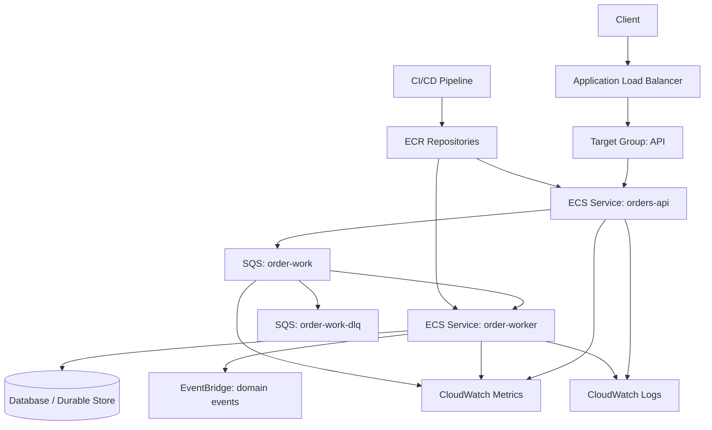
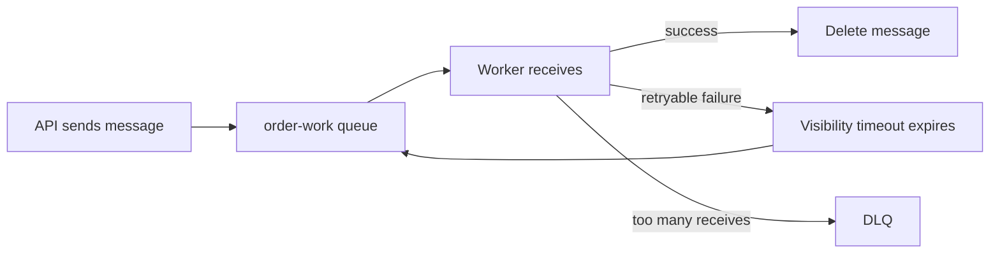
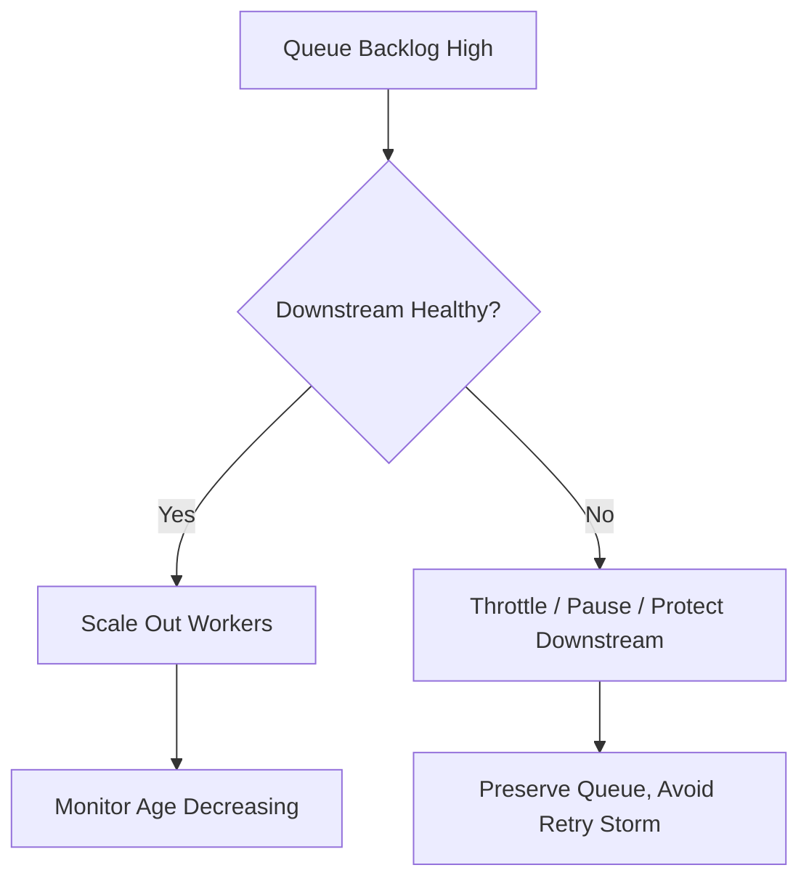
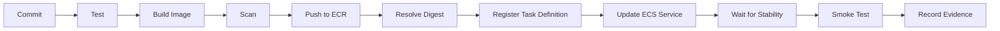

# Part 028 — ECS Lab: API + Worker Platform

Di part ini kita membangun platform kecil tetapi production-like:

- Java API service di ECS/Fargate;
- async worker service di ECS/Fargate;
- ECR sebagai image registry;
- ALB sebagai ingress;
- SQS sebagai buffer;
- DLQ sebagai failure isolation;
- CloudWatch Logs dan metrics;
- ECS Service Auto Scaling;
- deployment circuit breaker;
- runbook dan failure drills.

Tujuan lab ini bukan membuat “hello world ECS”. Tujuannya membuat kerangka sistem yang cukup nyata untuk melatih keputusan production.

> Lab yang baik tidak hanya membuktikan happy path. Lab yang baik memaksa kita melihat startup failure, deployment failure, backlog, retry, idempotency, memory pressure, dan rollback.

## 1. Target Architecture



Kita sengaja memilih API + worker karena pola ini merepresentasikan banyak sistem production:

1. API menerima command cepat.
2. API menulis work item ke queue.
3. Worker memproses secara asynchronous.
4. Queue menyerap spike dan downstream slowness.
5. Worker autoscaling berdasarkan backlog.
6. DLQ mengisolasi poison message.
7. Deployment API dan worker bisa berbeda cadence.

## 2. Workload Contract

### 2.1 API Contract

API harus:

- menerima request `POST /orders`;
- memvalidasi payload;
- menghasilkan `orderId`;
- mengirim pesan ke SQS;
- mengembalikan `202 Accepted`;
- tidak menunggu worker selesai;
- expose `/livez` dan `/readyz`;
- log structured event dengan correlation ID.

Contoh response:

```json
{
  "orderId": "ord_123",
  "status": "ACCEPTED"
}
```

### 2.2 Worker Contract

Worker harus:

- poll SQS;
- parse message;
- melakukan idempotency check;
- memproses order;
- menulis result;
- menghapus message hanya setelah side effect sukses;
- gagal secara eksplisit jika payload invalid;
- membedakan retryable dan non-retryable failure;
- support graceful shutdown;
- expose metrics progress.

### 2.3 Failure Semantics

| Failure | Expected Behavior |
|---|---|
| API downstream SQS gagal | API return 5xx/503, jangan mengaku accepted |
| Worker crash sebelum delete message | SQS redeliver setelah visibility timeout |
| Worker memproses duplicate | idempotency mencegah duplicate side effect |
| Poison message | masuk DLQ setelah max receive count |
| Deployment worker gagal | deployment rollback, backlog tidak hilang |
| API task unhealthy | ALB stop routing ke task |
| Queue backlog tinggi | worker scale out selama downstream mampu |

## 3. Repository Layout

Gunakan satu repo agar lab mudah dipahami, tetapi pisahkan runtime artifact API dan worker.

```txt
aws-ecs-api-worker-lab/
  apps/
    orders-api/
      pom.xml
      src/main/java/...
      Dockerfile
    order-worker/
      pom.xml
      src/main/java/...
      Dockerfile
  infra/
    cdk/                 # atau terraform/
      bin/
      lib/
  ops/
    runbooks/
      ecs-orders-api.md
      ecs-order-worker.md
    dashboards/
    alarms/
  scripts/
    build-and-push.sh
    deploy.sh
    smoke-test.sh
    failure-drills.sh
```

Jika tim besar, API dan worker boleh dipisah repository. Untuk lab, monorepo memperjelas relasi end-to-end.

## 4. Java API Skeleton

Gunakan Spring Boot, Micronaut, Quarkus, atau framework Java lain. Konsepnya sama. Contoh minimal controller:

```java
@RestController
@RequestMapping("/orders")
public class OrderController {
    private final SqsClient sqsClient;
    private final String queueUrl;

    public OrderController(SqsClient sqsClient,
                           @Value("${app.queue-url}") String queueUrl) {
        this.sqsClient = sqsClient;
        this.queueUrl = queueUrl;
    }

    @PostMapping
    public ResponseEntity<OrderAcceptedResponse> create(@RequestBody CreateOrderRequest request,
                                                        @RequestHeader(value = "X-Correlation-Id", required = false) String correlationId) {
        String orderId = "ord_" + UUID.randomUUID();
        String effectiveCorrelationId = correlationId != null ? correlationId : UUID.randomUUID().toString();

        String payload = """
            {
              "orderId": "%s",
              "customerId": "%s",
              "correlationId": "%s"
            }
            """.formatted(orderId, request.customerId(), effectiveCorrelationId);

        sqsClient.sendMessage(SendMessageRequest.builder()
            .queueUrl(queueUrl)
            .messageBody(payload)
            .messageAttributes(Map.of(
                "correlationId", MessageAttributeValue.builder()
                    .dataType("String")
                    .stringValue(effectiveCorrelationId)
                    .build()
            ))
            .build());

        return ResponseEntity.accepted().body(new OrderAcceptedResponse(orderId, "ACCEPTED"));
    }
}
```

Health endpoint harus murah dan predictable.

```java
@RestController
public class HealthController {
    @GetMapping("/livez")
    public Map<String, String> live() {
        return Map.of("status", "live");
    }

    @GetMapping("/readyz")
    public Map<String, String> ready() {
        return Map.of("status", "ready");
    }
}
```

Untuk production, `/readyz` boleh memeriksa dependency kritis, tetapi dengan timeout pendek. Jangan biarkan health check menggantung karena downstream lambat.

## 5. Java Worker Skeleton

Worker harus memperlakukan message sebagai state transition.

```java
public class OrderWorker implements Runnable {
    private final SqsClient sqs;
    private final String queueUrl;
    private volatile boolean running = true;

    public OrderWorker(SqsClient sqs, String queueUrl) {
        this.sqs = sqs;
        this.queueUrl = queueUrl;
    }

    @Override
    public void run() {
        Runtime.getRuntime().addShutdownHook(new Thread(() -> running = false));

        while (running) {
            ReceiveMessageResponse response = sqs.receiveMessage(ReceiveMessageRequest.builder()
                .queueUrl(queueUrl)
                .maxNumberOfMessages(5)
                .waitTimeSeconds(20)
                .visibilityTimeout(60)
                .messageAttributeNames("All")
                .build());

            for (Message message : response.messages()) {
                try {
                    process(message);
                    sqs.deleteMessage(DeleteMessageRequest.builder()
                        .queueUrl(queueUrl)
                        .receiptHandle(message.receiptHandle())
                        .build());
                } catch (NonRetryableMessageException e) {
                    // Option A: delete and emit failure event
                    // Option B: let DLQ policy handle after max receives
                    throw e;
                } catch (Exception e) {
                    // Do not delete. Let SQS redeliver.
                    logFailure(message, e);
                }
            }
        }
    }

    private void process(Message message) {
        // 1. Parse
        // 2. Validate
        // 3. Idempotency check
        // 4. Side effect
        // 5. Emit domain event
    }
}
```

Dalam production, jangan mengandalkan `throw e` di loop utama jika satu poison message bisa membunuh seluruh worker terus-menerus. Lebih baik pisahkan:

- message-level error handling;
- process-level fatal error handling;
- DLQ policy;
- metrics per failure type.

## 6. Dockerfile API dan Worker

Contoh Dockerfile Java production-friendly:

```dockerfile
# syntax=docker/dockerfile:1
FROM eclipse-temurin:21-jdk AS build
WORKDIR /workspace
COPY pom.xml .
COPY src ./src
RUN ./mvnw -q -DskipTests package

FROM eclipse-temurin:21-jre
WORKDIR /app
RUN useradd --system --uid 10001 appuser
COPY --from=build /workspace/target/app.jar /app/app.jar
USER 10001
EXPOSE 8080
ENV JAVA_TOOL_OPTIONS="-XX:MaxRAMPercentage=70 -XX:InitialRAMPercentage=30 -XX:+ExitOnOutOfMemoryError"
ENTRYPOINT ["java", "-jar", "/app/app.jar"]
```

Untuk lab, API dan worker boleh memakai Dockerfile serupa. Di production, optimalkan image size, dependency cache, SBOM, base image patching, dan digest pinning.

## 7. ECR Repository Strategy

Buat dua repository:

```txt
orders-api
order-worker
```

Tag strategy:

```txt
<git-sha>
<semver>-<git-sha>
promoted-prod-<timestamp>   # optional evidence tag, bukan deployment identity utama
```

Deployment harus prefer digest:

```txt
123456789012.dkr.ecr.ap-southeast-1.amazonaws.com/orders-api@sha256:...
```

Tag mutable memudahkan demo tetapi berbahaya untuk production. Digest membuat rollback dan audit lebih jelas.

## 8. Infrastructure Components

Minimal infrastructure:

| Component | Purpose |
|---|---|
| VPC | Network boundary |
| Private subnets | ECS tasks |
| Public subnets | ALB/NAT if needed |
| ECR repos | Image registry |
| ECS cluster | Compute control boundary |
| Task execution role | Pull image, write logs, fetch startup secrets |
| Task role API | Send message to SQS |
| Task role worker | Receive/delete SQS, write result/event |
| CloudWatch log groups | Runtime logs |
| SQS queue | Async work buffer |
| SQS DLQ | Poison message isolation |
| ALB | Public ingress |
| Target group | API task routing |
| ECS API service | HTTP service |
| ECS worker service | Queue consumer |
| Autoscaling policies | Scale API/worker |
| CloudWatch alarms | Failure detection |

Untuk private subnet, tambahkan VPC endpoints sesuai kebutuhan:

- ECR API;
- ECR Docker registry;
- S3 gateway endpoint untuk layer path;
- CloudWatch Logs;
- SQS;
- Secrets Manager/SSM jika dipakai.

## 9. ECS Task Definition: API

Kontrak task definition API:

```json
{
  "family": "orders-api",
  "networkMode": "awsvpc",
  "requiresCompatibilities": ["FARGATE"],
  "cpu": "512",
  "memory": "1024",
  "runtimePlatform": {
    "cpuArchitecture": "X86_64",
    "operatingSystemFamily": "LINUX"
  },
  "executionRoleArn": "arn:aws:iam::<account>:role/ecsTaskExecutionRole",
  "taskRoleArn": "arn:aws:iam::<account>:role/ordersApiTaskRole",
  "containerDefinitions": [
    {
      "name": "orders-api",
      "image": "<account>.dkr.ecr.<region>.amazonaws.com/orders-api@sha256:<digest>",
      "essential": true,
      "portMappings": [
        { "containerPort": 8080, "protocol": "tcp" }
      ],
      "environment": [
        { "name": "APP_QUEUE_URL", "value": "https://sqs.<region>.amazonaws.com/<account>/order-work" }
      ],
      "healthCheck": {
        "command": ["CMD-SHELL", "curl -f http://localhost:8080/livez || exit 1"],
        "interval": 30,
        "timeout": 5,
        "retries": 3,
        "startPeriod": 30
      },
      "logConfiguration": {
        "logDriver": "awslogs",
        "options": {
          "awslogs-group": "/ecs/orders-api",
          "awslogs-region": "<region>",
          "awslogs-stream-prefix": "ecs"
        }
      }
    }
  ]
}
```

Catatan:

- container health check adalah process-level signal;
- ALB target group health check adalah traffic-readiness signal;
- jangan mengganti keduanya tanpa alasan;
- `taskRoleArn` harus boleh `sqs:SendMessage` hanya ke queue target;
- `executionRoleArn` bukan role aplikasi.

## 10. ECS Task Definition: Worker

Worker tidak expose port ke ALB. Health check bisa berupa process check atau internal lightweight endpoint jika worker menyediakan HTTP admin port.

```json
{
  "family": "order-worker",
  "networkMode": "awsvpc",
  "requiresCompatibilities": ["FARGATE"],
  "cpu": "512",
  "memory": "1024",
  "executionRoleArn": "arn:aws:iam::<account>:role/ecsTaskExecutionRole",
  "taskRoleArn": "arn:aws:iam::<account>:role/orderWorkerTaskRole",
  "containerDefinitions": [
    {
      "name": "order-worker",
      "image": "<account>.dkr.ecr.<region>.amazonaws.com/order-worker@sha256:<digest>",
      "essential": true,
      "environment": [
        { "name": "APP_QUEUE_URL", "value": "https://sqs.<region>.amazonaws.com/<account>/order-work" },
        { "name": "APP_MAX_MESSAGES", "value": "5" },
        { "name": "APP_VISIBILITY_TIMEOUT_SECONDS", "value": "60" }
      ],
      "logConfiguration": {
        "logDriver": "awslogs",
        "options": {
          "awslogs-group": "/ecs/order-worker",
          "awslogs-region": "<region>",
          "awslogs-stream-prefix": "ecs"
        }
      }
    }
  ]
}
```

Worker task role minimal:

```json
{
  "Version": "2012-10-17",
  "Statement": [
    {
      "Effect": "Allow",
      "Action": [
        "sqs:ReceiveMessage",
        "sqs:DeleteMessage",
        "sqs:ChangeMessageVisibility",
        "sqs:GetQueueAttributes"
      ],
      "Resource": "arn:aws:sqs:<region>:<account>:order-work"
    }
  ]
}
```

## 11. SQS Queue and DLQ Design



Configuration baseline:

| Setting | Baseline | Reason |
|---|---:|---|
| Visibility timeout | 2–6x p99 processing time | prevent duplicate in normal processing |
| Message retention | sesuai recovery window | allow replay/backlog recovery |
| Max receive count | 3–5 | avoid infinite poison loop |
| DLQ retention | longer than source | enough forensic time |
| Long polling | 10–20 sec | reduce empty polling/cost |

Visibility timeout bukan lock sempurna. Worker tetap harus idempotent.

## 12. ECS Service: API

API service configuration:

- desired count: minimal 2 untuk multi-AZ baseline;
- launch type/capacity provider: Fargate;
- subnets: private subnets multi-AZ;
- security group: allow inbound hanya dari ALB SG ke port 8080;
- ALB target group type: `ip`;
- health check path: `/readyz`;
- deployment circuit breaker: enabled with rollback;
- deployment alarms: error rate/latency/target unhealthy;
- minimum healthy percent: misalnya 100;
- maximum percent: misalnya 200.

Deployment config harus dihitung bersama DB/downstream connection budget. `maximumPercent=200` berarti task lama dan baru bisa hidup bersamaan.

## 13. ECS Service: Worker

Worker service configuration:

- desired count: mulai dari 1–2;
- no load balancer;
- private subnets;
- security group egress ke SQS/VPC endpoints/downstream;
- deployment circuit breaker enabled;
- autoscaling berdasarkan queue backlog atau age;
- graceful shutdown handling;
- reserved downstream capacity.

Worker scaling lebih baik memakai backlog signal daripada CPU-only.

Contoh metric target:

```txt
Backlog per task = ApproximateNumberOfMessagesVisible / RunningTaskCount
```

Scale out jika backlog per task terlalu tinggi atau age oldest message melewati SLO.

## 14. Autoscaling Design

### 14.1 API Scaling

Sinyal kandidat:

- ALB request count per target;
- CPU utilization;
- memory utilization;
- p95 latency;
- custom concurrency metric.

Untuk API, `ALBRequestCountPerTarget` sering lebih causal daripada CPU jika request cost relatif stabil. CPU tetap berguna untuk saturation guard.

### 14.2 Worker Scaling

Sinyal kandidat:

- queue visible messages;
- age of oldest message;
- backlog per task;
- processing latency;
- downstream throttling.

Jangan scale worker jika downstream sedang throttle. Scaling dalam kondisi downstream gagal dapat memperburuk incident.



## 15. Deployment Pipeline

Pipeline minimal:



Gate penting:

- unit tests;
- container build reproducible;
- vulnerability threshold;
- image digest captured;
- task definition rendered;
- IAM diff reviewed;
- deployment circuit breaker enabled;
- smoke test after service stable;
- rollback command known.

Contoh build/push script:

```bash
#!/usr/bin/env bash
set -euo pipefail

REGION="ap-southeast-1"
ACCOUNT_ID="$(aws sts get-caller-identity --query Account --output text)"
GIT_SHA="$(git rev-parse --short=12 HEAD)"
REPO="$1"
APP_DIR="$2"

IMAGE_URI="${ACCOUNT_ID}.dkr.ecr.${REGION}.amazonaws.com/${REPO}:${GIT_SHA}"

aws ecr get-login-password --region "$REGION" \
  | docker login --username AWS --password-stdin "${ACCOUNT_ID}.dkr.ecr.${REGION}.amazonaws.com"

docker build -t "$IMAGE_URI" "$APP_DIR"
docker push "$IMAGE_URI"

DIGEST="$(aws ecr describe-images \
  --region "$REGION" \
  --repository-name "$REPO" \
  --image-ids imageTag="$GIT_SHA" \
  --query 'imageDetails[0].imageDigest' \
  --output text)"

echo "${ACCOUNT_ID}.dkr.ecr.${REGION}.amazonaws.com/${REPO}@${DIGEST}"
```

## 16. Smoke Tests

Smoke test API:

```bash
ALB_URL="https://orders.example.com"

curl -f "${ALB_URL}/readyz"

curl -f -X POST "${ALB_URL}/orders" \
  -H 'Content-Type: application/json' \
  -H 'X-Correlation-Id: smoke-test-001' \
  -d '{"customerId":"cust_001"}'
```

Smoke test worker:

1. Kirim message test ke queue.
2. Pastikan visible message turun.
3. Pastikan log worker memuat correlation ID.
4. Pastikan side effect/result/event muncul.
5. Pastikan tidak masuk DLQ.

Smoke test harus membuktikan end-to-end, bukan hanya ALB health.

## 17. Observability Dashboard

Dashboard minimal:

### API Panel

- request count;
- target response time p50/p95/p99;
- ALB 4xx/5xx;
- target group healthy/unhealthy host count;
- ECS desired/running/pending count;
- CPU/memory;
- deployment events;
- app error rate;
- logs by correlation ID.

### Worker Panel

- queue visible messages;
- age of oldest message;
- DLQ messages;
- worker desired/running/pending count;
- messages processed per minute;
- failures by type;
- processing latency;
- CPU/memory;
- downstream latency/error.

### Release Panel

- current task definition revision;
- image digest;
- deployment status;
- last successful deployment;
- circuit breaker/rollback event;
- alarm state.

## 18. Alarms

Minimal alarms:

| Alarm | Threshold Example | Action |
|---|---|---|
| API 5xx high | > baseline for 5 min | inspect deploy/downstream |
| Target unhealthy | > 0 for 2 periods | inspect health/check startup |
| Running < desired | for 3 periods | inspect stopped tasks/capacity |
| Pending task high | for 5 min | inspect capacity/subnet/quota |
| Memory high | > 85% | inspect leak/batch/heap |
| Queue age high | > SLO | scale/fix worker |
| DLQ not empty | > 0 | inspect poison before redrive |
| Deployment failed | immediate | rollback/diagnose |

Alarm harus punya runbook link. Alarm tanpa action hanya membuat noise.

## 19. Failure Drills

Lab ini belum selesai sampai kita sengaja merusaknya.

### Drill 1 — Bad Image

Deploy image dengan command salah.

Expected:

- task gagal start;
- deployment tidak steady;
- circuit breaker rollback;
- service lama tetap melayani traffic.

Validate:

```bash
aws ecs describe-services --cluster <cluster> --services orders-api
aws ecs describe-tasks --cluster <cluster> --tasks <stopped-task>
```

### Drill 2 — Health Check Salah

Ubah ALB health check path ke `/wrong`.

Expected:

- target unhealthy;
- deployment stuck/rollback;
- dashboard menunjukkan target health failure.

Learning:

- app process running tidak sama dengan traffic-ready.

### Drill 3 — Worker Poison Message

Kirim message invalid.

Expected:

- worker gagal memproses;
- message retry;
- setelah max receive count masuk DLQ;
- worker tidak mati permanen;
- alarm DLQ menyala.

### Drill 4 — Downstream Lambat

Simulasikan proses worker sleep lebih lama dari visibility timeout.

Expected:

- duplicate processing mungkin terjadi;
- idempotency mencegah duplicate side effect;
- metrics processing latency naik.

Learning:

- visibility timeout harus disesuaikan dengan p99 processing;
- idempotency tetap wajib.

### Drill 5 — Memory Pressure

Tambahkan payload besar atau memory allocation sementara.

Expected:

- memory utilization naik;
- mungkin exit code 137 jika melewati limit;
- alarm memory/OOM terlihat;
- runbook mengarahkan ke heap/headroom.

### Drill 6 — Scale Out Storm

Kirim banyak pesan ke queue.

Expected:

- backlog naik;
- worker autoscaling menaikkan desired count;
- age oldest message turun;
- downstream tetap aman.

Learning:

- scaling sukses bukan hanya running task naik;
- scaling sukses berarti backlog age turun tanpa merusak downstream.

## 20. Production Readiness Checklist

### 20.1 API

- [ ] desired count minimal 2;
- [ ] multi-AZ placement;
- [ ] ALB health check ke readiness endpoint;
- [ ] deployment circuit breaker enabled;
- [ ] rollback tested;
- [ ] structured logs with correlation ID;
- [ ] metrics request/latency/error;
- [ ] task role least privilege;
- [ ] execution role least privilege;
- [ ] no secrets in image/logs;
- [ ] memory/CPU sized with load test;
- [ ] graceful shutdown implemented;
- [ ] DB/downstream timeout configured;
- [ ] retry budget with jitter.

### 20.2 Worker

- [ ] idempotent processing;
- [ ] visibility timeout sized;
- [ ] DLQ configured;
- [ ] poison message behavior tested;
- [ ] queue age alarm;
- [ ] DLQ alarm;
- [ ] worker autoscaling based on backlog;
- [ ] downstream capacity respected;
- [ ] graceful shutdown implemented;
- [ ] message schema versioned;
- [ ] backfill/replay strategy known.

### 20.3 Platform

- [ ] image digest deployment;
- [ ] ECR scanning/policy;
- [ ] lifecycle policy;
- [ ] private subnet connectivity validated;
- [ ] VPC endpoints/NAT cost reviewed;
- [ ] CloudWatch log groups retention set;
- [ ] dashboards exist;
- [ ] alarms have runbook links;
- [ ] IaC owns infra;
- [ ] manual console drift controlled;
- [ ] teardown/cleanup documented.

## 21. Cost Check

Lab production-like bisa mahal jika dibiarkan.

Cost surfaces:

- ALB hourly + LCU;
- NAT Gateway hourly + data processing;
- Fargate vCPU/memory runtime;
- CloudWatch Logs ingestion/storage;
- SQS requests;
- ECR storage/scanning;
- VPC endpoints hourly;
- telemetry cardinality.

Untuk lab pribadi:

- gunakan small Fargate task;
- matikan service saat tidak dipakai;
- set log retention pendek;
- cleanup ALB/NAT setelah latihan;
- gunakan VPC endpoints/NAT secara sadar;
- hapus ECR image lama.

## 22. Cleanup

Checklist cleanup:

```bash
# Scale services to zero first
aws ecs update-service --cluster <cluster> --service orders-api --desired-count 0
aws ecs update-service --cluster <cluster> --service order-worker --desired-count 0

# Then destroy via IaC tool
cd infra/cdk
npx cdk destroy
```

Jangan hapus VPC/security group manual sebelum service/ALB selesai dihapus. Resource dependency AWS bisa membuat cleanup gagal setengah jalan.

## 23. What Good Looks Like

Setelah lab selesai, kamu harus bisa menjawab pertanyaan ini tanpa membuka tutorial:

1. Bagaimana request masuk dari ALB ke task?
2. Bagaimana task API mendapat permission kirim SQS?
3. Apa bedanya task role dan execution role?
4. Apa yang terjadi jika image digest salah?
5. Apa yang terjadi jika health check salah?
6. Apa yang terjadi jika worker crash setelah side effect tetapi sebelum delete message?
7. Bagaimana mencegah duplicate processing?
8. Metric apa yang dipakai untuk scale worker?
9. Kapan scale worker justru berbahaya?
10. Bagaimana rollback deployment API?
11. Bagaimana tahu deployment benar-benar steady?
12. Bagaimana membaca task stop reason?
13. Bagaimana menyelidiki DLQ?
14. Bagaimana menghitung connection budget saat rolling deployment?
15. Bagaimana membuktikan sistem siap production?

Jika jawabanmu hanya “ECS menjalankan container”, berarti mental model belum cukup. Jika jawabanmu membahas lifecycle, role, queue semantics, health, autoscaling, rollback, dan observability, kamu mulai berpikir seperti platform engineer.

## 24. Final Architecture Invariant

Sistem ini sehat jika:

- API punya healthy targets di semua AZ yang direncanakan;
- ECS running count sama dengan desired count;
- deployment berada pada revisi yang diharapkan;
- queue age berada di bawah SLO;
- DLQ kosong atau sedang ditangani;
- worker throughput cukup untuk producer rate;
- task memory/CPU punya headroom;
- downstream tidak overload;
- logs/traces/metrics mengandung correlation ID;
- rollback bisa dilakukan tanpa guessing.

Lab ini adalah fondasi. Setelah ini, kita akan masuk ke EKS, di mana control surface jauh lebih fleksibel, tetapi failure mode dan ownership boundary juga jauh lebih tajam.

## Referensi Resmi

- Amazon ECS — What is Amazon ECS: https://docs.aws.amazon.com/AmazonECS/latest/developerguide/Welcome.html
- Amazon ECS — Fargate tasks and services: https://docs.aws.amazon.com/AmazonECS/latest/developerguide/fargate-tasks-services.html
- Amazon ECS — Task definitions: https://docs.aws.amazon.com/AmazonECS/latest/developerguide/task_definitions.html
- Amazon ECS — Service Auto Scaling: https://docs.aws.amazon.com/AmazonECS/latest/developerguide/service-auto-scaling.html
- Amazon ECS — Deployment circuit breaker: https://docs.aws.amazon.com/AmazonECS/latest/developerguide/deployment-circuit-breaker.html
- Amazon ECS — Resolve stopped task errors: https://docs.aws.amazon.com/AmazonECS/latest/developerguide/resolve-stopped-errors.html
- Amazon SQS — Dead-letter queues: https://docs.aws.amazon.com/AWSSimpleQueueService/latest/SQSDeveloperGuide/sqs-dead-letter-queues.html
- Step Functions — Run ECS/Fargate tasks: https://docs.aws.amazon.com/step-functions/latest/dg/connect-ecs.html
