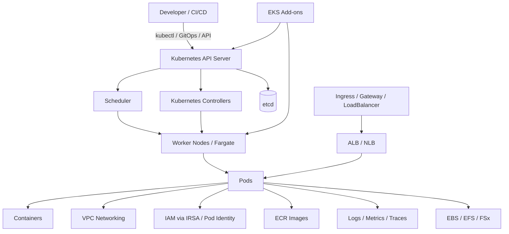
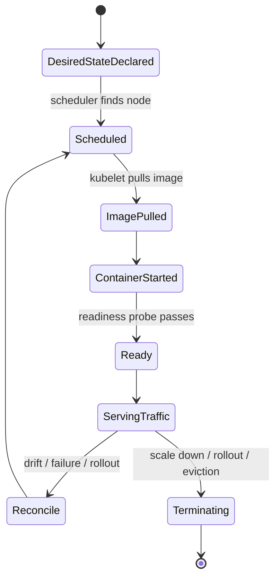
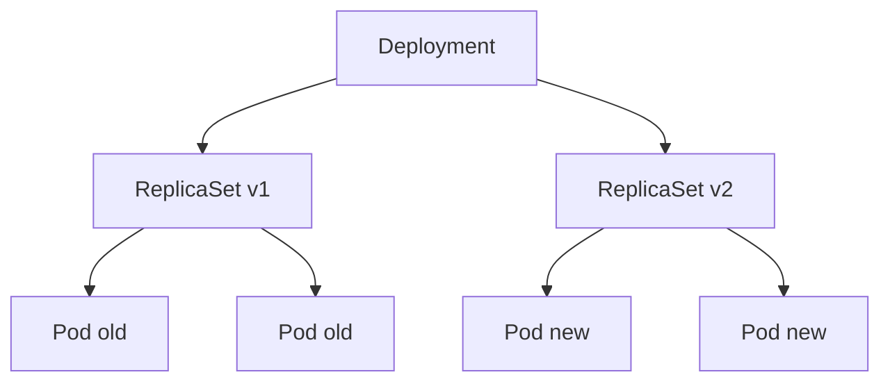
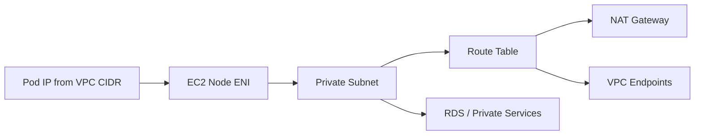
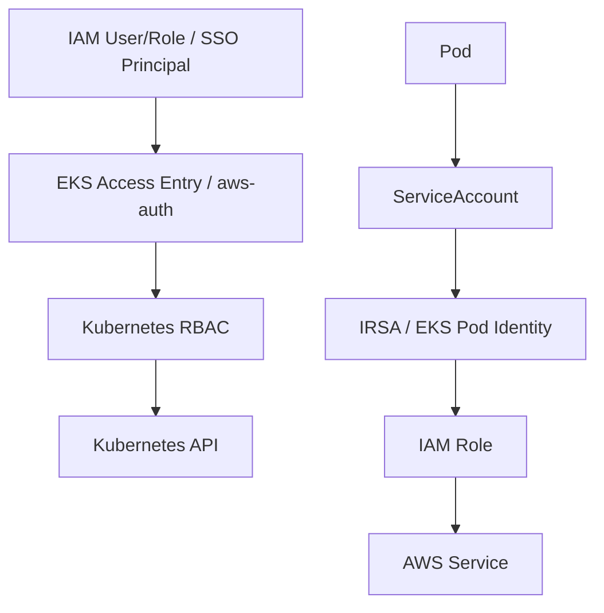
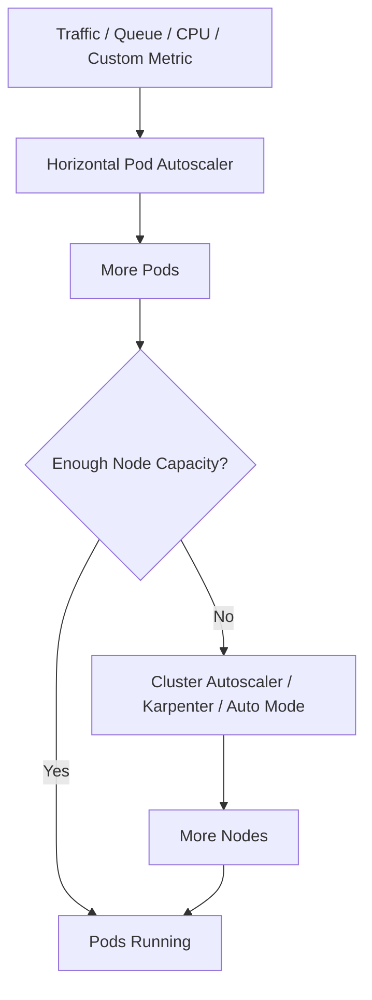
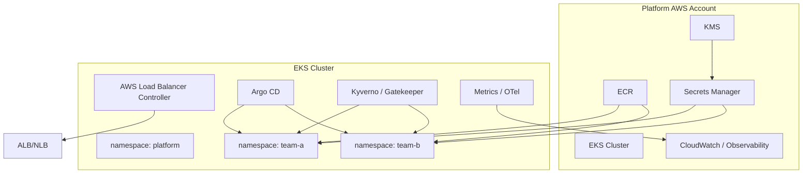

# Part 029 — EKS Mental Model

Amazon EKS bukan sekadar "Kubernetes di AWS".

Mental model yang lebih tepat:

> EKS adalah Kubernetes control plane terkelola yang dihubungkan ke AWS primitives: VPC, IAM, EC2/Fargate, ELB, EBS/EFS/FSx, CloudWatch, ECR, KMS, Auto Scaling, dan service integration lain.

Kubernetes memberi abstraksi orkestrasi workload.

AWS memberi substrate jaringan, identitas, compute, storage, observability, dan billing.

EKS duduk di antara keduanya.

Kalau ECS adalah orkestrator yang opinionated dan AWS-native, EKS adalah platform Kubernetes yang lebih fleksibel, lebih ekstensibel, dan lebih mudah menjadi platform internal multi-team — tetapi juga membawa lebih banyak moving parts.

Top 1% engineer tidak memilih EKS karena "lebih keren" atau "lebih standar industri".

Mereka memilih EKS ketika organisasi memang butuh:

- API Kubernetes sebagai platform abstraction.
- Ekosistem Kubernetes: Helm, Argo CD, Karpenter, Prometheus, Istio/Linkerd, Gatekeeper/Kyverno, External Secrets, cert-manager, Crossplane, dan operator lain.
- Multi-team platform dengan namespace tenancy dan policy guardrail.
- Portability konseptual, bukan portability absolut.
- Workload scheduling yang lebih kaya daripada ECS service placement.
- Custom controller/operator untuk domain internal.
- Traffic shaping, service mesh, admission policy, dan progressive delivery yang sangat fleksibel.

Namun EKS juga tidak gratis secara kognitif.

Ia memperkenalkan API server, etcd, controllers, kubelet, CNI, CoreDNS, admission webhook, CRD, operator, node lifecycle, pod scheduling, workload identity, dan banyak failure mode yang tidak muncul di ECS/Fargate sederhana.

Tujuan part ini adalah membangun mental model yang cukup tajam supaya kita bisa membaca EKS sebagai sistem produksi, bukan sebagai kumpulan YAML.

---

## 1. EKS dalam Satu Gambar

Di level operasional, EKS selalu terdiri dari dua wilayah tanggung jawab:

1. **Control plane** — API Kubernetes, scheduler, controllers, etcd, dan mekanisme cluster state.
2. **Data plane** — node, pod, container, CNI, kubelet, workload runtime, dan actual traffic/data processing.

AWS mengelola control plane EKS.

Engineer tetap harus mendesain data plane, add-ons, workload policy, networking, rollout, security, scaling, dan day-2 operations.

---

## 2. Apa yang AWS Kelola?

Dalam EKS standard, AWS mengelola Kubernetes control plane.

Artinya engineer tidak membuat dan memelihara sendiri API server, scheduler, controller manager, dan etcd cluster.

Tetapi ini tidak berarti seluruh cluster "fully managed" dari sudut pandang aplikasi.

AWS mengelola agar control plane tersedia dan scalable, tetapi engineer tetap memegang keputusan seperti:

- Kubernetes version yang dipakai.
- Kapan upgrade dilakukan.
- Add-on version.
- Node group/Karpenter/Fargate profile.
- Subnet dan IP capacity.
- IAM access ke cluster.
- Workload identity.
- Ingress/load balancing.
- Observability.
- Policy admission.
- Resource request/limit.
- Pod disruption behavior.
- Release management.

Pemisahan ini penting.

Kesalahan umum:

> "Karena EKS managed, berarti Kubernetes operations sudah tidak perlu dipikirkan."

Yang benar:

> EKS mengurangi beban mengoperasikan control plane, tetapi tidak menghilangkan beban platform engineering.

---

## 3. Kubernetes Bukan Container Runtime. Kubernetes Adalah Desired-State Control System

Banyak engineer pertama kali memakai Kubernetes seolah-olah ia adalah Docker Compose yang dipasang ke cloud.

Itu framing yang salah.

Kubernetes adalah control system berbasis desired state.

Kita tidak mengatakan:

> Jalankan container ini sekarang.

Kita mengatakan:

> Saya ingin ada 5 replica workload ini, dengan image ini, resource request ini, readiness rule ini, disruption policy ini, dan exposure model ini.

Kubernetes controllers lalu terus berusaha membuat actual state mendekati desired state.

Setiap resource Kubernetes adalah deklarasi kontrak:

- `Deployment`: bagaimana pod replica dijalankan dan di-rollout.
- `ReplicaSet`: replica set aktual untuk versi deployment tertentu.
- `Pod`: unit scheduling terkecil.
- `Service`: stable virtual endpoint untuk sekumpulan pod.
- `Ingress`/`Gateway`: HTTP routing abstraction.
- `ConfigMap`/`Secret`: configuration material.
- `ServiceAccount`: workload identity boundary.
- `Namespace`: logical tenancy boundary.
- `HorizontalPodAutoscaler`: scaling policy.
- `PodDisruptionBudget`: batas voluntary disruption.
- `NetworkPolicy`: network intent, jika CNI/policy engine mendukung.
- `CustomResourceDefinition`: API extension untuk operator/platform.

Kunci mental model:

> Kubernetes bukan menjalankan container. Kubernetes menjalankan rekonsiliasi state.

---

## 4. EKS vs ECS: Perbedaan Abstraksi

ECS dan EKS sama-sama menjalankan container.

Tetapi model mentalnya berbeda.

| Dimensi | ECS | EKS |
|---|---|---|
| Abstraksi utama | Task definition, task, service | Pod, deployment, service, controller |
| API platform | AWS ECS API | Kubernetes API |
| Ekosistem | AWS-native | Kubernetes ecosystem |
| Scheduler | ECS scheduler | Kubernetes scheduler |
| Extensibility | Lebih terbatas, lebih sederhana | Sangat luas via CRD/operator/admission |
| Multi-team platform | Bisa, tetapi lebih custom | Sangat umum via namespace/policy/GitOps |
| Operational complexity | Lebih rendah | Lebih tinggi |
| Networking | `awsvpc`, task ENI | VPC CNI, pod IP, service mesh, ingress controller |
| Identity | Task role | IRSA/EKS Pod Identity/service account |
| Deployment | ECS service deployment | Deployment, StatefulSet, Argo Rollouts, mesh, Helm |
| Failure modes | Lebih sedikit moving parts | Lebih banyak: API server, CNI, DNS, webhook, scheduler, node, operator |

Rule of thumb:

- Pilih **ECS/Fargate** kalau butuh container runtime AWS-native dengan operational surface rendah.
- Pilih **EKS** kalau butuh Kubernetes API, ecosystem, platform extensibility, multi-team governance, dan workload scheduling yang lebih ekspresif.

Jangan memilih EKS hanya karena ingin "menggunakan Kubernetes".

EKS layak ketika nilai platform-nya lebih besar daripada biaya operasionalnya.

---

## 5. EKS Core Objects: Bahasa Dasar Platform

### 5.1 Cluster

Cluster adalah boundary Kubernetes control plane.

Satu EKS cluster mempunyai:

- Kubernetes API endpoint.
- etcd state store yang dikelola AWS.
- Cluster identity.
- Certificate authority.
- OIDC issuer untuk workload identity.
- Network integration ke VPC/subnet/security group.
- Add-ons.
- Data plane: EC2 nodes, managed node groups, Karpenter nodes, Fargate profiles, atau EKS Auto Mode.

Cluster bukan sekadar "environment".

Cluster adalah failure domain, policy domain, upgrade domain, quota domain, dan access boundary.

Pertanyaan desain cluster:

- Satu cluster per environment atau shared multi-environment?
- Satu cluster per tenant atau shared multi-tenant?
- Satu cluster per region atau multi-region?
- Apa blast radius jika cluster API terganggu?
- Siapa yang boleh deploy CRD/admission webhook?
- Bagaimana upgrade dikendalikan?
- Bagaimana quota dan IP capacity dipantau?

### 5.2 Namespace

Namespace adalah logical boundary di dalam cluster.

Namespace berguna untuk:

- Memisahkan team.
- Memisahkan application domain.
- Menerapkan `ResourceQuota` dan `LimitRange`.
- Mengatur RBAC.
- Menargetkan network policy.
- Mengelola GitOps application grouping.

Namun namespace bukan isolation boundary yang kuat seperti account, VPC, atau cluster.

Namespace tidak otomatis mencegah:

- Node sharing.
- Kernel sharing.
- noisy neighbor CPU/memory jika request/limit buruk.
- cross-namespace traffic tanpa network policy.
- privileged pod jika admission policy lemah.
- Secret access jika RBAC salah.

Mental model:

> Namespace adalah administrative boundary. Isolation sebenarnya dibangun dari RBAC, policy, network control, runtime security, quota, dan node placement.

### 5.3 Pod

Pod adalah unit scheduling terkecil di Kubernetes.

Satu pod dapat berisi satu atau lebih container yang berbagi:

- Network namespace.
- IP address.
- localhost.
- Volumes.
- Lifecycle.

Dalam production, pod harus dibaca sebagai runtime envelope.

Pod bukan hanya container.

Pod memuat kontrak:

- Image.
- Command/args.
- Resource request/limit.
- Environment/config/secret.
- Readiness/liveness/startup probe.
- Service account.
- Security context.
- Volume mount.
- Affinity/toleration/topology.
- Termination grace period.

Kalau pod contract lemah, cluster akan menjalankan workload yang rapuh.

### 5.4 Deployment

Deployment mengelola rollout stateless replica.

Deployment membuat ReplicaSet.
ReplicaSet membuat Pod.

Deployment bukan sekadar "run app".

Deployment adalah release controller.

Ia mengatur:

- Replica count.
- Rolling update strategy.
- Max unavailable.
- Max surge.
- Rollback history.
- Selector.
- Pod template.

Masalah deployment sering muncul dari kontrak readiness yang salah.

Jika pod dianggap ready sebelum benar-benar siap menerima traffic, rollout terlihat sukses tapi user terkena error.

### 5.5 Service

Service memberi stable virtual endpoint untuk pod yang ephemeral.

Pod bisa mati, diganti, mendapat IP baru.
Service membuat endpoint logical yang stabil.

Jenis umum:

- `ClusterIP`: internal-only.
- `NodePort`: expose melalui port node.
- `LoadBalancer`: membuat cloud load balancer.
- `ExternalName`: alias DNS.

Di EKS, `LoadBalancer` sering memicu provisioning NLB, sedangkan Ingress/ALB biasanya dikelola via AWS Load Balancer Controller.

### 5.6 Ingress dan Gateway

Ingress dan Gateway adalah layer routing HTTP/HTTPS ke service.

Dalam EKS, biasanya digunakan bersama AWS Load Balancer Controller untuk membuat ALB/NLB sesuai annotation/spec.

Mental model:

- Service memberi stable endpoint internal.
- Ingress/Gateway memberi routing eksternal atau internal L7.
- Load balancer health check harus sinkron dengan readiness workload.

### 5.7 ConfigMap dan Secret

ConfigMap dan Secret menyimpan material konfigurasi.

Namun jangan salah memahami Secret.

Kubernetes Secret bukan otomatis secret-management yang lengkap.

Pertanyaan production:

- Apakah secret terenkripsi at rest dengan KMS?
- Siapa yang bisa membaca Secret via RBAC?
- Apakah secret berasal dari AWS Secrets Manager/SSM?
- Bagaimana rotasi dilakukan?
- Apakah pod reload ketika secret berubah?
- Apakah secret masuk log, env dump, crash report?

### 5.8 ServiceAccount

ServiceAccount adalah identitas Kubernetes untuk workload.

Di EKS, service account dapat dihubungkan ke IAM role melalui IRSA atau EKS Pod Identity.

Ini adalah boundary yang sangat penting.

Jangan memberi node role izin luas hanya karena pod butuh akses AWS.

Model yang benar:

> Pod mendapat AWS permission dari identity workload, bukan dari host secara luas.

---

## 6. EKS Data Plane Options

EKS punya beberapa cara menjalankan workload.

### 6.1 Managed Node Groups

Managed node group adalah EC2 node group yang lifecycle-nya sebagian dikelola EKS.

Cocok untuk:

- Workload umum.
- Platform yang ingin kontrol instance family/AMI/launch template.
- Kebutuhan daemonset.
- Mixed workload dengan predictable baseline.

Trade-off:

- Masih perlu kapasitas node.
- Masih perlu upgrade node.
- Masih bisa kena bin-packing issue.
- Masih perlu memahami kubelet, CNI, disk, memory pressure.

### 6.2 Self-Managed Nodes

Self-managed node memberi kontrol paling besar.

Cocok ketika:

- Butuh AMI sangat custom.
- Butuh bootstrap khusus.
- Butuh lifecycle yang tidak cocok dengan managed node group.

Trade-off-nya berat: tim mengambil lebih banyak operational burden.

### 6.3 Fargate Profiles

EKS Fargate menjalankan pod tanpa mengelola EC2 node.

Cocok untuk:

- Workload isolated.
- Burstable small workloads.
- Namespace tertentu.
- Pod tanpa daemonset dependency.
- Mengurangi node management.

Namun tidak semua workload cocok.

Fargate untuk EKS punya batasan tertentu dibanding EC2 nodes, terutama terkait daemonset, host-level control, dan beberapa pattern networking/storage.

### 6.4 Karpenter

Karpenter adalah node provisioning system yang membuat node sesuai kebutuhan pending pod.

Cocok untuk:

- Dynamic workload.
- Cost optimization.
- Instance diversification.
- Spot usage.
- Mengurangi manual node group sizing.

Karpenter mengubah cara berpikir capacity:

> Bukan lagi "berapa node group yang kita punya", tetapi "constraint pod seperti apa yang memicu node seperti apa".

### 6.5 EKS Auto Mode

EKS Auto Mode menyederhanakan pengelolaan cluster infrastructure dengan mengelola banyak komponen yang biasanya harus dipasang/dirawat sebagai add-on atau node operations.

Ini menarik untuk platform yang ingin lebih banyak managed behavior.

Namun tetap ada keputusan desain:

- Workload isolation.
- Namespace/RBAC.
- Policy.
- Resource requests.
- Autoscaling signals.
- Release management.
- Cost guardrail.
- Runtime security.

Auto Mode bukan alasan untuk tidak memahami Kubernetes.

Auto Mode mengurangi beban tertentu, bukan menghapus kebutuhan desain platform.

---

## 7. EKS Add-ons: Komponen yang Membuat Cluster Hidup

EKS cluster bukan hanya API server dan node.

Ia bergantung pada add-ons.

Add-ons umum:

| Add-on | Fungsi |
|---|---|
| Amazon VPC CNI | Memberi IP VPC ke pod dan mengelola ENI/IP allocation. |
| CoreDNS | DNS resolution untuk service dan pod. |
| kube-proxy | Service networking rules. |
| EBS CSI Driver | Dynamic provisioning EBS volumes. |
| EFS CSI Driver | Mount EFS ke pod. |
| AWS Load Balancer Controller | Mengelola ALB/NLB dari Ingress/Service. |
| External Secrets Operator | Sync secret dari external secret manager. |
| Cluster Autoscaler/Karpenter | Mengelola kapasitas node. |
| Metrics Server | Resource metrics untuk HPA. |
| OpenTelemetry Collector | Telemetry pipeline. |
| Prometheus/Grafana | Metrics observability. |
| Gatekeeper/Kyverno | Admission policy. |
| Argo CD/Flux | GitOps reconciliation. |

Failure add-on sering terasa seperti failure aplikasi.

Contoh:

- CoreDNS bermasalah → service tidak bisa resolve DNS.
- VPC CNI kehabisan IP → pod stuck `Pending`.
- AWS Load Balancer Controller gagal → ingress/load balancer tidak terbentuk.
- Metrics Server gagal → HPA tidak punya data.
- Admission webhook down → semua deploy bisa tertahan.
- External Secrets gagal → secret tidak muncul, pod gagal start.

Mental model:

> Add-on adalah bagian dari platform runtime, bukan aksesoris.

---

## 8. EKS Networking Mental Model

EKS networking adalah salah satu sumber kompleksitas terbesar.

Di default EKS, Amazon VPC CNI memberikan IP VPC langsung ke pod.

Artinya pod menjadi first-class participant di VPC network.

Keuntungannya:

- Pod dapat berkomunikasi dengan resource VPC secara natural.
- Security group dan VPC routing model lebih dekat ke AWS-native.
- Tidak ada overlay network default yang memisahkan pod dari VPC.

Trade-off:

- Pod mengonsumsi IP subnet.
- ENI limit instance mempengaruhi pod density.
- Subnet sizing menjadi capacity planning Kubernetes.
- IP exhaustion bisa membuat pod stuck `Pending`.
- Multi-AZ subnet design sangat penting.

Pertanyaan desain networking EKS:

- Berapa IP tersedia per subnet?
- Apakah pod density realistis untuk instance type?
- Apakah kita butuh prefix delegation?
- Apakah kita butuh secondary CIDR?
- Apakah workload perlu IPv6?
- Apakah cross-AZ traffic cost dipahami?
- Apakah private API endpoint digunakan?
- Apakah NAT Gateway menjadi single cost hotspot?
- Apakah VPC endpoints tersedia untuk ECR, STS, CloudWatch, S3, Secrets Manager?
- Apakah DNS capacity cukup?

Networking bukan detail implementasi.

Networking adalah scaling boundary.

---

## 9. EKS Identity Mental Model

Ada tiga lapis identitas yang sering tercampur:

1. **Human/platform identity** untuk mengakses Kubernetes API.
2. **Kubernetes RBAC identity** untuk aksi di dalam cluster.
3. **Workload AWS identity** untuk pod mengakses AWS services.

Kesalahan besar:

- Memberi cluster-admin terlalu luas.
- Memakai node IAM role untuk semua pod.
- Menggabungkan deployment identity dengan runtime identity.
- Tidak memisahkan read-only, deployer, admin, dan break-glass.
- Tidak mengaudit siapa mengubah apa di cluster.

Prinsip:

> Human access mengontrol cluster API. Workload identity mengontrol akses AWS service. Keduanya harus dipisahkan.

---

## 10. EKS Storage Mental Model

Kubernetes workload ephemeral by default.

Ketika pod mati, container filesystem hilang.

Untuk state, EKS biasanya memakai:

- EBS via EBS CSI Driver.
- EFS via EFS CSI Driver.
- FSx for Lustre/NetApp/OpenZFS tergantung use case.
- External managed database seperti RDS, DynamoDB, OpenSearch, ElastiCache.

Rule of thumb:

- Jangan memindahkan semua state ke Kubernetes hanya karena bisa.
- Database managed service sering lebih baik daripada database di pod, kecuali ada alasan kuat.
- StatefulSet membutuhkan operational maturity: backup, restore, rescheduling, AZ placement, volume lifecycle, upgrade, quorum.

Pertanyaan storage production:

- Apa yang terjadi jika pod pindah node?
- Apakah volume single-AZ?
- Apakah workload multi-AZ aware?
- Bagaimana backup/restore?
- Bagaimana disaster recovery?
- Bagaimana throughput/IOPS dipantau?
- Bagaimana volume expansion?
- Bagaimana data corruption ditangani?

---

## 11. Scheduling Mental Model

Scheduler tidak "menebak" niat engineer.

Scheduler hanya mencocokkan pod constraint dengan node capacity.

Input scheduler:

- Resource requests.
- Node selector.
- Node affinity.
- Pod affinity/anti-affinity.
- Topology spread constraints.
- Taints/tolerations.
- PVC binding.
- Runtime class.
- Zone constraints.
- Pod disruption budget indirectly through eviction behavior.

Masalah scheduling biasanya muncul karena:

- Request terlalu besar.
- Node tidak punya label yang sesuai.
- Taint tidak ditoleransi.
- PVC berada di AZ berbeda.
- Subnet kehabisan IP.
- Karpenter/Cluster Autoscaler tidak bisa menemukan instance yang cocok.
- Quota AWS habis.
- Admission webhook menolak pod.

Mental model:

> Pending pod bukan satu jenis masalah. Pending pod adalah symptom dari constraint yang tidak punya tempat mendarat.

---

## 12. Scaling Mental Model

EKS punya beberapa scaling layer.

Layer scaling:

| Layer | Apa yang diskalakan | Tool umum |
|---|---|---|
| Pod replica | Jumlah pod | HPA, KEDA, manual deployment scale |
| Pod resource | CPU/memory request | VPA, manual tuning |
| Node capacity | EC2/Fargate capacity | Cluster Autoscaler, Karpenter, Auto Mode |
| Service traffic | Load balancer routing | ALB/NLB/Ingress/Gateway |
| Event processing | Consumer parallelism | KEDA/HPA/consumer group/shard model |

Scaling gagal jika signal salah.

Contoh:

- CPU rendah tetapi queue backlog naik → HPA CPU tidak akan membantu.
- Pod bertambah tetapi node tidak cukup → pod pending.
- Node bertambah tetapi subnet IP habis → pod tetap pending.
- Consumer bertambah tetapi downstream DB overload → backlog pindah menjadi DB incident.
- HPA terlalu agresif → retry storm dan cold cache amplification.

EKS scaling bukan hanya autoscaler.

EKS scaling adalah koordinasi signal, pod, node, network, dan downstream capacity.

---

## 13. Release Mental Model

Di EKS, release dapat dilakukan melalui banyak jalur:

- `kubectl apply`.
- Helm.
- Kustomize.
- Argo CD.
- Flux.
- CI/CD direct deployment.
- Progressive delivery controller.

Apa pun tool-nya, release harus dilihat sebagai state transition.

Release yang baik menjawab:

- Artifact apa yang dirilis?
- Image digest mana yang dipakai?
- Config/secret apa yang berubah?
- CRD/operator dependency apa yang berubah?
- Apakah database migration backward-compatible?
- Apakah event schema backward-compatible?
- Bagaimana readiness membuktikan aplikasi aman menerima traffic?
- Apa alarm rollback?
- Apa rollback mengembalikan image saja atau juga config/schema?
- Apakah rollout menghormati PDB dan capacity?

GitOps sering menjadi pilihan kuat di EKS karena Kubernetes API deklaratif.

Namun GitOps tidak otomatis aman.

GitOps yang buruk hanya memindahkan chaos ke repository.

---

## 14. Observability Mental Model

EKS observability harus menjawab beberapa lapis pertanyaan.

| Pertanyaan | Data yang dibutuhkan |
|---|---|
| Apakah aplikasi sehat? | app metrics, logs, traces, SLO indicators |
| Apakah pod sehat? | readiness/liveness, restart count, OOMKilled, CPU/memory |
| Apakah node sehat? | node pressure, disk, network, kubelet, runtime |
| Apakah cluster sehat? | API server, controller, scheduler, etcd symptoms, admission errors |
| Apakah network sehat? | DNS latency, CNI errors, dropped packets, load balancer target health |
| Apakah rollout sehat? | deployment condition, replica status, events, error rate |
| Apakah platform sehat? | add-ons, webhook, autoscaler, external secret sync, ingress controller |

Observability minimal untuk EKS production:

- Structured application logs.
- Kubernetes events collection.
- Pod/container metrics.
- Node metrics.
- Workload-level dashboards.
- ALB/NLB metrics.
- DNS/CoreDNS metrics.
- CNI/IP capacity metrics.
- Autoscaler metrics.
- Traces with service map.
- Audit logs for sensitive clusters.

Debugging EKS tanpa events dan metrics sering berubah menjadi tebak-tebakan.

---

## 15. Security Mental Model

EKS security bukan satu fitur.

Ia adalah kombinasi beberapa boundary:

| Boundary | Pertanyaan |
|---|---|
| Cluster access | Siapa bisa mengakses Kubernetes API? |
| RBAC | Siapa bisa melihat/mengubah resource apa? |
| Workload identity | Pod mana bisa mengakses AWS service apa? |
| Network | Pod mana boleh bicara ke mana? |
| Runtime | Apakah container boleh privileged/root/capabilities berbahaya? |
| Image | Apakah image dipindai, signed, dan berasal dari registry tepercaya? |
| Secret | Siapa bisa membaca secret dan bagaimana rotasi? |
| Admission | Apakah policy dicek sebelum resource masuk cluster? |
| Node | Apakah host hardened dan di-patch? |
| Audit | Apakah perubahan bisa ditelusuri? |

Prinsip production:

- Default deny untuk privilege berisiko.
- Service account per workload.
- IAM role per workload boundary.
- Namespace bukan security boundary tunggal.
- Admission policy untuk mencegah konfigurasi berbahaya.
- Read-only root filesystem jika memungkinkan.
- Non-root container.
- No broad wildcard IAM.
- No cluster-admin for CI/CD normal path.
- Break-glass access harus diaudit.

---

## 16. Common EKS Failure Modes

### 16.1 Pod Pending

Kemungkinan penyebab:

- Resource request tidak muat.
- Node selector/affinity salah.
- Taint tidak ditoleransi.
- PVC binding gagal.
- Subnet IP habis.
- Node scaler tidak bisa provisioning.
- AWS quota tidak cukup.
- Image pull secret/config issue.

### 16.2 CrashLoopBackOff

Kemungkinan penyebab:

- Aplikasi crash saat startup.
- Config/secret salah.
- Dependency tidak reachable.
- JVM memory tuning salah.
- Command/entrypoint salah.
- Liveness probe terlalu agresif.

### 16.3 Readiness Tidak Pernah Ready

Kemungkinan penyebab:

- Endpoint readiness salah.
- Dependency belum siap.
- DB migration lock.
- Security group/network block.
- Startup lebih lama dari budget.
- Health check membutuhkan auth.

### 16.4 DNS Failure

Kemungkinan penyebab:

- CoreDNS overloaded.
- Node local DNS cache issue.
- Network policy/CNI issue.
- Upstream resolver issue.
- Query burst dari aplikasi.

### 16.5 CNI/IP Exhaustion

Kemungkinan penyebab:

- Subnet terlalu kecil.
- Instance type pod density terlalu rendah.
- Prefix delegation tidak dipakai.
- Secondary CIDR tidak dirancang.
- Karpenter membuat node di subnet yang salah.

### 16.6 Admission Webhook Outage

Kemungkinan penyebab:

- Policy engine down.
- TLS cert expired.
- Webhook timeout terlalu ketat.
- Failure policy `Fail` pada webhook kritikal.
- Network path ke webhook rusak.

Webhook outage bisa menghentikan deployment seluruh cluster.

### 16.7 Bad Rollout

Kemungkinan penyebab:

- Readiness false positive.
- Backward-incompatible config.
- DB schema breaking change.
- Resource request terlalu kecil.
- PDB/topology membuat rollout macet.
- Image digest salah.

---

## 17. Kapan EKS Tepat?

EKS tepat ketika organisasi butuh platform capability, bukan hanya container hosting.

Gunakan EKS jika:

- Banyak team butuh self-service deployment platform.
- Ada kebutuhan policy-as-code/admission control.
- Ada kebutuhan GitOps standard.
- Ada kebutuhan custom operators/controllers.
- Ada banyak workload shape dengan scheduling constraint berbeda.
- Ada service mesh/progressive delivery yang matang.
- Ada platform team yang bisa mengoperasikan cluster lifecycle.
- Kubernetes ecosystem memberikan leverage nyata.

Hindari EKS jika:

- Hanya punya beberapa service sederhana.
- Tim belum siap mengoperasikan Kubernetes.
- Tidak ada kebutuhan ecosystem Kubernetes.
- Semua workload cocok ECS/Fargate/App Runner/Lambda.
- Platform team tidak punya ownership jelas.
- Organisasi mencari "serverless" tetapi memilih Kubernetes karena trend.

EKS adalah investasi platform.

Jika tidak ada platform payoff, ia menjadi kompleksitas yang dipelihara tanpa return.

---

## 18. EKS Design Review Questions

Gunakan pertanyaan ini sebelum membuat cluster production.

### Cluster Boundary

- Apa alasan cluster ini ada?
- Apa blast radius cluster?
- Apakah cluster per environment, per tenant, atau shared?
- Siapa owner cluster?
- Bagaimana upgrade dilakukan?

### Access

- Siapa punya cluster-admin?
- Bagaimana break-glass diaudit?
- Bagaimana CI/CD mendapat akses?
- Apakah RBAC minimal?

### Workload Identity

- Apakah setiap workload punya service account sendiri?
- Apakah IAM role per workload boundary?
- Apakah pod masih bergantung pada node role?

### Networking

- Apakah subnet cukup untuk pod growth?
- Apakah private API endpoint digunakan?
- Apakah VPC endpoints mengurangi NAT dependency?
- Apakah ingress internal/eksternal jelas?
- Apakah network policy diperlukan?

### Compute

- Apakah memakai managed node group, Karpenter, Fargate, atau Auto Mode?
- Apa instance family baseline?
- Bagaimana Spot digunakan?
- Apa disruption policy?

### Reliability

- Apakah semua workload punya readiness/liveness/startup probe yang benar?
- Apakah PDB dipasang untuk workload penting?
- Apakah topology spread lintas AZ?
- Apakah graceful shutdown diuji?

### Observability

- Apakah logs, metrics, traces, events dikumpulkan?
- Apakah cluster/add-on health terlihat?
- Apakah alert actionable?
- Apakah rollback bisa dipicu berdasarkan signal nyata?

### Security

- Apakah privileged pod dicegah?
- Apakah image provenance dikontrol?
- Apakah secret source jelas?
- Apakah audit log diaktifkan untuk workload sensitif?

---

## 19. Mini Example: Platform-Oriented EKS Layout

Dalam model ini:

- Platform namespace berisi controllers dan shared add-ons.
- Team namespace berisi application workloads.
- GitOps mengelola desired state.
- Policy admission menjaga guardrails.
- Workload identity membatasi akses AWS per service.
- Observability mengumpulkan telemetry lintas workload.
- Cluster bukan milik satu aplikasi, tetapi milik platform operating model.

---

## 20. Mental Model Ringkas

Ingat beberapa kalimat ini:

1. **EKS adalah Kubernetes control plane terkelola plus AWS substrate, bukan sekadar Docker hosting.**
2. **Kubernetes adalah desired-state control system.**
3. **Pod adalah runtime envelope, bukan hanya container.**
4. **Namespace adalah administrative boundary, bukan isolation boundary lengkap.**
5. **Add-on adalah bagian dari platform runtime.**
6. **Networking adalah capacity boundary.**
7. **Workload identity harus dipisahkan dari node identity.**
8. **Autoscaling adalah koordinasi pod, node, network, dan downstream capacity.**
9. **GitOps adalah reconciliation model, bukan jaminan safety.**
10. **EKS layak jika platform leverage lebih besar daripada operational complexity.**

---

## 21. Praktik Latihan

Ambil satu service Java yang sebelumnya Anda deploy di ECS.

Modelkan bagaimana service itu akan berjalan di EKS:

- `Deployment`
- `Service`
- `Ingress`
- `ServiceAccount`
- `ConfigMap`
- `Secret`
- `HorizontalPodAutoscaler`
- `PodDisruptionBudget`
- `NetworkPolicy`
- Resource request/limit
- Readiness/liveness/startup probe
- IAM role yang dibutuhkan
- Observability signal
- Rollback strategy

Lalu jawab:

- Apa yang lebih mudah daripada ECS?
- Apa yang lebih sulit daripada ECS?
- Apa failure mode baru yang muncul?
- Apa nilai platform yang didapat?
- Apakah EKS benar-benar justified?

Kalau Anda tidak bisa menjawab pertanyaan terakhir dengan jelas, ECS/Fargate mungkin masih lebih tepat.

---

## 22. Referensi

- Amazon EKS User Guide — What is Amazon EKS?
- Amazon EKS Best Practices Guide — Control Plane
- Amazon EKS Best Practices Guide — Networking
- Amazon EKS User Guide — Kubernetes concepts
- Amazon EKS User Guide — Amazon EKS add-ons
- Amazon EKS User Guide — Cluster API server endpoint
- Amazon EKS User Guide — Amazon VPC CNI
- Amazon EKS User Guide — EKS Auto Mode
