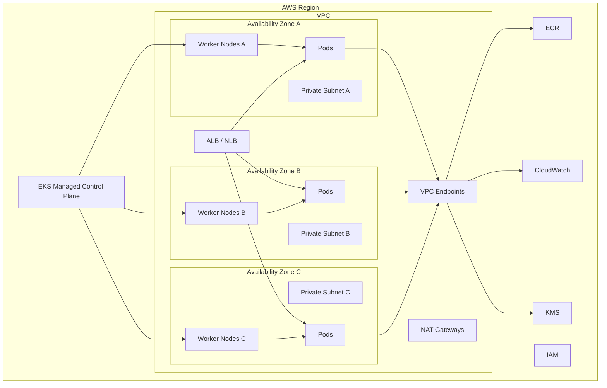
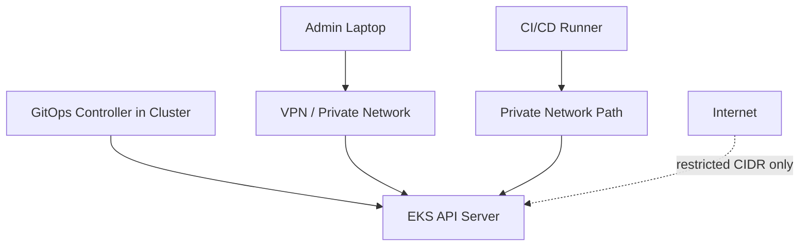

# Part 030 — EKS Cluster Architecture

Di Part 029, kita membangun mental model EKS.

Sekarang kita turun satu level: bagaimana sebuah EKS cluster production harus dirancang.

Kesalahan paling sering pada EKS bukan karena Kubernetes tidak bisa menjalankan aplikasi.

Kesalahan paling sering adalah cluster dibuat sebagai eksperimen, lalu pelan-pelan menjadi production tanpa architecture boundary yang jelas.

Akhirnya muncul masalah:

- Subnet kehabisan IP.
- Cluster terlalu banyak tenant tanpa policy.
- Public API endpoint terbuka terlalu luas.
- Add-on tidak punya ownership.
- Node group tidak punya upgrade strategy.
- Workload critical dan experimental bercampur.
- Ingress controller menjadi single chokepoint.
- Admission webhook rusak dan menghentikan semua deployment.
- Upgrade Kubernetes menjadi proyek menakutkan.

Cluster production tidak boleh dimulai dari `eksctl create cluster` lalu "nanti dirapikan".

Cluster production harus dimulai dari invariants.

---

## 1. Cluster Architecture Sebagai Set of Boundaries

EKS cluster adalah gabungan beberapa boundary:

| Boundary | Makna |
|---|---|
| Control plane boundary | Kubernetes API, etcd, scheduler, controller manager yang dikelola AWS. |
| Data plane boundary | Node/Fargate tempat pod berjalan. |
| Network boundary | VPC, subnet, route table, endpoint, security group, pod IP. |
| Access boundary | IAM principal, EKS access entry, Kubernetes RBAC. |
| Workload boundary | Namespace, service account, policy, quota, node placement. |
| Add-on boundary | CNI, DNS, kube-proxy, ingress controller, CSI, autoscaler, policy engine. |
| Upgrade boundary | Kubernetes version, add-on version, node AMI, CRD/operator compatibility. |
| Failure boundary | AZ, subnet, node pool, namespace, cluster, account, region. |

Architecture yang baik menjawab:

> Jika satu boundary gagal, dampaknya berhenti di mana?

---

## 2. Baseline Production Topology



Baseline production biasanya:

- Multi-AZ private worker subnets.
- Public subnets hanya untuk public load balancer/NAT jika diperlukan.
- Private cluster endpoint atau public endpoint yang dibatasi CIDR.
- Dedicated node pools untuk workload class tertentu.
- Add-ons dikelola sebagai platform-owned resources.
- Workload identity per service account.
- Ingress controller terkelola dengan clear ownership.
- Observability dari awal.
- Upgrade/versioning strategy dari awal.

---

## 3. Control Plane Architecture

EKS control plane dikelola AWS.

Control plane mencakup:

- Kubernetes API server.
- etcd.
- Scheduler.
- Controller manager.
- EKS integration components.

Engineer tidak mengelola node control plane secara langsung.

Namun engineer tetap harus mendesain bagaimana control plane diakses dan dipakai.

### 3.1 API Server Endpoint

Cluster API endpoint adalah pintu masuk semua operasi Kubernetes:

- `kubectl`.
- CI/CD.
- GitOps controller.
- Kubernetes controllers.
- Admission webhooks.
- Operators.
- Autoscalers.
- Monitoring tools.

Endpoint access mode dapat berupa:

- Public endpoint.
- Private endpoint.
- Public + private endpoint.
- Public endpoint dengan CIDR allowlist.

Decision model:

| Mode | Kapan cocok | Risiko |
|---|---|---|
| Public unrestricted | Hampir tidak cocok untuk production | Attack surface besar |
| Public restricted CIDR | Admin/CI dari IP stabil | IP allowlist drift, VPN dependency |
| Private endpoint | Sensitive/prod cluster | Butuh network path dari CI/admin |
| Public + private | Hybrid operations | Harus disiplin CIDR dan audit |

Prinsip production:

> Kubernetes API endpoint harus diperlakukan seperti privileged administrative endpoint, bukan endpoint aplikasi biasa.

### 3.2 Control Plane Logs

Control plane logs dapat mencakup:

- API server.
- Audit.
- Authenticator.
- Controller manager.
- Scheduler.

Untuk regulated atau high-sensitivity environment, audit logs sangat penting.

Namun logs juga punya cost dan volume.

Strategy:

- Aktifkan audit/authenticator untuk production sensitif.
- Retensi sesuai compliance.
- Buat query untuk privileged changes.
- Monitor spike error API server.
- Jangan baru mengaktifkan audit setelah incident.

### 3.3 API Server Load dan Abuse

Control plane managed bukan berarti infinite.

API server bisa ditekan oleh:

- Controller yang terlalu agresif.
- Operator bug.
- CI/CD yang melakukan polling terus-menerus.
- GitOps sync interval terlalu rapat.
- Banyak CRD dengan status update besar.
- Admission webhook latency.
- HPA/custom metrics churn.

Gejala:

- `kubectl` lambat.
- Controller reconcile terlambat.
- Deployment update tersendat.
- Banyak request throttling.
- Webhook timeout.

Prinsip:

> Treat Kubernetes API as a shared control-plane dependency. Jangan menjadikannya message bus atau metrics store.

---

## 4. Data Plane Architecture

Data plane adalah tempat workload berjalan.

Pilihan utama:

- Managed node groups.
- Self-managed nodes.
- Karpenter-provisioned nodes.
- EKS Fargate.
- EKS Auto Mode.

### 4.1 Node Pool sebagai Workload Class

Jangan desain node group hanya berdasarkan "besar/kecil".

Desain node pool berdasarkan workload class.

Contoh:

| Node pool | Workload | Karakteristik |
|---|---|---|
| `system` | Core add-ons | Stable, on-demand, protected |
| `general` | Stateless services umum | Mixed CPU/memory |
| `compute-optimized` | CPU-heavy service | C/M family |
| `memory-optimized` | Java heap/cache-heavy | R/M family |
| `spot-workers` | Async workers toleran interruption | Spot diversified |
| `gpu` | ML/inference | GPU nodes, tainted |
| `isolated-regulated` | Sensitive workload | Dedicated nodes, stricter policy |

Node pool harus punya:

- Label.
- Taint jika dedicated.
- Instance family strategy.
- AMI/update strategy.
- Capacity type.
- Disruption policy.
- Observability.
- Ownership.

### 4.2 System Add-ons Jangan Bertarung dengan Application Workload

Core add-ons seperti CoreDNS, CNI, ingress controller, autoscaler, and observability collector perlu stabil.

Jika system add-ons berjalan di node yang sama dengan workload noisy, cluster bisa mengalami cascading failure.

Pattern:

- Buat `system` node pool kecil tapi stabil.
- Gunakan on-demand capacity.
- Pakai taint `CriticalAddonsOnly` atau dedicated taint sesuai kebutuhan.
- Tambahkan toleration pada platform add-ons.
- Monitor resource add-ons.
- Jangan membuat system add-ons berebut CPU dengan batch worker.

### 4.3 Node Size Trade-off

Node terlalu kecil:

- Banyak node.
- Banyak daemonset overhead.
- Lebih banyak object churn.
- Pod density terbatas.
- Lebih banyak ENI/IP pressure.

Node terlalu besar:

- Blast radius node failure besar.
- Bin packing bisa buruk.
- Scale-out lebih chunky.
- Spot interruption lebih berdampak.
- Upgrade/drain lebih sulit.

Rule of thumb:

> Pilih node size berdasarkan pod shape dan disruption tolerance, bukan hanya harga per vCPU.

---

## 5. VPC dan Subnet Architecture

Di EKS default VPC CNI, pod memakai IP dari VPC/subnet.

Ini membuat subnet design menjadi critical.

### 5.1 Subnet Types

Biasanya ada:

- Public subnets: public ALB/NLB, NAT Gateway.
- Private workload subnets: worker nodes/pods.
- Private isolated subnets: database/internal dependency.

Untuk EKS production, workload node/pod umumnya berada di private subnets.

### 5.2 IP Capacity Planning

IP exhaustion adalah salah satu incident EKS paling umum.

Hitung bukan hanya node IP.

Hitung:

- Node primary IP.
- Pod IP.
- Warm IP target VPC CNI.
- DaemonSet pods.
- Surge saat deployment.
- HPA burst.
- Blue/green overlap.
- Karpenter node churn.
- Multi-AZ distribution.

Contoh buruk:

```txt
Subnet /24 terlihat besar: 251 usable IP.
Tetapi 3 node besar, deployment surge, daemonset, dan worker burst bisa menghabiskan IP lebih cepat dari perkiraan.
```

Production question:

- Berapa max pods per AZ saat peak?
- Berapa surge saat deployment?
- Berapa IP buffer untuk incident scale-out?
- Apakah prefix delegation aktif?
- Apakah secondary CIDR dibutuhkan?
- Apakah IPv6 lebih tepat untuk cluster baru?

### 5.3 Multi-AZ Subnet Symmetry

Jangan membuat cluster multi-AZ dengan subnet capacity tidak seimbang.

Jika AZ A punya subnet besar tetapi AZ B kecil, scheduler/autoscaler bisa terkena bottleneck tidak simetris.

Prinsip:

- Kapasitas subnet per AZ harus seimbang untuk workload critical.
- Load balancer target harus tersebar.
- Pod topology spread harus memahami AZ.
- PDB tidak boleh memblokir evacuation/upgrade.

---

## 6. Cluster Endpoint Access Architecture



Production options:

### Option A — Private Endpoint Only

Strongest for sensitive environments.

Requirements:

- Admin access via VPN/bastion/SSM/private network.
- CI/CD runner inside VPC or connected network.
- Incident access path tested.

Risk:

- If private access path breaks, cluster operations can be blocked.

### Option B — Public Endpoint Restricted

Pragmatic if CI/admin IP stable.

Requirements:

- CIDR allowlist strict.
- MFA/SSO/IAM controls.
- Audit logs.
- No broad admin role.

Risk:

- IP drift.
- Temporary broad opening during incident.
- Forgotten allowlist entries.

### Option C — Public + Private

Useful during migration/hybrid operations.

Needs discipline.

Do not leave public wide open "for convenience".

---

## 7. Security Group Architecture

EKS uses security groups at several levels:

- Cluster security group.
- Node security group.
- Load balancer security group.
- Security groups for pods if used.
- Database/internal dependency security groups.

Mental model:

> Security group rules are runtime reachability contracts.

Avoid rules like:

- `0.0.0.0/0` outbound without review for sensitive workloads.
- All node-to-node traffic open beyond requirement.
- Database open to whole VPC.
- Load balancer open to all ports.
- Shared SG modified by many teams.

Recommended pattern:

- Separate cluster/node/system/LB/application SGs.
- Restrict inbound by service path.
- Use SG referencing rather than CIDR where possible.
- Use security groups for pods for sensitive workloads if justified.
- Track SG changes as IaC.

---

## 8. Add-on Architecture

EKS add-ons need lifecycle management.

Do not treat them as one-time install.

### 8.1 Add-on Ownership Matrix

| Add-on | Owner | Upgrade Trigger | Failure Impact |
|---|---|---|---|
| VPC CNI | Platform | EKS version, security fix, feature need | Pod networking/IP allocation |
| CoreDNS | Platform | EKS version, DNS issue, security fix | Service discovery failure |
| kube-proxy | Platform | EKS version | Service networking issue |
| EBS CSI | Platform/storage | Kubernetes/storage version | Volume attach/provision failure |
| AWS Load Balancer Controller | Platform/network | Controller/API changes | Ingress/LB provisioning failure |
| Metrics Server | Platform/observability | HPA dependency | HPA unavailable |
| Karpenter | Platform | Kubernetes/API/feature changes | Node provisioning failure |
| Policy engine | Platform/security | Policy change/security update | Deploy admission failure |
| GitOps controller | Platform/release | GitOps version/security | Drift/release failure |

### 8.2 Add-on Deployment Strategy

Core add-ons deserve production release discipline:

- Version pinning.
- Staging validation.
- Rollback plan.
- Resource requests/limits.
- PDB.
- Dedicated node placement for critical add-ons.
- Dashboards and alerts.
- Compatibility check with Kubernetes version.

Add-on upgrade can break application deployment even if application code is unchanged.

---

## 9. Cluster Version Strategy

Kubernetes moves quickly.

EKS supports specific Kubernetes versions and add-on compatibility windows.

Production cluster needs version policy.

### 9.1 Version Domains

Upgrade involves more than the control plane.

| Domain | Example |
|---|---|
| Control plane version | Kubernetes 1.x |
| Node kubelet version | Managed node group AMI/kubelet |
| Add-ons | VPC CNI, CoreDNS, kube-proxy, CSI |
| CRDs/controllers | Argo CD, cert-manager, Karpenter, policy engine |
| Workload APIs | Deprecated Kubernetes API versions |
| Client tools | kubectl, Helm, CI agents |

### 9.2 Upgrade Order

Typical high-level order:

1. Read release notes and deprecations.
2. Run API deprecation scan.
3. Validate add-on compatibility.
4. Upgrade staging cluster.
5. Run workload conformance tests.
6. Upgrade control plane.
7. Upgrade core add-ons.
8. Upgrade node groups/Karpenter nodes.
9. Validate workloads.
10. Watch SLO and platform metrics.

### 9.3 Compatibility Invariant

The cluster must preserve this invariant:

> Workload manifests, controllers, add-ons, and nodes must remain compatible with the Kubernetes control plane version.

Most upgrade incidents come from ignoring one of those domains.

---

## 10. Cluster Layout Patterns

### 10.1 Cluster per Environment

Example:

- `dev` cluster.
- `staging` cluster.
- `prod` cluster.

Pros:

- Clear environment isolation.
- Safer production access.
- Independent upgrade cadence.
- Cleaner blast radius.

Cons:

- More clusters to operate.
- Add-on duplication.
- Cost overhead.

This is often the default sensible pattern.

### 10.2 Shared Cluster, Namespace per Environment

Pros:

- Lower cluster count.
- Lower control plane overhead.
- Simpler small-team setup.

Cons:

- Weak isolation if policy immature.
- Prod/non-prod mixed blast radius.
- Upgrade affects all environments.
- Risky for regulated production.

Use carefully.

### 10.3 Cluster per Tenant

Pros:

- Stronger tenant blast radius.
- Custom policy per tenant.
- Easier noisy-neighbor control.

Cons:

- Operational overhead.
- More upgrade work.
- More cost.
- More platform automation needed.

Useful for regulated or high-isolation SaaS.

### 10.4 Cluster per Workload Class

Example:

- API cluster.
- Batch/worker cluster.
- ML/GPU cluster.
- Regulated cluster.

Pros:

- Failure mode separation.
- Tailored node/add-on/security model.
- Clear capacity planning.

Cons:

- More platform complexity.
- Cross-cluster service discovery/traffic.
- Observability integration needed.

This pattern works when workload classes have very different needs.

---

## 11. Platform Namespace Architecture

A production EKS cluster usually has dedicated namespaces for platform components.

Example:

| Namespace | Isi |
|---|---|
| `kube-system` | Core Kubernetes/EKS components |
| `aws-load-balancer-controller` | ALB/NLB controller |
| `karpenter` | Node provisioning |
| `cert-manager` | Certificate automation |
| `external-secrets` | Secret synchronization |
| `observability` | OTel, Prometheus, agents |
| `policy-system` | Kyverno/Gatekeeper |
| `argocd` | GitOps controller |
| `platform-tools` | Internal tools |

Do not dump all platform controllers into `default` or application namespaces.

Each platform namespace should have:

- Owner.
- RBAC.
- Network policy if applicable.
- Resource quota/limits if safe.
- Deployment strategy.
- Alerting.
- Backup/restore consideration for stateful controllers.

---

## 12. Workload Namespace Architecture

Workload namespace design should reflect ownership and blast radius.

Example:

```txt
team-payments-prod
team-payments-staging
team-cases-prod
team-cases-staging
platform-shared-prod
```

For each namespace define:

- Owning team.
- Allowed deployment path.
- RBAC roles.
- Resource quota.
- Network policy baseline.
- Allowed image repositories.
- Allowed service accounts/IAM roles.
- Pod security level.
- Observability labels.
- Cost allocation tags/labels.

Namespace without policy is just foldering.

Namespace with RBAC, quota, network, admission, and identity becomes useful tenancy boundary.

---

## 13. Ingress Architecture

Ingress architecture decides how traffic enters the cluster.

Common patterns:

### 13.1 Shared ALB via Ingress

Multiple services share ALB through Ingress rules.

Pros:

- Cost efficient.
- Centralized TLS/WAF.
- Good for many HTTP APIs.

Cons:

- Shared blast radius.
- Annotation conflict risk.
- Controller misconfiguration affects many services.

### 13.2 Dedicated ALB per Service

Pros:

- Stronger isolation.
- Service-specific WAF/TLS/scaling.
- Clear ownership.

Cons:

- Higher cost.
- More load balancers.

### 13.3 Internal ALB/NLB

For internal services.

Pros:

- No public exposure.
- Clear internal routing.

Cons:

- Still needs DNS, security group, and health check discipline.

### 13.4 Gateway API

Gateway API gives a more expressive, role-oriented model than classic Ingress.

Useful when platform team owns gateway and app teams own routes.

Mental model:

> Ingress is not just routing. It is an ownership boundary between network/platform teams and application teams.

---

## 14. EKS Cluster Architecture Example

```mermaid
graph TD
    subgraph Account[Prod AWS Account]
        subgraph VPC[VPC 10.0.0.0/16]
            PubA[Public Subnet A]
            PubB[Public Subnet B]
            PubC[Public Subnet C]

            PrivA[Private Workload Subnet A]
            PrivB[Private Workload Subnet B]
            PrivC[Private Workload Subnet C]

            DbA[Private Data Subnet A]
            DbB[Private Data Subnet B]
            DbC[Private Data Subnet C]

            NAT1[NAT Gateway A]
            NAT2[NAT Gateway B]
            NAT3[NAT Gateway C]
            Endpoints[VPC Endpoints]
        end

        EKS[EKS Control Plane]
        ECR[ECR]
        RDS[RDS]
        CW[CloudWatch]
        SM[Secrets Manager]
    end

    subgraph Cluster[EKS Data Plane]
        SystemPool[System Node Pool]
        GeneralPool[General Node Pool]
        WorkerSpot[Spot Worker Pool]
        RegulatedPool[Regulated Dedicated Pool]

        Ingress[AWS Load Balancer Controller]
        DNS[CoreDNS]
        CNI[VPC CNI]
        GitOps[Argo CD]
        Policy[Kyverno]
        Obs[OpenTelemetry Collector]
    end

    PubA --> NAT1
    PubB --> NAT2
    PubC --> NAT3
    PrivA --> SystemPool
    PrivB --> GeneralPool
    PrivC --> WorkerSpot
    PrivA --> RegulatedPool
    EKS --> Cluster
    Cluster --> Endpoints
    Endpoints --> ECR
    Endpoints --> CW
    Endpoints --> SM
    RegulatedPool --> RDS
```



This layout makes several design decisions explicit:

- Workload runs in private subnets.
- Public subnets serve load balancers/NAT.
- System add-ons have stable capacity.
- Spot is reserved for interruptible workers.
- Sensitive workloads can use dedicated node pool.
- AWS APIs are reached through VPC endpoints when possible.
- Ingress, policy, GitOps, and observability are platform-owned.

---

## 15. Failure Domain Design

A good cluster architecture asks: "What fails together?"

### 15.1 Availability Zone Failure

Design expectations:

- Workloads spread across AZs.
- Load balancer has targets in multiple AZs.
- PDB allows rescheduling.
- Node scaler can add capacity in remaining AZs.
- Stateful workloads understand volume/AZ constraints.

Failure drill:

- Cordon/drain one AZ worth of nodes.
- Verify critical workloads remain available.
- Verify HPA/node scaler behavior.
- Verify database/dependency capacity.

### 15.2 Node Pool Failure

A bad AMI, bad launch template, or bad instance family can affect a node pool.

Mitigation:

- Diversify instance types.
- Separate system and application node pools.
- Use canary node group upgrade.
- Avoid all workloads depending on one tainted pool unless intended.

### 15.3 Add-on Failure

If CoreDNS, CNI, ingress controller, or policy engine fails, application symptoms may be misleading.

Mitigation:

- Dedicated monitoring.
- PDB for critical add-ons.
- Resource reservation.
- Version pinning.
- Runbook.

### 15.4 Cluster API Failure

If Kubernetes API is unreachable:

- Existing pods usually continue running.
- New deployments fail.
- Controllers cannot reconcile.
- Autoscaling may degrade.
- GitOps cannot sync.

This distinction matters.

Data plane may still serve traffic even when control plane operations are impaired.

---

## 16. Cluster Creation Checklist

Before creating an EKS production cluster, answer these.

### Network

- VPC CIDR chosen with pod growth in mind?
- Subnet capacity calculated per AZ?
- Public/private subnet layout clear?
- NAT Gateway dependency understood?
- VPC endpoints planned?
- DNS strategy clear?
- Private/public API endpoint mode decided?

### Security

- Cluster admin path defined?
- Break-glass role defined?
- RBAC groups mapped?
- Audit logging decision made?
- Workload identity strategy chosen?
- Secret management strategy chosen?
- Pod security policy/admission planned?

### Compute

- Data plane type chosen?
- Node pools mapped to workload classes?
- System node pool isolated?
- Spot strategy defined?
- GPU/special workload isolated?
- AMI/update path known?

### Add-ons

- VPC CNI version pinned?
- CoreDNS/kube-proxy managed?
- Load balancer controller installed?
- Storage CSI drivers needed?
- Metrics Server installed?
- Autoscaler/Karpenter planned?
- Observability installed?
- Policy engine planned?

### Operations

- Upgrade strategy documented?
- Backup/restore for stateful platform components?
- Runbooks prepared?
- Dashboards and alerts created?
- Cost allocation labels/tags defined?
- SLO ownership defined?

---

## 17. Bad Cluster Smells

Watch for these smells early.

- Everything runs in `default` namespace.
- CI/CD uses cluster-admin.
- Node IAM role has broad AWS access for all pods.
- No resource requests/limits.
- No readiness probes.
- No PDB for critical services.
- CoreDNS has no monitoring.
- Subnet free IP is not monitored.
- Public API endpoint open to world.
- Add-ons installed manually and forgotten.
- CRDs installed by application teams without review.
- No staging cluster for Kubernetes upgrade rehearsal.
- All workloads share same node group.
- Spot used for critical stateful workload.
- GitOps auto-sync deletes resources without guardrail.
- Admission webhook has `failurePolicy: Fail` but no HA.

These are not style issues.

They are future incidents.

---

## 18. Design Pattern: Minimal Serious EKS Cluster

For a small but serious platform, start with:

- One production cluster.
- One staging cluster.
- Private worker subnets across three AZs.
- Public endpoint restricted or private endpoint.
- Managed node group for `system`.
- Karpenter or managed node group for application workloads.
- VPC CNI, CoreDNS, kube-proxy as managed add-ons.
- AWS Load Balancer Controller.
- EBS CSI if persistent volumes are needed.
- Metrics Server.
- GitOps controller.
- External Secrets Operator if using AWS Secrets Manager.
- OTel/CloudWatch/Prometheus path.
- Admission policy baseline.
- Namespace templates.
- IRSA/EKS Pod Identity per workload.
- Resource quota and default requests.

Do not start with service mesh unless there is clear need.

Do not start with many clusters unless platform automation exists.

Do not start with custom operators unless the team can own them.

---

## 19. Design Pattern: Regulated EKS Cluster

For regulated workloads:

- Separate AWS account.
- Dedicated production cluster.
- Private API endpoint.
- Strict admin access through SSO/VPN/approved runner.
- Audit logging enabled.
- Dedicated node pools for regulated workloads.
- No privileged pods by default.
- Image allowlist and scanning gates.
- Workload identity per service.
- Secrets from managed secret store.
- Network policy baseline.
- Egress control.
- WAF/TLS governance.
- Immutable release evidence.
- Backup/restore drills.
- Change approval integrated with GitOps.
- Break-glass procedure tested and logged.

Regulatory defensibility comes from evidence and repeatability, not from saying "we use Kubernetes".

---

## 20. Design Pattern: Worker-Heavy Cluster

For async workers and batch-like services:

- Separate worker node pool.
- Spot capacity for interruptible jobs.
- On-demand baseline for critical consumers.
- KEDA/HPA based on queue metrics.
- Graceful shutdown tuned to visibility timeout.
- Pod disruption budgets only where they make sense.
- DLQ and poison message runbook.
- Downstream rate limiting.
- Queue backlog dashboards.
- Cost guardrails.

Do not scale workers just because backlog exists.

Scale workers only if downstream can absorb the additional work.

---

## 21. Cluster Architecture Decision Record Template

Use this ADR skeleton.

```md
# ADR: EKS Cluster Architecture

## Context
- Workload classes:
- Teams/tenants:
- Compliance requirements:
- Traffic profile:
- Scaling profile:
- Reliability target:

## Decision
- Cluster boundary:
- Environment strategy:
- VPC/subnet design:
- API endpoint access:
- Data plane model:
- Node pools:
- Add-ons:
- Workload identity:
- Ingress model:
- Observability model:
- Upgrade strategy:

## Alternatives Considered
- ECS/Fargate:
- App Runner:
- EKS Auto Mode:
- Managed node groups only:
- Karpenter:

## Consequences
- Operational ownership:
- Cost surface:
- Failure modes:
- Security implications:
- Upgrade burden:

## Guardrails
- RBAC:
- Admission policy:
- Quotas:
- Network policy:
- Image policy:
- Audit:

## Open Risks
- IP exhaustion:
- Add-on ownership:
- Upgrade compatibility:
- Tenant isolation:
- Cost growth:
```

A serious cluster should be explainable through an ADR.

If nobody can explain why the cluster is shaped as it is, the architecture is accidental.

---

## 22. Mental Model Ringkas

1. **Cluster architecture is boundary design.**
2. **Control plane is managed, but API access and usage are your responsibility.**
3. **Data plane shape should follow workload class.**
4. **Subnet IP is Kubernetes capacity.**
5. **Add-ons are production dependencies.**
6. **Cluster upgrade is a multi-domain change, not one API call.**
7. **Namespace without policy is just organization, not isolation.**
8. **System workloads need stable capacity.**
9. **Ingress is an ownership and blast-radius boundary.**
10. **A production EKS cluster must have an operating model before it has users.**

---

## 23. Praktik Latihan

Desain satu EKS cluster untuk platform internal dengan 20 microservices Java, 5 async worker, dan 2 regulated services.

Tentukan:

- Cluster count.
- Environment split.
- VPC/subnet sizing assumption.
- API endpoint access mode.
- Node pool layout.
- Spot usage.
- Namespace model.
- Workload identity model.
- Ingress model.
- Add-ons.
- Observability.
- Upgrade strategy.
- Failure domain.

Kemudian jelaskan:

- Apa yang terjadi jika satu AZ gagal?
- Apa yang terjadi jika CoreDNS gagal?
- Apa yang terjadi jika Karpenter gagal?
- Apa yang terjadi jika subnet IP habis?
- Apa yang terjadi jika GitOps controller salah sync?
- Apa yang terjadi jika Kubernetes API endpoint tidak bisa diakses?

Jika jawaban Anda hanya "AWS managed", desainnya belum cukup matang.

---

## 24. Referensi

- Amazon EKS User Guide — What is Amazon EKS?
- Amazon EKS Best Practices Guide — Control Plane
- Amazon EKS User Guide — Cluster API server endpoint
- Amazon EKS User Guide — Amazon EKS add-ons
- Amazon EKS Best Practices Guide — Networking
- Amazon EKS User Guide — Amazon VPC CNI
- Amazon EKS Best Practices Guide — Cluster upgrades
- Amazon EKS User Guide — EKS Auto Mode
- Amazon EKS User Guide — Security group requirements
