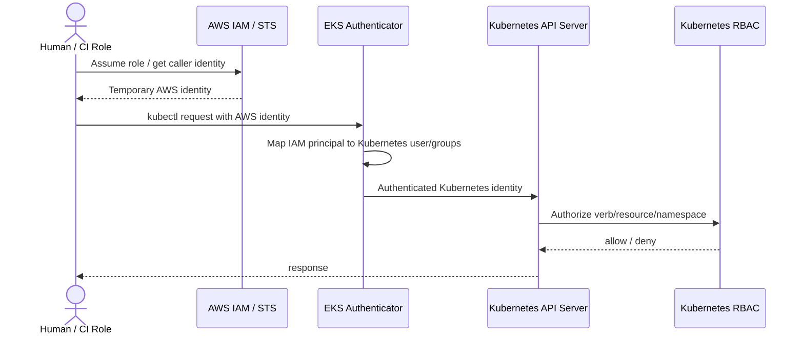
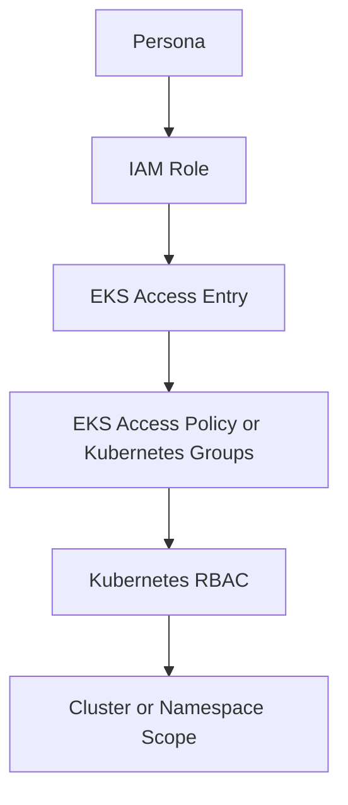
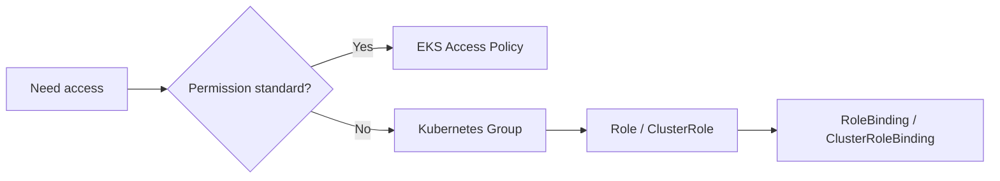
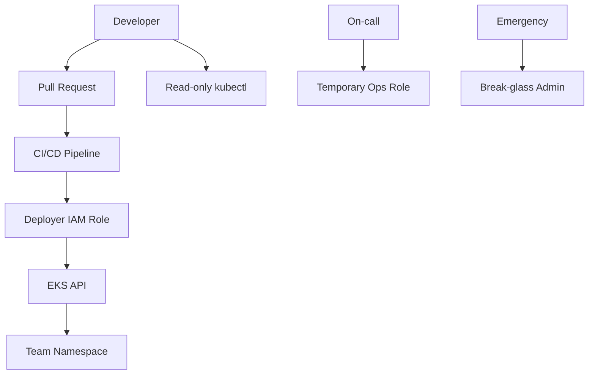
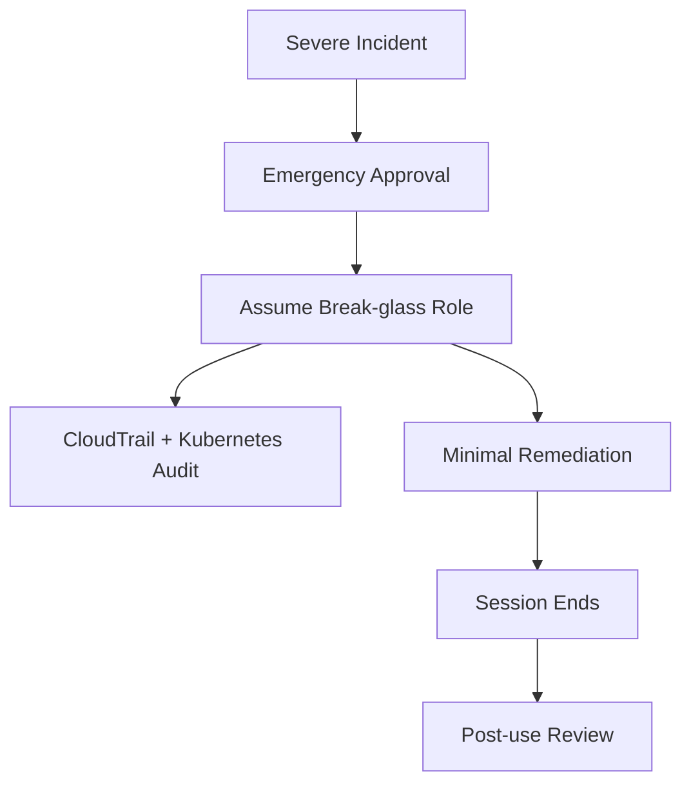

# Part 031 — EKS Access Management

Di Part 030, kita merancang cluster architecture.

Sekarang kita bahas boundary paling sensitif: **siapa boleh mengakses cluster, sebagai apa, dan boleh melakukan apa**.

EKS access management sering terlihat sederhana:

> "Kasih akses kubectl ke developer."

Itu framing yang salah.

Access management di EKS bukan sekadar memberi akses ke `kubectl`. Ini adalah desain **control-plane authority**.

Seseorang yang bisa menjalankan `kubectl apply` pada namespace tertentu mungkin bisa:

- mengganti image deployment,
- membaca secret,
- menambahkan privileged pod,
- membuat service account baru,
- mengubah ingress,
- mengganggu autoscaler,
- mematikan workload production,
- atau mengambil alih AWS permission jika workload identity salah desain.

Jadi pertanyaan sebenarnya bukan:

> Siapa perlu akses cluster?

Pertanyaan yang lebih tajam:

> Boundary kerusakan apa yang kita terima jika identitas ini disalahgunakan, bocor, atau salah konfigurasi?

Part ini membangun mental model access management EKS dari sisi production engineering.

---

## 1. Dua Lapisan Berbeda: AWS IAM dan Kubernetes RBAC

EKS menggabungkan dua dunia identity:

| Layer | Menjawab Pertanyaan | Contoh |
|---|---|---|
| AWS IAM | Siapa identitas AWS yang sedang meminta akses ke cluster? | IAM role `PlatformAdminRole`, federated role dari IAM Identity Center, CI/CD role. |
| Kubernetes RBAC | Setelah dikenali, apa boleh dilakukan di Kubernetes API? | `get pods`, `create deployments`, `delete secrets`, `update ingress`. |

IAM bukan pengganti RBAC.

RBAC bukan pengganti IAM.

IAM menyelesaikan **authentication dan AWS-side identity boundary**.

Kubernetes RBAC menyelesaikan **authorization di Kubernetes API**.



Mental model penting:

> IAM membuktikan siapa kamu di AWS. RBAC menentukan apa yang boleh kamu lakukan di Kubernetes.

Kalau dua layer ini dicampur, cluster menjadi sulit diaudit.

---

## 2. Evolusi Access Management di EKS

Secara historis, EKS memakai `aws-auth` ConfigMap di namespace `kube-system` untuk memetakan IAM principal ke Kubernetes username/groups.

Contoh lama:

```yaml
apiVersion: v1
kind: ConfigMap
metadata:
  name: aws-auth
  namespace: kube-system
data:
  mapRoles: |
    - rolearn: arn:aws:iam::111122223333:role/platform-admin
      username: platform-admin
      groups:
        - system:masters
```

Masalahnya:

- akses cluster dikelola sebagai Kubernetes object di dalam cluster,
- mudah rusak jika ConfigMap salah edit,
- sulit dikelola lintas banyak cluster,
- tidak nyaman untuk audit AWS-native,
- onboarding/offboarding rawan manual drift,
- `system:masters` sering dipakai terlalu luas.

EKS kemudian memperkenalkan **access entries** dan **access policies**.

Access entry adalah resource EKS-side yang memetakan IAM principal ke Kubernetes access. Access policy adalah kebijakan EKS-managed yang berisi Kubernetes permissions, bukan IAM permissions.

Penting:

> Access policy bukan IAM policy. Ia berisi izin Kubernetes seperti verbs dan resources.

---

## 3. Authentication Mode: ConfigMap, API, atau Keduanya

EKS access management punya authentication mode.

Secara konseptual:

| Mode | Makna | Cocok Untuk |
|---|---|---|
| `CONFIG_MAP` | Legacy `aws-auth` ConfigMap menjadi sumber mapping. | Cluster lama yang belum migrasi. |
| `API_AND_CONFIG_MAP` | Access entries dan `aws-auth` sama-sama bisa dipakai. | Masa transisi migrasi. |
| `API` | Access entries menjadi mekanisme utama. | Cluster baru production. |

Untuk cluster baru, default engineering stance yang sehat:

> Gunakan EKS access entries sebagai control surface utama, lalu minimalkan atau hilangkan dependency pada `aws-auth` ConfigMap.

Kenapa?

Karena akses ke control plane seharusnya bisa dikelola dari AWS API/IaC, bukan hanya dari object Kubernetes yang dapat rusak oleh operator cluster.

---

## 4. Jangan Mulai dari User, Mulai dari Persona

Kesalahan umum adalah memberi akses berdasarkan nama orang.

Contoh buruk:

```txt
Alice = admin
Bob = edit
Charlie = read-only
```

Ini tidak scalable.

Production access dimulai dari persona:

| Persona | Scope | Contoh Kebutuhan |
|---|---|---|
| Platform Admin | Cluster-wide | Upgrade add-on, configure ingress, manage node pools, install policy engine. |
| Platform Operator | Cluster-wide limited | Debug node/pod, restart controller, inspect events/logs. |
| App Developer | Namespace-scoped | Deploy app, view pod/log, restart deployment. |
| App On-call | Namespace-scoped operational | Scale deployment, view events, exec jika diizinkan, trigger rollout restart. |
| Security Auditor | Read-only cluster-wide | Inspect RBAC, network policy, workload spec, secret metadata. |
| CI/CD Deployer | Namespace/app-scoped | Apply manifests, update image, read rollout status. |
| Break-glass Admin | Cluster-wide emergency | Full admin dengan approval dan strong audit. |

Kemudian mapping persona ke IAM principal:



Rule:

> Jangan beri akses permanen ke manusia sebagai individu. Beri akses melalui role/persona yang bisa diaudit, direview, dan dicabut.

---

## 5. Access Entries: Model Dasar

Access entry mengikat satu IAM principal ke cluster access.

Secara konseptual:

```txt
IAM principal -> EKS access entry -> access policy / Kubernetes groups -> Kubernetes permissions
```

Contoh pola IaC konseptual:

```yaml
clusterAccess:
  - principalArn: arn:aws:iam::111122223333:role/platform-admin
    type: STANDARD
    kubernetesGroups:
      - eks-platform-admins

  - principalArn: arn:aws:iam::111122223333:role/app-team-a-deployer
    type: STANDARD
    kubernetesGroups:
      - team-a-deployers
```

Yang harus dijaga:

- satu IAM principal tidak boleh punya mapping ambigu,
- username/group naming harus konsisten,
- access entry harus dibuat via IaC,
- perubahan access harus melewati review,
- tidak boleh ada akses manual yang tidak tercatat.

---

## 6. Access Policies vs Kubernetes RBAC Groups

EKS access policies membuat onboarding lebih sederhana.

Tetapi platform engineer harus tahu batasnya.

| Pendekatan | Kelebihan | Kekurangan |
|---|---|---|
| EKS access policy | AWS-native, sederhana, mudah untuk role standar. | Policy predefined; tidak bisa custom sedetail RBAC sendiri. |
| Kubernetes groups + RBAC | Sangat fleksibel, bisa namespace-specific dan resource-specific. | Perlu desain RBAC, testing, audit, lifecycle. |

Prinsip praktis:

- Gunakan access policies untuk persona umum jika permission-nya pas.
- Gunakan Kubernetes RBAC groups untuk fine-grained production boundary.
- Jangan pakai `system:masters` kecuali break-glass atau platform bootstrap yang sangat dikontrol.



---

## 7. RBAC: Verb, Resource, Scope

Kubernetes RBAC punya tiga dimensi utama:

| Dimensi | Contoh | Makna |
|---|---|---|
| Verb | `get`, `list`, `watch`, `create`, `update`, `patch`, `delete` | Operasi yang boleh dilakukan. |
| Resource | `pods`, `deployments`, `secrets`, `services`, `ingresses` | Object yang boleh diakses. |
| Scope | namespace atau cluster | Batas area izin berlaku. |

Contoh read-only namespace role:

```yaml
apiVersion: rbac.authorization.k8s.io/v1
kind: Role
metadata:
  namespace: team-a-prod
  name: namespace-reader
rules:
  - apiGroups: [""]
    resources: ["pods", "services", "configmaps", "events"]
    verbs: ["get", "list", "watch"]
  - apiGroups: ["apps"]
    resources: ["deployments", "replicasets", "statefulsets"]
    verbs: ["get", "list", "watch"]
```

Binding ke group:

```yaml
apiVersion: rbac.authorization.k8s.io/v1
kind: RoleBinding
metadata:
  namespace: team-a-prod
  name: team-a-readers
subjects:
  - kind: Group
    name: team-a-readers
    apiGroup: rbac.authorization.k8s.io
roleRef:
  kind: Role
  name: namespace-reader
  apiGroup: rbac.authorization.k8s.io
```

Contoh deployer yang bisa rollout aplikasi tetapi tidak membaca secret:

```yaml
apiVersion: rbac.authorization.k8s.io/v1
kind: Role
metadata:
  namespace: team-a-prod
  name: app-deployer
rules:
  - apiGroups: ["apps"]
    resources: ["deployments"]
    verbs: ["get", "list", "watch", "patch", "update"]
  - apiGroups: [""]
    resources: ["pods", "events"]
    verbs: ["get", "list", "watch"]
  - apiGroups: [""]
    resources: ["pods/log"]
    verbs: ["get"]
```

Perhatikan yang tidak diberikan:

- `secrets`,
- `serviceaccounts`,
- `roles`,
- `rolebindings`,
- `clusterroles`,
- `clusterrolebindings`,
- `validatingwebhookconfigurations`,
- `mutatingwebhookconfigurations`.

Karena resource-resource itu bisa menjadi privilege escalation path.

---

## 8. Permission yang Terlihat Aman Tetapi Berbahaya

Beberapa permission Kubernetes terlihat kecil tetapi dampaknya besar.

| Permission | Risiko |
|---|---|
| `get secrets` | Bisa membaca secret aplikasi. |
| `create pods` | Bisa menjalankan pod baru dengan image arbitrary. |
| `update deployments` | Bisa mengganti image menjadi image malicious. |
| `create serviceaccounts` | Bisa membuat identity baru. |
| `patch rolebindings` | Bisa menambahkan privilege sendiri. |
| `create pods/exec` | Bisa masuk ke container dan mengambil data/runtime secret. |
| `create pods/portforward` | Bisa membuat tunnel ke service internal. |
| `update validatingwebhookconfigurations` | Bisa mematikan policy guardrail. |
| `create persistentvolumeclaims` | Bisa mengakses storage jika policy lemah. |

RBAC harus direview sebagai attack graph, bukan daftar YAML.

Pertanyaan review:

> Dengan permission ini, bisakah identitas tersebut meningkatkan privilege-nya sendiri?

Jika iya, permission itu bukan limited access.

---

## 9. Namespace-Scoped Access Bukan Selalu Aman

Namespace adalah boundary operasional, bukan security boundary absolut.

Namespace-scoped access bisa bocor jika:

- node dipakai bersama tanpa hardening,
- network policy tidak ada,
- service account terlalu kuat,
- secret dibagi lintas namespace,
- admission policy tidak membatasi pod spec,
- image registry bisa dipakai sembarang,
- developer bisa membuat privileged pod,
- developer bisa mount hostPath,
- developer bisa memakai service account milik controller.

Jadi namespace access harus dipasangkan dengan:

- service account boundary,
- network policy,
- pod security standard,
- resource quota,
- limit range,
- image allowlist,
- admission policy,
- workload identity policy,
- CI/CD deployment path.

---

## 10. Human Access Design

Human access harus jarang, sementara CI/CD access harus menjadi jalur normal deployment.

Model sehat:



Human access dibagi:

| Access | Karakter |
|---|---|
| Read-only | Aman untuk observability/debugging awal. |
| Namespace operator | Untuk on-call terbatas; bisa restart/scale tetapi tidak mengubah RBAC/secret. |
| Platform operator | Untuk platform team; cluster-level tetapi tidak full admin. |
| Break-glass admin | Emergency only, time-bound, audited. |

Rule:

> Production write access manusia harus exception, bukan deployment path normal.

---

## 11. CI/CD Access Design

CI/CD access harus lebih deterministik daripada human access.

CI/CD role sebaiknya:

- hanya bisa deploy ke namespace tertentu,
- hanya bisa mutate resource aplikasi yang disetujui,
- tidak bisa membaca secret mentah,
- tidak bisa mengubah RBAC,
- tidak bisa membuat privileged workload,
- tidak bisa deploy image di luar registry/account yang disetujui,
- punya audit trail release commit/image digest.

Contoh RBAC deployer:

```yaml
apiVersion: rbac.authorization.k8s.io/v1
kind: Role
metadata:
  namespace: team-a-prod
  name: cicd-deployer
rules:
  - apiGroups: ["apps"]
    resources: ["deployments", "statefulsets"]
    verbs: ["get", "list", "watch", "create", "update", "patch"]
  - apiGroups: [""]
    resources: ["services", "configmaps"]
    verbs: ["get", "list", "watch", "create", "update", "patch"]
  - apiGroups: ["networking.k8s.io"]
    resources: ["ingresses"]
    verbs: ["get", "list", "watch", "create", "update", "patch"]
  - apiGroups: [""]
    resources: ["pods", "pods/log", "events"]
    verbs: ["get", "list", "watch"]
```

Tidak ada `delete`? Tergantung deployment tool.

Jika GitOps controller perlu prune, `delete` mungkin dibutuhkan. Tetapi jangan berikan secara default tanpa memahami tool behavior.

---

## 12. Break-Glass Admin

Break-glass admin adalah akses darurat ketika pipeline, RBAC, policy engine, atau platform control loop rusak.

Akses ini harus ada.

Tetapi akses ini harus mahal secara prosedural.

Checklist break-glass:

- IAM role khusus, bukan role harian.
- MFA wajib.
- Approval atau emergency ticket.
- Session duration pendek.
- CloudTrail audit.
- Kubernetes audit log aktif.
- Notifikasi security/platform channel.
- Post-use review.
- Tidak dipakai untuk pekerjaan normal.

Model:



Break-glass bukan anti-pattern.

Break-glass yang dipakai setiap minggu adalah anti-pattern.

---

## 13. Access Review Cadence

Production cluster perlu access review rutin.

Minimal review:

| Cadence | Review |
|---|---|
| Weekly | Break-glass usage, failed auth, unusual admin action. |
| Monthly | Active access entries, stale IAM roles, namespace rolebindings. |
| Quarterly | Persona mapping, least privilege drift, team ownership. |
| Per release platform | ClusterRole, webhook, policy engine, controller permission changes. |
| Per incident | Apakah akses mempercepat atau memperburuk recovery? |

Command untuk inspeksi awal:

```bash
kubectl get clusterrolebindings
kubectl get rolebindings --all-namespaces
kubectl auth can-i --list --namespace team-a-prod
kubectl get accessentries # konseptual; actual via AWS CLI/API
```

AWS-side:

```bash
aws eks list-access-entries --cluster-name prod-platform
aws eks describe-access-entry \
  --cluster-name prod-platform \
  --principal-arn arn:aws:iam::111122223333:role/team-a-deployer
```

---

## 14. Migration dari `aws-auth` ke Access Entries

Migration harus dilakukan sebagai controlled change.

Jangan hapus `aws-auth` sebelum semua access path tervalidasi.

Step-by-step:

1. Inventory semua entry di `aws-auth`.
2. Klasifikasikan: node role, admin role, deployer role, human role, legacy unknown.
3. Mapping ke persona.
4. Buat access entries untuk IAM principal yang masih valid.
5. Untuk role yang butuh fine-grained access, mapping ke Kubernetes groups.
6. Buat RBAC Role/RoleBinding/ClusterRoleBinding yang eksplisit.
7. Test `kubectl auth can-i` untuk setiap persona.
8. Ubah authentication mode ke `API_AND_CONFIG_MAP` selama transisi.
9. Observasi audit log.
10. Hapus entry legacy satu per satu.
11. Setelah aman, gunakan `API` mode jika sesuai.

Migration invariant:

> Tidak boleh ada periode di mana hanya satu orang dengan laptop tertentu bisa memperbaiki cluster.

---

## 15. Auditability: Yang Harus Bisa Dijawab

EKS access management yang matang harus bisa menjawab:

- Siapa yang punya akses cluster-wide?
- Siapa yang punya akses namespace production?
- Siapa yang bisa membaca secret?
- Siapa yang bisa membuat pod?
- Siapa yang bisa exec ke container?
- Siapa yang bisa mengubah admission webhook?
- Siapa yang bisa mengubah RBAC?
- Role mana yang dipakai CI/CD?
- Kapan terakhir break-glass dipakai?
- Apakah ada IAM principal yang sudah tidak ada pemiliknya?
- Apakah akses production sama dengan staging?
- Apakah akses tim lama sudah dicabut?

Kalau pertanyaan ini tidak bisa dijawab cepat, access model belum production-grade.

---

## 16. Failure Modes

### 16.1 Admin Terkunci dari Cluster

Penyebab:

- salah edit `aws-auth`,
- access entry dihapus,
- role IAM tidak bisa diasumsikan,
- authentication mode berubah tanpa migration,
- SSO/IdP outage,
- cluster creator role tidak lagi tersedia.

Mitigasi:

- break-glass role,
- multiple platform admin roles,
- IaC-managed access,
- documented recovery path,
- no single-person ownership.

---

### 16.2 Terlalu Banyak `system:masters`

Penyebab:

- onboarding cepat,
- tidak ada persona,
- tidak ada RBAC template,
- platform team takut developer terhambat.

Dampak:

- RBAC tidak berarti,
- audit noise,
- privilege escalation tidak terlihat,
- policy engine mudah dimatikan.

Mitigasi:

- hapus admin permanen,
- gunakan namespace role,
- break-glass only untuk full admin,
- review ClusterRoleBinding.

---

### 16.3 CI/CD Role Terlalu Kuat

Penyebab:

- GitOps/controller diberi cluster-admin,
- deployer butuh cepat,
- helm chart membuat resource cluster-wide.

Dampak:

- supply-chain compromise menjadi cluster takeover,
- pipeline bug bisa menghapus resource critical,
- namespace isolation runtuh.

Mitigasi:

- pisahkan platform deployer dan app deployer,
- restrict chart capability,
- policy-as-code,
- review generated manifests,
- deploy via namespace-scoped service account jika mungkin.

---

### 16.4 Developer Bisa Membaca Secret

Penyebab:

- `view` role custom salah desain,
- `get secrets` diberikan untuk debugging,
- external secret sync membuat secret plaintext di namespace,
- tidak ada secret access alternative.

Mitigasi:

- jangan beri `get secrets` ke human by default,
- pakai secret metadata only untuk audit,
- debug via application diagnostics,
- gunakan short-lived break-glass untuk kasus tertentu.

---

## 17. Production Pattern: Access Model Blueprint

Contoh blueprint:

```txt
Cluster: prod-platform-ap-southeast-3

IAM roles:
- eks-platform-admin-prod
- eks-platform-operator-prod
- eks-security-auditor-prod
- eks-breakglass-admin-prod
- eks-team-a-deployer-prod
- eks-team-a-oncall-prod
- eks-team-a-reader-prod

Kubernetes groups:
- eks-platform-admins
- eks-platform-operators
- eks-security-auditors
- team-a-prod-deployers
- team-a-prod-oncall
- team-a-prod-readers

Namespaces:
- platform-system
- observability
- ingress-system
- team-a-prod
- team-b-prod
```

Mapping:

| IAM Role | Kubernetes Group | Scope |
|---|---|---|
| `eks-platform-admin-prod` | `eks-platform-admins` | Cluster-wide, tightly controlled. |
| `eks-platform-operator-prod` | `eks-platform-operators` | Cluster-wide operational read/limited write. |
| `eks-security-auditor-prod` | `eks-security-auditors` | Cluster-wide read-only, no secret read. |
| `eks-breakglass-admin-prod` | `system:masters` or equivalent | Emergency only. |
| `eks-team-a-deployer-prod` | `team-a-prod-deployers` | Namespace `team-a-prod`. |
| `eks-team-a-oncall-prod` | `team-a-prod-oncall` | Namespace operational actions. |
| `eks-team-a-reader-prod` | `team-a-prod-readers` | Namespace read-only. |

---

## 18. Design Review Questions

Gunakan pertanyaan ini saat review cluster:

1. Apakah semua human access melewati IAM role, bukan long-lived user?
2. Apakah access entries dikelola via IaC?
3. Apakah ada mapping langsung ke `system:masters` selain break-glass/platform bootstrap?
4. Apakah CI/CD role namespace-scoped?
5. Apakah developer bisa membaca Kubernetes Secret?
6. Apakah on-call bisa melakukan recovery tanpa full admin?
7. Apakah break-glass diuji dan diaudit?
8. Apakah `aws-auth` masih dipakai? Jika iya, kenapa?
9. Apakah ada stale role dari tim/proyek lama?
10. Apakah RBAC bisa diuji otomatis dengan `kubectl auth can-i`?
11. Apakah Kubernetes audit log dan CloudTrail cukup untuk rekonstruksi insiden?
12. Apakah policy engine bisa dimatikan oleh role non-platform?

---

## 19. Mental Model Akhir

EKS access management bukan daftar user.

Ia adalah sistem boundary:

```txt
Identity -> Persona -> Access Entry -> Kubernetes Group/Policy -> RBAC -> Namespace/Cluster Scope -> Audit Trail
```

Engineer biasa bertanya:

> Bagaimana cara kasih akses kubectl?

Engineer production bertanya:

> Apa privilege graph dari identitas ini, bagaimana privilege itu diaudit, dan sampai mana blast radius jika identitas ini disalahgunakan?

Itulah perbedaannya.

---

## 20. Referensi Resmi

- Amazon EKS — Grant IAM users access to Kubernetes with EKS access entries: https://docs.aws.amazon.com/eks/latest/userguide/access-entries.html
- Amazon EKS — Associate access policies with access entries: https://docs.aws.amazon.com/eks/latest/userguide/access-policies.html
- Amazon EKS — Review access policy permissions: https://docs.aws.amazon.com/eks/latest/userguide/access-policy-permissions.html
- Amazon EKS — Learn how access control works in Amazon EKS: https://docs.aws.amazon.com/eks/latest/userguide/cluster-auth.html
- Amazon EKS Best Practices — Identity and Access Management: https://docs.aws.amazon.com/eks/latest/best-practices/identity-and-access-management.html
- Kubernetes RBAC Authorization: https://kubernetes.io/docs/reference/access-authn-authz/rbac/
