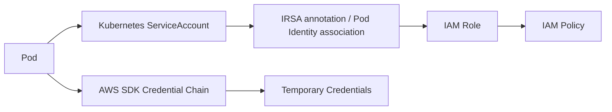
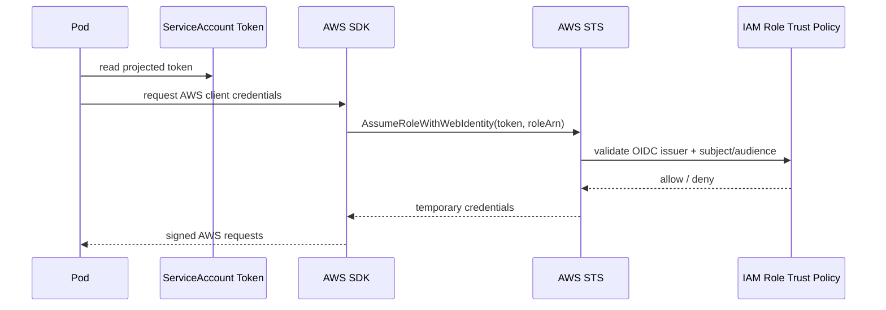
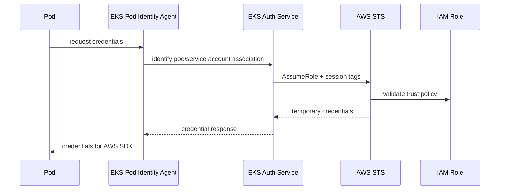
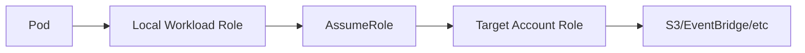

# Part 032 — Workload Identity on EKS

Di Part 031, kita membahas akses manusia dan CI/CD ke Kubernetes API.

Sekarang kita bahas pertanyaan berbeda:

> Ketika aplikasi berjalan di pod, bagaimana pod itu boleh mengakses AWS API?

Contoh:

- service membaca object dari S3,
- worker mengambil message dari SQS,
- API membaca secret dari Secrets Manager,
- controller menulis metric ke CloudWatch,
- job mengambil file dari ECR/S3,
- operator mengubah resource AWS.

Masalahnya bukan "bagaimana memberi credential".

Masalahnya adalah:

> Bagaimana memberi credential yang tepat, sementara pod lain di cluster tidak ikut mendapat privilege yang sama?

Inilah domain **workload identity**.

---

## 1. Jangan Pernah Menaruh AWS Access Key di Pod

Anti-pattern paling dasar:

```yaml
apiVersion: v1
kind: Secret
metadata:
  name: aws-creds
data:
  AWS_ACCESS_KEY_ID: ...
  AWS_SECRET_ACCESS_KEY: ...
```

Ini buruk karena:

- credential long-lived,
- sulit rotasi,
- mudah bocor lewat logs/debugging,
- tidak terikat ke workload tertentu,
- tidak punya session context yang baik,
- blast radius besar jika secret dibaca,
- melawan model IAM modern.

Production EKS harus memakai short-lived credential dari IAM role, bukan static key.

---

## 2. Workload Identity Sebagai Binding Tiga Dunia

Workload identity mengikat tiga object:

| Dunia | Object | Fungsi |
|---|---|---|
| Kubernetes | ServiceAccount | Identitas workload di cluster. |
| AWS IAM | IAM Role | Permission AWS yang boleh dipakai. |
| Runtime Credential Provider | IRSA atau EKS Pod Identity | Mekanisme pod mendapat temporary credential. |



Prinsip utama:

> IAM role harus diberikan ke service account workload, bukan ke node, bukan ke namespace secara global, dan bukan ke semua pod.

---

## 3. Node Role Bukan Workload Role

Di EKS, node EC2 punya IAM role. Role ini dibutuhkan untuk operasi node dan agent tertentu.

Namun role node tidak boleh menjadi permission aplikasi.

Jika aplikasi mengambil permission dari node role:

- semua pod di node berpotensi memakai permission yang sama,
- tenant isolation melemah,
- audit sulit karena action AWS terlihat berasal dari node role,
- satu pod compromise bisa menjadi akses AWS luas.

Model buruk:

```txt
Pod A -> node instance profile -> S3 full access
Pod B -> node instance profile -> S3 full access
Pod C -> node instance profile -> S3 full access
```

Model benar:

```txt
Pod A -> service-account-a -> role-a -> S3 bucket A read
Pod B -> service-account-b -> role-b -> SQS queue B consume
Pod C -> service-account-c -> role-c -> no AWS access
```

---

## 4. Dua Mekanisme Utama: IRSA dan EKS Pod Identity

Amazon EKS punya dua mekanisme utama untuk memberikan IAM role ke pod:

| Mekanisme | Nama Lengkap | Mental Model |
|---|---|---|
| IRSA | IAM Roles for Service Accounts | Kubernetes service account token + OIDC provider + STS AssumeRoleWithWebIdentity. |
| EKS Pod Identity | EKS-managed pod identity association | Association antara service account dan IAM role melalui EKS Pod Identity Agent. |

Keduanya menyelesaikan problem yang sama: pod mendapat temporary AWS credential berbasis identity workload.

Tetapi operational model-nya berbeda.

---

## 5. IRSA Mental Model

IRSA memakai OIDC.

Alurnya:

1. EKS cluster memiliki OIDC issuer.
2. IAM memiliki OIDC identity provider untuk cluster tersebut.
3. Kubernetes service account diberi annotation IAM role ARN.
4. Pod mendapat projected service account token.
5. AWS SDK membaca environment dan token file.
6. SDK memanggil STS `AssumeRoleWithWebIdentity`.
7. STS memvalidasi token dan trust policy.
8. STS mengembalikan temporary credentials.



Service account annotation:

```yaml
apiVersion: v1
kind: ServiceAccount
metadata:
  name: order-worker
  namespace: orders-prod
  annotations:
    eks.amazonaws.com/role-arn: arn:aws:iam::111122223333:role/orders-prod-worker
```

IAM trust policy pattern:

```json
{
  "Version": "2012-10-17",
  "Statement": [
    {
      "Effect": "Allow",
      "Principal": {
        "Federated": "arn:aws:iam::111122223333:oidc-provider/oidc.eks.ap-southeast-3.amazonaws.com/id/EXAMPLED539D4633E53DE1B71EXAMPLE"
      },
      "Action": "sts:AssumeRoleWithWebIdentity",
      "Condition": {
        "StringEquals": {
          "oidc.eks.ap-southeast-3.amazonaws.com/id/EXAMPLED539D4633E53DE1B71EXAMPLE:aud": "sts.amazonaws.com",
          "oidc.eks.ap-southeast-3.amazonaws.com/id/EXAMPLED539D4633E53DE1B71EXAMPLE:sub": "system:serviceaccount:orders-prod:order-worker"
        }
      }
    }
  ]
}
```

Invariant IRSA:

> Trust policy harus membatasi namespace dan service account tertentu. Jangan gunakan wildcard luas tanpa alasan kuat.

---

## 6. EKS Pod Identity Mental Model

EKS Pod Identity menyederhanakan beberapa bagian IRSA.

Alih-alih setiap role trust policy harus menunjuk OIDC provider spesifik cluster, role dapat mempercayai service principal EKS Pod Identity:

```json
{
  "Version": "2012-10-17",
  "Statement": [
    {
      "Effect": "Allow",
      "Principal": {
        "Service": "pods.eks.amazonaws.com"
      },
      "Action": [
        "sts:AssumeRole",
        "sts:TagSession"
      ]
    }
  ]
}
```

Kemudian association dibuat antara:

```txt
cluster + namespace + serviceAccount -> IAM role
```

Secara konseptual:

```yaml
podIdentityAssociation:
  clusterName: prod-platform
  namespace: orders-prod
  serviceAccount: order-worker
  roleArn: arn:aws:iam::111122223333:role/orders-prod-worker
```

Runtime memakai EKS Pod Identity Agent untuk menyediakan credential ke pod.



Prinsip sama:

> Service account tetap menjadi identity anchor workload.

---

## 7. IRSA vs EKS Pod Identity

Perbandingan praktis:

| Aspek | IRSA | EKS Pod Identity |
|---|---|---|
| Trust mechanism | OIDC provider per cluster. | Service principal `pods.eks.amazonaws.com`. |
| Binding | ServiceAccount annotation. | EKS Pod Identity association. |
| Operational overhead | Perlu OIDC provider dan trust policy spesifik issuer/sub. | Lebih AWS-managed; association via EKS API. |
| Portability | Kubernetes/OIDC style, familiar luas. | EKS-specific. |
| Multi-cluster reuse | Trust policy biasanya cluster-specific. | Role reuse dapat lebih sederhana. |
| Runtime dependency | Projected token + STS. | Pod Identity Agent. |
| Fine-grained SA binding | Via trust policy subject. | Via association namespace/service account. |
| Best fit | Existing clusters, GitOps annotation pattern, compatibility. | New EKS platform yang ingin access association AWS-native. |

Engineering stance:

- Untuk cluster baru, evaluasi EKS Pod Identity sebagai default jika add-on/runtime mendukung kebutuhan.
- Untuk existing cluster dengan IRSA map matang, jangan migrasi hanya karena fitur baru; migrasi jika mengurangi operational burden.
- Untuk controller/add-on tertentu, ikuti dukungan resmi add-on tersebut.
- Jangan campur IRSA dan Pod Identity untuk service account yang sama tanpa alasan jelas.

---

## 8. IAM Policy Design untuk Workload

Permission workload harus dimulai dari operasi bisnis.

Contoh `order-worker`:

| Kebutuhan | AWS Action |
|---|---|
| Consume queue | `sqs:ReceiveMessage`, `sqs:DeleteMessage`, `sqs:ChangeMessageVisibility` |
| Read DLQ metrics? | Biasanya CloudWatch read, bukan SQS full. |
| Load config | `ssm:GetParameter` atau `secretsmanager:GetSecretValue` untuk resource tertentu. |
| Write event | `events:PutEvents` ke event bus tertentu. |

Contoh policy minimum:

```json
{
  "Version": "2012-10-17",
  "Statement": [
    {
      "Sid": "ConsumeOrdersQueue",
      "Effect": "Allow",
      "Action": [
        "sqs:ReceiveMessage",
        "sqs:DeleteMessage",
        "sqs:ChangeMessageVisibility",
        "sqs:GetQueueAttributes"
      ],
      "Resource": "arn:aws:sqs:ap-southeast-3:111122223333:orders-prod-queue"
    },
    {
      "Sid": "PublishDomainEvents",
      "Effect": "Allow",
      "Action": "events:PutEvents",
      "Resource": "arn:aws:events:ap-southeast-3:111122223333:event-bus/domain-prod"
    }
  ]
}
```

Jangan mulai dari AWS managed policy seperti `AmazonS3FullAccess` kecuali untuk eksperimen lokal.

---

## 9. Service Account Design

Service account harus satu-per-workload privilege boundary.

Anti-pattern:

```txt
namespace: orders-prod
serviceAccount: default
used by: api, worker, scheduler, migration job
role: orders-prod-power-role
```

Pattern sehat:

```txt
orders-api-sa       -> read config, publish event
orders-worker-sa    -> consume SQS, write event
orders-migration-sa -> temporary DB migration permission
orders-reporter-sa  -> read S3 reports, no SQS
```

Kubernetes manifest:

```yaml
apiVersion: v1
kind: ServiceAccount
metadata:
  name: orders-worker
  namespace: orders-prod
---
apiVersion: apps/v1
kind: Deployment
metadata:
  name: orders-worker
  namespace: orders-prod
spec:
  template:
    spec:
      serviceAccountName: orders-worker
      containers:
        - name: worker
          image: 111122223333.dkr.ecr.ap-southeast-3.amazonaws.com/orders-worker@sha256:...
```

Invariant:

> Jangan biarkan workload production memakai `default` service account.

Tambahkan policy/admission rule untuk menolak pod tanpa explicit service account.

---

## 10. Credential Chain di AWS SDK

Aplikasi biasanya tidak perlu memanggil STS manual.

AWS SDK memakai default credential provider chain.

Di pod, SDK akan mendeteksi environment/token/endpoint yang disediakan oleh IRSA atau Pod Identity.

Java example:

```java
SqsClient sqs = SqsClient.builder()
    .region(Region.AP_SOUTHEAST_3)
    .build();
```

Tidak perlu:

```java
AwsBasicCredentials.create(accessKey, secretKey)
```

Tidak perlu membaca secret AWS key.

Tidak perlu hardcode role ARN di aplikasi kecuali ada reason explicit seperti cross-account assume role yang memang didesain.

Rule:

> Aplikasi meminta AWS client. Platform menyediakan credential. Jangan membuat aplikasi menjadi credential broker.

---

## 11. Cross-Account Access

Banyak organisasi memisahkan akun:

```txt
shared-platform account
prod-workload account
security account
logging account
```

Workload EKS mungkin perlu akses resource di akun lain.

Pola umum:

1. Pod mendapat role lokal di akun cluster.
2. Role lokal diberi izin assume role target.
3. Role target di akun lain mempercayai role lokal.
4. Aplikasi melakukan explicit `AssumeRole` atau memakai SDK profile/config jika cocok.



Gunakan ini dengan hati-hati.

Cross-account role harus:

- resource scoped,
- external conditions jika relevan,
- session duration wajar,
- CloudTrail diaudit di kedua akun,
- tidak menjadi shortcut ke permission luas.

---

## 12. Multi-Tenant Cluster Boundary

Dalam multi-tenant EKS, workload identity adalah salah satu boundary paling penting.

Risiko:

- team A bisa memakai service account team B,
- deployment bisa override `serviceAccountName`,
- developer bisa membuat service account baru dengan role kuat,
- admission policy tidak memvalidasi annotation/association,
- namespace takeover menjadi AWS privilege takeover.

Guardrail:

- service account dibuat oleh platform/GitOps, bukan manual bebas,
- role association dikelola via IaC,
- namespace owner tidak boleh mengubah service account privileged sembarangan,
- admission policy menolak service account yang tidak diizinkan,
- `automountServiceAccountToken` dikontrol,
- RBAC developer tidak boleh patch service account sensitive,
- workload identity mapping direview seperti IAM permission.

Contoh policy intent:

```txt
Namespace orders-prod hanya boleh memakai service account:
- orders-api
- orders-worker
- orders-scheduler
- orders-migration

Pod dengan serviceAccountName lain ditolak.
```

---

## 13. `automountServiceAccountToken`

Tidak semua pod butuh Kubernetes API token.

Untuk workload yang tidak memanggil Kubernetes API dan tidak butuh IRSA token behavior tertentu, pertimbangkan:

```yaml
apiVersion: v1
kind: ServiceAccount
metadata:
  name: pure-http-api
  namespace: orders-prod
automountServiceAccountToken: false
```

Atau di pod spec:

```yaml
spec:
  automountServiceAccountToken: false
```

Namun jangan mematikan token secara membabi buta jika mekanisme identity membutuhkan token atau jika controller tertentu bergantung padanya.

Mental model:

> Token mount adalah attack surface. Aktifkan hanya jika workload membutuhkannya.

---

## 14. Secret Access vs IAM Role Access

Jangan campur dua konsep:

| Konsep | Contoh | Risiko |
|---|---|---|
| Kubernetes Secret | DB password, API token internal. | Bisa dibaca siapa pun dengan `get secrets`. |
| IAM Role Permission | `s3:GetObject`, `sqs:ReceiveMessage`. | Bisa memanggil AWS API sesuai policy. |

Jika aplikasi membaca Secrets Manager:

- pod perlu IAM permission `secretsmanager:GetSecretValue`,
- permission harus spesifik secret ARN,
- aplikasi harus cache dengan TTL aman,
- rotasi harus dipahami,
- observability tidak boleh log secret value.

Jika external secrets menyinkronkan Secrets Manager ke Kubernetes Secret:

- IAM role external-secrets controller punya permission besar,
- Kubernetes Secret menjadi plaintext secret surface,
- RBAC `get secrets` menjadi critical.

Pilih model berdasarkan operational constraint, bukan kenyamanan semata.

---

## 15. Observability dan Audit

Workload identity harus terlihat di audit.

Yang perlu dicatat:

- IAM role ARN yang dipakai pod,
- namespace dan service account,
- pod/deployment owner,
- AWS API action,
- resource ARN,
- session tags jika tersedia,
- correlation ID dari aplikasi,
- release/image digest.

CloudTrail akan menunjukkan AWS API call dari assumed role session.

Untuk debugging, aplikasi bisa log caller identity di startup secara aman:

```java
StsClient sts = StsClient.create();
GetCallerIdentityResponse id = sts.getCallerIdentity();
log.info("awsCallerIdentity account={} arn={}", id.account(), id.arn());
```

Jangan log credential.

Log identity cukup untuk membuktikan pod memakai role yang benar.

---

## 16. Failure Modes

### 16.1 Pod Mendapat `AccessDenied`

Kemungkinan:

- IAM policy kurang action,
- resource ARN salah,
- condition policy tidak cocok,
- role association salah namespace/service account,
- aplikasi memakai service account default,
- region salah,
- cross-account trust salah.

Debug sequence:

```bash
kubectl -n orders-prod get pod orders-worker-xxx -o jsonpath='{.spec.serviceAccountName}'
kubectl -n orders-prod describe serviceaccount orders-worker
kubectl -n orders-prod describe pod orders-worker-xxx
aws sts get-caller-identity # dari dalam pod jika diizinkan untuk debugging
```

Lalu cek CloudTrail untuk denied action.

---

### 16.2 Pod Mendapat Role yang Salah

Penyebab:

- deployment memakai serviceAccountName salah,
- annotation IRSA tertinggal,
- Pod Identity association salah,
- Helm values default memakai service account lama,
- namespace copy-paste dari environment lain.

Mitigasi:

- explicit service account per deployment,
- policy test di CI,
- startup identity check,
- admission policy untuk allowed mapping,
- no default service account for production workload.

---

### 16.3 Credential Tidak Tersedia

Penyebab IRSA:

- OIDC provider belum dibuat,
- trust policy issuer salah,
- `aud` atau `sub` condition salah,
- service account token tidak termount,
- SDK terlalu lama/tidak mendukung provider chain.

Penyebab Pod Identity:

- Pod Identity Agent tidak berjalan,
- association belum dibuat,
- trust policy role belum mempercayai service principal,
- add-on/node compatibility issue,
- network path ke credential endpoint bermasalah.

Mitigasi:

- automated preflight,
- add-on health monitoring,
- canary pod identity test,
- IaC validation,
- SDK version baseline.

---

### 16.4 Role Terlalu Luas

Penyebab:

- managed policy dipakai di production,
- satu role dipakai banyak workload,
- resource ARN wildcard,
- action wildcard,
- tidak ada access review.

Dampak:

- pod compromise menjadi account-level incident,
- lateral movement ke data plane AWS,
- sulit membedakan penggunaan sah dan tidak sah.

Mitigasi:

- one role per workload boundary,
- scoped resources,
- IAM Access Analyzer,
- CloudTrail review,
- permission last accessed review,
- policy-as-code.

---

## 17. Migration IRSA ke EKS Pod Identity

Migration bukan kewajiban otomatis.

Lakukan jika manfaatnya jelas:

- trust policy IRSA terlalu banyak dan sulit dikelola,
- multi-cluster role reuse perlu disederhanakan,
- platform ingin AWS-native association,
- add-on sudah mendukung Pod Identity dengan baik,
- tim siap mengoperasikan Pod Identity Agent.

Step migration aman:

1. Inventory semua service account IRSA annotation.
2. Mapping service account ke IAM role dan AWS resource.
3. Pastikan role trust policy mendukung Pod Identity.
4. Install/verify EKS Pod Identity Agent.
5. Buat association untuk non-critical workload dulu.
6. Deploy canary pod dan cek `sts:GetCallerIdentity`.
7. Uji semua AWS API path.
8. Hapus annotation IRSA jika sudah tidak diperlukan.
9. Monitor CloudTrail dan application error.
10. Migrasi workload critical bertahap.

Invariant:

> Jangan mengganti mekanisme identity dan permission policy sekaligus. Ubah satu variabel per rollout.

---

## 18. Workload Identity Design Checklist

Untuk setiap workload, isi ini:

```txt
Workload: orders-worker
Namespace: orders-prod
Service account: orders-worker
IAM role: arn:aws:iam::111122223333:role/orders-prod-worker
Mechanism: EKS Pod Identity / IRSA
AWS actions:
- sqs:ReceiveMessage on orders-prod-queue
- sqs:DeleteMessage on orders-prod-queue
- sqs:ChangeMessageVisibility on orders-prod-queue
- events:PutEvents on domain-prod event bus
Secrets:
- /orders/prod/db-readonly via Secrets Manager
No access to:
- S3 wildcard
- IAM
- EKS API
- Secrets outside orders-prod
Owner: Orders team
Review cadence: monthly
```

Kalau workload tidak bisa dijelaskan seperti ini, identity design belum matang.

---

## 19. Design Review Questions

1. Apakah setiap production deployment memakai explicit service account?
2. Apakah service account default dinonaktifkan atau tidak punya permission berarti?
3. Apakah satu IAM role dipakai oleh terlalu banyak workload?
4. Apakah IAM policy resource-scoped?
5. Apakah role trust policy/association membatasi namespace dan service account?
6. Apakah developer bisa mengubah service account untuk mendapat role lebih kuat?
7. Apakah CI/CD bisa deploy pod dengan arbitrary service account?
8. Apakah pod bisa membaca Kubernetes Secret tanpa perlu?
9. Apakah CloudTrail bisa menghubungkan AWS API call ke workload?
10. Apakah ada canary untuk membuktikan identity path masih sehat?
11. Apakah ada runbook untuk `AccessDenied`?
12. Apakah migration IRSA/Pod Identity dilakukan bertahap?

---

## 20. Mental Model Akhir

Workload identity adalah kontrak:

```txt
Pod -> ServiceAccount -> Identity Association -> IAM Role -> IAM Policy -> AWS Resource
```

Engineer biasa bertanya:

> Bagaimana pod ini bisa akses S3?

Engineer production bertanya:

> Mengapa hanya pod ini yang bisa akses resource itu, bagaimana aksesnya dibuktikan, bagaimana ia gagal, dan apa blast radius jika pod compromise?

Itulah level yang harus dibawa ke production EKS.

---

## 21. Referensi Resmi

- Amazon EKS — Learn how EKS Pod Identity grants pods access to AWS services: https://docs.aws.amazon.com/eks/latest/userguide/pod-identities.html
- Amazon EKS — Assign an IAM role to a Kubernetes service account with EKS Pod Identity: https://docs.aws.amazon.com/eks/latest/userguide/pod-id-association.html
- Amazon EKS — IAM roles for service accounts: https://docs.aws.amazon.com/eks/latest/userguide/iam-roles-for-service-accounts.html
- Amazon EKS — Assign IAM roles to Kubernetes service accounts: https://docs.aws.amazon.com/eks/latest/userguide/associate-service-account-role.html
- Amazon EKS Best Practices — Identity and Access Management: https://docs.aws.amazon.com/eks/latest/best-practices/identity-and-access-management.html
- AWS IAM — Roles terms and concepts: https://docs.aws.amazon.com/IAM/latest/UserGuide/id_roles_terms-and-concepts.html
