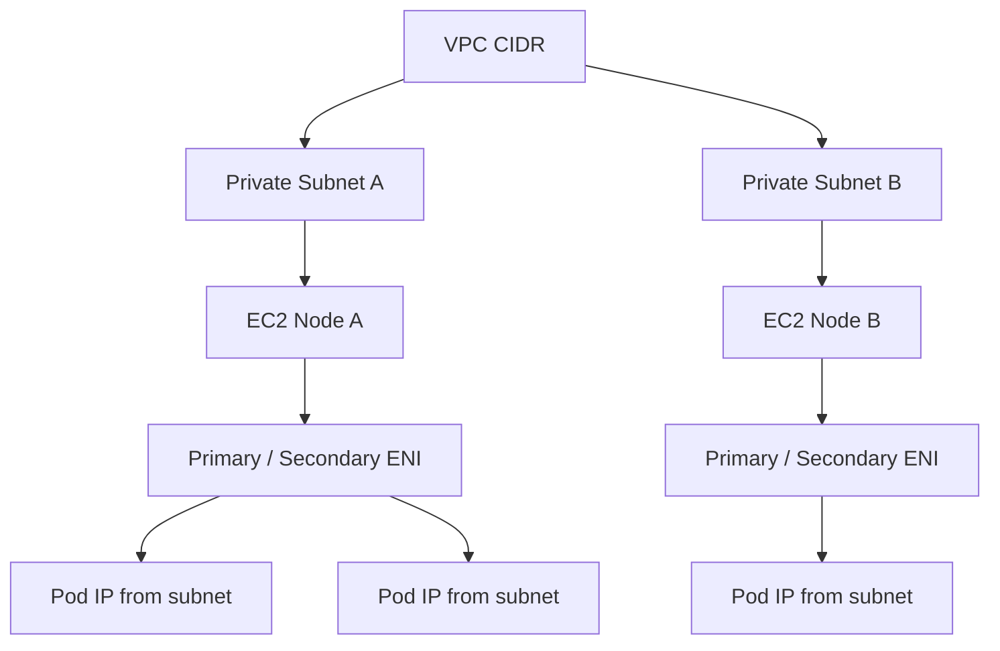
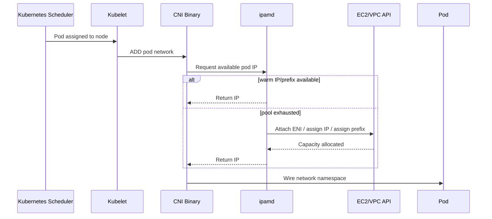
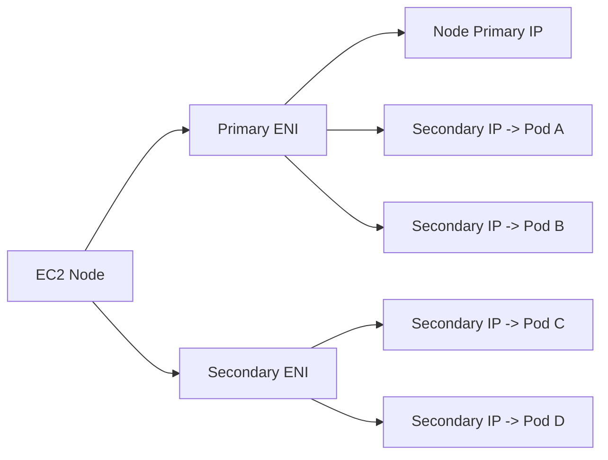
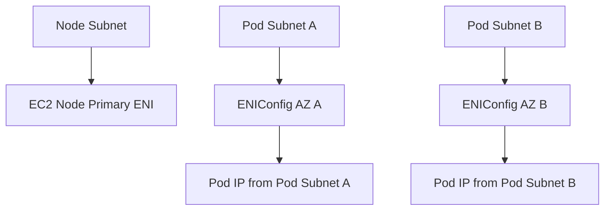
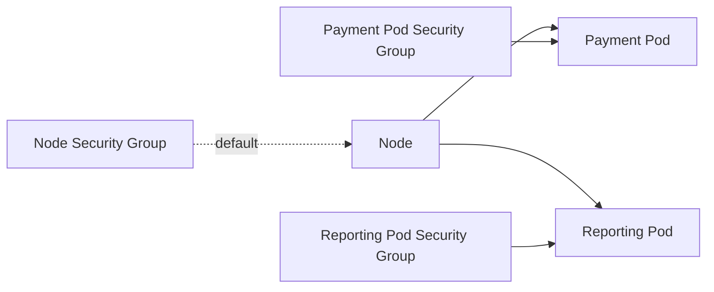
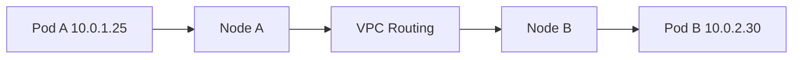
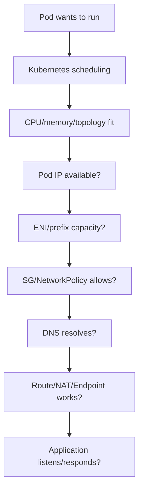

# Part 033 — EKS VPC CNI and Pod Networking

Di Part 032, kita membahas **workload identity**: bagaimana pod mendapat AWS permission tanpa static credential.

Sekarang kita masuk ke fondasi lain yang sering menjadi sumber incident EKS:

> Bagaimana pod mendapat alamat IP, bagaimana traffic keluar/masuk berjalan, dan kenapa cluster yang terlihat sehat bisa tiba-tiba tidak bisa menjadwalkan pod baru?

Di EKS, networking bukan detail kecil. Networking adalah bagian dari **capacity model**, **security boundary**, **latency profile**, dan **failure domain**.

Banyak engineer memahami Kubernetes Service, Ingress, dan Pod secara konseptual, tetapi gagal membaca EKS production issue karena tidak memahami hubungan antara:

- pod,
- node,
- ENI,
- subnet,
- security group,
- route table,
- NAT gateway,
- VPC endpoint,
- CoreDNS,
- Amazon VPC CNI,
- dan AWS API rate limits.

Part ini membangun mental model itu.

---

## 1. Premis Dasar: EKS Default Bukan Overlay Network

Pada banyak Kubernetes distribution, pod networking memakai overlay network. Pod punya IP internal cluster yang tidak langsung menjadi IP VPC.

Di EKS default, modelnya berbeda.

Amazon VPC CNI memberi pod alamat IP dari VPC. Artinya pod IP adalah IP VPC yang routable di dalam VPC.



Implikasinya besar:

- pod mengonsumsi IP subnet,
- subnet capacity menjadi cluster capacity,
- ENI limit instance menjadi pod density limit,
- security group node sering ikut menjadi security boundary pod,
- routing pod-to-pod mengikuti VPC semantics,
- observability network bisa memakai VPC-level primitives,
- IP exhaustion bisa membuat pod stuck di `Pending`, walaupun CPU/memory node masih tersedia.

Mental model yang benar:

> Di EKS default, pod bukan hanya Kubernetes object. Pod juga adalah consumer dari VPC IP capacity.

---

## 2. Komponen Utama Amazon VPC CNI

Amazon VPC CNI terdiri dari beberapa komponen penting.

| Komponen | Fungsi |
|---|---|
| `aws-node` DaemonSet | Menjalankan CNI agent di setiap node EC2. |
| `ipamd` | Mengelola warm pool IP/ENI/prefix untuk pod. |
| CNI binary | Dipanggil kubelet ketika pod network perlu dibuat. |
| ENI | Network interface EC2 yang menyediakan IP untuk node/pod. |
| Secondary IP / prefix | Pool alamat yang dialokasikan ke pod. |
| VPC resource controller | Control plane component untuk fitur tertentu seperti security groups for pods. |

Flow sederhananya:



Kubernetes scheduling hanya melihat resource Kubernetes seperti CPU, memory, taints, affinity, dan custom resources. Namun pada EKS, pod juga butuh IP yang valid dari VPC CNI.

Karena itu bisa terjadi situasi ini:

```txt
Node masih punya CPU.
Node masih punya memory.
Pod tetap Pending.
Penyebab: IP untuk pod tidak tersedia.
```

---

## 3. Pod IP Allocation: Secondary IP Mode

Mode tradisional VPC CNI adalah secondary IP mode.

Node EC2 punya ENI. ENI punya satu primary private IP dan beberapa secondary private IP. Secondary IP ini dipakai untuk pod.



Masalahnya:

- setiap instance type punya limit ENI,
- setiap ENI punya limit IP,
- VPC CNI perlu memanggil EC2 API untuk attach ENI/assign IP,
- scale-up pod burst bisa tertahan oleh API latency/rate limit,
- subnet kecil cepat habis,
- node besar bisa tidak optimal jika IP limit lebih kecil dari CPU/memory capacity.

Karena itu pod density di EKS bukan hanya:

```txt
available CPU / pod CPU request
```

Tetapi:

```txt
min(
  CPU-based capacity,
  memory-based capacity,
  ENI/IP-based capacity,
  maxPods kubelet setting,
  daemonset overhead,
  topology constraints,
  PDB/disruption constraints
)
```

---

## 4. Prefix Delegation: Menaikkan Pod Density

Prefix delegation mengubah unit alokasi dari individual secondary IP menjadi prefix, biasanya `/28` untuk IPv4.

Alih-alih ENI mendapat banyak secondary IP satu per satu, ENI mendapat prefix yang berisi beberapa IP.

```mermaid
flowchart LR
    Node[EC2 Node]
    Node --> ENI[ENI]
    ENI --> Prefix1[/28 Prefix]
    Prefix1 --> Pod1[Pod]
    Prefix1 --> Pod2[Pod]
    Prefix1 --> Pod3[Pod]
    Prefix1 --> PodN[More Pods]
```

Manfaat utama:

- lebih banyak pod per node,
- lebih sedikit EC2 API call untuk IP allocation,
- startup burst lebih baik,
- node utilization lebih baik,
- lebih cocok untuk workload microservice dengan banyak pod kecil.

Namun prefix delegation bukan silver bullet.

Trade-off-nya:

- membutuhkan subnet dengan IP contiguous yang cukup,
- subnet fragmentation dapat mengganggu alokasi prefix,
- capacity planning tetap harus dilakukan,
- security group default tetap mengikuti node kecuali memakai security groups for pods,
- max pods harus dihitung dengan benar.

Mental model:

> Prefix delegation mengurangi friksi alokasi IP per pod, tetapi tidak menghapus fakta bahwa pod tetap memakan IP VPC.

---

## 5. Subnet Pressure: Failure yang Sering Disalahdiagnosis

Subnet pressure terjadi ketika subnet tidak punya cukup IP untuk pod/node/load balancer/interface endpoint.

Gejalanya bisa tampak seperti masalah Kubernetes biasa:

- pod stuck `Pending`,
- deployment tidak mencapai desired replicas,
- node baru join tetapi pod tetap tidak scheduling,
- CNI log menunjukkan failure assign IP,
- autoscaler menambah node tetapi tidak menyelesaikan masalah,
- ALB/NLB gagal provisioning karena subnet tidak cukup IP,
- endpoint/network interface provisioning gagal.

Sumber konsumsi IP di subnet EKS:

| Consumer | Mengonsumsi IP? | Catatan |
|---|---:|---|
| EC2 node primary ENI | Ya | Setiap node butuh IP. |
| Pod IP via VPC CNI | Ya | Default EKS memberi pod IP dari subnet. |
| Secondary ENI | Ya | ENI dan IP tambahan. |
| Prefix delegation | Ya | Mengalokasikan block IP. |
| Internal ALB/NLB | Ya | Load balancer butuh IP di subnet. |
| VPC interface endpoint | Ya | Setiap endpoint ENI memakai IP. |
| NAT gateway | Ya | Per subnet/AZ tempat dibuat. |
| RDS/ElastiCache/etc | Ya | Jika berada di subnet yang sama. |

Anti-pattern:

```txt
Satu private subnet kecil dipakai untuk node, pod, database, endpoint, load balancer, dan shared service.
```

Production pattern yang lebih sehat:

```txt
- Pisahkan subnet node/pod dari subnet database bila perlu.
- Gunakan CIDR cukup besar untuk pod-heavy workload.
- Rencanakan IP per AZ, bukan hanya total VPC CIDR.
- Pantau available IP per subnet sebagai capacity signal.
- Jadikan IP exhaustion sebagai alarm, bukan incident kejutan.
```

---

## 6. Warm Pool: Latency vs Waste Trade-off

VPC CNI menjaga warm pool supaya pod baru bisa mendapat IP cepat tanpa menunggu API call saat scheduling.

Konfigurasi umum yang perlu dipahami:

| Setting | Makna |
|---|---|
| `WARM_ENI_TARGET` | Jumlah ENI ekstra yang dijaga siap. |
| `WARM_IP_TARGET` | Jumlah IP ekstra yang dijaga siap. |
| `MINIMUM_IP_TARGET` | Minimum IP yang disiapkan. |
| `ENABLE_PREFIX_DELEGATION` | Mengaktifkan prefix delegation. |
| `WARM_PREFIX_TARGET` | Prefix ekstra yang dijaga siap. |

Trade-off:

- warm pool terlalu kecil: pod startup bisa lambat saat burst,
- warm pool terlalu besar: IP subnet terpakai walaupun belum digunakan pod,
- setting salah: node terlihat boros IP,
- setting terlalu agresif: EC2 API throttling atau subnet exhaustion lebih cepat.

Prinsip praktis:

> Jangan tuning warm pool tanpa melihat pola churn pod, subnet size, deployment burst, autoscaling behavior, dan EC2 API failure signal.

---

## 7. Pod Networking dan Node Type

EKS bisa menjalankan pod di beberapa jenis compute:

| Compute | Pod networking concern |
|---|---|
| Managed node group | Pod IP berasal dari subnet node; instance ENI/IP limit relevan. |
| Self-managed node | Sama seperti EC2 node biasa, tetapi lifecycle lebih manual. |
| Karpenter node | Networking tetap bergantung instance type, subnet, security group, CNI mode. |
| EKS Fargate | Pod berjalan di Fargate-managed compute; scheduling dan networking punya constraint berbeda. |
| EKS Auto Mode | Banyak lifecycle compute/network dibuat lebih managed, tetapi capacity/IP boundary tetap harus dipahami. |

Kesalahan umum:

> Menganggap Karpenter atau Auto Mode menghapus masalah subnet dan IP capacity.

Yang benar:

> Autoscaler dapat menambah node, tetapi node tetap butuh subnet capacity dan pod tetap butuh IP capacity.

---

## 8. Custom Networking

Custom networking memungkinkan pod memakai subnet/security group berbeda dari primary ENI node melalui `ENIConfig`.

Ini berguna jika:

- node management traffic dan pod traffic ingin dipisahkan,
- pod harus berada di subnet berbeda,
- organisasi punya constraint routing/security tertentu,
- IP space node dan pod perlu dipisahkan,
- workload multi-tenant butuh network segmentation lebih eksplisit.

Modelnya:



Namun custom networking menambah operational complexity:

- perlu `ENIConfig` per AZ,
- subnet mapping harus benar,
- route table harus benar,
- security group policy harus jelas,
- observability network lebih kompleks,
- debugging perlu memahami node subnet vs pod subnet.

Gunakan custom networking ketika ada alasan arsitektural, bukan karena terlihat lebih “enterprise”.

---

## 9. Security Groups for Pods

Default EKS: pod pada node biasanya menggunakan security group node.

Ini cukup untuk banyak cluster single-tenant atau workload dengan boundary seragam.

Namun untuk workload dengan kebutuhan security berbeda, EKS mendukung **security groups for pods**.

Dengan fitur ini, security group bisa diterapkan ke pod tertentu.



Kapan berguna:

- pod payment hanya boleh akses database payment,
- pod reporting hanya boleh akses warehouse/reporting endpoint,
- compliance butuh network-level evidence per workload,
- shared node pool menjalankan workload dengan trust level berbeda.

Trade-off:

- menambah startup latency untuk pod churn tinggi,
- membutuhkan instance support tertentu,
- butuh policy management yang disiplin,
- tidak menggantikan IAM dan authorization aplikasi,
- bisa menyulitkan debugging jika terlalu granular.

Prinsip:

> Gunakan security groups for pods untuk boundary yang benar-benar butuh AWS network enforcement. Jangan jadikan setiap microservice punya SG unik tanpa alasan kuat.

---

## 10. Security Group vs NetworkPolicy

Security group dan Kubernetes NetworkPolicy sering disalahpahami sebagai hal yang sama.

Keduanya berbeda.

| Mekanisme | Scope | Cocok untuk |
|---|---|---|
| Security group | AWS/VPC network boundary | Akses ke RDS, ElastiCache, VPC endpoint, inbound dari ALB/NLB, compliance boundary. |
| Kubernetes NetworkPolicy | Pod-to-pod traffic control | East-west segmentation di dalam cluster. |
| IAM | AWS API permission | Akses S3, SQS, DynamoDB, Secrets Manager, EventBridge, dan AWS APIs lain. |
| App authz | Business permission | Siapa boleh menjalankan action/domain operation. |

Layering yang sehat:

```txt
IAM controls AWS API access.
Security group controls VPC-level network access.
NetworkPolicy controls pod-to-pod traffic.
Application authorization controls domain action.
```

Jangan memaksa satu mekanisme menyelesaikan semua masalah.

---

## 11. Pod-to-Pod Traffic

Di EKS default, pod-to-pod traffic antar node berjalan melalui VPC routing.

Contoh:



Karena pod IP adalah VPC IP:

- tidak perlu overlay encapsulation default,
- VPC route table dan security boundary penting,
- Flow Logs bisa membantu investigasi tertentu,
- subnet/AZ layout memengaruhi traffic path,
- cross-AZ traffic bisa memiliki cost/latency implication.

Namun Kubernetes Service tetap memakai abstraction sendiri.

Ketika client memanggil `service-name.namespace.svc.cluster.local`, flow melibatkan:

- DNS lookup ke CoreDNS,
- kube-proxy atau dataplane equivalent,
- Service virtual IP / endpoint selection,
- pod endpoint target.

Jadi debugging service traffic harus membedakan:

```txt
DNS problem?
Service endpoint problem?
Pod readiness problem?
Network route problem?
Security group/network policy problem?
Application problem?
```

---

## 12. DNS: CoreDNS Sebagai Critical Data Plane

Banyak incident EKS yang terlihat seperti network failure sebenarnya DNS failure.

Gejala:

- service-to-service call timeout,
- database hostname tidak resolve,
- AWS endpoint hostname gagal resolve,
- hanya sebagian pod gagal,
- latency spike karena DNS retry,
- CoreDNS CPU throttling,
- CoreDNS pod tidak cukup replica,
- node-local cache tidak dikonfigurasi untuk workload high-QPS.

CoreDNS perlu dianggap sebagai data plane dependency, bukan sekadar add-on.

Checklist CoreDNS:

- replica cukup untuk cluster size,
- CPU/memory request realistis,
- HPA bila diperlukan,
- anti-affinity/topology spread,
- logging sementara saat incident,
- cache behavior dipahami,
- query volume diamati,
- dependency ke upstream resolver dipahami.

Rule:

> Jika service-to-service call gagal secara acak, jangan langsung menyalahkan aplikasi. Periksa DNS, endpoints, readiness, dan network policy terlebih dahulu.

---

## 13. IPv4 vs IPv6 EKS

IPv4 EKS mudah dipahami karena sesuai model VPC umum, tetapi sering terkena IP exhaustion.

IPv6 mengurangi tekanan alamat, tetapi membawa konsekuensi compatibility.

Pertanyaan sebelum memilih IPv6:

- apakah semua dependency mendukung IPv6 path yang dibutuhkan?
- bagaimana akses ke service IPv4-only?
- bagaimana observability dan security tooling?
- apakah team familiar dengan debugging IPv6?
- apakah compliance/network team siap?
- apakah workload butuh dual-stack semantic?

AWS mendokumentasikan bahwa EKS tidak mendukung dual-stack Pods/Services seperti beberapa Kubernetes environment lain. Jadi keputusan IPv6 harus dilakukan sadar, bukan karena ingin “future-proof” secara abstrak.

---

## 14. Egress: NAT Gateway vs VPC Endpoints

Pod di private subnet sering butuh akses ke AWS services:

- ECR API,
- ECR Docker registry,
- S3,
- CloudWatch Logs,
- STS,
- Secrets Manager,
- SSM,
- KMS,
- EventBridge,
- SQS,
- DynamoDB.

Tanpa route yang benar, pod bisa gagal startup atau gagal runtime.

Dua pendekatan umum:

| Pendekatan | Kelebihan | Risiko |
|---|---|---|
| NAT Gateway | Sederhana untuk outbound internet/AWS public endpoints | Cost tinggi, cross-AZ cost trap, single-AZ misdesign, broad egress. |
| VPC Endpoints | Private access ke AWS services, egress lebih terkendali | Perlu endpoint lengkap, policy endpoint, IP per endpoint, setup lebih banyak. |

Untuk EKS production, jangan desain egress hanya dari sudut “bisa akses internet”.

Desain egress perlu menjawab:

- service AWS apa yang dibutuhkan saat startup?
- service AWS apa yang dibutuhkan saat runtime?
- apakah image pull bergantung NAT?
- apakah logs gagal jika CloudWatch endpoint tidak ada?
- apakah STS endpoint tersedia untuk IRSA/Pod Identity path?
- apakah endpoint policy memblokir action tertentu?
- bagaimana cross-AZ routing egress?

---

## 15. Network Path untuk Image Pull

Pod tidak bisa berjalan jika image tidak bisa ditarik.

Untuk image dari ECR, startup path dapat melibatkan:

```txt
node/pod -> ECR API
node/pod -> ECR Docker registry
node/pod -> S3 layer storage path
node/pod -> STS/IAM path depending identity/context
node/pod -> DNS resolver
```

Jika private subnet tidak punya NAT atau endpoint yang tepat, error bisa muncul sebagai image pull failure.

Runbook singkat:

1. Periksa `kubectl describe pod` untuk `ImagePullBackOff` atau `ErrImagePull`.
2. Pastikan image tag/digest benar.
3. Pastikan node/pod punya IAM permission pull image jika private ECR.
4. Pastikan DNS resolve ECR endpoint.
5. Pastikan route NAT atau VPC endpoint tersedia.
6. Pastikan security group egress mengizinkan path.
7. Pastikan repository policy/cross-account permission benar.
8. Periksa apakah ECR/S3 endpoint policy terlalu ketat.

---

## 16. Scheduling Trap: CPU Ada, Pod Tetap Pending

Contoh incident:

```txt
Deployment dinaikkan dari 200 ke 300 replicas.
Cluster autoscaler menambah node.
Sebagian pod tetap Pending.
CPU cluster terlihat masih cukup.
Memory masih cukup.
```

Kemungkinan penyebab:

- subnet kehabisan IP,
- instance type ENI/IP limit terlalu kecil,
- maxPods setting terlalu rendah,
- prefix delegation belum aktif,
- security groups for pods branch ENI limit tercapai,
- taint/toleration mismatch,
- topology spread constraint terlalu ketat,
- pod anti-affinity tidak bisa dipenuhi,
- PDB/disruption bukan untuk scheduling baru tetapi memengaruhi rollout/eviction,
- node selector hanya cocok ke node group kecil.

Jangan membaca scheduling issue hanya dari CPU/memory.

Production query yang lebih benar:

```txt
Apakah workload punya semua resource yang dibutuhkan untuk menjadi Running?
- CPU
- memory
- ephemeral storage
- pod IP
- ENI/prefix capacity
- allowed node class
- allowed AZ
- security group/pod ENI capacity
- image pull route
- secret/config route
```

---

## 17. Multi-AZ Networking

EKS production umumnya multi-AZ.

Multi-AZ bukan hanya “subnet di tiga AZ”.

Yang harus dipastikan:

- node group/Karpenter bisa provision di lebih dari satu AZ,
- subnet setiap AZ punya IP cukup,
- load balancer subnet benar,
- database dependency punya AZ placement dipahami,
- pod topology spread tidak membuat hotspot,
- cross-AZ traffic cost diperhitungkan,
- NAT gateway idealnya per AZ untuk menghindari cross-AZ egress dependency,
- VPC endpoint ditempatkan sesuai kebutuhan AZ,
- failure satu AZ tidak membuat semua pod baru hanya mencoba subnet yang habis.

Failure mode yang sering:

```txt
AZ A sehat dan punya IP.
AZ B subnet habis.
Scheduler/topology mencoba menyebar pod ke AZ B.
Sebagian replicas pending.
Deployment tidak steady.
```

Jadi capacity planning harus dilakukan per-AZ.

---

## 18. Observability untuk EKS Networking

Minimal signal yang perlu dikumpulkan:

| Signal | Mengapa penting |
|---|---|
| Available IP per subnet | Early warning IP exhaustion. |
| Pod pending reason | Membedakan resource, CNI, constraint, image issue. |
| `aws-node` health | CNI dataplane per node. |
| `ipamd` logs | IP allocation/debug signal. |
| ENI attach/error count | Menemukan AWS API/rate/permission issue. |
| CoreDNS latency/error | DNS sebagai dependency utama. |
| Node network errors | Packet/drop/conntrack pressure. |
| Load balancer target health | Ingress path correctness. |
| VPC Flow Logs selective | Investigasi security/routing issue. |
| NAT gateway metrics | Egress bottleneck/cost/failure. |

Jangan hanya membuat dashboard pod CPU/memory. Untuk EKS, network capacity adalah first-class SRE signal.

---

## 19. Runbook: Pod Stuck Pending Karena Network/IP

Langkah investigasi:

```bash
kubectl get pod -n <ns> <pod>
kubectl describe pod -n <ns> <pod>
kubectl get events -n <ns> --sort-by=.lastTimestamp
```

Cari indikasi:

- failed to assign IP,
- failed to setup network,
- insufficient pods,
- insufficient ENI/IP,
- CNI plugin error,
- webhook/network plugin timeout,
- node affinity/topology mismatch.

Periksa node:

```bash
kubectl get nodes -o wide
kubectl describe node <node>
kubectl -n kube-system get pods -l k8s-app=aws-node -o wide
kubectl -n kube-system logs ds/aws-node -c aws-node --tail=200
```

Periksa subnet:

```txt
- Available IP address count per subnet.
- Subnet mapping per node group/Karpenter NodeClass.
- AZ tempat pod ingin dijadwalkan.
- Apakah subnet fragmentasi mengganggu prefix allocation.
```

Remediasi yang mungkin:

- aktifkan prefix delegation,
- tambah atau perluas subnet/CIDR,
- gunakan instance type dengan ENI/IP capacity lebih baik,
- ubah max pods sesuai CNI mode,
- kurangi warm pool yang terlalu boros,
- pisahkan subnet pod dari subnet shared service,
- revisi topology spread/affinity,
- gunakan IPv6 jika cocok dengan constraint organisasi.

---

## 20. Runbook: Pod Running Tapi Tidak Bisa Akses Service Lain

Mulai dari pertanyaan berlapis:

```txt
1. Apakah DNS resolve?
2. Apakah Kubernetes Service punya endpoint?
3. Apakah target pod Ready?
4. Apakah NetworkPolicy memblokir?
5. Apakah security group memblokir?
6. Apakah route table/NACL bermasalah?
7. Apakah aplikasi target listen di port benar?
8. Apakah timeout/retry client terlalu buruk?
```

Command umum:

```bash
kubectl get svc -n <ns>
kubectl get endpoints -n <ns> <service>
kubectl get endpointslice -n <ns>
kubectl describe pod -n <ns> <target-pod>
kubectl logs -n kube-system deploy/coredns --tail=100
```

Jika menggunakan ephemeral debug container:

```bash
kubectl debug -n <ns> -it <pod> --image=public.ecr.aws/docker/library/busybox --target=<container>
```

Lalu cek:

```sh
nslookup service-name.namespace.svc.cluster.local
wget -S -O- http://service-name.namespace.svc.cluster.local:8080/health
```

---

## 21. Design Pattern: Pod Networking Baseline untuk Production

Baseline yang sehat:

```txt
- Private subnets cukup besar per AZ untuk node/pod.
- Prefix delegation dipertimbangkan untuk pod density.
- Available IP per subnet dipantau dan diberi alarm.
- Node group/Karpenter subnet mapping eksplisit.
- Security group node minimal dan tidak terlalu luas.
- Security groups for pods hanya untuk boundary yang butuh enforcement kuat.
- NetworkPolicy dipakai untuk east-west segmentation bila model tenant/workload memerlukannya.
- NAT gateway/VPC endpoint dirancang untuk startup dan runtime dependencies.
- CoreDNS diberi resource, HA, dan observability yang cukup.
- Load balancer subnet tagging dan route dipahami.
- IP capacity dihitung dalam review sebelum scale event.
```

---

## 22. Anti-Pattern yang Harus Dihindari

| Anti-pattern | Dampak |
|---|---|
| Subnet kecil untuk cluster besar | Pod pending saat scale. |
| Menganggap CPU/memory cukup berarti cluster cukup | IP/ENI capacity bisa habis lebih dulu. |
| Semua workload memakai node security group luas | Network blast radius besar. |
| Security group per microservice tanpa governance | Operational complexity tinggi. |
| Tidak memantau available IP subnet | IP exhaustion menjadi incident mendadak. |
| NAT gateway satu AZ untuk semua private subnet | Cross-AZ dependency dan cost trap. |
| Tidak punya VPC endpoint untuk private cluster dependency | Startup/runtime gagal saat NAT/path bermasalah. |
| CoreDNS tanpa scaling/observability | Random service failure sulit didiagnosis. |
| Custom networking tanpa alasan jelas | Debugging dan operasi lebih berat. |

---

## 23. Mental Model Final

EKS networking bisa diringkas seperti ini:



Engineer top-level tidak berhenti pada:

> Pod Pending.

Mereka bertanya:

> Resource apa yang tidak bisa dipenuhi oleh control loop?

Dan pada EKS, salah satu resource paling penting adalah **alamat jaringan**.

---

## 24. Checklist Review

Sebelum menjalankan workload besar di EKS, jawab pertanyaan ini:

- Berapa pod maksimum per AZ dalam skenario normal dan peak?
- Berapa IP tersedia per subnet setelah dikurangi node, endpoint, load balancer, dan managed service lain?
- Apakah prefix delegation aktif? Jika tidak, apakah ENI/IP limit instance type cukup?
- Apakah max pods kubelet sesuai dengan mode CNI?
- Apakah node group/Karpenter memilih subnet yang benar?
- Apakah security group node terlalu luas?
- Apakah ada workload yang benar-benar butuh security groups for pods?
- Apakah NetworkPolicy dibutuhkan untuk east-west isolation?
- Apakah NAT/VPC endpoint cukup untuk image pull, logs, STS, secrets, metrics, dan runtime dependencies?
- Apakah CoreDNS cukup kuat untuk query volume?
- Apakah available IP per subnet masuk dashboard dan alarm?
- Apakah runbook IP exhaustion sudah diuji?

---

## 25. Referensi Resmi

- Amazon EKS — Best Practices for Networking: `https://docs.aws.amazon.com/eks/latest/best-practices/networking.html`
- Amazon EKS — Amazon VPC CNI best practices: `https://docs.aws.amazon.com/eks/latest/best-practices/vpc-cni.html`
- Amazon EKS — Assign more IP addresses with prefix delegation: `https://docs.aws.amazon.com/eks/latest/userguide/cni-increase-ip-addresses.html`
- Amazon EKS — Prefix Mode for Linux: `https://docs.aws.amazon.com/eks/latest/best-practices/prefix-mode-linux.html`
- Amazon EKS — Optimizing IP Address Utilization: `https://docs.aws.amazon.com/eks/latest/best-practices/ip-opt.html`
- Amazon EKS — Security Groups for Pods: `https://docs.aws.amazon.com/eks/latest/userguide/security-groups-for-pods.html`
- Amazon EKS — Custom Networking: `https://docs.aws.amazon.com/eks/latest/best-practices/custom-networking.html`
- Amazon EKS — Network policies with Amazon VPC CNI: `https://docs.aws.amazon.com/eks/latest/userguide/cni-network-policy.html`
