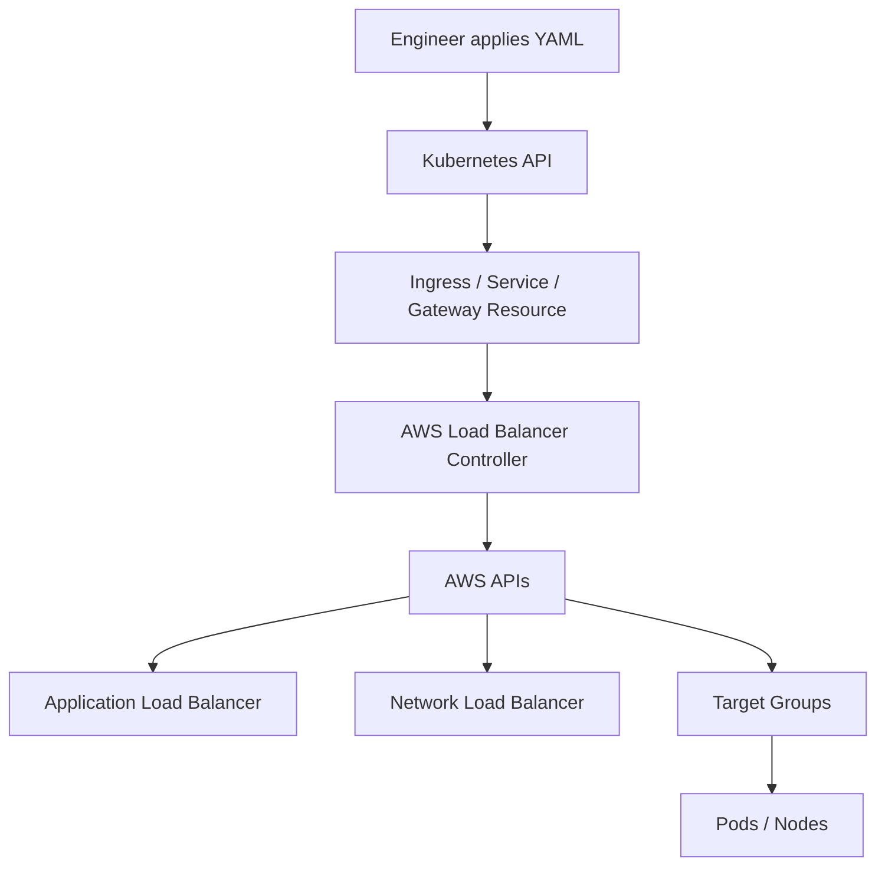
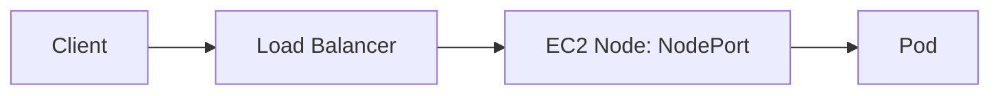
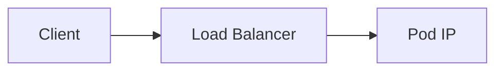
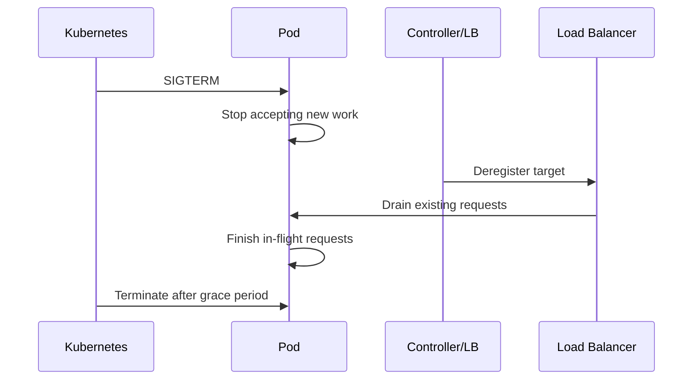
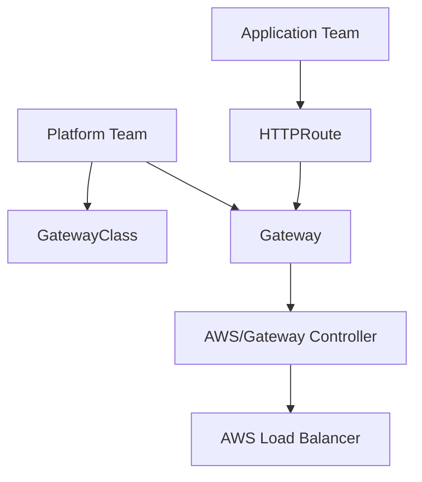
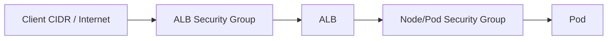
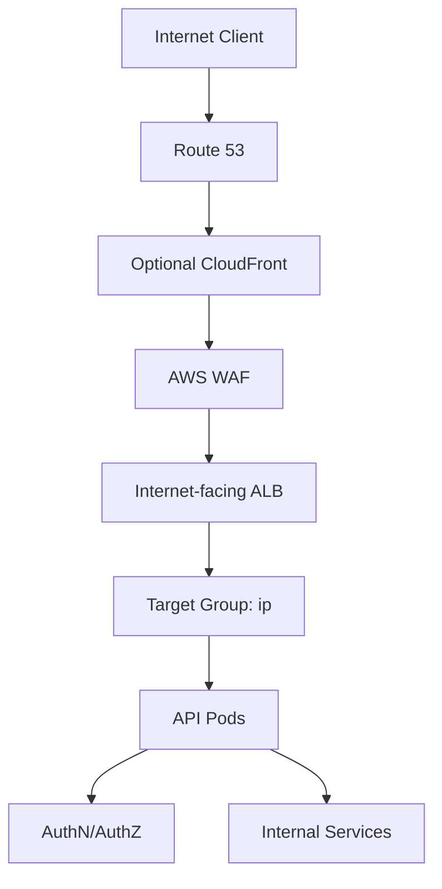
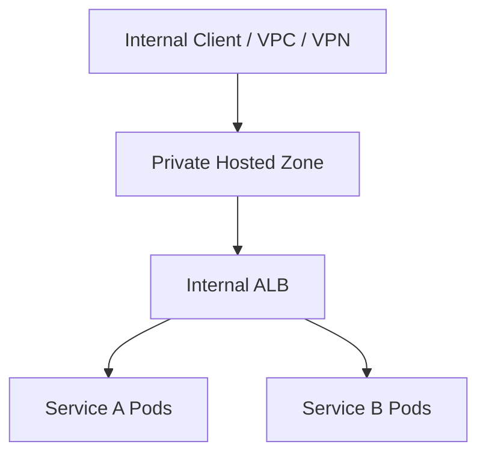
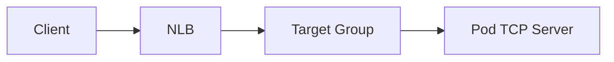
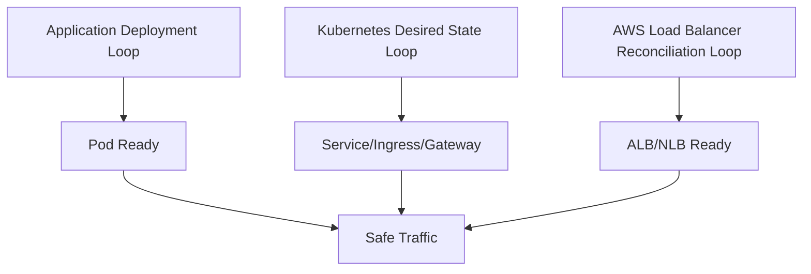

# Part 034 — Ingress, Load Balancing, and Gateway on EKS

Di Part 033, kita membahas pod networking: bagaimana pod mendapat IP, bagaimana subnet/ENI menjadi capacity limit, dan kenapa EKS networking harus dibaca sebagai bagian dari production design.

Sekarang kita masuk ke traffic masuk:

> Bagaimana request dari client mencapai pod di EKS secara aman, stabil, observable, dan bisa dioperasikan?

Di Kubernetes, kita punya abstraction seperti `Service`, `Ingress`, dan sekarang `Gateway API`.

Di AWS, abstraction itu harus direkonsiliasi menjadi resource nyata:

- Application Load Balancer,
- Network Load Balancer,
- Target Group,
- Listener,
- Listener Rule,
- Security Group,
- Health Check,
- Subnet attachment,
- DNS record,
- TLS certificate,
- WAF association,
- dan target registration.

Kunci mental model:

> Ingress di EKS bukan magic. Ia adalah Kubernetes resource yang dibaca controller, lalu controller membuat dan menjaga AWS load balancer sesuai desired state.

---

## 1. Traffic Ingress Sebagai Control Loop

AWS Load Balancer Controller berjalan di cluster dan melakukan reconciliation.



Saat YAML berubah, controller mencoba membuat AWS state mengikuti Kubernetes desired state.

Failure bisa terjadi di beberapa layer:

- manifest salah,
- annotation salah,
- controller tidak punya IAM permission,
- subnet tidak ditemukan karena tag/role salah,
- security group tidak sesuai,
- target tidak healthy,
- listener conflict,
- certificate salah,
- WAF association gagal,
- quota ELB/target group terlampaui,
- pod readiness salah,
- Service selector tidak menghasilkan endpoint.

Jadi debugging ingress tidak cukup dengan `kubectl get ingress`.

Kita perlu membaca dua dunia sekaligus:

```txt
Kubernetes desired state
+
AWS load balancer actual state
```

---

## 2. Service, Ingress, Gateway: Jangan Dicampur

Kubernetes menyediakan beberapa abstraction traffic.

| Object | Fungsi | AWS result umum |
|---|---|---|
| `Service ClusterIP` | Stable internal virtual IP/name untuk pod | Tidak membuat ELB. |
| `Service NodePort` | Membuka port di node | Sering menjadi intermediate untuk LB instance target. |
| `Service LoadBalancer` | Meminta external/internal load balancer | Umumnya NLB untuk L4. |
| `Ingress` | HTTP/HTTPS routing L7 | Umumnya ALB via AWS Load Balancer Controller. |
| `Gateway API` | Traffic API lebih ekspresif dan role-oriented | ALB/NLB tergantung implementation/controller support. |

Rule praktis:

```txt
HTTP/HTTPS API/web app -> ALB via Ingress/Gateway.
TCP/UDP low-level service -> NLB via Service LoadBalancer.
Internal service-to-service only -> ClusterIP / service mesh / internal gateway.
```

Jangan memakai Ingress untuk semua hal.

Ingress itu L7 HTTP(S). Untuk TCP/UDP murni, NLB biasanya lebih tepat.

---

## 3. ALB vs NLB

ALB dan NLB menyelesaikan problem berbeda.

| Dimensi | ALB | NLB |
|---|---|---|
| Layer | L7 HTTP/HTTPS/gRPC patterns tertentu | L4 TCP/UDP/TLS |
| Routing | Host/path/header/method/query-level patterns | Port/protocol-level |
| TLS | TLS termination umum di ALB | TLS pass-through/termination tergantung desain |
| Target | Instance/IP | Instance/IP |
| Use case | API, web app, microservice HTTP | TCP service, high-throughput L4, static IP/EIP needs, private service endpoint |
| Feature | Listener rules, WAF association, HTTP redirects, auth integrations | Very low latency L4, preserve client IP patterns, UDP |

Decision heuristic:

```txt
Need host/path routing? ALB.
Need WAF on HTTP? ALB.
Need pure TCP/UDP? NLB.
Need gRPC with HTTP/2 semantics? Usually ALB can fit, but validate behavior.
Need static IP? NLB commonly preferred.
Need simple internal TCP endpoint? NLB.
Need many HTTP routes on one endpoint? ALB.
```

---

## 4. Internet-Facing vs Internal

Load balancer scheme menentukan exposure boundary.

| Scheme | Makna |
|---|---|
| Internet-facing | DNS publik, dapat menerima traffic dari internet jika security group/routing mengizinkan. |
| Internal | DNS mengarah ke private IP, hanya reachable dari jaringan yang punya akses ke VPC. |

Kesalahan umum:

```txt
Service internal diberi internet-facing ALB karena copy-paste annotation.
```

Konsekuensinya bisa serius:

- attack surface bertambah,
- WAF/security rule harus lebih ketat,
- compliance review gagal,
- endpoint internal terekspos secara tidak sengaja.

Production rule:

> Default semua workload menjadi internal. Jadikan internet-facing sebagai keputusan eksplisit.

---

## 5. Target Type: Instance vs IP

Target group AWS bisa mendaftarkan target sebagai instance atau IP.

Di EKS, ini keputusan penting.

### Instance Target

Traffic flow:



Karakteristik:

- target adalah node EC2,
- traffic masuk ke NodePort,
- kube-proxy/service routing membawa traffic ke pod,
- bisa menambah hop,
- target health bisa merepresentasikan node/NodePort path.

### IP Target

Traffic flow:



Karakteristik:

- target adalah pod IP,
- load balancer langsung mengarah ke pod,
- cocok dengan VPC CNI karena pod IP routable di VPC,
- sering lebih tepat untuk Fargate karena tidak ada node EC2 target seperti biasa,
- target registration mengikuti pod readiness/lifecycle.

Prinsip:

> Jika ingin load balancer langsung ke pod dan mengurangi NodePort indirection, gunakan target type `ip` jika cocok dengan workload dan controller support.

Namun IP target juga perlu memperhatikan:

- pod churn,
- readiness gate,
- deregistration delay,
- health check path,
- security group inbound ke pod/node,
- cross-zone behavior,
- target group quota.

---

## 6. Subnet Discovery dan Tagging

AWS Load Balancer Controller perlu tahu subnet mana yang boleh dipakai untuk load balancer.

Biasanya subnet diberi tag untuk role:

```txt
kubernetes.io/role/elb = 1                  # public/internet-facing
kubernetes.io/role/internal-elb = 1         # internal
```

Dan dalam beberapa setup historis/tertentu, tag cluster juga relevan:

```txt
kubernetes.io/cluster/<cluster-name> = shared|owned
```

Failure yang sering:

```txt
Ingress dibuat.
Address kosong.
Controller log menunjukkan subnet tidak ditemukan.
```

Penyebab:

- subnet tidak diberi tag role,
- subnet salah AZ,
- subnet tidak punya cukup IP,
- route table tidak sesuai public/internal scheme,
- controller tidak punya permission describe/create resource,
- annotation scheme tidak cocok dengan subnet yang tersedia.

Rule:

> Subnet bukan hanya network object. Di EKS ingress, subnet adalah placement pool untuk load balancer.

---

## 7. ALB Ingress Minimal

Contoh Ingress sederhana:

```yaml
apiVersion: networking.k8s.io/v1
kind: Ingress
metadata:
  name: orders-api
  namespace: orders
  annotations:
    alb.ingress.kubernetes.io/scheme: internal
    alb.ingress.kubernetes.io/target-type: ip
    alb.ingress.kubernetes.io/healthcheck-path: /health/ready
spec:
  ingressClassName: alb
  rules:
    - host: orders.internal.example.com
      http:
        paths:
          - path: /
            pathType: Prefix
            backend:
              service:
                name: orders-api
                port:
                  number: 8080
```

Service:

```yaml
apiVersion: v1
kind: Service
metadata:
  name: orders-api
  namespace: orders
spec:
  type: ClusterIP
  selector:
    app: orders-api
  ports:
    - name: http
      port: 8080
      targetPort: 8080
```

Deployment readiness:

```yaml
readinessProbe:
  httpGet:
    path: /health/ready
    port: 8080
  initialDelaySeconds: 10
  periodSeconds: 5
  timeoutSeconds: 2
  failureThreshold: 3
```

Jangan membuat ALB health check ke `/` jika `/` bukan readiness endpoint.

---

## 8. Health Check: Readiness Boundary, Bukan Liveness Boundary

Load balancer health check menjawab:

> Apakah target ini boleh menerima traffic sekarang?

Bukan:

> Apakah process masih hidup?

Health check yang buruk:

```txt
GET / -> 200 walaupun DB pool habis, migration belum siap, cache warming belum selesai, atau dependency critical tidak tersedia.
```

Health check yang terlalu berat juga buruk:

```txt
GET /health -> melakukan query DB mahal, memanggil 5 downstream, dan timeout 10 detik.
```

Desain readiness endpoint:

- cepat,
- deterministik,
- merepresentasikan kemampuan menerima request,
- tidak melakukan side effect,
- tidak tergantung dependency non-critical,
- membedakan startup/readiness/liveness,
- memberi response code jelas.

Untuk rollout, readiness salah bisa menyebabkan:

- deployment stuck,
- target flapping,
- traffic ke pod belum siap,
- rollback palsu,
- autoscaling salah membaca kapasitas,
- incident saat peak deploy.

---

## 9. Deregistration Delay dan Graceful Shutdown

Saat pod dihentikan, target harus dikeluarkan dari load balancer sebelum process mati.

Flow ideal:



Agar flow ini aman:

- aplikasi menangani SIGTERM,
- readiness berubah false saat draining,
- `terminationGracePeriodSeconds` cukup,
- ALB/NLB deregistration delay sesuai request duration,
- preStop hook digunakan hati-hati jika perlu,
- client timeout lebih kecil dari server drain window,
- long-running request diberi model khusus.

Anti-pattern:

```txt
terminationGracePeriodSeconds: 5
request p95: 20 seconds
ALB deregistration delay: default jauh lebih lama
application tidak handle SIGTERM
```

Hasilnya: request drop saat rollout.

---

## 10. TLS Placement

Ada beberapa pilihan TLS:

| Pattern | Keterangan |
|---|---|
| TLS terminate di ALB | Umum untuk HTTP service; certificate di ACM; traffic ALB-to-pod bisa HTTP atau HTTPS. |
| TLS pass-through via NLB | Cocok jika app harus terminate TLS sendiri atau mTLS end-to-end. |
| Re-encrypt ALB-to-pod | TLS client ke ALB, lalu HTTPS ke pod. |
| Service mesh mTLS | East-west mTLS di cluster, ingress gateway/ALB sebagai north-south boundary. |

Pertanyaan desain:

- di mana trust boundary berada?
- apakah compliance meminta encryption in transit sampai pod?
- siapa mengelola certificate lifecycle?
- apakah pod perlu mengetahui client certificate?
- apakah WAF perlu inspect payload HTTP?
- apakah trace/header propagation tetap benar?

Jangan jawab “TLS di mana?” hanya dari convenience. Jawab dari trust boundary dan operational ownership.

---

## 11. WAF dan Edge Protection

Untuk HTTP public workload, ALB sering dikombinasikan dengan AWS WAF.

WAF berguna untuk:

- managed rule baseline,
- IP reputation filtering,
- basic bot protection,
- rate-based rule,
- request size/header/path controls,
- virtual patching sementara.

Namun WAF bukan pengganti:

- authentication,
- authorization,
- input validation,
- application-level rate limiting,
- abuse detection berbasis account/user/domain.

Layering yang benar:

```txt
CloudFront/Route53/Edge controls
-> ALB + WAF
-> Ingress routing
-> service authn/authz
-> domain-level authorization
-> data access controls
```

---

## 12. IngressGroup: Berguna Tapi Berbahaya Jika Tidak Diatur

AWS Load Balancer Controller mendukung pola berbagi ALB untuk beberapa Ingress melalui grouping.

Manfaat:

- mengurangi jumlah ALB,
- menghemat cost,
- memusatkan routing host/path,
- cocok untuk banyak service internal kecil.

Risiko:

- satu Ingress salah bisa memengaruhi ALB bersama,
- rule priority conflict,
- ownership antar-team kabur,
- blast radius besar,
- security review sulit jika public/internal route bercampur.

Policy yang sehat:

```txt
- Jangan campur public dan internal dalam group yang sama.
- Jangan campur environment dalam group yang sama.
- Batasi siapa boleh membuat IngressGroup tertentu.
- Gunakan admission policy untuk annotation sensitif.
- Dokumentasikan ownership ALB bersama.
```

---

## 13. Gateway API: Kenapa Muncul

Ingress sederhana dan populer, tetapi expressiveness-nya terbatas.

Gateway API mencoba memisahkan peran:

| Role | Resource |
|---|---|
| Platform/network team | `GatewayClass`, `Gateway` |
| Application team | `HTTPRoute`, `GRPCRoute`, `TCPRoute`, etc. |
| Shared policy | Route attachment, listener, allowed namespaces, policy resources. |

Mental model:



Gateway API cocok ketika:

- banyak team berbagi ingress platform,
- butuh delegation lebih formal,
- route ownership perlu dipisah dari listener ownership,
- ingress policy perlu standar,
- platform ingin membuat paved road yang lebih aman dari annotation bebas.

Namun adopsi harus realistis:

- pastikan controller support fitur yang dibutuhkan,
- jangan migrasi hanya karena API baru,
- mulai dari service boundary yang jelas,
- buat policy untuk namespace attachment,
- siapkan observability dan runbook.

---

## 14. EKS Auto Mode dan Load Balancing

Dalam EKS Auto Mode, beberapa aspek networking/load balancing dapat lebih managed.

Namun mental model tetap sama:

```txt
Kubernetes object -> controller/managed reconciliation -> AWS load balancer -> target health -> pod readiness.
```

Yang tetap harus diputuskan engineer:

- workload public atau internal,
- ALB atau NLB,
- target type,
- TLS placement,
- health check endpoint,
- route ownership,
- security boundary,
- WAF/rate-limit policy,
- observability dan incident response.

Managed automation mengurangi toil, bukan menghapus desain.

---

## 15. DNS dan Route 53

Load balancer akan menghasilkan DNS name AWS.

Aplikasi biasanya butuh DNS name yang stabil seperti:

```txt
api.example.com
orders.internal.example.com
```

Pilihan:

- external-dns mengelola Route 53 record dari Kubernetes resource,
- Terraform/CDK mengelola record secara eksplisit,
- manual record untuk boundary tertentu,
- weighted/latency/failover routing untuk pola multi-region tertentu.

Trade-off:

| Pattern | Kelebihan | Risiko |
|---|---|---|
| external-dns | Self-service, dekat dengan manifest app | Perlu IAM dan governance ketat. |
| IaC explicit | Reviewable dan controlled | Slower change path. |
| Manual | Simple awal | Drift dan audit buruk. |

Untuk production, DNS ownership harus jelas.

DNS salah bisa membuat rollout benar tetap gagal dari sudut client.

---

## 16. Security Group Design untuk Ingress

Ingress security group harus menjawab:

- siapa boleh akses load balancer?
- load balancer boleh akses target mana?
- target pod/node menerima traffic dari mana?
- apakah admin/debug network boleh akses langsung?
- apakah public internet dibatasi WAF/rate limit?
- apakah internal service endpoint hanya reachable dari VPC tertentu?

Pattern umum ALB:



Anti-pattern:

```txt
Pod/node security group inbound 0.0.0.0/0 ke application port.
```

Lebih baik:

```txt
Pod/node menerima inbound hanya dari ALB security group untuk port service.
```

Jika memakai security groups for pods, boundary bisa lebih granular. Tetapi jangan menambah granularitas tanpa governance.

---

## 17. Multi-Tenant Ingress Platform

Untuk cluster multi-team, ingress perlu model ownership.

Pertanyaan penting:

- siapa boleh membuat public ingress?
- siapa boleh attach certificate?
- siapa boleh mengubah WAF policy?
- siapa boleh memakai shared ALB group?
- apakah namespace dev boleh membuat internet-facing load balancer?
- apakah host wildcard dibatasi?
- apakah annotation tertentu dilarang?
- siapa on-call untuk ALB shared?

Gunakan kombinasi:

- RBAC,
- admission policy,
- namespace label,
- Gateway API allowed routes,
- IaC-managed shared gateway,
- policy-as-code,
- linting manifest di CI,
- tag/cost allocation.

Tanpa governance, Kubernetes self-service bisa berubah menjadi self-service exposure.

---

## 18. Observability untuk Ingress

Minimal signal:

| Signal | Sumber | Mengapa penting |
|---|---|---|
| ALB/NLB request/connection metrics | CloudWatch | Traffic volume, error, latency. |
| Target health | ELB Target Group | Membedakan LB vs pod readiness issue. |
| Controller logs | AWS Load Balancer Controller | Reconciliation error, permission, subnet, annotation. |
| Kubernetes events | API server | Manifest/controller feedback. |
| Ingress object status | Kubernetes | Apakah address/provisioning sukses. |
| Pod readiness | Kubernetes | Apakah target bisa menerima traffic. |
| Application logs/traces | App telemetry | Error bisnis/runtime. |
| WAF logs | WAF/Firehose/S3/CloudWatch | Blocked request, abuse, false positive. |
| DNS resolution | Route 53/client | Name-to-LB correctness. |

Debugging path ideal:

```txt
Client error
-> DNS resolves?
-> Load balancer reachable?
-> Listener/rule matched?
-> Target group healthy?
-> Pod ready?
-> App handles request?
-> Downstream dependency OK?
```

---

## 19. Runbook: Ingress Tidak Mendapat Address

Gejala:

```bash
kubectl get ingress -n orders
# ADDRESS kosong
```

Langkah:

```bash
kubectl describe ingress -n orders orders-api
kubectl get events -n orders --sort-by=.lastTimestamp
kubectl -n kube-system logs deployment/aws-load-balancer-controller --tail=200
```

Periksa:

- `ingressClassName` benar?
- AWS Load Balancer Controller terinstall?
- controller service account punya IAM permission?
- subnet tag untuk public/internal benar?
- annotation scheme benar?
- certificate ARN valid jika HTTPS?
- quota ALB/TG/listener tidak habis?
- security group dapat dibuat/diubah?
- Kubernetes API webhook controller sehat?

Remediasi:

- perbaiki annotation/class,
- perbaiki IAM role controller,
- tag subnet,
- pilih subnet eksplisit jika perlu,
- kurangi conflict IngressGroup,
- perbaiki certificate/WAF reference,
- cek AWS service quota.

---

## 20. Runbook: ALB Ada, Target Unhealthy

Gejala:

```txt
ALB provisioned.
DNS resolve.
Request 503 atau target group unhealthy.
```

Langkah Kubernetes:

```bash
kubectl get svc -n orders orders-api
kubectl get endpoints -n orders orders-api
kubectl get pods -n orders -l app=orders-api
kubectl describe pod -n orders <pod>
```

Periksa:

- Service selector cocok dengan pod label?
- Service port dan targetPort benar?
- Pod readiness true?
- App listen di `0.0.0.0`, bukan `localhost`?
- Health check path benar?
- Health check port benar?
- Security group inbound dari ALB ke pod/node port benar?
- Target type `ip`/`instance` sesuai?
- Pod network routable dari ALB subnet?
- Container startup lebih lama dari health grace?

Failure klasik Java service:

```txt
Spring Boot app bind ke port 8080.
Service targetPort 8081.
ALB health check /health.
Aplikasi expose /actuator/health/readiness.
Target selalu unhealthy.
```

---

## 21. Runbook: Request Drop Saat Deployment

Gejala:

- error spike saat rollout,
- sebagian request 502/503/504,
- pod restart normal,
- deployment eventually successful.

Periksa:

- readiness probe berubah false sebelum shutdown?
- aplikasi handle SIGTERM?
- `terminationGracePeriodSeconds` cukup?
- ALB deregistration delay terlalu pendek/panjang?
- client timeout/retry aggressive?
- rolling update `maxUnavailable` terlalu tinggi?
- PDB ada?
- HPA scale-in terjadi bersamaan?
- DB pool menutup sebelum in-flight request selesai?

Pattern graceful:

```txt
SIGTERM received
-> stop accepting new request
-> readiness false
-> wait/drain
-> finish in-flight
-> close resources
-> exit before grace period
```

---

## 22. Runbook: 502 vs 503 vs 504

Interpretasi kasar:

| Error | Makna umum | Investigasi |
|---|---|---|
| 502 | Bad gateway; target response invalid/connection reset | App crash, connection reset, protocol mismatch, TLS mismatch. |
| 503 | No healthy target / service unavailable | Target group unhealthy, no endpoints, readiness fail, deployment gap. |
| 504 | Gateway timeout | App slow, downstream slow, ALB idle timeout, client/server timeout mismatch. |

Jangan berhenti di status code.

Baca bersama:

- ALB access logs,
- target group health reason,
- app logs,
- pod events,
- deployment timeline,
- trace span,
- downstream latency.

---

## 23. Annotation Governance

AWS Load Balancer Controller banyak dikonfigurasi melalui annotation.

Ini powerful, tetapi rawan.

Annotation bisa mengubah:

- scheme public/internal,
- target type,
- health check,
- SSL policy,
- certificate,
- WAF,
- listener port,
- target group attributes,
- load balancer attributes,
- group name/order.

Production guardrail:

```txt
- Lint manifest di CI.
- Blok annotation sensitif di namespace non-prod/non-platform.
- Sediakan template golden path.
- Batasi internet-facing ingress ke namespace tertentu.
- Audit shared IngressGroup.
- Review certificate dan host ownership.
```

Ingress adalah security boundary. Perlakukan seperti infrastructure change, bukan sekadar YAML aplikasi.

---

## 24. Design Pattern: Public API on EKS



Properties:

- ALB internet-facing only for public edge,
- WAF attached,
- TLS certificate from ACM,
- target type `ip` where appropriate,
- readiness endpoint correct,
- pods private only,
- no direct node/pod public inbound,
- trace ID propagated from edge,
- rate limiting at edge and application layer,
- deployment uses graceful drain.

---

## 25. Design Pattern: Internal Service Endpoint



Properties:

- internal scheme,
- private hosted zone,
- security group source restricted,
- no internet route,
- host/path routes for internal APIs,
- auth still required,
- WAF optional depending threat model,
- observability same quality as public ingress.

Internal does not mean trusted.

---

## 26. Design Pattern: TCP Service with NLB



Use case:

- TCP protocol,
- UDP protocol,
- private endpoint service,
- high-throughput low-level traffic,
- static IP/EIP requirement,
- TLS pass-through.

Kubernetes object biasanya `Service` type `LoadBalancer` dengan annotation NLB.

Perhatikan:

- target type instance vs ip,
- health check protocol,
- client IP preservation,
- security group model,
- timeout behavior,
- pod disruption/drain semantics.

---

## 27. Anti-Pattern yang Harus Dihindari

| Anti-pattern | Dampak |
|---|---|
| Health check ke endpoint palsu | Traffic ke pod belum siap. |
| Semua ingress internet-facing | Attack surface besar. |
| Annotation copy-paste tanpa review | Exposure/cost/failure tidak sengaja. |
| Tidak paham instance vs ip target | Traffic path/debugging salah. |
| Tidak tag subnet dengan benar | LB tidak provision. |
| Shared ALB tanpa ownership | Satu team bisa memengaruhi team lain. |
| Tidak handle SIGTERM | Request drop saat rollout/scale-in. |
| Security group node terlalu luas | Pod exposure melebar. |
| DNS manual tanpa ownership | Drift dan outage. |
| WAF dianggap pengganti authz | Security model rapuh. |

---

## 28. Production Checklist

Sebelum expose workload EKS:

- Apakah endpoint harus public atau internal?
- ALB atau NLB?
- Ingress, Service LoadBalancer, atau Gateway API?
- Target type `instance` atau `ip`?
- Apakah subnet tagging benar?
- Apakah subnet punya IP cukup untuk load balancer?
- Apakah controller IAM role benar?
- Apakah security group inbound/outbound minimal?
- Apakah TLS certificate dan SSL policy benar?
- Apakah WAF diperlukan?
- Apakah health check path merepresentasikan readiness?
- Apakah graceful shutdown diuji?
- Apakah ALB/NLB metrics dan access logs tersedia?
- Apakah DNS record dikelola IaC/external-dns dengan governance?
- Apakah annotation sensitif dibatasi?
- Apakah target health masuk dashboard/alarm?
- Apakah runbook 502/503/504 tersedia?

---

## 29. Mental Model Final

Ingress/load balancing di EKS adalah gabungan tiga control loop:



Traffic aman hanya terjadi ketika semuanya benar:

```txt
Pod ready.
Service endpoint benar.
Ingress/Gateway benar.
Controller reconcile sukses.
Load balancer listener/rule benar.
Target group healthy.
Security group route benar.
DNS benar.
TLS benar.
Application benar.
```

Engineer yang kuat tidak bertanya:

> Kenapa ingress saya tidak jalan?

Mereka bertanya:

> Control loop mana yang gagal menyamakan desired state dengan actual state?

---

## 30. Referensi Resmi

- Amazon EKS — AWS Load Balancer Controller: `https://docs.aws.amazon.com/eks/latest/userguide/aws-load-balancer-controller.html`
- Amazon EKS — Application Load Balancing on EKS: `https://docs.aws.amazon.com/eks/latest/userguide/alb-ingress.html`
- Amazon EKS — Network Load Balancing on EKS: `https://docs.aws.amazon.com/eks/latest/userguide/network-load-balancing.html`
- Amazon EKS — Load Balancing Best Practices: `https://docs.aws.amazon.com/eks/latest/best-practices/load-balancing.html`
- Amazon EKS — Install AWS Load Balancer Controller with Helm: `https://docs.aws.amazon.com/eks/latest/userguide/lbc-helm.html`
- Amazon EKS — EKS Auto Mode NLB service annotations: `https://docs.aws.amazon.com/eks/latest/userguide/auto-configure-nlb.html`
- Amazon EKS — EKS Auto Mode ALB IngressClass: `https://docs.aws.amazon.com/eks/latest/userguide/auto-configure-alb.html`
- Elastic Load Balancing — Target group health checks: `https://docs.aws.amazon.com/elasticloadbalancing/latest/application/target-group-health-checks.html`
