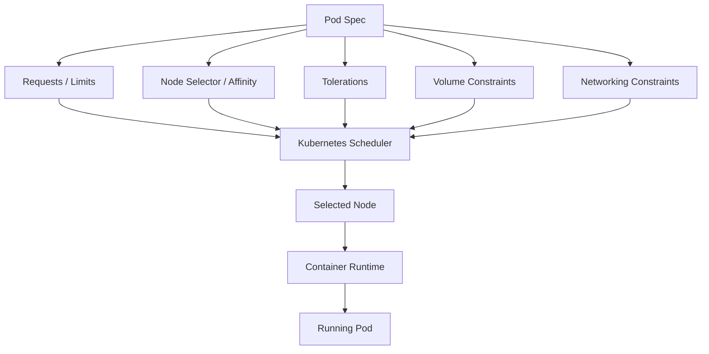
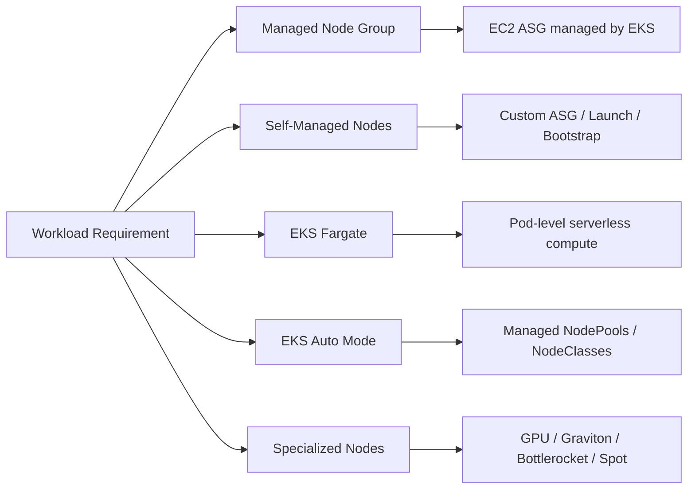
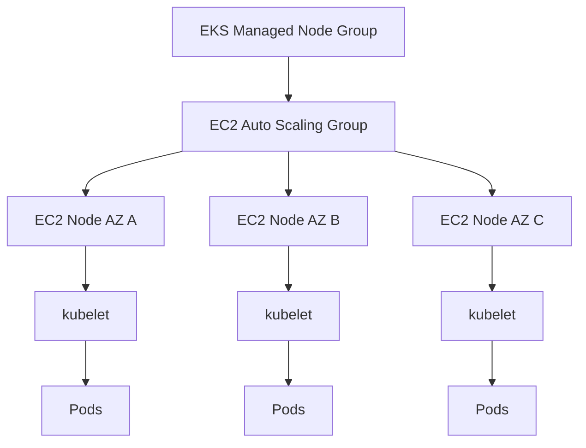
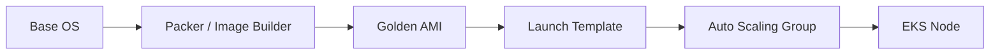
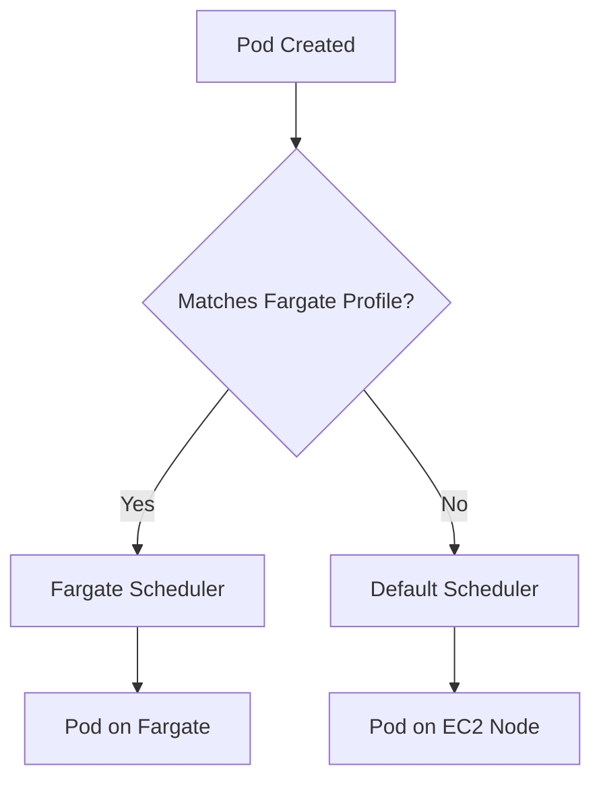
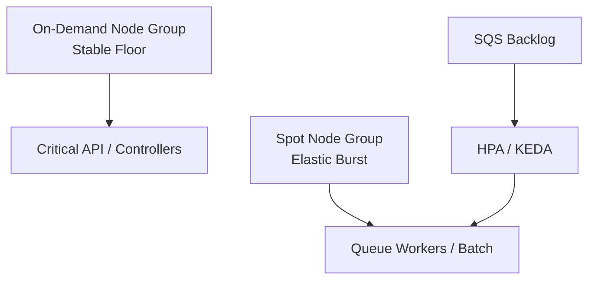
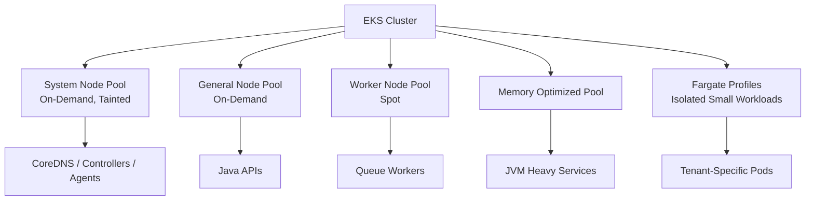

# Part 035 — EKS Compute Options

Di Part 034, kita membahas bagaimana traffic masuk ke EKS melalui `Service`, `Ingress`, AWS Load Balancer Controller, ALB, NLB, dan Gateway API.

Sekarang kita masuk ke pertanyaan yang lebih fundamental:

> Di mana pod seharusnya berjalan?

Di EKS, jawaban itu bukan sekadar “pakai node”. Compute di EKS adalah kontrak antara:

- kebutuhan workload,
- Kubernetes scheduler,
- node lifecycle,
- AWS EC2/Fargate capacity,
- cluster autoscaler atau provisioner,
- security boundary,
- cost boundary,
- dan operasi day-2.

Kamu bisa menjalankan workload EKS di beberapa model compute:

1. **Managed node groups**.
2. **Self-managed nodes**.
3. **EKS Fargate**.
4. **EKS Auto Mode-managed nodes**.
5. **Specialized nodes**, seperti Bottlerocket, Graviton, GPU, accelerated instances, Spot, Local Zones, Outposts, atau hybrid nodes.

Part ini fokus pada compute options secara umum. Part 036 akan membedah **EKS Auto Mode** secara khusus.

---

## 1. Mental Model: Compute Adalah Scheduling Contract

Di Kubernetes, pod tidak “memilih server”. Pod mendeskripsikan kebutuhan. Scheduler mencari node yang memenuhi kebutuhan itu.



Compute option menentukan karakter node yang tersedia untuk scheduler.

Contoh:

- managed node group menyediakan EC2 nodes yang lifecycle-nya sebagian dikelola EKS,
- self-managed node memberi kontrol lebih besar atas AMI, bootstrap, daemon, dan lifecycle,
- Fargate membuat setiap pod punya compute boundary sendiri tanpa kamu mengelola node,
- Auto Mode membuat EKS mengelola provisioning node berbasis kebutuhan pod,
- GPU node menyediakan accelerator tapi membawa scheduling, driver, cost, dan capacity constraints.

Kesalahan umum:

> Tim memilih compute option berdasarkan “mana yang terlihat modern”, bukan berdasarkan scheduler contract dan operational ownership.

Top engineer membalik pertanyaannya:

> Apa kontrak yang dibutuhkan workload, lalu compute model mana yang memenuhi kontrak itu dengan risiko dan biaya paling masuk akal?

---

## 2. Compute Option Bukan Hanya Infrastruktur

Saat memilih compute, kamu sebenarnya memilih banyak hal sekaligus.

| Dimensi | Pertanyaan |
|---|---|
| Lifecycle | Siapa yang patch node, rotate AMI, drain pod, dan replace instance? |
| Scheduling | Apakah workload butuh node label, taint, affinity, GPU, storage, atau topology tertentu? |
| Isolation | Apakah boundary per pod, per namespace, per node group, atau per cluster? |
| Startup | Apakah image pull/cache penting? Apakah cold provisioning bisa diterima? |
| Autoscaling | Apakah scaling berbasis pod demand, node group size, queue depth, atau manual reservation? |
| Cost | Apakah beban steady, bursty, idle, Spot-tolerant, atau reserved capacity? |
| Security | Apakah butuh hardened OS, no SSH, SELinux, custom agents, atau host-level inspection? |
| Networking | Apakah pod density, ENI/IP limit, security group for pods, dan subnet pressure menjadi bottleneck? |
| Operations | Siapa yang debug node pressure, kubelet issue, disk pressure, CNI issue, dan daemonset failure? |

Compute bukan background detail. Compute menentukan failure mode aplikasi.

---

## 3. EKS Compute Options Dalam Satu Peta



Ringkasan cepat:

| Option | Cocok Untuk | Tidak Cocok Untuk |
|---|---|---|
| Managed node groups | General-purpose production workloads yang ingin EC2 control dengan lifecycle lebih sederhana | Kebutuhan host sangat custom, custom autoscaling/provisioning kompleks |
| Self-managed nodes | Platform advanced yang butuh AMI/bootstrap/daemon/control penuh | Tim kecil yang tidak mau mengelola node lifecycle |
| EKS Fargate | Pod isolation, low ops, workload stateless, tenant boundary sederhana | DaemonSet-heavy, host networking/storage customization, latency-sensitive scale-out besar |
| EKS Auto Mode | Mengurangi beban platform ops, pod-driven provisioning, cluster modern dengan managed data plane | Butuh custom AMI/host access/komponen platform yang ingin dikelola sendiri |
| Bottlerocket nodes | Hardened container host, immutable OS, reduced host surface | Workload yang butuh paket OS custom/interactive debugging host |
| Graviton | Cost/performance bagus untuk workload compatible ARM64 | Dependency belum ARM64-ready, image multi-arch belum matang |
| GPU/accelerated nodes | ML inference/training, video, CUDA/Neuron workloads | Workload biasa yang tidak perlu accelerator |
| Spot nodes | Fault-tolerant, stateless, batch, worker, elastic workloads | Stateful critical workload tanpa interruption handling |

---

## 4. Managed Node Groups

Managed node group adalah jalan tengah paling umum untuk EKS production.

AWS mengelola sebagian lifecycle node:

- provisioning EC2 instances,
- node registration ke cluster,
- Auto Scaling Group,
- update workflow,
- drain saat update/termination,
- label EKS tertentu,
- integrasi Cluster Autoscaler discovery,
- optional node auto repair.

Namun node tetap berada di AWS account kamu. Kamu tetap bertanggung jawab atas:

- sizing instance,
- subnet placement,
- AMI update deployment,
- node group design,
- pod scheduling constraints,
- PDB correctness,
- requests/limits,
- cluster autoscaling behavior,
- security group,
- disk sizing,
- daemonset footprint,
- cost.

### 4.1 Mental Model Managed Node Group



Managed node group bukan “serverless”.

Ia adalah EC2 capacity yang lifecycle-nya lebih terintegrasi dengan EKS.

### 4.2 Kapan Managed Node Group Cocok

Gunakan managed node group saat:

- kamu ingin Kubernetes penuh tetapi tidak ingin menulis bootstrap node dari nol,
- workload membutuhkan DaemonSet,
- butuh node-level observability/security agent,
- butuh predictable warm capacity,
- butuh image cache di node,
- butuh control atas instance type,
- butuh Spot/On-Demand mix via beberapa node group,
- butuh advanced scheduling dengan taint/label,
- tim platform siap mengelola kapasitas dan upgrade.

Managed node group cocok untuk mayoritas workload EKS awal.

### 4.3 Node Group Sebagai Capacity Pool

Jangan melihat node group sebagai “sekumpulan server”. Lihat sebagai **capacity pool dengan karakteristik tertentu**.

Contoh capacity pool:

| Node Group | Karakter | Workload |
|---|---|---|
| `system-on-demand` | kecil, stabil, tainted | CoreDNS, controllers, platform add-ons |
| `general-on-demand` | general purpose | API, worker penting |
| `spot-workers` | Spot, diversified | queue worker, batch, non-critical async |
| `memory-optimized` | R-family | JVM memory-heavy service |
| `arm64-general` | Graviton | ARM-ready stateless workload |
| `gpu-inference` | GPU | ML inference |

Node group design yang baik membuat scheduler decision eksplisit.

Node group design yang buruk membuat semua workload berebut node yang sama.

### 4.4 Label dan Taint

Contoh node group dengan label:

```yaml
# Conceptual eksctl-style node group labels
labels:
  workload-tier: general
  capacity: on-demand
  arch: amd64
```

Pod memilihnya:

```yaml
apiVersion: apps/v1
kind: Deployment
metadata:
  name: case-api
spec:
  replicas: 3
  selector:
    matchLabels:
      app: case-api
  template:
    metadata:
      labels:
        app: case-api
    spec:
      nodeSelector:
        workload-tier: general
        capacity: on-demand
      containers:
        - name: app
          image: 123456789012.dkr.ecr.ap-southeast-1.amazonaws.com/case-api@sha256:...
          resources:
            requests:
              cpu: "500m"
              memory: "768Mi"
            limits:
              memory: "1536Mi"
```

Taint digunakan untuk mencegah workload biasa masuk.

```yaml
spec:
  tolerations:
    - key: "workload-tier"
      operator: "Equal"
      value: "system"
      effect: "NoSchedule"
```

Rule praktis:

> Label menarik pod ke node. Taint menolak pod kecuali pod punya toleration.

### 4.5 Satu AZ vs Multi-AZ Node Group

Managed node group bisa mencakup beberapa subnet/AZ. Namun untuk stateful workload dengan EBS, sering lebih aman membuat node group per AZ.

Kenapa?

EBS volume adalah zonal. Pod yang memakai EBS volume harus dijadwalkan di AZ yang sama dengan volume.

Jika satu node group mencakup banyak AZ, autoscaler bisa menambah node di AZ yang tidak membantu pod tersebut.

Pattern:

```txt
mng-general-a -> subnet-a -> topology.kubernetes.io/zone=ap-southeast-1a
mng-general-b -> subnet-b -> topology.kubernetes.io/zone=ap-southeast-1b
mng-general-c -> subnet-c -> topology.kubernetes.io/zone=ap-southeast-1c
```

Untuk stateless workload, multi-AZ node group sering cukup.

Untuk stateful workload, pikirkan AZ secara eksplisit.

---

## 5. Self-Managed Nodes

Self-managed node berarti kamu sendiri yang mengelola EC2 instances yang join ke cluster.

Ini memberi kontrol lebih besar, tetapi juga ownership lebih besar.

Kamu mengelola:

- launch template,
- AMI,
- bootstrap script,
- kubelet args,
- container runtime config,
- node registration,
- ASG lifecycle hooks,
- draining,
- update/patching,
- security hardening,
- capacity replacement,
- custom daemon,
- image cache strategy,
- special kernel/driver needs.

### 5.1 Kapan Self-Managed Nodes Masuk Akal

Gunakan self-managed nodes saat kamu butuh:

- custom AMI yang tidak cocok dengan managed node group,
- custom kubelet/container runtime configuration,
- host-level agent yang butuh bootstrapping khusus,
- kernel module/driver khusus,
- workload very specialized,
- low-level performance tuning,
- custom lifecycle automation,
- tight integration dengan enterprise security tooling,
- unsupported topology oleh managed node group.

Namun self-managed node adalah debt.

Ia memberi kebebasan, tetapi juga membuka failure mode:

- node join gagal,
- kubelet version drift,
- CNI mismatch,
- AMI patch tertunda,
- drain tidak menghormati PDB,
- lifecycle hook salah,
- node tidak ter-tag untuk autoscaler,
- bootstrap script berubah diam-diam,
- golden AMI tidak reproducible.

### 5.2 Golden AMI Pattern

Untuk self-managed node, hindari bootstrap terlalu banyak saat instance start.

Pattern yang lebih kuat:



Golden AMI harus immutable dan traceable:

- base image version,
- Kubernetes/kubelet compatibility,
- CNI assumptions,
- runtime config,
- agent versions,
- hardening profile,
- vulnerability scan record,
- release approval.

Self-managed node tanpa image discipline biasanya berubah menjadi snowflake fleet.

---

## 6. EKS Fargate

EKS Fargate menjalankan pod tanpa kamu mengelola EC2 node.

Pod yang match Fargate profile akan dijadwalkan ke Fargate.



Fargate memberi isolation yang lebih tegas: setiap pod punya compute boundary sendiri dan tidak berbagi kernel/CPU/memory/ENI dengan pod lain.

### 6.1 Kapan EKS Fargate Cocok

Cocok untuk:

- workload stateless,
- tenant-sensitive workload kecil,
- environment yang ingin minim node operations,
- jobs ringan,
- controller/add-on tertentu yang cocok dengan Fargate,
- service kecil dengan traffic tidak ekstrem,
- workload yang tidak butuh DaemonSet atau host customization.

### 6.2 Kapan EKS Fargate Tidak Cocok

Tidak cocok jika kamu butuh:

- DaemonSet di setiap node,
- hostPath,
- privileged container,
- custom kernel/driver,
- GPU,
- image cache di node,
- ultra-fast scale out dengan image besar,
- advanced host observability agent,
- tight node placement optimization,
- cost optimization via high pod density.

### 6.3 Fargate Profile Sebagai Scheduling Boundary

Fargate profile memakai namespace dan optional label selector.

Contoh konseptual:

```yaml
# Fargate profile selector, conceptual representation
namespace: tenant-a
labels:
  compute: fargate
```

Pod:

```yaml
apiVersion: v1
kind: Pod
metadata:
  name: tenant-a-worker
  namespace: tenant-a
  labels:
    compute: fargate
spec:
  containers:
    - name: worker
      image: 123456789012.dkr.ecr.ap-southeast-1.amazonaws.com/worker@sha256:...
      resources:
        requests:
          cpu: "500m"
          memory: "1Gi"
```

Fargate profile harus dipikirkan sebagai **platform routing rule**.

Salah selector dapat membuat pod:

- masuk Fargate padahal seharusnya EC2,
- pending karena tidak match profile dan tidak ada node cocok,
- kehilangan expected observability agent,
- gagal karena butuh feature yang tidak didukung Fargate.

### 6.4 Pod Execution Role vs Workload IAM

EKS Fargate punya **pod execution role** untuk Fargate infrastructure seperti menarik image dari ECR dan mendaftarkan pod/node ke cluster.

Itu bukan role aplikasi.

Untuk aplikasi mengakses AWS service, gunakan IRSA atau EKS Pod Identity sesuai desain identity kamu.

Pisahkan:

| Role | Digunakan Oleh | Tujuan |
|---|---|---|
| Pod execution role | Fargate infrastructure | Operasi platform seperti image pull |
| Workload IAM role | Application pod | Akses S3/SQS/DynamoDB/Secrets/etc |

Jika dua hal ini dicampur, audit permission akan kacau.

---

## 7. EKS Auto Mode Sebagai Compute Option

EKS Auto Mode akan dibahas dalam Part 036. Di sini cukup pahami posisinya.

Auto Mode adalah model di mana EKS mengotomatisasi banyak komponen data plane:

- node provisioning,
- scaling,
- consolidation,
- managed Bottlerocket-based nodes,
- built-in load balancing integration,
- storage support,
- networking components,
- node replacement,
- Pod Identity agent responsibility.

Auto Mode cocok ketika kamu ingin Kubernetes API dan ecosystem, tetapi ingin mengurangi platform ops terkait node, Karpenter, controller, dan data plane component maintenance.

Namun Auto Mode bukan berarti semua keputusan hilang.

Kamu tetap mendesain:

- resource requests,
- NodePools,
- NodeClasses,
- workload constraints,
- PDB/NDB,
- capacity type,
- workload isolation,
- cost boundaries,
- namespace policy,
- observability,
- release safety.

Auto Mode memindahkan banyak pekerjaan dari “operate node machinery” ke “design scheduling intent”.

---

## 8. Bottlerocket Nodes

Bottlerocket adalah OS container-focused dari AWS. Ia dirancang minimal, immutable-ish, dan hardened untuk menjalankan container.

Keuntungan:

- attack surface lebih kecil,
- update model lebih controlled,
- tidak membawa banyak paket OS umum,
- cocok untuk node sebagai appliance,
- integrasi baik dengan AWS/EKS.

Trade-off:

- debugging host berbeda dari Amazon Linux biasa,
- tidak cocok untuk tim yang mengandalkan SSH dan package install manual,
- custom host tooling perlu evaluasi,
- mental model operasi harus berubah: node bukan workstation.

Bottlerocket cocok untuk platform yang matang:

> Node adalah appliance. Debug workload lewat Kubernetes, logs, metrics, traces, events, dan controlled access — bukan login manual ke host.

---

## 9. Graviton / ARM64 Nodes

Graviton dapat memberi cost/performance menarik, tetapi hanya jika supply chain siap ARM64.

Checklist sebelum migrasi:

- image multi-architecture tersedia,
- Java runtime image mendukung ARM64,
- native dependency tersedia,
- JNI/native library compatible,
- observability/security agents compatible,
- load test dilakukan pada ARM64,
- performance profile dibandingkan dengan x86,
- build pipeline menghasilkan manifest list multi-arch,
- scheduler constraint jelas.

Contoh scheduling ARM64:

```yaml
spec:
  template:
    spec:
      nodeSelector:
        kubernetes.io/arch: arm64
      containers:
        - name: app
          image: 123456789012.dkr.ecr.ap-southeast-1.amazonaws.com/case-api:1.8.4
```

Namun lebih aman menggunakan image digest per architecture atau manifest list yang sudah diuji.

Pattern node group:

```txt
general-amd64-on-demand
general-arm64-on-demand
general-arm64-spot
```

Jangan campur workload ARM-ready dan not-ARM-ready tanpa policy.

---

## 10. GPU and Accelerated Nodes

GPU node bukan hanya “node mahal”. Ia membawa kontrak scheduling yang berbeda.

Kamu perlu memperhatikan:

- GPU instance type,
- driver version,
- NVIDIA device plugin atau AWS-managed support,
- image base CUDA/Neuron,
- resource request `nvidia.com/gpu`,
- taint/toleration,
- node isolation,
- bin packing,
- cold start image besar,
- model artifact loading,
- GPU utilization metric,
- scale-down behavior,
- cost guardrail.

Contoh pod GPU:

```yaml
apiVersion: apps/v1
kind: Deployment
metadata:
  name: fraud-model-inference
spec:
  replicas: 2
  selector:
    matchLabels:
      app: fraud-model-inference
  template:
    metadata:
      labels:
        app: fraud-model-inference
    spec:
      nodeSelector:
        workload-tier: gpu-inference
      tolerations:
        - key: "accelerator"
          operator: "Equal"
          value: "gpu"
          effect: "NoSchedule"
      containers:
        - name: inference
          image: 123456789012.dkr.ecr.ap-southeast-1.amazonaws.com/fraud-inference@sha256:...
          resources:
            limits:
              nvidia.com/gpu: 1
              memory: "8Gi"
            requests:
              cpu: "2"
              memory: "8Gi"
```

Rule:

> GPU node harus dipisahkan dengan taint. Jangan biarkan workload biasa menghabiskan CPU/memory di node GPU.

---

## 11. Spot Nodes

Spot capacity cocok untuk workload yang tahan interruption.

Cocok untuk:

- stateless replicas,
- queue workers,
- batch jobs,
- CI workload,
- async processors,
- non-critical services dengan replica cukup,
- workloads yang bisa checkpoint.

Tidak cocok untuk:

- singleton critical process,
- stateful pod tanpa recovery,
- pod dengan long warm-up tanpa checkpoint,
- regulatory workflow yang tidak idempotent,
- workload yang tidak menangani termination.

### 11.1 Spot Pattern: Stable Floor + Elastic Burst



Pattern production:

- minimum critical capacity on On-Demand,
- burst worker capacity on Spot,
- graceful termination,
- visibility timeout > processing time,
- idempotent processing,
- DLQ,
- checkpointing for long jobs,
- PDB for replicas,
- diversified instance types.

### 11.2 Termination Handling

Spot interruption memberi waktu terbatas. Workload harus:

- stop menerima kerja baru,
- finish in-flight if possible,
- extend/release message visibility if queue-based,
- flush telemetry,
- checkpoint progress,
- exit cleanly.

Kubernetes side:

- `terminationGracePeriodSeconds`,
- `preStop` hook jika perlu,
- readiness jadi false saat drain,
- PDB tidak terlalu ketat,
- app menangani SIGTERM.

---

## 12. Requests and Limits: Compute Contract Paling Penting

Node provisioning, bin packing, HPA, VPA, Karpenter, Auto Mode, dan Cluster Autoscaler semua bergantung pada request.

Jika request salah, compute option terbaik pun gagal.

### 12.1 Request Terlalu Kecil

Akibat:

- node overpacked,
- CPU throttling,
- memory pressure,
- latency spike,
- pod eviction,
- noisy neighbor,
- autoscaling terlambat,
- Java heap OOM.

### 12.2 Request Terlalu Besar

Akibat:

- pod pending,
- node provisioning berlebihan,
- cost naik,
- bin packing buruk,
- fragmentation,
- scale-out lambat.

### 12.3 Java Service Example

```yaml
resources:
  requests:
    cpu: "500m"
    memory: "1Gi"
  limits:
    memory: "1536Mi"
env:
  - name: JAVA_TOOL_OPTIONS
    value: >-
      -XX:MaxRAMPercentage=65
      -XX:InitialRAMPercentage=40
      -XX:+ExitOnOutOfMemoryError
```

Untuk Java, jangan samakan container memory limit dengan heap. Sisakan ruang untuk:

- metaspace,
- thread stack,
- direct buffer,
- JIT/code cache,
- native memory,
- TLS/network buffer,
- observability agent.

---

## 13. Node Group Design Patterns

### 13.1 Minimal Production Split

```txt
system-on-demand
  - tainted
  - small stable instance
  - platform add-ons only

general-on-demand
  - stateless APIs
  - critical workers

spot-workers
  - queue workers
  - batch
  - non-critical async
```

### 13.2 Regulated Workload Split

```txt
system-on-demand
shared-general
regulated-case-processing
regulated-data-export
spot-noncritical-workers
```

Policy:

- regulated namespaces hanya bisa schedule ke regulated node groups,
- security group for pods jika butuh database boundary,
- audit label wajib,
- runtime identity terpisah,
- telemetry retention disesuaikan.

### 13.3 Hardware-Aware Split

```txt
general-amd64
general-arm64
memory-optimized
gpu-inference
io-optimized
```

Gunakan label yang bermakna secara platform, bukan label yang terlalu rendah level.

Buruk:

```txt
node.kubernetes.io/instance-type=m7g.2xlarge
```

Lebih baik:

```txt
workload-profile=java-memory-optimized
arch=arm64
capacity=on-demand
```

Instance type bisa berubah. Workload intent biasanya lebih stabil.

---

## 14. Compute Selection Matrix

| Workload Shape | Recommended Starting Point | Reasoning |
|---|---|---|
| General Java API | Managed node group atau Auto Mode | Butuh stable capacity, predictable networking, normal scheduling |
| Queue worker | Managed node group Spot atau Auto Mode Spot pool | Backlog-based scaling dan interruption-tolerant jika idempotent |
| Small isolated tenant service | EKS Fargate atau Auto Mode dedicated pool | Pod isolation atau node pool isolation |
| Platform controllers | Managed system node group atau Auto Mode system pool | Stabil, tainted, jangan bercampur dengan app workload |
| ML inference | GPU node pool | Accelerator, driver/device plugin, taint wajib |
| Heavy memory JVM | Memory-optimized node group | Hindari fragmentation dan OOM |
| Bursty short jobs | Fargate, Batch, ECS, atau Auto Mode depending constraints | EKS bukan selalu best fit; lihat startup/cost/runtime |
| Custom kernel/agent | Self-managed nodes | Butuh host control |
| Low-ops Kubernetes | EKS Auto Mode | Mengurangi platform operations |
| Maximum Kubernetes control | Self-managed Karpenter + custom nodes | Flexibility tinggi, ops tinggi |

---

## 15. Decision Framework

Gunakan pertanyaan berikut sebelum memilih compute.

### 15.1 Runtime Needs

- Apakah workload butuh daemon di node?
- Apakah butuh privileged container?
- Apakah butuh GPU?
- Apakah butuh local disk besar?
- Apakah butuh image cache?
- Apakah startup latency kritikal?
- Apakah pod bisa dipindahkan kapan saja?

### 15.2 Operational Ownership

- Siapa patch AMI?
- Siapa rotate node?
- Siapa handle drain failure?
- Siapa debug node pressure?
- Siapa mengelola Karpenter/Cluster Autoscaler?
- Siapa menjaga compatibility Kubernetes version?

### 15.3 Cost Model

- Apakah workload steady atau bursty?
- Apakah idle capacity tinggi?
- Apakah Spot acceptable?
- Apakah Graviton compatible?
- Apakah over-requesting membuat node fragmentation?
- Apakah telemetry/egress/storage cost ikut dihitung?

### 15.4 Failure Tolerance

- Apakah pod boleh restart?
- Apakah pod boleh pindah node?
- Apakah PDB realistis?
- Apakah process idempotent?
- Apakah queue visibility timeout benar?
- Apakah state externalized?

---

## 16. Production Anti-Patterns

### Anti-Pattern 1: Semua Workload di Satu Node Group

Gejala:

- platform controller bersaing dengan app workload,
- Spot interruption mengganggu critical service,
- GPU node dipakai workload biasa,
- noisy neighbor sulit diisolasi,
- cost allocation kabur.

Perbaikan:

- pisah system/general/spot/specialized,
- gunakan taint/toleration,
- label kapasitas,
- enforcement dengan policy.

### Anti-Pattern 2: Request Tidak Diisi

Gejala:

- autoscaling tidak akurat,
- bin packing liar,
- throttling sulit diprediksi,
- node pressure sering muncul.

Perbaikan:

- wajibkan request via admission policy,
- gunakan VPA recommendation mode,
- ukur real usage,
- review per release.

### Anti-Pattern 3: Menganggap Fargate = Semua Operasi Hilang

Fargate menghapus node management, bukan menghapus:

- request/limit design,
- startup time,
- image size,
- IAM,
- network path,
- logging,
- retry,
- cost,
- pod lifecycle.

### Anti-Pattern 4: Self-Managed Nodes Tanpa Release Discipline

Gejala:

- bootstrap script berubah manual,
- AMI tidak traceable,
- kubelet drift,
- incident tidak bisa direproduksi.

Perbaikan:

- golden AMI,
- versioned launch template,
- canary node group,
- automated conformance test,
- rollback plan.

### Anti-Pattern 5: Spot Untuk Workload Yang Tidak Siap Interrupted

Gejala:

- duplicate side effects,
- stuck job,
- partial write,
- lost work,
- retry storm.

Perbaikan:

- idempotency,
- checkpoint,
- DLQ,
- stable On-Demand floor,
- graceful termination.

---

## 17. Failure Mode Catalog

| Symptom | Likely Cause | First Checks |
|---|---|---|
| Pod Pending | No node fits request/selector/affinity/taint | `kubectl describe pod`, scheduler events |
| Node NotReady | kubelet/CNI/runtime/node health issue | node conditions, cloud provider events |
| Scale-out slow | instance capacity, image pull, autoscaler delay | provisioner logs, EC2 capacity, image size |
| Pod evicted | memory/disk/node pressure | node conditions, eviction events |
| Workload not on expected nodes | label/taint mismatch | pod spec, node labels, tolerations |
| GPU pod pending | device plugin/driver/node selector issue | allocatable GPU, tolerations, node labels |
| Spot causes incidents | workload not interruption-safe | SIGTERM handling, PDB, idempotency |
| Fargate pod pending | profile selector/subnet/IAM issue | Fargate profile, pod events, execution role |
| Autoscaler adds wrong nodes | node group/AZ/storage constraint mismatch | PV zone, node group subnet, scheduler events |
| Cost spike | over-requesting or low utilization | request vs usage, node utilization, consolidation |

---

## 18. Debugging Pending Pods

Pending pods are scheduling truth serum.

Start here:

```bash
kubectl describe pod <pod> -n <namespace>
```

Look at events:

```txt
0/6 nodes are available: 
2 Insufficient memory, 
2 node(s) had untolerated taint, 
2 node(s) didn't match Pod's node affinity/selector.
```

Interpretation:

- `Insufficient memory`: request too high or no capacity pool big enough.
- `untolerated taint`: pod not allowed on those nodes.
- `node affinity/selector`: pod asks for labels no node has.
- `volume node affinity conflict`: pod must run in AZ where volume exists.
- `Too many pods`: ENI/IP/pod density limit.

Top engineer does not immediately “add more nodes”. First, identify why existing or new nodes cannot satisfy the scheduling contract.

---

## 19. Compute Governance

Mature EKS platforms define compute as product surface.

Example policy:

```txt
Every namespace must declare:
- allowed workload profiles
- allowed capacity type
- max CPU/memory request
- allowed architectures
- allowed accelerators
- allowed node isolation level
```

Example annotations:

```yaml
metadata:
  labels:
    platform.example.com/workload-class: "regulated-api"
    platform.example.com/cost-center: "enforcement"
    platform.example.com/runtime-owner: "case-platform"
```

Admission policy can enforce:

- requests required,
- limits required for memory,
- no privileged pods except approved namespaces,
- no GPU node without GPU request,
- no Spot-only critical deployments,
- `topologySpreadConstraints` required for critical workloads,
- PDB required for HA deployments.

Compute governance prevents architecture from becoming tribal knowledge.

---

## 20. Practical Baseline Architecture

Untuk banyak organisasi, baseline masuk akal adalah:



Baseline rules:

- system add-ons tidak bercampur dengan app workload,
- critical API punya On-Demand capacity,
- async worker boleh Spot jika idempotent,
- special hardware dipisah,
- request/limit wajib,
- PDB wajib untuk critical replicas,
- topology spread wajib untuk HA,
- node group labels konsisten,
- capacity cost dipantau per pool.

---

## 21. Example: Java API Placement

```yaml
apiVersion: apps/v1
kind: Deployment
metadata:
  name: case-api
  namespace: enforcement
spec:
  replicas: 6
  selector:
    matchLabels:
      app: case-api
  template:
    metadata:
      labels:
        app: case-api
    spec:
      nodeSelector:
        workload-profile: java-general
        capacity: on-demand
      topologySpreadConstraints:
        - maxSkew: 1
          topologyKey: topology.kubernetes.io/zone
          whenUnsatisfiable: DoNotSchedule
          labelSelector:
            matchLabels:
              app: case-api
      containers:
        - name: app
          image: 123456789012.dkr.ecr.ap-southeast-1.amazonaws.com/case-api@sha256:...
          ports:
            - containerPort: 8080
          readinessProbe:
            httpGet:
              path: /ready
              port: 8080
            periodSeconds: 5
            failureThreshold: 3
          resources:
            requests:
              cpu: "750m"
              memory: "1Gi"
            limits:
              memory: "1536Mi"
```

PDB:

```yaml
apiVersion: policy/v1
kind: PodDisruptionBudget
metadata:
  name: case-api-pdb
  namespace: enforcement
spec:
  minAvailable: 4
  selector:
    matchLabels:
      app: case-api
```

Catatan:

- PDB harus masuk akal terhadap replica count.
- `minAvailable: 4` untuk 6 replica masih memberi ruang drain.
- Jika `minAvailable: 6`, node upgrade/consolidation bisa macet.

---

## 22. Example: Spot Worker Placement

```yaml
apiVersion: apps/v1
kind: Deployment
metadata:
  name: document-export-worker
  namespace: enforcement
spec:
  replicas: 10
  selector:
    matchLabels:
      app: document-export-worker
  template:
    metadata:
      labels:
        app: document-export-worker
    spec:
      nodeSelector:
        workload-profile: async-worker
        capacity: spot
      tolerations:
        - key: "capacity"
          operator: "Equal"
          value: "spot"
          effect: "NoSchedule"
      terminationGracePeriodSeconds: 60
      containers:
        - name: worker
          image: 123456789012.dkr.ecr.ap-southeast-1.amazonaws.com/document-export-worker@sha256:...
          env:
            - name: WORKER_SHUTDOWN_MODE
              value: "finish-inflight-or-release"
          resources:
            requests:
              cpu: "500m"
              memory: "768Mi"
            limits:
              memory: "1280Mi"
```

Worker harus:

- idempotent,
- tidak ack message sebelum side effect aman,
- handle SIGTERM,
- release work if interrupted,
- punya DLQ dan retry budget.

---

## 23. Compute Review Questions

Saat design review, tanyakan:

1. Workload ini stateless atau stateful?
2. Apakah pod bisa dihentikan kapan saja?
3. Apa resource request berdasarkan measurement atau tebakan?
4. Apakah Java memory limit memberi native headroom?
5. Apakah workload bisa jalan di ARM64?
6. Apakah workload boleh jalan di Spot?
7. Apa node pool targetnya?
8. Apa yang mencegah workload biasa masuk GPU node?
9. Apa yang terjadi saat node drain?
10. Apakah PDB memblokir upgrade?
11. Apakah workload punya topology spread?
12. Apakah storage punya AZ constraint?
13. Apakah image besar memperlambat scale-out?
14. Siapa pemilik node patching?
15. Bagaimana cost per workload dilacak?

---

## 24. What Top 1% Engineers Internalize

Top 1% engineer tidak bertanya:

> “Mana yang paling baru?”

Mereka bertanya:

> “Compute contract mana yang paling cocok dengan failure tolerance, operational ownership, dan economics workload ini?”

Mereka memahami bahwa:

- Kubernetes scheduler adalah constraint solver,
- node pool adalah capacity product,
- request/limit adalah financial and reliability contract,
- taint/toleration adalah isolation primitive,
- Spot adalah economic tool, bukan free discount,
- Fargate menghapus node ops, bukan runtime design,
- self-managed nodes memberi power sekaligus liability,
- Auto Mode mengurangi toil tetapi tetap membutuhkan workload intent yang benar,
- GPU/ARM/memory nodes harus dipisahkan dengan policy,
- PDB yang salah bisa menghentikan seluruh operasi maintenance.

---

## 25. Mini Lab: Design Compute Pools

Buat desain compute untuk sistem berikut:

- `case-api`: Java API critical, 6 replicas, latency-sensitive.
- `case-worker`: queue worker idempotent, bursty.
- `document-renderer`: memory-heavy Java service.
- `fraud-inference`: GPU inference.
- `tenant-webhook-adapter`: isolated tenant workloads.
- `platform-addons`: controllers and observability agents.

Expected answer:

| Workload | Compute Choice | Reason |
|---|---|---|
| case-api | On-Demand general managed node group | Critical service, stable replicas |
| case-worker | Spot worker node group | Idempotent async workload |
| document-renderer | Memory-optimized node group | JVM memory profile |
| fraud-inference | GPU tainted node group | Accelerator required |
| tenant-webhook-adapter | Fargate or isolated node pool | Isolation boundary |
| platform-addons | Tainted system node group | Protect platform components |

Then define:

- node labels,
- taints,
- pod selectors,
- PDB,
- topology spread,
- autoscaling signal,
- termination behavior.

---

## 26. Key Takeaways

- EKS compute option is not an infrastructure preference. It is a runtime, scheduling, security, cost, and operations contract.
- Managed node groups are the default production workhorse for many teams.
- Self-managed nodes are powerful but operationally expensive.
- Fargate removes node management but introduces its own constraints.
- Auto Mode changes the platform team’s job from operating node machinery to expressing scheduling intent.
- Bottlerocket treats nodes as hardened appliances.
- Graviton can improve economics only when the build/runtime supply chain is ARM-ready.
- GPU nodes require strict taints, requests, and cost controls.
- Spot is excellent for interruption-tolerant workloads and dangerous for non-idempotent critical workloads.
- Requests, limits, labels, taints, PDBs, and topology spread are the real compute API your workloads depend on.

---

## 27. References

- Amazon EKS — Manage compute resources by using nodes: `https://docs.aws.amazon.com/eks/latest/userguide/eks-compute.html`
- Amazon EKS — Managed node groups: `https://docs.aws.amazon.com/eks/latest/userguide/managed-node-groups.html`
- Amazon EKS — Self-managed nodes: `https://docs.aws.amazon.com/eks/latest/userguide/worker.html`
- Amazon EKS — Fargate: `https://docs.aws.amazon.com/eks/latest/userguide/fargate.html`
- Amazon EKS — Fargate profiles: `https://docs.aws.amazon.com/eks/latest/userguide/fargate-profile.html`
- Amazon EKS — Pod execution role: `https://docs.aws.amazon.com/eks/latest/userguide/pod-execution-role.html`
- Amazon EKS — Autoscaling: `https://docs.aws.amazon.com/eks/latest/userguide/autoscaling.html`
- Bottlerocket: `https://bottlerocket.dev/`

---

## 28. Next Part

Part 036 akan membahas **EKS Auto Mode** secara mendalam:

- apa yang otomatis,
- apa yang tetap harus kamu desain,
- NodePool,
- NodeClass,
- built-in pools,
- static capacity,
- consolidation,
- disruption control,
- migration dari managed node group/Karpenter,
- dan production guardrails.
