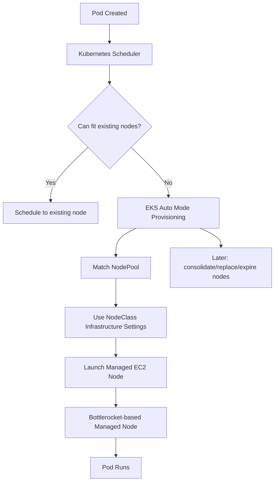
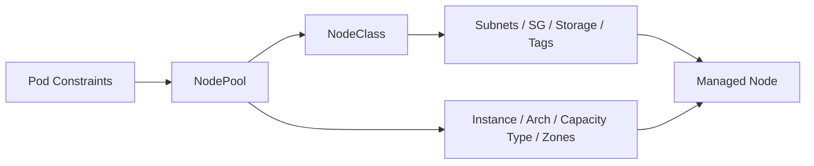
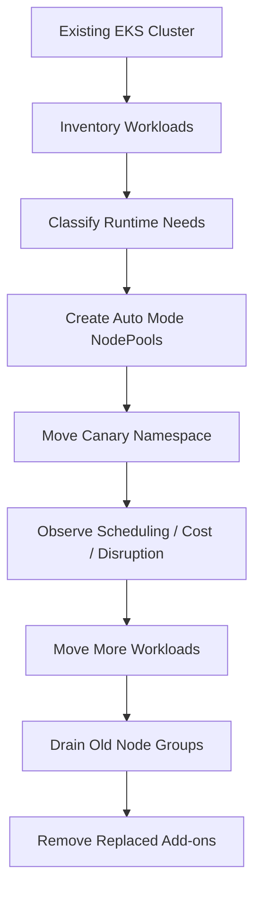

# Part 036 — EKS Auto Mode

Di Part 035, kita membandingkan compute options EKS: managed node groups, self-managed nodes, Fargate, Bottlerocket, Graviton, GPU, Spot, dan specialized pools.

Sekarang kita fokus pada **EKS Auto Mode**.

Auto Mode mengubah cara tim mengoperasikan EKS. Ia tidak menghapus Kubernetes. Ia menghapus banyak pekerjaan berulang di data plane:

- node provisioning,
- node scaling,
- node consolidation,
- node replacement,
- managed Bottlerocket-based nodes,
- built-in networking pieces,
- built-in storage support,
- built-in load balancing integration,
- integrated Pod Identity agent responsibility,
- managed operational components yang biasanya dipasang sendiri.

Tetapi Auto Mode tidak menghapus kebutuhan desain.

Ia mengubah pekerjaan platform team dari:

> “mengelola node machinery”

menjadi:

> “mengekspresikan workload intent secara benar”.

---

## 1. Mental Model: Auto Mode Is Managed Scheduling Infrastructure

EKS Auto Mode melihat pod yang tidak bisa dijadwalkan, lalu menyediakan node yang cocok berdasarkan constraints yang kamu berikan melalui workload spec, NodePool, dan NodeClass.



Auto Mode bukan hanya “autoscaler”. Ia adalah managed data plane operating model.

Namun scheduler tetap bekerja berdasarkan Kubernetes primitives:

- CPU/memory requests,
- node selectors,
- affinity,
- taints/tolerations,
- topology spread,
- volume constraints,
- PDB,
- priority classes,
- disruption budgets.

Jika pod spec buruk, Auto Mode akan mengotomatiskan keputusan buruk.

---

## 2. Apa Yang Diotomatisasi

EKS Auto Mode mengotomatisasi beberapa area penting.

### 2.1 Compute

Auto Mode dapat:

- menambah node saat pod tidak muat di node existing,
- menghapus node saat tidak dibutuhkan,
- melakukan consolidation,
- mengganti node yang expired atau drift,
- memakai managed Bottlerocket-based nodes,
- menangani sebagian event kesehatan/maintenance,
- menjalankan node dengan model appliance, bukan login host manual.

Konsekuensi penting:

> Node bukan lagi asset yang kamu rawat secara individual. Node adalah disposable capacity yang dihasilkan dari scheduling intent.

### 2.2 Load Balancing

Auto Mode membawa integrasi load balancing terkelola untuk `Service` dan `Ingress` tertentu.

Ini mengurangi kebutuhan memasang dan mengoperasikan AWS Load Balancer Controller sendiri dalam beberapa skenario.

Namun kamu tetap harus mendesain:

- service type,
- ingress shape,
- annotations yang didukung,
- TLS,
- WAF boundary,
- target health,
- readiness probe,
- subnet/security group model.

### 2.3 Storage

Auto Mode menyediakan integrasi storage yang lebih managed, termasuk EBS CSI behavior untuk workload yang sesuai.

Namun kamu tetap harus memahami:

- EBS zonal nature,
- StatefulSet scheduling,
- volume expansion,
- snapshot/backup,
- deletion policy,
- performance class,
- disruption during node movement.

### 2.4 Networking

Auto Mode mengurangi beban mengelola beberapa komponen networking, tetapi tidak menghapus kebutuhan desain jaringan.

Kamu tetap harus merancang:

- VPC CIDR,
- subnet capacity,
- private/public subnet boundary,
- VPC endpoints,
- security groups,
- ingress/egress control,
- DNS behavior,
- network policy,
- multi-AZ placement.

### 2.5 Identity

Pada cluster Auto Mode, beberapa komponen seperti Pod Identity agent tidak perlu kamu pasang manual.

Tetapi workload identity tetap harus dirancang:

- service account mapping,
- IAM role scope,
- cross-account access,
- least privilege,
- blast radius,
- audit.

---

## 3. Apa Yang Tidak Diotomatisasi

Auto Mode tidak menulis arsitektur untukmu.

Ia tidak otomatis menentukan:

- apakah workload idempotent,
- apakah request/limit benar,
- apakah pod boleh interrupted,
- apakah PDB memblokir drain,
- apakah service punya readiness yang benar,
- apakah Java heap aman,
- apakah deployment compatible dengan DB migration,
- apakah namespace isolation cukup,
- apakah event processing aman dari duplicate delivery,
- apakah cost allocation masuk akal.

Auto Mode juga tidak menghapus kebutuhan:

- design review,
- workload classification,
- runbook,
- telemetry,
- policy-as-code,
- incident response.

---

## 4. Core Abstractions: NodePool and NodeClass

Auto Mode memakai dua konsep penting:

1. **NodePool** — scheduling/capacity intent.
2. **NodeClass** — infrastructure-level node configuration.



### 4.1 NodePool

NodePool menjawab:

> Node seperti apa yang boleh dibuat untuk workload ini?

NodePool dapat mendefinisikan constraint seperti:

- instance family/type,
- architecture,
- OS,
- capacity type,
- availability zone,
- disruption policy,
- limits,
- taints,
- labels,
- reference ke NodeClass.

### 4.2 NodeClass

NodeClass menjawab:

> Infrastruktur AWS seperti apa yang dipakai node tersebut?

NodeClass dapat mendefinisikan:

- subnet selector,
- security group selector,
- ephemeral storage,
- resource tags,
- network/storage-related settings.

Rule mental model:

> NodePool adalah intent scheduling. NodeClass adalah intent infrastructure.

---

## 5. Built-in NodePools

Auto Mode menyediakan built-in NodePools untuk use case umum, seperti general-purpose dan system.

Jangan menganggap built-in pool sebagai akhir desain. Anggap sebagai baseline.

Kamu mungkin tetap perlu custom NodePool untuk:

- workload regulated,
- workload memory-heavy,
- Spot workers,
- GPU workloads,
- ARM64 workloads,
- per-team cost isolation,
- AZ-specific capacity,
- static capacity,
- storage-sensitive workloads,
- strict security group/subnet placement.

Default pool mempercepat start. Custom pool membuat platform bisa dipertanggungjawabkan.

---

## 6. Example NodeClass

Contoh konseptual NodeClass untuk private compute.

> Selalu verifikasi `apiVersion` dan field aktual terhadap versi EKS cluster dan dokumentasi AWS terbaru sebelum digunakan di production.

```yaml
apiVersion: eks.amazonaws.com/v1
kind: NodeClass
metadata:
  name: private-general
spec:
  subnetSelectorTerms:
    - tags:
        kubernetes.io/role/internal-elb: "1"
        platform.example.com/network-tier: "private-app"
  securityGroupSelectorTerms:
    - tags:
        platform.example.com/sg-role: "eks-node"
  ephemeralStorage:
    size: "160Gi"
  tags:
    platform.example.com/owner: "platform-team"
    platform.example.com/cost-domain: "shared-compute"
```

Design notes:

- private subnet untuk app workload,
- security group dipilih via tag,
- ephemeral storage dinaikkan untuk image/cache/temp needs,
- tags untuk cost allocation dan governance.

NodeClass yang baik membuat infrastructure choice eksplisit dan auditable.

---

## 7. Example NodePool: General On-Demand

```yaml
apiVersion: karpenter.sh/v1
kind: NodePool
metadata:
  name: general-on-demand
spec:
  template:
    metadata:
      labels:
        workload-profile: general
        capacity: on-demand
    spec:
      nodeClassRef:
        group: eks.amazonaws.com
        kind: NodeClass
        name: private-general
      requirements:
        - key: kubernetes.io/arch
          operator: In
          values: ["amd64", "arm64"]
        - key: kubernetes.io/os
          operator: In
          values: ["linux"]
        - key: karpenter.sh/capacity-type
          operator: In
          values: ["on-demand"]
        - key: eks.amazonaws.com/instance-family
          operator: In
          values: ["m", "c", "r"]
  disruption:
    consolidationPolicy: WhenEmptyOrUnderutilized
    budgets:
      - nodes: "10%"
```

Interpretation:

- workload general boleh berjalan di pool ini,
- On-Demand capacity,
- AMD64/ARM64 diperbolehkan hanya jika image multi-arch benar,
- disruption dibatasi agar consolidation tidak terlalu agresif.

Jika supply chain kamu belum ARM-ready, jangan izinkan `arm64`.

---

## 8. Example NodePool: Spot Workers

```yaml
apiVersion: karpenter.sh/v1
kind: NodePool
metadata:
  name: spot-workers
spec:
  template:
    metadata:
      labels:
        workload-profile: async-worker
        capacity: spot
    spec:
      taints:
        - key: capacity
          value: spot
          effect: NoSchedule
      nodeClassRef:
        group: eks.amazonaws.com
        kind: NodeClass
        name: private-general
      requirements:
        - key: karpenter.sh/capacity-type
          operator: In
          values: ["spot"]
        - key: kubernetes.io/arch
          operator: In
          values: ["amd64"]
        - key: eks.amazonaws.com/instance-family
          operator: In
          values: ["m", "c", "r"]
  disruption:
    consolidationPolicy: WhenEmptyOrUnderutilized
    budgets:
      - nodes: "20%"
```

Workload harus explicitly tolerate Spot:

```yaml
spec:
  template:
    spec:
      nodeSelector:
        workload-profile: async-worker
        capacity: spot
      tolerations:
        - key: capacity
          operator: Equal
          value: spot
          effect: NoSchedule
```

Ini mencegah critical workloads masuk Spot secara tidak sengaja.

---

## 9. Example NodePool: Static Capacity

Auto Mode juga mendukung static capacity NodePool untuk kebutuhan predictable capacity.

Use case:

- reserved instances,
- committed capacity,
- compliance footprint,
- warm capacity untuk latency-sensitive workload,
- workload yang tidak cocok dengan scale-from-zero.

Contoh konseptual:

```yaml
apiVersion: karpenter.sh/v1
kind: NodePool
metadata:
  name: static-general-a
spec:
  replicas: 4
  template:
    metadata:
      labels:
        workload-profile: general-static
        capacity: on-demand
        zone-pool: a
    spec:
      nodeClassRef:
        group: eks.amazonaws.com
        kind: NodeClass
        name: private-general
      requirements:
        - key: topology.kubernetes.io/zone
          operator: In
          values: ["ap-southeast-1a"]
        - key: karpenter.sh/capacity-type
          operator: In
          values: ["on-demand"]
```

Static capacity bukan consolidation-driven. Ia menjaga jumlah node tetap.

Gunakan static capacity saat kamu ingin node count menjadi kontrak, bukan hanya hasil scheduling demand.

---

## 10. Workload Placement With Auto Mode

Auto Mode bekerja baik jika pod spec memberi intent yang jelas.

Contoh Java API:

```yaml
apiVersion: apps/v1
kind: Deployment
metadata:
  name: case-api
  namespace: enforcement
spec:
  replicas: 6
  selector:
    matchLabels:
      app: case-api
  template:
    metadata:
      labels:
        app: case-api
    spec:
      nodeSelector:
        workload-profile: general
        capacity: on-demand
      topologySpreadConstraints:
        - maxSkew: 1
          topologyKey: topology.kubernetes.io/zone
          whenUnsatisfiable: DoNotSchedule
          labelSelector:
            matchLabels:
              app: case-api
      containers:
        - name: app
          image: 123456789012.dkr.ecr.ap-southeast-1.amazonaws.com/case-api@sha256:...
          resources:
            requests:
              cpu: "750m"
              memory: "1Gi"
            limits:
              memory: "1536Mi"
```

Kunci:

- request menentukan node size/provisioning,
- selector menentukan pool,
- topology spread menentukan multi-AZ behavior,
- PDB menentukan disruption safety,
- readiness menentukan traffic safety.

---

## 11. PDB and Node Disruption

Auto Mode bisa mengganti dan mengkonsolidasi node. PDB menentukan seberapa aman pod boleh terganggu.

Contoh PDB masuk akal:

```yaml
apiVersion: policy/v1
kind: PodDisruptionBudget
metadata:
  name: case-api-pdb
  namespace: enforcement
spec:
  minAvailable: 4
  selector:
    matchLabels:
      app: case-api
```

Dengan 6 replicas, `minAvailable: 4` memberi ruang maintenance.

Contoh PDB bermasalah:

```yaml
spec:
  minAvailable: 6
```

Jika replicas 6 dan `minAvailable` 6, voluntary disruption bisa terblokir.

Akibat:

- node replacement tertahan,
- upgrade tertunda,
- consolidation gagal,
- security patch delay,
- operational backlog.

Rule:

> PDB adalah kontrak antara availability aplikasi dan kemampuan platform melakukan maintenance.

---

## 12. Consolidation

Consolidation mencoba mengurangi waste dengan memindahkan pod dan menghapus node yang underutilized atau kosong.

Ini bagus untuk cost, tetapi bisa buruk jika workload tidak siap dipindahkan.

Workload yang aman untuk consolidation:

- stateless,
- replica cukup,
- readiness benar,
- startup cepat,
- PDB realistis,
- no local state,
- idempotent.

Workload yang perlu hati-hati:

- cache-heavy service,
- JVM dengan warm-up lama,
- long-running stream processor,
- stateful workload,
- low-replica critical service,
- job yang tidak checkpoint.

Mitigasi:

- gunakan disruption budget,
- gunakan static capacity untuk warm pool,
- pisahkan workload sensitif ke NodePool khusus,
- tune startup/readiness,
- gunakan PDB yang realistis,
- externalize state.

---

## 13. Node Expiration and Immutable Nodes

Auto Mode nodes dirancang sebagai managed appliances. AWS mendesain node dengan maximum lifetime tertentu sehingga node diganti secara rutin.

Ini memperkuat security posture karena node tidak hidup terlalu lama.

Namun konsekuensinya:

- workload harus siap dipindah,
- PDB tidak boleh blocking secara permanen,
- state tidak boleh bergantung pada node,
- local cache harus disposable,
- observability harus external,
- debug flow tidak bergantung pada SSH.

Auto Mode cocok untuk organisasi yang siap dengan prinsip:

> Pets are for stateful legacy servers. EKS nodes are cattle — and Auto Mode makes that stricter.

---

## 14. No SSH / No SSM Mindset

Auto Mode nodes tidak didesain untuk direct host access biasa.

Ini bukan kekurangan murni. Ini adalah security and operations stance.

Debugging harus lewat:

- Kubernetes events,
- pod logs,
- metrics,
- traces,
- node conditions,
- `kubectl describe`,
- ephemeral containers jika sesuai,
- application diagnostics,
- CloudWatch/Container Insights/OpenTelemetry,
- EKS node monitoring data.

Jika tim kamu masih butuh login host untuk memahami produksi, Auto Mode akan memaksa maturity jump.

Pertanyaan design:

> Dapatkah kita debug 95% incident tanpa SSH ke node?

Jika jawabannya tidak, perbaiki observability sebelum migrasi besar.

---

## 15. Security Model

Auto Mode meningkatkan baseline security dengan managed, locked-down nodes.

Tetapi security aplikasi tetap tanggung jawab kamu.

Checklist:

- workload IAM via Pod Identity/IRSA,
- no broad node IAM permissions for app needs,
- namespace isolation,
- network policy,
- image signing/scanning,
- non-root containers,
- no privileged containers unless exceptional,
- secrets externalized,
- admission policy,
- audit logs,
- least privilege for NodeClass/NodePool changes.

NodePool and NodeClass are high-impact resources.

Siapa pun yang bisa membuat NodeClass dengan subnet/security group berbeda bisa mengubah network/security posture cluster.

Perlakukan NodePool/NodeClass changes seperti infrastructure changes, bukan app YAML biasa.

---

## 16. Cost Model

Auto Mode dapat mengurangi waste melalui scaling dan consolidation. Tetapi ada management fee untuk Auto Mode-managed compute di luar standard EC2 charges.

Cost harus dilihat sebagai total:

```txt
Total Cost = EC2 instance cost
           + EKS Auto Mode management fee
           + EBS / storage
           + load balancer
           + NAT / endpoints
           + telemetry
           + data transfer
           + operational labor saved
           + incident risk reduced/increased
```

Jangan membandingkan hanya EC2 line item.

Auto Mode mungkin lebih mahal secara raw infra, tetapi lebih murah secara total jika:

- platform team kecil,
- node operations menjadi bottleneck,
- Karpenter/ALB controller/storage maintenance sering jadi toil,
- faster upgrades mengurangi security risk,
- consolidation mengurangi idle waste.

Auto Mode mungkin kurang cocok jika:

- kamu sudah punya platform team sangat matang,
- custom Karpenter setup sangat optimized,
- kamu butuh custom AMI/host access,
- management fee tidak sebanding dengan toil reduction,
- workload sangat specialized.

---

## 17. Auto Mode vs Managed Node Groups

| Dimension | Managed Node Groups | EKS Auto Mode |
|---|---|---|
| Node lifecycle | EKS helps, customer still manages many decisions | More managed by EKS |
| Scaling | Cluster Autoscaler/Karpenter/customer setup | Built-in pod-driven provisioning/consolidation |
| AMI | EKS optimized/custom via launch template | AWS-managed Bottlerocket-based nodes |
| Host access | Possible depending setup | Not normal operating model |
| Flexibility | Higher | Lower for host-level customization |
| Operational burden | Medium | Lower |
| Cost control | Direct EC2, no MNG fee | EC2 + Auto Mode fee |
| Best for | Teams needing control with managed lifecycle | Teams wanting lower data-plane ops |

---

## 18. Auto Mode vs Self-Managed Karpenter

| Dimension | Self-Managed Karpenter | EKS Auto Mode |
|---|---|---|
| Provisioner ownership | Customer manages Karpenter | AWS-managed system |
| Flexibility | Very high | High, but bounded |
| Upgrade burden | Customer | AWS for managed components |
| AMI customization | More control | Limited to AWS-managed model |
| Failure debugging | Customer owns controller logs/config | More AWS-managed, use EKS diagnostics/events |
| Best for | Advanced platform team | Teams optimizing for reduced toil |

Self-managed Karpenter is a platform product. Auto Mode is a managed platform capability.

Both can be correct.

---

## 19. Auto Mode vs EKS Fargate

| Dimension | EKS Fargate | EKS Auto Mode |
|---|---|---|
| Compute boundary | Per pod | Managed EC2 nodes running pods |
| DaemonSet support | Limited/not traditional | Node-based workloads possible depending managed model |
| Host control | Very low | Low, but node-based |
| Cost shape | Per pod resources | EC2 node-based + management fee |
| Scheduling model | Fargate profile | NodePool/NodeClass + scheduler constraints |
| Best for | Isolated stateless pods, low ops | General Kubernetes workloads with lower node ops |

Fargate is pod-level serverless compute.

Auto Mode is managed node-based Kubernetes compute.

---

## 20. Migration Strategy

Migrasi ke Auto Mode harus bertahap.

### 20.1 Migration Flow



### 20.2 Inventory Workloads

For every workload, record:

- namespace,
- replicas,
- requests/limits,
- node selectors,
- taints/tolerations,
- affinity,
- PDB,
- PVC usage,
- DaemonSet dependency,
- hostPath/privileged needs,
- architecture support,
- Spot tolerance,
- startup time,
- shutdown behavior.

### 20.3 Canary First

Start with:

- stateless internal service,
- non-critical worker,
- staging namespace,
- clear rollback,
- representative traffic.

Do not start with:

- CoreDNS,
- ingress path for all production,
- GPU workload,
- stateful DB-like workload,
- strict compliance workload,
- low-replica critical service.

---

## 21. Add-On Migration

Auto Mode can replace responsibility for some components.

Before enabling or migrating, identify components you currently manage:

- Karpenter,
- Cluster Autoscaler,
- AWS Load Balancer Controller,
- EBS CSI Driver,
- Pod Identity Agent,
- networking add-ons,
- node monitoring/repair components.

Do not run duplicate controllers that fight each other.

Failure mode:

```txt
Two controllers reconcile the same AWS load balancer or node provisioning intent.
Result: drift, flapping, unexpected deletion, IAM errors, or broken traffic.
```

Migration plan must include cleanup of replaced components.

---

## 22. Governance Pattern

Treat Auto Mode configuration as platform API.

Recommended repository layout:

```txt
platform/
  eks/
    automode/
      nodeclasses/
        private-general.yaml
        private-regulated.yaml
        gpu-inference.yaml
      nodepools/
        general-on-demand.yaml
        spot-workers.yaml
        static-system-a.yaml
        regulated-on-demand.yaml
      policies/
        allowed-nodepools.yaml
        require-requests.yaml
        restrict-spot.yaml
```

Require review for:

- NodeClass subnet/security group changes,
- NodePool capacity type changes,
- widening instance families,
- enabling Spot for critical namespaces,
- increasing disruption budget aggressively,
- adding GPU/accelerator pools,
- allowing ARM64 for workloads without multi-arch evidence.

---

## 23. Observability for Auto Mode

You need visibility into three things:

1. Workload behavior.
2. Scheduling decisions.
3. Node lifecycle decisions.

Metrics/events to watch:

- pod pending count,
- unschedulable events,
- node count by NodePool,
- node churn,
- consolidation events,
- disruption attempts blocked by PDB,
- CPU/memory request vs usage,
- node utilization,
- EC2 capacity errors,
- pod startup latency,
- image pull latency,
- workload restarts,
- cost per NodePool.

Useful commands:

```bash
kubectl get nodepool
kubectl describe nodepool <name>
kubectl get nodeclass
kubectl describe nodeclass <name>
kubectl get nodes -L workload-profile,capacity,kubernetes.io/arch
kubectl get events -A --sort-by=.lastTimestamp
kubectl describe pod <pod> -n <namespace>
```

Observation principle:

> If Auto Mode makes decisions automatically, you need better visibility into the inputs and consequences of those decisions.

---

## 24. Common Failure Modes

| Symptom | Likely Cause | Investigation |
|---|---|---|
| Pod pending | No NodePool matches constraints | `describe pod`, NodePool requirements, labels/selectors |
| Node not created | NodePool/NodeClass/IAM/subnet/capacity issue | NodePool status, events, AWS capacity errors |
| Wrong instance type | Requirements too broad | NodePool requirements, pod requests |
| Cost spike | Over-requesting or broad large instance families | request vs usage, node utilization |
| Too much churn | consolidation too aggressive or unstable workload | disruption config, node events, PDB |
| Upgrade/replace blocked | PDB too strict | PDB, replicas, disruption events |
| Workload on Spot accidentally | Missing taint or broad selector | NodePool taints, pod tolerations |
| ARM incompatibility | NodePool allows ARM but image/dependency not ready | image manifest, pod events, crash logs |
| Storage scheduling failure | AZ/volume constraints not matched | PVC/PV zone, topology constraints |
| Load balancer mismatch | Unsupported annotation or controller migration issue | service/ingress events, AWS resources |

---

## 25. Runbook: Pod Pending Under Auto Mode

Step 1: Describe pod.

```bash
kubectl describe pod <pod> -n <namespace>
```

Look for scheduler messages:

```txt
0/3 nodes are available: insufficient memory, node(s) didn't match node selector.
```

Step 2: Check NodePool match.

```bash
kubectl get nodepool
kubectl describe nodepool general-on-demand
```

Questions:

- Does the pod selector match NodePool labels?
- Does the pod tolerate NodePool taints?
- Are requirements too narrow?
- Is requested memory/CPU too large?
- Is architecture allowed?
- Is zone constraint possible?

Step 3: Check NodeClass.

```bash
kubectl describe nodeclass private-general
```

Questions:

- Do subnet selectors match real subnets?
- Do security group selectors match real SGs?
- Are access entries/IAM correct?
- Is ephemeral storage config valid?

Step 4: Check events.

```bash
kubectl get events -A --sort-by=.lastTimestamp | tail -n 50
```

Step 5: Decide fix.

Possible fixes:

- correct pod selector,
- add toleration,
- adjust request,
- widen NodePool instance family,
- add dedicated NodePool,
- fix NodeClass selectors,
- resolve AWS capacity/subnet/IAM issue.

Do not blindly increase replicas or create random node pools.

---

## 26. Runbook: Consolidation Causes Latency

Symptoms:

- periodic latency spikes,
- pod restarts without errors,
- JVM warm-up repeated,
- cache miss surge,
- ALB target churn,
- node count fluctuates aggressively.

Investigation:

```bash
kubectl get events -A --sort-by=.lastTimestamp
kubectl describe nodepool <pool>
kubectl get pods -n <namespace> -o wide
```

Check:

- consolidation policy,
- disruption budget,
- PDB,
- startup/readiness delay,
- JVM warm-up time,
- cache dependency,
- replica count,
- topology spread.

Mitigation:

- reduce consolidation aggressiveness,
- create static capacity pool,
- increase replicas,
- improve readiness probe,
- warm caches safely,
- split latency-sensitive workloads into separate NodePool,
- use On-Demand stable pool.

---

## 27. Auto Mode Design For Regulated Workloads

For regulatory case-management systems, compute design must be defensible.

Example requirements:

- workloads handling enforcement decisions run only in regulated node pools,
- audit labels mandatory,
- cost center and data classification tags propagated,
- Spot disallowed for non-idempotent workflow steps,
- network boundary enforced through NodeClass/subnet/security group,
- PDB ensures maintenance without violating availability,
- deployment and node replacement events retained,
- workload identity scoped per service account.

Example regulated NodePool intent:

```yaml
apiVersion: karpenter.sh/v1
kind: NodePool
metadata:
  name: regulated-on-demand
spec:
  template:
    metadata:
      labels:
        workload-profile: regulated
        capacity: on-demand
        data-classification: restricted
    spec:
      taints:
        - key: regulated
          value: "true"
          effect: NoSchedule
      nodeClassRef:
        group: eks.amazonaws.com
        kind: NodeClass
        name: private-regulated
      requirements:
        - key: karpenter.sh/capacity-type
          operator: In
          values: ["on-demand"]
        - key: kubernetes.io/arch
          operator: In
          values: ["amd64"]
```

Admission policy should ensure only approved namespaces can tolerate `regulated=true`.

---

## 28. When Not To Use Auto Mode

Auto Mode may be wrong if:

- you require custom AMIs,
- you require direct host access for operations,
- you depend on kernel modules/host agents Auto Mode cannot support,
- you have a mature custom Karpenter platform with specific optimization,
- you need unsupported load balancer/storage/networking features,
- you cannot adapt to node appliance model,
- your compliance process requires host configuration evidence that Auto Mode does not expose in the needed way,
- management fee is not justified by ops reduction.

Auto Mode is not “better EKS” universally. It is a different operating model.

---

## 29. Decision Checklist

Choose Auto Mode when:

- team wants Kubernetes without deep node operations,
- workloads are mostly cloud-native/stateless or well-behaved,
- requests/limits are mature,
- PDBs are realistic,
- no custom AMI requirement,
- no SSH/SSM dependency,
- platform wants managed Karpenter-like provisioning,
- managed load balancing/storage/networking pieces fit,
- cost model includes labor/toil reduction.

Avoid or delay Auto Mode when:

- workload specs are messy,
- requests missing everywhere,
- PDBs are unknown,
- observability relies on host login,
- critical controllers are heavily customized,
- custom host agents are mandatory,
- migration plan is not clear,
- compliance review has not approved managed node model.

---

## 30. Production Readiness Checklist

Before production:

- [ ] Workloads have CPU/memory requests.
- [ ] Memory limits exist for JVM workloads.
- [ ] Java heap sizing respects container memory.
- [ ] NodePools are named by workload intent.
- [ ] NodeClasses are reviewed as infrastructure resources.
- [ ] Critical workloads are not accidentally Spot-tolerant.
- [ ] ARM64 is only enabled where images/dependencies are ready.
- [ ] PDBs allow node replacement.
- [ ] Topology spread is defined for critical services.
- [ ] Workload identity is scoped per service account.
- [ ] Network policy/security group strategy is defined.
- [ ] Observability covers scheduling and node lifecycle.
- [ ] Cost allocation tags exist.
- [ ] Migration rollback path is tested.
- [ ] Duplicate controllers are removed or avoided.
- [ ] Runbooks exist for pending pods, node churn, and blocked disruption.

---

## 31. Top 1% Mental Model

Auto Mode is not an excuse to stop understanding Kubernetes.

It is a forcing function to encode intent clearly.

A weak team says:

> “Auto Mode will manage nodes for us.”

A strong team says:

> “Auto Mode will execute our scheduling intent, so our intent must be precise, observable, and governed.”

Top engineers know:

- automation amplifies input quality,
- request/limit is both scheduling and cost API,
- PDB is maintenance contract,
- NodePool is capacity policy,
- NodeClass is infrastructure policy,
- consolidation is a reliability/cost trade-off,
- static capacity is sometimes rational,
- no-SSH operations require serious telemetry,
- managed does not mean unaccountable,
- migration must remove duplicate controllers and old assumptions.

---

## 32. Mini Lab: Auto Mode Platform Baseline

Design an Auto Mode baseline for:

- critical Java APIs,
- async workers,
- regulated workflow services,
- platform/system components,
- memory-heavy document renderer.

Expected NodePools:

```txt
general-on-demand
spot-workers
regulated-on-demand
static-system-a
static-system-b
memory-optimized
```

Expected NodeClasses:

```txt
private-general
private-regulated
private-memory
```

For each workload define:

- namespace,
- node selector,
- toleration,
- requests/limits,
- PDB,
- topology spread,
- runtime identity,
- allowed capacity type,
- interruption behavior,
- observability signals.

Then test:

1. Scale API from 3 to 30 replicas.
2. Create worker backlog and observe node provisioning.
3. Break one NodePool selector and inspect pending events.
4. Set impossible memory request and inspect failure.
5. Tighten PDB too far and observe blocked disruption.
6. Remove old load balancer controller from test environment and verify Auto Mode behavior.

---

## 33. Key Takeaways

- EKS Auto Mode is managed data plane infrastructure, not “no design required”.
- Auto Mode builds on pod-driven provisioning and managed NodePools/NodeClasses.
- NodePool expresses compute/scheduling intent.
- NodeClass expresses infrastructure settings.
- Built-in pools accelerate adoption, but production platforms often need custom pools.
- Consolidation reduces cost but can hurt warm, cache-heavy, or low-replica workloads if not controlled.
- Static capacity is valid when predictability matters more than maximum elasticity.
- Auto Mode works best when workload specs are mature: requests, limits, PDBs, topology spread, and readiness probes.
- Migration must include add-on/controller ownership cleanup.
- No-SSH node operations require better observability, not less.

---

## 34. References

- Amazon EKS — Automate cluster infrastructure with EKS Auto Mode: `https://docs.aws.amazon.com/eks/latest/userguide/automode.html`
- Amazon EKS Best Practices — EKS Auto Mode: `https://docs.aws.amazon.com/eks/latest/best-practices/automode.html`
- Amazon EKS — Create a Node Pool for EKS Auto Mode: `https://docs.aws.amazon.com/eks/latest/userguide/create-node-pool.html`
- Amazon EKS — Create a Node Class for Amazon EKS: `https://docs.aws.amazon.com/eks/latest/userguide/create-node-class.html`
- Amazon EKS — Static Capacity Node Pools in EKS Auto Mode: `https://docs.aws.amazon.com/eks/latest/userguide/auto-static-capacity.html`
- Amazon EKS — Scale cluster compute with Karpenter and Cluster Autoscaler: `https://docs.aws.amazon.com/eks/latest/userguide/autoscaling.html`
- Amazon EKS — Migrate from managed node groups to EKS Auto Mode: `https://docs.aws.amazon.com/eks/latest/userguide/auto-migrate-mng.html`
- Amazon EKS — Troubleshoot EKS Auto Mode: `https://docs.aws.amazon.com/eks/latest/userguide/auto-troubleshoot.html`

---

## 35. Next Part

Part 037 akan membahas **Karpenter for Production Clusters**:

- Karpenter mental model,
- NodePool/EC2NodeClass,
- consolidation,
- disruption budgets,
- capacity type,
- instance diversification,
- Spot strategy,
- scheduling economics,
- and failure runbooks.
