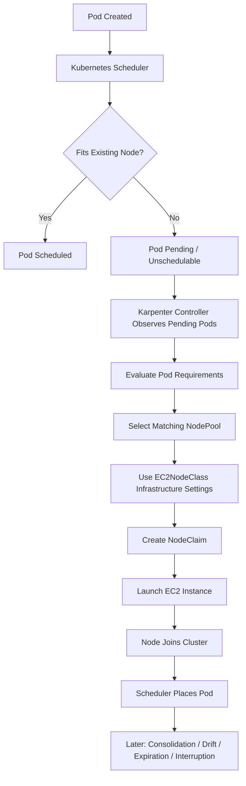
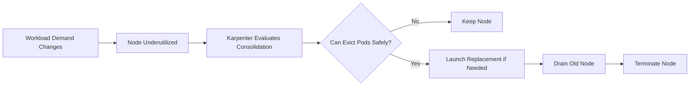
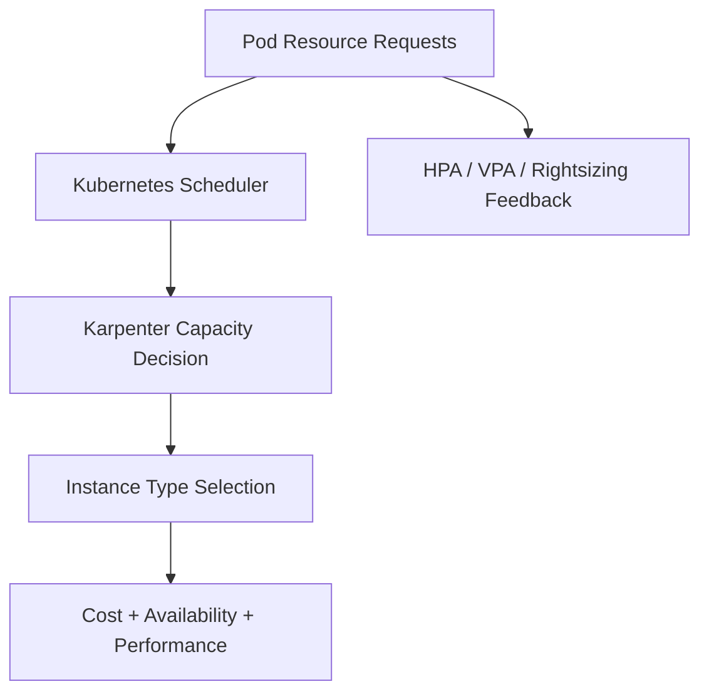
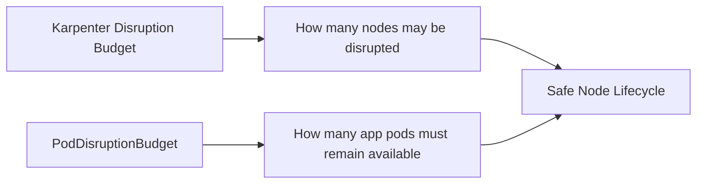
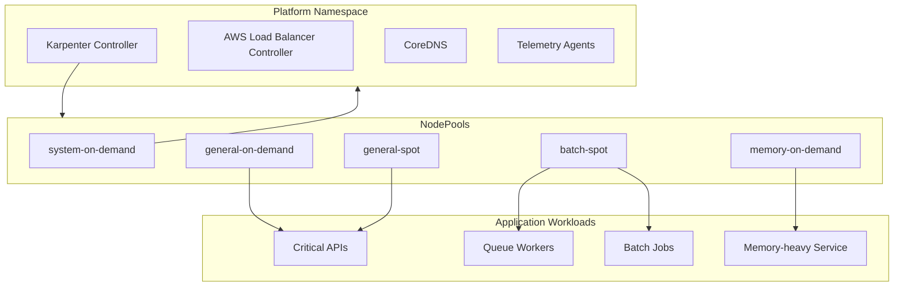

# Part 037 — Karpenter for Production Clusters

Di Part 036, kita membahas **EKS Auto Mode**: data plane yang semakin banyak dikelola AWS.

Sekarang kita masuk ke **Karpenter**.

Karpenter penting karena ia mengubah cara kita berpikir tentang node. Di banyak cluster Kubernetes tradisional, node group dibuat dulu, lalu workload dipaksa muat ke kapasitas yang sudah ada. Karpenter membalik urutan itu:

> workload mendefinisikan kebutuhan scheduling; node dibuat untuk memenuhi kebutuhan itu.

Ini perbedaan besar.

Pada platform yang matang, node bukan lagi “server kecil yang dirawat”. Node adalah **ephemeral capacity product** yang muncul, dipakai, dikonsolidasikan, diganti, lalu hilang.

Karpenter membantu mencapai model itu. Tetapi ia juga bisa mempercepat kesalahan desain. Jika pod requests salah, topology constraints salah, PDB salah, dan NodePool terlalu bebas, Karpenter akan tetap bekerja — hanya saja ia akan mengotomatisasi keputusan yang buruk.

---

## 1. Mental Model: Karpenter Is Scheduling-Driven Capacity Provisioning

Karpenter tidak menggantikan Kubernetes scheduler.

Scheduler tetap menentukan apakah pod dapat ditempatkan ke node yang ada. Karpenter mengamati pod yang tidak bisa dijadwalkan, memahami constraint-nya, lalu membuat node yang cocok.



Karpenter bekerja paling baik ketika kamu memperlakukannya sebagai **capacity compiler**:

- input-nya adalah pending pod + constraints,
- policy-nya adalah NodePool + EC2NodeClass,
- output-nya adalah node yang cukup cocok,
- lifecycle-nya mencakup launch, replace, consolidate, expire, dan interrupt handling.

---

## 2. Apa Yang Karpenter Selesaikan

Karpenter menyelesaikan beberapa masalah klasik Cluster Autoscaler dan node group statis.

### 2.1 Node Group Tidak Perlu Didefinisikan Terlalu Banyak

Tanpa Karpenter, tim sering membuat banyak node group:

- `general-purpose-on-demand`,
- `general-purpose-spot`,
- `memory-optimized`,
- `compute-optimized`,
- `gpu`,
- `arm64`,
- `batch`,
- `stateful`,
- `system`.

Semakin banyak node group, semakin banyak lifecycle yang harus dijaga:

- AMI update,
- instance type rotation,
- scaling policy,
- subnet capacity,
- Spot allocation,
- taints,
- labels,
- upgrade drain,
- capacity fragmentation.

Karpenter memungkinkan desain yang lebih intent-based:

> “workload ini butuh architecture `arm64`, capacity type `spot`, minimal 4 vCPU, memory cukup, dan tidak boleh di node yang sama dengan replica lain.”

Daripada:

> “tolong scale node group X dari 2 ke 6.”

### 2.2 Capacity Lebih Cepat Mengikuti Demand

Karpenter membuat node berdasarkan kebutuhan pod pending. Ia tidak hanya menambah node dari node group fixed size. Ia bisa memilih instance type yang cocok dari banyak opsi.

Ini mengurangi tiga masalah:

- pending pod lama karena node group salah ukuran,
- overprovisioning karena node group selalu standby,
- resource fragmentation karena node shape tidak cocok dengan pod shape.

### 2.3 Consolidation Menjadi Bagian Lifecycle

Provisioning saja tidak cukup. Cluster juga harus bisa mengecil dengan aman.

Karpenter dapat melakukan consolidation untuk menghapus atau mengganti node yang kurang efisien, selama tidak melanggar policy seperti PDB dan disruption budget.



---

## 3. Karpenter Objects: NodePool, EC2NodeClass, NodeClaim

Untuk membaca Karpenter secara production-grade, kuasai tiga object ini.

### 3.1 NodePool

`NodePool` adalah policy untuk capacity yang boleh dibuat.

Ia menjawab:

- workload apa yang boleh memakai pool ini,
- instance seperti apa yang boleh dibuat,
- label dan taint apa yang akan diberi ke node,
- capacity type apa yang boleh dipakai,
- batas total resource pool,
- bagaimana node boleh didisrupsi,
- kapan node dianggap expired,
- bagaimana consolidation dilakukan.

NodePool adalah **scheduling policy boundary**.

Contoh sederhana:

```yaml
apiVersion: karpenter.sh/v1
kind: NodePool
metadata:
  name: general-spot
spec:
  disruption:
    consolidationPolicy: WhenEmptyOrUnderutilized
    consolidateAfter: 5m
    budgets:
      - nodes: "10%"
  limits:
    cpu: "1000"
    memory: 2000Gi
  template:
    metadata:
      labels:
        workload-tier: general
    spec:
      expireAfter: 720h
      nodeClassRef:
        group: karpenter.k8s.aws
        kind: EC2NodeClass
        name: default
      requirements:
        - key: kubernetes.io/arch
          operator: In
          values: ["amd64", "arm64"]
        - key: karpenter.sh/capacity-type
          operator: In
          values: ["spot"]
        - key: karpenter.k8s.aws/instance-category
          operator: In
          values: ["c", "m", "r"]
        - key: karpenter.k8s.aws/instance-generation
          operator: Gt
          values: ["5"]
```

Poin penting:

- NodePool yang terlalu bebas dapat membuat variasi node yang sulit diprediksi.
- NodePool yang terlalu sempit membuat pending pod dan Spot unavailability lebih sering.
- NodePool harus merepresentasikan **kelas capacity**, bukan setiap aplikasi.

### 3.2 EC2NodeClass

`EC2NodeClass` adalah infrastruktur AWS yang akan dipakai NodePool.

Ia menjawab:

- subnet mana yang boleh dipakai,
- security group mana yang dipakai,
- AMI family apa,
- IAM role node,
- block device mapping,
- tags,
- metadata options,
- user data tambahan,
- instance profile/role behavior.

Contoh:

```yaml
apiVersion: karpenter.k8s.aws/v1
kind: EC2NodeClass
metadata:
  name: default
spec:
  amiFamily: Bottlerocket
  role: KarpenterNodeRole-prod
  subnetSelectorTerms:
    - tags:
        kubernetes.io/cluster/prod: owned
        karpenter.sh/discovery: prod
  securityGroupSelectorTerms:
    - tags:
        karpenter.sh/discovery: prod
  metadataOptions:
    httpEndpoint: enabled
    httpTokens: required
    httpPutResponseHopLimit: 2
  blockDeviceMappings:
    - deviceName: /dev/xvda
      ebs:
        volumeSize: 80Gi
        volumeType: gp3
        encrypted: true
  tags:
    platform: eks
    owner: platform-team
    environment: prod
```

EC2NodeClass adalah **AWS infrastructure boundary**.

Jika NodePool adalah “capacity intent”, EC2NodeClass adalah “how to launch capacity in AWS”.

### 3.3 NodeClaim

`NodeClaim` adalah realisasi konkret dari sebuah node yang akan atau sudah dibuat.

Ia menjawab:

- instance apa yang dipilih,
- zone mana,
- capacity type apa,
- lifecycle status,
- kenapa node dibuat,
- apakah node ready,
- apakah node sedang didisrupsi.

Dalam incident, NodeClaim sering lebih berguna daripada hanya melihat Node.

```bash
kubectl get nodeclaims
kubectl describe nodeclaim <name>
```

NodeClaim membantu menjawab:

- Karpenter mencoba membuat node apa?
- Instance type mana yang dipilih?
- Apakah launch gagal karena IAM, subnet, quota, capacity, atau constraints?
- Apakah node gagal join cluster?
- Apakah node sedang drift/consolidation?

---

## 4. Karpenter vs Cluster Autoscaler

Cluster Autoscaler berpikir dalam node group.

Karpenter berpikir dalam pod scheduling requirements.

| Dimensi | Cluster Autoscaler | Karpenter |
|---|---|---|
| Unit scaling | Node group | Node matching pod demand |
| Capacity shape | Predefined ASG/node group | Chosen dynamically from allowed instance types |
| Provisioning trigger | Unschedulable pods | Unschedulable pods |
| Flexibility | Terbatas pada node group | Lebih fleksibel melalui NodePool requirements |
| Consolidation | Bergantung pada CA behavior dan node group | First-class disruption/consolidation flow |
| Spot diversification | Perlu desain ASG/mixed instances | Natural melalui instance type requirements |
| Operational complexity | Banyak node group | Lebih banyak policy intent |

Karpenter bukan selalu “lebih sederhana”. Ia memindahkan kompleksitas dari node group management ke **scheduling policy design**.

Untuk platform kecil, managed node group mungkin cukup. Untuk platform yang banyak workload shape, bursty workload, Spot usage, dan cost pressure, Karpenter memberi kontrol yang lebih kaya.

---

## 5. Production NodePool Design

Kesalahan umum adalah membuat satu NodePool super besar:

```txt
all workloads -> one universal NodePool -> all instance families -> all zones -> all capacity types
```

Ini terlihat fleksibel, tetapi buruk untuk governance.

Lebih baik desain NodePool sebagai **capacity class**.

### 5.1 Baseline NodePools

Contoh baseline production:

| NodePool | Tujuan | Capacity Type | Catatan |
|---|---|---|---|
| `system-on-demand` | critical system add-ons | on-demand | CoreDNS, controllers, telemetry baseline |
| `general-on-demand` | service penting | on-demand | API dan workload latency-sensitive |
| `general-spot` | stateless resilient workload | spot | harus punya PDB/retry/idempotency |
| `batch-spot` | batch/worker tolerant disruption | spot | cocok untuk queue worker dan retryable job |
| `memory-on-demand` | memory-heavy service | on-demand | r-family atau x-family terkontrol |
| `gpu-on-demand` | ML/GPU workload | on-demand/spot terbatas | taint wajib, quota ketat |

Prinsipnya:

> NodePool bukan nama team. NodePool adalah kontrak capacity.

Team memakai pool melalui label, taint/toleration, node affinity, atau workload class yang disediakan platform.

### 5.2 System Pool Harus Konservatif

Jangan jalankan control add-ons penting di Spot-only pool.

Workload seperti:

- CoreDNS,
- metrics server,
- CNI daemonset,
- load balancer controller,
- Karpenter controller,
- external secrets,
- admission controller,
- logging agent,
- policy controller,

lebih aman berada di on-demand baseline.

Jika system add-on terganggu, cluster bisa kehilangan kemampuan scheduling, DNS, admission, atau observability. Jangan menghemat biaya kecil dengan membuka risiko platform-wide incident.

### 5.3 Spot Pool Harus Diversified

Spot yang baik bukan “pakai satu instance type murah”. Spot yang baik adalah **diversified capacity market access**.

Buruk:

```yaml
requirements:
  - key: node.kubernetes.io/instance-type
    operator: In
    values: ["m6i.large"]
```

Lebih baik:

```yaml
requirements:
  - key: karpenter.k8s.aws/instance-category
    operator: In
    values: ["c", "m", "r"]
  - key: karpenter.k8s.aws/instance-generation
    operator: Gt
    values: ["5"]
  - key: karpenter.sh/capacity-type
    operator: In
    values: ["spot"]
```

Tujuannya memberi Karpenter pilihan cukup banyak untuk menemukan capacity yang tersedia.

Trade-off:

- terlalu bebas: performa bisa bervariasi,
- terlalu sempit: pending pod dan Spot interruption lebih sering,
- terlalu banyak architecture: perlu multi-arch image,
- terlalu banyak generation/family: perlu benchmark workload.

---

## 6. Request/Limit: Input Paling Penting Untuk Karpenter

Karpenter tidak tahu kebutuhan aplikasi sebenarnya. Ia hanya membaca pod spec.

Jika request terlalu kecil:

- pod padat di node,
- CPU contention naik,
- latency memburuk,
- memory OOM meningkat,
- autoscaler terlambat membaca masalah.

Jika request terlalu besar:

- node terlalu besar dibuat,
- bin packing buruk,
- biaya naik,
- scale-out terjadi tanpa kebutuhan nyata,
- consolidation sulit.



Karpenter production readiness dimulai dari rightsizing workload.

Untuk Java service:

- memory request harus mencakup heap + metaspace + direct memory + thread stack + native overhead,
- memory limit jangan terlalu dekat dengan `-Xmx`,
- CPU request harus merefleksikan steady-state dan startup burst,
- CPU limit untuk latency-sensitive service harus dipakai hati-hati karena throttling dapat memperburuk tail latency.

---

## 7. Disruption Model

Karpenter dapat mendisrupsi node karena beberapa alasan:

- node kosong,
- node underutilized,
- node drift dari spec saat ini,
- node expired,
- Spot interruption,
- manual delete,
- health/repair flow.

Disruption aman hanya jika aplikasi siap.

Aplikasi siap jika memiliki:

- replica lebih dari satu,
- readiness probe benar,
- termination graceful,
- PDB masuk akal,
- topology spread,
- retry budget,
- idempotency,
- connection draining,
- sufficient capacity headroom.

### 7.1 Disruption Budget Karpenter

NodePool dapat memiliki disruption budget untuk membatasi laju node disruption.

Contoh:

```yaml
spec:
  disruption:
    consolidationPolicy: WhenEmptyOrUnderutilized
    consolidateAfter: 10m
    budgets:
      - nodes: "10%"
      - nodes: "0"
        schedule: "0 1 * * mon-fri"
        duration: 2h
```

Makna praktis:

- biasanya Karpenter boleh mendisrupsi maksimal 10% node,
- pada window tertentu disruption diblokir,
- cocok untuk jam kritis, window reporting, atau trading/regulatory batch window.

Jangan menggunakan budget tanpa memahami konsekuensi:

- terlalu ketat: cost optimization macet,
- terlalu longgar: terlalu banyak pod pindah bersamaan,
- salah schedule: maintenance bisa berjalan saat peak traffic.

### 7.2 PDB Tetap Aplikasi-Level

Karpenter disruption budget membatasi node-level disruption.

PDB membatasi pod-level voluntary disruption.

Keduanya tidak saling menggantikan.



Jika PDB terlalu ketat, node tidak bisa dikonsolidasikan. Jika PDB terlalu longgar, aplikasi bisa kehilangan terlalu banyak replica.

---

## 8. Drift, Expiration, and Node Freshness

Node harus diganti secara berkala.

Alasannya:

- AMI update,
- security patch,
- kernel/runtime update,
- kubelet config change,
- NodePool spec change,
- EC2NodeClass change,
- instance type strategy change,
- old capacity cleanup.

`expireAfter` memberi batas usia node.

Contoh:

```yaml
spec:
  template:
    spec:
      expireAfter: 720h # 30 days
```

Mental model:

> Node yang tidak pernah diganti adalah hidden security and reliability debt.

Namun expiration harus diikat ke disruption budget dan PDB. Jika tidak, node refresh bisa menjadi outage terselubung.

---

## 9. Spot Strategy for Production

Spot dapat menurunkan biaya besar, tetapi hanya aman untuk workload yang benar.

### 9.1 Workload Yang Cocok Untuk Spot

Cocok:

- stateless web service dengan banyak replica,
- queue worker idempotent,
- batch job retryable,
- CI workload,
- analytics job yang bisa resume,
- async enrichment worker,
- cache warmers non-critical.

Tidak cocok atau perlu guardrail kuat:

- singleton scheduler,
- stateful primary database,
- quorum-sensitive system,
- critical control plane add-on,
- low-replica latency-sensitive API,
- workload tanpa graceful shutdown,
- workload dengan manual recovery.

### 9.2 Stable Floor + Spot Burst

Pattern umum:

```txt
baseline critical capacity -> on-demand
elastic overflow capacity -> spot
```

Contoh:

- `general-on-demand` untuk minimum stable replicas,
- `general-spot` untuk tambahan replicas yang fault-tolerant,
- HPA menaikkan replica saat load naik,
- scheduler dapat menempatkan overflow ke Spot pool,
- PDB memastikan tidak semua replica hilang saat disruption.

Ini lebih aman daripada all-Spot untuk service penting.

### 9.3 Toleration Pattern

NodePool Spot diberi taint:

```yaml
spec:
  template:
    spec:
      taints:
        - key: capacity-type
          value: spot
          effect: NoSchedule
```

Workload yang memang boleh jalan di Spot harus menyatakan toleration:

```yaml
spec:
  tolerations:
    - key: capacity-type
      operator: Equal
      value: spot
      effect: NoSchedule
```

Ini membuat keputusan eksplisit.

Jangan biarkan semua workload otomatis masuk Spot tanpa consent dari owner aplikasi.

---

## 10. Instance Diversification and Cost Control

Karpenter memilih instance berdasarkan constraints dan ketersediaan. Platform team harus memberi batas yang benar.

### 10.1 Batas Yang Baik

Gunakan batas berbasis kategori/generasi:

```yaml
requirements:
  - key: karpenter.k8s.aws/instance-category
    operator: In
    values: ["c", "m", "r"]
  - key: karpenter.k8s.aws/instance-generation
    operator: Gt
    values: ["5"]
  - key: kubernetes.io/arch
    operator: In
    values: ["amd64"]
```

Untuk workload yang sudah multi-arch:

```yaml
  - key: kubernetes.io/arch
    operator: In
    values: ["amd64", "arm64"]
```

### 10.2 Batas Yang Berbahaya

Terlalu sempit:

```yaml
values: ["m7i.large"]
```

Risiko:

- no capacity,
- pending pods,
- Spot interruption lebih sering,
- consolidation lebih sulit,
- quota lebih cepat menjadi bottleneck.

Terlalu luas:

```yaml
values: ["c", "m", "r", "x", "i", "d", "g", "p"]
```

Risiko:

- instance mahal tidak sengaja dipakai,
- local NVMe semantics tidak diantisipasi,
- GPU instance terpakai workload biasa,
- architecture mismatch,
- performance variance ekstrem.

### 10.3 Limits

Gunakan `spec.limits` untuk mencegah runaway scaling.

```yaml
spec:
  limits:
    cpu: "2000"
    memory: 4000Gi
```

Tanpa limit, bug HPA atau antrean poison bisa membuat cluster menambah kapasitas sangat cepat.

Limit bukan pengganti alert. Limit adalah **blast radius guardrail**.

---

## 11. Topology, Availability, and Zone Balance

Karpenter dapat membuat node di banyak AZ. Tetapi workload harus memberi constraint availability yang benar.

Gunakan `topologySpreadConstraints` untuk menyebarkan pod:

```yaml
topologySpreadConstraints:
  - maxSkew: 1
    topologyKey: topology.kubernetes.io/zone
    whenUnsatisfiable: ScheduleAnyway
    labelSelector:
      matchLabels:
        app: payment-api
```

Untuk workload sangat critical, bisa gunakan `DoNotSchedule`, tetapi hati-hati: constraint terlalu keras dapat membuat pending pod saat satu AZ capacity pressure.

Prinsip:

- service critical: prefer spread lintas AZ,
- worker idempotent: boleh lebih fleksibel,
- batch: optimalkan cost dan throughput,
- stateful: perhatikan volume zone binding,
- PDB harus cocok dengan spread.

---

## 12. Karpenter and Stateful Workloads

Karpenter bisa menjalankan node untuk stateful workload, tetapi stateful workload memiliki constraint tambahan:

- EBS volume terikat AZ,
- StatefulSet identity stabil,
- rescheduling lintas AZ tidak bebas,
- drain bisa lama,
- PDB sering ketat,
- volume attach/detach menjadi bottleneck,
- data recovery lebih mahal daripada stateless restart.

Untuk workload stateful penting, gunakan NodePool khusus:

```yaml
metadata:
  name: stateful-on-demand
spec:
  disruption:
    consolidationPolicy: WhenEmpty
    budgets:
      - nodes: "1"
  template:
    spec:
      taints:
        - key: workload-class
          value: stateful
          effect: NoSchedule
      requirements:
        - key: karpenter.sh/capacity-type
          operator: In
          values: ["on-demand"]
```

Hindari aggressive underutilized consolidation untuk stateful node kecuali sudah diuji.

---

## 13. Platform Guardrails

Production Karpenter perlu guardrails, bukan hanya installation.

### 13.1 Namespace Policy

Batasi siapa boleh memakai toleration tertentu.

Contoh:

- hanya namespace `batch-*` boleh tolerasi `capacity-type=spot`,
- hanya namespace `ml-*` boleh tolerasi `workload-class=gpu`,
- hanya platform namespace boleh pakai `system-on-demand`,
- workload tanpa requests ditolak admission.

### 13.2 Required Requests

Karpenter tidak bisa membuat keputusan bagus jika pod tidak punya requests.

Gunakan policy untuk memastikan:

- setiap container punya CPU request,
- setiap container punya memory request,
- memory limit ada untuk workload berisiko,
- CPU limit tidak dipaksakan universal untuk latency-sensitive service,
- init container juga disizing.

### 13.3 PDB Required for Critical Services

Untuk service dengan replica lebih dari satu, PDB harus ada.

Contoh:

```yaml
apiVersion: policy/v1
kind: PodDisruptionBudget
metadata:
  name: payment-api
spec:
  minAvailable: 2
  selector:
    matchLabels:
      app: payment-api
```

Tetapi jangan membuat PDB untuk 1 replica dengan `minAvailable: 1` kecuali memang ingin menolak voluntary disruption sepenuhnya. Itu bisa membuat node tidak bisa drain.

### 13.4 Tagging and Cost Attribution

EC2NodeClass tags harus konsisten:

- `environment`,
- `platform`,
- `owner`,
- `cost-center`,
- `cluster`,
- `nodepool`,
- `data-classification` jika relevan.

Cost tanpa attribution akan berubah menjadi debat, bukan engineering feedback.

---

## 14. Observability for Karpenter

Karpenter observability harus menjawab tiga pertanyaan:

1. Mengapa pod pending?
2. Mengapa node dibuat?
3. Mengapa node dihapus atau diganti?

### 14.1 Signals

Pantau:

- pending pods by reason,
- nodeclaims created/failed,
- instance launch latency,
- node join latency,
- provisioning errors,
- disruption attempts,
- consolidation actions,
- nodes by capacity type,
- nodes by instance family,
- Spot interruption events,
- unschedulable workload count,
- wasted allocatable resources,
- CPU/memory requested vs allocatable,
- pod eviction events.

### 14.2 Debug Commands

```bash
kubectl get pods -A --field-selector=status.phase=Pending
kubectl describe pod <pod> -n <namespace>

kubectl get nodepools
kubectl describe nodepool <name>

kubectl get ec2nodeclasses
kubectl describe ec2nodeclass <name>

kubectl get nodeclaims
kubectl describe nodeclaim <name>

kubectl logs -n kube-system deploy/karpenter
kubectl get events -A --sort-by=.lastTimestamp
```

### 14.3 Common Event Interpretations

| Symptom | Possible Cause |
|---|---|
| Pod pending, no node created | no matching NodePool, impossible constraints, admission issue |
| NodeClaim created, instance not launched | IAM, subnet, SG, EC2 quota, capacity unavailable |
| Instance launched, node not ready | bootstrap failure, networking, AMI issue, kubelet join failure |
| Node repeatedly replaced | drift, bad NodeClass, health issue, DaemonSet failure |
| Consolidation never happens | PDB too strict, do-not-disrupt pods, utilization still high |
| Costs spike suddenly | HPA runaway, queue backlog, NodePool too broad, missing limits |

---

## 15. Failure Modes

### 15.1 Pending Pod Because Constraints Are Impossible

Example:

- pod requires `arm64`,
- image only supports `amd64`,
- NodePool allows only `amd64`,
- pod also requires a zone where subnet has no IP.

Runbook:

1. `kubectl describe pod`.
2. Read scheduler events.
3. Check nodeSelector, nodeAffinity, tolerations, topology spread, PVC zone.
4. Check matching NodePool requirements.
5. Check subnet IP availability.
6. Relax constraint or create explicit pool.

### 15.2 Node Cannot Launch

Causes:

- EC2 quota exhausted,
- instance type unavailable,
- IAM permission missing,
- subnet selector wrong,
- security group selector wrong,
- KMS/EBS encryption permission issue,
- AMI family misconfigured,
- unsupported architecture.

Runbook:

1. Describe NodeClaim.
2. Read Karpenter controller logs.
3. Check AWS EC2 service quotas.
4. Check subnet tags and free IPs.
5. Check EC2NodeClass selectors.
6. Check IAM role and instance profile.

### 15.3 Consolidation Causes Latency Spike

Causes:

- PDB too loose,
- too many replicas evicted over short time,
- readiness probe lies,
- shutdown not graceful,
- load balancer still sending traffic to terminating pod,
- JVM warm-up/cold start after replacement,
- cache warmup absent.

Runbook:

1. Check Karpenter disruption events.
2. Check pod termination timeline.
3. Check application latency and readiness transitions.
4. Tighten disruption budget.
5. Improve PDB and topology spread.
6. Add warm-up/readiness gating.

### 15.4 Spot Interruption Storm

Causes:

- narrow instance type set,
- all replicas on Spot,
- no on-demand floor,
- no topology spread,
- no queue retry/idempotency,
- PDB not aligned.

Runbook:

1. Check interruption events.
2. Check NodePool instance diversity.
3. Move critical replicas to on-demand.
4. Increase allowed instance families/generations.
5. Add stable floor pattern.
6. Validate graceful shutdown within interruption window.

### 15.5 Cost Runaway

Causes:

- HPA misconfigured,
- queue poison message generating infinite backlog,
- missing NodePool limits,
- too-large requests,
- topology constraints forcing one node per replica,
- broad NodePool allowing expensive instances.

Runbook:

1. Check new NodeClaims over time.
2. Group nodes by instance type/capacity type.
3. Compare requested vs used resources.
4. Check HPA/KEDA scaling reason.
5. Check queue depth and DLQ.
6. Apply temporary scale cap.
7. Add NodePool limits and alert.

---

## 16. Production Reference Design



Design notes:

- system components use on-demand,
- critical apps get on-demand baseline,
- burstable/stateless replicas can use Spot,
- batch/worker workloads use Spot with idempotency,
- memory-heavy workload has explicit pool,
- all app workloads must declare requests,
- all critical services must have PDB and topology spread,
- NodePool limits prevent runaway.

---

## 17. YAML: Production-ish NodePools

### 17.1 System On-Demand

```yaml
apiVersion: karpenter.sh/v1
kind: NodePool
metadata:
  name: system-on-demand
spec:
  disruption:
    consolidationPolicy: WhenEmpty
    budgets:
      - nodes: "1"
  limits:
    cpu: "200"
  template:
    metadata:
      labels:
        nodepool: system-on-demand
        workload-class: system
    spec:
      expireAfter: 720h
      taints:
        - key: CriticalAddonsOnly
          value: "true"
          effect: NoSchedule
      nodeClassRef:
        group: karpenter.k8s.aws
        kind: EC2NodeClass
        name: default
      requirements:
        - key: karpenter.sh/capacity-type
          operator: In
          values: ["on-demand"]
        - key: kubernetes.io/arch
          operator: In
          values: ["amd64"]
        - key: karpenter.k8s.aws/instance-category
          operator: In
          values: ["m", "c"]
```

### 17.2 General Spot

```yaml
apiVersion: karpenter.sh/v1
kind: NodePool
metadata:
  name: general-spot
spec:
  disruption:
    consolidationPolicy: WhenEmptyOrUnderutilized
    consolidateAfter: 10m
    budgets:
      - nodes: "10%"
  limits:
    cpu: "2000"
    memory: 4000Gi
  template:
    metadata:
      labels:
        nodepool: general-spot
        workload-class: stateless
    spec:
      expireAfter: 720h
      taints:
        - key: capacity-type
          value: spot
          effect: NoSchedule
      nodeClassRef:
        group: karpenter.k8s.aws
        kind: EC2NodeClass
        name: default
      requirements:
        - key: karpenter.sh/capacity-type
          operator: In
          values: ["spot"]
        - key: karpenter.k8s.aws/instance-category
          operator: In
          values: ["c", "m", "r"]
        - key: karpenter.k8s.aws/instance-generation
          operator: Gt
          values: ["5"]
        - key: kubernetes.io/arch
          operator: In
          values: ["amd64", "arm64"]
```

### 17.3 Batch Spot

```yaml
apiVersion: karpenter.sh/v1
kind: NodePool
metadata:
  name: batch-spot
spec:
  disruption:
    consolidationPolicy: WhenEmptyOrUnderutilized
    consolidateAfter: 2m
    budgets:
      - nodes: "25%"
  limits:
    cpu: "4000"
  template:
    metadata:
      labels:
        nodepool: batch-spot
        workload-class: batch
    spec:
      taints:
        - key: workload-class
          value: batch
          effect: NoSchedule
      nodeClassRef:
        group: karpenter.k8s.aws
        kind: EC2NodeClass
        name: default
      requirements:
        - key: karpenter.sh/capacity-type
          operator: In
          values: ["spot"]
        - key: karpenter.k8s.aws/instance-category
          operator: In
          values: ["c", "m", "r"]
        - key: karpenter.k8s.aws/instance-generation
          operator: Gt
          values: ["5"]
```

---

## 18. Application Manifest That Cooperates With Karpenter

```yaml
apiVersion: apps/v1
kind: Deployment
metadata:
  name: payment-api
spec:
  replicas: 6
  strategy:
    type: RollingUpdate
    rollingUpdate:
      maxUnavailable: 1
      maxSurge: 2
  selector:
    matchLabels:
      app: payment-api
  template:
    metadata:
      labels:
        app: payment-api
    spec:
      terminationGracePeriodSeconds: 45
      containers:
        - name: app
          image: 111122223333.dkr.ecr.ap-southeast-1.amazonaws.com/payment-api@sha256:...
          ports:
            - containerPort: 8080
          resources:
            requests:
              cpu: "500m"
              memory: "768Mi"
            limits:
              memory: "1Gi"
          readinessProbe:
            httpGet:
              path: /ready
              port: 8080
            periodSeconds: 5
            failureThreshold: 2
          livenessProbe:
            httpGet:
              path: /live
              port: 8080
            periodSeconds: 10
            failureThreshold: 3
      topologySpreadConstraints:
        - maxSkew: 1
          topologyKey: topology.kubernetes.io/zone
          whenUnsatisfiable: ScheduleAnyway
          labelSelector:
            matchLabels:
              app: payment-api
```

PDB:

```yaml
apiVersion: policy/v1
kind: PodDisruptionBudget
metadata:
  name: payment-api
spec:
  minAvailable: 4
  selector:
    matchLabels:
      app: payment-api
```

Kenapa manifest ini lebih sehat:

- request cukup untuk scheduling,
- memory limit mencegah runaway memory,
- CPU limit tidak dipaksakan,
- readiness terpisah dari liveness,
- termination grace ada,
- rolling update tidak menghapus terlalu banyak replica,
- topology spread membantu AZ balance,
- PDB melindungi voluntary disruption.

---

## 19. Decision Framework: When To Use Karpenter

Gunakan Karpenter jika:

- workload shape beragam,
- ingin Spot diversification yang baik,
- node group statis terlalu banyak,
- scale-out harus cepat dan flexible,
- cost optimization penting,
- platform team siap mengelola scheduling policy,
- observability dan guardrail sudah ada.

Pertimbangkan managed node group biasa jika:

- cluster kecil,
- workload homogen,
- tim belum siap policy governance,
- compliance butuh node shape sangat stabil,
- disruption tolerance rendah,
- operasi lebih nyaman dengan fixed capacity pool.

Pertimbangkan EKS Auto Mode jika:

- ingin AWS-managed data plane lebih luas,
- ingin mengurangi ownership node machinery,
- workload cocok dengan batasan Auto Mode,
- organisasi lebih memilih paved road daripada custom autoscaler control.

---

## 20. Production Checklist

Sebelum Karpenter dipakai production, pastikan:

- [ ] Karpenter controller berjalan di stable on-demand capacity.
- [ ] NodePool dipisahkan berdasarkan capacity class.
- [ ] System add-ons tidak bergantung pada Spot-only pool.
- [ ] EC2NodeClass subnet/security group selector benar.
- [ ] Node IAM role minimum privilege dan ter-audit.
- [ ] Metadata options memakai IMDSv2 required.
- [ ] Semua workload punya CPU/memory requests.
- [ ] Critical workload punya PDB.
- [ ] Critical workload punya topology spread atau anti-affinity.
- [ ] Workload Spot memiliki graceful shutdown dan idempotency.
- [ ] NodePool punya limits.
- [ ] Disruption budget dikonfigurasi.
- [ ] Expiration/drift strategy ada.
- [ ] Spot diversification cukup luas.
- [ ] Observability untuk pending pod, NodeClaim, disruption, dan cost tersedia.
- [ ] Runbook untuk capacity failure, launch failure, consolidation incident, dan cost runaway tersedia.

---

## 21. Key Takeaways

Karpenter bukan sekadar autoscaler.

Ia adalah cara untuk menyatakan:

> “cluster capacity should be generated from workload scheduling intent.”

Top 1% engineer tidak hanya tahu cara install Karpenter. Mereka tahu invariants-nya:

- requests adalah input capacity,
- NodePool adalah policy capacity,
- EC2NodeClass adalah AWS infrastructure boundary,
- NodeClaim adalah realisasi node,
- consolidation adalah operasi disruption,
- Spot butuh diversification,
- PDB dan disruption budget harus sinkron,
- node yang disposable tetap butuh governance.

Jika workload spec buruk, Karpenter mempercepat kerusakan.

Jika workload spec benar, Karpenter mengubah EKS menjadi platform yang jauh lebih elastis, ekonomis, dan operasional.

---

## 22. What Comes Next

Part berikutnya membahas **Pod Scheduling and Availability**.

Karpenter hanya bisa membuat node yang cocok. Availability tetap dibangun dari pod-level design:

- requests/limits,
- probes,
- PDB,
- topology spread,
- affinity,
- taints/tolerations,
- graceful termination,
- rollout strategy,
- priority/preemption.

Tanpa itu, autoscaler terbaik pun tetap akan menghasilkan sistem yang rapuh.
