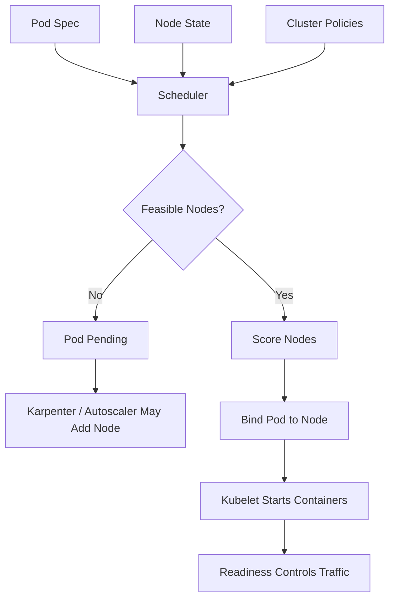
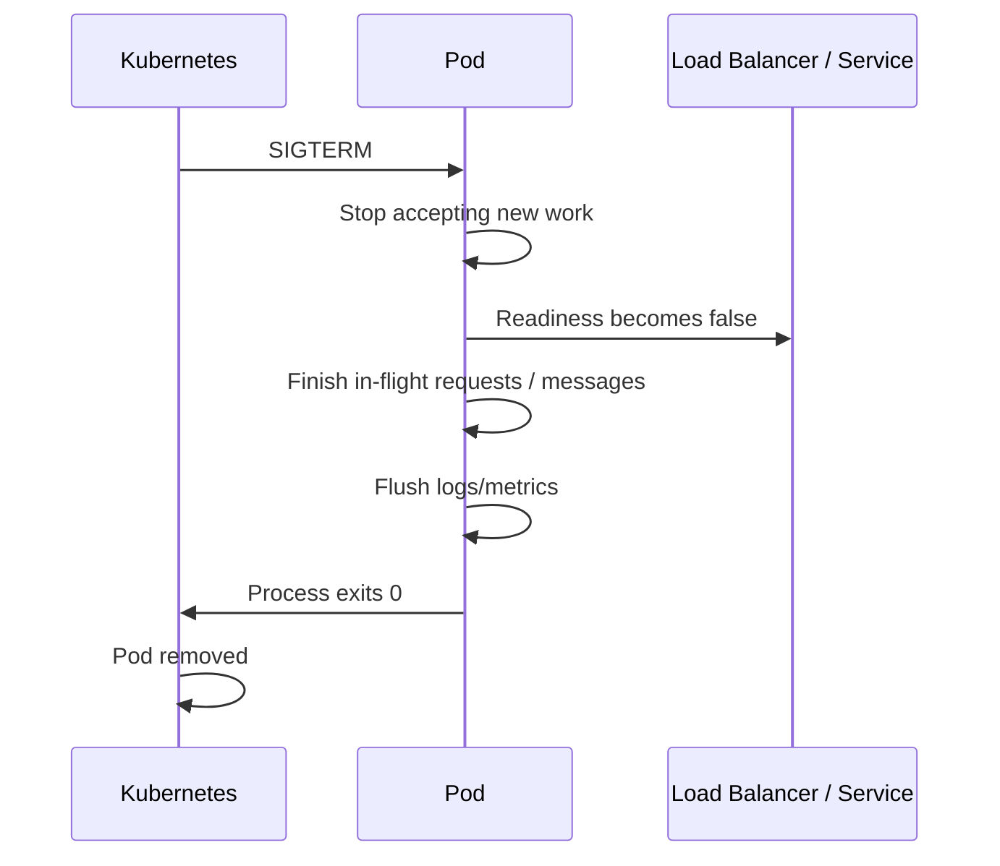
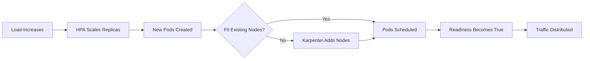

# Part 038 — Pod Scheduling and Availability

Di Part 037, kita membahas Karpenter: bagaimana EKS dapat membuat capacity berdasarkan pod yang tidak bisa dijadwalkan.

Sekarang kita turun ke level yang lebih fundamental:

> Apa yang membuat pod bisa dijadwalkan dengan benar dan tetap available saat cluster berubah?

Kubernetes scheduler bukan pembaca pikiran. Ia tidak tahu aplikasi kamu penting, berat, lambat warm-up, butuh AZ spread, sensitif CPU throttling, atau tidak boleh kehilangan dua replica bersamaan.

Ia hanya membaca spec.

Spec yang buruk akan menghasilkan availability yang buruk.

Part ini membahas desain pod sebagai **availability contract**.

---

## 1. Mental Model: Scheduling Is Constraint Solving

Scheduler memilih node untuk pod berdasarkan supply dan demand.

Demand berasal dari pod:

- CPU request,
- memory request,
- ephemeral storage request,
- node selector,
- node affinity,
- pod affinity/anti-affinity,
- topology spread,
- taints/tolerations,
- volume constraints,
- priority,
- runtime class,
- extended resources seperti GPU.

Supply berasal dari node:

- allocatable CPU,
- allocatable memory,
- labels,
- taints,
- zone,
- architecture,
- capacity type,
- attached volume limits,
- network/IP capacity,
- available local resources.



Important distinction:

- scheduling determines **where pod may run**,
- readiness determines **whether pod should receive traffic**,
- PDB determines **how many pods may be voluntarily disrupted**,
- rollout strategy determines **how replacement happens**,
- autoscaler determines **when more pods/nodes exist**.

Availability muncul dari semua mekanisme ini sekaligus.

---

## 2. The Availability Contract of a Pod

Pod production-grade harus menjawab pertanyaan berikut:

1. Berapa resource minimum yang dibutuhkan agar tidak merusak node?
2. Berapa resource maksimum yang aman sebelum aplikasi dianggap runaway?
3. Kapan container dianggap hidup?
4. Kapan container siap menerima traffic?
5. Berapa lama aplikasi butuh untuk shutdown bersih?
6. Apakah pod boleh dipindahkan saat node consolidation?
7. Apakah replica harus tersebar lintas AZ/node?
8. Apakah pod boleh jalan di Spot?
9. Apakah pod boleh jalan di ARM64?
10. Berapa banyak replica yang boleh hilang saat voluntary disruption?

Jika jawaban-jawaban ini tidak ada di manifest, Kubernetes akan memakai default. Default jarang cukup untuk production.

---

## 3. Resource Requests and Limits

### 3.1 Requests Are Scheduling Input

`requests` memberi tahu scheduler berapa resource yang harus tersedia di node.

```yaml
resources:
  requests:
    cpu: "500m"
    memory: "768Mi"
```

Request bukan limit. Request adalah reservasi scheduling.

Jika request terlalu kecil:

- pod terlalu padat,
- CPU contention meningkat,
- memory pressure meningkat,
- tail latency memburuk,
- node terlihat cukup di scheduler tetapi tidak cukup saat runtime.

Jika request terlalu besar:

- banyak node dibuat,
- bin packing buruk,
- biaya naik,
- Karpenter/Cluster Autoscaler scale-out terlalu agresif,
- pending pod lebih sering karena node shape tidak cocok.

### 3.2 Limits Are Runtime Enforcement

`limits` membatasi pemakaian resource runtime.

```yaml
resources:
  limits:
    memory: "1Gi"
```

Memory limit penting karena container yang melewati limit dapat dihentikan dengan OOMKill.

CPU limit lebih tricky. CPU limit dapat menyebabkan throttling. Untuk service latency-sensitive, CPU throttling dapat menaikkan tail latency bahkan saat node masih punya CPU idle.

Praktik umum:

- memory request dan memory limit ditentukan dengan hati-hati,
- CPU request selalu ada,
- CPU limit dipakai selektif,
- batch job bisa memakai CPU limit lebih agresif,
- API latency-sensitive sering lebih aman tanpa CPU limit, tetapi dengan namespace quota dan HPA yang benar.

### 3.3 Java Container Sizing

Untuk Java, memory limit harus mencakup:

- heap,
- metaspace,
- direct buffer,
- thread stack,
- JIT/code cache,
- GC native overhead,
- JNI/native libraries,
- logging buffer,
- sidecar overhead jika relevan.

Buruk:

```txt
container limit = 1024Mi
-Xmx = 1024m
```

Ini hampir pasti tidak memberi ruang native overhead.

Lebih aman:

```txt
container limit = 1024Mi
MaxRAMPercentage = 65-75%
```

Atau sizing eksplisit:

```txt
-Xmx700m dengan container memory limit 1024Mi
```

### 3.4 QoS Classes

Kubernetes memberi QoS class berdasarkan request/limit:

| QoS | Kondisi | Implikasi |
|---|---|---|
| Guaranteed | request = limit untuk CPU dan memory pada semua container | paling terlindung saat eviction |
| Burstable | request ada tetapi tidak sama dengan limit | umum untuk aplikasi production |
| BestEffort | tidak ada request/limit | paling mudah dievict, buruk untuk production |

Jangan jalankan workload production penting sebagai BestEffort.

---

## 4. Probes: Liveness, Readiness, Startup

Probes adalah kontrak kesehatan.

Tetapi banyak outage terjadi karena probes salah.

### 4.1 Readiness Probe

Readiness menjawab:

> Apakah pod siap menerima traffic sekarang?

Readiness harus gagal jika aplikasi tidak mampu melayani request dengan benar.

Contoh alasan readiness gagal:

- belum selesai startup,
- dependency wajib belum tersedia,
- migration lock belum selesai,
- config belum termuat,
- service sedang draining,
- internal queue saturated,
- circuit breaker dependency utama open jika service tidak bisa degrade.

Contoh:

```yaml
readinessProbe:
  httpGet:
    path: /ready
    port: 8080
  periodSeconds: 5
  timeoutSeconds: 2
  failureThreshold: 2
```

Readiness bukan liveness.

Jangan membuat readiness hanya `return 200` tanpa mengecek kesiapan real.

### 4.2 Liveness Probe

Liveness menjawab:

> Apakah container perlu direstart karena stuck dan tidak bisa pulih sendiri?

Liveness harus konservatif. Jika terlalu agresif, ia mengubah transient slowness menjadi restart loop.

Buruk:

```yaml
livenessProbe:
  httpGet:
    path: /health
    port: 8080
  timeoutSeconds: 1
  failureThreshold: 1
```

Jika GC pause, CPU throttling, atau dependency latency naik, pod bisa terbunuh padahal bisa pulih.

Lebih aman:

```yaml
livenessProbe:
  httpGet:
    path: /live
    port: 8080
  periodSeconds: 10
  timeoutSeconds: 3
  failureThreshold: 5
```

### 4.3 Startup Probe

Startup probe melindungi aplikasi yang start lambat.

Selama startup probe belum sukses, liveness/readiness behavior tidak menghukum startup lambat dengan restart premature.

```yaml
startupProbe:
  httpGet:
    path: /startup
    port: 8080
  periodSeconds: 5
  failureThreshold: 24 # up to 120s
```

Untuk Java service, startup probe sering penting karena:

- class loading,
- dependency initialization,
- JIT warm-up,
- Spring context bootstrap,
- connection pool initialization,
- schema validation,
- config fetch.

---

## 5. Graceful Termination

Kubernetes tidak menghentikan pod secara magis. Ia mengirim termination signal, menunggu grace period, lalu membunuh container jika belum selesai.



### 5.1 terminationGracePeriodSeconds

```yaml
spec:
  terminationGracePeriodSeconds: 45
```

Grace period harus sesuai dengan:

- maximum request duration,
- worker message processing time,
- database transaction timeout,
- load balancer deregistration delay,
- flush telemetry time,
- shutdown hooks.

### 5.2 preStop Hook

`preStop` bisa membantu memberi waktu draining, tetapi jangan bergantung pada sleep sebagai solusi utama.

```yaml
lifecycle:
  preStop:
    exec:
      command: ["/bin/sh", "-c", "sleep 10"]
```

Sleep bisa berguna untuk load balancer propagation, tetapi aplikasi tetap harus menangani SIGTERM dengan benar.

### 5.3 Worker Shutdown

Queue worker harus:

- berhenti mengambil message baru,
- menyelesaikan message yang sedang diproses,
- extend visibility timeout jika perlu,
- tidak ack sebelum side effect durable,
- membiarkan message kembali jika shutdown tidak selesai,
- menulis checkpoint jika batch/stream.

---

## 6. PodDisruptionBudget

PDB membatasi voluntary disruption.

Contoh voluntary disruption:

- node drain,
- node upgrade,
- Karpenter consolidation,
- cluster autoscaler scale-in,
- maintenance operation.

PDB tidak melindungi dari semua hal. Ia tidak mencegah involuntary disruption seperti hardware failure, kernel panic, node lost, atau container crash.

### 6.1 minAvailable

```yaml
apiVersion: policy/v1
kind: PodDisruptionBudget
metadata:
  name: payment-api
spec:
  minAvailable: 4
  selector:
    matchLabels:
      app: payment-api
```

Jika ada 6 replica, voluntary disruption hanya boleh berjalan selama minimal 4 tetap available.

### 6.2 maxUnavailable

```yaml
apiVersion: policy/v1
kind: PodDisruptionBudget
metadata:
  name: payment-api
spec:
  maxUnavailable: 1
  selector:
    matchLabels:
      app: payment-api
```

Ini sering lebih mudah dibaca untuk deployment dengan replica tetap.

### 6.3 One Replica Trap

Untuk deployment 1 replica:

```yaml
minAvailable: 1
```

berarti voluntary disruption tidak boleh menghapus pod tersebut.

Konsekuensi:

- node drain bisa macet,
- Karpenter consolidation bisa tertahan,
- upgrade node bisa tertunda,
- platform team melihat node “tidak bisa dibersihkan”.

Jika aplikasi memang singleton, kamu harus sadar bahwa availability-nya memang terbatas. PDB tidak membuat singleton menjadi highly available.

### 6.4 PDB and RollingUpdate

PDB harus cocok dengan deployment strategy.

```yaml
strategy:
  type: RollingUpdate
  rollingUpdate:
    maxUnavailable: 1
    maxSurge: 2
```

Jika PDB terlalu ketat dan maxUnavailable terlalu kecil, rollout bisa lambat atau macet.

Jika PDB terlalu longgar, rollout dan node drain bisa menghapus terlalu banyak capacity.

---

## 7. Topology Spread Constraints

Topology spread membantu menyebarkan pod lintas failure domain.

Failure domain umum:

- node,
- availability zone,
- capacity type,
- instance family,
- rack/domain internal jika on-prem/hybrid.

Contoh lintas AZ:

```yaml
topologySpreadConstraints:
  - maxSkew: 1
    topologyKey: topology.kubernetes.io/zone
    whenUnsatisfiable: ScheduleAnyway
    labelSelector:
      matchLabels:
        app: payment-api
```

### 7.1 ScheduleAnyway vs DoNotSchedule

`ScheduleAnyway`:

- scheduler mencoba spread,
- tetapi tetap boleh schedule jika constraint tidak ideal,
- cocok untuk availability preference yang tidak boleh menghambat recovery.

`DoNotSchedule`:

- scheduler menolak placement yang melanggar spread,
- cocok untuk hard isolation,
- bisa menyebabkan pending pod saat capacity tidak tersedia di zone tertentu.

Gunakan `DoNotSchedule` hanya jika kamu siap menerima pod pending demi menjaga spread strict.

### 7.2 Spread by Hostname

Untuk menghindari semua replica di node yang sama:

```yaml
topologySpreadConstraints:
  - maxSkew: 1
    topologyKey: kubernetes.io/hostname
    whenUnsatisfiable: ScheduleAnyway
    labelSelector:
      matchLabels:
        app: payment-api
```

Pada cluster kecil, hostname spread strict bisa menyebabkan pending pod. Pastikan kapasitas cukup.

---

## 8. Affinity and Anti-Affinity

Affinity memberi preferensi atau aturan scheduling.

### 8.1 Node Affinity

Node affinity memilih node berdasarkan label.

```yaml
affinity:
  nodeAffinity:
    requiredDuringSchedulingIgnoredDuringExecution:
      nodeSelectorTerms:
        - matchExpressions:
            - key: kubernetes.io/arch
              operator: In
              values: ["arm64"]
```

Gunakan untuk kebutuhan nyata:

- architecture,
- GPU,
- local NVMe,
- compliance isolation,
- stateful storage class,
- special kernel/runtime.

Jangan gunakan node affinity untuk preferensi kosong yang hanya menambah constraint.

### 8.2 Pod Anti-Affinity

Pod anti-affinity menyebarkan pod berdasarkan keberadaan pod lain.

```yaml
affinity:
  podAntiAffinity:
    preferredDuringSchedulingIgnoredDuringExecution:
      - weight: 100
        podAffinityTerm:
          labelSelector:
            matchLabels:
              app: payment-api
          topologyKey: kubernetes.io/hostname
```

Anti-affinity hard (`required...`) bisa mahal dan menyebabkan pending pod. Untuk banyak kasus, topology spread lebih mudah diprediksi.

### 8.3 Preferred vs Required

Rule of thumb:

- gunakan `preferred` untuk resilience preference,
- gunakan `required` untuk safety/compliance constraint,
- jangan menjadikan semua preference sebagai hard constraint.

Hard constraints yang terlalu banyak membuat autoscaler tidak fleksibel.

---

## 9. Taints and Tolerations

Taint adalah cara node mengatakan:

> pod tidak boleh masuk kecuali menyatakan toleration.

Contoh Spot pool:

```yaml
spec:
  taints:
    - key: capacity-type
      value: spot
      effect: NoSchedule
```

Workload yang boleh masuk:

```yaml
tolerations:
  - key: capacity-type
    operator: Equal
    value: spot
    effect: NoSchedule
```

Taints cocok untuk:

- system node,
- Spot node,
- GPU node,
- batch node,
- stateful node,
- tenant-isolated node,
- compliance-specific node.

Taint/toleration bukan placement penuh. Ia hanya mengizinkan. Untuk memilih node tertentu, kombinasikan dengan node affinity atau labels.

---

## 10. Priority and Preemption

PriorityClass menentukan pod mana yang lebih penting.

Contoh:

```yaml
apiVersion: scheduling.k8s.io/v1
kind: PriorityClass
metadata:
  name: platform-critical
value: 1000000
globalDefault: false
description: "Critical platform components"
```

Pod dapat memakai:

```yaml
priorityClassName: platform-critical
```

Preemption berarti pod priority tinggi dapat mengusir pod priority lebih rendah jika resource tidak cukup.

Gunakan hati-hati.

Cocok untuk:

- CoreDNS,
- ingress controller,
- telemetry baseline,
- security agents,
- platform controllers.

Berbahaya jika setiap team meminta priority tinggi. Priority inflation membuat mekanisme tidak berguna.

---

## 11. Deployment Strategy and Availability

Deployment rollout juga bagian dari availability.

```yaml
strategy:
  type: RollingUpdate
  rollingUpdate:
    maxUnavailable: 1
    maxSurge: 2
```

### 11.1 maxUnavailable

Menentukan berapa pod boleh tidak tersedia selama rollout.

Jika terlalu besar:

- capacity drop saat deployment,
- latency naik,
- PDB bisa tidak cukup melindungi.

Jika terlalu kecil:

- rollout lambat,
- node capacity harus cukup untuk surge,
- rollout bisa stuck jika readiness gagal.

### 11.2 maxSurge

Menentukan berapa pod tambahan boleh dibuat selama rollout.

Jika `maxSurge` > 0, cluster butuh kapasitas tambahan sementara. Dengan Karpenter, ini bisa membuat node baru. Tanpa capacity headroom, rollout bisa tertunda.

### 11.3 Readiness Gates

Rollout aman bergantung pada readiness benar. Jika readiness terlalu cepat hijau, traffic masuk sebelum aplikasi benar-benar siap.

Untuk Java API, readiness sebaiknya menunggu:

- server port bind,
- dependency critical siap,
- config loaded,
- migration safety checked,
- warm-up minimal selesai,
- connection pool siap.

---

## 12. HPA, Scheduling, and Node Scaling

HPA menambah pod. Scheduler menempatkan pod. Karpenter/Cluster Autoscaler menambah node jika pod tidak muat.



Availability issue sering terjadi karena timing:

- HPA bereaksi setelah load naik,
- pod startup butuh waktu,
- node provisioning butuh waktu,
- app warm-up butuh waktu,
- readiness mungkin hijau terlalu awal,
- load balancer butuh waktu melihat target sehat.

Untuk workload latency-sensitive, gunakan:

- minimum replica cukup,
- scale-out threshold konservatif,
- predictive/scheduled scaling untuk traffic known pattern,
- startup probe,
- readiness yang benar,
- capacity headroom pada peak period.

---

## 13. Stateful Availability

Stateful workloads menambah constraint:

- volume biasanya terikat AZ,
- pod identity stabil,
- rescheduling lebih lambat,
- drain harus hati-hati,
- quorum harus dijaga,
- PDB harus disesuaikan dengan replication model.

Contoh buruk:

```txt
3 replica database
semua replica di same AZ
PDB tidak ada
Karpenter consolidation agresif
```

Contoh lebih baik:

- topology spread lintas zone,
- PDB `maxUnavailable: 1`,
- anti-affinity preferred/required sesuai kebutuhan,
- node pool on-demand,
- consolidation `WhenEmpty` atau disruption sangat terbatas,
- backup dan restore diuji,
- readiness mencerminkan quorum/role.

---

## 14. Worker and Batch Availability

Worker availability berbeda dari API availability.

API availability diukur dari ability to serve request now.

Worker availability diukur dari:

- backlog growth,
- processing latency,
- retry rate,
- DLQ rate,
- duplicate side effect,
- checkpoint lag,
- visibility timeout expiration,
- job completion time.

Untuk worker:

- readiness bisa menandakan worker boleh mengambil job baru,
- liveness harus restart worker yang stuck,
- graceful shutdown harus menghentikan polling,
- PDB harus menjaga minimum worker capacity jika backlog kritis,
- Spot cocok jika job idempotent dan retryable,
- topology spread penting untuk menghindari semua worker hilang saat AZ issue.

---

## 15. Complete Production Deployment Example

```yaml
apiVersion: apps/v1
kind: Deployment
metadata:
  name: case-api
  labels:
    app: case-api
spec:
  replicas: 6
  revisionHistoryLimit: 5
  strategy:
    type: RollingUpdate
    rollingUpdate:
      maxUnavailable: 1
      maxSurge: 2
  selector:
    matchLabels:
      app: case-api
  template:
    metadata:
      labels:
        app: case-api
        workload-tier: critical-api
    spec:
      terminationGracePeriodSeconds: 60
      priorityClassName: app-critical
      containers:
        - name: app
          image: 111122223333.dkr.ecr.ap-southeast-1.amazonaws.com/case-api@sha256:...
          imagePullPolicy: IfNotPresent
          ports:
            - name: http
              containerPort: 8080
          env:
            - name: JAVA_TOOL_OPTIONS
              value: "-XX:MaxRAMPercentage=70 -XX:+ExitOnOutOfMemoryError"
          resources:
            requests:
              cpu: "750m"
              memory: "1024Mi"
            limits:
              memory: "1536Mi"
          startupProbe:
            httpGet:
              path: /startup
              port: http
            periodSeconds: 5
            failureThreshold: 24
          readinessProbe:
            httpGet:
              path: /ready
              port: http
            periodSeconds: 5
            timeoutSeconds: 2
            failureThreshold: 2
          livenessProbe:
            httpGet:
              path: /live
              port: http
            periodSeconds: 10
            timeoutSeconds: 3
            failureThreshold: 5
      topologySpreadConstraints:
        - maxSkew: 1
          topologyKey: topology.kubernetes.io/zone
          whenUnsatisfiable: ScheduleAnyway
          labelSelector:
            matchLabels:
              app: case-api
        - maxSkew: 1
          topologyKey: kubernetes.io/hostname
          whenUnsatisfiable: ScheduleAnyway
          labelSelector:
            matchLabels:
              app: case-api
```

PDB:

```yaml
apiVersion: policy/v1
kind: PodDisruptionBudget
metadata:
  name: case-api
spec:
  minAvailable: 4
  selector:
    matchLabels:
      app: case-api
```

Service:

```yaml
apiVersion: v1
kind: Service
metadata:
  name: case-api
spec:
  selector:
    app: case-api
  ports:
    - name: http
      port: 80
      targetPort: http
```

---

## 16. Failure Mode: Pod Pending

Pod pending bukan hanya “kurang node”.

Kemungkinan:

- CPU request terlalu besar,
- memory request terlalu besar,
- no matching node selector,
- taint tidak ditoleransi,
- topology spread terlalu strict,
- PVC zone conflict,
- NodePool tidak match,
- subnet IP habis,
- EC2 quota habis,
- image architecture mismatch,
- admission controller menolak pod.

Runbook:

```bash
kubectl describe pod <pod> -n <namespace>
kubectl get events -n <namespace> --sort-by=.lastTimestamp
kubectl get nodepools
kubectl describe nodepool <name>
kubectl get nodeclaims
kubectl describe nodeclaim <name>
```

Baca event scheduler. Jangan langsung menambah node group.

---

## 17. Failure Mode: Rollout Stuck

Gejala:

- new pods tidak ready,
- old pods masih ada,
- deployment tidak progress,
- HPA menambah pod tapi tetap pending,
- load balancer health check gagal.

Kemungkinan:

- readiness probe gagal,
- app crash saat startup,
- missing secret/config,
- request terlalu besar,
- PDB terlalu ketat,
- maxSurge tidak cukup,
- image pull failure,
- service account/IAM failure,
- network policy/security group blocking dependency.

Runbook:

```bash
kubectl rollout status deploy/<name> -n <namespace>
kubectl describe deploy <name> -n <namespace>
kubectl get rs -n <namespace>
kubectl describe pod <new-pod> -n <namespace>
kubectl logs <new-pod> -n <namespace>
```

Jika deployment berisiko, rollback:

```bash
kubectl rollout undo deploy/<name> -n <namespace>
```

Tetapi rollback hanya aman jika database schema, event contract, dan external side effects backward compatible.

---

## 18. Failure Mode: Node Drain Stuck

Gejala:

- node tidak bisa dihapus,
- Karpenter consolidation tidak berjalan,
- upgrade node tertahan,
- `kubectl drain` timeout.

Kemungkinan:

- PDB terlalu ketat,
- singleton pod dengan PDB `minAvailable: 1`,
- pod tanpa controller,
- daemonset unmanaged,
- finalizer stuck,
- local storage constraint,
- long termination grace,
- application tidak exit saat SIGTERM.

Runbook:

```bash
kubectl describe node <node>
kubectl get pods -A --field-selector spec.nodeName=<node>
kubectl get pdb -A
kubectl describe pdb <pdb> -n <namespace>
```

Jangan langsung `--force --delete-emptydir-data` di production tanpa memahami dampak. Itu dapat melanggar availability contract aplikasi.

---

## 19. Failure Mode: Liveness Restart Storm

Gejala:

- pod restart terus,
- latency naik,
- logs terpotong,
- CPU throttle tinggi,
- deployment rollback tidak membantu.

Kemungkinan:

- liveness timeout terlalu pendek,
- liveness mengecek dependency eksternal,
- GC pause,
- CPU starvation,
- thread pool saturation,
- deadlock real,
- slow startup tanpa startup probe.

Runbook:

1. Check `kubectl describe pod` restart reason.
2. Check previous logs: `kubectl logs <pod> --previous`.
3. Check CPU throttling and memory OOM.
4. Temporarily relax liveness if false positive confirmed.
5. Add startup probe.
6. Separate `/live` from `/ready`.

Liveness harus mendeteksi proses rusak, bukan menghukum dependency sementara lambat.

---

## 20. Failure Mode: Availability Loss During Karpenter Consolidation

Gejala:

- latency spike saat malam,
- pods pindah-pindah,
- nodes terminated,
- PDB tidak cukup melindungi,
- logs menunjukkan SIGTERM dan restart.

Kemungkinan:

- Karpenter consolidation terlalu agresif,
- PDB tidak ada,
- topology spread tidak ada,
- readiness terlalu cepat hijau,
- Java warm-up tidak diperhitungkan,
- load balancer deregistration belum selesai,
- `terminationGracePeriodSeconds` terlalu pendek.

Fix:

- tambah PDB,
- atur Karpenter disruption budget,
- naikkan `consolidateAfter`,
- gunakan `WhenEmpty` untuk workload sensitif,
- tambah warm-up/readiness gating,
- perbaiki graceful shutdown,
- spread pods lintas node/AZ.

---

## 21. Scheduling Design Review Questions

Gunakan pertanyaan ini saat review PR manifest Kubernetes.

### Resource

- Apakah setiap container punya CPU/memory request?
- Apakah memory limit memberi ruang native overhead?
- Apakah CPU limit diperlukan atau justru akan throttle?
- Apakah init container disizing?
- Apakah request terlalu besar sehingga memaksa node mahal?

### Health

- Apakah readiness benar-benar berarti siap menerima traffic?
- Apakah liveness terlalu agresif?
- Apakah startup probe diperlukan?
- Apakah dependency eksternal dimasukkan ke liveness secara keliru?

### Availability

- Berapa replica minimum untuk availability?
- Apakah PDB cocok dengan replica count?
- Apakah topology spread lintas AZ/node ada?
- Apakah rollout maxUnavailable/maxSurge cocok dengan PDB?
- Apakah graceful shutdown diuji?

### Placement

- Apakah node affinity diperlukan?
- Apakah taint/toleration eksplisit?
- Apakah workload boleh jalan di Spot?
- Apakah workload bisa jalan di ARM64?
- Apakah constraint terlalu keras sehingga pod pending?

### Autoscaling

- Apakah HPA signal sesuai bottleneck nyata?
- Apakah scale-out latency diperhitungkan?
- Apakah node capacity akan tersedia saat surge?
- Apakah NodePool limits mencegah runaway?

---

## 22. Production Checklist

Sebelum workload EKS masuk production:

- [ ] Replica count sesuai SLO.
- [ ] CPU/memory request ditentukan dari load test atau telemetry.
- [ ] Memory limit aman untuk runtime.
- [ ] CPU limit dipakai dengan alasan jelas.
- [ ] Startup probe ada untuk service yang start lambat.
- [ ] Readiness probe mengontrol traffic dengan benar.
- [ ] Liveness probe konservatif.
- [ ] terminationGracePeriodSeconds sesuai request/job duration.
- [ ] Application handles SIGTERM.
- [ ] PDB ada untuk service critical multi-replica.
- [ ] PDB tidak membuat singleton mengunci node tanpa sadar.
- [ ] Topology spread lintas AZ/node ada untuk service penting.
- [ ] RollingUpdate cocok dengan PDB.
- [ ] Taints/tolerations eksplisit untuk Spot/GPU/system/batch.
- [ ] Node affinity hanya untuk constraint nyata.
- [ ] Workload Spot idempotent dan retryable.
- [ ] HPA/KEDA signal diuji.
- [ ] Pending pod runbook tersedia.
- [ ] Rollout stuck runbook tersedia.
- [ ] Drain/consolidation behavior diuji.

---

## 23. Key Takeaways

Pod manifest bukan file konfigurasi biasa.

Ia adalah kontrak antara aplikasi, scheduler, autoscaler, kubelet, load balancer, dan platform team.

Top 1% engineer tidak hanya menulis `Deployment` yang jalan. Mereka mendesain invariant:

- requests mengontrol scheduling,
- limits mengontrol runtime enforcement,
- readiness mengontrol traffic,
- liveness mengontrol restart,
- startup probe melindungi bootstrap,
- PDB mengontrol voluntary disruption,
- topology spread mengontrol failure domain,
- taints/tolerations mengontrol eligibility,
- affinity mengontrol placement,
- graceful shutdown mengontrol correctness saat perubahan.

Availability bukan satu fitur. Availability adalah hasil dari banyak kontrak kecil yang konsisten.

---

## 24. What Comes Next

Part berikutnya membahas **EKS Autoscaling Patterns**.

Kita akan menghubungkan:

- HPA,
- VPA,
- KEDA,
- Cluster Autoscaler,
- Karpenter,
- queue-driven scaling,
- predictive/scheduled scaling,
- scale-to-zero trade-offs,
- dan scaling failure modes.

Setelah scheduling contract benar, baru autoscaling bisa bekerja dengan sehat.
