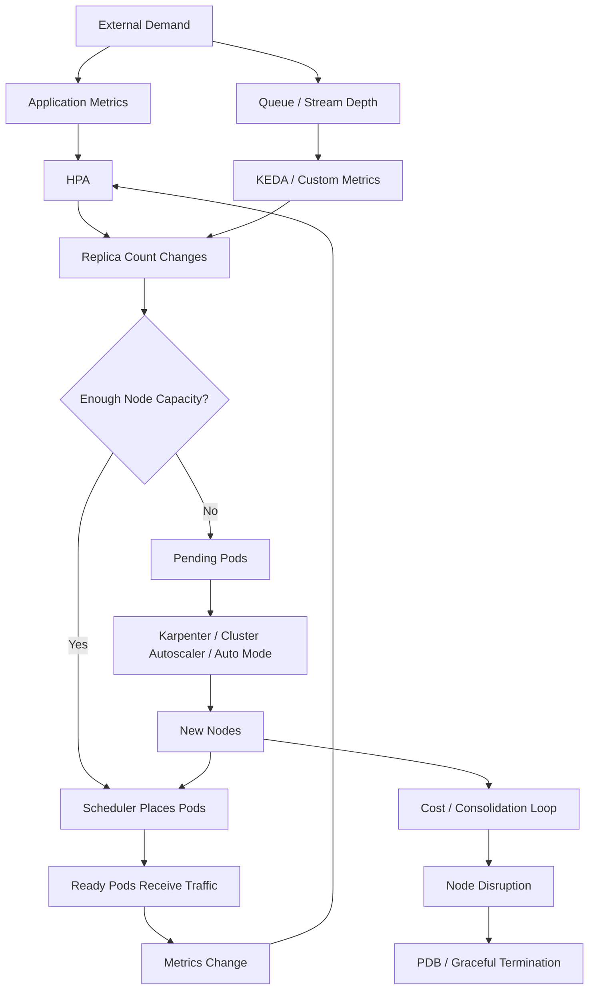
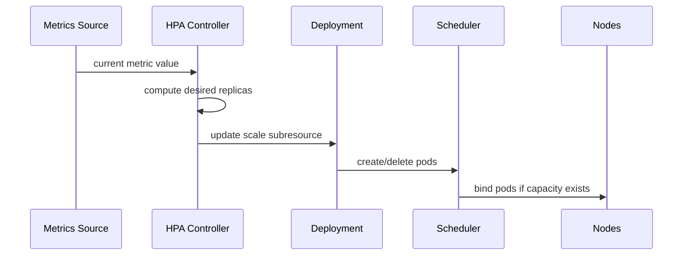
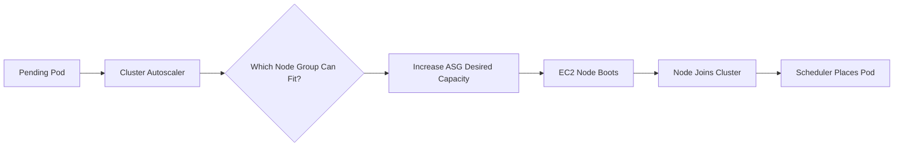
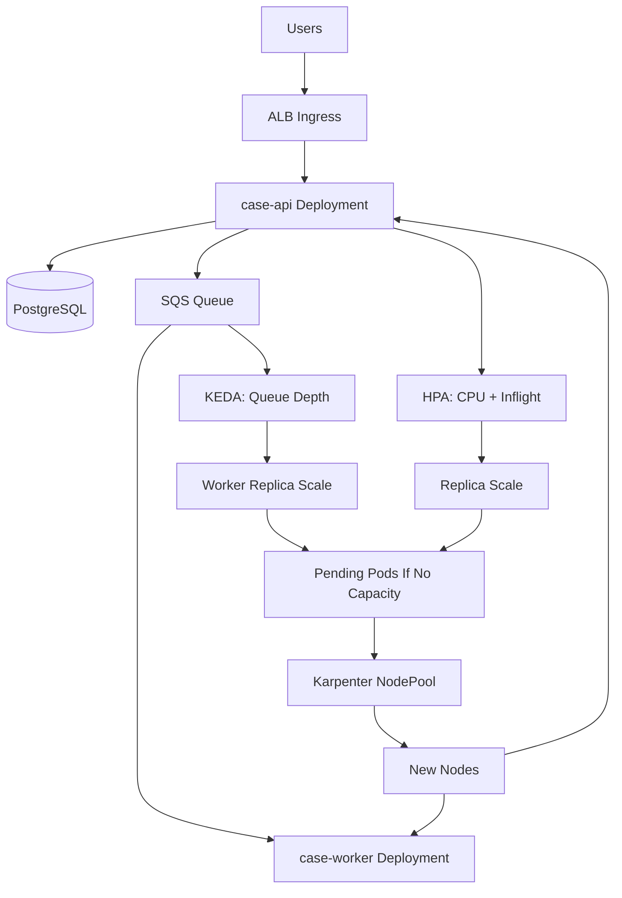

# Part 039 — EKS Autoscaling Patterns

Di Part 037 kita membahas Karpenter sebagai node lifecycle controller. Di Part 038 kita membahas pod scheduling dan availability.

Sekarang kita gabungkan keduanya menjadi satu pertanyaan produksi:

> Saat demand berubah, bagaimana cluster menambah atau mengurangi kapasitas tanpa merusak latency, reliability, cost, dan deployment safety?

Autoscaling bukan fitur tunggal. Autoscaling adalah kumpulan control loop yang saling mempengaruhi.

Satu loop menambah replica. Loop lain menambah node. Loop lain mengubah resource request. Loop lain memindahkan pod. Loop lain melakukan consolidation untuk menurunkan biaya. Jika mental model-nya salah, cluster bisa terlihat "auto scale" tetapi tetap gagal saat traffic spike.

---

## 1. Mental Model: Autoscaling Is a Set of Coupled Control Loops

Production autoscaling di EKS biasanya terdiri dari beberapa loop:

1. **Application replica scaling** — menambah/mengurangi jumlah pod.
2. **Resource recommendation/scaling** — mengubah request/limit pod.
3. **Node capacity scaling** — menambah/mengurangi node.
4. **Event-driven scaling** — menskalakan berdasarkan queue, stream, cron, atau external metric.
5. **Cost optimization loop** — consolidation, Spot replacement, bin packing.
6. **Availability protection loop** — PDB, rollout strategy, topology spread, disruption budget.



The important idea:

> Autoscaling reacts to signals. It does not understand business intent unless you encode that intent into metrics, min/max bounds, requests, budgets, and policies.

---

## 2. The Four Scaling Questions

Every autoscaling design must answer four questions.

### 2.1 What Should Scale?

Possible answers:

- pod replicas,
- pod CPU/memory request,
- node count,
- node shape,
- queue consumers,
- scheduled capacity,
- partition/shard capacity,
- database capacity,
- downstream concurrency.

A common mistake is scaling only the pod while the bottleneck is somewhere else.

Example:

```txt
Symptom: API latency high.
Naive action: increase HPA maxReplicas.
Actual bottleneck: database max connections.
Result: more pods create more DB pressure, latency gets worse.
```

### 2.2 Which Signal Should Drive Scaling?

Candidate signals:

| Workload | Better Signal | Weak Signal |
|---|---|---|
| CPU-bound stateless API | CPU utilization, request latency, request concurrency | memory |
| I/O-bound API | request latency, in-flight requests, downstream saturation | CPU only |
| SQS worker | visible messages per consumer, oldest message age | CPU only |
| Kafka/Kinesis consumer | consumer lag / iterator age | CPU only |
| batch processor | backlog, job deadline miss risk | average CPU |
| WebSocket service | active connections per pod | request rate only |
| ML inference | GPU utilization, queue delay, p95 latency | CPU only |
| Java API with GC pressure | p95 latency, CPU, memory, GC time | replica count only |

Rule:

> Use the signal closest to user pain or backlog risk.

CPU is useful, but it is often not the business signal.

### 2.3 How Fast Must It Scale?

Autoscaling is not instantaneous.

Scale-out latency can include:

- metric scrape interval,
- HPA decision interval,
- deployment replica update,
- scheduling delay,
- node provisioning delay,
- image pull time,
- pod startup time,
- application warm-up,
- readiness delay,
- load balancer target health delay,
- JVM JIT warm-up,
- downstream connection warm-up.

If demand spikes faster than the platform can add useful capacity, reactive autoscaling alone is insufficient.

You need one or more of:

- higher `minReplicas`,
- scheduled scale-out before known events,
- predictive/manual pre-warming,
- smaller images,
- faster startup,
- overprovisioning buffer pods,
- queue buffering,
- admission control,
- rate limiting,
- graceful degradation.

### 2.4 What Must Not Scale?

Some things should not grow without explicit guardrails:

- DB connections,
- downstream API calls,
- external payment calls,
- expensive AI inference calls,
- file descriptors,
- thread pools,
- queue consumers beyond safe concurrency,
- outbound NAT connections,
- tenant-specific concurrency.

Scaling application pods without bounding these resources turns autoscaling into an outage amplifier.

---

## 3. Horizontal Pod Autoscaler: Replica Control Loop

Horizontal Pod Autoscaler, usually HPA, changes replica count for scalable Kubernetes resources such as Deployment, StatefulSet, or a custom resource with a scale subresource.

HPA is the default starting point for stateless services.



### 3.1 CPU-Based HPA

A simple CPU HPA:

```yaml
apiVersion: autoscaling/v2
kind: HorizontalPodAutoscaler
metadata:
  name: case-api
  namespace: enforcement
spec:
  scaleTargetRef:
    apiVersion: apps/v1
    kind: Deployment
    name: case-api
  minReplicas: 3
  maxReplicas: 30
  metrics:
    - type: Resource
      resource:
        name: cpu
        target:
          type: Utilization
          averageUtilization: 65
  behavior:
    scaleUp:
      stabilizationWindowSeconds: 0
      policies:
        - type: Percent
          value: 100
          periodSeconds: 60
        - type: Pods
          value: 4
          periodSeconds: 60
      selectPolicy: Max
    scaleDown:
      stabilizationWindowSeconds: 300
      policies:
        - type: Percent
          value: 25
          periodSeconds: 60
```

Important details:

- CPU utilization is calculated relative to CPU request.
- If CPU request is wrong, HPA decisions are wrong.
- Missing metrics can delay scaling.
- Scale-down should usually be slower than scale-up.
- `maxReplicas` is a blast-radius boundary, not just a capacity number.

### 3.2 Why CPU-Only HPA Fails

CPU-only scaling fails when:

- app is I/O-bound,
- latency rises before CPU rises,
- request queueing happens inside the application,
- downstream dependency is saturated,
- GC pauses cause latency with unstable CPU pattern,
- workload has bursty traffic shorter than scaling reaction time,
- pod startup is slow,
- traffic is tenant-skewed.

For Java API services, CPU HPA is often useful, but not enough. A stronger design usually combines:

- CPU utilization,
- request concurrency,
- p95/p99 latency,
- error rate,
- downstream saturation,
- admission/rate limiting.

Kubernetes HPA can use resource metrics, custom metrics, and external metrics through metrics APIs.

### 3.3 Request-Based HPA

For HTTP services, request concurrency is often more directly related to latency than CPU.

Example target:

```txt
Scale so each pod handles around 50 concurrent in-flight requests.
```

This requires custom metrics from ingress, service mesh, application metrics, or OpenTelemetry/Prometheus adapter.

Pseudo-HPA with custom metric:

```yaml
apiVersion: autoscaling/v2
kind: HorizontalPodAutoscaler
metadata:
  name: case-api
spec:
  scaleTargetRef:
    apiVersion: apps/v1
    kind: Deployment
    name: case-api
  minReplicas: 4
  maxReplicas: 80
  metrics:
    - type: Pods
      pods:
        metric:
          name: http_inflight_requests
        target:
          type: AverageValue
          averageValue: "50"
```

This can be better than CPU for I/O-heavy APIs.

But it requires high-quality metrics. Bad metrics produce bad scaling.

---

## 4. Vertical Pod Autoscaler: Resource Right-Sizing

Vertical Pod Autoscaler, VPA, recommends or updates CPU/memory requests for workloads.

Think of VPA as solving a different problem from HPA.

| Mechanism | Main Question |
|---|---|
| HPA | How many replicas should run? |
| VPA | How much CPU/memory should each pod request? |
| Karpenter/CA | How many/which nodes should exist? |

VPA can run in modes such as:

- recommendation only,
- initial request assignment,
- automatic update.

### 4.1 VPA Recommendation Mode

For production, start with recommendation mode.

```yaml
apiVersion: autoscaling.k8s.io/v1
kind: VerticalPodAutoscaler
metadata:
  name: case-api
spec:
  targetRef:
    apiVersion: apps/v1
    kind: Deployment
    name: case-api
  updatePolicy:
    updateMode: "Off"
```

Use it to answer:

- are requests too low?
- are requests too high?
- does memory have enough headroom?
- are pods constantly close to OOM?
- is bin packing inefficient?

### 4.2 HPA + VPA Interaction

Be careful combining HPA and VPA on CPU.

If HPA scales based on CPU utilization and VPA changes CPU requests, the HPA target changes. This can create unexpected behavior.

Safer combinations:

- HPA on custom/external metric + VPA for CPU/memory recommendations,
- VPA recommendation mode + manual request tuning,
- VPA for memory + HPA for request/concurrency metric,
- HPA for stateless API + VPA recommendation only.

For high-stakes production workloads, resource requests are part of SLO engineering. Do not let automatic vertical scaling mutate them blindly without rollout discipline.

---

## 5. Event-Driven Scaling with KEDA

KEDA lets Kubernetes scale workloads based on event sources such as queues, streams, databases, Prometheus metrics, cloud metrics, and custom scalers.

KEDA is useful when demand is not best represented by CPU.

Typical cases:

- SQS queue worker,
- Kafka consumer,
- Kinesis consumer,
- Redis queue worker,
- scheduled scale windows,
- external backlog,
- Prometheus-based application metric.

### 5.1 Queue Worker Scaling Model

For a queue worker, the useful signal is usually:

```txt
backlog per active consumer
```

Not total backlog alone.

If queue depth is 10,000 and there are 100 workers, the backlog per worker is 100. If queue depth is 10,000 and there are 5 workers, backlog per worker is 2,000.

A good design asks:

- How many messages can one pod process per minute?
- What is the acceptable backlog age?
- How long does a pod take to start?
- What is the max safe downstream concurrency?
- Is processing idempotent?
- Can messages be processed out of order?
- Is there a tenant or partition fairness concern?

### 5.2 KEDA-Style SQS Worker

Conceptual example:

```yaml
apiVersion: keda.sh/v1alpha1
kind: ScaledObject
metadata:
  name: case-event-worker
  namespace: enforcement
spec:
  scaleTargetRef:
    name: case-event-worker
  minReplicaCount: 1
  maxReplicaCount: 40
  pollingInterval: 30
  cooldownPeriod: 300
  triggers:
    - type: aws-sqs-queue
      metadata:
        queueURL: https://sqs.ap-southeast-1.amazonaws.com/123456789012/case-events
        queueLength: "50"
        awsRegion: ap-southeast-1
```

The principle:

```txt
maxReplicaCount <= downstream safe concurrency / per-pod concurrency
```

If each pod processes 10 messages concurrently and the database safely accepts 200 concurrent write transactions, then `maxReplicaCount` should usually be below 20 unless there are additional bulkheads.

### 5.3 Scale to Zero

Scale to zero is attractive for cost, but dangerous for latency-sensitive paths.

Good candidates:

- asynchronous workers,
- low-frequency jobs,
- dev/test workloads,
- non-urgent event processors,
- batch processors with queue buffer.

Bad candidates:

- public synchronous API,
- service with strict p95 latency,
- service requiring warm cache,
- service with expensive JVM startup,
- service participating in synchronous service mesh calls.

Scale to zero is not free. It shifts cost from idle compute to cold-start latency and operational complexity.

---

## 6. Cluster Autoscaler

Cluster Autoscaler, usually CA, adds or removes nodes based on pending pods and node utilization.

It is tightly related to node groups.

Basic model:

1. Pod cannot be scheduled.
2. CA checks whether adding a node to some node group would make it schedulable.
3. CA increases the Auto Scaling Group desired capacity.
4. New node joins cluster.
5. Scheduler places pod.



### 6.1 Cluster Autoscaler Strengths

CA is a good fit when:

- cluster uses stable managed node groups,
- instance choices are limited and predictable,
- platform prefers explicit node group boundaries,
- teams need simple mental model,
- workloads are not extremely diverse,
- organization already operates ASGs well.

### 6.2 Cluster Autoscaler Weaknesses

CA becomes harder when:

- many instance types are needed,
- Spot diversification is important,
- workloads have varied CPU/memory shapes,
- bin packing is poor,
- node groups multiply,
- scale-out must be fast,
- consolidation efficiency matters.

CA scales groups. Karpenter provisions capacity more directly from pod requirements.

---

## 7. Karpenter as Scheduling-Driven Capacity

Karpenter watches unschedulable pods and provisions nodes that satisfy their scheduling constraints.

Karpenter tends to be stronger when:

- workload shape changes frequently,
- mixed instance types are acceptable,
- Spot diversification matters,
- startup speed matters,
- you want fewer manually defined node groups,
- you want consolidation to reduce waste.

But Karpenter also requires discipline:

- NodePool boundaries must be explicit,
- NodeClass must encode infrastructure guardrails,
- disruption must respect PDB and workload tolerance,
- Spot usage must reflect workload resilience,
- instance family/size constraints must avoid accidental expensive capacity.

### 7.1 NodePool Per Workload Class

A common production structure:

| NodePool | Workload Class | Capacity Type |
|---|---|---|
| `system` | CoreDNS, controllers, observability agents | On-Demand |
| `stable-apps` | critical APIs | On-Demand + limited Spot |
| `workers` | async workers | mixed On-Demand/Spot |
| `batch` | interruptible jobs | Spot-heavy |
| `gpu` | ML inference/training | specialized |
| `arm` | ARM64-compatible workloads | Graviton |

Do not run critical cluster controllers on the same aggressive Spot/consolidation pool as batch workloads.

### 7.2 Consolidation Is a Controlled Disruption

Consolidation reduces waste by replacing or removing underutilized nodes.

But consolidation can evict pods.

Therefore, production workloads need:

- correct PDB,
- graceful termination,
- readiness behavior,
- topology spread,
- enough replicas,
- disruption budgets in Karpenter,
- observability for node churn.

Cost optimization without disruption discipline is just a different kind of outage.

---

## 8. EKS Auto Mode and Autoscaling

EKS Auto Mode automates more of the data plane lifecycle. It can reduce platform operational burden by handling pieces that otherwise require Karpenter, load balancer controller, storage controller, and networking add-on management.

The design question changes from:

```txt
How do we operate all the controllers?
```

to:

```txt
Which decisions do we still need to own explicitly?
```

You still own:

- workload request/limit correctness,
- HPA/KEDA bounds,
- PDB,
- rollout strategy,
- NodePool intent,
- architecture/capacity constraints,
- cost guardrails,
- runtime availability contract,
- operational evidence.

Auto Mode removes toil. It does not remove engineering accountability.

---

## 9. Autoscaling Pattern by Workload Type

### 9.1 Stateless HTTP API

Recommended baseline:

- HPA on CPU + request concurrency/latency if available,
- minReplicas >= AZ count,
- topology spread across zones,
- PDB allowing at most one voluntary disruption at small replica counts,
- Karpenter/Auto Mode for node capacity,
- pre-warm for predictable spikes,
- load test to determine per-pod capacity.

Example:

```yaml
apiVersion: autoscaling/v2
kind: HorizontalPodAutoscaler
metadata:
  name: case-api
spec:
  scaleTargetRef:
    apiVersion: apps/v1
    kind: Deployment
    name: case-api
  minReplicas: 6
  maxReplicas: 60
  metrics:
    - type: Resource
      resource:
        name: cpu
        target:
          type: Utilization
          averageUtilization: 60
    - type: Pods
      pods:
        metric:
          name: http_inflight_requests
        target:
          type: AverageValue
          averageValue: "40"
```

### 9.2 Async Queue Worker

Recommended baseline:

- KEDA or custom HPA on queue depth/age,
- max replicas bounded by downstream capacity,
- idempotency at handler layer,
- visibility timeout > processing timeout,
- DLQ and redrive runbook,
- scale-down grace period to avoid churn,
- per-pod worker concurrency explicitly configured.

```txt
replicas = ceil(visible_messages / target_messages_per_pod)
max_replicas = floor(downstream_safe_concurrency / per_pod_concurrency)
```

### 9.3 Stream Consumer

Recommended baseline:

- scale based on lag / iterator age,
- understand partition/shard parallelism,
- do not exceed useful consumer count,
- monitor rebalance time,
- prefer stable scale-down,
- use backpressure and checkpoint discipline.

For partitioned streams, more pods do not always mean more throughput. Parallelism is limited by partitions/shards and consumer group semantics.

### 9.4 Batch Workload

Recommended baseline:

- KEDA/job scaler or workflow-driven job creation,
- Spot-friendly node pool if interruptible,
- checkpointing,
- retry with max attempts,
- deadline awareness,
- separate node pool from API workloads,
- cost cap.

### 9.5 Stateful Workload

Be conservative.

Autoscaling stateful workloads requires:

- storage attachment constraints,
- quorum rules,
- partitioning strategy,
- backup/restore discipline,
- controlled rollout,
- readiness and liveness correctness,
- data rebalancing cost.

Do not treat StatefulSet scaling like stateless Deployment scaling.

---

## 10. Scaling Math: From Load Test to HPA

A good autoscaling policy starts from measurement.

Example load test result for Java API:

```txt
1 pod, request = 1 vCPU / 2 GiB
stable throughput at p95 < 200ms = 180 RPS
safe operating target = 120 RPS per pod
startup time to ready = 45 seconds
node provision time p95 = 90 seconds
```

Traffic expectation:

```txt
normal peak = 2,400 RPS
spike peak = 5,000 RPS
```

Calculate:

```txt
normal replicas = ceil(2400 / 120) = 20
spike replicas = ceil(5000 / 120) = 42
```

Policy:

```yaml
minReplicas: 12
maxReplicas: 60
```

Why not minReplicas 1?

Because scale-out latency can exceed the time available to absorb spike. You need warm capacity.

Why maxReplicas 60?

Because the downstream database, cache, NAT, and external services must tolerate that much concurrency. `maxReplicas` is not aspirational. It is a safety boundary.

---

## 11. Stabilization, Cooldown, and Churn Control

Autoscaling instability often looks like:

```txt
scale up -> traffic redistributed -> metric drops -> scale down -> metric rises -> scale up
```

This creates:

- pod churn,
- node churn,
- cold starts,
- cache misses,
- load balancer target churn,
- deployment noise,
- higher cost,
- latency spikes.

Use:

- scale-up faster than scale-down,
- scale-down stabilization window,
- HPA behavior policies,
- KEDA cooldown period,
- Karpenter disruption budgets,
- PDB,
- minimum replicas,
- conservative consolidation for critical pools.

Autoscaling should be damped, not twitchy.

---

## 12. Requests Are the Currency of Autoscaling

Node autoscalers rely heavily on pod requests.

If requests are too low:

- too many pods fit on node,
- node gets overloaded,
- latency and OOM risk rise,
- autoscaler underestimates needed nodes.

If requests are too high:

- scale-out over-provisions,
- pods may remain pending unnecessarily,
- cost rises,
- fragmentation increases.

Requests should be derived from:

- load testing,
- production metrics,
- VPA recommendation,
- performance envelope,
- JVM memory analysis,
- incident evidence.

Do not copy requests from a template.

---

## 13. Overprovisioning Buffer Pods

A known pattern for fast scale-out is low-priority overprovisioning pods.

The idea:

1. Run low-priority pause pods that reserve spare capacity.
2. Real workload pod arrives.
3. Scheduler preempts buffer pod.
4. Real pod starts quickly without waiting for node scale-out.
5. Autoscaler replaces buffer capacity later.

This helps when:

- node provisioning is slower than pod startup target,
- traffic spikes are sudden,
- workload is latency-sensitive,
- cost of small spare capacity is acceptable.

It is not a substitute for correct HPA. It is a latency buffer.

---

## 14. Scale-In Safety

Scale-in is where many hidden bugs appear.

When a pod is removed:

- endpoint is removed,
- load balancer target starts draining,
- preStop may run,
- SIGTERM is delivered,
- app must stop accepting new work,
- in-flight work must finish or be handed off,
- metrics may lag,
- queue visibility timeout may expire,
- Kafka rebalance may occur,
- DB connections close.

Bad scale-in causes:

- dropped HTTP requests,
- duplicate message processing,
- partial writes,
- consumer group instability,
- thundering reconnects,
- cache churn.

Production scale-in requirements:

```yaml
terminationGracePeriodSeconds: 60
lifecycle:
  preStop:
    exec:
      command: ["/bin/sh", "-c", "sleep 10"]
```

For Java:

- handle SIGTERM,
- stop consuming new work,
- stop accepting new HTTP requests or fail readiness,
- flush telemetry,
- close resources gracefully,
- make message handling idempotent.

---

## 15. Autoscaling and Deployment Interaction

Deployment creates temporary extra load on capacity.

For a rolling deployment:

```yaml
strategy:
  type: RollingUpdate
  rollingUpdate:
    maxSurge: 25%
    maxUnavailable: 0
```

If a deployment scales from 40 pods with 25% surge, it may need capacity for 50 pods temporarily.

If node autoscaling cannot provision fast enough:

- new pods stay pending,
- rollout slows,
- old pods remain longer,
- alarms may fire,
- deployment windows extend.

Design deployment capacity explicitly:

- ensure surge fits node pools,
- use PodDisruptionBudget,
- account for topology spread,
- avoid simultaneous mass rollout across all services,
- pre-scale critical services before major releases,
- control Karpenter consolidation during sensitive migrations.

---

## 16. Autoscaling and Multi-AZ

EKS autoscaling must respect AZ topology.

Potential failure:

```txt
HPA adds pods.
Karpenter adds nodes in one AZ.
ALB has balanced traffic across AZs.
Some AZs are under-capacity.
Cross-zone traffic or target imbalance creates latency and cost issues.
```

Guardrails:

- topology spread constraints by zone,
- subnet capacity per AZ,
- node pools spanning enough AZs,
- PDB compatible with zone failure assumptions,
- storage-aware scheduling for stateful workloads,
- load balancer target health per AZ.

Example topology spread:

```yaml
topologySpreadConstraints:
  - maxSkew: 1
    topologyKey: topology.kubernetes.io/zone
    whenUnsatisfiable: ScheduleAnyway
    labelSelector:
      matchLabels:
        app: case-api
```

For hard availability requirements, use `DoNotSchedule` carefully. It can protect spread but also cause pending pods during capacity shortage.

---

## 17. Autoscaling and Cost

Autoscaling can save cost or increase it.

Cost can rise because of:

- high minReplicas,
- too-high requests,
- wrong instance shape,
- poor bin packing,
- excessive telemetry cardinality,
- frequent node churn,
- NAT traffic,
- cross-AZ traffic,
- duplicate workers,
- over-aggressive maxReplicas,
- retries during backlog.

Cost-aware autoscaling does not mean always minimize compute. It means:

> Buy enough capacity to protect SLO, but avoid capacity that does not buy meaningful reliability.

Measure:

- cost per request,
- cost per processed message,
- idle-to-busy ratio,
- requested vs used CPU,
- requested vs used memory,
- node utilization,
- pending pod duration,
- scale-out time,
- SLO violation minutes.

---

## 18. Production Autoscaling Checklist

For every scalable workload, capture this as an engineering record:

```txt
Workload: case-api
Class: stateless HTTP API
SLO: p95 < 250ms, availability 99.9%
Primary scaling signal: CPU 60% + inflight requests 40/pod
Min replicas: 6
Max replicas: 60
Per-pod safe throughput: 120 RPS
Startup-to-ready p95: 45s
Node provisioning p95: 90s
Scale-up policy: up to 100%/minute
Scale-down policy: 25%/minute, 5m stabilization
PDB: minAvailable 80%
Topology: spread across 3 AZs
NodePool: stable-apps, On-Demand preferred
Downstream cap: DB pool max 600 total connections
Failure mode: if DB latency > threshold, reject early instead of scaling infinitely
```

This is the difference between "we enabled autoscaling" and "we engineered elasticity".

---

## 19. Failure Modes and Debugging

### 19.1 HPA Does Not Scale Up

Check:

```bash
kubectl describe hpa case-api -n enforcement
kubectl top pods -n enforcement
kubectl get --raw /apis/metrics.k8s.io/v1beta1/namespaces/enforcement/pods
```

Likely causes:

- metrics-server missing/broken,
- pod has no CPU request,
- metric target not available,
- HPA maxReplicas reached,
- custom metrics adapter broken,
- scale target reference wrong,
- stabilization behavior delaying action.

### 19.2 Pods Pending After HPA Scale-Up

Check:

```bash
kubectl get pods -n enforcement
kubectl describe pod <pending-pod> -n enforcement
kubectl get events -n enforcement --sort-by=.lastTimestamp
```

Likely causes:

- insufficient CPU/memory,
- topology spread impossible,
- missing toleration,
- node selector too restrictive,
- PVC/AZ conflict,
- subnet IP exhaustion,
- Karpenter/CA cannot provision matching node,
- quota/limit reached,
- image architecture mismatch.

### 19.3 Node Autoscaler Does Not Add Capacity

Check:

```bash
kubectl logs -n kube-system deploy/karpenter
kubectl get nodepool,nodeclaim
kubectl describe nodeclaim <name>
```

Or for Cluster Autoscaler:

```bash
kubectl logs -n kube-system deploy/cluster-autoscaler
```

Likely causes:

- instance constraints too narrow,
- capacity unavailable,
- AWS service quota,
- subnet/security group discovery issue,
- IAM issue,
- pod constraints impossible,
- PDB/disruption conflict,
- node group max size reached.

### 19.4 Scale-Up Happens But Latency Still Bad

Likely causes:

- pod startup too slow,
- traffic spike faster than scaling loop,
- DB/cache/downstream bottleneck,
- lock contention,
- connection pool saturation,
- load balancer target health delay,
- JVM warm-up,
- GC pressure,
- bad metric signal,
- per-pod concurrency too high.

### 19.5 Scale-Down Causes Errors

Likely causes:

- no graceful shutdown,
- readiness not flipped before shutdown,
- termination grace too short,
- queue visibility timeout too low,
- Kafka rebalance instability,
- ALB/NLB deregistration delay mismatch,
- PDB too permissive,
- Karpenter consolidation too aggressive.

---

## 20. A Production Pattern: API + Worker + Karpenter



Design choices:

- API min replicas protect synchronous latency.
- Worker can scale to near zero if backlog is not urgent.
- Worker max replicas bounded by DB write capacity.
- API and worker use separate NodePools if worker may burst aggressively.
- Karpenter Spot is acceptable for workers, limited for API.
- PDB protects API during consolidation.
- Queue age alarm protects async SLO.

---

## 21. What Top Engineers Notice

Average engineers ask:

> How do I enable autoscaling?

Strong engineers ask:

> What signal represents pain, how long does capacity take to become useful, what can saturate downstream, and what failure modes does scale-in introduce?

Top engineers also notice:

- HPA is only as good as requests and metrics.
- Node autoscaling cannot fix impossible scheduling constraints.
- Scale-to-zero is a latency/cost trade-off, not a free win.
- `maxReplicas` is a safety boundary.
- Scale-in is more dangerous than scale-out for stateful side effects.
- Overprovisioning is sometimes cheaper than SLO violations.
- Autoscaling should be load-tested with realistic startup and downstream behavior.

---

## 22. Recommended Operating Defaults

For critical HTTP services:

```txt
minReplicas >= number of AZs * 2
maxReplicas based on downstream capacity
scale-up fast
scale-down slow
PDB enabled
topology spread by zone
requests based on load test
custom metric if CPU is not pain signal
```

For queue workers:

```txt
scale on backlog age or backlog per pod
max replicas bound by downstream capacity
idempotency mandatory
DLQ mandatory
scale-down cooldown conservative
Spot acceptable if handler is interruption-safe
```

For batch:

```txt
separate node pool
checkpointing mandatory for long jobs
Spot allowed only if retry economics are acceptable
node consolidation allowed only with disruption-safe jobs
```

For platform controllers:

```txt
no aggressive Spot
stable node pool
PDB where supported
priority class
observability and alerting
avoid co-location with bursty tenants
```

---

## 23. Sources and Further Reading

- AWS EKS User Guide — Scale cluster compute with Karpenter and Cluster Autoscaler: `https://docs.aws.amazon.com/eks/latest/userguide/autoscaling.html`
- AWS EKS Best Practices — Cluster Autoscaler: `https://docs.aws.amazon.com/eks/latest/best-practices/cas.html`
- AWS EKS Best Practices — Karpenter: `https://docs.aws.amazon.com/eks/latest/best-practices/karpenter.html`
- Kubernetes Documentation — Horizontal Pod Autoscaling: `https://kubernetes.io/docs/concepts/workloads/autoscaling/horizontal-pod-autoscale/`
- Kubernetes Documentation — Pod Disruption Budgets: `https://kubernetes.io/docs/tasks/run-application/configure-pdb/`
- KEDA Documentation: `https://keda.sh/docs/`

---

## 24. Summary

EKS autoscaling is not one feature.

It is a chain:

```txt
signal -> replica decision -> scheduling -> node provisioning -> startup -> readiness -> traffic -> metrics -> scale-down
```

Every link can fail.

Production-grade autoscaling requires:

- correct signal,
- correct resource requests,
- safe min/max bounds,
- node capacity strategy,
- PDB and topology constraints,
- graceful shutdown,
- downstream protection,
- cost awareness,
- runbooks.

In the next part, we move from scaling to another core production boundary: **configuration and secrets in EKS**.
