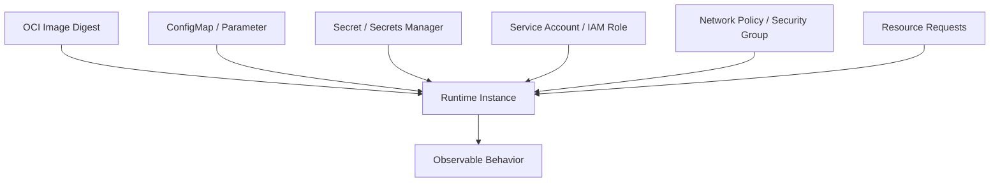
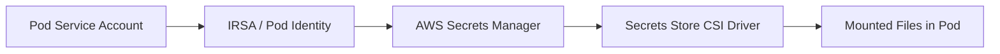
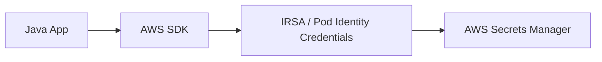
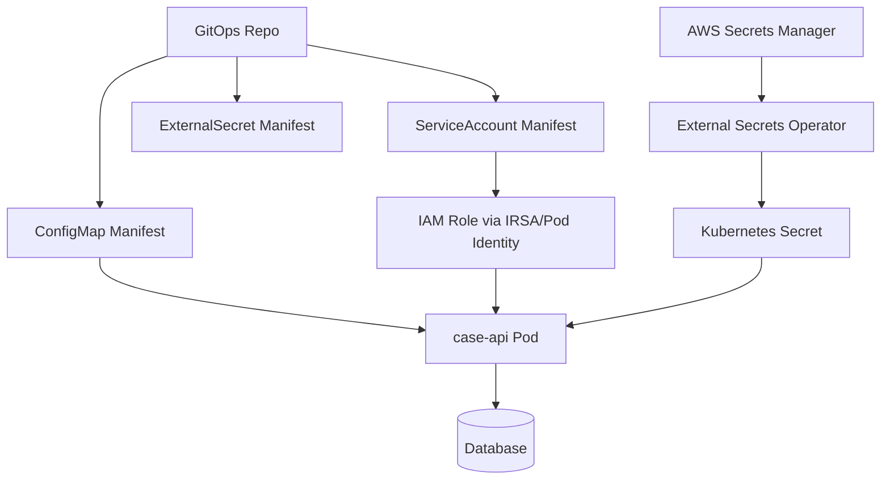

# Part 040 — EKS Configuration and Secrets

Di Part 039, kita membahas autoscaling: bagaimana workload berubah saat demand berubah.

Sekarang kita bahas sesuatu yang kelihatannya lebih sederhana tetapi sering lebih berbahaya:

> Bagaimana aplikasi di EKS menerima konfigurasi dan secret tanpa membuat deployment rapuh, audit buruk, atau insiden security?

Configuration dan secrets bukan sekadar `env:` di YAML.

Mereka adalah **runtime input contract**.

Jika contract ini kabur, kamu akan mengalami:

- pod crash karena config hilang,
- service memakai endpoint salah,
- secret bocor ke log,
- token lama tetap dipakai setelah rotasi,
- rollout tidak terjadi walau ConfigMap berubah,
- GitOps menyimpan data sensitif,
- cluster admin punya akses ke secret aplikasi,
- incident response tidak tahu versi konfigurasi yang aktif.

Part ini membangun model produksi untuk config dan secret di EKS.

---

## 1. Mental Model: Configuration Is Part of the Release

Aplikasi bukan hanya image.

Aplikasi production adalah kombinasi:

```txt
image digest + command + runtime resources + config + secrets + identity + network + storage + policy
```



If you cannot answer which config version a pod ran with, your release is not fully auditable.

---

## 2. Configuration Taxonomy

Not all configuration is the same.

| Type | Example | Sensitivity | Change Frequency | Preferred Mechanism |
|---|---|---:|---:|---|
| Build-time constant | app version, build commit | low | per build | image label/env metadata |
| Deploy-time config | service URL, feature default | low/medium | per release | ConfigMap / Helm values / GitOps |
| Runtime operational knob | timeout, threshold, feature flag | low/medium | frequent | dynamic config/AppConfig/custom config service |
| Secret | DB password, API token | high | rotation-bound | AWS Secrets Manager / CSI / ESO |
| Identity | AWS permission | high impact | controlled | IRSA / EKS Pod Identity |
| Tenant policy | tenant limit, entitlement | high business impact | frequent | database/policy service, not static ConfigMap |

The mistake is using one mechanism for all categories.

Examples:

- Feature flags in image are too rigid.
- DB passwords in ConfigMap are insecure.
- High-frequency tenant policy in Kubernetes Secret is operationally clumsy.
- IAM access keys in env vars are almost always wrong on EKS.

---

## 3. Kubernetes ConfigMap

ConfigMap stores non-sensitive configuration.

Basic example:

```yaml
apiVersion: v1
kind: ConfigMap
metadata:
  name: case-api-config
  namespace: enforcement
data:
  APP_MODE: "production"
  CASE_SERVICE_TIMEOUT_MS: "2500"
  DOWNSTREAM_BASE_URL: "https://case-core.internal"
```

Mount as environment variables:

```yaml
envFrom:
  - configMapRef:
      name: case-api-config
```

Mount as files:

```yaml
volumes:
  - name: app-config
    configMap:
      name: case-api-config
containers:
  - name: app
    volumeMounts:
      - name: app-config
        mountPath: /app/config
        readOnly: true
```

### 3.1 Env Var vs Mounted File

| Mechanism | Behavior | Good For | Risk |
|---|---|---|---|
| Env var | read at process start | startup config, simple apps | no live update without restart |
| Mounted file | kubelet can update projected files eventually | file-based config, reloadable apps | app must watch/reload safely |
| App fetches config | app calls config service | dynamic config | app complexity, availability dependency |

Most Java services treat config as startup-bound. That is fine, but be explicit.

### 3.2 ConfigMap Update Does Not Equal App Reload

Changing ConfigMap does not automatically restart pods.

If config is injected as env var, the running process will not see changes.

If config is mounted as a volume, Kubernetes can update the projected file, but application reload behavior is still your responsibility.

Therefore production patterns include:

- rollout on config change,
- checksum annotation in pod template,
- immutable ConfigMaps with versioned names,
- dynamic reload only for carefully designed knobs.

Example checksum annotation pattern:

```yaml
spec:
  template:
    metadata:
      annotations:
        checksum/config: "{{ include (print $.Template.BasePath \"/configmap.yaml\") . | sha256sum }}"
```

For plain manifests, use versioned name:

```yaml
apiVersion: v1
kind: ConfigMap
metadata:
  name: case-api-config-20260706-001
```

Then update the Deployment to reference the new name. This makes config changes explicit and auditable.

---

## 4. Kubernetes Secret

Kubernetes Secret is intended for confidential data, but it is not magic.

Basic Secret:

```yaml
apiVersion: v1
kind: Secret
metadata:
  name: case-api-db
  namespace: enforcement
type: Opaque
stringData:
  username: case_api
  password: do-not-commit-this
```

Inject into env:

```yaml
env:
  - name: DB_USERNAME
    valueFrom:
      secretKeyRef:
        name: case-api-db
        key: username
  - name: DB_PASSWORD
    valueFrom:
      secretKeyRef:
        name: case-api-db
        key: password
```

Mount as file:

```yaml
volumes:
  - name: db-secret
    secret:
      secretName: case-api-db
containers:
  - name: app
    volumeMounts:
      - name: db-secret
        mountPath: /app/secrets/db
        readOnly: true
```

### 4.1 Kubernetes Secret Risk Model

Risks:

- anyone with Kubernetes API read access to Secret can retrieve it,
- secret may be exposed through env dump/debug endpoint,
- secret may leak to logs,
- secret is stored in etcd unless external mechanism is used,
- secret update may not restart workload,
- env var secret remains in process environment for lifetime of process,
- secret in Git is a serious anti-pattern unless sealed/encrypted and access-controlled.

Minimum production guardrails:

- enable/verify encryption at rest for Kubernetes secrets,
- restrict RBAC access to `get/list/watch secrets`,
- avoid broad namespace admin access,
- do not log env vars,
- prefer workload identity over static cloud credentials,
- use external secret source for high-value credentials,
- rotate secrets and test rotation.

---

## 5. AWS Secret Sources for EKS

On AWS, the usual external secret sources are:

- AWS Secrets Manager,
- AWS Systems Manager Parameter Store,
- AWS AppConfig for dynamic configuration,
- custom internal secret/config service.

### 5.1 Secrets Manager

Good for:

- database credentials,
- API tokens,
- credentials with rotation lifecycle,
- secrets requiring audit trail,
- cross-account secret governance.

### 5.2 Parameter Store

Good for:

- hierarchical parameters,
- lower-sensitivity config,
- simple operational parameters,
- integration with existing SSM-based tooling.

### 5.3 AppConfig

Good for:

- feature flags,
- dynamic operational knobs,
- guarded deployments of configuration,
- fast rollback of config changes,
- validation before config rollout.

For EKS workloads, AppConfig often belongs in application code or sidecar/agent integration rather than plain ConfigMap.

---

## 6. Pattern 1: Secret Synced Into Kubernetes Secret

One pattern is to synchronize AWS Secrets Manager into Kubernetes Secret using an operator such as External Secrets Operator.


Example conceptual manifest:

```yaml
apiVersion: external-secrets.io/v1beta1
kind: ExternalSecret
metadata:
  name: case-api-db
  namespace: enforcement
spec:
  refreshInterval: 1h
  secretStoreRef:
    name: aws-secretsmanager
    kind: ClusterSecretStore
  target:
    name: case-api-db
    creationPolicy: Owner
  data:
    - secretKey: username
      remoteRef:
        key: prod/enforcement/case-api/db
        property: username
    - secretKey: password
      remoteRef:
        key: prod/enforcement/case-api/db
        property: password
```

Pros:

- familiar Kubernetes Secret consumption,
- works with env/volume injection,
- supports GitOps-friendly ExternalSecret manifest,
- app does not need AWS SDK for secret retrieval.

Cons:

- secret exists inside Kubernetes Secret,
- RBAC to Secret remains sensitive,
- rotation still needs app reload/restart strategy,
- operator availability matters,
- sync failure can create stale secret risk.

Use this when Kubernetes-native consumption matters and RBAC/etcd encryption/governance are strong.

---

## 7. Pattern 2: Mount Secret with Secrets Store CSI Driver

Secrets Store CSI Driver with AWS provider can mount secrets from AWS Secrets Manager or Parameter Store as files into pods.



Conceptual SecretProviderClass:

```yaml
apiVersion: secrets-store.csi.x-k8s.io/v1
kind: SecretProviderClass
metadata:
  name: case-api-secrets
  namespace: enforcement
spec:
  provider: aws
  parameters:
    objects: |
      - objectName: "prod/enforcement/case-api/db"
        objectType: "secretsmanager"
        jmesPath:
          - path: username
            objectAlias: db_username
          - path: password
            objectAlias: db_password
```

Pod mount:

```yaml
volumes:
  - name: secrets-store
    csi:
      driver: secrets-store.csi.k8s.io
      readOnly: true
      volumeAttributes:
        secretProviderClass: case-api-secrets
containers:
  - name: app
    volumeMounts:
      - name: secrets-store
        mountPath: /mnt/secrets-store
        readOnly: true
```

Pros:

- secret does not need to be stored as Kubernetes Secret unless sync is enabled,
- access can be tied to pod identity,
- file-based mount suits some applications,
- reduces secret exposure through Kubernetes API.

Cons:

- application must read files,
- reload/rotation behavior still must be designed,
- CSI driver availability matters,
- startup depends on secret retrieval path,
- file permission and mount path conventions need standardization.

Use this when you want to reduce Kubernetes Secret exposure and can standardize file-based secret consumption.

---

## 8. Pattern 3: Application Fetches Secret Directly

The application uses AWS SDK and pod identity to call Secrets Manager/Parameter Store.



Pros:

- app controls caching/reload,
- no Kubernetes Secret object required,
- fine-grained runtime behavior,
- useful for dynamic credentials and multi-tenant secrets.

Cons:

- app complexity increases,
- startup can fail due to AWS API issue,
- retry/caching must be correct,
- risk of secret logging/misuse in app code,
- SDK dependency and IAM policy required.

Use this for advanced cases where secret retrieval semantics are application-specific.

For most platform teams, provide a shared Java library:

```java
public interface SecretProvider {
    DbCredentials getDatabaseCredentials(String name);
}

public final class CachedSecretsManagerProvider implements SecretProvider {
    // Fetch from Secrets Manager, cache with TTL, expose safe typed object,
    // never log secret value, emit only version/staleness metadata.
}
```

The important thing is not the library name. The important thing is centralizing safe behavior.

---

## 9. Identity Boundary: Do Not Use Static AWS Keys

On EKS, pods should access AWS services through workload identity:

- IRSA,
- EKS Pod Identity,
- node role only for node-level components, not app permissions.

Bad:

```yaml
env:
  - name: AWS_ACCESS_KEY_ID
    valueFrom:
      secretKeyRef: ...
  - name: AWS_SECRET_ACCESS_KEY
    valueFrom:
      secretKeyRef: ...
```

Better:

```txt
Pod service account -> IAM role -> permission to specific secret ARN
```

Example IAM permission shape:

```json
{
  "Version": "2012-10-17",
  "Statement": [
    {
      "Effect": "Allow",
      "Action": [
        "secretsmanager:GetSecretValue",
        "secretsmanager:DescribeSecret"
      ],
      "Resource": "arn:aws:secretsmanager:ap-southeast-1:123456789012:secret:prod/enforcement/case-api/db-*"
    }
  ]
}
```

Principle:

> A pod should be able to read only the secrets required by that workload, in that environment, for that namespace/application boundary.

---

## 10. Rotation and Reload Strategy

Secret rotation has two separate phases:

1. Secret value changes in the source.
2. Application starts using the new value safely.

Many systems implement phase 1 and forget phase 2.

### 10.1 Restart-Based Rotation

Simplest pattern:

```txt
secret source updated -> Kubernetes Secret/volume synced -> deployment restarted -> new pods use new secret
```

Pros:

- simple mental model,
- works for most Java apps,
- predictable audit trail,
- easy rollback.

Cons:

- restart required,
- rollout must be safe,
- old connections may remain until pod termination.

Use for:

- database password,
- API token,
- credentials loaded at startup.

### 10.2 Live Reload

Pattern:

```txt
secret file updated -> app detects change -> app refreshes connection/client
```

Pros:

- no full restart,
- lower interruption,
- useful for high availability services.

Cons:

- much harder to implement correctly,
- partial reload can leave inconsistent clients,
- error handling complex,
- rollback semantics harder.

Only use live reload when the application has a tested reload protocol.

### 10.3 Dual Credential Rotation

For database credentials, strong rotation often uses a dual-user or staged credential strategy:

1. New credential is created.
2. Application can use new credential.
3. Rollout/reload happens.
4. Old credential is revoked after safe window.

This avoids breaking old pods that still use old credentials during rollout.

---

## 11. Config Reload Is Not Always Safe

Dynamic config can be dangerous.

Safe to reload:

- logging level,
- feature flag,
- timeout within safe range,
- circuit breaker threshold,
- sampling rate,
- non-critical endpoint toggle.

Dangerous to reload live:

- database schema mode,
- queue name,
- tenant isolation policy,
- authentication issuer,
- encryption key,
- idempotency behavior,
- serialization compatibility mode.

Rule:

> If a config change affects data correctness, security boundary, or compatibility contract, treat it like a release.

---

## 12. GitOps and Secret Management

GitOps wants desired state in Git. Secrets make this tricky.

Do not commit raw secrets.

Possible patterns:

| Pattern | Git Contains | Runtime Contains | Trade-Off |
|---|---|---|---|
| ExternalSecret | reference to AWS secret | Kubernetes Secret synced by operator | good balance |
| Secrets Store CSI | SecretProviderClass reference | mounted secret files | avoids K8s Secret unless synced |
| SealedSecret/SOPS | encrypted secret | decrypted Secret in cluster | Git contains encrypted value |
| App fetch | config reference | app retrieves directly | app complexity |

For regulated environments, prefer a design where Git contains references and policy, while AWS Secrets Manager contains actual secret material.

Example repository layout:

```txt
clusters/
  prod/
    enforcement/
      case-api/
        deployment.yaml
        service.yaml
        configmap.yaml
        externalsecret.yaml
        serviceaccount.yaml
```

The GitOps record should answer:

- which app uses which secret reference,
- which IAM role grants access,
- which namespace owns it,
- which deployment version consumed it,
- what rollout happened when reference changed.

---

## 13. Helm Values and Configuration Boundaries

Helm often becomes a dumping ground.

Bad:

```yaml
# values.yaml
password: super-secret
featureA: true
databaseHost: prod-db.internal
replicaCount: 4
cpuLimit: "2"
```

Better separate:

```txt
values-base.yaml        non-sensitive defaults
values-prod.yaml        prod non-sensitive config
externalsecret.yaml     secret reference
serviceaccount.yaml     identity binding
hpa.yaml                scaling policy
```

Guidelines:

- secret values do not belong in Helm values,
- environment-specific non-secret config can be in values,
- config affecting data behavior should be reviewed like code,
- generated names/checksums should make rollout explicit,
- avoid too many implicit template branches.

---

## 14. Immutable ConfigMaps and Secrets

Kubernetes supports marking ConfigMaps and Secrets immutable.

Example:

```yaml
apiVersion: v1
kind: ConfigMap
metadata:
  name: case-api-config-v20260706-001
immutable: true
data:
  CASE_SERVICE_TIMEOUT_MS: "2500"
```

Benefits:

- prevents accidental mutation,
- improves auditability,
- encourages versioned config,
- reduces unexpected runtime drift.

Trade-off:

- changing config requires creating a new object,
- deployment references must be updated,
- cleanup/lifecycle policy needed.

For production release-bound config, immutable versioned ConfigMaps are often safer than mutable shared names.

---

## 15. Secret Exposure Paths

Secrets leak through surprising paths:

- application logs,
- exception messages,
- startup banner,
- `/actuator/env` or debug endpoints,
- `kubectl describe pod`,
- shell history during debugging,
- CI/CD logs,
- Helm rendered templates,
- crash dumps,
- heap dumps,
- telemetry attributes,
- support bundles,
- screenshots.

Controls:

- redact known key patterns,
- disable unsafe debug endpoints,
- restrict ECS/EKS exec-like access,
- do not expose env dumps,
- avoid putting secrets in command-line args,
- mark telemetry attributes as safe-list only,
- use secret scanning in Git and CI,
- review support bundle content.

For Java specifically, be careful with:

```txt
System.getenv() dumps
Spring Boot actuator env/configprops
exception messages from failed JDBC URL parsing
heap dumps containing strings
thread dumps with command-line args
```

---

## 16. Production Java Configuration Loader

A Java service should not let every component read raw environment variables independently.

Better:

```java
public record AppConfig(
    URI downstreamBaseUrl,
    Duration requestTimeout,
    int maxTenantConcurrency,
    boolean enableAuditEnrichment
) {}

public final class AppConfigLoader {
    public static AppConfig load() {
        return new AppConfig(
            requireUri("DOWNSTREAM_BASE_URL"),
            requireDurationMillis("CASE_SERVICE_TIMEOUT_MS", 2500, 100, 30000),
            requireInt("MAX_TENANT_CONCURRENCY", 20, 1, 500),
            requireBoolean("ENABLE_AUDIT_ENRICHMENT", false)
        );
    }
}
```

Properties of a production config loader:

- fail fast for required config,
- validate ranges,
- validate URL/ARN/region shape,
- apply safe defaults only where appropriate,
- redact values in logs,
- emit config fingerprint, not secret values,
- expose config source/version,
- centralize parsing.

Startup log example:

```json
{
  "event": "config_loaded",
  "service": "case-api",
  "configFingerprint": "sha256:ab12...",
  "secretVersion": "AWSCURRENT",
  "region": "ap-southeast-1"
}
```

Never log raw secrets.

---

## 17. Config Validation as Admission

Invalid configuration should be caught before pods crash.

Layers:

1. schema validation in Helm/Kustomize,
2. CI validation,
3. policy-as-code admission,
4. startup validation,
5. runtime health check.

Examples of policies:

- no raw Secret manifest in application repo,
- ConfigMap must use approved labels,
- Deployment must reference service account,
- containers must not include `AWS_ACCESS_KEY_ID`,
- secret volume paths must be read-only,
- production ConfigMaps must be immutable or checksum-triggered,
- ExternalSecret must reference approved SecretStore.

Policy tools:

- Kyverno,
- OPA Gatekeeper,
- ValidatingAdmissionPolicy,
- custom admission controller.

The goal is not bureaucracy. The goal is preventing easy mistakes from reaching production.

---

## 18. Multi-Tenant Configuration

In regulatory/case management systems, tenant config is often business-critical.

Do not model high-frequency tenant policy as Kubernetes ConfigMap.

Examples:

- tenant enforcement threshold,
- jurisdiction-specific SLA,
- escalation policy,
- review workflow variant,
- notification rule,
- risk scoring threshold.

These should usually live in:

- database-backed policy service,
- versioned decision table,
- authorization/policy engine,
- workflow configuration model,
- audit-friendly admin UI.

Kubernetes config is platform/application runtime config. It is not a replacement for business policy management.

---

## 19. Example: Production EKS Config/Secret Contract



Deployment fragment:

```yaml
apiVersion: apps/v1
kind: Deployment
metadata:
  name: case-api
  namespace: enforcement
spec:
  replicas: 4
  selector:
    matchLabels:
      app: case-api
  template:
    metadata:
      labels:
        app: case-api
      annotations:
        checksum/config: "sha256-of-rendered-configmap"
        checksum/secret-ref: "sha256-of-secret-reference-not-secret-value"
    spec:
      serviceAccountName: case-api
      containers:
        - name: app
          image: 123456789012.dkr.ecr.ap-southeast-1.amazonaws.com/case-api@sha256:abc123
          envFrom:
            - configMapRef:
                name: case-api-config-v20260706-001
          env:
            - name: DB_USERNAME
              valueFrom:
                secretKeyRef:
                  name: case-api-db
                  key: username
            - name: DB_PASSWORD
              valueFrom:
                secretKeyRef:
                  name: case-api-db
                  key: password
          readinessProbe:
            httpGet:
              path: /ready
              port: 8080
          livenessProbe:
            httpGet:
              path: /live
              port: 8080
          resources:
            requests:
              cpu: "500m"
              memory: "1Gi"
            limits:
              memory: "1536Mi"
```

---

## 20. Failure Modes and Runbooks

### 20.1 Pod CrashLoop Because Config Missing

Symptoms:

```txt
CrashLoopBackOff
IllegalStateException: missing required config DOWNSTREAM_BASE_URL
```

Check:

```bash
kubectl describe pod <pod> -n enforcement
kubectl get configmap case-api-config-v20260706-001 -n enforcement -o yaml
kubectl get deploy case-api -n enforcement -o yaml
```

Likely causes:

- wrong ConfigMap name,
- key typo,
- namespace mismatch,
- Helm values missing,
- immutable ConfigMap version not updated,
- app expects different key.

Fix:

- restore previous config reference,
- correct manifest,
- run config validation in CI,
- add startup preflight test.

### 20.2 Secret Not Mounted

Symptoms:

```txt
MountVolume.SetUp failed
failed to fetch secret
AccessDeniedException
```

Check:

```bash
kubectl describe pod <pod> -n enforcement
kubectl describe serviceaccount case-api -n enforcement
kubectl logs -n kube-system <csi-driver-or-operator-pod>
```

Likely causes:

- IAM role trust policy wrong,
- service account annotation/association missing,
- secret ARN not allowed,
- region mismatch,
- SecretProviderClass typo,
- CSI provider not installed,
- network path to AWS API unavailable.

### 20.3 Secret Rotated But App Still Uses Old Value

Symptoms:

```txt
new password works manually
running pods still fail auth after old password revoked
```

Likely causes:

- app loaded env var at startup,
- no rollout after secret sync,
- connection pool kept old credentials,
- live reload not implemented,
- secret sync interval delayed.

Fix:

- perform rolling restart,
- use dual credential rotation window,
- implement tested reload if needed,
- instrument active secret version/fingerprint.

### 20.4 Config Change Did Not Take Effect

Likely causes:

- env var injection requires restart,
- ConfigMap volume update delay,
- application did not reload file,
- GitOps applied ConfigMap but Deployment pod template did not change,
- checksum annotation missing.

Fix:

- trigger rollout,
- adopt checksum annotation,
- use immutable versioned ConfigMaps,
- document config reload semantics.

### 20.5 Secret Leaked

Immediate actions:

1. identify secret and scope,
2. revoke/rotate immediately,
3. identify exposure path,
4. search logs/CI artifacts/support bundles,
5. check access logs for secret use,
6. patch redaction/policy gap,
7. record incident evidence.

Do not merely delete the leaked log line. Assume compromise until proven otherwise.

---

## 21. Configuration Review Checklist

Before production:

```txt
[ ] All required config keys documented.
[ ] Config values validated at startup.
[ ] Sensitive values are not in ConfigMap.
[ ] Raw secrets are not committed to Git.
[ ] Secret source is AWS Secrets Manager/Parameter Store or approved equivalent.
[ ] Pod identity has least privilege to exact secret ARNs.
[ ] Secret reload/restart behavior documented.
[ ] ConfigMap update triggers rollout or app has tested live reload.
[ ] Production config objects are versioned or checksum-controlled.
[ ] Secret values are redacted from logs/metrics/traces.
[ ] Actuator/debug endpoints do not expose env/config.
[ ] Rotation has been tested.
[ ] Rollback plan exists for bad config.
[ ] Audit record can show which config/secret version was active.
```

---

## 22. What Top Engineers Notice

Average engineers ask:

> How do I pass env vars into my pod?

Strong engineers ask:

> What is the lifecycle of this value, who owns it, how sensitive is it, what changes require rollout, and how do we prove what ran in production?

Top engineers also notice:

- Config is part of release evidence.
- Secret rotation is useless unless applications adopt the new value safely.
- Kubernetes Secret is a delivery mechanism, not a complete security model.
- Env var config is simple but restart-bound.
- Dynamic config can violate correctness if used carelessly.
- GitOps should store references and policy, not raw secret material.
- Workload identity is better than static AWS credentials.
- Debug tooling is often the real secret leak path.

---

## 23. Sources and Further Reading

- Kubernetes Documentation — ConfigMaps: `https://kubernetes.io/docs/concepts/configuration/configmap/`
- Kubernetes Documentation — Secrets: `https://kubernetes.io/docs/concepts/configuration/secret/`
- AWS EKS User Guide — Use AWS Secrets Manager secrets with Amazon EKS Pods: `https://docs.aws.amazon.com/eks/latest/userguide/manage-secrets.html`
- AWS Secrets Manager User Guide — AWS Secrets and Configuration Provider with IRSA: `https://docs.aws.amazon.com/secretsmanager/latest/userguide/integrating_ascp_irsa.html`
- External Secrets Operator Documentation: `https://external-secrets.io/`
- Secrets Store CSI Driver Documentation: `https://secrets-store-csi-driver.sigs.k8s.io/`
- AWS AppConfig Documentation: `https://docs.aws.amazon.com/appconfig/latest/userguide/what-is-appconfig.html`

---

## 24. Summary

EKS configuration and secrets should be designed as runtime contracts.

A production-grade design answers:

- Is this value sensitive?
- Is it startup-bound or dynamic?
- Where is the source of truth?
- How does the pod get permission to read it?
- Does changing it restart or reload the application?
- How is rotation tested?
- How is leakage prevented?
- How do we audit which version was active?

The simple answer is `env:`.

The production answer is lifecycle, identity, auditability, rotation, reload semantics, and failure recovery.

In the next part, we move from configuration to **EKS storage for stateful workloads**.
