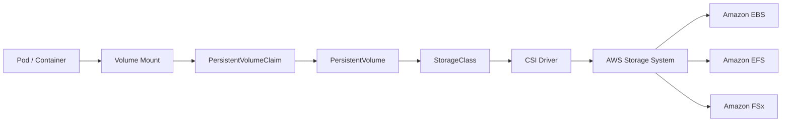
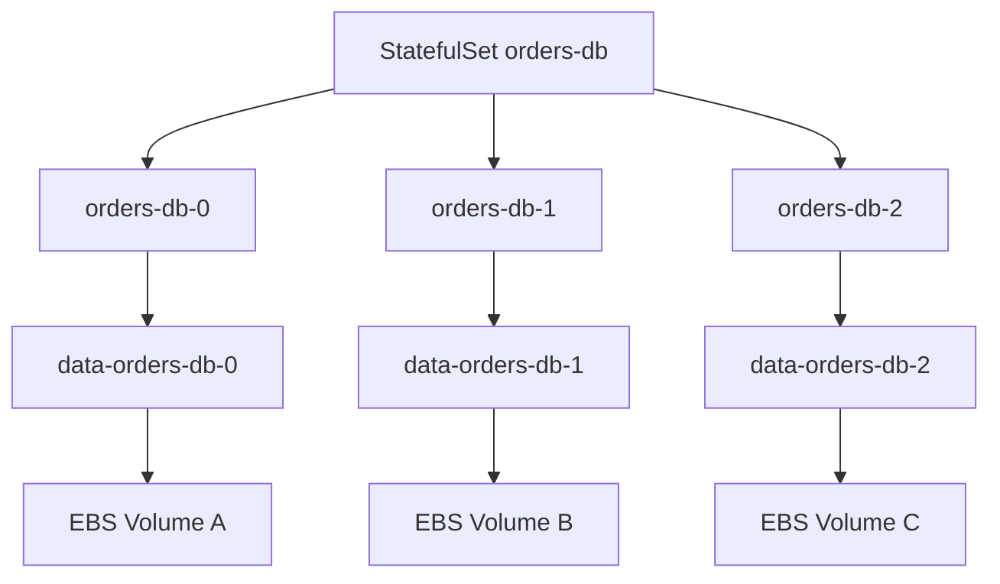
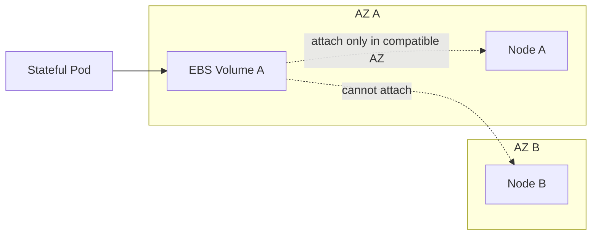

# Part 041 — EKS Storage for Stateful Workloads

Most Kubernetes tutorials treat storage as a YAML problem:

> create a `StorageClass`, create a `PersistentVolumeClaim`, mount it into a pod.

That is the surface.

Production storage is not a YAML problem. It is a **data ownership problem**.

A stateless pod can disappear and come back somewhere else. A stateful pod can disappear too, but its data must survive, remain consistent, reattach correctly, stay recoverable, and still obey latency, durability, compliance, and cost constraints.

This part builds the storage mental model for Amazon EKS.

We will cover:

- when state belongs inside Kubernetes and when it should not
- Kubernetes PV/PVC/StorageClass/StatefulSet mechanics
- Amazon EBS for block storage
- Amazon EFS for shared file storage
- Amazon FSx options for high-performance and enterprise file workloads
- topology, Availability Zone, and scheduling implications
- backup, restore, snapshot, clone, migration, and disaster recovery
- Java service design around persistent state
- operational runbooks for storage incidents

The goal is not to memorize every storage option. The goal is to know which invariant each option protects and which failure mode it introduces.

---

## 1. The Core Mental Model

A container filesystem is disposable.

A persistent workload needs an external storage contract.



The Kubernetes storage API separates four concerns:

| Concern | Kubernetes Object | Meaning |
|---|---|---|
| Application needs storage | `PersistentVolumeClaim` | “I need 100Gi, RWO, class gp3.” |
| Cluster provides storage | `PersistentVolume` | “This concrete volume satisfies a claim.” |
| Storage provisioning policy | `StorageClass` | “Use this driver, this type, this reclaim policy.” |
| Storage provider implementation | CSI driver | “Translate Kubernetes request into AWS API calls.” |

The key distinction:

```txt
Pod lifecycle != data lifecycle
```

Pods are ephemeral. PersistentVolumes have a lifecycle independent of the pod. That separation is what makes persistent storage possible, but it also creates a new class of failure: the pod may recover while the data does not, or the data may survive while the application state machine is no longer safe.

---

## 2. First Principle: Should This State Be in EKS?

Before selecting EBS, EFS, or FSx, ask a harder question:

> Should this stateful component run inside Kubernetes at all?

For many production systems, the correct answer is still:

- use Amazon RDS/Aurora for relational databases
- use DynamoDB for key-value/document access patterns
- use ElastiCache/MemoryDB for cache/stateful in-memory data
- use OpenSearch Service for search
- use MSK/Kinesis/SQS for durable stream/queue workloads
- use S3 for object storage

Running stateful infrastructure inside EKS is justified when you need one or more of these:

| Reason | Example |
|---|---|
| Custom engine/operator | Cassandra, Kafka, ClickHouse, OpenSearch with custom plugins |
| Workload-local state | Lucene index shard, model cache, queue segment, tenant-local store |
| Tight application lifecycle coupling | Stateful sidecar, embedded storage engine, workflow executor with local journal |
| Data plane portability | Same workload across cloud/on-prem clusters |
| Performance locality | Low-latency block storage attached near compute |
| Specialized filesystem semantics | Shared POSIX filesystem, HPC scratch space |
| Regulatory isolation | Per-tenant/stateful pod ownership boundary |

But the price is high:

- upgrades become harder
- backup/restore becomes your responsibility
- failover is application-specific
- data corruption is harder to automate away
- scheduling is constrained by storage topology
- observability must include storage health
- incident recovery now involves both Kubernetes and storage systems

A top-level rule:

> Put state in EKS only when the operational control you gain is worth the operational burden you inherit.

---

## 3. Storage Taxonomy on EKS

A useful taxonomy is based on access pattern, not service name.

| Access Pattern | Kubernetes Mode | AWS Option | Good Fit |
|---|---|---|---|
| Single-writer block | `ReadWriteOnce` | EBS | Databases, queues, logs, indexes |
| Shared POSIX file | `ReadWriteMany` | EFS | Shared uploads, CMS files, home dirs, low/medium throughput shared files |
| High-throughput parallel file | `ReadWriteMany` / CSI-specific | FSx for Lustre | ML/HPC/media pipelines, S3-backed fast scratch |
| Enterprise NAS semantics | NFS/SMB through CSI | FSx for NetApp ONTAP | Shared enterprise file workloads, snapshots, clones, multi-protocol needs |
| Object-style data | Not usually PV-first | S3 SDK / Mountpoint patterns | Durable object data, large immutable blobs |
| Ephemeral cache | `emptyDir`, local ephemeral | Node/pod local | Rebuildable temp/cache data |

The dangerous mistake is to treat all persistent volumes as interchangeable.

They are not.

Storage options differ on:

- attach model
- access mode
- latency
- throughput
- AZ behavior
- failure domain
- backup model
- scaling model
- cost model
- security boundary
- operational tooling

---

## 4. Kubernetes Storage Objects

### 4.1 PersistentVolume

A `PersistentVolume` is a cluster resource that points to concrete storage.

It may be:

- statically provisioned by an administrator
- dynamically provisioned by a CSI driver using a `StorageClass`

A PV survives pod restart. Depending on reclaim policy, it may also survive PVC deletion.

### 4.2 PersistentVolumeClaim

A `PersistentVolumeClaim` is the application’s request for storage.

Example:

```yaml
apiVersion: v1
kind: PersistentVolumeClaim
metadata:
  name: data-orders-0
spec:
  accessModes:
    - ReadWriteOnce
  storageClassName: gp3-encrypted
  resources:
    requests:
      storage: 100Gi
```

A claim says:

- how large the volume should be
- which access mode it needs
- which storage class should satisfy it
- optionally, which existing volume it should bind to

### 4.3 StorageClass

A `StorageClass` is the provisioning policy.

Example for EBS gp3:

```yaml
apiVersion: storage.k8s.io/v1
kind: StorageClass
metadata:
  name: gp3-encrypted
provisioner: ebs.csi.aws.com
parameters:
  type: gp3
  encrypted: "true"
volumeBindingMode: WaitForFirstConsumer
allowVolumeExpansion: true
reclaimPolicy: Retain
```

The important fields are not decorative:

| Field | Why It Matters |
|---|---|
| `provisioner` | Selects the CSI driver. |
| `parameters` | Maps to AWS storage settings. |
| `volumeBindingMode` | Controls when topology-specific storage is provisioned. |
| `allowVolumeExpansion` | Allows online or controlled expansion depending on driver/filesystem. |
| `reclaimPolicy` | Determines whether storage is deleted when PVC is deleted. |

### 4.4 `WaitForFirstConsumer`

For zonal storage like EBS, this field is critical.

```yaml
volumeBindingMode: WaitForFirstConsumer
```

Without it, Kubernetes may provision a volume in an Availability Zone before it knows where the pod can run. Then the scheduler may be unable to place the pod on a node that can attach the volume.

With `WaitForFirstConsumer`, Kubernetes waits until it understands the pod scheduling context before binding/provisioning storage.

Mental model:

```txt
Immediate binding:
PVC -> volume now -> maybe wrong AZ

WaitForFirstConsumer:
Pod scheduling constraints -> choose node/AZ -> provision compatible volume
```

For EKS production clusters, `WaitForFirstConsumer` is usually the safer default for EBS-backed storage classes.

---

## 5. StatefulSet: Stable Identity for Stateful Pods

A `Deployment` manages interchangeable pods.

A `StatefulSet` manages pods with stable identity.



StatefulSet gives you:

- stable pod names
- stable ordinal identity
- stable network identity through a headless service
- stable storage mapping through `volumeClaimTemplates`
- ordered rollout and scale behavior

Example:

```yaml
apiVersion: apps/v1
kind: StatefulSet
metadata:
  name: orders-ledger
spec:
  serviceName: orders-ledger
  replicas: 3
  selector:
    matchLabels:
      app: orders-ledger
  template:
    metadata:
      labels:
        app: orders-ledger
    spec:
      containers:
        - name: ledger
          image: 111122223333.dkr.ecr.ap-southeast-1.amazonaws.com/orders-ledger@sha256:...
          ports:
            - containerPort: 8080
          volumeMounts:
            - name: data
              mountPath: /var/lib/orders-ledger
  volumeClaimTemplates:
    - metadata:
        name: data
      spec:
        accessModes:
          - ReadWriteOnce
        storageClassName: gp3-encrypted
        resources:
          requests:
            storage: 100Gi
```

The claim name is generated from:

```txt
<volumeClaimTemplateName>-<statefulSetName>-<ordinal>
```

Example:

```txt
data-orders-ledger-0
data-orders-ledger-1
data-orders-ledger-2
```

This matters during recovery. You need to know which PVC belongs to which ordinal.

---

## 6. Amazon EBS on EKS

Amazon EBS is block storage.

On EKS, the usual integration is the **Amazon EBS CSI driver**.

Use EBS when:

- one pod needs low-latency block storage
- the workload can tolerate single-writer semantics
- the application owns replication or recovery logic
- the volume should be attached to one node at a time
- the access pattern is database-like or log/index-like

Common examples:

- PostgreSQL test/dev instances
- Kafka broker data volumes
- OpenSearch data nodes
- ClickHouse shards
- queue segment stores
- Lucene indexes
- embedded RocksDB state
- local durable journal for workflow engines

### 6.1 EBS Strengths

| Strength | Why It Matters |
|---|---|
| Low-latency block storage | Good for random read/write workloads. |
| Per-volume performance tuning | gp3/io2-style performance choices. |
| Snapshot support | Useful for backup, clone, migration, and DR. |
| Encryption support | KMS-backed encryption policy. |
| Kubernetes dynamic provisioning | PVC can create volumes through CSI. |
| Volume expansion | Can grow volumes as data grows. |

### 6.2 EBS Constraints

| Constraint | Production Consequence |
|---|---|
| Zonal storage | Pod must run in the same AZ as the volume. |
| Usually single-node attach for Kubernetes workloads | Not a shared filesystem. |
| Failover is not automatic application correctness | Reattaching volume does not guarantee database consistency. |
| Snapshot is crash-consistent unless coordinated | Application-consistent backup needs app involvement. |
| Node drain can be slow | Detach/attach and app recovery take time. |
| Scale-out needs sharding/replication | You cannot simply mount one EBS volume to many writers. |

The most common EBS scheduling failure is this:

```txt
PVC bound to volume in AZ-a
pod scheduled to node in AZ-b
volume cannot attach
pod remains Pending or stuck in attach errors
```

That is why `WaitForFirstConsumer`, node topology, and StatefulSet scheduling are not optional details.

### 6.3 Recommended StorageClass Baseline

```yaml
apiVersion: storage.k8s.io/v1
kind: StorageClass
metadata:
  name: gp3-encrypted-retain
provisioner: ebs.csi.aws.com
parameters:
  type: gp3
  encrypted: "true"
volumeBindingMode: WaitForFirstConsumer
allowVolumeExpansion: true
reclaimPolicy: Retain
```

Why `Retain`?

Because accidental PVC deletion should not automatically destroy production data.

For ephemeral test environments, `Delete` may be fine. For production state, `Retain` is safer, but it creates cleanup responsibility.

### 6.4 StatefulSet With EBS

```yaml
apiVersion: v1
kind: Service
metadata:
  name: ledger
spec:
  clusterIP: None
  selector:
    app: ledger
  ports:
    - port: 8080
      name: http
---
apiVersion: apps/v1
kind: StatefulSet
metadata:
  name: ledger
spec:
  serviceName: ledger
  replicas: 3
  selector:
    matchLabels:
      app: ledger
  template:
    metadata:
      labels:
        app: ledger
    spec:
      terminationGracePeriodSeconds: 60
      containers:
        - name: app
          image: example.com/ledger:1.0.0
          ports:
            - name: http
              containerPort: 8080
          readinessProbe:
            httpGet:
              path: /ready
              port: http
            periodSeconds: 5
          livenessProbe:
            httpGet:
              path: /live
              port: http
            periodSeconds: 10
          volumeMounts:
            - name: data
              mountPath: /var/lib/ledger
  volumeClaimTemplates:
    - metadata:
        name: data
      spec:
        accessModes:
          - ReadWriteOnce
        storageClassName: gp3-encrypted-retain
        resources:
          requests:
            storage: 100Gi
```

Important detail:

```yaml
terminationGracePeriodSeconds: 60
```

A stateful process needs time to flush, close, checkpoint, relinquish leadership, and stop accepting writes.

A default grace period may not be enough.

---

## 7. Amazon EFS on EKS

Amazon EFS is shared file storage.

On EKS, the usual integration is the **Amazon EFS CSI driver**.

Use EFS when:

- multiple pods need to share files
- the workload expects POSIX-like file semantics
- data should be accessible across multiple nodes and AZs
- you do not want to pre-provision storage capacity
- throughput/latency profile fits a network filesystem

Common examples:

- shared uploaded files
- CMS/static content authoring
- report artifacts
- notebook/home directory workloads
- shared plugin/config directory
- low/medium throughput shared filesystem needs

### 7.1 EFS Strengths

| Strength | Why It Matters |
|---|---|
| Shared access | Multiple pods can mount the same filesystem. |
| Multi-AZ access | Useful for workloads spread across AZs. |
| Elastic capacity | Grows and shrinks with usage. |
| No volume attach scheduling problem | Not bound like EBS volume attachment. |
| Access Points | Can isolate application paths and POSIX identity. |

### 7.2 EFS Constraints

| Constraint | Production Consequence |
|---|---|
| Network filesystem latency | Not ideal for latency-sensitive database storage. |
| File locking semantics need validation | Application must be tested under concurrency. |
| Throughput mode matters | Shared high-throughput workloads can bottleneck. |
| Small-file workload can surprise you | Metadata-heavy workloads need testing. |
| Security config matters | Mount target SG, access point, encryption, IAM. |
| Fargate provisioning behavior differs | Static/dynamic provisioning constraints must be checked. |

Do not use EFS just because you want “easy shared storage.”

Shared filesystems make coordination bugs easier to create:

- two pods write same file
- rename is assumed atomic across workflows that do not handle failure
- file lock is ignored or not portable
- one noisy pod affects others
- stale file state becomes application state

### 7.3 EFS StorageClass With Access Points

Example conceptually:

```yaml
apiVersion: storage.k8s.io/v1
kind: StorageClass
metadata:
  name: efs-ap
provisioner: efs.csi.aws.com
parameters:
  provisioningMode: efs-ap
  fileSystemId: fs-1234567890abcdef0
  directoryPerms: "700"
reclaimPolicy: Retain
volumeBindingMode: Immediate
```

Then:

```yaml
apiVersion: v1
kind: PersistentVolumeClaim
metadata:
  name: shared-reports
spec:
  accessModes:
    - ReadWriteMany
  storageClassName: efs-ap
  resources:
    requests:
      storage: 5Gi
```

For EFS, the requested size in PVC is less about provisioning fixed disk and more about Kubernetes scheduling/accounting contract.

### 7.4 EFS for Application Artifacts

A good EFS use case:

```txt
API pods upload files -> EFS shared path -> worker pods process files -> archive to S3
```

A better design is often:

```txt
API pods upload files -> S3 -> event -> workers process object -> S3 result
```

EFS is useful when the application truly requires filesystem semantics. If object semantics are enough, S3 is usually a better durability and cost boundary.

---

## 8. Amazon FSx on EKS

FSx is not one storage service. It is a family.

For EKS workloads, common candidates are:

- FSx for Lustre
- FSx for NetApp ONTAP
- FSx for OpenZFS

The right choice depends on filesystem semantics and performance profile.

### 8.1 FSx for Lustre

Use FSx for Lustre when:

- workload needs high-throughput parallel filesystem
- datasets are large
- S3 integration is useful
- compute jobs need fast shared scratch space
- the workload is ML/HPC/media/scientific/financial-modeling style

Typical pattern:

```txt
S3 durable dataset -> FSx for Lustre fast working set -> EKS job/pods -> results back to S3
```

This is not a general-purpose replacement for EFS.

It is a performance-oriented filesystem for workloads that can exploit it.

### 8.2 FSx for NetApp ONTAP

Use FSx for NetApp ONTAP when:

- enterprise NAS features matter
- snapshots/clones/tiering are part of the operating model
- teams already operate NetApp semantics
- workloads need richer shared file behavior than simple EFS patterns
- hybrid/on-prem integration matters

It can be powerful, but it also imports enterprise storage complexity into your platform.

### 8.3 FSx Decision Rule

Use FSx when EFS is too simple or not performant enough, and EBS is not shared enough.

```txt
Need one writer, block semantics -> EBS
Need simple shared POSIX files -> EFS
Need high-performance parallel filesystem -> FSx for Lustre
Need enterprise NAS features -> FSx for NetApp ONTAP
Need object durability and event integration -> S3, not PV
```

---

## 9. Access Modes: The Contract Most Engineers Ignore

Kubernetes access modes are not just labels.

| Access Mode | Meaning |
|---|---|
| `ReadWriteOnce` | Mounted read-write by a single node. |
| `ReadOnlyMany` | Mounted read-only by many nodes. |
| `ReadWriteMany` | Mounted read-write by many nodes. |
| `ReadWriteOncePod` | Mounted read-write by a single pod. |

The trap:

```txt
Access mode says what Kubernetes/storage can support.
It does not say your application is concurrency-safe.
```

`ReadWriteMany` does not make your app safe for multiple writers.

If two pods write the same logical record through a shared filesystem, correctness is your application’s problem.

---

## 10. Topology and Scheduling

Storage affects scheduling.

For stateless pods, a pod can usually run on any compatible node.

For EBS-backed pods, a pod must run where its volume can attach.



This matters for:

- node group design
- Karpenter NodePool constraints
- topology spread constraints
- StatefulSet replication strategy
- PodDisruptionBudget
- cluster upgrades
- AZ outage behavior

### 10.1 Stateful Replicas Across AZs

For replicated stateful systems, spread replicas across AZs intentionally.

Example:

```yaml
topologySpreadConstraints:
  - maxSkew: 1
    topologyKey: topology.kubernetes.io/zone
    whenUnsatisfiable: DoNotSchedule
    labelSelector:
      matchLabels:
        app: ledger
```

But do not add topology spread blindly.

If storage is already bound to a specific AZ, topology constraints can conflict with volume topology.

### 10.2 Node Drain and Storage

During node drain:

1. pod receives termination
2. application should stop accepting writes
3. application flushes/checkpoints
4. pod exits
5. volume detaches
6. replacement pod schedules
7. volume attaches
8. application recovers
9. readiness returns true

This can be minutes, not seconds.

If your PDB, rollout, and SLO assume stateless restart speed, you will cause an outage.

---

## 11. Backup, Snapshot, Restore

Persistent volumes are not a backup strategy.

Replication is not a backup strategy.

Snapshots are not automatically application-consistent.

A backup strategy must answer:

- what data is protected?
- how often?
- where is it stored?
- how long is it retained?
- who can delete it?
- how is restore tested?
- what is the RPO?
- what is the RTO?
- does restore preserve identity, metadata, secrets, and application compatibility?

### 11.1 Crash-Consistent vs Application-Consistent

A storage-level snapshot can be crash-consistent.

That means it resembles the disk after sudden power loss.

Some systems recover from that safely. Others require:

- flush
- checkpoint
- fsync
- write quiescing
- database backup mode
- transaction log coordination
- application hook

For serious state, backup must integrate with the application.

### 11.2 Kubernetes VolumeSnapshot

The CSI snapshot model usually involves:

- `VolumeSnapshotClass`
- `VolumeSnapshot`
- snapshot controller
- CSI driver support

Conceptual example:

```yaml
apiVersion: snapshot.storage.k8s.io/v1
kind: VolumeSnapshotClass
metadata:
  name: ebs-snapshot-class
driver: ebs.csi.aws.com
deletionPolicy: Retain
---
apiVersion: snapshot.storage.k8s.io/v1
kind: VolumeSnapshot
metadata:
  name: ledger-data-snapshot
spec:
  volumeSnapshotClassName: ebs-snapshot-class
  source:
    persistentVolumeClaimName: data-ledger-0
```

Restore into a new PVC:

```yaml
apiVersion: v1
kind: PersistentVolumeClaim
metadata:
  name: data-ledger-restore
spec:
  storageClassName: gp3-encrypted-retain
  dataSource:
    name: ledger-data-snapshot
    kind: VolumeSnapshot
    apiGroup: snapshot.storage.k8s.io
  accessModes:
    - ReadWriteOnce
  resources:
    requests:
      storage: 100Gi
```

### 11.3 Backup Tooling

Common layers:

| Layer | Tooling |
|---|---|
| Volume snapshot | CSI snapshots, EBS snapshots |
| Kubernetes metadata | Velero, GitOps source of truth |
| Application backup | DB-native backup, log shipping, export job |
| Object durability | S3 versioning/Object Lock where appropriate |
| Disaster recovery | Cross-region copy, restore playbook, DR drills |

Do not rely on one layer.

For example:

- PV snapshot without Kubernetes metadata may be hard to reconnect
- Kubernetes YAML without data is useless
- DB dump without WAL/log continuity may violate RPO
- backup without restore drill is a wish

---

## 12. Reclaim Policy: `Delete` vs `Retain`

`reclaimPolicy` decides what happens to the underlying PV when the PVC is deleted.

| Policy | Behavior | Use Case |
|---|---|---|
| `Delete` | Underlying storage deleted when claim is deleted | Ephemeral/dev/test |
| `Retain` | Underlying storage retained | Production data safety |

Production default should usually be `Retain`.

But `Retain` creates operational debt:

- orphaned volumes
- orphaned snapshots
- cost leakage
- manual recovery/cleanup process
- need for tagging and ownership metadata

A good platform has:

- tags for app/team/environment/data-classification
- cleanup workflow
- approval gates for destructive actions
- backup-before-delete policy
- cost dashboard for orphaned volumes

---

## 13. Volume Expansion and Migration

Storage always grows.

A production storage strategy must include expansion.

### 13.1 Expansion Flow

Typical PVC expansion:

```yaml
spec:
  resources:
    requests:
      storage: 200Gi
```

Then check:

```bash
kubectl get pvc data-ledger-0
kubectl describe pvc data-ledger-0
kubectl describe pod ledger-0
```

Expansion depends on:

- CSI driver support
- filesystem support
- storage backend behavior
- whether pod restart is needed
- whether application must reload capacity

Important invariant:

> Expanding storage capacity does not automatically fix write amplification, index bloat, poor compaction, bad partitioning, or runaway data retention.

### 13.2 Migration Patterns

| Migration | Pattern |
|---|---|
| gp2 to gp3 | Modify storage class for new PVCs; snapshot/restore or driver-supported modification for existing volumes. |
| Small to large volume | PVC expansion if supported. |
| EBS to EFS | Application-level copy and semantic validation. |
| EFS to S3 | Object migration, path-to-key mapping, event model change. |
| StatefulSet app version change | Ordered rollout with backup and compatibility check. |
| AZ migration | Snapshot/restore or application replication. |
| Cluster migration | Backup metadata + data; restore and validate identity. |

Storage migration is never “just copy files” unless the application semantics are trivial.

You must preserve:

- permissions
- ownership
- timestamps if relevant
- locks/leases state
- write ordering
- application metadata
- encryption/KMS access
- identity mapping
- network path

---

## 14. Security Model

Storage security is not only encryption.

It includes:

- who can create volumes?
- who can mount volumes?
- who can read snapshots?
- who can restore from snapshot?
- who can delete data?
- who can change reclaim policy?
- who can change StorageClass?
- who can exec into pods with mounted secrets/data?
- what KMS key protects the volume?
- does backup copy preserve encryption and access boundaries?

### 14.1 EBS Security

Control points:

- EBS volume encryption
- KMS key policy
- CSI driver IAM role
- snapshot sharing policy
- Kubernetes RBAC for PVC/PV/VolumeSnapshot
- node IAM permissions
- pod-level access to mounted files

### 14.2 EFS Security

Control points:

- mount target security groups
- encryption in transit
- encryption at rest
- access points
- POSIX UID/GID enforcement
- IAM authorization where configured
- network segmentation

### 14.3 FSx Security

Control points vary by FSx type:

- filesystem encryption
- network security groups
- directory/identity integration for some modes
- snapshot/backup permissions
- CSI driver permissions
- protocol-level auth semantics

### 14.4 Kubernetes RBAC

Do not allow every app team to mutate cluster-level storage resources.

Separate:

| Role | Allowed |
|---|---|
| Platform admin | StorageClass, CSI driver, cluster-wide policy |
| App deployer | PVC in namespace, workload manifests |
| Operator | Snapshot/restore under controlled process |
| Read-only reviewer | Inspect PVC/PV status, no data access |

A PVC is not just infrastructure. It is a data access handle.

---

## 15. Observability for Storage

Stateful workloads need a storage dashboard.

Minimum signals:

| Signal | Why It Matters |
|---|---|
| PVC usage | Prevent full disk incidents. |
| Volume IOPS/throughput | Detect saturation. |
| Volume latency | Directly affects app latency. |
| Filesystem free space | App sees filesystem, not cloud object. |
| Attach/detach errors | Explain Pending pods. |
| Snapshot success/failure | Backup reliability. |
| Restore test status | Real recoverability. |
| Node disk pressure | Can evict pods or break kubelet behavior. |
| CSI driver health | Storage provisioning/control plane health. |
| App-level compaction/backlog | Storage pressure often comes from app internals. |

For Java services, expose:

- disk usage for mounted paths
- write latency histograms
- fsync/checkpoint duration if relevant
- queue/journal depth
- compaction metrics
- snapshot hook duration
- startup recovery duration
- readiness reason if recovering from local state

Example readiness logic:

```java
if (!storageMounted()) return Readiness.down("storage_not_mounted");
if (recoveryInProgress()) return Readiness.down("state_recovery_in_progress");
if (diskFreePercent() < 5) return Readiness.down("disk_almost_full");
return Readiness.up();
```

Do not mark a stateful pod ready just because the HTTP server is listening.

---

## 16. Java Application Design for Stateful Volumes

Java services often assume the filesystem is simple.

In containers, that assumption fails quickly.

### 16.1 Filesystem Paths

Bad:

```java
Path data = Paths.get("./data");
```

Better:

```java
Path data = Paths.get(System.getenv().getOrDefault("APP_DATA_DIR", "/var/lib/app"));
```

Then validate at startup:

```java
Files.createDirectories(data);
if (!Files.isWritable(data)) {
    throw new IllegalStateException("Data directory is not writable: " + data);
}
```

### 16.2 Graceful Shutdown

Stateful shutdown should:

1. fail readiness
2. stop accepting new writes
3. drain in-flight operations
4. flush buffers
5. checkpoint state
6. release locks/leases
7. close file descriptors
8. exit before Kubernetes grace period expires

Pseudo-flow:

```java
Runtime.getRuntime().addShutdownHook(new Thread(() -> {
    readiness.markNotReady("shutdown");
    writer.stopAcceptingWrites();
    inflight.await(Duration.ofSeconds(20));
    journal.flushAndFsync();
    checkpoints.writeFinalCheckpoint();
    lock.release();
}));
```

### 16.3 Startup Recovery

Stateful startup should not immediately report ready.

```txt
container starts
mount available
application opens data directory
journal replay begins
index/checksum validation runs
leadership/lease established
readiness becomes true
```

Expose startup recovery time as a metric.

Long recovery time is part of your RTO.

---

## 17. StatefulSet Rollout Strategy

Stateful workloads should roll out more slowly than stateless ones.

```yaml
spec:
  updateStrategy:
    type: RollingUpdate
    rollingUpdate:
      partition: 2
```

Partitioned rollout lets you update higher ordinals first and observe behavior before touching lower ordinals.

Useful pattern:

```txt
update replica 2 -> observe
update replica 1 -> observe
update replica 0 -> observe
```

For leader-based systems, avoid accidentally restarting leader first unless the application handles it safely.

### 17.1 PDB for Stateful Workloads

Example:

```yaml
apiVersion: policy/v1
kind: PodDisruptionBudget
metadata:
  name: ledger-pdb
spec:
  maxUnavailable: 1
  selector:
    matchLabels:
      app: ledger
```

A PDB protects against voluntary disruptions such as node drains. It does not protect against all failures.

Do not set a PDB that prevents necessary maintenance forever.

Bad:

```yaml
minAvailable: 3
```

for a 3-replica StatefulSet that cannot tolerate any voluntary disruption. You may block node upgrades.

Better:

- understand quorum
- understand recovery time
- allow safe disruption
- test node drain
- document emergency override

---

## 18. Common Anti-Patterns

### Anti-Pattern 1: EFS for a Database

A network filesystem is not automatically safe for database workloads.

Some databases require block-level semantics, fsync behavior, and latency assumptions that EFS may not satisfy.

Better:

- use managed database
- use EBS with database/operator semantics
- verify support matrix from database vendor

### Anti-Pattern 2: `Delete` Reclaim Policy for Production Data

This turns a Kubernetes object deletion into a data deletion.

Better:

- `Retain`
- backup before destructive changes
- explicit deletion workflow

### Anti-Pattern 3: No Restore Test

Backup without restore test is theater.

Better:

- scheduled restore drill
- automated verification job
- checksum/business validation
- documented RTO/RPO

### Anti-Pattern 4: One Shared RWX Volume for Everything

This creates hidden coupling across services.

Better:

- per-application access point/path
- object storage for object workflows
- event-driven handoff
- clear ownership boundary

### Anti-Pattern 5: Ignoring AZ Topology

A StatefulSet with EBS volumes can fail to reschedule if nodes/capacity are not available in the right AZ.

Better:

- multi-AZ node capacity
- `WaitForFirstConsumer`
- topology-aware scheduling
- Karpenter/NodePool design aligned with storage

### Anti-Pattern 6: Treating Storage as Infinite

Elastic does not mean free. Large volumes, snapshots, backup retention, and filesystem growth can become major cost centers.

Better:

- retention policy
- compaction
- lifecycle management
- right-sizing
- alerting
- orphan cleanup

---

## 19. Failure Modes and Runbooks

### 19.1 Pod Pending Because Volume Cannot Attach

Symptoms:

```bash
kubectl get pod
kubectl describe pod <pod>
kubectl describe pvc <pvc>
```

Look for:

- volume node affinity conflict
- no node in volume AZ
- attach limit reached
- CSI driver issue
- node not ready
- volume already attached elsewhere

Runbook:

1. Identify PVC and PV.
2. Identify volume ID and AZ.
3. Check pod node selector/affinity/topology constraints.
4. Check available nodes in the volume AZ.
5. Check Karpenter/Cluster Autoscaler events.
6. Check CSI controller logs.
7. If volume is stuck attached, verify node state and cloud attachment.
8. Do not force detach until application consistency risk is understood.

### 19.2 Disk Full

Symptoms:

- write failures
- application errors
- readiness failure
- compaction failure
- pod restart loop

Runbook:

1. Confirm filesystem usage from inside pod.
2. Confirm PVC size.
3. Identify top paths.
4. Check retention/compaction/backlog.
5. Expand PVC if safe and supported.
6. Delete only data that application declares safe to delete.
7. Add alerts and retention guardrails.

Emergency command example:

```bash
kubectl exec -it ledger-0 -- df -h /var/lib/ledger
kubectl exec -it ledger-0 -- du -h /var/lib/ledger | sort -h | tail -50
```

### 19.3 Snapshot Failing

Runbook:

1. Check `VolumeSnapshot` status.
2. Check snapshot controller.
3. Check CSI driver logs.
4. Check IAM permissions.
5. Check AWS snapshot limits/quotas.
6. Check whether PVC exists and is bound.
7. Check whether application hook failed.

### 19.4 Restore Fails

Runbook:

1. Verify snapshot exists and is completed.
2. Create isolated namespace.
3. Restore PVC from snapshot.
4. Start single recovery pod.
5. Run app-level validation.
6. Compare expected metadata/checksums/business counts.
7. Only then attach to service path.

Never test restore by overwriting production first.

### 19.5 StatefulSet Stuck During Rollout

Runbook:

1. Identify ordinal stuck.
2. Check pod events.
3. Check PVC binding.
4. Check readiness reason.
5. Check application recovery logs.
6. Check volume attach/detach.
7. Check PDB and disruption.
8. Pause rollout if necessary.
9. Roll back only after data compatibility is understood.

Rollback with data is not the same as rollback without data.

A binary rollback may not be safe if the new version migrated the on-disk format.

---

## 20. Design Review Checklist

Use this checklist before approving a stateful EKS workload.

### 20.1 State Justification

- Why is state running in EKS instead of a managed AWS data service?
- Who owns backup and restore?
- What is the RPO?
- What is the RTO?
- Is the application operator mature enough?
- What happens during cluster upgrade?

### 20.2 Storage Choice

- Is this block, shared file, parallel file, object, or ephemeral state?
- Is access mode correct?
- Is AZ topology understood?
- Is performance model tested?
- Is cost model acceptable?
- Is encryption configured?
- Is reclaim policy safe?

### 20.3 Scheduling

- Are StatefulSet ordinals mapped to PVCs correctly?
- Is `WaitForFirstConsumer` used where needed?
- Are nodes available in each required AZ?
- Does Karpenter/Cluster Autoscaler understand constraints?
- Is PDB safe but not blocking?
- Is graceful shutdown long enough?

### 20.4 Backup and Restore

- Are snapshots configured?
- Are backups application-consistent?
- Are restore drills automated?
- Is backup deletion protected?
- Are backups cross-region if DR requires it?
- Is restore tested with application validation?

### 20.5 Observability

- Are disk usage metrics visible?
- Are latency/IOPS/throughput visible?
- Are CSI driver errors visible?
- Are snapshot failures alerted?
- Is recovery time measured?
- Is storage cost visible?

---

## 21. Lab: EBS-Backed StatefulSet

### 21.1 Create StorageClass

```yaml
apiVersion: storage.k8s.io/v1
kind: StorageClass
metadata:
  name: gp3-retain
provisioner: ebs.csi.aws.com
parameters:
  type: gp3
  encrypted: "true"
reclaimPolicy: Retain
allowVolumeExpansion: true
volumeBindingMode: WaitForFirstConsumer
```

### 21.2 Create StatefulSet

```yaml
apiVersion: v1
kind: Service
metadata:
  name: stateful-demo
spec:
  clusterIP: None
  selector:
    app: stateful-demo
  ports:
    - name: http
      port: 8080
---
apiVersion: apps/v1
kind: StatefulSet
metadata:
  name: stateful-demo
spec:
  serviceName: stateful-demo
  replicas: 2
  selector:
    matchLabels:
      app: stateful-demo
  template:
    metadata:
      labels:
        app: stateful-demo
    spec:
      terminationGracePeriodSeconds: 45
      containers:
        - name: app
          image: public.ecr.aws/docker/library/busybox:latest
          command:
            - sh
            - -c
            - |
              while true; do
                date >> /data/heartbeat.log
                sleep 5
              done
          volumeMounts:
            - name: data
              mountPath: /data
  volumeClaimTemplates:
    - metadata:
        name: data
      spec:
        accessModes:
          - ReadWriteOnce
        storageClassName: gp3-retain
        resources:
          requests:
            storage: 10Gi
```

### 21.3 Observe

```bash
kubectl get pod,pvc,pv
kubectl describe pod stateful-demo-0
kubectl exec stateful-demo-0 -- tail /data/heartbeat.log
```

Delete a pod:

```bash
kubectl delete pod stateful-demo-0
```

Observe that the replacement pod keeps the same identity and remounts the same claim.

### 21.4 Expand PVC

```bash
kubectl patch pvc data-stateful-demo-0 \
  -p '{"spec":{"resources":{"requests":{"storage":"20Gi"}}}}'
```

Then inspect:

```bash
kubectl get pvc data-stateful-demo-0
kubectl describe pvc data-stateful-demo-0
```

---

## 22. Lab: EFS Shared Volume Pattern

Use this when multiple pods need shared file access.

### 22.1 Conceptual StorageClass

```yaml
apiVersion: storage.k8s.io/v1
kind: StorageClass
metadata:
  name: efs-shared
provisioner: efs.csi.aws.com
parameters:
  provisioningMode: efs-ap
  fileSystemId: fs-xxxxxxxxxxxxxxxxx
  directoryPerms: "700"
reclaimPolicy: Retain
```

### 22.2 Shared PVC

```yaml
apiVersion: v1
kind: PersistentVolumeClaim
metadata:
  name: shared-data
spec:
  accessModes:
    - ReadWriteMany
  storageClassName: efs-shared
  resources:
    requests:
      storage: 5Gi
```

### 22.3 Multiple Pods Mount the Same PVC

```yaml
apiVersion: apps/v1
kind: Deployment
metadata:
  name: shared-writer
spec:
  replicas: 2
  selector:
    matchLabels:
      app: shared-writer
  template:
    metadata:
      labels:
        app: shared-writer
    spec:
      containers:
        - name: writer
          image: public.ecr.aws/docker/library/busybox:latest
          command:
            - sh
            - -c
            - |
              while true; do
                echo "$(hostname) $(date)" >> /shared/out.log
                sleep 5
              done
          volumeMounts:
            - name: shared
              mountPath: /shared
      volumes:
        - name: shared
          persistentVolumeClaim:
            claimName: shared-data
```

Now ask the real production question:

> Is app-level concurrent write behavior safe?

The storage can support sharing. Your application still must support it correctly.

---

## 23. Production Heuristics

1. Prefer managed AWS data services unless there is a strong reason to run state in EKS.
2. Use EBS for single-writer block workloads.
3. Use EFS for shared filesystem workloads, not database-like latency-sensitive storage.
4. Use FSx when EFS/EBS do not match performance or enterprise filesystem requirements.
5. Use `WaitForFirstConsumer` for zonal block storage classes.
6. Use `Retain` for production PV reclaim unless a mature deletion workflow exists.
7. Treat backup and restore as application features, not infrastructure afterthoughts.
8. Test node drain with stateful workloads before production.
9. Measure recovery time as part of SLO design.
10. Never assume `ReadWriteMany` means application-level correctness.

---

## 24. What You Should Be Able to Explain Now

After this part, you should be able to explain:

- why pod lifecycle and data lifecycle must be separated
- when to choose EBS, EFS, FSx, S3, or managed AWS data services
- why StatefulSet exists and how it maps identity to storage
- how PVC, PV, StorageClass, and CSI driver interact
- why `WaitForFirstConsumer` matters for EBS
- why reclaim policy is a production safety decision
- how snapshots differ from application-consistent backups
- how stateful rollout differs from stateless rollout
- how to debug Pending pods caused by volume topology
- why storage correctness is partly a Kubernetes problem and partly an application problem

That is the storage mental model needed before building serious stateful platforms on EKS.
