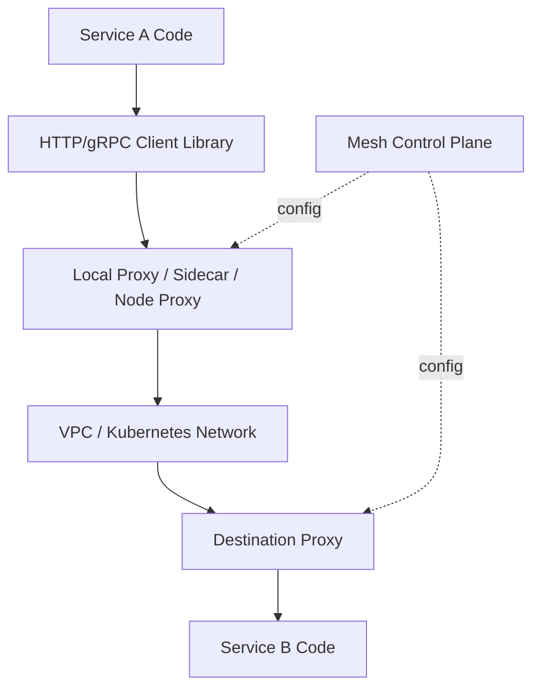
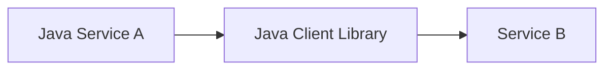
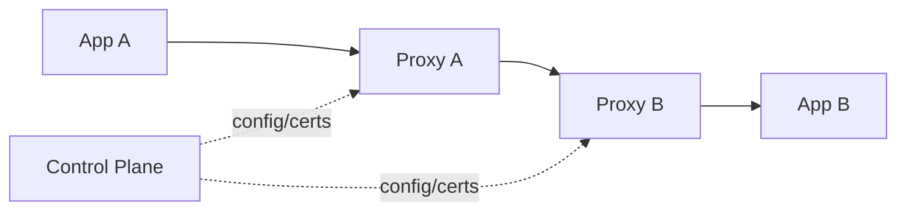
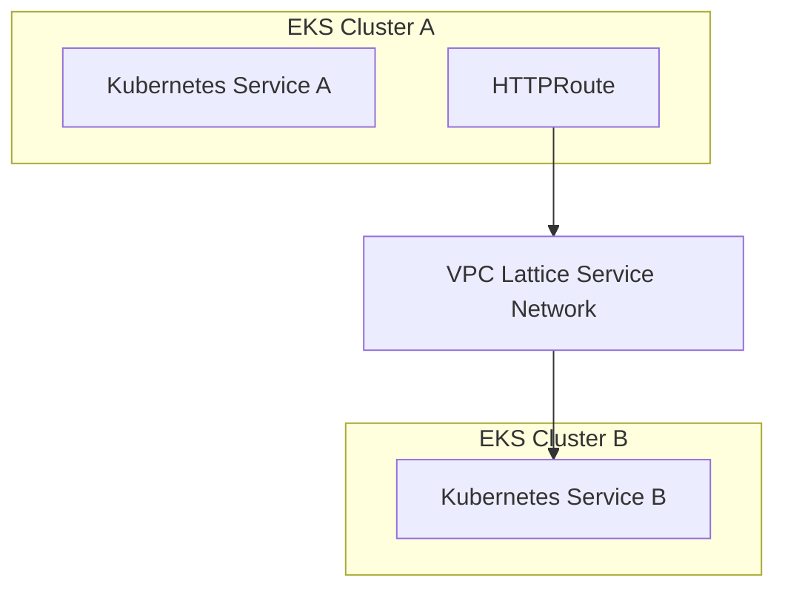
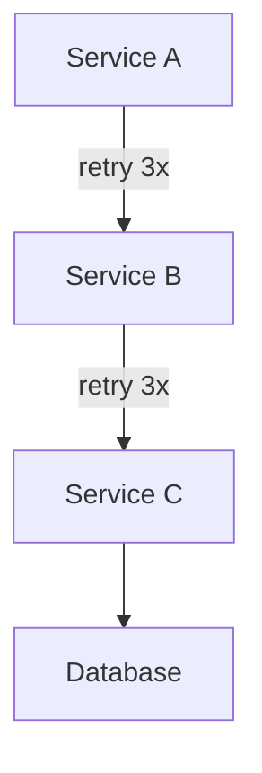
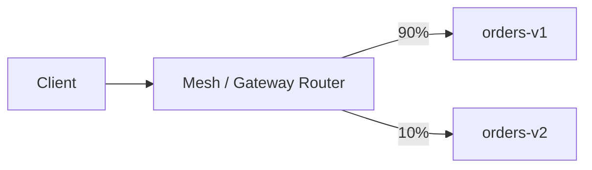
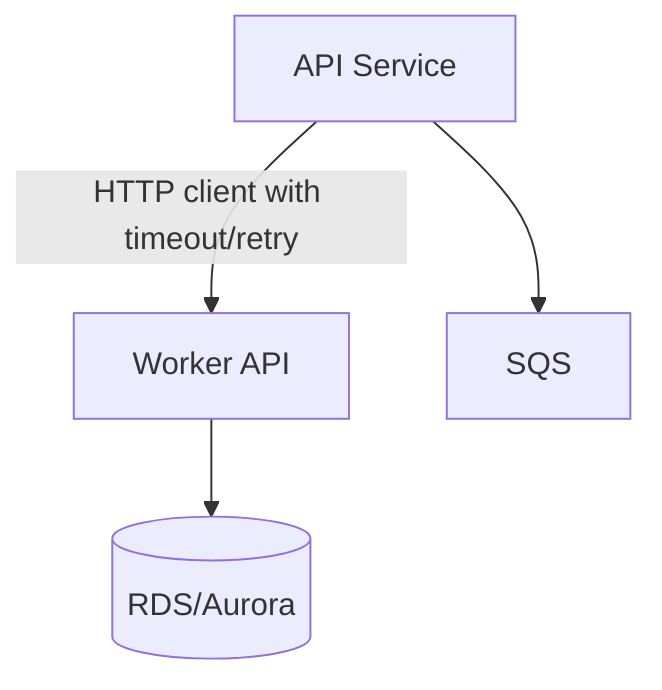
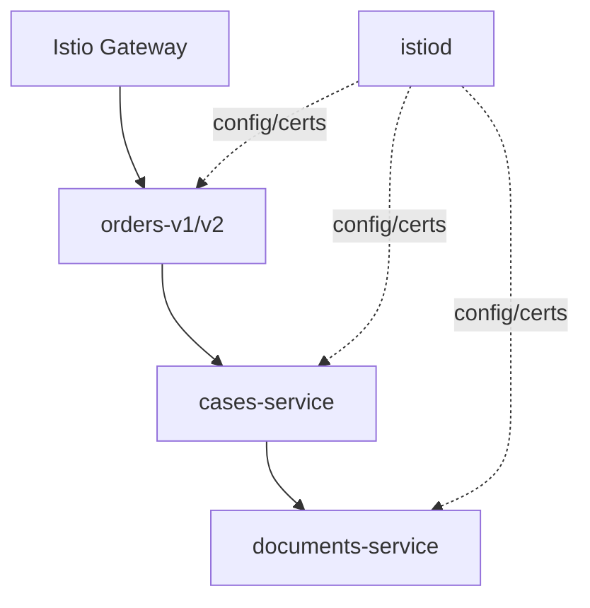
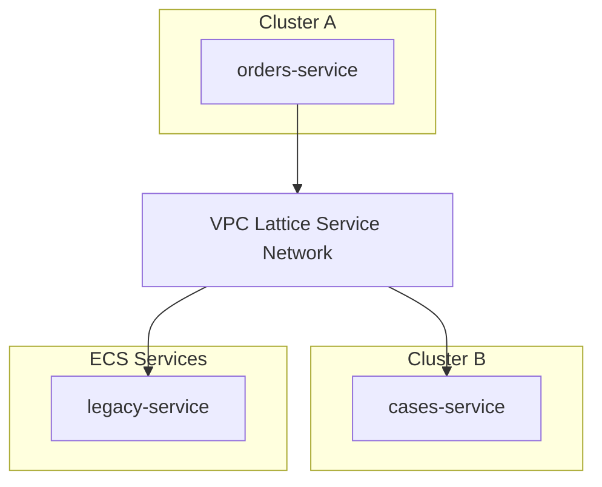
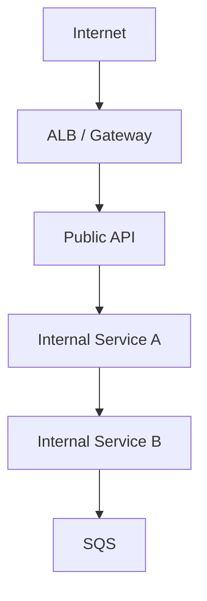

# Part 042 — Service Mesh and Traffic Control

A service mesh is often sold as magic:

- automatic mTLS
- traffic splitting
- retries
- observability
- circuit breaking
- zero-trust service-to-service networking

That is the marketing layer.

The engineering layer is more precise:

> A service mesh inserts a programmable traffic control layer between services.

That traffic control layer can improve reliability and security. It can also create new failure modes, hidden latency, control-plane dependency, policy drift, and operational complexity.

This part teaches service mesh and traffic control for Amazon EKS from first principles.

We will cover:

- what Kubernetes networking gives you by default
- what a mesh adds
- when not to use a mesh
- Istio, Linkerd, Envoy-based designs, and VPC Lattice
- AWS App Mesh status and migration implications
- Gateway API as a traffic control abstraction
- mTLS, retries, timeout, canary, mirroring, circuit breaking
- observability and security implications
- service mesh failure modes and runbooks

This is not a tutorial about installing one mesh. It is a decision and operating model.

---

## 1. Start With the Baseline: What Kubernetes Already Gives You

Before adding a mesh, know what you already have.

Kubernetes gives you:

| Capability | Resource / Mechanism |
|---|---|
| Stable service name | `Service` |
| Pod selection | `selector` |
| Internal load balancing | kube-proxy / dataplane implementation |
| L4 network allow/deny | `NetworkPolicy` with compatible CNI/policy engine |
| External HTTP routing | `Ingress` or Gateway API controllers |
| Pod identity at Kubernetes level | `ServiceAccount` |
| Cloud load balancer integration | AWS Load Balancer Controller / Gateway controller |

What Kubernetes does **not** fully provide by default:

- L7 service-to-service traffic policy
- uniform client-side timeout/retry enforcement
- transparent mTLS between services
- rich per-route telemetry
- traffic splitting inside the cluster without app/client changes
- request mirroring
- circuit breaker/outlier detection
- service identity independent of IP
- cross-cluster service networking abstraction

A mesh lives in this gap.

---

## 2. Traffic Control Mental Model

Traffic between services has several layers.



Without a mesh, most traffic behavior is implemented in each application:

- timeout
- retry
- auth header propagation
- TLS verification
- load balancing choice
- circuit breaker
- telemetry

With a mesh, part of that behavior moves into the infrastructure traffic layer.

That sounds attractive, but it creates a new question:

> Which behavior belongs in app code and which behavior belongs in the mesh?

A good answer is not “everything in the mesh.”

---

## 3. Why Use a Mesh?

Use a mesh when the organization needs consistent service-to-service behavior across many workloads.

Common reasons:

| Need | Mesh Value |
|---|---|
| Service-to-service mTLS | Enforce encryption and identity without every team implementing TLS correctly. |
| Uniform telemetry | Collect request metrics/traces from all services. |
| Progressive delivery | Split traffic between versions using policy. |
| Reliability guardrails | Standardize timeout/retry/circuit-breaker defaults. |
| Zero-trust network | Move from network location trust to workload identity trust. |
| Cross-cluster traffic | Provide common routing and service discovery abstraction. |
| Multi-language platform | Avoid reimplementing policies in Java, Go, Node.js, Python, etc. |

The mesh is a **platform control**.

It makes sense when platform-level consistency matters more than local simplicity.

---

## 4. When Not to Use a Mesh

Do not add a mesh just because the architecture diagram looks more mature.

Avoid or postpone a mesh when:

- you have only a few services
- teams do not yet have basic timeouts/retries/logging right
- incident response maturity is low
- no team owns the mesh control plane
- workloads are mostly async/event-driven
- ALB/API Gateway/EventBridge/SQS already provide the boundary you need
- compliance does not require service-to-service mTLS
- service mesh upgrades would become a platform bottleneck
- you cannot afford extra proxy latency/resource overhead

A useful rule:

> A mesh amplifies platform maturity. It does not create it.

If your organization cannot safely operate Kubernetes add-ons, admission webhooks, certificates, observability, and rollout policy, a mesh may increase risk.

---

## 5. Important AWS Context: App Mesh End of Support

AWS App Mesh used to be the obvious AWS-native answer for service mesh on ECS and EKS.

As of the current AWS documentation, AWS states that App Mesh support ends on **September 30, 2026**. After that date, customers will no longer be able to access the App Mesh console or App Mesh resources.

That means greenfield EKS designs should generally avoid building new strategic platforms on App Mesh.

If you already run App Mesh, treat migration as a production program, not a library upgrade.

Migration candidates include:

- Amazon VPC Lattice for AWS-managed service-to-service networking
- Istio for feature-rich Kubernetes-native mesh
- Linkerd for simpler Kubernetes-focused mesh
- Cilium service mesh / eBPF-oriented traffic control in some environments
- ECS Service Connect for ECS-specific service connectivity
- application library patterns where a full mesh is unnecessary

The decision is not “what replaces App Mesh exactly?”

The decision is:

> Which traffic control capabilities do we actually need, and which platform can provide them with acceptable operational cost?

---

## 6. Service Mesh Capability Map

| Capability | No Mesh | VPC Lattice | Istio | Linkerd | App Library |
|---|---|---|---|---|---|
| Basic service discovery | Kubernetes Service | Yes | Yes | Yes | Client responsibility |
| mTLS | App/team implemented | Service-network model | Strong | Strong/simple | App/team implemented |
| Fine-grained L7 routing | Limited via Ingress/Gateway | Some via service/network policy | Strong | More limited | Client responsibility |
| Canary/traffic split | Ingress/controller-specific | Supported through routing model | Strong | Supported patterns | App/client/pipeline |
| Retries/timeouts | App code | Some policy | Strong | Supported | App code |
| Circuit breaking | App code | Limited/service dependent | Strong | More limited | App code |
| Deep mesh telemetry | App instrumentation | Managed metrics/logging | Strong | Good/simple | App instrumentation |
| Multi-cluster | Manual/varied | Strong AWS-native path | Strong but operational | Possible | Manual |
| Operational complexity | Low | Medium | High | Medium | Distributed across teams |

No option is universally best.

For many AWS-heavy EKS platforms, VPC Lattice is attractive for cross-VPC/cross-cluster service connectivity without running a large in-cluster mesh control plane.

For feature-rich service mesh behavior inside Kubernetes, Istio remains a common choice, but it requires serious platform ownership.

---

## 7. Architecture Models

### 7.1 Library-Based Traffic Control

Each application implements:

- timeout
- retry
- circuit breaker
- TLS
- auth propagation
- metrics



Good when:

- few services
- one main language/framework
- strong platform libraries
- low need for infra-level mTLS

Bad when:

- many languages
- inconsistent teams
- no centralized policy
- compliance needs uniform enforcement

### 7.2 Sidecar Mesh

Each pod gets a proxy sidecar.



Good when:

- need transparent traffic control
- need mTLS and telemetry across many services
- need canary/mirroring/route-level policy

Bad when:

- proxy resource cost is unacceptable
- sidecar lifecycle complicates every pod
- startup/shutdown ordering becomes fragile
- mesh control plane maturity is low

### 7.3 Ambient / Node-Level Data Plane

Some modern meshes explore reducing sidecar overhead by moving parts of traffic handling to node-level or shared proxies.

Good when:

- sidecar overhead is a major concern
- platform team can operate newer mesh modes

Risk:

- operational model may be newer
- feature parity may differ
- debugging path may change

### 7.4 AWS-Managed Application Networking With VPC Lattice

Amazon VPC Lattice provides managed application networking across services, VPCs, and accounts.

With EKS, AWS provides a Gateway API Controller mapping Kubernetes Gateway API resources to VPC Lattice constructs.



Good when:

- cross-cluster connectivity matters
- cross-account/VPC service networking matters
- team wants AWS-managed network layer
- sidecar-heavy mesh is too complex

Less ideal when:

- you need deep in-cluster mesh features
- you need full Istio-like policy set
- you need behavior not modeled by Lattice/Gateway controller

---

## 8. Gateway API as a Better Traffic Abstraction

Kubernetes `Ingress` is useful but limited.

Gateway API gives a richer model:

| Resource | Meaning |
|---|---|
| `GatewayClass` | Type/controller of gateway. |
| `Gateway` | Actual gateway instance/listener boundary. |
| `HTTPRoute` | HTTP routing rules. |
| `GRPCRoute` | gRPC routing rules. |
| `TLSRoute` | TLS routing rules. |
| `ReferenceGrant` | Cross-namespace reference permission. |

Gateway API helps separate roles:

| Role | Owns |
|---|---|
| Platform team | `GatewayClass`, shared gateway policy |
| Infra/network team | Gateway placement, TLS, network boundary |
| App team | Routes for its service |
| Security team | Cross-namespace/reference policy |

This separation is cleaner than one giant Ingress object controlled by everyone.

For EKS, Gateway API can be implemented by different controllers, including AWS controllers for VPC Lattice and load balancing patterns, or mesh-specific controllers.

---

## 9. mTLS: What It Solves and What It Does Not

mTLS means both sides authenticate each other using certificates.

It provides:

- encryption in transit
- service identity verification
- defense against simple network-level impersonation
- foundation for service authorization policy

It does not automatically provide:

- business authorization
- tenant authorization
- data-level access control
- protection against compromised workload identity
- safe retry semantics
- payload validation

Mental model:

```txt
mTLS answers: "Which workload am I talking to?"
Authorization answers: "Is this workload allowed to perform this action on this resource?"
```

Do not confuse the two.

### 9.1 mTLS Rollout Strategy

Unsafe rollout:

```txt
turn on strict mTLS for all namespaces at once
```

Safer rollout:

1. observe current traffic
2. enable permissive mode where supported
3. migrate service by service
4. verify telemetry
5. enforce namespace by namespace
6. add authorization policy
7. test failure and rollback

### 9.2 Certificate Failure Modes

Mesh certificate problems can break all traffic.

Failure modes:

- expired workload certificate
- broken trust root rotation
- sidecar cannot fetch certificate
- clock skew
- mTLS mode mismatch
- service not injected but destination requires mTLS
- control plane unavailable during cert renewal

Runbook must include:

```bash
kubectl get pods -n <mesh-system>
kubectl logs -n <mesh-system> deploy/<control-plane>
kubectl describe pod <app-pod>
kubectl exec <app-pod> -c <proxy> -- <proxy-diagnostic-command>
```

Exact commands vary by mesh.

---

## 10. Timeout, Retry, and Circuit Breaker

A mesh can standardize traffic behavior, but the defaults can be dangerous.

### 10.1 Timeout

Every outbound call needs a deadline.

Bad:

```txt
service A waits forever for service B
threads pile up
connection pools saturate
autoscaler reacts too late
```

Better:

```txt
client timeout < upstream timeout < request budget
```

Example request budget:

```txt
external API SLO: p95 <= 300ms
API gateway timeout: 1s
service A outbound budget to B: 120ms
service B DB budget: 50ms
retry budget: max 1 retry only for safe errors
```

### 10.2 Retry

Retries are not free.

They multiply load.



One original request can become many downstream calls.

Rules:

- retry only idempotent operations
- use small retry count
- use jittered backoff
- respect request deadline
- do not retry overload errors blindly
- use retry budget
- observe retry attempts separately from success rate

### 10.3 Circuit Breaker

Circuit breaker protects downstream and caller.

It should answer:

- when do we stop sending calls?
- how long do we wait?
- how do we probe recovery?
- what fallback do we return?
- what metric/alarm tells humans?

Mesh-level circuit breaking is useful, but business fallback still belongs to the application.

---

## 11. Progressive Delivery With Traffic Control

Traffic control enables progressive rollout.

Common methods:

| Pattern | Meaning |
|---|---|
| Canary | Send small percentage to new version. |
| Linear | Gradually increase traffic. |
| Blue/green | Switch traffic between two full environments. |
| Mirroring/shadow | Copy traffic to new version without affecting response. |
| Header-based routing | Route selected users/tenants/requests. |

### 11.1 Canary Example Model



Canary only helps if you can detect badness quickly.

Required signals:

- error rate by version
- latency by version
- saturation by version
- business metrics by version
- downstream dependency errors by version
- trace sampling by version

Bad canary:

```txt
shift 10% traffic but dashboard aggregates v1 and v2 together
```

Better:

```txt
all telemetry has service.version, deployment.id, route, tenant class
```

### 11.2 Request Mirroring

Mirroring copies live traffic to a shadow service.

Use it for:

- parsing validation
- performance comparison
- compatibility testing
- migration rehearsal

Do not use it casually.

Risks:

- duplicated side effects
- PII exposure
- cost increase
- downstream overload
- false confidence because response is ignored

Shadow service must be side-effect safe.

---

## 12. Mesh Observability

A mesh can provide telemetry even when app code is weak.

Common metrics:

- requests per second
- success/error rate
- latency histogram
- retries
- circuit breaker opens
- mTLS status
- bytes in/out
- upstream/downstream service
- route-level metrics

But mesh telemetry has limits:

- it cannot understand business outcome
- it may not see internal async processing
- it may not see DB query semantics
- it can add high cardinality labels
- it can become expensive

A production platform should combine:

```txt
mesh telemetry + application telemetry + infrastructure telemetry + business telemetry
```

Example label set:

```txt
service.name
service.version
namespace
route
source.workload
destination.workload
response.code
failure.class
```

Avoid unbounded labels:

- user ID
- raw URL with IDs
- request ID as metric label
- tenant ID if cardinality is huge and uncontrolled

---

## 13. Mesh Security Model

Mesh security is layered.

| Layer | Control |
|---|---|
| Network | Security groups, NACLs, NetworkPolicy |
| Workload identity | SPIFFE-like identity, service account, cert identity |
| Transport | mTLS |
| Service authorization | Mesh authorization policy |
| Application authorization | Domain permission checks |
| Data authorization | Row/object/tenant-level checks |
| Audit | Logs/traces/policy decision records |

Do not allow mesh authorization to replace application authorization for business rules.

Example:

```txt
orders-api may call case-service
```

is not the same as:

```txt
this user may modify this enforcement case
```

The first is service authorization. The second is domain authorization.

---

## 14. Mesh Multi-Tenancy

In multi-team EKS clusters, mesh policy needs tenancy design.

Questions:

- Can namespace A create routes to namespace B?
- Can app team modify traffic policy for shared services?
- Who owns mTLS mode?
- Who owns global retry defaults?
- Who can define egress policy?
- Can tenant workloads observe other tenant traffic?
- Who approves cross-namespace references?

Bad design:

```txt
every app team can edit mesh-wide virtual service/gateway/authorization resources
```

Better design:

- platform owns global mesh installation
- app teams own namespace-scoped routes
- cross-namespace references require explicit grants
- sensitive policy changes require review
- telemetry access is namespace-scoped
- global defaults are versioned and released like software

---

## 15. Egress Control

Ingress gets attention. Egress causes incidents.

Without egress control:

- services call unknown external APIs
- data exfiltration risk increases
- retries hit third-party dependencies uncontrollably
- DNS failures are harder to debug
- compliance evidence is weak

Egress policy should define:

- which services can call internet endpoints
- which AWS services are reachable through VPC endpoints
- whether traffic goes through NAT, proxy, or gateway
- how TLS/SNI is validated
- whether payload inspection is required
- how external dependency failures are isolated

Mesh can help with egress policy, but AWS network controls still matter.

For AWS service calls from EKS, prefer VPC endpoints where appropriate to reduce NAT dependency and improve control.

---

## 16. Istio on EKS

Istio is feature-rich and widely used.

Core concepts:

| Concept | Meaning |
|---|---|
| `istiod` | Control plane. |
| Envoy proxy | Data plane proxy. |
| Gateway | Ingress/egress traffic entry. |
| VirtualService | Routing policy. |
| DestinationRule | Destination subsets, traffic policies, TLS. |
| PeerAuthentication | mTLS mode. |
| AuthorizationPolicy | Access policy. |
| Sidecar | Scope/config of sidecar proxy. |

Istio can provide:

- mTLS
- L7 routing
- retries/timeouts
- traffic splitting
- fault injection
- authorization policy
- telemetry
- multi-cluster patterns

But operating Istio requires:

- version upgrade discipline
- CRD lifecycle management
- control-plane monitoring
- sidecar resource sizing
- cert/trust-domain management
- policy governance
- skilled debugging

### 16.1 Istio Example: Traffic Split

Conceptual example:

```yaml
apiVersion: networking.istio.io/v1
kind: VirtualService
metadata:
  name: orders
spec:
  hosts:
    - orders.default.svc.cluster.local
  http:
    - route:
        - destination:
            host: orders.default.svc.cluster.local
            subset: v1
          weight: 90
        - destination:
            host: orders.default.svc.cluster.local
            subset: v2
          weight: 10
```

Destination subsets:

```yaml
apiVersion: networking.istio.io/v1
kind: DestinationRule
metadata:
  name: orders
spec:
  host: orders.default.svc.cluster.local
  subsets:
    - name: v1
      labels:
        version: v1
    - name: v2
      labels:
        version: v2
```

### 16.2 Istio Example: mTLS Enforcement

Conceptual namespace-level strict mTLS:

```yaml
apiVersion: security.istio.io/v1
kind: PeerAuthentication
metadata:
  name: default
  namespace: orders
spec:
  mtls:
    mode: STRICT
```

Roll this out only after confirming every workload in that namespace participates in the mesh or is intentionally excluded with compatible policy.

---

## 17. Linkerd on EKS

Linkerd is often chosen for simpler operational model.

It emphasizes:

- transparent mTLS
- low operational overhead
- service metrics
- retries/timeouts in supported patterns
- Kubernetes-native simplicity

It may be attractive when:

- team wants mTLS and golden metrics without full Istio complexity
- advanced L7 routing needs are limited
- simplicity matters more than feature breadth

Trade-off:

- fewer advanced traffic-control capabilities than Istio
- ecosystem/policy model differs
- still needs platform ownership and upgrade discipline

A simpler mesh is still a mesh. It still changes your data path.

---

## 18. VPC Lattice With EKS

Amazon VPC Lattice is AWS-managed application networking.

For EKS, the AWS Gateway API Controller can map Kubernetes Gateway API resources to VPC Lattice.

Use it when:

- service-to-service communication spans clusters
- VPCs or accounts differ
- overlapping CIDR or complex network topology exists
- platform wants AWS-managed service network rather than sidecars everywhere
- security and monitoring should be handled at AWS networking layer

Potential limitations:

- not a full replacement for every Istio feature
- policy model differs from in-cluster mesh
- deep per-pod sidecar-level behavior is not the goal
- AWS-specific abstraction reduces portability

### 18.1 VPC Lattice Decision Model

```txt
Need cross-cluster/cross-VPC service networking with AWS-managed control -> evaluate VPC Lattice
Need rich in-cluster L7 mesh policy -> evaluate Istio/Linkerd/Cilium
Need only north-south ingress -> ALB/Gateway may be enough
Need only retries/timeouts -> app library may be enough
```

---

## 19. Traffic Control and Java Services

Even with a mesh, Java services must still be well-behaved.

Mesh cannot fix:

- missing idempotency
- blocking thread pool exhaustion
- unsafe retries of writes
- poor timeout budgeting
- database saturation
- connection leaks
- missing correlation IDs
- bad error classification

Java client rules:

1. Set connect timeout.
2. Set read/request timeout.
3. Limit connection pool size.
4. Use bulkheads per downstream.
5. Retry only safe operations.
6. Include correlation ID.
7. Expose client metrics.
8. Classify timeout, connect failure, 4xx, 5xx separately.

Example concept:

```java
HttpClient client = HttpClient.newBuilder()
    .connectTimeout(Duration.ofMillis(200))
    .executor(boundedExecutor)
    .build();

HttpRequest request = HttpRequest.newBuilder(uri)
    .timeout(Duration.ofMillis(800))
    .header("X-Correlation-Id", correlationId)
    .GET()
    .build();
```

If the mesh timeout is 2 seconds but the Java request timeout is 30 seconds, your app threads can still pile up.

The app and mesh must share a timeout budget.

---

## 20. Failure Modes

### 20.1 Sidecar Injection Failure

Symptoms:

- pod starts without proxy
- traffic fails due to strict mTLS
- namespace label missing
- admission webhook failure

Runbook:

```bash
kubectl get namespace --show-labels
kubectl describe pod <pod>
kubectl get mutatingwebhookconfiguration
kubectl get pods -n <mesh-system>
```

Decision:

- fail closed for sensitive namespaces
- fail open only where risk is accepted

### 20.2 Proxy Resource Starvation

Symptoms:

- app healthy but requests fail
- proxy OOMKilled
- high latency
- connection resets

Runbook:

```bash
kubectl top pod <pod> --containers
kubectl describe pod <pod>
kubectl logs <pod> -c <proxy>
```

Fix:

- set proxy resource requests/limits
- tune concurrency/connection pools
- reduce telemetry cardinality
- avoid injecting mesh into workloads that do not need it

### 20.3 Control Plane Down

Symptoms:

- existing traffic may continue
- new config not distributed
- new pods cannot get cert/config
- rollout stalls

Runbook:

```bash
kubectl get pods -n <mesh-system>
kubectl logs -n <mesh-system> deploy/<control-plane>
kubectl get events -n <mesh-system>
```

Design:

- run control plane highly available
- monitor config push errors
- define upgrade rollback
- do not couple app deployment to unstable mesh upgrades

### 20.4 Retry Storm

Symptoms:

- downstream overloaded
- upstream success rate drops
- RPS to dependency exceeds original client RPS
- latency increases despite autoscaling

Runbook:

1. Compare original requests vs retry attempts.
2. Disable or reduce retry policy.
3. Add circuit breaking.
4. Increase backoff/jitter.
5. Protect downstream with rate/concurrency limits.
6. Validate idempotency before re-enabling retries.

### 20.5 mTLS Mismatch

Symptoms:

- connection reset
- TLS handshake failure
- 503 from proxy
- only some callers fail

Runbook:

1. Identify source and destination workloads.
2. Check mTLS policy.
3. Check sidecar/proxy injection.
4. Check certificate status.
5. Check service account identity.
6. Check namespace mode.
7. Roll back policy if needed.

### 20.6 Bad Canary Policy

Symptoms:

- too much traffic reaches bad version
- traffic split not matching expectation
- sticky clients hide real percentage
- internal calls bypass canary router

Runbook:

1. Confirm routing object applied.
2. Confirm destination subsets/endpoints.
3. Check telemetry by version.
4. Confirm header/weight rules order.
5. Stop rollout.
6. Force 100% to stable version.
7. Investigate before retrying.

### 20.7 Egress Broken

Symptoms:

- external API calls fail
- DNS resolves but TLS fails
- NAT or proxy overloaded
- egress policy denies unexpected host

Runbook:

1. Test DNS from pod.
2. Test TCP/TLS path.
3. Check mesh egress policy.
4. Check network policy/security group.
5. Check NAT/VPC endpoint/proxy.
6. Check external dependency status.
7. Check retry storm to external service.

---

## 21. Operating Model

A mesh is not installed once. It is operated continuously.

You need:

- owner team
- version upgrade calendar
- CVE response process
- CRD compatibility policy
- namespace onboarding process
- policy review process
- dashboard templates
- runbooks
- rollback plan
- disaster mode plan

### 21.1 Platform Ownership

Clear boundaries:

| Owner | Responsibility |
|---|---|
| Platform team | Mesh install, upgrade, defaults, control plane, gateway, global policy. |
| App team | Service-specific routes, timeout hints, version labels, app telemetry. |
| Security team | mTLS posture, authorization policy, audit requirements. |
| SRE/operations | SLO, alerting, incident runbooks, capacity. |

### 21.2 Release Management

Treat mesh changes like software releases.

- version control mesh config
- validate in staging
- use canary namespace
- upgrade control plane before data plane if required by mesh
- watch proxy compatibility
- define rollback steps
- communicate policy changes

Never casually upgrade the mesh on Friday because “it is just infrastructure.”

It is in the request path.

---

## 22. Decision Framework

Ask these questions before choosing a mesh.

### 22.1 Capability Need

- Do we need mTLS service-to-service?
- Do we need route-level traffic splitting?
- Do we need request mirroring?
- Do we need service authorization policy?
- Do we need cross-cluster/cross-account service networking?
- Do we need deep Envoy-style traffic policy?

### 22.2 Operational Readiness

- Who owns upgrades?
- Who debugs proxy failures at 2 AM?
- How do app teams onboard?
- How are defaults enforced?
- How are policies reviewed?
- How do we roll back bad mesh config?
- Can we observe proxy resource usage?

### 22.3 Workload Fit

- Are services mostly HTTP/gRPC?
- Are workloads latency-sensitive?
- Are pods resource-constrained?
- Are workloads mostly async queues/events where mesh adds little value?
- Do we have legacy protocols?
- Do we need egress control?

### 22.4 AWS Fit

- Is AWS-native cross-VPC/account networking important?
- Is portability across clouds important?
- Is managed control plane preferred?
- Are teams comfortable operating open-source mesh components?
- Are we migrating away from App Mesh?

---

## 23. Reference Architectures

### 23.1 No Mesh, Strong Libraries



Use when:

- service count is small
- language ecosystem is controlled
- security requirements are satisfied by IAM/network/app auth
- platform complexity must stay low

### 23.2 Istio Mesh Inside EKS



Use when:

- route-level policy is important
- mTLS and authorization must be uniform
- canary/mirroring are platform features
- team can operate Istio maturely

### 23.3 VPC Lattice Cross-Cluster



Use when:

- services span clusters/VPCs/accounts
- AWS-native networking is desired
- sidecar mesh is not the primary goal

### 23.4 Hybrid: Gateway + App Libraries + Selective Mesh



Possible design:

- north-south handled by ALB/Gateway
- east-west critical services use mesh
- async flows use SQS/EventBridge with idempotency
- non-critical simple services use app libraries

This is often more realistic than “mesh everything.”

---

## 24. Lab: Progressive Delivery With Traffic Control

The lab is conceptual because exact manifests depend on mesh choice.

### 24.1 Deploy Two Versions

```yaml
apiVersion: apps/v1
kind: Deployment
metadata:
  name: orders-v1
spec:
  replicas: 3
  selector:
    matchLabels:
      app: orders
      version: v1
  template:
    metadata:
      labels:
        app: orders
        version: v1
    spec:
      containers:
        - name: app
          image: example.com/orders:v1
---
apiVersion: apps/v1
kind: Deployment
metadata:
  name: orders-v2
spec:
  replicas: 1
  selector:
    matchLabels:
      app: orders
      version: v2
  template:
    metadata:
      labels:
        app: orders
        version: v2
    spec:
      containers:
        - name: app
          image: example.com/orders:v2
```

### 24.2 Stable Service

```yaml
apiVersion: v1
kind: Service
metadata:
  name: orders
spec:
  selector:
    app: orders
  ports:
    - name: http
      port: 8080
      targetPort: 8080
```

### 24.3 Traffic Split

Implement using your traffic controller:

- Istio `VirtualService`/`DestinationRule`
- Gateway API `HTTPRoute` where supported
- VPC Lattice Gateway API route
- Argo Rollouts with compatible traffic router

Target:

```txt
95% -> v1
5%  -> v2
```

### 24.4 Promotion Gate

Promote only if:

- v2 error rate <= v1 error rate + threshold
- v2 p95 latency within threshold
- no new 5xx class
- downstream dependency errors not increased
- business invariant still valid
- canary has enough request volume

### 24.5 Rollback

Rollback should be one traffic policy change:

```txt
100% -> v1
0%   -> v2
```

Do not delete v2 immediately. Keep it for debugging until incident data is captured.

---

## 25. App Mesh Migration Checklist

If an existing platform still uses App Mesh, evaluate:

### 25.1 Inventory

- meshes
- virtual services
- virtual nodes
- virtual routers
- routes
- mTLS settings
- Envoy sidecars
- App Mesh controller usage
- Cloud Map dependencies
- IAM policies
- observability dashboards

### 25.2 Capability Mapping

For each App Mesh capability, map target:

| App Mesh Usage | Possible Replacement |
|---|---|
| Service discovery | Kubernetes Service, Cloud Map, VPC Lattice |
| mTLS | Istio/Linkerd/VPC Lattice depending model |
| Traffic splitting | Istio, Gateway API, VPC Lattice route, ALB weighted target groups |
| Observability | OpenTelemetry, CloudWatch, Prometheus, mesh telemetry |
| ECS service connectivity | ECS Service Connect / VPC Lattice |
| EKS mesh policy | Istio/Linkerd/Cilium/VPC Lattice depending need |

### 25.3 Migration Strategy

1. Freeze new App Mesh feature adoption.
2. Inventory all live dependencies.
3. Choose target per workload class.
4. Build parallel path in non-prod.
5. Migrate low-risk services first.
6. Validate telemetry and mTLS behavior.
7. Move canary traffic.
8. Remove App Mesh resources only after stable operation.
9. Update runbooks and platform templates.

Do not migrate all services in one blast radius.

---

## 26. Common Anti-Patterns

### Anti-Pattern 1: Mesh Before Timeouts

A mesh does not excuse bad application clients.

Fix app timeouts first.

### Anti-Pattern 2: Global Retries Everywhere

Global retry policy can amplify outages.

Use retries surgically.

### Anti-Pattern 3: mTLS Without Authorization

Encrypted traffic from a trusted service can still perform unauthorized actions.

Add authorization at the right layer.

### Anti-Pattern 4: Canary Without Versioned Metrics

If you cannot compare v1 vs v2, you are not doing canary. You are guessing.

### Anti-Pattern 5: Injecting Every Pod

Not every pod needs a mesh sidecar.

Batch jobs, simple workers, infrastructure pods, and high-performance workloads may need exclusion or different policy.

### Anti-Pattern 6: Control Plane Owned by Nobody

A mesh without clear ownership becomes an outage multiplier.

### Anti-Pattern 7: Treating VPC Lattice as Identical to Istio

They solve overlapping but not identical problems.

Compare required capabilities, not product category labels.

---

## 27. Production Checklist

Before enabling a mesh or advanced traffic controller:

- [ ] platform owner identified
- [ ] upgrade plan documented
- [ ] rollback plan tested
- [ ] control plane HA configured
- [ ] proxy resources sized
- [ ] telemetry cardinality controlled
- [ ] namespace onboarding process defined
- [ ] mTLS rollout plan tested
- [ ] retries/timeouts reviewed
- [ ] PII impact of mirroring reviewed
- [ ] egress policy designed
- [ ] app teams trained on debugging path
- [ ] dashboards exist by service/version/source/destination
- [ ] runbooks exist for mTLS, proxy, control plane, retry storm, bad route
- [ ] App Mesh dependency avoided or migration plan exists

---

## 28. What You Should Be Able to Explain Now

After this part, you should be able to explain:

- what Kubernetes networking gives you before adding a mesh
- what a mesh adds and what it cannot solve
- why App Mesh should not be treated as a greenfield strategic choice near its end-of-support date
- when VPC Lattice is a better AWS-native fit than sidecar mesh
- when Istio or Linkerd may be justified
- why retries can create outages
- why mTLS is not business authorization
- how canary routing must be tied to versioned telemetry
- how Gateway API improves traffic ownership boundaries
- how to debug mesh-side failure modes
- how to decide whether traffic control belongs in app code, mesh, gateway, or AWS-managed networking

The mature view is simple:

> A service mesh is not architecture maturity by itself. It is a powerful traffic control mechanism that only pays off when the platform can operate it safely.
