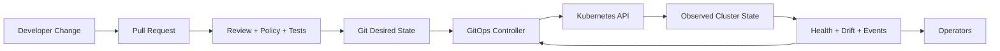
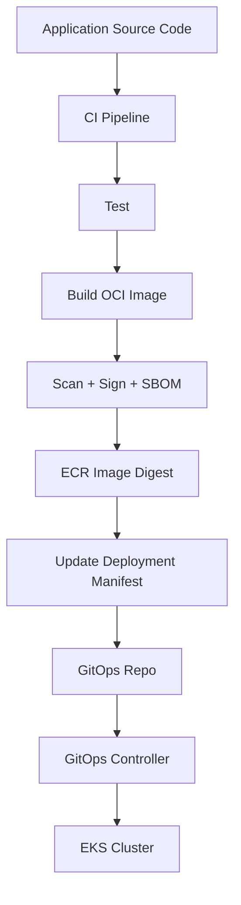
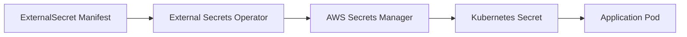

# Part 043 — EKS GitOps and Release Management

GitOps is not “deploy from Git”. That is the shallow definition.

For a production EKS platform, GitOps is the discipline of making **the desired state of the cluster explicit, reviewable, reproducible, continuously reconciled, and operationally recoverable**.

The important question is not:

> “Should we use Argo CD or Flux?”

The better question is:

> “What state is allowed to exist in the cluster, who can change it, how is drift detected, how is rollout made safe, and how do we recover when the desired state is wrong?”

A senior engineer treats GitOps as a **state management system**, not a CI/CD decoration.



The GitOps controller is a reconciler. It repeatedly asks:

1. What does Git say should exist?
2. What does the cluster currently contain?
3. What is different?
4. Is it safe to apply the difference?
5. Did the resulting system become healthy?

That is the core loop.

## 1. The Mental Model

In Kubernetes, almost everything is already declarative. A `Deployment` says “I want 6 replicas of this pod template”. A `Service` says “I want a stable virtual endpoint for these pods”. An `Ingress` says “I want external traffic routed to this service”. A `HorizontalPodAutoscaler` says “I want replica count adjusted based on observed metrics”.

GitOps extends this idea outward:

```text
Git repository = desired platform/application state
GitOps controller = reconciler
Kubernetes API = state transition boundary
Cluster = observed state
Status/events/metrics = feedback channel
```

This creates a powerful invariant:

> The cluster should be reconstructable from Git plus external stateful dependencies.

Not every runtime state belongs in Git. Logs, metrics, queue depth, database rows, generated secrets, pod names, and replica counts managed by HPA are observed state, not desired source state.

A clean GitOps design separates:

| State Type | Example | Belongs in Git? | Notes |
|---|---|---:|---|
| Declarative app spec | Deployment, Service, Ingress | Yes | Desired state. |
| Platform guardrails | RBAC, quotas, policies | Yes | Usually managed by platform repo. |
| Environment config | replica min/max, endpoints, feature flags | Usually | Sensitive values should be referenced, not stored raw. |
| Generated secret value | database password | No | Store reference or encrypted secret only. |
| Runtime state | pods, events, metrics | No | Observed by controllers. |
| Autoscaler output | current replica count | Usually no | HPA owns it. |
| Emergency hotfix | manual kubectl patch | No | Must be backported to Git or reverted. |

GitOps fails when teams confuse desired state with runtime state.

## 2. CI vs CD vs GitOps

A common production pipeline has two different systems:



CI answers:

> “Can this code produce a valid, tested, signed artifact?”

GitOps CD answers:

> “Should this environment now run that artifact and configuration?”

Do not collapse those questions into one unreviewable pipeline.

A strong pattern is:

1. Developer merges app code.
2. CI builds image.
3. CI pushes image to ECR using immutable tag and digest.
4. CI updates a deployment manifest or opens a promotion PR.
5. GitOps controller applies the new desired state.
6. Health checks and rollout gates decide whether the release is acceptable.

The image digest is the immutable artifact identity. The Git commit is the environment state identity. The deployment event links both.

## 3. GitOps Tooling: Argo CD and Flux

Argo CD and Flux both implement GitOps reconciliation, but their operating models feel different.

| Dimension | Argo CD | Flux |
|---|---|---|
| Primary experience | UI + CLI + CRDs | CRDs + CLI + Kubernetes-native toolkit |
| Common strength | Visual app health, sync, diff, multi-team dashboard | Composable controllers, pull-based automation, Kubernetes-native integration |
| Core abstraction | `Application`, `AppProject`, `ApplicationSet` | `GitRepository`, `Kustomization`, `HelmRelease`, `ImagePolicy` |
| Good fit | Platform with many app teams needing visibility | Platform wanting highly composable reconciliation primitives |
| Failure mode | People overuse UI/manual sync and bypass Git discipline | People create too many small reconciliation objects without clear ownership |

The tooling choice matters less than the governance model.

Bad GitOps with a good tool is still bad GitOps.

### 3.1 Argo CD Mental Model

Argo CD is a Kubernetes controller. It compares live cluster state to target state stored in Git, Helm, Kustomize, or another supported source. When the cluster differs from the desired state, the application becomes `OutOfSync`. Sync can be manual or automated.

Key Argo CD resources:

| Resource | Purpose |
|---|---|
| `Application` | Defines one deployable unit: source repo/path/chart, destination cluster/namespace, sync policy. |
| `AppProject` | Defines boundaries: allowed repos, clusters, namespaces, resource kinds, roles. |
| `ApplicationSet` | Generates many `Application` resources from templates, clusters, directories, lists, or pull requests. |

A production platform should use `AppProject`. Without it, Argo CD becomes a powerful cluster admin proxy.

Example `AppProject`:

```yaml
apiVersion: argoproj.io/v1alpha1
kind: AppProject
metadata:
  name: payments
  namespace: argocd
spec:
  description: Payments workloads
  sourceRepos:
    - https://github.com/example/platform-gitops.git
  destinations:
    - namespace: payments-dev
      server: https://kubernetes.default.svc
    - namespace: payments-prod
      server: https://kubernetes.default.svc
  clusterResourceWhitelist: []
  namespaceResourceWhitelist:
    - group: ""
      kind: ConfigMap
    - group: ""
      kind: Service
    - group: apps
      kind: Deployment
    - group: autoscaling
      kind: HorizontalPodAutoscaler
    - group: networking.k8s.io
      kind: Ingress
```

The project says:

> The payments team can deploy only from approved repos, only to approved namespaces, and only approved resource types.

That is a release boundary.

Example `Application`:

```yaml
apiVersion: argoproj.io/v1alpha1
kind: Application
metadata:
  name: payments-api-prod
  namespace: argocd
spec:
  project: payments
  source:
    repoURL: https://github.com/example/platform-gitops.git
    targetRevision: main
    path: apps/payments-api/overlays/prod
  destination:
    server: https://kubernetes.default.svc
    namespace: payments-prod
  syncPolicy:
    automated:
      prune: false
      selfHeal: true
    syncOptions:
      - CreateNamespace=false
      - PruneLast=true
```

Notice the deliberate choice: `prune: false` in production. Some teams enable production prune, but it should be a conscious decision, not a default copied from a blog post.

`selfHeal: true` means if live state drifts from Git, Argo CD will attempt to restore it. This is useful, but dangerous when operators make emergency manual changes and forget to backport them.

### 3.2 Flux Mental Model

Flux is a toolkit of controllers. Instead of one central `Application` abstraction, Flux composes source, build, and apply steps through CRDs.

Common Flux resources:

| Resource | Purpose |
|---|---|
| `GitRepository` | Fetches desired state from Git. |
| `OCIRepository` | Fetches desired state from OCI artifact. |
| `Kustomization` | Builds and applies manifests from a source. |
| `HelmRepository` | Defines Helm chart repository. |
| `HelmRelease` | Installs/upgrades Helm chart. |
| `ImageRepository` | Scans image tags. |
| `ImagePolicy` | Selects image version. |
| `ImageUpdateAutomation` | Updates Git with selected image version. |

Example:

```yaml
apiVersion: source.toolkit.fluxcd.io/v1
kind: GitRepository
metadata:
  name: platform-gitops
  namespace: flux-system
spec:
  interval: 1m
  url: https://github.com/example/platform-gitops.git
  ref:
    branch: main
---
apiVersion: kustomize.toolkit.fluxcd.io/v1
kind: Kustomization
metadata:
  name: payments-api-prod
  namespace: flux-system
spec:
  interval: 5m
  sourceRef:
    kind: GitRepository
    name: platform-gitops
  path: ./apps/payments-api/overlays/prod
  prune: false
  wait: true
  timeout: 5m
  targetNamespace: payments-prod
```

Flux is excellent when you want the entire deployment mechanism to be described in Kubernetes resources and reconciled like any other controller.

## 4. Repository Topology

Repository topology is an architecture decision. It determines ownership, review boundaries, rollback behavior, and blast radius.

There are three common patterns.

### 4.1 App Repo Contains Deployment Manifests

```text
payments-api/
  src/
  Dockerfile
  k8s/
    base/
    overlays/
      dev/
      staging/
      prod/
```

Good when:

- one team owns code and deployment;
- app-specific manifests are simple;
- platform guardrails are enforced separately;
- release velocity matters.

Bad when:

- many teams copy inconsistent patterns;
- platform wants central review of production changes;
- cluster-level objects leak into app repos.

### 4.2 Central Environment Repo

```text
platform-gitops/
  clusters/
    prod-ap-southeast-1/
      platform/
      apps/
  apps/
    payments-api/
      base/
      overlays/
        dev/
        staging/
        prod/
```

Good when:

- platform team owns environment state;
- production promotion needs explicit review;
- multiple clusters/environments need consistency;
- regulated evidence matters.

Bad when:

- platform repo becomes bottleneck;
- app teams cannot safely self-serve;
- manifests become a dumping ground.

### 4.3 Hybrid: App Repo + Promotion Repo

```text
payments-api repo:
  src/
  Dockerfile
  chart/

platform-gitops repo:
  environments/
    prod/
      payments-api-values.yaml
```

The app repo owns chart/template. The GitOps repo owns environment values and image digest.

This is often the best model for production EKS.

The app team controls how the app is deployed. The platform/environment repo controls what version and config runs in each environment.

## 5. Helm vs Kustomize

Helm and Kustomize solve different problems.

| Tool | Good For | Avoid When |
|---|---|---|
| Helm | Packaging reusable apps with parameters, charts, dependencies | You only need small patches to plain YAML |
| Kustomize | Environment overlays, patching raw manifests, composition without templating | You need complex loops/conditionals/templates |
| Raw YAML | Small, stable resources | Repetition grows across environments |

A clean pattern:

- use Helm to package reusable application templates;
- use Kustomize overlays for environment-specific composition;
- avoid huge `values.yaml` files that become programming languages;
- avoid Helm templates that hide important runtime contracts.

Example base:

```text
apps/payments-api/base/
  deployment.yaml
  service.yaml
  hpa.yaml
  kustomization.yaml
```

Example prod overlay:

```text
apps/payments-api/overlays/prod/
  kustomization.yaml
  replica-patch.yaml
  hpa-patch.yaml
  ingress-patch.yaml
```

`kustomization.yaml`:

```yaml
apiVersion: kustomize.config.k8s.io/v1beta1
kind: Kustomization
resources:
  - ../../base
patches:
  - path: replica-patch.yaml
  - path: hpa-patch.yaml
images:
  - name: 123456789012.dkr.ecr.ap-southeast-1.amazonaws.com/payments-api
    digest: sha256:8c1d2e...
```

Use digest pinning in production. Tags are human labels. Digests are artifact identity.

## 6. Promotion Model

A weak release system says:

> “Deploy latest to prod.”

A strong release system says:

> “Promote this verified artifact digest and this reviewed config delta from staging to production.”

Promotion should move immutable artifacts across environments, not rebuild different artifacts for each environment.

```mermaid
flowchart LR
    Code[App Code Merge] --> Build[Build Once]
    Build --> Image[ECR Image Digest]
    Image --> Dev[Dev Manifest Update]
    Dev --> Test[Integration + Smoke]
    Test --> Staging[Staging Promotion PR]
    Staging --> Approval[Release Review]
    Approval --> Prod[Prod Promotion PR]
    Prod --> GitOps[GitOps Sync]
```



Important invariant:

> The artifact tested in staging should be the artifact promoted to production.

Environment differences should be configuration, not code rebuilds.

## 7. Sync Policy Design

GitOps controllers can apply changes automatically or wait for manual action. There is no universal answer.

| Environment | Suggested Sync | Reason |
|---|---|---|
| Dev | Automated sync + prune | Fast feedback. Drift is less costly. |
| Shared staging | Automated sync, careful prune | Useful for continuous validation. |
| Production app | Automated sync with gates, or manual sync | Depends on release maturity and blast radius. |
| Cluster platform layer | Manual or heavily gated auto-sync | Mistakes affect all workloads. |
| Policy layer | Staged rollout | Bad policy can block the cluster. |

The dangerous settings are not `auto-sync`, `prune`, or `selfHeal` individually. The danger is enabling them without understanding what owns each resource.

### 7.1 Prune

Prune deletes resources that exist in the cluster but no longer exist in desired state.

That is correct for stateless resources that are fully managed by Git.

It can be dangerous for:

- PVCs;
- namespaces;
- CRDs;
- cluster-scoped policy resources;
- resources temporarily generated by another controller;
- migration jobs;
- emergency hotfix resources.

Recommended production default:

```yaml
syncPolicy:
  automated:
    prune: false
    selfHeal: true
```

Then enable prune deliberately per app or per resource class.

### 7.2 Self-Heal

Self-heal is drift correction.

Good drift:

- HPA changes replica count;
- Kubernetes adds defaults;
- controllers update status;
- admission webhooks mutate allowed fields.

Bad drift:

- someone changes image tag manually;
- someone disables resource limits;
- someone opens ingress to the world;
- someone patches a service account to use a privileged role.

Your diff configuration must distinguish allowed controller-managed fields from unauthorized configuration drift.

## 8. Sync Waves, Hooks, and Ordering

Kubernetes is eventually consistent. Some resources must exist before others.

Examples:

- namespace before workload;
- CRD before custom resource;
- ExternalSecret before Deployment if the app needs the generated Secret at startup;
- migration Job before new app version, sometimes;
- policy in audit mode before enforce mode.

Argo CD sync waves can express order:

```yaml
metadata:
  annotations:
    argocd.argoproj.io/sync-wave: "10"
```

A simple ordering convention:

| Wave | Resource Type |
|---:|---|
| -20 | Namespaces |
| -10 | ServiceAccount, RBAC, quotas |
| 0 | ConfigMap, ExternalSecret |
| 10 | Deployment, Service |
| 20 | Ingress, HPA, PDB |
| 30 | Smoke test Job |

Do not overuse ordering. If every resource needs a custom wave, your platform design is too fragile.

## 9. Database Migration and GitOps

Database migration is where many GitOps systems become unsafe.

A Deployment rollout can be reversed. A destructive schema migration often cannot.

Use this compatibility model:

```text
expand -> deploy compatible code -> migrate data -> contract
```

Example:

1. Add nullable column.
2. Deploy app version that writes both old and new field.
3. Backfill data.
4. Deploy app version that reads new field.
5. Remove old field only after all consumers are compatible.

Avoid:

```text
merge app + destructive migration + auto-sync to prod
```

That is not GitOps. That is a footgun with YAML.

For migration jobs, choose one:

| Pattern | Use When | Risk |
|---|---|---|
| CI runs migration before GitOps deploy | Small team, controlled rollout | CI gets production write authority. |
| Argo hook Job runs migration | App-scoped migration, visible in release | Hook retry/destructive operations need care. |
| Step Functions orchestrates migration + deploy | Regulated or multi-step release | More moving parts but clearer audit. |
| Manual DBA-controlled migration | High-risk database change | Slower but safer. |

A production-grade migration job must be:

- idempotent;
- lock-aware;
- timeout bounded;
- observable;
- auditable;
- compatible with rollback strategy.

## 10. Secrets in GitOps

Never store raw production secrets in Git.

Valid patterns:

| Pattern | Description |
|---|---|
| External Secrets Operator | Git stores reference to AWS Secrets Manager/Parameter Store. Operator syncs Kubernetes Secret. |
| Secrets Store CSI Driver | Secret mounted from external provider into pod. |
| SOPS + KMS | Git stores encrypted secret; controller decrypts with controlled key access. |
| Sealed Secrets | Git stores encrypted secret decryptable only by cluster controller. |

For AWS-heavy EKS platforms, a common pattern is:



Git contains the reference and mapping, not the sensitive value.

Example:

```yaml
apiVersion: external-secrets.io/v1beta1
kind: ExternalSecret
metadata:
  name: payments-api-db
  namespace: payments-prod
spec:
  refreshInterval: 1h
  secretStoreRef:
    name: aws-secrets-manager
    kind: ClusterSecretStore
  target:
    name: payments-api-db
  data:
    - secretKey: username
      remoteRef:
        key: prod/payments-api/db
        property: username
    - secretKey: password
      remoteRef:
        key: prod/payments-api/db
        property: password
```

Policy must restrict which namespace can reference which remote secret path.

Without that boundary, External Secrets becomes a secret exfiltration tool.

## 11. Multi-Cluster GitOps

EKS platforms often grow from one cluster to many:

- dev cluster;
- staging cluster;
- production cluster;
- region-specific clusters;
- tenant-specific clusters;
- regulated workload clusters.

There are two deployment topologies.

### 11.1 Hub Controller Managing Many Clusters

One Argo CD/Flux control cluster deploys to many target clusters.

Good:

- centralized visibility;
- easier platform governance;
- consistent app catalog.

Risk:

- central controller compromise affects many clusters;
- network and credential management becomes sensitive;
- outage of control cluster impacts deployment operations.

### 11.2 In-Cluster Controller Per Cluster

Each cluster runs its own GitOps controller and pulls from Git.

Good:

- smaller blast radius;
- works better for private/isolated clusters;
- cluster can reconcile independently.

Risk:

- more controllers to operate;
- cross-cluster visibility needs extra tooling;
- inconsistent configuration if bootstrapping is weak.

For regulated platforms, prefer pull-based per-cluster reconciliation unless centralization is explicitly required and hardened.

## 12. Progressive Delivery

GitOps applies desired state. Progressive delivery decides how traffic moves.

A plain Kubernetes Deployment supports rolling update. For higher safety, use:

- Argo Rollouts;
- Flagger;
- service mesh traffic shifting;
- ALB weighted target groups;
- Gateway API traffic splitting where supported;
- external canary analysis.

Progressive delivery needs metrics, not hope.

Example canary gate:

```text
new version receives 5% traffic
observe p95 latency, 5xx rate, business error rate, saturation
if healthy -> 25%
if healthy -> 50%
if healthy -> 100%
if unhealthy -> rollback
```

The core invariant:

> Rollout should move traffic only when the system demonstrates health under real conditions.

Do not rely only on pod readiness. A pod can be ready and still produce wrong business outcomes.

## 13. Drift Management

Drift is any difference between desired and observed state.

Not all drift is bad.

| Drift Type | Example | Action |
|---|---|---|
| Controller drift | HPA changes replicas | Ignore/normalize. |
| Admission drift | Default security context injected | Understand and codify. |
| Human emergency drift | Manual image rollback | Backport to Git or revert. |
| Malicious drift | Privileged container added | Alert and self-heal. |
| Unknown drift | Field changed by unclear actor | Investigate. |

Drift policy should answer:

1. Which fields are allowed to drift?
2. Which resources are allowed to be changed manually?
3. How quickly should drift be corrected?
4. Who gets alerted?
5. How is emergency change captured after incident?

A mature team has an “emergency patch protocol”:

```text
manual patch allowed only during incident
incident ticket required
patch recorded in timeline
Git desired state updated or patch reverted within defined window
post-incident review checks why GitOps path was insufficient
```

## 14. Release Evidence

For serious systems, every production deployment should answer:

- What Git commit changed desired state?
- What image digest was deployed?
- Who approved it?
- What tests passed?
- What vulnerabilities were accepted?
- What policy exceptions were used?
- What config changed?
- What migration ran?
- What rollout health was observed?
- Was rollback possible?

GitOps gives you the skeleton of this evidence. You still need discipline around CI metadata, approvals, issue links, and runtime observations.

## 15. Failure Modes

### 15.1 GitOps Controller Down

Symptoms:

- no new deployments;
- apps stuck `OutOfSync`;
- stale desired state;
- controller pods failing;
- repo polling failing.

Impact:

- existing workloads usually keep running;
- deployment and drift correction stop;
- self-healing via GitOps stops.

Runbook:

1. Check controller pod health.
2. Check controller logs.
3. Check access to Git repository.
4. Check Kubernetes API access and RBAC.
5. Check repo credentials or SSH key.
6. Check resource pressure in controller namespace.
7. Avoid manual cluster-wide changes unless incident requires it.

### 15.2 Bad Manifest Blocks Sync

Symptoms:

- sync fails;
- resource validation error;
- admission policy rejects object;
- CRD not found;
- namespace missing.

Runbook:

1. Read sync error.
2. Validate manifest locally with `kubectl apply --dry-run=server`.
3. Confirm CRD installation order.
4. Confirm admission policy result.
5. Revert Git commit or fix forward.

### 15.3 Prune Deletes Needed Resource

Symptoms:

- service disappears;
- PVC deleted or detached;
- ingress removed;
- generated object removed unexpectedly.

Runbook:

1. Stop further automated prune if blast radius continues.
2. Identify commit that removed resource.
3. Restore manifest or recover resource from backup.
4. Add prune protection for stateful/critical resource classes.
5. Add review rule for deletions.

### 15.4 Sync Loop Fights Another Controller

Symptoms:

- resource constantly changes;
- app remains `OutOfSync`;
- controller logs show repeated patching;
- managed fields conflict.

Cause:

Two controllers believe they own the same field.

Examples:

- GitOps sets replica count while HPA also manages replicas;
- GitOps sets fields mutated by admission webhook;
- Helm chart and Kustomize overlay both manage same labels;
- operator controls a generated resource that GitOps also manages.

Fix:

- define field ownership;
- ignore known controller-managed fields;
- stop managing generated resources directly;
- split base and overlays cleanly.

## 16. Production Checklist

Before adopting GitOps for production EKS, verify:

- [ ] all production images use immutable digest references or strongly controlled tags;
- [ ] platform and app repositories have clear ownership;
- [ ] GitOps controller access is least-privilege;
- [ ] Argo `AppProject` or Flux namespace/RBAC boundaries exist;
- [ ] production prune is deliberate, not accidental;
- [ ] drift policy distinguishes allowed controller drift from unauthorized drift;
- [ ] secrets are referenced or encrypted, not stored raw;
- [ ] promotion uses reviewed PRs and immutable artifacts;
- [ ] rollback path is documented;
- [ ] database migration strategy is separate from simple Deployment rollback;
- [ ] sync errors alert the owning team;
- [ ] controller outage runbook exists;
- [ ] emergency patch protocol exists;
- [ ] policy exceptions are reviewed and expire.

## 17. The Top 1% Takeaway

GitOps is not about YAML aesthetics.

It is about reducing ambiguity in production state.

A weak team asks:

> “Did the deployment pipeline run?”

A strong team asks:

> “Is the desired state correct, was it reviewed, did the reconciler apply it, did the system become healthy, and can we prove what changed?”

That is the level of thinking expected from a production platform engineer.

## Primary References

- AWS EKS documentation: https://docs.aws.amazon.com/eks/
- Argo CD documentation: https://argo-cd.readthedocs.io/
- Flux documentation: https://fluxcd.io/flux/concepts/
- Kubernetes Kustomize documentation: https://kubernetes.io/docs/tasks/manage-kubernetes-objects/kustomization/
- Helm documentation: https://helm.sh/docs/
