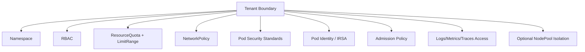
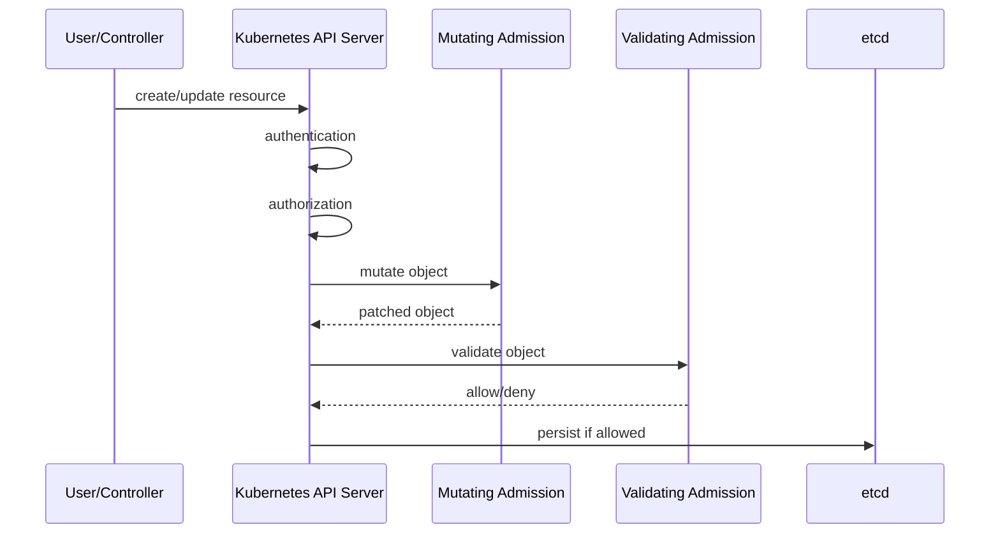

# Part 044 — EKS Policy and Multi-Tenancy

Multi-tenancy in EKS is not a single feature. It is a set of boundaries.

A tenant can be:

- an engineering team;
- an application;
- a customer;
- a business domain;
- a compliance boundary;
- an environment;
- a workload class.

The mistake is assuming a namespace alone equals tenancy.

A namespace is only a naming and scoping primitive. It becomes a tenant boundary only when combined with RBAC, resource quotas, network policy, pod security, workload identity, image policy, admission control, observability segmentation, and operational ownership.



A production EKS platform must answer:

> “If this tenant is compromised, misconfigured, noisy, or negligent, what can it damage?”

That is the real multi-tenancy question.

## 1. The Isolation Spectrum

There is no free isolation. Stronger isolation costs more money, operational overhead, and sometimes developer experience.

| Model | Isolation Strength | Cost | Operational Complexity | Use Case |
|---|---:|---:|---:|---|
| Shared namespace | Very weak | Low | Low | Small internal dev sandbox only. |
| Namespace per tenant | Moderate | Low | Moderate | Most internal platform teams. |
| Node pool per tenant | Stronger runtime separation | Medium | Medium | Noisy workloads, special instance types, compliance zones. |
| Cluster per tenant | Strong | High | High | Hard isolation, regulated workloads, customer isolation. |
| Account per tenant + cluster | Very strong | Highest | Highest | High-security SaaS, strict billing, strict compliance. |

The top 1% engineer does not say “always use cluster-per-tenant” or “namespace is enough”. They map isolation to risk.

### 1.1 Namespace-per-Tenant

Namespace-per-tenant is common and efficient.

It works when:

- tenants are internal teams;
- workloads have similar trust level;
- platform has strong admission guardrails;
- network policy is enforced;
- IAM access is scoped;
- resource quotas prevent noisy neighbor collapse;
- cluster admins are trusted.

It is weak when:

- tenants are mutually untrusted customers;
- workloads require kernel-level isolation;
- privileged pods are allowed;
- tenants can create arbitrary RBAC;
- tenants can schedule to all nodes;
- tenants can attach broad IAM roles;
- cluster-level CRDs/operators expose shared control surfaces.

### 1.2 NodePool-per-Tenant

Node-level separation helps when workloads differ in:

- instance architecture;
- GPU/accelerator needs;
- Spot tolerance;
- compliance classification;
- noisy CPU/memory behavior;
- daemonset side effects;
- kernel/runtime requirements.

With Karpenter or EKS Auto Mode, NodePool boundaries can represent workload classes:

```yaml
apiVersion: karpenter.sh/v1
kind: NodePool
metadata:
  name: payments-on-demand
spec:
  template:
    metadata:
      labels:
        tenant: payments
        workload-class: critical
    spec:
      taints:
        - key: tenant
          value: payments
          effect: NoSchedule
      requirements:
        - key: karpenter.sh/capacity-type
          operator: In
          values: ["on-demand"]
```

Then tenant workloads use tolerations and node selectors.

This does not create a hard security boundary by itself, but it reduces operational blast radius.

### 1.3 Cluster-per-Tenant

Cluster-per-tenant is appropriate when:

- tenant compromise must not affect others;
- policies differ strongly;
- add-ons differ;
- network boundaries differ;
- compliance evidence must be isolated;
- customer data isolation requires stronger administrative separation.

The cost is day-2 operations:

- more upgrades;
- more add-on lifecycle;
- more GitOps targets;
- more observability configuration;
- more cost allocation;
- more incident surfaces.

Use it intentionally.

## 2. Tenancy Invariants

A tenant boundary should enforce these invariants:

1. A tenant cannot create workload identities outside its authorization boundary.
2. A tenant cannot schedule privileged pods unless explicitly approved.
3. A tenant cannot escape its namespace using RBAC.
4. A tenant cannot consume unlimited CPU, memory, storage, or load balancer resources.
5. A tenant cannot receive network traffic from unrelated tenants by default.
6. A tenant cannot access secrets belonging to another tenant.
7. A tenant cannot deploy images from untrusted registries.
8. A tenant cannot disable platform observability and security controls.
9. A tenant cannot mutate cluster-scoped resources unless explicitly delegated.
10. A tenant exception is time-bounded, reviewed, and visible.

If these are not true, the platform is shared hosting, not multi-tenancy.

## 3. Kubernetes Primitives for Tenancy

### 3.1 Namespace

A namespace scopes many namespaced resources:

- `Deployment`;
- `Service`;
- `ConfigMap`;
- `Secret`;
- `ServiceAccount`;
- `Role`;
- `RoleBinding`;
- `ResourceQuota`;
- `LimitRange`;
- `NetworkPolicy`.

But several important resources are cluster-scoped:

- `ClusterRole`;
- `ClusterRoleBinding`;
- `CustomResourceDefinition`;
- `StorageClass`;
- `Node`;
- `PersistentVolume`;
- admission webhook configuration;
- some operator-managed custom resources.

Tenants should not freely control cluster-scoped resources.

### 3.2 RBAC

RBAC defines who can do what.

Production tenant RBAC should follow least privilege:

```yaml
apiVersion: rbac.authorization.k8s.io/v1
kind: Role
metadata:
  name: tenant-deployer
  namespace: payments-prod
rules:
  - apiGroups: ["apps"]
    resources: ["deployments"]
    verbs: ["get", "list", "watch", "create", "update", "patch"]
  - apiGroups: [""]
    resources: ["services", "configmaps"]
    verbs: ["get", "list", "watch", "create", "update", "patch"]
  - apiGroups: [""]
    resources: ["secrets"]
    verbs: ["get", "list"]
```

Be careful with verbs:

| Verb | Risk |
|---|---|
| `get/list/watch secrets` | Can expose sensitive values. |
| `create pods/exec` | Can become lateral movement path. |
| `create rolebindings` | Can escalate within namespace. |
| `create clusterrolebindings` | Cluster compromise. |
| `impersonate` | High-risk privilege escalation. |
| `patch serviceaccounts` | Can attach unexpected workload identity if not guarded. |

A frequent mistake is giving CI/CD broad cluster-admin permissions because deployment was blocked once.

That turns the release pipeline into the highest-risk identity in the platform.

### 3.3 ResourceQuota and LimitRange

A tenant must not be able to consume the cluster accidentally.

`ResourceQuota` limits aggregate consumption:

```yaml
apiVersion: v1
kind: ResourceQuota
metadata:
  name: payments-quota
  namespace: payments-prod
spec:
  hard:
    requests.cpu: "20"
    requests.memory: 64Gi
    limits.cpu: "40"
    limits.memory: 128Gi
    pods: "80"
    services.loadbalancers: "2"
    persistentvolumeclaims: "10"
```

`LimitRange` sets defaults and bounds:

```yaml
apiVersion: v1
kind: LimitRange
metadata:
  name: default-container-limits
  namespace: payments-prod
spec:
  limits:
    - type: Container
      defaultRequest:
        cpu: 250m
        memory: 512Mi
      default:
        cpu: "1"
        memory: 1Gi
      max:
        cpu: "4"
        memory: 8Gi
```

Quota without default requests often fails poorly: workloads get rejected because no request was specified. LimitRange helps make the failure mode predictable.

### 3.4 NetworkPolicy

NetworkPolicy defines which pods can talk to which other pods/endpoints, if the CNI supports enforcement.

A namespace default-deny policy:

```yaml
apiVersion: networking.k8s.io/v1
kind: NetworkPolicy
metadata:
  name: default-deny-all
  namespace: payments-prod
spec:
  podSelector: {}
  policyTypes:
    - Ingress
    - Egress
```

Then allow only necessary traffic:

```yaml
apiVersion: networking.k8s.io/v1
kind: NetworkPolicy
metadata:
  name: allow-api-from-ingress
  namespace: payments-prod
spec:
  podSelector:
    matchLabels:
      app: payments-api
  policyTypes:
    - Ingress
  ingress:
    - from:
        - namespaceSelector:
            matchLabels:
              platform.example.com/ingress: "true"
      ports:
        - protocol: TCP
          port: 8080
```

Network policy should be treated as part of the application contract, not an afterthought.

## 4. Pod Security Standards

Kubernetes defines three Pod Security Standards profiles:

| Profile | Meaning |
|---|---|
| `privileged` | Unrestricted. Suitable only for trusted system workloads. |
| `baseline` | Prevents known privilege escalation while staying broadly compatible. |
| `restricted` | Strongest standard; follows hardening best practices but may require app changes. |

Namespace labels can enforce Pod Security Admission:

```yaml
apiVersion: v1
kind: Namespace
metadata:
  name: payments-prod
  labels:
    pod-security.kubernetes.io/enforce: restricted
    pod-security.kubernetes.io/enforce-version: latest
    pod-security.kubernetes.io/audit: restricted
    pod-security.kubernetes.io/audit-version: latest
    pod-security.kubernetes.io/warn: restricted
    pod-security.kubernetes.io/warn-version: latest
```

For many production app namespaces, target `restricted` unless a workload has a justified exception.

Common requirements under restricted posture:

```yaml
securityContext:
  runAsNonRoot: true
  seccompProfile:
    type: RuntimeDefault
containers:
  - name: app
    securityContext:
      allowPrivilegeEscalation: false
      capabilities:
        drop: ["ALL"]
      readOnlyRootFilesystem: true
```

Do not start with privileged-by-default and promise to harden later. Later often never arrives.

## 5. Admission Control

Admission control is where policy becomes enforceable.

The Kubernetes request flow is:



Policy tools hook into this path.

### 5.1 Kyverno

Kyverno is Kubernetes-native and expresses policies as YAML resources. It can validate, mutate, generate, cleanup, and verify image configurations.

Example: require resource requests and limits.

```yaml
apiVersion: kyverno.io/v1
kind: ClusterPolicy
metadata:
  name: require-requests-limits
spec:
  validationFailureAction: Enforce
  background: true
  rules:
    - name: validate-resources
      match:
        any:
          - resources:
              kinds:
                - Pod
      validate:
        message: "CPU and memory requests/limits are required."
        pattern:
          spec:
            containers:
              - resources:
                  requests:
                    cpu: "?*"
                    memory: "?*"
                  limits:
                    cpu: "?*"
                    memory: "?*"
```

Example: allow images only from approved ECR account.

```yaml
apiVersion: kyverno.io/v1
kind: ClusterPolicy
metadata:
  name: restrict-image-registries
spec:
  validationFailureAction: Enforce
  rules:
    - name: only-approved-ecr
      match:
        any:
          - resources:
              kinds:
                - Pod
      validate:
        message: "Images must come from approved ECR registry."
        pattern:
          spec:
            containers:
              - image: "123456789012.dkr.ecr.ap-southeast-1.amazonaws.com/*"
```

Kyverno is approachable for platform teams because policy looks like Kubernetes manifests.

### 5.2 OPA Gatekeeper

Gatekeeper uses Open Policy Agent and Rego-based constraints. It is powerful when policy logic needs more expressiveness.

Gatekeeper usually has two layers:

1. `ConstraintTemplate` defines policy logic.
2. `Constraint` applies it to resources.

Example concept:

```yaml
apiVersion: templates.gatekeeper.sh/v1
kind: ConstraintTemplate
metadata:
  name: k8srequiredlabels
spec:
  crd:
    spec:
      names:
        kind: K8sRequiredLabels
      validation:
        openAPIV3Schema:
          type: object
          properties:
            labels:
              type: array
              items:
                type: string
  targets:
    - target: admission.k8s.gatekeeper.sh
      rego: |
        package k8srequiredlabels

        violation[{"msg": msg}] {
          required := input.parameters.labels[_]
          not input.review.object.metadata.labels[required]
          msg := sprintf("missing required label: %v", [required])
        }
```

Then apply:

```yaml
apiVersion: constraints.gatekeeper.sh/v1beta1
kind: K8sRequiredLabels
metadata:
  name: require-team-label
spec:
  match:
    kinds:
      - apiGroups: [""]
        kinds: ["Namespace"]
  parameters:
    labels:
      - owner
      - cost-center
```

Gatekeeper is strong for policy-as-code programs that already use OPA/Rego across systems.

### 5.3 Native Validating Admission Policy

Kubernetes also has native Validating Admission Policy using CEL expressions. This reduces reliance on external webhooks for some validation cases.

Use it for simpler policies when supported by your cluster version and operating model.

Use Kyverno/Gatekeeper when you need broader policy lifecycle, audit reports, mutation/generation, image verification, or richer ecosystems.

## 6. Policy Lifecycle: Audit Before Enforce

A bad policy rollout can become a production incident.

The safe lifecycle:

```text
design -> test locally -> audit mode -> report violations -> fix workloads -> enforce on low-risk namespace -> enforce wider -> monitor -> expire exceptions
```

Policy should have rollout stages:

| Stage | Behavior |
|---|---|
| Draft | Policy reviewed but not applied. |
| Audit | Violations reported but not blocked. |
| Warn | Users receive warnings. |
| Enforce narrow | Blocks only selected namespaces. |
| Enforce broad | Blocks by default. |
| Exception-managed | Exceptions require explicit approval and expiry. |

Never introduce a broad enforce policy directly in production unless the blast radius is known and tested.

## 7. Policy Exceptions

Exceptions are not failure. Invisible exceptions are failure.

A valid exception must include:

- owner;
- reason;
- scope;
- expiry;
- compensating control;
- approval;
- issue/ticket link;
- review date.

Example exception shape:

```yaml
apiVersion: platform.example.com/v1
kind: PolicyException
metadata:
  name: payments-api-readonly-rootfs-exception
  namespace: payments-prod
spec:
  policy: require-readonly-rootfs
  resource: deployment/payments-api
  owner: payments-platform
  reason: "Legacy PDF renderer writes temporary font cache at startup."
  compensatingControls:
    - "Dedicated NodePool"
    - "No public ingress"
    - "Runtime alert on unexpected file write path"
  expiresAt: "2026-09-01"
```

Even if your policy engine uses a different schema, the governance data should exist somewhere.

## 8. Tenant Onboarding Blueprint

Tenant onboarding should be automated. Manual namespace creation leads to inconsistent security.

A tenant package should create:

- namespace;
- namespace labels;
- resource quota;
- limit range;
- default deny network policy;
- allowed ingress/egress policies;
- service accounts;
- workload identity binding;
- RBAC roles and bindings;
- Pod Security labels;
- GitOps application/project binding;
- observability routing labels;
- cost allocation tags/labels;
- exception placeholders.

Example namespace:

```yaml
apiVersion: v1
kind: Namespace
metadata:
  name: payments-prod
  labels:
    owner: payments
    environment: prod
    cost-center: cc-payments
    platform.example.com/tenant: payments
    pod-security.kubernetes.io/enforce: restricted
    pod-security.kubernetes.io/audit: restricted
    pod-security.kubernetes.io/warn: restricted
```

Example service account:

```yaml
apiVersion: v1
kind: ServiceAccount
metadata:
  name: payments-api
  namespace: payments-prod
  labels:
    app: payments-api
    owner: payments
```

Then bind identity using your chosen EKS workload identity model from Part 032.

## 9. Image Governance

A production platform should not allow arbitrary images.

Minimum controls:

- images must come from approved registry/account;
- production images should use immutable digests;
- image must pass vulnerability policy;
- base image must be approved;
- image should be signed or have provenance evidence;
- latest tag should be blocked in production;
- privileged images should require exception.

Policy example:

```yaml
apiVersion: kyverno.io/v1
kind: ClusterPolicy
metadata:
  name: block-latest-tag
spec:
  validationFailureAction: Enforce
  rules:
    - name: require-non-latest-tag
      match:
        any:
          - resources:
              kinds:
                - Pod
      validate:
        message: "The latest tag is not allowed. Use immutable version or digest."
        deny:
          conditions:
            any:
              - key: "{{ images.containers.*.tag || '' }}"
                operator: AnyIn
                value:
                  - latest
```

Exact syntax may differ depending on Kyverno version and image variable support. Treat this as a policy shape, then test with the Kyverno CLI and a real cluster.

## 10. Workload Identity Boundary

In EKS, workload identity is part of tenancy.

A tenant should not be able to:

- attach another tenant's IAM role;
- modify trust policy;
- create a service account that maps to broad AWS permissions;
- read secrets outside its allowed prefix;
- access unrelated S3 buckets, SQS queues, KMS keys, or DynamoDB tables.

Recommended identity model:

```text
tenant namespace -> allowed service accounts -> mapped IAM roles -> resource-level IAM policy -> AWS service resources
```

Example IAM resource scoping:

```json
{
  "Effect": "Allow",
  "Action": [
    "sqs:ReceiveMessage",
    "sqs:DeleteMessage",
    "sqs:GetQueueAttributes"
  ],
  "Resource": "arn:aws:sqs:ap-southeast-1:123456789012:payments-*"
}
```

Do not grant tenant workloads account-wide wildcard access just because they are inside a namespace.

The namespace is not the AWS security boundary. IAM is.

## 11. Network Tenancy

Network tenancy has layers:

| Layer | Boundary |
|---|---|
| Kubernetes NetworkPolicy | Pod-to-pod and pod egress rules, if enforced. |
| Security Groups for Pods | AWS ENI/security group-level control for selected pods. |
| VPC subnet/routing | Wider network reachability. |
| PrivateLink/VPC endpoints | AWS service access without public internet/NAT. |
| ALB/NLB/WAF | Ingress security and request filtering. |

For many internal platforms:

1. default deny namespace ingress and egress;
2. allow ingress only from ingress namespace or service mesh gateway;
3. allow egress only to explicitly required namespaces, CIDRs, or AWS endpoints;
4. use SG for Pods for high-risk database or regulated resource access;
5. log and alert unexpected egress.

Network policy without observability is hard to operate. Expect rollout friction.

## 12. Observability Tenancy

Tenants need visibility into their workloads without access to everyone else’s data.

Separate:

- log stream access;
- metrics dashboard access;
- trace access;
- Kubernetes event access;
- deployment status;
- policy violation reports;
- cost reports.

Labels matter:

```yaml
metadata:
  labels:
    app.kubernetes.io/name: payments-api
    app.kubernetes.io/part-of: payments
    app.kubernetes.io/managed-by: argocd
    owner: payments
    environment: prod
    cost-center: cc-payments
```

Without consistent labels, tenancy breaks in cost allocation, incident triage, and compliance reporting.

## 13. Operator and CRD Risk

Multi-tenancy becomes harder when tenants can create custom resources managed by powerful operators.

Examples:

- an operator creates cloud resources;
- a CRD triggers external API calls;
- a controller watches all namespaces;
- a custom resource references secrets or IAM roles;
- a tenant can create Ingress objects that provision public load balancers.

Guardrails:

- restrict CRD kinds per tenant;
- validate custom resource fields;
- run controllers with least privilege;
- avoid cluster-wide controller permissions unless required;
- apply admission policy to operator CRs;
- use separate operators or clusters for high-risk tenants.

A Kubernetes custom resource can be as powerful as the controller behind it.

## 14. Multi-Tenancy Failure Modes

### 14.1 Noisy Neighbor

Symptoms:

- node CPU/memory pressure;
- pods evicted;
- HPA scales aggressively;
- other tenants see latency spike;
- cluster autoscaler provisions too much capacity.

Prevention:

- ResourceQuota;
- LimitRange;
- workload-specific NodePools;
- PriorityClass;
- PDB;
- autoscaling limits;
- cost alerts.

### 14.2 Privilege Escalation Through RBAC

Symptoms:

- tenant creates RoleBinding to broader role;
- tenant can read all secrets in namespace;
- CI identity has broad permissions;
- service account token abused.

Prevention:

- restrict Role/RoleBinding creation;
- use GitOps-controlled RBAC;
- admission policy blocks dangerous bindings;
- audit RBAC regularly;
- avoid wildcard verbs/resources.

### 14.3 Policy Webhook Outage

Symptoms:

- API writes fail or hang;
- deployments stuck;
- admission webhook timeout;
- cluster-wide release outage.

Prevention:

- run policy engine highly available;
- set sane webhook timeout;
- choose failure policy deliberately;
- monitor webhook latency/error rate;
- stage policy rollout;
- maintain break-glass process.

Important trade-off:

| Webhook Failure Policy | Behavior |
|---|---|
| `Fail` | Safer security posture, but outage can block writes. |
| `Ignore` | More available, but policy may be bypassed during outage. |

For critical security policies, `Fail` may be right. For advisory mutation, `Ignore` may be better. Decide explicitly.

### 14.4 Tenant Escapes Through Shared Secret Path

Symptoms:

- one namespace reads another team's secret;
- ExternalSecret references broad remote key path;
- IAM role allows wildcard secret reads.

Prevention:

- IAM resource scoping;
- admission policy validating secret path prefix;
- separate SecretStore per tenant;
- review ExternalSecret manifests;
- alert on unexpected secret access.

### 14.5 Public Load Balancer Created Accidentally

Symptoms:

- tenant creates Ingress/Service that provisions internet-facing load balancer;
- WAF not attached;
- no TLS policy;
- cost spike.

Prevention:

- restrict `Service type=LoadBalancer`;
- validate ingress annotations;
- require approved ingress class;
- centralize public ingress through platform gateway;
- monitor load balancer creation.

## 15. Tenant Blast-Radius Matrix

Use this during architecture review:

| Failure or Compromise | Namespace Tenancy | NodePool Tenancy | Cluster Tenancy |
|---|---:|---:|---:|
| CPU/memory exhaustion | Medium risk | Lower risk | Low risk |
| Bad network policy | Medium | Medium | Low |
| Bad admission policy | High if cluster-wide | High if cluster-wide | Limited to cluster |
| Node kernel issue | Shared risk | Reduced | Reduced |
| Privileged pod escape | High | Medium | Lower cross-tenant |
| Broad IAM role misuse | Depends on IAM | Depends on IAM | Depends on account/IAM |
| CRD/controller bug | High if shared | High if shared | Limited if isolated |
| Cost spike | Shared cluster impact | Reduced | Tenant-specific |

The matrix shows why namespace is not enough for high-risk tenants.

## 16. Production Policy Set

A practical baseline policy set:

| Policy | Purpose |
|---|---|
| Require owner/env/cost labels | Ownership and cost allocation. |
| Enforce Pod Security restricted/baseline | Runtime hardening. |
| Require resource requests/limits | Scheduling and noisy-neighbor control. |
| Block privileged containers | Prevent privilege escalation. |
| Block host networking/PID/IPC | Prevent node-level exposure. |
| Require read-only root filesystem where feasible | Reduce writable attack surface. |
| Restrict image registries | Supply chain control. |
| Block `latest` tag in production | Reproducibility. |
| Require approved ingress class | Prevent accidental exposure. |
| Restrict service type LoadBalancer | Cost and exposure control. |
| Validate ExternalSecret key prefix | Secret tenancy. |
| Restrict service account/IAM binding | Workload identity boundary. |
| Default deny NetworkPolicy | Network containment. |
| Require PDB for critical apps | Availability during voluntary disruption. |
| Require topology spread for critical apps | AZ resilience. |

Start in audit mode, fix violations, then enforce.

## 17. Tenant Operating Model

Policy only works if humans know the contract.

Each tenant should know:

- what resources they can create;
- how to request more quota;
- how to request policy exception;
- how to attach AWS permissions;
- how to expose an API;
- how to access logs/metrics/traces;
- how to debug denied deployments;
- what SLO their platform namespace receives;
- what they own during incidents.

A good platform provides self-service templates instead of wiki-only instructions.

Example tenant request fields:

```yaml
tenant: payments
environment: prod
owner: payments-platform
costCenter: cc-payments
quota:
  cpuRequests: "20"
  memoryRequests: 64Gi
network:
  publicIngress: false
  allowedEgress:
    - aws:sqs:payments-prod-events
    - aws:secretsmanager:prod/payments/*
identity:
  serviceAccounts:
    - name: payments-api
      awsRole: payments-api-prod
security:
  podSecurity: restricted
  nodeIsolation: critical-on-demand
```

This becomes input to a GitOps-generated tenant package.

## 18. Runbook: Deployment Denied by Policy

When a deployment is denied:

1. Read the exact admission error.
2. Identify policy name and rule name.
3. Determine whether the manifest is wrong or policy is too broad.
4. Reproduce locally with policy test tool if available.
5. Fix manifest if possible.
6. Request exception only if there is a valid reason.
7. Record exception expiry and compensating control.
8. If policy caused broad false positive, roll it back or move to audit mode.

Do not bypass policy by using cluster-admin. That destroys the evidence chain.

## 19. Runbook: Tenant Noisy Neighbor Incident

1. Identify namespace, workload, and resource signal.
2. Check recent deployment/change.
3. Check HPA behavior.
4. Check ResourceQuota and LimitRange.
5. Check node pressure and eviction events.
6. Temporarily scale or throttle workload if needed.
7. Move workload to dedicated NodePool if recurring.
8. Add quota/autoscaling guardrails.
9. Review load test assumptions.

The fix is usually not “add more nodes forever”. The fix is better resource contracts.

## 20. The Top 1% Takeaway

Multi-tenancy is not a namespace naming convention.

It is a set of enforceable guarantees:

```text
identity boundary
resource boundary
network boundary
runtime boundary
policy boundary
observability boundary
operational boundary
```

A weak platform trusts teams to behave correctly.

A strong platform gives teams freedom inside explicit guardrails.

That is the point of policy-as-platform: not to slow engineers down, but to make safe engineering the default path.

## Primary References

- AWS EKS Best Practices — Tenant Isolation: https://docs.aws.amazon.com/eks/latest/best-practices/tenant-isolation.html
- Kubernetes Pod Security Standards: https://kubernetes.io/docs/concepts/security/pod-security-standards/
- Kubernetes RBAC: https://kubernetes.io/docs/reference/access-authn-authz/rbac/
- Kubernetes ResourceQuota: https://kubernetes.io/docs/concepts/policy/resource-quotas/
- Kubernetes NetworkPolicy: https://kubernetes.io/docs/concepts/services-networking/network-policies/
- Kyverno documentation: https://kyverno.io/docs/
- OPA Gatekeeper documentation: https://open-policy-agent.github.io/gatekeeper/website/
