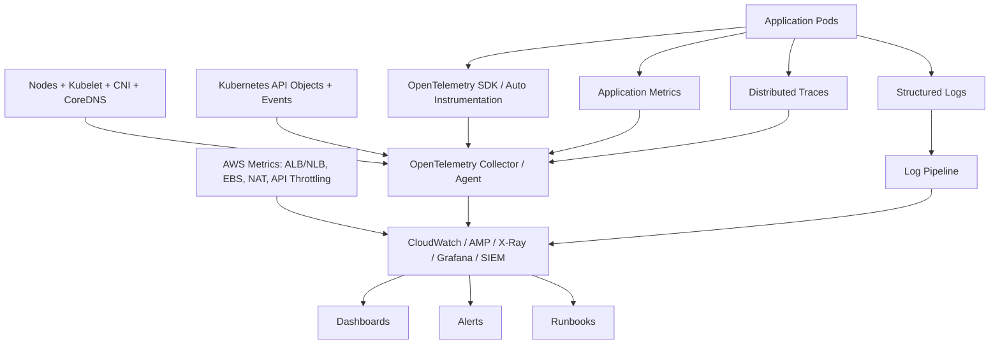
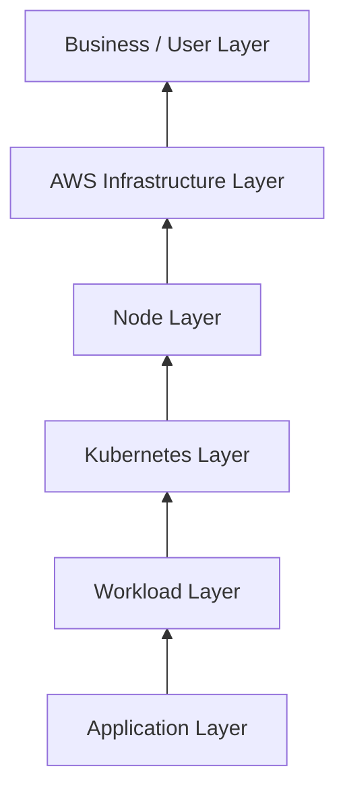
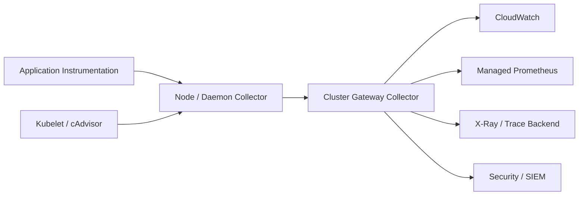
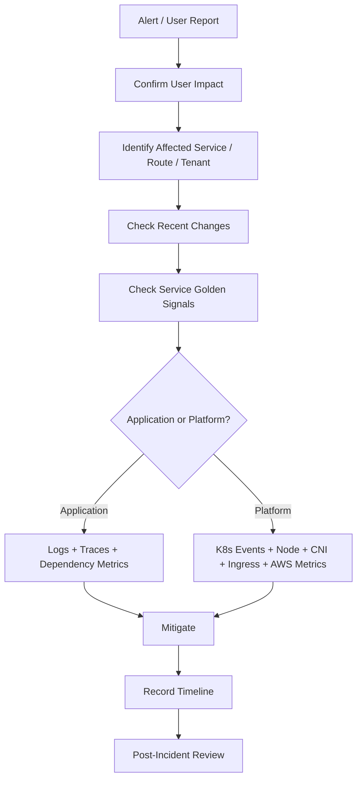

# Part 045 — EKS Observability Platform

Observability is not “install Prometheus”.

Observability is the ability to reconstruct what happened in a distributed system from outside the process, without guessing, without SSH, and without relying on tribal memory.

In EKS, this is harder than in ECS because there are more layers:

- AWS account and region;
- VPC, subnet, ENI, security group, NAT, and load balancer;
- EKS control plane;
- Kubernetes API objects;
- node operating system;
- kubelet;
- CNI;
- CoreDNS;
- ingress/load-balancer controller;
- service mesh or gateway layer;
- workload pods;
- application runtime;
- event source and downstream dependencies;
- CI/CD and GitOps reconciliation.

A weak observability platform shows many dashboards.

A strong observability platform answers questions quickly:

> “What changed, what is broken, who is affected, what boundary failed, and what should we do next?”

That is the standard.



## 1. The Real Goal

The goal is not to collect every signal.

The goal is to build a decision system.

A production observability platform must support five loops:

| Loop | Question | Signal Needed |
|---|---|---|
| Incident loop | Is the system broken now? | SLO, error rate, latency, saturation, backlog. |
| Debugging loop | Where is the failure boundary? | Logs, traces, Kubernetes events, deployment timeline. |
| Capacity loop | Will we run out of capacity? | CPU, memory, pod density, IPs, ENI, disk, queue depth. |
| Release loop | Did the last change cause harm? | Deployment markers, version labels, error delta, rollout events. |
| Governance loop | Are we operating safely? | Audit logs, policy violations, privilege changes, quota pressure. |

The platform is successful when engineers can move from symptom to boundary in minutes:

```txt
User-facing symptom
  -> Service / tenant / route affected
  -> Deployment or config change correlated
  -> Workload / node / dependency boundary isolated
  -> Runbook action selected
  -> Evidence captured for post-incident review
```

## 2. Observability Signals in EKS

EKS needs more than the classic three pillars.

For production Kubernetes, the practical signals are:

| Signal | What It Tells You | Example |
|---|---|---|
| Metrics | Quantified system behavior over time. | Request rate, p95 latency, CPU, memory, pod restarts. |
| Logs | Discrete facts emitted by processes. | Error context, validation failure, dependency timeout. |
| Traces | Cross-service request path. | API -> service -> database -> event publish. |
| Events | Kubernetes state transitions. | Pod failed scheduling, image pull backoff, probe failure. |
| Audit logs | Who changed what. | RBAC change, secret access, deployment patch. |
| Deployment metadata | What version is running. | Git SHA, image digest, chart version, rollout time. |
| Cost telemetry | What signal volume costs. | Log ingestion, metric cardinality, trace sampling rate. |

A cluster with metrics but no Kubernetes events is blind to scheduling failure.

A cluster with logs but no trace context is blind to cross-service failure.

A cluster with traces but no deployment markers is blind to release regression.

A cluster with everything but no cost governance becomes too expensive to keep.

## 3. Observability Layers

Do not design observability by tool.

Design it by layer.



### 3.1 Application Layer

This is what the code knows.

You need:

- request count;
- error count;
- latency distribution;
- dependency calls;
- domain-level failure reason;
- tenant/customer/operation context where safe;
- idempotency key where relevant;
- correlation ID;
- trace ID;
- version/build metadata.

For Java services, the minimum production baseline is:

```txt
service.name
service.version
service.environment
deployment.git_sha
container.image.digest
http.route
http.method
http.status_code
error.type
trace_id
span_id
correlation_id
tenant_id_hash
```

Do not log raw customer payloads by default.

Do not make tenant/customer ID a high-cardinality metric label unless you have a deliberate cost and retention model.

### 3.2 Workload Layer

This is what Kubernetes knows about the application.

Key signals:

- pod phase;
- pod restart count;
- readiness state;
- liveness failure;
- container exit code;
- waiting reason;
- OOMKilled;
- CPU request vs usage;
- memory request vs working set;
- throttling;
- HPA desired vs current replicas;
- deployment rollout progress;
- PDB blocking disruption.

The platform should answer:

```txt
Which workloads are unstable?
Which workloads are under-requested?
Which workloads are over-requested?
Which workloads cannot be disrupted safely?
Which workloads are blocking cluster upgrades?
```

### 3.3 Kubernetes Control Layer

This includes the API server, controllers, schedulers, admission webhooks, CRDs, and cluster events.

In managed EKS, you do not operate the control plane nodes, but you still depend on the control plane’s behavior.

Important signals:

- API server latency;
- API request errors;
- API throttling;
- webhook latency/failure;
- admission rejection;
- scheduler unschedulable events;
- Kubernetes object churn;
- CRD/controller reconciliation errors;
- GitOps sync drift.

A webhook outage can break deployments cluster-wide.

A broken CRD conversion webhook can block reads/writes for custom resources.

A bad admission policy can stop emergency patches.

Observability must include platform controllers, not just application pods.

### 3.4 Node Layer

For EKS node-based workloads, nodes remain failure domains.

Track:

- node readiness;
- allocatable CPU/memory/pods;
- disk pressure;
- memory pressure;
- PID pressure;
- kubelet errors;
- container runtime errors;
- image pull latency/failure;
- CNI errors;
- max pods per node;
- pod density;
- Spot interruption events;
- node age and AMI version.

A top-level “cluster healthy” dashboard is not enough.

You need to know whether the platform is silently accumulating bad nodes.

### 3.5 AWS Infrastructure Layer

EKS is Kubernetes on AWS, not Kubernetes in a vacuum.

Track:

- ALB/NLB target health;
- target response time;
- HTTP 4xx/5xx from load balancer;
- NAT Gateway bytes/errors/cost;
- VPC endpoint errors;
- subnet free IPs;
- ENI/IP allocation failure;
- EBS volume queue length/latency;
- EFS throughput/IO limits;
- AWS API throttling;
- KMS latency/errors;
- CloudWatch ingestion failures;
- ECR image pull failures;
- Route 53/DNS symptoms.

Most “Kubernetes incidents” eventually cross into AWS infrastructure.

If you cannot correlate pod failure to AWS infrastructure health, your model is incomplete.

## 4. Tooling Options on AWS

The common AWS-native stack is:

| Need | AWS-Native Option | Notes |
|---|---|---|
| Container infra metrics/logs | CloudWatch Container Insights | Good AWS-native baseline. |
| OpenTelemetry collection | ADOT Operator / Collector | Vendor-neutral collection layer. |
| Prometheus-compatible metrics | Amazon Managed Service for Prometheus | Useful for Prometheus ecosystem without operating servers. |
| Dashboards | Amazon Managed Grafana / CloudWatch Dashboards | Grafana is stronger for PromQL and mixed sources. |
| Traces | AWS X-Ray / OpenTelemetry backend | Use W3C trace context where possible. |
| Logs | CloudWatch Logs / external SIEM | Structure and retention matter more than destination. |
| Audit | EKS control plane logs + CloudTrail | Required for regulated environments. |

CloudWatch Container Insights can collect, aggregate, and summarize metrics/logs for EKS. AWS now positions OTel Container Insights through the `amazon-cloudwatch-observability` EKS add-on as a recommended path for EKS Container Insights. AWS also supports the ADOT Operator on EKS to send metrics and traces to destinations such as CloudWatch, Prometheus, and X-Ray.

The important architecture decision is not “CloudWatch or Prometheus?”

The important decision is:

> “Where do we normalize telemetry, enforce cardinality, enrich metadata, sample traces, route signals, and control cost?”

That is usually the collector layer.

## 5. Collector Architecture

A collector is a boundary.

It gives you control over:

- metadata enrichment;
- batching;
- retry;
- memory limiting;
- sampling;
- filtering;
- redaction;
- routing;
- multi-backend export;
- cost control.

A common pattern:



### 5.1 Agent Collector

Runs close to the workload.

Useful for:

- local scraping;
- kubelet/cAdvisor metrics;
- node-local batching;
- first-hop buffering;
- metadata enrichment.

Usually deployed as a DaemonSet for node-based workloads.

For EKS Fargate, DaemonSet assumptions do not hold. Design separate collection paths for Fargate workloads.

### 5.2 Gateway Collector

Runs as a scalable deployment.

Useful for:

- central sampling;
- routing by namespace/service;
- redaction;
- multi-backend fanout;
- tenant-based routing;
- exporter retry control;
- protecting backends from burst.

For serious platforms, avoid every pod exporting directly to many backends.

That creates uncontrolled client behavior, inconsistent tags, and duplicated cost.

## 6. Metrics Design

Metrics are for trends, alerts, and capacity decisions.

They are not for debugging every single request.

### 6.1 Golden Signals

For request/response services:

| Signal | Meaning |
|---|---|
| Traffic | How much demand is entering the service? |
| Errors | What fraction of demand fails? |
| Latency | How long does successful and failed work take? |
| Saturation | How close is the system to a hard limit? |

For async workers:

| Signal | Meaning |
|---|---|
| Backlog | How much work is waiting? |
| Age | How old is the oldest work? |
| Processing rate | How fast are workers draining? |
| Failure rate | How many attempts fail? |
| Retry/DLQ rate | How much work enters failure handling? |

For Kubernetes platform:

| Signal | Meaning |
|---|---|
| Pending pods | Capacity/scheduling failure. |
| CrashLoopBackOff | Runtime instability. |
| ImagePullBackOff | Supply-chain/network/permission failure. |
| Unschedulable events | Capacity, taint, affinity, quota, topology issue. |
| NodeNotReady | Data plane instability. |
| API throttling | Control-plane pressure. |
| CoreDNS latency/errors | Cluster-wide service discovery risk. |
| CNI allocation errors | Network capacity or CNI failure. |

### 6.2 USE Method for Nodes

For node resources:

| Resource | Utilization | Saturation | Errors |
|---|---|---|---|
| CPU | CPU usage | CPU throttling / run queue | Kernel/container runtime errors |
| Memory | Working set | Memory pressure / OOM | OOMKilled |
| Disk | Usage | IO queue / latency | Disk pressure / write failures |
| Network | Bytes/packets | Drops/retransmits | CNI/ENI errors |
| Pod capacity | Pods per node | Max pod pressure | Scheduling failures |

A node at 60% CPU can still be unhealthy if pods are CPU-throttled.

A cluster with 30% aggregate free CPU can still have pending pods if topology constraints, taints, or IP exhaustion prevent scheduling.

### 6.3 Cardinality Rules

Cardinality is the silent observability killer.

Bad labels:

```txt
user_id
request_id
order_id
session_id
raw_path
exception_message
sql_query
pod_uid as a primary dashboard dimension
```

Safer labels:

```txt
service
namespace
cluster
environment
http_route
operation
status_class
error_type
version
nodepool
capacity_type
```

Use `http.route`, not raw URL path.

Use `tenant_tier`, not raw tenant ID, unless there is a hard product requirement and budget.

Use exception class, not full exception message.

Use bounded enums wherever possible.

### 6.4 Histograms

Latency must be measured as a distribution.

Averages lie.

For HTTP APIs, track at least:

- p50;
- p90;
- p95;
- p99;
- max only for forensic context, not alerting.

Use histogram buckets aligned to SLOs.

Example:

```txt
50ms
100ms
250ms
500ms
1s
2s
5s
10s
```

If your SLO is 95% under 300ms, buckets that jump from 100ms to 1s are too coarse.

## 7. Logging Design

Logs are expensive and addictive.

A production logging strategy must define:

- format;
- fields;
- retention;
- redaction;
- sampling;
- severity semantics;
- ownership;
- query examples;
- incident workflow.

### 7.1 Structured Log Baseline

Use JSON logs.

Minimum fields:

```json
{
  "timestamp": "2026-07-06T10:15:30.123Z",
  "level": "ERROR",
  "service": "case-command-api",
  "environment": "prod",
  "version": "2026.07.06.1",
  "git_sha": "abc1234",
  "trace_id": "...",
  "span_id": "...",
  "correlation_id": "...",
  "operation": "CreateCase",
  "tenant_id_hash": "...",
  "error_type": "DownstreamTimeout",
  "message": "Payment service timed out while creating case payment hold"
}
```

Avoid:

```txt
ERROR failed
ERROR exception happened
ERROR request payload: {...full customer data...}
```

Logs must explain what happened without leaking sensitive data.

### 7.2 Severity Semantics

| Level | Meaning | Alert? |
|---|---|---|
| DEBUG | Local diagnostic detail. | No. Usually disabled in prod. |
| INFO | Important business/runtime event. | No. |
| WARN | Degraded but handled condition. | Maybe, if rate spikes. |
| ERROR | Failed operation requiring attention if rate/impact is high. | Maybe. |
| FATAL | Process cannot continue. | Yes, through crash/restart signal. |

Do not alert on every `ERROR` log line.

Alert on user impact and saturation.

Use logs to debug alerts.

### 7.3 Log Cost Control

Control cost through:

- retention by environment;
- sampling noisy success logs;
- removing raw payloads;
- reducing stack trace spam;
- using metrics for counters;
- moving high-volume audit streams to appropriate storage;
- suppressing repeated identical errors;
- standardizing log fields.

The worst pattern is using logs as a metrics database.

If you need to count it continuously, emit a metric.

## 8. Tracing Design

Traces reveal causality across services.

They are most valuable when:

- requests cross service boundaries;
- fanout occurs;
- async processing exists;
- latency budget matters;
- downstream dependencies fail;
- retries obscure root cause.

### 8.1 Trace Context

Propagate W3C trace context across:

- HTTP headers;
- gRPC metadata;
- SQS message attributes;
- EventBridge event detail metadata;
- Kafka headers;
- Step Functions input/output where appropriate.

For async systems, do not assume a single linear trace is always clean.

Model causality explicitly:

```txt
incoming HTTP request
  -> command accepted
  -> event emitted
  -> workflow started
  -> worker consumed event
  -> downstream call
```

### 8.2 Java Instrumentation

For Java workloads, prefer OpenTelemetry instrumentation where possible:

- HTTP server/client spans;
- JDBC spans with safe attributes;
- AWS SDK spans;
- messaging spans;
- custom domain spans around important operations.

Do not create spans for every private method.

Trace boundaries should match meaningful engineering boundaries:

```txt
validate command
load aggregate
authorize action
call external service
publish event
commit transaction
```

### 8.3 Sampling

Sampling is a product decision, not just an infra knob.

Common policies:

| Policy | Use Case |
|---|---|
| Head sampling | Simple, cheap, less context-aware. |
| Tail sampling | Capture slow/error traces more reliably. |
| Always sample errors | Debug failure paths. |
| Rate limit by service | Protect backend during incident. |
| Higher sample for canary | Validate new release. |

For high-volume systems, tail sampling at a gateway collector is often more useful than every service deciding locally.

## 9. Kubernetes Events

Kubernetes events are not optional.

They answer why the desired state could not become actual state.

Examples:

```txt
FailedScheduling
FailedMount
BackOff
Unhealthy
Killing
Pulling
Pulled
FailedCreatePodSandBox
FailedAttachVolume
NodeNotReady
```

A pod stuck in `Pending` is not an application metric problem.

It is a scheduling/capacity/policy problem.

Make Kubernetes events searchable and retained long enough for incidents.

Native event retention is short. Export important events into your logging/observability backend.

## 10. Audit and Security Signals

For regulated platforms, observability includes governance.

Track:

- Kubernetes audit logs;
- EKS control plane logs;
- CloudTrail for AWS API calls;
- IAM role assumption;
- admission policy denials;
- RBAC changes;
- secret reads;
- service account changes;
- image policy violations;
- namespace creation/deletion;
- network policy changes;
- GitOps override events;
- break-glass access usage.

Security observability answers:

```txt
Who changed the workload?
Who changed access?
Who accessed secrets?
Which pod assumed this AWS role?
Which image digest is running?
Was a policy exception used?
Was this change approved?
```

Do not wait for an audit to discover you cannot answer those questions.

## 11. Dashboard Architecture

Dashboards must match decision levels.

### 11.1 Executive / SLO Dashboard

Audience: leadership, incident commander, service owner.

Contains:

- availability SLO;
- latency SLO;
- error budget burn;
- top affected services;
- current incidents;
- deployment correlation;
- backlog/queue health for async systems.

No node CPU charts here.

### 11.2 Service Dashboard

Audience: service team.

Contains:

- request rate;
- error rate;
- latency percentiles;
- dependency latency/error;
- pod restarts;
- HPA replicas;
- saturation;
- deployment versions;
- logs link;
- traces link;
- runbook link.

### 11.3 Workload Dashboard

Audience: platform + service team.

Contains:

- deployment rollout status;
- replicas desired/current/ready/available;
- CPU/memory request vs usage;
- throttling;
- restart count;
- probe failures;
- OOMKilled;
- pod distribution by node/AZ;
- events.

### 11.4 Cluster Dashboard

Audience: platform team.

Contains:

- node readiness;
- pending pods;
- unschedulable reasons;
- CNI errors;
- CoreDNS health;
- API server latency/errors;
- admission webhook latency/errors;
- pod density;
- subnet IP capacity;
- node pool utilization;
- autoscaler/Karpenter actions.

### 11.5 Cost Dashboard

Audience: platform/product/finance.

Contains:

- log ingestion by namespace/service;
- metric cardinality by namespace/service;
- trace volume by service;
- high-cardinality metric names;
- retention policy;
- telemetry backend cost;
- top noisy workloads;
- NAT and data transfer cost signals.

Observability cost without ownership becomes everyone’s problem and no one’s responsibility.

## 12. Alerting Strategy

Bad alerts say:

```txt
CPU > 80%
Pod restarted
Error log found
Node memory high
```

Good alerts say:

```txt
Checkout API is burning 2% of monthly error budget in 1 hour.
Case command worker oldest message age is above 15 minutes.
Payment workflow failure rate exceeded 5% for 10 minutes.
Production cluster has unschedulable pods for customer-facing services.
```

Alert on symptoms first.

Use cause signals for routing and debugging.

### 12.1 Burn Rate Alerts

SLO burn alerts catch fast and slow failure modes.

Example pattern:

| Window | Burn | Purpose |
|---|---:|---|
| 5m / 1h | High burn | Fast incident detection. |
| 30m / 6h | Medium burn | Sustained degradation. |
| 2h / 1d | Slow burn | Gradual reliability loss. |

Do not page humans for every small transient blip.

Page when user impact or error budget consumption justifies interruption.

### 12.2 Deployment-Aware Alerts

Every alert should show:

- current version;
- previous version;
- deployment start time;
- rollout status;
- canary/blue-green state;
- image digest;
- Git SHA;
- config version.

When an incident starts within minutes of a rollout, that fact must be visible without manual archaeology.

### 12.3 Alert Routing

Routing should follow ownership:

| Alert Type | Primary Owner |
|---|---|
| Service SLO burn | Service team. |
| Cluster-wide pending pods | Platform team. |
| CNI/IP exhaustion | Platform/network team. |
| Ingress controller failure | Platform team. |
| Specific API latency | Service team. |
| Telemetry pipeline failure | Platform observability owner. |
| Policy/admission outage | Platform security owner. |

If everyone is paged, no one owns it.

## 13. Metadata Standard

Standard labels are the foundation of useful observability.

For Kubernetes objects:

```yaml
metadata:
  labels:
    app.kubernetes.io/name: case-command-api
    app.kubernetes.io/part-of: case-platform
    app.kubernetes.io/component: api
    app.kubernetes.io/version: "2026.07.06.1"
    platform.company.com/team: enforcement-platform
    platform.company.com/tier: customer-facing
    platform.company.com/environment: prod
    platform.company.com/data-classification: restricted
```

For telemetry resources:

```txt
service.name
service.namespace
service.version
deployment.environment
cloud.provider=aws
cloud.region
k8s.cluster.name
k8s.namespace.name
k8s.pod.name
k8s.container.name
container.image.name
container.image.tag
container.image.digest
```

Without metadata discipline, dashboards become manual filters and alerts become ambiguous.

## 14. Observability for GitOps

GitOps adds another control loop.

Track:

- sync status;
- health status;
- reconciliation duration;
- drift;
- failed apply;
- prune actions;
- app version;
- source revision;
- manual overrides;
- sync wave failures.

A production incident timeline should include GitOps events:

```txt
10:01 commit merged
10:03 image pushed
10:05 Argo CD synced
10:06 deployment rollout started
10:08 p95 latency increased
10:09 readiness failures increased
10:10 SLO alert fired
10:11 rollback triggered
```

Without this, engineers waste time asking, “Did anything change?”

## 15. Observability for Autoscaling

Autoscaling must be observable as a control loop.

Track:

- scaling metric value;
- desired replicas;
- current replicas;
- HPA condition;
- stabilization window;
- pending pods;
- node provisioning delay;
- Karpenter/Cluster Autoscaler decision;
- node launch time;
- pod startup time;
- readiness time;
- queue age/backlog.

Autoscaling failure usually appears as latency or backlog.

The root cause may be:

- metric unavailable;
- HPA cannot read metric;
- HPA max replicas too low;
- pods pending due to capacity;
- Karpenter constrained by NodePool requirements;
- subnet lacks IPs;
- image pull is slow;
- readiness gate is too strict;
- downstream dependency bottleneck prevents draining.

Make the entire scaling path visible.

## 16. Observability for Networking

For EKS networking, track:

- CoreDNS latency/errors;
- DNS query volume;
- VPC CNI IP allocation errors;
- pod sandbox creation failures;
- security group drops if using flow logs/traffic analytics;
- ALB/NLB target health;
- ingress controller reconciliation errors;
- service endpoint count;
- endpoint slice churn;
- NAT bytes and errors;
- VPC endpoint health;
- subnet free IPs.

A 503 from ALB can mean:

```txt
No healthy targets
Wrong target port
Readiness probe failing
Security group blocks traffic
Ingress annotation misconfigured
Pod not ready
Service selector mismatch
Controller failed reconciliation
```

The dashboard should help eliminate possibilities quickly.

## 17. Observability for Stateful Workloads

For EKS stateful workloads, track:

- PVC binding status;
- volume attach/detach errors;
- EBS queue length/latency;
- filesystem usage;
- storage class;
- snapshot status;
- backup freshness;
- pod/node AZ alignment;
- StatefulSet rollout state;
- replica lag for databases;
- restore drill results.

Stateful incidents are often slow-burning.

A disk usage alert at 95% is too late if volume expansion requires application coordination.

## 18. Telemetry Failure Modes

Your observability platform can fail too.

Common failure modes:

| Failure | Symptom | Prevention |
|---|---|---|
| Collector OOM | Missing metrics/traces/logs. | Memory limiter, batching, resource limits. |
| Backend throttling | Delayed/missing telemetry. | Retry budget, queues, sampling, export limits. |
| Cardinality explosion | Cost spike, backend slowdown. | Label allowlist, metric filter, review. |
| Log storm | High cost, delayed search. | Sampling, severity discipline, suppression. |
| Trace flood | Backend saturation. | Tail sampling, per-service rate limits. |
| Missing metadata | Useless dashboards. | Standard labels and collector enrichment. |
| Agent DaemonSet broken | Cluster-wide blind spot. | Add-on rollout discipline and self-monitoring. |
| Time skew | Broken correlation. | NTP/chrony health. |
| Retention too short | Cannot investigate after report. | Retention by signal class. |

Monitor the monitoring system.

At minimum:

- collector CPU/memory;
- dropped spans/logs/metrics;
- exporter errors;
- queue length;
- backend throttling;
- ingestion latency;
- dashboard query failures;
- alert evaluation failures.

## 19. Incident Workflow

During an incident, do not start with random dashboards.

Use a fixed diagnostic path.



### 19.1 First Five Questions

Ask:

1. Is this user-facing or internal-only?
2. Which service/route/tenant is affected?
3. Did anything deploy or change?
4. Is the failure in application code, Kubernetes scheduling/runtime, or AWS infrastructure?
5. Is the system saturated, failing, or slow?

### 19.2 Fast Commands

Useful first look:

```bash
kubectl get deploy -A
kubectl get pods -A --field-selector=status.phase!=Running
kubectl get events -A --sort-by=.lastTimestamp | tail -100
kubectl top pods -A
kubectl top nodes
kubectl get hpa -A
kubectl get pdb -A
kubectl get nodes -o wide
```

For a workload:

```bash
kubectl -n prod describe deploy case-command-api
kubectl -n prod describe pod <pod>
kubectl -n prod logs deploy/case-command-api --since=15m
kubectl -n prod rollout history deploy/case-command-api
kubectl -n prod rollout status deploy/case-command-api
```

For ingress:

```bash
kubectl -n prod get ingress
kubectl -n prod describe ingress case-command-api
kubectl -n kube-system logs deploy/aws-load-balancer-controller --since=30m
```

For scheduling:

```bash
kubectl get pods -A | grep Pending
kubectl describe pod <pending-pod> -n <namespace>
kubectl get nodes --show-labels
kubectl get events -A | grep -i FailedScheduling
```

Do not treat commands as the observability platform.

Commands are backup tools. The platform should surface most of this automatically.

## 20. Production Dashboard Minimum Set

A minimal EKS production platform should have:

| Dashboard | Owner | Must Answer |
|---|---|---|
| Global SLO | SRE/platform | Are users impacted? |
| Service | Service team | Is my service healthy? |
| Workload | Service + platform | Are pods stable and ready? |
| Cluster capacity | Platform | Can Kubernetes schedule? |
| Node pool | Platform | Are node pools healthy and efficient? |
| Ingress | Platform | Is external traffic healthy? |
| DNS/CoreDNS | Platform | Is service discovery healthy? |
| CNI/IP | Platform/network | Is pod networking healthy? |
| GitOps/release | Platform + service | What changed? |
| Observability pipeline | Platform | Are signals reliable? |
| Cost/cardinality | Platform | Is telemetry sustainable? |

## 21. Production Alert Minimum Set

A minimal EKS production platform should alert on:

- SLO burn for customer-facing services;
- elevated 5xx/error rate by route/service;
- p95/p99 latency SLO breach;
- worker backlog age above threshold;
- DLQ growth;
- deployment rollout failure;
- persistent pending pods for critical namespaces;
- CrashLoopBackOff rate spike;
- OOMKilled rate spike;
- NodeNotReady for production node pools;
- CoreDNS error/latency spike;
- CNI IP allocation failures;
- ingress target health failure;
- admission webhook failure/latency spike;
- telemetry collector drop/export failures;
- subnet free IPs below threshold;
- certificate expiry;
- backup failure for stateful workloads;
- audit/security policy violation.

Every page must have a runbook link.

No runbook, no page.

## 22. Cost Governance

Telemetry cost is architecture.

Control it through policy:

```txt
Logs:
  prod error/warn/info retention by service tier
  debug disabled by default
  payload logging prohibited

Metrics:
  allowed label policy
  cardinality review in CI
  high-cardinality detection

Traces:
  default sample rate by service tier
  always keep errors/slow requests
  canary release enhanced sampling

Dashboards:
  owner required
  stale dashboard cleanup

Alerts:
  owner required
  runbook required
  quarterly review
```

A good platform makes cost visible to teams.

A great platform prevents teams from accidentally producing unbounded telemetry.

## 23. Design Review Questions

Ask these before approving an EKS observability design:

1. Which user-facing SLOs are represented?
2. How are service, workload, node, and AWS infrastructure signals correlated?
3. Are deployment markers and image digests visible?
4. Can we identify the current version of every running workload?
5. Are Kubernetes events exported and searchable?
6. Are EKS control plane logs enabled where required?
7. Are audit/security events retained long enough?
8. Are trace IDs present in logs?
9. Are logs structured and redacted?
10. What prevents cardinality explosion?
11. What is the trace sampling policy?
12. What happens if the collector is down?
13. Are dashboards organized by decision level?
14. Does every page have an owner and runbook?
15. Can we debug pending pods in under five minutes?
16. Can we debug ALB 503s in under five minutes?
17. Can we debug worker backlog in under five minutes?
18. Can we prove who deployed what and when?
19. Is telemetry cost visible by namespace/team/service?
20. Is the observability stack itself monitored?

## 24. The Mental Model

An EKS observability platform is not a pile of agents.

It is a layered evidence system.

```txt
User impact
  -> service behavior
  -> workload behavior
  -> Kubernetes state
  -> node capacity
  -> AWS infrastructure
  -> deployment/change history
  -> owner/runbook/action
```

The top 1% engineer designs observability around failure isolation.

They do not ask, “Do we have metrics?”

They ask:

> “When production breaks at 02:00, what evidence will let the on-call engineer find the boundary, mitigate safely, and explain what happened?”

That is the bar.

## References

- AWS CloudWatch: Container Insights for Amazon EKS.
- AWS CloudWatch: Container Insights with OpenTelemetry metrics.
- Amazon EKS: AWS Distro for OpenTelemetry Operator.
- AWS Distro for OpenTelemetry documentation.
- Kubernetes documentation: debugging, events, probes, autoscaling, and resource management.
- OpenTelemetry documentation: semantic conventions, collectors, metrics, logs, traces.
