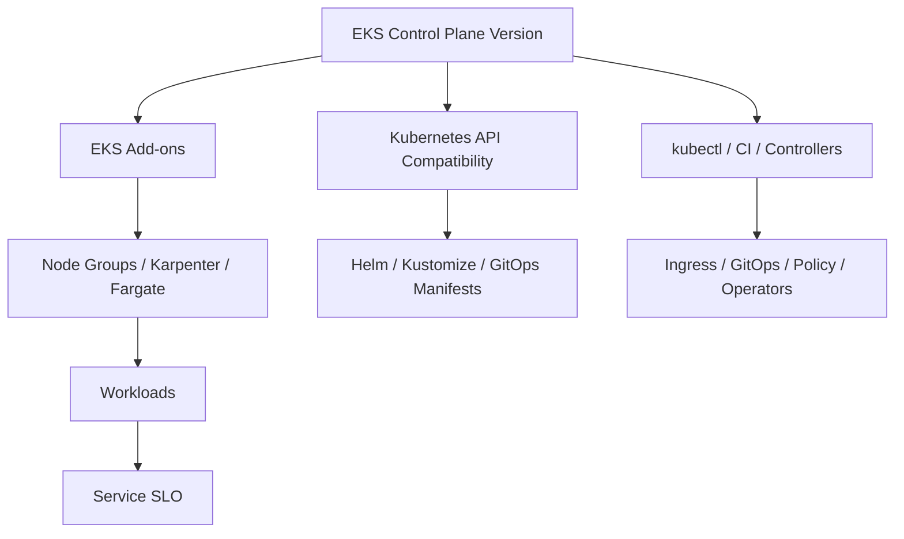
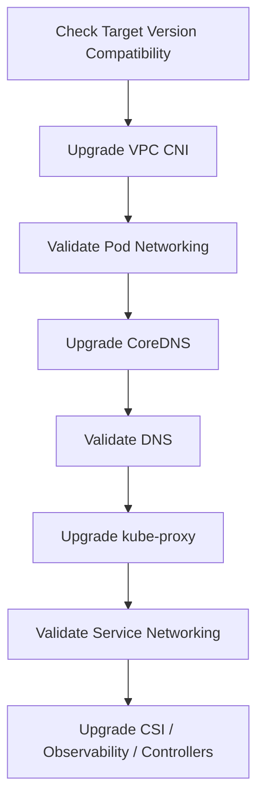

# Part 046 — EKS Upgrades and Day-2 Operations

Creating an EKS cluster is day zero.

Running it safely for years is day two.

Day-two operations are where Kubernetes platform maturity becomes visible:

- version upgrades;
- add-on upgrades;
- node rotation;
- security patches;
- API deprecation migration;
- controller lifecycle;
- policy changes;
- certificate and secret rotation;
- capacity drift;
- cost drift;
- incident response;
- compliance evidence.

The dangerous myth is this:

> “Because EKS manages the control plane, upgrades are mostly AWS’s problem.”

EKS manages important infrastructure, but your platform still owns compatibility, workload disruption, add-on behavior, node lifecycle, policies, controllers, manifests, and operational evidence.



An EKS upgrade is not one action.

It is a controlled migration of a distributed platform.

## 1. Day-Two Ownership Model

A production platform team owns these lifecycle domains:

| Domain | Owned By | Failure If Ignored |
|---|---|---|
| Kubernetes version | Platform | Unsupported cluster, forced upgrade, higher cost, security risk. |
| EKS add-ons | Platform | Networking/DNS/proxy incompatibility. |
| Node AMI/runtime | Platform | Security exposure, kubelet skew, runtime bugs. |
| Workload manifests | Service + platform | Removed API versions break deploys. |
| Controllers/operators | Platform + owning team | Reconciliation failures, webhook outages. |
| GitOps/IaC | Platform | Drift, failed apply, hidden manual changes. |
| Security policy | Platform/security | Unsafe workloads or blocked emergency operations. |
| Observability | Platform | Blind upgrades, unknown regressions. |
| Runbooks | Platform + service teams | Slow recovery. |

The key invariant:

> Every platform component must have an owner, version policy, upgrade path, rollback boundary, and signal of health.

If a controller has no owner, it is production debt.

## 2. What Actually Changes During an EKS Upgrade

A minor version upgrade can affect:

- Kubernetes API server behavior;
- admission behavior;
- default feature gates;
- removed/deprecated APIs;
- scheduler behavior;
- kubelet compatibility;
- kube-proxy behavior;
- CNI behavior;
- CoreDNS behavior;
- managed add-on compatibility;
- custom controller compatibility;
- CRD conversion webhooks;
- client library compatibility;
- Helm chart rendering;
- policy engine behavior;
- autoscaler behavior;
- workload disruption.

The control plane version is only the visible label.

The deeper question is:

> “Can every object, controller, node, and workload in this cluster safely operate against the target Kubernetes version?”

## 3. EKS Version Lifecycle

Amazon EKS provides a lifecycle for Kubernetes minor versions that includes standard support and extended support. Standard support begins when a Kubernetes version is released on EKS and lasts for a defined support window; extended support follows for an additional period.

This matters because version drift becomes both a reliability and cost problem.

A mature platform does not upgrade only when support is about to expire.

It maintains an upgrade cadence.

Recommended posture:

```txt
Target state:
  production clusters are no more than one minor version behind current approved baseline
  non-prod clusters test the next version before production
  platform add-ons are continuously updated within compatibility windows
  deprecated APIs are scanned continuously, not only during upgrade week
```

## 4. Upgrade Order

The safe order is generally:

```txt
1. Inventory and risk assessment
2. Deprecated API scanning
3. Add-on compatibility check
4. Controller/operator compatibility check
5. Non-prod upgrade rehearsal
6. Control plane upgrade
7. Add-on upgrades
8. Node group / data plane upgrade
9. Workload validation
10. Cleanup and evidence capture
```

Do not start with the control plane.

Start with evidence.

## 5. Version Skew

Kubernetes allows limited version skew between components, but it is not a license for uncontrolled drift.

The API server is the center of the compatibility model. Kubelets, kube-proxy, kubectl, controllers, and client libraries must remain within supported skew rules.

Practical platform rule:

```txt
Before control plane upgrade:
  nodes should not be ahead of control plane
  kubelet versions should be compatible
  kubectl/CI tools should support target version
  managed add-ons should support current and target version

After control plane upgrade:
  upgrade add-ons
  rotate/upgrade nodes
  confirm workload health
  remove deprecated API usage
```

Do not leave nodes permanently behind because “it still works”.

Temporary skew is an upgrade mechanism.

Permanent skew is operational debt.

## 6. Pre-Flight Inventory

Before upgrading, collect:

```bash
kubectl version
kubectl get nodes -o wide
kubectl get deployments,statefulsets,daemonsets -A
kubectl get hpa,pdb,ingress,networkpolicy -A
kubectl get crd
kubectl get validatingwebhookconfiguration,mutatingwebhookconfiguration
kubectl get apiservices
kubectl get events -A --sort-by=.lastTimestamp | tail -200
```

AWS/EKS inventory:

```bash
aws eks describe-cluster --name <cluster>
aws eks list-addons --cluster-name <cluster>
aws eks describe-addon --cluster-name <cluster> --addon-name vpc-cni
aws eks describe-addon --cluster-name <cluster> --addon-name coredns
aws eks describe-addon --cluster-name <cluster> --addon-name kube-proxy
aws eks list-nodegroups --cluster-name <cluster>
aws eks describe-nodegroup --cluster-name <cluster> --nodegroup-name <nodegroup>
```

Platform inventory:

```txt
Ingress controller version
GitOps controller version
policy controller version
cert-manager version
external-dns version
external-secrets version
metrics-server version
autoscaler/Karpenter version
service mesh/gateway version
CSI drivers
observability agents
backup controllers
```

A cluster is not upgrade-ready if you do not know what is installed.

## 7. Deprecated API Scanning

Kubernetes APIs evolve. Deprecated APIs are eventually removed.

This is one of the most common upgrade hazards.

Examples of risky patterns:

```yaml
apiVersion: extensions/v1beta1
kind: Ingress
```

```yaml
apiVersion: policy/v1beta1
kind: PodDisruptionBudget
```

```yaml
apiVersion: autoscaling/v2beta2
kind: HorizontalPodAutoscaler
```

The problem is not only what currently exists in the cluster.

You must scan:

- live objects;
- Helm chart templates;
- Kustomize overlays;
- GitOps repositories;
- CI-generated manifests;
- CRDs;
- operator-generated objects;
- old rollback manifests;
- documentation snippets copied by teams.

A production upgrade process includes continuous deprecated API checks in CI.

### 7.1 Useful Commands

List API versions used by live objects:

```bash
kubectl api-resources --verbs=list -o name | \
  xargs -n 1 kubectl get --ignore-not-found -A -o json > cluster-objects.json
```

Render charts before scanning:

```bash
helm template release-name ./chart -f values-prod.yaml > rendered.yaml
kubectl kustomize overlays/prod > rendered.yaml
```

Then scan rendered manifests with tools such as:

```txt
kubent
pluto
kube-no-trouble
kubeconform
kubeval-like schema validation
custom policy checks
```

The specific tool matters less than the invariant:

> No manifest may use an API removed in the target Kubernetes version.

## 8. Add-On Upgrade Strategy

Core EKS add-ons usually include:

- Amazon VPC CNI;
- CoreDNS;
- kube-proxy;
- EBS CSI driver where used;
- EFS CSI driver where used;
- CloudWatch observability add-on where used;
- ADOT Operator where used.

Each add-on has compatibility with cluster versions.

The VPC CNI is especially critical because it controls pod networking.

CoreDNS is especially critical because DNS failure becomes cluster-wide application failure.

kube-proxy is especially critical because it participates in service networking.

Upgrade add-ons deliberately, with health checks after each.



### 8.1 Add-On Health Checks

After VPC CNI change:

```bash
kubectl -n kube-system rollout status daemonset/aws-node
kubectl -n kube-system logs daemonset/aws-node --since=10m
kubectl get pods -A | grep -E 'ContainerCreating|Pending'
kubectl get events -A | grep -i 'pod sandbox\|cni\|ip'
```

After CoreDNS change:

```bash
kubectl -n kube-system rollout status deployment/coredns
kubectl -n kube-system logs deployment/coredns --since=10m
kubectl run dns-test --image=busybox:1.36 --rm -it --restart=Never -- nslookup kubernetes.default
```

After kube-proxy change:

```bash
kubectl -n kube-system rollout status daemonset/kube-proxy
kubectl get svc -A
kubectl get endpointslice -A
```

## 9. Node Upgrade Strategy

Nodes are where workloads experience disruption.

Node upgrade means some combination of:

- new kubelet version;
- new AMI;
- patched OS;
- container runtime changes;
- new bootstrap config;
- new node labels/taints;
- new instance type mix;
- new security posture;
- new storage/networking behavior.

### 9.1 Managed Node Groups

Managed node groups simplify lifecycle, but they do not remove workload responsibility.

Before rotating nodes:

- check PDBs;
- check topology spread;
- check replica count;
- check stateful workloads;
- check daemonsets;
- check node selectors/affinity;
- check local storage use;
- check capacity headroom.

A node rotation fails safely only if workloads can move safely.

### 9.2 Karpenter Nodes

For Karpenter, node lifecycle is driven by NodePool, NodeClass, drift, consolidation, expiration, and disruption rules.

Before upgrade:

- check Karpenter version compatibility;
- check NodePool constraints;
- check disruption budgets;
- check PDB interactions;
- check Spot/on-demand balance;
- check consolidation behavior;
- check AMI family and alias.

Karpenter can make upgrades easier by replacing drifted nodes.

It can also create surprises if disruption policy is too aggressive.

### 9.3 EKS Fargate Workloads

Fargate removes node management from your team, but not workload validation.

For Fargate workloads:

- validate pod startup;
- validate logging path;
- validate networking;
- validate DNS;
- validate resource sizing;
- validate unsupported DaemonSet assumptions;
- validate admission policies.

Fargate is not a bypass around Kubernetes API compatibility.

Your manifests and controllers still must work against the upgraded control plane.

## 10. Workload Disruption Model

Before upgrading, classify workloads:

| Workload | Risk | Required Protection |
|---|---|---|
| Stateless API with 3+ replicas | Low/moderate | Readiness, PDB, rolling strategy. |
| Single-replica API | High | Add replica or maintenance window. |
| StatefulSet database | High | Backup, failover plan, PDB, storage checks. |
| Queue worker | Moderate | Graceful shutdown, visibility timeout, idempotency. |
| Cron/scheduled job | Low/moderate | Avoid upgrade window overlap. |
| Admission webhook | Very high | HA, failurePolicy review, rollback path. |
| Ingress controller | Very high | Canary or staged upgrade. |
| GitOps controller | High | Manual recovery path. |
| CNI/CoreDNS/kube-proxy | Critical | Platform-level validation. |

The production rule:

> If a workload cannot survive node drain, it is not upgrade-safe.

## 11. PDB Reality Check

PodDisruptionBudget helps control voluntary disruption.

It does not protect against:

- node crash;
- kernel panic;
- AZ outage;
- involuntary eviction;
- bad rollout;
- application bug;
- insufficient replicas;
- broken readiness probe.

Bad PDB examples:

```yaml
minAvailable: 1
# on a one-replica deployment
```

This blocks voluntary disruption forever.

Another bad example:

```yaml
maxUnavailable: 0
# on a workload that must be rotated regularly
```

This can block node upgrades.

Good PDBs reflect actual availability design:

```yaml
apiVersion: policy/v1
kind: PodDisruptionBudget
metadata:
  name: case-command-api
spec:
  minAvailable: 2
  selector:
    matchLabels:
      app.kubernetes.io/name: case-command-api
```

Only if the deployment normally runs at least 3 replicas.

## 12. Upgrade Rehearsal

Never make production the first place you discover upgrade behavior.

Use at least one rehearsal environment that mirrors:

- Kubernetes version;
- add-ons;
- controllers;
- node type;
- policies;
- representative workloads;
- ingress path;
- observability stack;
- GitOps pipeline;
- autoscaling behavior.

The rehearsal should produce an upgrade report:

```txt
Cluster: staging-eks-prod-like
Current version: 1.x
Target version: 1.y
Deprecated API findings: none / list
Add-on compatibility: pass/fail
Controller compatibility: pass/fail
Node rotation duration: X minutes
Workload disruption: none / list
SLO validation: pass/fail
Rollback required: no / yes
Open risks: list
Decision: go / no-go
```

A rehearsal that produces no written evidence is just a hopeful test.

## 13. Control Plane Upgrade

The control plane upgrade changes the Kubernetes API server version.

Before starting:

- freeze risky deployments;
- confirm no active incident;
- confirm deprecated API scan;
- confirm add-on compatibility;
- confirm backups for critical stateful workloads;
- confirm runbook and communication channel;
- confirm rollback boundary is understood;
- confirm observability is healthy.

Important reality:

> EKS control plane version upgrades are not something you casually roll back like an app deployment.

Treat the control plane upgrade as a forward migration.

The rollback plan is usually workload-level mitigation, not downgrading the control plane.

## 14. Post-Control-Plane Checks

After upgrade:

```bash
kubectl version
kubectl get nodes
kubectl get pods -A
kubectl get events -A --sort-by=.lastTimestamp | tail -200
kubectl get --raw='/readyz?verbose'
kubectl get apiservices
kubectl get validatingwebhookconfiguration,mutatingwebhookconfiguration
```

Check:

- API server health;
- GitOps sync health;
- admission webhook behavior;
- ingress reconciliation;
- autoscaler behavior;
- HPA metrics;
- workload rollouts;
- Kubernetes events;
- SLO dashboards;
- alert noise.

Do not proceed to node upgrades if the platform is already unstable.

## 15. Data Plane Upgrade

Data plane upgrade usually means node replacement.

For managed node groups:

```bash
aws eks update-nodegroup-version \
  --cluster-name <cluster> \
  --nodegroup-name <nodegroup>
```

For `eksctl`:

```bash
eksctl upgrade nodegroup \
  --cluster <cluster> \
  --name <nodegroup> \
  --kubernetes-version <version>
```

For Karpenter, you may update NodePool/NodeClass/AMI configuration and let drift replacement happen under disruption budgets.

Observe:

- nodes cordoned/draining;
- replacement nodes joining;
- daemonsets ready;
- pod rescheduling;
- PDB blocks;
- pending pods;
- workload SLO;
- autoscaler/Karpenter logs;
- Spot interruptions if using Spot.

### 15.1 Drain Safety

Before draining:

```bash
kubectl get pdb -A
kubectl get pods -A -o wide
kubectl get deploy,statefulset -A
```

Manual drain pattern:

```bash
kubectl cordon <node>
kubectl drain <node> \
  --ignore-daemonsets \
  --delete-emptydir-data \
  --timeout=10m
```

Do not blindly force drain production nodes.

Force drain can turn a safe upgrade into an outage.

## 16. Controller and Operator Upgrades

EKS clusters accumulate controllers:

- AWS Load Balancer Controller;
- ExternalDNS;
- cert-manager;
- External Secrets Operator;
- Secrets Store CSI Driver;
- Argo CD/Flux;
- Kyverno/Gatekeeper;
- Karpenter;
- metrics-server;
- ADOT/observability collectors;
- service mesh/gateway controllers;
- backup operators;
- database operators.

Each controller has:

- CRDs;
- RBAC;
- webhooks;
- leader election;
- reconciliation loops;
- version compatibility;
- failure modes.

Upgrade pattern:

```txt
1. Read release notes
2. Check Kubernetes compatibility
3. Check CRD migration notes
4. Backup CRDs/custom resources if needed
5. Upgrade in staging
6. Verify reconciliation
7. Upgrade production
8. Verify webhook health
9. Verify generated AWS resources or Kubernetes resources
10. Capture evidence
```

Controllers can break production without application code changing.

A broken ingress controller can stop ALB updates.

A broken External Secrets controller can prevent secret refresh.

A broken policy webhook can block all deploys.

## 17. CRD and Webhook Risk

CRDs extend the Kubernetes API.

Webhooks intercept API operations.

That makes them powerful and dangerous.

Risky signs:

- CRD has no owner;
- CRD version has no migration plan;
- conversion webhook is single-replica;
- webhook has `failurePolicy: Fail` but weak availability;
- webhook has no PDB;
- webhook blocks core workload operations;
- operator is several versions behind;
- CRDs are installed manually outside GitOps.

Design rule:

> Any webhook that can block deployments must be more reliable than the workloads it protects.

## 18. GitOps and Upgrade Coordination

GitOps is both a safety mechanism and a risk during upgrades.

Before upgrade:

- ensure GitOps controller supports target Kubernetes version;
- freeze automated risky syncs if needed;
- ensure platform repo reflects current cluster state;
- verify no manual drift;
- tag current platform baseline;
- prepare rollback commits for add-ons/controllers;
- document sync order.

After upgrade:

- check app sync status;
- check health status;
- check failed apply;
- check deprecated API errors;
- check prune actions;
- check diff noise from API defaulting changes.

A common problem: the cluster upgrade succeeds, but GitOps continuously tries to apply manifests using removed API versions.

## 19. Upgrade Windows and Communication

Not every upgrade requires downtime.

But every production upgrade requires coordination.

Communicate:

```txt
What is changing?
Why now?
Which clusters/environments?
Expected user impact?
Expected platform impact?
Freeze window?
Rollback/mitigation boundary?
Who is on call?
How will success be measured?
Where is the incident channel?
```

For regulated environments, also capture:

- approval;
- risk assessment;
- validation evidence;
- post-change confirmation;
- open issues;
- compliance ticket/change record.

## 20. Upgrade Success Criteria

An upgrade is not successful when the command returns success.

It is successful when:

- control plane is on target version;
- add-ons are compatible and healthy;
- nodes are rotated/upgraded;
- no unsupported skew remains;
- critical controllers are healthy;
- GitOps is synced;
- no deprecated API usage remains for target/current baseline;
- SLOs remain healthy;
- no unexplained alert noise remains;
- audit/change evidence is recorded;
- next upgrade risk is lower than before.

If you finish an upgrade and leave old nodes, unsupported add-ons, failing controllers, or hidden deprecated APIs, the upgrade is incomplete.

## 21. Day-Two Operational Cadence

A high-performing platform team runs EKS as a continuous lifecycle, not an annual panic.

Recommended cadence:

| Cadence | Activity |
|---|---|
| Daily | Check cluster health, failed controllers, pending pods, critical alerts. |
| Weekly | Review node drift, add-on versions, noisy alerts, platform incidents. |
| Biweekly | Patch non-prod add-ons/controllers, scan deprecated APIs, review cost/cardinality. |
| Monthly | Upgrade/patch production add-ons where safe, rotate small node pools, review PDB blockers. |
| Quarterly | Kubernetes minor version rehearsal, disaster recovery drill, access review, policy review. |
| Per release | Validate manifests, API compatibility, security policies, observability metadata. |

The goal is small continuous maintenance.

The alternative is a large risky upgrade under deadline pressure.

## 22. Security Patch Operations

Security patching in EKS involves multiple layers:

- node AMI;
- Bottlerocket or OS packages;
- container base images;
- EKS add-ons;
- controllers/operators;
- application dependencies;
- IAM/RBAC policies;
- network policies;
- runtime configuration.

A CVE in a base image is not fixed by upgrading the cluster.

A CVE in node OS is not fixed by rebuilding app images.

A mature platform has separate patch lanes:

```txt
Application image patch lane
Node AMI patch lane
Kubernetes add-on patch lane
Controller/operator patch lane
Cluster minor upgrade lane
Emergency security lane
```

## 23. Backup and Recovery Operations

For stateless apps, GitOps + image registry + IaC may be enough to reconstruct.

For stateful workloads, you need real backups.

Track:

- what is backed up;
- backup frequency;
- retention;
- encryption;
- restore RTO/RPO;
- restore test frequency;
- owner;
- evidence.

Backup that is never restored is hope.

For EKS platform state, consider:

- Git repositories as desired-state backup;
- CRD/custom resource export for critical controllers;
- Velero or equivalent where appropriate;
- cloud-native snapshots for volumes;
- database-native backups for databases;
- separate backup account/bucket for ransomware resilience.

## 24. Certificate and Secret Rotation

Day-two operations include rotation:

- TLS certificates;
- IAM roles/policies;
- service account associations;
- Secrets Manager secrets;
- database credentials;
- webhook certificates;
- image signing keys;
- OIDC provider dependencies;
- GitOps deploy keys/tokens;
- external provider credentials.

Rotation must be tested before expiration.

Alert on expiration early:

```txt
90 days: ticket
30 days: warning
14 days: escalation
7 days: page for critical certs
```

A certificate expiring on a webhook can block API operations.

A certificate expiring on ingress becomes user-facing outage.

A secret rotation without app reload strategy becomes authentication outage.

## 25. Drift Management

Drift is when live state differs from intended state.

Sources:

- manual `kubectl edit`;
- emergency patches;
- controller defaulting;
- Helm chart changes;
- failed GitOps sync;
- IaC partial apply;
- AWS console changes;
- unmanaged add-ons;
- stale node groups;
- abandoned namespaces.

Drift policy:

```txt
All production platform resources must be owned by GitOps/IaC unless explicitly exempted.
Emergency changes must be backported to source of truth within defined SLA.
Unowned resources are reviewed and deleted or adopted.
```

Do not let the cluster become the source of truth.

## 26. Platform Inventory

Maintain a living inventory:

```yaml
cluster:
  name: prod-main
  region: ap-southeast-1
  kubernetesVersion: "1.x"
  supportWindow: standard
  owner: platform-runtime
  criticality: high
addons:
  vpc-cni: "x.y.z"
  coredns: "x.y.z"
  kube-proxy: "x.y.z"
controllers:
  aws-load-balancer-controller: "x.y.z"
  karpenter: "x.y.z"
  argo-cd: "x.y.z"
  kyverno: "x.y.z"
nodePools:
  - name: general-on-demand
    amiFamily: bottlerocket
    capacityType: on-demand
  - name: batch-spot
    capacityType: spot
```

Inventory is not bureaucracy.

It is the input to safe maintenance.

## 27. Failure Modes During Upgrades

| Failure | Likely Cause | Mitigation |
|---|---|---|
| GitOps apply fails | Removed/deprecated API. | Fix manifests, render/scan before upgrade. |
| Pods pending | Node capacity/IP/taint/affinity issue. | Check events, node pools, Karpenter, subnet IPs. |
| DNS failure | CoreDNS upgrade/config issue. | Roll back add-on/config, validate DNS. |
| New pods cannot start | CNI/image pull/secrets issue. | Check aws-node, ECR, IAM, endpoints. |
| ALB stops updating | Load balancer controller issue. | Check controller logs/webhook/RBAC. |
| Deployments blocked | Admission webhook failure. | Fix webhook, adjust failurePolicy only with risk approval. |
| Node drain stuck | PDB/single replica/stateful workload. | Adjust rollout/PDB/capacity. |
| HPA stops scaling | metrics-server/custom metrics issue. | Validate metrics API and adapter. |
| Karpenter does not provision | NodePool constraint or IAM issue. | Check Karpenter logs/events. |
| Telemetry disappears | collector/add-on failure. | Monitor observability pipeline. |

## 28. Emergency Break-Glass

Every platform needs break-glass access.

But break-glass must be governed.

Requirements:

- separate role;
- MFA;
- approval or incident declaration;
- time-limited access;
- audit logging;
- post-use review;
- automatic alert when used;
- documented commands allowed during emergency.

Break-glass is not a shortcut for normal operations.

It is a controlled escape hatch when automation or policy blocks recovery.

## 29. Runbook: Minor Version Upgrade

A practical runbook:

```txt
Phase 0: Preparation
  - confirm owner and change window
  - confirm target version support
  - freeze risky production changes
  - export inventory
  - scan deprecated APIs
  - verify add-on/controller compatibility
  - rehearse in staging
  - capture pre-upgrade SLO baseline

Phase 1: Control Plane
  - start upgrade
  - monitor EKS update status
  - verify kubectl access
  - verify API readiness
  - verify GitOps/controllers

Phase 2: Add-ons
  - upgrade VPC CNI
  - validate pod networking
  - upgrade CoreDNS
  - validate DNS
  - upgrade kube-proxy
  - validate service networking
  - upgrade CSI/observability add-ons as needed

Phase 3: Data Plane
  - rotate managed node groups / Karpenter nodes
  - watch PDB blocks
  - watch pending pods
  - validate daemonsets
  - validate workload SLOs

Phase 4: Validation
  - validate critical user journeys
  - validate dashboards and alerts
  - validate GitOps sync
  - validate ingress/DNS/autoscaling
  - validate stateful workloads

Phase 5: Closeout
  - document final versions
  - document issues
  - remove temporary freezes
  - create follow-up tasks
  - update platform baseline
```

## 30. Runbook: Add-On Upgrade

```txt
1. Identify add-on and target version
2. Check compatibility with cluster version
3. Read release notes
4. Test in staging
5. Confirm rollback version
6. Upgrade production add-on
7. Watch rollout
8. Validate function-specific health
9. Watch SLOs and platform alerts
10. Record evidence
```

For VPC CNI, validate new pod creation.

For CoreDNS, validate service discovery.

For kube-proxy, validate service connectivity.

For EBS CSI, validate attach/mount/snapshot behavior.

For observability add-ons, validate signal continuity.

## 31. Runbook: Node Rotation

```txt
1. Confirm spare capacity
2. Confirm PDBs are not impossible
3. Confirm workloads have enough replicas
4. Confirm stateful workloads have backup/failover plan
5. Add replacement capacity or update node group
6. Cordon/drain gradually
7. Watch pod rescheduling
8. Watch SLOs
9. Remove old nodes
10. Confirm no old AMI/kubelet remains
```

Node rotation should be boring.

If it is dramatic, the workloads are not designed for Kubernetes operations.

## 32. Production Readiness for Upgrades

A workload is upgrade-ready if:

- it has at least two replicas for production API workloads, preferably three across AZs;
- readiness probes reflect real serving ability;
- graceful shutdown works;
- PDB is valid and not impossible;
- it does not rely on local node state unless designed as stateful;
- it tolerates rescheduling;
- it has resource requests;
- it has owner labels;
- it has SLOs and alerts;
- it uses supported API versions;
- it has rollback-compatible schema/config where needed.

If teams ask why this matters, the answer is simple:

> Kubernetes maintenance is part of the runtime contract.

## 33. Design Review Questions

Ask these for every EKS platform:

1. What Kubernetes versions are running across all clusters?
2. Which clusters are in standard support vs extended support?
3. What is the next target version?
4. When was the last non-prod upgrade rehearsal?
5. Are deprecated APIs scanned in CI?
6. Are live cluster objects scanned?
7. Who owns every controller/operator?
8. Are EKS add-ons managed or manually installed?
9. Are add-on versions compatible with target cluster version?
10. Are nodes on supported AMI/kubelet versions?
11. Are PDBs blocking node rotation?
12. Are single-replica critical workloads present?
13. Can platform webhooks survive disruption?
14. Is GitOps compatible with the target version?
15. Are CRDs backed up or reproducible?
16. Can we rotate nodes safely during business hours?
17. Are SLO dashboards watched during upgrades?
18. Is the rollback/mitigation boundary clear?
19. Is change evidence captured?
20. Does each cluster have a lifecycle owner?

## 34. The Mental Model

EKS day-two operations are a lifecycle discipline.

```txt
Inventory
  -> compatibility analysis
  -> rehearsal
  -> controlled upgrade
  -> validation
  -> evidence
  -> continuous cleanup
```

The top 1% engineer does not treat upgrades as occasional chores.

They design the platform so upgrades are expected, observable, reversible where possible, and safe by construction.

A healthy EKS platform is not one that never changes.

A healthy EKS platform is one that can change continuously without surprising its users.

## References

- Amazon EKS documentation: Kubernetes version lifecycle, standard support, extended support.
- Amazon EKS documentation: update existing cluster to a new Kubernetes version.
- Amazon EKS documentation: managed node group updates.
- Amazon EKS best practices: cluster upgrade planning.
- Amazon EKS documentation: EKS add-ons.
- Kubernetes documentation: Version Skew Policy.
- Kubernetes documentation: Deprecated API Migration Guide.
- Kubernetes documentation: PodDisruptionBudget and workload disruption.
