# Part 047 — EKS Failure Modes and Runbooks

EKS incidents rarely start as “Kubernetes is broken.”

They usually start as one of these:

- a pod cannot be scheduled;
- a container cannot start;
- a container starts but crashes;
- a service has no ready endpoints;
- DNS resolution becomes unreliable;
- a node stops admitting or running pods;
- the CNI cannot allocate IP addresses;
- an admission webhook blocks the control plane path;
- an ingress controller cannot reconcile AWS resources;
- a load balancer routes to unhealthy targets;
- a rollout pushes a bad version and hides the original evidence;
- an autoscaler cannot provision the node shape the workload requested.

The top-tier engineer does not debug these as isolated symptoms. They reconstruct the control loop.

EKS is a stack of reconciliation loops:

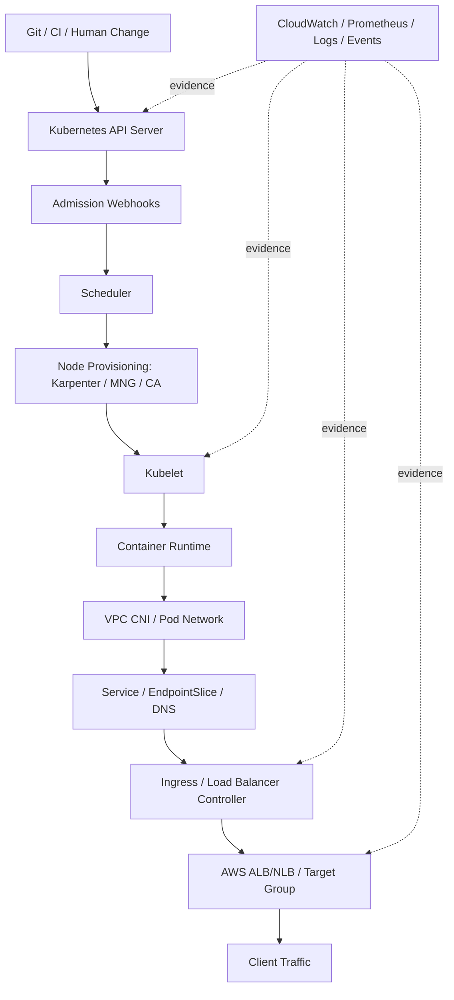

A runbook is not a list of commands.

A runbook is a **causal narrowing procedure**.

You start from the observed failure, identify which loop stopped making progress, collect evidence before mutation, and only then apply a fix.

---

## 1. The First Rule: Preserve Evidence Before Repair

Bad Kubernetes debugging destroys evidence.

Common mistakes:

- restarting pods before reading previous logs;
- deleting stuck pods before reading events;
- scaling deployments down before reading rollout state;
- forcing a new image before checking image digest;
- upgrading add-ons before checking current add-on health;
- changing security groups before validating actual rejected path;
- clearing the queue before preserving poison-message examples.

During incidents, capture a small evidence bundle first.

```bash
# Scope.
kubectl config current-context
kubectl get ns
kubectl get deploy,sts,ds,job,cronjob -A
kubectl get pods -A -o wide
kubectl get nodes -o wide
kubectl get events -A --sort-by='.lastTimestamp' | tail -200

# For one workload.
NS=payments
APP=payment-api

kubectl -n "$NS" get deploy "$APP" -o yaml > deploy.$APP.yaml
kubectl -n "$NS" describe deploy "$APP" > deploy.$APP.describe.txt
kubectl -n "$NS" get rs,pod,svc,endpointslice -l app="$APP" -o wide > workload.$APP.txt
kubectl -n "$NS" describe pod -l app="$APP" > pods.$APP.describe.txt
kubectl -n "$NS" logs -l app="$APP" --tail=300 > pods.$APP.logs.txt
kubectl -n "$NS" logs -l app="$APP" --previous --tail=300 > pods.$APP.previous.logs.txt || true
```

Evidence has a shelf life. Kubernetes events rotate. Pod `lastState` gets overwritten after repeated restarts. Autoscalers and controllers keep reconciling while you investigate.

Preserve first. Repair second.

---

## 2. Symptom-to-Layer Map

Use this map before jumping to commands.

| Symptom | Likely Layer | First Evidence |
|---|---|---|
| `Pending` pod | scheduler, quota, PVC, capacity, taint, node provisioning | `kubectl describe pod`, scheduler events |
| `ImagePullBackOff` | registry, image name/tag/digest, auth, network, architecture | pod events, kubelet events, ECR permissions |
| `CrashLoopBackOff` | application, config, secret, OOM, probe, dependency startup | previous logs, container state, exit code |
| `OOMKilled` | memory limit, JVM sizing, leak, burst, native memory | `lastState`, metrics, JVM flags |
| `Ready=False` | readiness probe, dependency health, startup delay | pod describe, probe logs, app health endpoint |
| Service has no endpoints | selector mismatch, pods not ready, EndpointSlice lag | `svc`, `endpointslice`, labels |
| ALB 503 | no healthy targets, target group registration, readiness | target group health, ingress events |
| ALB 502 | app closed connection, bad protocol, timeout, container crash | ALB logs, app logs, target health reason |
| ALB 504 | timeout budget mismatch, slow downstream, saturation | ALB metrics, app latency, downstream metrics |
| DNS timeout | CoreDNS, kube-proxy, node local PPS limit, network policy | CoreDNS metrics/logs, `nslookup`, node metrics |
| Node `NotReady` | kubelet, CNI, disk pressure, network, IAM, EC2 health | node describe, system logs, CNI logs |
| Pods cannot get IP | subnet exhaustion, ENI/IP limit, VPC CNI config | `aws-node` logs, subnet free IPs |
| Deploy stuck | rollout config, PDB, insufficient capacity, bad readiness | rollout status, ReplicaSet, events |
| `context deadline exceeded` from kubectl | API endpoint path, IAM auth, network, webhook latency | API access, CloudTrail, webhook state |
| Admission request hangs | mutating/validating webhook outage | API server symptoms, webhook configs |
| Karpenter not provisioning | constraints impossible, quota, instance availability, IAM | Karpenter logs, NodePool/NodeClaim events |

The fastest path is not “try everything.” The fastest path is finding the first broken transition.

---

## 3. Universal Debugging Loop

Every EKS incident can be narrowed with the same skeleton.

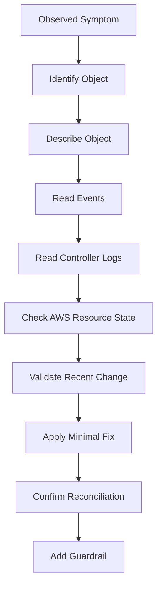

The object is usually one of:

- `Pod`
- `Deployment`
- `ReplicaSet`
- `StatefulSet`
- `DaemonSet`
- `Job`
- `Service`
- `EndpointSlice`
- `Ingress`
- `Gateway`
- `Node`
- `PersistentVolumeClaim`
- `HorizontalPodAutoscaler`
- `PodDisruptionBudget`
- `NodePool`
- `NodeClaim`
- `ValidatingWebhookConfiguration`
- `MutatingWebhookConfiguration`

The controller logs are usually one of:

- `kube-system/aws-node`
- `kube-system/coredns`
- `kube-system/kube-proxy`
- `aws-load-balancer-controller`
- `karpenter`
- `external-secrets`
- `cert-manager`
- `argo-cd`
- `kyverno` or `gatekeeper`
- application controller/operator logs

The AWS state is usually one of:

- EC2 instance status;
- subnet free IP count;
- security group rules;
- route table/NAT/VPC endpoint path;
- ECR repository/image permission;
- IAM role trust policy;
- target group health;
- load balancer listener/rule;
- CloudWatch metrics/logs;
- CloudTrail denied calls;
- service quotas.

---

## 4. Runbook: `kubectl` Cannot Reach the Cluster

### Symptom

```txt
Unable to connect to the server
You must be logged in to the server
context deadline exceeded
the server has asked for the client to provide credentials
```

### Mental Model

`kubectl` must pass three boundaries:

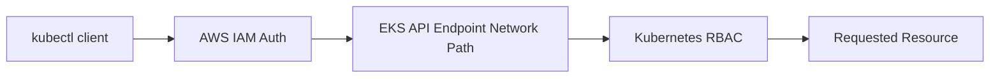

A failure can be:

- wrong kubeconfig/context;
- expired AWS credentials;
- IAM principal not mapped via EKS access entry or legacy `aws-auth`;
- private API endpoint unreachable;
- public endpoint blocked by allowed CIDR;
- Kubernetes RBAC denies the action;
- admission webhook timeout after API request reaches the cluster.

### Evidence

```bash
aws sts get-caller-identity
kubectl config current-context
aws eks describe-cluster --name "$CLUSTER" --region "$REGION" \
  --query 'cluster.resourcesVpcConfig.{endpointPublicAccess:endpointPublicAccess,endpointPrivateAccess:endpointPrivateAccess,publicAccessCidrs:publicAccessCidrs}'

kubectl auth can-i get pods -A
kubectl auth can-i '*' '*' -A
```

### Diagnosis

| Finding | Meaning |
|---|---|
| `aws sts get-caller-identity` fails | local AWS credential problem |
| `describe-cluster` denied | IAM cannot call EKS API |
| kubeconfig points to wrong cluster | local context problem |
| private endpoint only and client outside VPC | network path problem |
| `kubectl auth can-i` says no | Kubernetes RBAC/access entry problem |
| list/get works but create/update hangs | admission webhook or API extension issue |

### Fix Pattern

- Refresh SSO/session or assume correct role.
- Regenerate kubeconfig with explicit role.
- Use VPN/bastion/SSM path for private endpoint clusters.
- Add or fix EKS access entry for the IAM principal.
- Bind least-privilege Kubernetes RBAC.
- If webhook outage blocks writes, use the webhook outage runbook.

---

## 5. Runbook: Pod Stuck in `Pending`

### Symptom

```bash
kubectl -n payments get pods
# payment-api-7c9d8... 0/1 Pending
```

### Mental Model

A pod becomes running only if the scheduler can find a node satisfying all constraints:

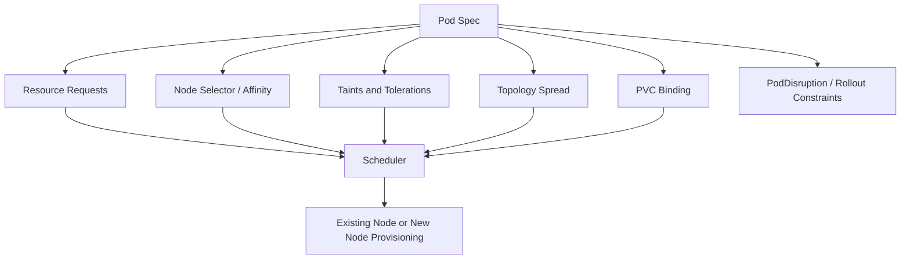

### Evidence

```bash
NS=payments
POD=payment-api-xxxxx

kubectl -n "$NS" describe pod "$POD"
kubectl get nodes -o wide
kubectl describe nodes | egrep -i "Name:|Taints:|Allocatable:|Allocated resources:"
kubectl -n "$NS" get quota,limitrange,pdb
kubectl -n "$NS" get pvc
kubectl get events -A --sort-by='.lastTimestamp' | tail -100
```

### Common Causes

| Event | Cause |
|---|---|
| `Insufficient cpu` | requests too high or cluster too small |
| `Insufficient memory` | memory request exceeds available allocatable memory |
| `had untolerated taint` | missing toleration |
| `node(s) didn't match Pod's node affinity/selector` | impossible or too strict scheduling rule |
| `pod has unbound immediate PersistentVolumeClaims` | PVC cannot bind |
| `max node group size reached` | Cluster Autoscaler/managed node group boundary |
| Karpenter creates no `NodeClaim` | constraints impossible or Karpenter broken |
| Karpenter `NodeClaim` fails | EC2 capacity, quota, IAM, subnet/security group, AMI issue |

### Fix Pattern

Do not start by increasing node count.

First classify the scheduling reason:

1. **Resource shortage**: reduce request, scale node pool, or add larger instance class.
2. **Constraint impossibility**: loosen node selector, affinity, topology spread, architecture, zone, or capacity-type constraints.
3. **PVC binding**: fix storage class, access mode, zone topology, or provisioner.
4. **Quota**: adjust namespace quota or workload request.
5. **Autoscaler cannot act**: inspect Karpenter/Cluster Autoscaler logs and cloud provider permissions.
6. **PDB/rollout interaction**: check deployment strategy and availability budgets.

### Karpenter Evidence

```bash
kubectl get nodepool,nodeclaim -A
kubectl describe nodepool
kubectl describe nodeclaim
kubectl -n kube-system logs deploy/karpenter --tail=300
```

A common platform smell is a workload with this combination:

```yaml
nodeSelector:
  kubernetes.io/arch: amd64
topologySpreadConstraints:
  - maxSkew: 1
    topologyKey: topology.kubernetes.io/zone
resources:
  requests:
    cpu: "6"
    memory: 24Gi
```

This may be valid, but it demands multi-AZ availability of large amd64 instances. If the NodePool only allows small instances or one AZ, the scheduler is correct to reject it.

---

## 6. Runbook: `CrashLoopBackOff`

### Symptom

```txt
CrashLoopBackOff
Back-off restarting failed container
```

### Mental Model

`CrashLoopBackOff` is not the root cause. It is kubelet saying:

> “I started the container, the container exited, I restarted it, it exited again, and I am backing off.”

The root cause is usually inside the previous container execution.

### Evidence

```bash
NS=payments
POD=payment-api-xxxxx
CONTAINER=app

kubectl -n "$NS" describe pod "$POD"
kubectl -n "$NS" logs "$POD" -c "$CONTAINER" --previous --tail=300
kubectl -n "$NS" logs "$POD" -c "$CONTAINER" --tail=300
kubectl -n "$NS" get pod "$POD" -o jsonpath='{.status.containerStatuses[*].lastState}'
kubectl -n "$NS" get pod "$POD" -o jsonpath='{.status.containerStatuses[*].restartCount}'
```

### Classification

| Evidence | Likely Cause |
|---|---|
| exit code `1` | app startup error |
| exit code `137` / `OOMKilled` | memory limit hit |
| exit code `143` | terminated by SIGTERM |
| previous logs show missing env | config/secret issue |
| previous logs show database connection timeout | startup dependency coupling |
| liveness probe failures | liveness probe too aggressive or app deadlocked |
| startup probe missing | slow boot misclassified as unhealthy |
| class not found / jar missing | image build problem |
| permission denied | non-root filesystem/runtime issue |
| architecture error | built image for wrong architecture |

### Java-Specific CrashLoop Causes

| Cause | Signal | Fix |
|---|---|---|
| JVM uses too much heap relative to container limit | OOMKilled | set `MaxRAMPercentage`, include native headroom |
| migration runs on every pod startup | DB lock or timeout | separate migration job or leader-only migration |
| Spring Boot waits for optional downstream | startup timeout | decouple readiness from startup |
| liveness probe hits endpoint requiring DB | restart loop during DB outage | liveness should prove process health, not dependency health |
| huge classpath/container image | slow startup then probe kill | startup probe, dependency trimming |
| no writable temp dir | `Permission denied` | configure writable temp or mount emptyDir |

### Fix Pattern

1. Read previous logs.
2. Check `lastState`.
3. Check whether the container exits by itself or is killed by kubelet.
4. Validate config/secret.
5. Validate memory limit vs JVM settings.
6. Validate probes.
7. Validate recent image digest.
8. Roll back only after evidence is captured.

### Bad Fix

```bash
kubectl -n payments delete pod payment-api-xxxxx
```

This may temporarily restart the pod, but it loses short-lived evidence and does not fix the deployment.

---

## 7. Runbook: `ImagePullBackOff` / `ErrImagePull`

### Symptom

```txt
Failed to pull image
ImagePullBackOff
manifest unknown
no basic auth credentials
i/o timeout
```

### Mental Model

Image pull requires:

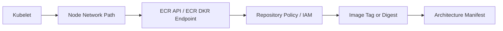

### Evidence

```bash
kubectl -n "$NS" describe pod "$POD"
kubectl -n "$NS" get pod "$POD" -o jsonpath='{.spec.containers[*].image}'
aws ecr describe-images --repository-name "$REPO" --image-ids imageTag="$TAG" --region "$REGION"
```

For private subnet clusters, validate:

- NAT route or VPC endpoints for ECR API, ECR DKR, S3 layer download path, CloudWatch Logs if needed;
- security group egress;
- DNS resolution;
- IAM permissions for node role or pull secret.

### Common Causes

| Event | Meaning |
|---|---|
| `manifest unknown` | tag/digest does not exist |
| `no basic auth credentials` | auth/pull secret/IAM issue |
| `403` | repository policy/IAM denies access |
| `i/o timeout` | node cannot reach registry endpoint |
| `exec format error` after pull | architecture mismatch |
| image pulls in one AZ but not another | route table/NAT/VPC endpoint/subnet issue |

### Fix Pattern

- Prefer digest pinning for production releases.
- Validate image exists before deploy.
- Validate ECR repository policy for cross-account pulls.
- Validate node IAM permissions.
- For private clusters, use VPC endpoints where appropriate.
- Ensure multi-architecture images are deliberate, not accidental.

---

## 8. Runbook: Node `NotReady`

### Symptom

```bash
kubectl get nodes
# ip-10-0-3-42 Ready/SchedulingDisabled? NotReady
```

### Mental Model

A node is useful only if four agents are healthy:

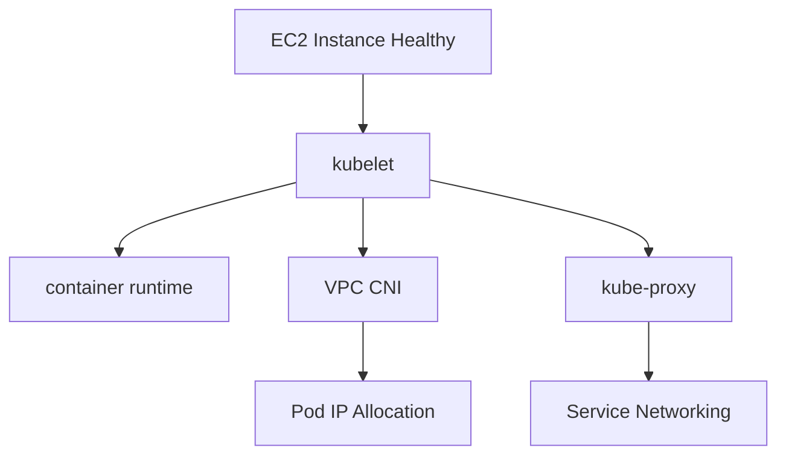

### Evidence

```bash
NODE=ip-10-0-3-42.ec2.internal

kubectl describe node "$NODE"
kubectl get pods -A -o wide --field-selector spec.nodeName="$NODE"
kubectl -n kube-system get pods -o wide | egrep 'aws-node|kube-proxy|coredns'
```

Then inspect AWS:

```bash
aws ec2 describe-instance-status --instance-ids "$INSTANCE_ID" --include-all-instances
aws ec2 describe-instances --instance-ids "$INSTANCE_ID"
```

If using SSM or node access is available:

```bash
sudo journalctl -u kubelet --since "30 minutes ago"
sudo journalctl -u containerd --since "30 minutes ago"
sudo df -h
sudo free -m
sudo dmesg | tail -100
```

### Common Causes

| Node Condition/Event | Meaning |
|---|---|
| `MemoryPressure` | node memory exhaustion |
| `DiskPressure` | image/log/ephemeral storage pressure |
| `NetworkUnavailable` | CNI problem |
| kubelet auth errors | node role/IAM/bootstrap issue |
| `NotReady` after add-on upgrade | CNI/kube-proxy/CoreDNS compatibility or crash |
| many pods stuck terminating | node drain/runtime issue |
| EC2 status check failed | infrastructure issue |

### Fix Pattern

- If one node: cordon, drain if safe, replace.
- If many nodes: inspect common dependency: CNI, AMI, IAM, security group, route table, add-on rollout.
- If after upgrade: compare node AMI/add-on/Kubernetes versions.
- If disk pressure: inspect log/image growth and eviction policy.
- If CNI: inspect `aws-node` DaemonSet and `ipamd` logs.

---

## 9. Runbook: VPC CNI / Pod IP Exhaustion

### Symptom

```txt
failed to assign an IP address to container
networkPlugin cni failed to set up pod
Insufficient pods
```

### Mental Model

In default EKS VPC CNI mode, pods consume IP addresses from VPC subnets. The CNI runs on each EC2 node, attaches ENIs, and assigns VPC IP addresses to pods.

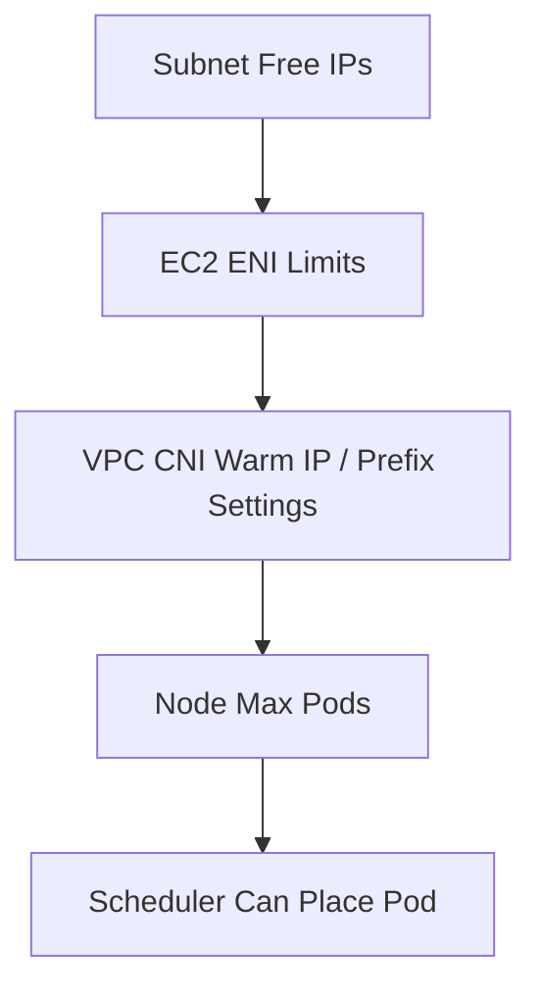

IP exhaustion can happen at subnet, node ENI, prefix, or max-pods level.

### Evidence

```bash
kubectl -n kube-system get ds aws-node
kubectl -n kube-system logs ds/aws-node -c aws-node --tail=300
kubectl describe node "$NODE" | egrep -i "pods|allocatable|allocated|network|cni"

aws ec2 describe-subnets --subnet-ids $SUBNET_IDS \
  --query 'Subnets[*].{SubnetId:SubnetId,AvailableIpAddressCount:AvailableIpAddressCount,CidrBlock:CidrBlock,Az:AvailabilityZone}'
```

### Common Causes

| Cause | Signal |
|---|---|
| subnet out of IPs | low `AvailableIpAddressCount` |
| instance type too small | low ENI/IP capacity |
| max-pods too low | schedulable capacity lower than expected |
| no prefix delegation | inefficient IP allocation at scale |
| custom networking misconfigured | pods not receiving expected address space |
| Karpenter provisions nodes into constrained subnets | NodeClaim subnet selection issue |

### Fix Pattern

Short-term:

- scale out into subnets with free IPs;
- reduce pod density pressure;
- restart failed pods after CNI recovers;
- provision additional node groups/subnets if available.

Medium-term:

- enable prefix delegation where appropriate;
- use larger subnets;
- isolate pod subnets from load balancer/node infrastructure;
- design per-AZ IP budget;
- model max pod count per instance type;
- consider IPv6 if IPv4 space is strategically exhausted.

### IP Budget Formula

For each AZ, track:

```txt
required_free_ips =
  peak_pods_in_az
+ node_primary_ips
+ load_balancer_ips
+ interface_endpoint_ips
+ rollout_surge_pods
+ failure_rebalance_buffer
```

If you do not budget rollout surge and AZ failover, the cluster may work during normal operation and fail exactly during deployment or incident.

---

## 10. Runbook: CoreDNS / DNS Failure

### Symptom

Application logs show:

```txt
Temporary failure in name resolution
i/o timeout
lookup service.namespace.svc.cluster.local: no such host
```

### Mental Model

DNS in EKS depends on:

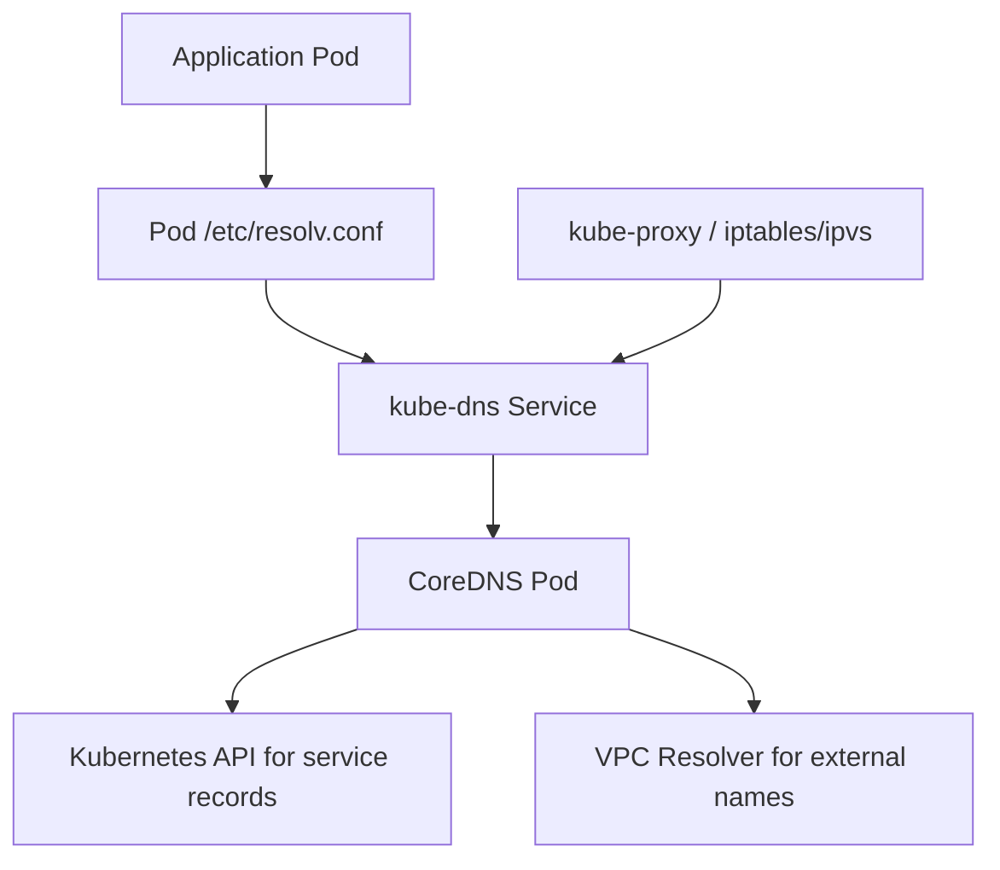

A DNS timeout is not the same as NXDOMAIN.

- `NXDOMAIN`: name does not exist or wrong namespace/name.
- timeout: DNS path is slow/broken/saturated.
- intermittent timeout: CoreDNS/node/network pressure, link-local packet pressure, or retry storm.

### Evidence

```bash
kubectl -n kube-system get deploy coredns
kubectl -n kube-system get pods -l k8s-app=kube-dns -o wide
kubectl -n kube-system logs deploy/coredns --tail=300
kubectl -n kube-system top pods -l k8s-app=kube-dns
kubectl get svc -n kube-system kube-dns -o wide
```

From a debug pod:

```bash
kubectl run dns-debug --rm -it --image=busybox:1.36 --restart=Never -- sh
nslookup kubernetes.default.svc.cluster.local
nslookup payment-api.payments.svc.cluster.local
nslookup amazon.com
cat /etc/resolv.conf
```

### Common Causes

| Cause | Signal |
|---|---|
| CoreDNS under-provisioned | high CPU, latency, drops |
| CoreDNS pods not spread | node/AZ localized failure |
| kube-proxy broken | ClusterIP routing broken |
| network policy blocks DNS | pod cannot reach kube-dns service |
| Node local link-local PPS exceeded | DNS/IMDS/time sync packet drops |
| wrong service name/namespace | consistent NXDOMAIN |
| external DNS only fails | VPC resolver/NAT/security/path issue |

### Fix Pattern

- Scale CoreDNS replicas and requests.
- Ensure CoreDNS topology spread.
- Keep CoreDNS add-on updated.
- Validate kube-proxy health.
- Validate NetworkPolicy allows UDP/TCP 53 to kube-dns.
- Cache responsibly in applications.
- Avoid per-request DNS lookup storms in Java HTTP clients.

### Production Guardrail

Set alerts for:

- CoreDNS CPU saturation;
- CoreDNS error rate;
- DNS request latency;
- node link-local allowance exceeded;
- kube-proxy DaemonSet not ready;
- CoreDNS pod disruption.

DNS is a shared dependency. Treat it like a database: capacity-plan it and monitor it.

---

## 11. Runbook: Service Has No Endpoints

### Symptom

```bash
kubectl -n payments get svc payment-api
kubectl -n payments get endpointslice -l kubernetes.io/service-name=payment-api
# no ready addresses
```

### Mental Model

A Kubernetes `Service` does not route to pods by name. It routes to pods selected by labels and readiness.

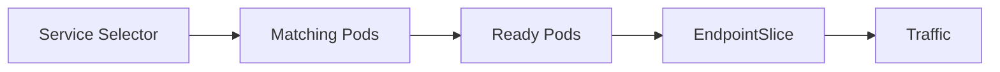

### Evidence

```bash
kubectl -n "$NS" get svc "$SVC" -o yaml
kubectl -n "$NS" get pods --show-labels
kubectl -n "$NS" get endpointslice -l kubernetes.io/service-name="$SVC" -o yaml
kubectl -n "$NS" describe pod -l app=payment-api
```

### Common Causes

| Finding | Cause |
|---|---|
| no pods match selector | label mismatch |
| pods match but not ready | readiness probe failing |
| wrong targetPort | service points to wrong container port |
| named port mismatch | service references missing named port |
| EndpointSlice stale-looking | controller lag or pod readiness changes |
| traffic works directly to pod but not service | kube-proxy/service networking issue |

### Fix Pattern

- Align labels and selectors.
- Make readiness reflect local request-serving capability.
- Validate `port` and `targetPort`.
- Avoid changing service selector during rollout unless deliberately migrating.
- Alert on service endpoint count falling to zero.

---

## 12. Runbook: Ingress / ALB `502`, `503`, `504`

### Symptom

- Client receives `502 Bad Gateway`.
- Client receives `503 Service Unavailable`.
- Client receives `504 Gateway Timeout`.
- ALB target group has no healthy targets.
- AWS Load Balancer Controller logs reconciliation errors.

### Mental Model

Ingress is a chain:

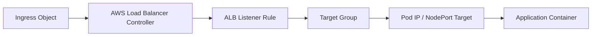

### Evidence

```bash
kubectl -n "$NS" describe ingress "$INGRESS"
kubectl -n kube-system logs deploy/aws-load-balancer-controller --tail=300
kubectl -n "$NS" get svc,endpointslice,pods -o wide
```

AWS-side:

```bash
aws elbv2 describe-target-health --target-group-arn "$TG_ARN"
aws elbv2 describe-rules --listener-arn "$LISTENER_ARN"
aws elbv2 describe-load-balancers --names "$ALB_NAME"
```

### Status Code Interpretation

| Status | Common Meaning |
|---|---|
| 503 | no healthy targets or no target group capacity |
| 502 | target closed connection, protocol mismatch, app crash, bad response |
| 504 | target did not respond before timeout |
| 404 | listener rule/path/host mismatch |
| TLS error | cert/listener/security policy/SNI issue |

### Common EKS Causes

| Cause | Signal |
|---|---|
| wrong ingress class | controller ignores ingress |
| subnet tags missing | controller cannot discover subnets |
| security group blocks traffic | target health timeout |
| readiness endpoint wrong | targets remain unhealthy |
| target type mismatch | `instance` vs `ip` routing mismatch |
| service has no endpoints | target group empty |
| app binds localhost only | pod IP target cannot connect |
| deregistration delay too long/short | deployment traffic loss |
| slow app startup | target health fails during rollout |

### Fix Pattern

- Confirm controller reconciled the Ingress.
- Confirm target group registration.
- Confirm target health reason.
- Confirm pod readiness and service endpoints.
- Confirm security group path ALB → pod/node.
- Confirm health check path and port.
- Align app timeout, ALB idle timeout, and client timeout.

---

## 13. Runbook: PVC Pending / Stateful Workload Failure

### Symptom

```txt
pod has unbound immediate PersistentVolumeClaims
0/5 nodes are available: volume node affinity conflict
```

### Mental Model

Storage scheduling has two coupled decisions:

1. Where can the volume exist?
2. Where can the pod run?

For EBS, volume attachment is AZ-bound. For EFS, access is multi-AZ but performance and mount path matter.

### Evidence

```bash
kubectl -n "$NS" get pvc,pv,storageclass
kubectl -n "$NS" describe pvc "$PVC"
kubectl get storageclass -o yaml
kubectl -n "$NS" describe pod "$POD"
kubectl get events -A --sort-by='.lastTimestamp' | tail -100
```

### Common Causes

| Finding | Cause |
|---|---|
| PVC Pending | storage provisioner not installed or cannot provision |
| volume node affinity conflict | pod scheduled to different AZ than volume |
| mount timeout | node security group/NFS/EFS path issue |
| access denied | CSI driver IAM/Pod Identity issue |
| filesystem permission error | non-root app/user/group mismatch |
| StatefulSet stuck | ordered startup + failed previous pod |

### Fix Pattern

- Use `WaitForFirstConsumer` where topology matters.
- Ensure CSI driver add-on is installed and healthy.
- Ensure workload scheduling constraints align with volume topology.
- Do not use EBS for multi-writer unless access mode supports it.
- Validate backup/restore separately from steady-state mount.

---

## 14. Runbook: Admission Webhook Outage

### Symptom

```txt
Internal error occurred: failed calling webhook
context deadline exceeded
no endpoints available for service "kyverno-svc"
```

### Mental Model

Admission webhooks are in the API server write path.

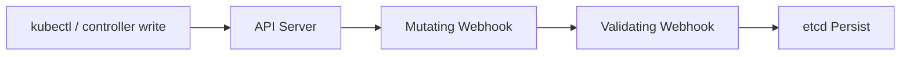

If a webhook is down and configured with `failurePolicy: Fail`, it can block cluster writes.

### Evidence

```bash
kubectl get validatingwebhookconfiguration
kubectl get mutatingwebhookconfiguration
kubectl -n kyverno get pods,svc,endpointslice
kubectl -n kyverno logs deploy/kyverno-admission-controller --tail=300
```

### Risk Classification

| Webhook Type | Outage Impact |
|---|---|
| policy engine | deployments and updates blocked |
| service mesh injector | pods not admitted or admitted without sidecar |
| secrets injector | workloads fail to get config |
| cert-manager | certificate resources affected |
| custom operator webhook | CRD operations blocked |

### Fix Pattern

- Confirm webhook service has endpoints.
- Restore webhook deployment first.
- If production is blocked and policy permits, temporarily change `failurePolicy` from `Fail` to `Ignore` for the affected webhook only.
- Record the exception.
- Revert after the controller is healthy.
- Add PDB, topology spread, resource requests, and monitoring to webhook workloads.

### Guardrail

A webhook is platform critical infrastructure. It needs:

- at least two replicas;
- PDB;
- readiness probe;
- topology spread;
- explicit resource requests;
- safe upgrade strategy;
- alert on no endpoints;
- emergency bypass procedure.

---

## 15. Runbook: Bad Rollout

### Symptom

- New deployment revision starts failing.
- Error rate increases after release.
- Rollout stuck.
- Old pods terminate before new pods become ready.
- GitOps keeps reapplying a broken manifest.

### Evidence

```bash
kubectl -n "$NS" rollout status deploy "$DEPLOY"
kubectl -n "$NS" rollout history deploy "$DEPLOY"
kubectl -n "$NS" describe deploy "$DEPLOY"
kubectl -n "$NS" get rs,pods -l app="$APP" -o wide
kubectl -n "$NS" describe rs -l app="$APP"
```

### Rollback

```bash
kubectl -n "$NS" rollout undo deploy "$DEPLOY"
```

For GitOps-managed systems, do not rely on imperative rollback alone. Revert or patch Git, or the controller may reapply the bad desired state.

### Bad Rollout Causes

| Cause | Signal |
|---|---|
| image tag reused | Git shows same tag but digest changed |
| readiness too weak | rollout completes but app fails real traffic |
| readiness too strong | rollout never completes during dependency outage |
| PDB too strict | old pods cannot drain |
| capacity insufficient | surge pods cannot schedule |
| DB migration incompatible | old/new version conflict |
| config missing | all new pods crash |
| HPA scale-down during rollout | capacity disappears mid-release |

### Safe Rollout Invariants

- Production image references are immutable.
- Readiness represents local serving capability.
- Liveness does not depend on external dependencies.
- Deployment has rollback alarm.
- Migration is backward/forward compatible.
- At least one old healthy replica remains until new replicas are verified.
- Git desired state matches rollback state.

---

## 16. Runbook: Karpenter Provisioning Failure

### Symptom

- Pods remain pending.
- No new nodes appear.
- `NodeClaim` exists but never becomes ready.
- Nodes launch and then terminate quickly.

### Mental Model

Karpenter solves scheduling by creating nodes that satisfy pending pod requirements.

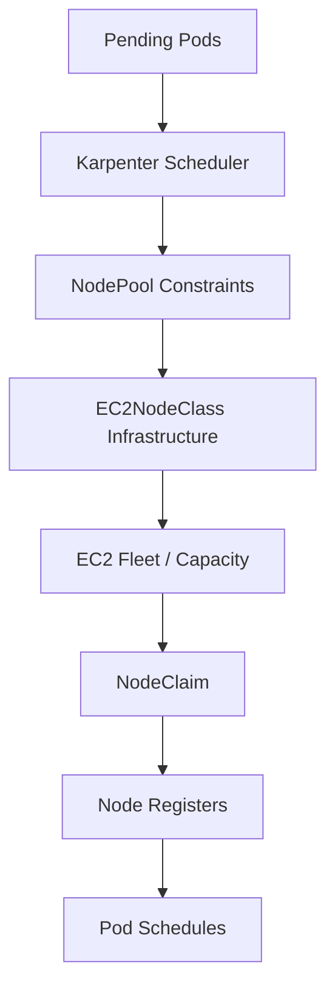

### Evidence

```bash
kubectl get nodepool,nodeclaim -A
kubectl describe nodepool "$NODEPOOL"
kubectl describe nodeclaim "$NODECLAIM"
kubectl -n kube-system logs deploy/karpenter --tail=500
kubectl get events -A --sort-by='.lastTimestamp' | tail -150
```

### Common Causes

| Cause | Signal |
|---|---|
| impossible constraints | pod requires shape no NodePool allows |
| EC2 capacity unavailable | insufficient instance capacity |
| AWS quota | instance/vCPU/IP/ENI quota hit |
| subnet/security group discovery wrong | NodeClaim launch failure |
| IAM permissions | denied EC2 calls |
| AMI/user data issue | instance launches but node never registers |
| PDB/disruption budget | consolidation/drift blocked |
| over-consolidation | workloads churn, latency spikes |

### Fix Pattern

- Start with pod scheduling events.
- Compare pod requirements against NodePool allowed instance families, zones, architecture, capacity type.
- Inspect NodeClaim conditions.
- Validate EC2 quota and subnet IPs.
- Validate IAM and discovery tags.
- Avoid expanding NodePool constraints blindly; encode intended platform policy.

---

## 17. Runbook: API Server Slow or Controller Reconciliation Lag

### Symptom

- `kubectl` requests are slow.
- Controllers lag.
- Deployments take unusually long to reconcile.
- Webhooks time out.
- HPA metrics stale.
- GitOps sync takes too long.

### Common Causes

| Cause | Explanation |
|---|---|
| webhook latency | API writes blocked by slow webhook |
| too many controllers/operators | noisy control plane |
| CRD misuse | huge custom resources or frequent updates |
| API client throttling | controllers exceed rate limits |
| high event churn | crash loops or node churn create event storm |
| kube-state-metrics/cardinality | telemetry overload indirectly hurts operations |
| network path to private endpoint | operator/client path unstable |

### Evidence

```bash
kubectl get apiservice
kubectl get validatingwebhookconfiguration,mutatingwebhookconfiguration
kubectl get events -A --sort-by='.lastTimestamp' | tail -200
kubectl top pods -A | sort -k3 -h | tail
```

Check controller logs for throttling:

```bash
kubectl -n argocd logs deploy/argocd-application-controller --tail=200
kubectl -n kube-system logs deploy/aws-load-balancer-controller --tail=200
kubectl -n kyverno logs deploy/kyverno-admission-controller --tail=200
```

### Fix Pattern

- Restore unhealthy webhooks first.
- Reduce runaway controller changes.
- Fix crash loops creating event storms.
- Apply controller rate limit tuning if supported.
- Split overloaded platform components.
- Review CRD lifecycle and object size.

---

## 18. Incident Triage Board

During an incident, maintain this table.

| Field | Value |
|---|---|
| Incident ID |  |
| Start time |  |
| First user-visible symptom |  |
| Affected namespace/service |  |
| Recent change |  |
| Broken transition |  |
| Evidence captured |  |
| Immediate mitigation |  |
| Permanent fix |  |
| Guardrail to add |  |

The key field is **broken transition**.

Examples:

- “scheduler cannot place pod because request/NodePool constraints impossible.”
- “ALB has zero healthy targets because readiness path returns 500 after config change.”
- “CoreDNS overloaded because request storm caused DNS lookup per request.”
- “Webhook outage blocks writes because policy controller has no endpoints.”
- “Karpenter cannot launch nodes because subnet free IPs are exhausted.”

If the broken transition is not known, you are not ready to make a broad fix.

---

## 19. Observability Signals to Keep Before You Need Them

You cannot build incident visibility during the incident.

Minimum EKS platform signals:

### Cluster Health

- node readiness;
- node conditions;
- pod phase count by namespace;
- pending pod count;
- restart count;
- OOMKilled count;
- scheduling failure count;
- namespace quota usage;
- API server request latency if available;
- webhook latency/error rate.

### Networking

- VPC CNI errors;
- IP allocation failure;
- subnet free IPs;
- CoreDNS latency/error rate;
- CoreDNS CPU/memory;
- kube-proxy readiness;
- load balancer target health count;
- ALB 5xx by target group;
- target response time.

### Deployment

- rollout stuck duration;
- unavailable replicas;
- old/new ReplicaSet health;
- GitOps sync status;
- image digest deployed;
- deployment frequency;
- rollback count.

### Autoscaling

- HPA desired/current replica gap;
- Karpenter NodeClaim failure;
- pending pods by scheduling reason;
- EC2 capacity errors;
- Spot interruptions;
- node churn rate.

### Security/Policy

- admission webhook failures;
- policy violations;
- unauthorized Kubernetes API calls;
- IAM access denied from pod identities;
- secret sync failure.

---

## 20. Top 1% Debugging Heuristics

### Heuristic 1 — Debug Transitions, Not Objects

A pod is not “bad.” Ask which transition failed:

```txt
PodSpec accepted?
Scheduled?
Node provisioned?
Image pulled?
Container created?
Started?
Ready?
Endpoint published?
Target healthy?
Traffic routed?
```

### Heuristic 2 — Prefer Readiness Over Restart

Restarting a container is often a bad response to dependency failure.

If a downstream database is unavailable:

- liveness should stay healthy if the process is alive;
- readiness should fail if the app cannot serve requests;
- retries should have bounded budgets;
- autoscaling should not amplify the outage;
- circuit breakers should prevent request pileup.

### Heuristic 3 — Every Runbook Must End in a Guardrail

A fix without a guardrail is only a reset.

Examples:

| Incident | Guardrail |
|---|---|
| image tag missing | CI validates image digest before Git promotion |
| CoreDNS CPU saturated | CoreDNS HPA/requests/dashboard/alarm |
| webhook outage | PDB/topology spread/failure policy review |
| pods pending due to impossible constraints | admission policy validates NodePool-compatible workload |
| ALB 503 after deploy | pre-traffic smoke test and target health alarm |
| OOMKilled Java pod | JVM memory standard and memory-limit lint |
| subnet IP exhaustion | IP budget dashboard and NodePool subnet policy |

### Heuristic 4 — Kubernetes Hides AWS Failure Behind Kubernetes Symptoms

A pod `Pending` can be:

- EC2 capacity shortage;
- subnet IP exhaustion;
- IAM denied to Karpenter;
- PVC topology conflict;
- quota;
- taint mismatch.

A service `503` can be:

- ALB target health;
- pod readiness;
- security group;
- wrong target type;
- app bind address;
- deployment rollout.

Never stop at the first Kubernetes status word.

### Heuristic 5 — The Platform Team Owns Failure Vocabulary

For a mature platform, every team should use the same terms:

- pending due to resource shortage;
- pending due to constraint impossibility;
- crash loop due to app exit;
- crash loop due to probe kill;
- image pull failure due to registry auth;
- image pull failure due to network path;
- endpoint zero due to readiness;
- target unhealthy due to health path;
- DNS timeout due to CoreDNS saturation;
- webhook fail-closed outage;
- autoscaler unable to provision.

Shared vocabulary reduces mean time to diagnose.

---

## 21. Practical Debug Scripts

### Workload Snapshot

```bash
#!/usr/bin/env bash
set -euo pipefail

NS="${1:?namespace required}"
APP="${2:?app label required}"

OUT="snapshot-${NS}-${APP}-$(date +%Y%m%d%H%M%S)"
mkdir -p "$OUT"

kubectl -n "$NS" get deploy,rs,pod,svc,endpointslice,hpa,pdb -l app="$APP" -o wide > "$OUT/objects.txt" || true
kubectl -n "$NS" describe deploy -l app="$APP" > "$OUT/deploy.describe.txt" || true
kubectl -n "$NS" describe pod -l app="$APP" > "$OUT/pods.describe.txt" || true
kubectl -n "$NS" logs -l app="$APP" --tail=300 --all-containers > "$OUT/logs.txt" || true
kubectl -n "$NS" logs -l app="$APP" --previous --tail=300 --all-containers > "$OUT/logs.previous.txt" || true
kubectl get events -A --sort-by='.lastTimestamp' | tail -300 > "$OUT/events.txt" || true

echo "wrote $OUT"
```

### Endpoint Sanity

```bash
NS=payments
SVC=payment-api

kubectl -n "$NS" get svc "$SVC" -o wide
kubectl -n "$NS" get endpointslice -l kubernetes.io/service-name="$SVC" -o wide
kubectl -n "$NS" get pods --show-labels
```

### DNS Sanity

```bash
kubectl run dns-debug --rm -it --image=busybox:1.36 --restart=Never -- sh -c '
  nslookup kubernetes.default.svc.cluster.local;
  nslookup kube-dns.kube-system.svc.cluster.local;
  nslookup amazon.com;
  cat /etc/resolv.conf
'
```

### Node Pressure Sanity

```bash
kubectl get nodes
kubectl describe nodes | egrep -i "Name:|Ready|MemoryPressure|DiskPressure|PIDPressure|NetworkUnavailable|Allocatable|Allocated resources"
kubectl top nodes
kubectl top pods -A --sort-by=memory | tail -20
```

---

## 22. Production Runbook Design Standard

Every EKS runbook in your organization should have this shape:

```txt
1. Symptom
2. User impact
3. Scope detection
4. First evidence to capture
5. Causal model
6. Decision tree
7. Safe mitigation
8. Permanent fix
9. Guardrail
10. Verification
11. Links to dashboards/log queries
```

A weak runbook says:

> “Restart the pod.”

A strong runbook says:

> “If previous logs show `OutOfMemoryError` and pod `lastState` is `OOMKilled`, capture heap/container metrics, roll back if release-correlated, otherwise apply emergency memory limit increase with JVM `MaxRAMPercentage` correction, then create follow-up for memory profiling and add an OOM alert.”

That difference is the difference between operations and engineering.

---

## 23. Final Mental Model

EKS incidents are not solved by memorizing commands.

They are solved by understanding this chain:

```txt
Intent → Admission → Scheduling → Provisioning → Node Runtime
→ Image Pull → Container Start → Readiness → Service Endpoint
→ Load Balancer Target → Client Traffic → Telemetry
```

When a production system fails, ask:

1. Which transition stopped?
2. Which controller owns that transition?
3. What evidence proves it?
4. What is the smallest safe mitigation?
5. What guardrail prevents recurrence?

That is the operational posture of a serious EKS platform engineer.

---

## References

- Amazon EKS troubleshooting clusters and nodes
- Amazon EKS best practices for VPC CNI, networking, CoreDNS, Karpenter, and cluster services
- Kubernetes documentation for debugging pods, DNS resolution, pod lifecycle, probes, storage, and disruption behavior
- AWS documentation for Elastic Load Balancing target health, EKS add-ons, and AWS Load Balancer Controller
