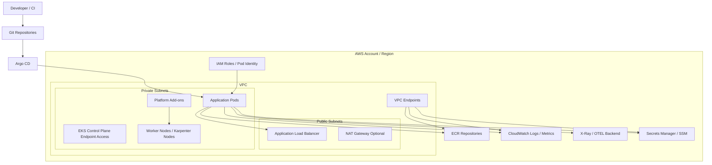
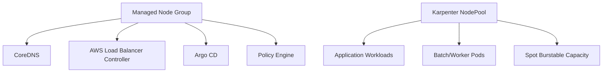
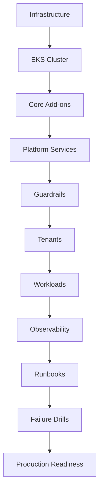

# Part 048 — EKS Lab: Platform Cluster

This lab builds a production-style EKS platform baseline.

Not a toy cluster.

Not a console-click demo.

The target is a cluster that can host real services with:

- private worker nodes;
- managed Kubernetes control plane;
- explicit access model;
- workload identity;
- add-on ownership;
- autoscaling node provisioning;
- ALB ingress;
- GitOps delivery;
- policy guardrails;
- observability baseline;
- namespace tenancy;
- failure drills;
- production readiness checks.

The outcome is not “a cluster exists.”

The outcome is:

> A platform team can onboard an application team, let them deploy safely, observe their workload, scale with guardrails, and debug failures without guessing.

---

## 1. Target Architecture



This lab intentionally separates:

| Layer | Owned By | Examples |
|---|---|---|
| cloud foundation | platform/infrastructure | VPC, subnets, route tables, endpoints |
| cluster foundation | platform | EKS cluster, access entries, node pools |
| cluster add-ons | platform | VPC CNI, CoreDNS, kube-proxy, load balancer controller |
| platform services | platform | Argo CD, policy engine, observability collectors |
| tenant boundary | platform + app teams | namespaces, quotas, network policy, RBAC |
| application workload | app teams | Deployment, Service, Ingress, HPA, config |
| release workflow | app teams + platform | CI image build, GitOps promotion, rollback |
| runtime operations | shared | dashboards, alerts, runbooks |

A healthy platform makes ownership explicit.

---

## 2. What We Will Build

Minimum cluster baseline:

```txt
EKS cluster
├── access model
│   ├── platform-admin access entry
│   ├── readonly/support access entry
│   └── ci-deployer access entry
├── networking
│   ├── VPC CNI
│   ├── CoreDNS
│   ├── kube-proxy
│   ├── private node subnets
│   └── optional VPC endpoints
├── compute
│   ├── small managed node group for critical add-ons
│   └── Karpenter-managed workload nodes
├── ingress
│   └── AWS Load Balancer Controller
├── identity
│   ├── IRSA or EKS Pod Identity
│   └── least-privilege service accounts
├── GitOps
│   └── Argo CD platform + application bootstrap
├── policy
│   ├── Pod Security Standards
│   ├── Kyverno or Gatekeeper
│   └── tenant resource guardrails
├── observability
│   ├── metrics
│   ├── logs
│   ├── traces
│   ├── Kubernetes events
│   └── dashboards/alarms
└── sample workload
    ├── Java API
    ├── Service
    ├── Ingress
    ├── HPA
    ├── PDB
    └── failure drills
```

---

## 3. Non-Goals

This lab will not deep-dive into:

- VPC design from zero;
- IAM fundamentals;
- TLS PKI from zero;
- Prometheus internals;
- GitOps tool comparison;
- Java application architecture;
- database design;
- multi-region disaster recovery.

Those are important, but they are not the point of this part.

The point is the **EKS platform baseline**.

---

## 4. Prerequisites

You should already have:

- an AWS account with permission to create EKS, IAM, EC2, ELB, ECR, CloudWatch resources;
- AWS CLI configured;
- `kubectl`;
- `helm`;
- Terraform, CDK, Pulumi, or eksctl;
- Docker or compatible image builder;
- a Git repository for platform manifests;
- a Git repository for application manifests;
- a container registry such as ECR.

Recommended tools:

```bash
aws --version
kubectl version --client
helm version
terraform version
jq --version
```

---

## 5. Repository Layout

A clean platform separates infrastructure, platform manifests, and application manifests.

```txt
platform-infra/
├── environments/
│   ├── dev/
│   ├── staging/
│   └── prod/
├── modules/
│   ├── vpc/
│   ├── eks-cluster/
│   ├── eks-addons/
│   ├── karpenter/
│   └── iam/
└── README.md

platform-gitops/
├── clusters/
│   ├── dev/
│   │   ├── bootstrap.yaml
│   │   ├── addons/
│   │   ├── policies/
│   │   ├── observability/
│   │   └── tenants/
│   └── prod/
├── platform-apps/
│   ├── aws-load-balancer-controller/
│   ├── external-secrets/
│   ├── kyverno/
│   ├── adot/
│   └── metrics-server/
└── README.md

app-payment/
├── src/
├── Dockerfile
├── charts/
│   └── payment-api/
├── environments/
│   ├── dev-values.yaml
│   └── prod-values.yaml
└── README.md
```

Why split this way?

- Infrastructure changes have different blast radius from app changes.
- Platform add-ons require stronger review than tenant workloads.
- App teams should not edit cluster-critical manifests.
- Git history becomes an audit trail.

---

## 6. Cluster Foundation Decisions

Before writing code, define the cluster contract.

### 6.1 Endpoint Access

| Option | Use When | Trade-Off |
|---|---|---|
| public endpoint with restricted CIDR | simple admin access, controlled IP ranges | easier but exposed to internet path |
| private endpoint | regulated/internal clusters | requires VPN/bastion/SSM/network path |
| public + private | transitional or mixed operations | more access surface |

Production default:

```txt
private endpoint preferred
public endpoint only if CIDR-restricted and justified
```

### 6.2 Node Subnet Placement

Use private subnets for nodes.

Public subnets typically host internet-facing ALB/NLB and NAT gateway. Worker nodes do not need public IPs in most production systems.

### 6.3 Add-on Ownership

Critical add-ons must be explicitly versioned and monitored:

- Amazon VPC CNI;
- CoreDNS;
- kube-proxy;
- Amazon EBS CSI Driver if using EBS;
- AWS Load Balancer Controller;
- Karpenter if used;
- metrics-server;
- ADOT/OpenTelemetry collector;
- policy engine;
- external secret integration.

Do not treat add-ons as invisible cluster plumbing. They are production dependencies.

---

## 7. Infrastructure Skeleton

This lab is tool-agnostic. The shape matters more than the IaC syntax.

A module boundary should look like this:

```txt
module.vpc
  outputs: vpc_id, private_subnet_ids, public_subnet_ids, cluster_security_group_rules

module.eks_cluster
  inputs: vpc_id, subnet_ids, endpoint_access, version
  outputs: cluster_name, cluster_endpoint, oidc_provider, cluster_security_group_id

module.eks_access
  inputs: platform_admin_roles, ci_roles, readonly_roles

module.eks_addons
  inputs: cluster_name, addon_versions

module.karpenter
  inputs: cluster_name, private_subnet_ids, node_security_group_ids

module.platform_irsa_or_pod_identity
  inputs: service_account_bindings
```

The platform should expose stable outputs, not leak every internal detail.

---

## 8. Create the Cluster

Example conceptual cluster configuration:

```yaml
cluster:
  name: platform-dev
  region: ap-southeast-1
  kubernetesVersion: "1.33"
  endpointAccess:
    public: false
    private: true
  logging:
    api: true
    audit: true
    authenticator: true
    controllerManager: true
    scheduler: true
  encryption:
    secrets: true
```

Production notes:

- Enable control plane logs where compliance and debugging require them.
- Know the cost impact of verbose logs.
- Encrypt Kubernetes secrets at rest if required by policy.
- Keep Kubernetes version lifecycle visible in roadmap.
- Create dev/staging/prod clusters with the same architecture unless there is a deliberate exception.

---

## 9. Access Entries and RBAC

Create personas first.

| Persona | AWS Principal | Kubernetes Access |
|---|---|---|
| platform admin | SSO role | cluster-admin, break-glass controlled |
| platform operator | SSO role | admin on platform namespaces |
| app team deployer | CI role | write only to app namespace |
| app developer | SSO role | read namespace, logs, exec if allowed |
| auditor | SSO role | read-only cluster/namespace evidence |

Access entry gives an IAM principal cluster access. Kubernetes RBAC should then limit what that principal can do.

Example tenant role binding:

```yaml
apiVersion: rbac.authorization.k8s.io/v1
kind: Role
metadata:
  namespace: payments
  name: payments-deployer
rules:
  - apiGroups: ["", "apps", "batch", "autoscaling", "policy", "networking.k8s.io"]
    resources:
      - configmaps
      - services
      - deployments
      - replicasets
      - jobs
      - cronjobs
      - horizontalpodautoscalers
      - poddisruptionbudgets
      - ingresses
    verbs: ["get", "list", "watch", "create", "update", "patch"]
```

Avoid giving app CI cluster-wide write unless the team owns the cluster.

---

## 10. Bootstrap Critical Add-ons

### 10.1 VPC CNI, CoreDNS, kube-proxy

Treat these as tier-zero dependencies.

```bash
kubectl -n kube-system get ds aws-node
kubectl -n kube-system get deploy coredns
kubectl -n kube-system get ds kube-proxy
```

Baseline checks:

```bash
kubectl -n kube-system rollout status ds/aws-node
kubectl -n kube-system rollout status deploy/coredns
kubectl -n kube-system rollout status ds/kube-proxy
```

Guardrails:

- resource requests set;
- replicas for CoreDNS >= 2;
- CoreDNS spread across nodes/AZs;
- add-on versions tracked;
- dashboard and alerts exist;
- changes applied via GitOps/IaC.

### 10.2 Metrics Server

Install `metrics-server` for HPA CPU/memory signals.

```bash
kubectl top nodes
kubectl top pods -A
```

If this fails, HPA based on resource metrics will not behave correctly.

### 10.3 AWS Load Balancer Controller

Install with least-privilege identity.

Conceptual service account:

```yaml
apiVersion: v1
kind: ServiceAccount
metadata:
  name: aws-load-balancer-controller
  namespace: kube-system
  annotations:
    eks.amazonaws.com/role-arn: arn:aws:iam::<account-id>:role/platform-dev-aws-load-balancer-controller
```

Then install via Helm:

```bash
helm upgrade --install aws-load-balancer-controller eks/aws-load-balancer-controller \
  --namespace kube-system \
  --set clusterName=platform-dev \
  --set serviceAccount.create=false \
  --set serviceAccount.name=aws-load-balancer-controller
```

Baseline checks:

```bash
kubectl -n kube-system rollout status deploy/aws-load-balancer-controller
kubectl -n kube-system logs deploy/aws-load-balancer-controller --tail=100
```

---

## 11. Workload Identity

Every platform add-on that calls AWS APIs needs explicit identity.

Examples:

| Component | AWS Permissions |
|---|---|
| AWS Load Balancer Controller | ELB, EC2 security group/subnet, tagging |
| External Secrets Operator | Secrets Manager/SSM read |
| EBS CSI Driver | EBS volume lifecycle |
| ADOT Collector | CloudWatch/X-Ray/AMP write |
| Karpenter | EC2 provisioning, pricing/SSM lookup, instance profile |
| Application pod | only its own AWS dependencies |

Use IRSA or EKS Pod Identity. The invariant is the same:

```txt
Kubernetes service account -> explicit AWS role -> least privilege policy
```

Do not let application pods inherit node role permissions.

---

## 12. Karpenter Baseline

A mature EKS cluster often keeps a small managed node group for platform-critical add-ons and uses Karpenter for workload capacity.



### Example NodePool

```yaml
apiVersion: karpenter.sh/v1
kind: NodePool
metadata:
  name: general
spec:
  template:
    metadata:
      labels:
        workload-class: general
    spec:
      requirements:
        - key: kubernetes.io/arch
          operator: In
          values: ["amd64", "arm64"]
        - key: kubernetes.io/os
          operator: In
          values: ["linux"]
        - key: karpenter.sh/capacity-type
          operator: In
          values: ["on-demand", "spot"]
        - key: node.kubernetes.io/instance-type
          operator: In
          values:
            - m7g.large
            - m7g.xlarge
            - m7i.large
            - m7i.xlarge
            - c7g.large
            - c7g.xlarge
    disruption:
      consolidationPolicy: WhenEmptyOrUnderutilized
      consolidateAfter: 5m
  limits:
    cpu: "1000"
    memory: 2000Gi
```

### Example EC2NodeClass

```yaml
apiVersion: karpenter.k8s.aws/v1
kind: EC2NodeClass
metadata:
  name: general
spec:
  amiFamily: AL2023
  role: platform-dev-karpenter-node
  subnetSelectorTerms:
    - tags:
        karpenter.sh/discovery: platform-dev
  securityGroupSelectorTerms:
    - tags:
        karpenter.sh/discovery: platform-dev
  tags:
    Environment: dev
    Platform: eks
```

### Design Rules

- Do not put critical platform add-ons only on volatile Spot capacity.
- Keep NodePool constraints broad enough to actually provision.
- Use PDBs so consolidation does not violate availability.
- Monitor node churn and pending pod reasons.
- Define separate NodePools only when workload constraints are truly different.

---

## 13. Namespace and Tenant Baseline

Create a namespace per application or bounded domain.

```yaml
apiVersion: v1
kind: Namespace
metadata:
  name: payments
  labels:
    pod-security.kubernetes.io/enforce: restricted
    pod-security.kubernetes.io/audit: restricted
    tenant: payments
```

Add quota:

```yaml
apiVersion: v1
kind: ResourceQuota
metadata:
  name: payments-quota
  namespace: payments
spec:
  hard:
    requests.cpu: "20"
    requests.memory: 80Gi
    limits.cpu: "40"
    limits.memory: 160Gi
    pods: "100"
```

Add default limits carefully:

```yaml
apiVersion: v1
kind: LimitRange
metadata:
  name: payments-defaults
  namespace: payments
spec:
  limits:
    - type: Container
      defaultRequest:
        cpu: 100m
        memory: 256Mi
      default:
        cpu: 500m
        memory: 512Mi
```

LimitRange defaults prevent missing requests, but bad defaults can hide sizing problems. Treat defaults as guardrails, not capacity planning.

---

## 14. Policy Baseline

Use policy to reject workloads that are unsafe by default.

Examples of policies worth enforcing:

- no privileged containers;
- no hostPath unless explicitly allowed;
- no root user unless exception approved;
- image must come from approved registries;
- resource requests required;
- liveness/readiness probes required for services;
- production workloads require PDB;
- ingress must specify approved class;
- external load balancer requires explicit annotation review;
- service account token automount disabled unless needed;
- no wildcard AWS role binding for application service accounts.

Example Kyverno-style intent:

```yaml
apiVersion: kyverno.io/v1
kind: ClusterPolicy
metadata:
  name: require-resource-requests
spec:
  validationFailureAction: Enforce
  rules:
    - name: require-requests
      match:
        any:
          - resources:
              kinds:
                - Pod
      validate:
        message: "CPU and memory requests are required."
        pattern:
          spec:
            containers:
              - resources:
                  requests:
                    cpu: "?*"
                    memory: "?*"
```

Policy should have an exception process. No exception process means engineers bypass the platform.

---

## 15. GitOps Bootstrap

Install Argo CD or Flux as the reconciliation layer.

Example app-of-apps model:

```yaml
apiVersion: argoproj.io/v1alpha1
kind: Application
metadata:
  name: platform-dev-root
  namespace: argocd
spec:
  project: default
  source:
    repoURL: https://github.com/example/platform-gitops.git
    targetRevision: main
    path: clusters/dev
  destination:
    server: https://kubernetes.default.svc
    namespace: argocd
  syncPolicy:
    automated:
      prune: true
      selfHeal: true
```

### GitOps Rules

- Cluster-critical components require platform approval.
- Tenant workloads live under tenant paths.
- Production sync is gated by review.
- Auto-prune is powerful; use it deliberately.
- Secrets are not committed in plaintext.
- Every release changes image digest or chart version explicitly.
- Rollback means reverting desired state in Git, not only running `kubectl`.

---

## 16. Sample Java API Workload

A production-ish workload should include:

- immutable image;
- explicit resource requests/limits;
- readiness/liveness/startup probes;
- PDB;
- HPA;
- Service;
- Ingress;
- service account;
- structured logging;
- graceful shutdown.

### Deployment

```yaml
apiVersion: apps/v1
kind: Deployment
metadata:
  name: payment-api
  namespace: payments
  labels:
    app: payment-api
spec:
  replicas: 3
  revisionHistoryLimit: 5
  strategy:
    type: RollingUpdate
    rollingUpdate:
      maxUnavailable: 0
      maxSurge: 1
  selector:
    matchLabels:
      app: payment-api
  template:
    metadata:
      labels:
        app: payment-api
    spec:
      serviceAccountName: payment-api
      terminationGracePeriodSeconds: 45
      containers:
        - name: app
          image: <account-id>.dkr.ecr.ap-southeast-1.amazonaws.com/payment-api@sha256:<digest>
          ports:
            - name: http
              containerPort: 8080
          env:
            - name: JAVA_TOOL_OPTIONS
              value: "-XX:MaxRAMPercentage=70 -XX:+ExitOnOutOfMemoryError"
          resources:
            requests:
              cpu: 250m
              memory: 512Mi
            limits:
              cpu: "1"
              memory: 1Gi
          startupProbe:
            httpGet:
              path: /actuator/health/liveness
              port: http
            failureThreshold: 30
            periodSeconds: 2
          readinessProbe:
            httpGet:
              path: /actuator/health/readiness
              port: http
            periodSeconds: 5
            failureThreshold: 2
          livenessProbe:
            httpGet:
              path: /actuator/health/liveness
              port: http
            periodSeconds: 10
            failureThreshold: 3
```

### Service

```yaml
apiVersion: v1
kind: Service
metadata:
  name: payment-api
  namespace: payments
spec:
  selector:
    app: payment-api
  ports:
    - name: http
      port: 80
      targetPort: http
```

### PDB

```yaml
apiVersion: policy/v1
kind: PodDisruptionBudget
metadata:
  name: payment-api
  namespace: payments
spec:
  minAvailable: 2
  selector:
    matchLabels:
      app: payment-api
```

### HPA

```yaml
apiVersion: autoscaling/v2
kind: HorizontalPodAutoscaler
metadata:
  name: payment-api
  namespace: payments
spec:
  scaleTargetRef:
    apiVersion: apps/v1
    kind: Deployment
    name: payment-api
  minReplicas: 3
  maxReplicas: 20
  metrics:
    - type: Resource
      resource:
        name: cpu
        target:
          type: Utilization
          averageUtilization: 65
```

### Ingress

```yaml
apiVersion: networking.k8s.io/v1
kind: Ingress
metadata:
  name: payment-api
  namespace: payments
  annotations:
    alb.ingress.kubernetes.io/scheme: internet-facing
    alb.ingress.kubernetes.io/target-type: ip
    alb.ingress.kubernetes.io/healthcheck-path: /actuator/health/readiness
spec:
  ingressClassName: alb
  rules:
    - host: payments.dev.example.com
      http:
        paths:
          - path: /
            pathType: Prefix
            backend:
              service:
                name: payment-api
                port:
                  number: 80
```

---

## 17. Observability Baseline

A platform cluster must answer these questions fast:

| Question | Required Signal |
|---|---|
| Are nodes healthy? | node conditions, CPU, memory, disk, network |
| Are pods restarting? | restart count, last termination reason |
| Are workloads ready? | ready replicas, endpoint count |
| Is DNS healthy? | CoreDNS latency/error/CPU |
| Is ingress healthy? | ALB target health, 5xx, latency |
| Is autoscaling working? | HPA desired/current, pending pods, NodeClaims |
| Are policies blocking deploys? | admission webhook errors, policy violation events |
| Are app teams over budget? | namespace resource usage, telemetry cost |
| Can we trace a request? | trace ID across ingress, service, downstream |
| Did GitOps apply the desired state? | sync status, revision, drift |

### Minimum Dashboard Groups

```txt
Cluster Overview
├── node readiness
├── namespace pod status
├── restart/OOM trends
├── pending pods
└── top resource users

Networking
├── CoreDNS health
├── VPC CNI/IP allocation
├── ALB target health
├── ingress latency/5xx
└── endpoint counts

Deployment
├── GitOps sync status
├── rollout availability
├── ReplicaSet changes
└── image digest by workload

Autoscaling
├── HPA desired/current
├── pending scheduling reasons
├── Karpenter NodeClaims
└── node churn

Tenant
├── quota usage
├── policy violations
├── app logs
└── traces
```

---

## 18. Logging Standard

Every application log line should include:

```txt
timestamp
level
service
environment
version
trace_id
request_id
tenant_id if applicable
operation
outcome
duration_ms
error_code if applicable
```

Bad logs:

```txt
failed
```

Good logs:

```json
{
  "level": "ERROR",
  "service": "payment-api",
  "operation": "AuthorizePayment",
  "outcome": "FAILED",
  "error_code": "DOWNSTREAM_TIMEOUT",
  "duration_ms": 950,
  "trace_id": "0af7651916cd43dd8448eb211c80319c",
  "tenant_id": "merchant-123"
}
```

Platform teams do not own application logs, but they should define the minimum standard.

---

## 19. Failure Drills

A lab is incomplete until you break it.

### Drill 1 — Bad Image Tag

Deploy a non-existent image tag.

Expected:

- pod enters `ImagePullBackOff`;
- events clearly show image pull failure;
- rollout does not destroy all healthy capacity;
- dashboard shows unavailable replicas;
- runbook points to image validation;
- CI should later prevent this.

### Drill 2 — Crash Loop

Deploy app with missing required env var.

Expected:

- pod enters `CrashLoopBackOff`;
- previous logs reveal missing config;
- deployment does not complete;
- Git rollback restores service;
- policy may later validate required config reference.

### Drill 3 — Readiness Failure

Make readiness endpoint return `503`.

Expected:

- pods run but are not ready;
- service endpoint count drops;
- ALB target group marks targets unhealthy;
- HPA does not fix readiness;
- runbook points to readiness and target health.

### Drill 4 — CoreDNS Pressure

Generate DNS-heavy traffic from a test namespace.

Expected:

- CoreDNS metrics show load;
- no cluster-wide outage under normal test;
- alerts trigger before full failure;
- application connection pooling reduces DNS load.

### Drill 5 — Karpenter Constraint Failure

Deploy a pod requesting an impossible instance type/architecture.

Expected:

- pod remains pending;
- scheduler/Karpenter events identify incompatible constraints;
- platform runbook points to NodePool requirements.

### Drill 6 — Webhook Outage

Scale policy controller admission deployment to zero in a non-prod cluster.

Expected:

- write requests affected if fail-closed;
- emergency bypass procedure documented;
- PDB/topology spread restored after drill;
- alert triggers on webhook no endpoints.

### Drill 7 — Node Interruption

Terminate one workload node.

Expected:

- pods reschedule;
- PDB respects availability;
- Karpenter or node group replaces capacity;
- workload remains available or degrades within SLO.

---

## 20. Production Readiness Acceptance Criteria

A platform cluster is ready when these pass.

### Access

- [ ] Human access goes through SSO/role.
- [ ] Break-glass access exists and is audited.
- [ ] CI deployer can only mutate intended namespaces.
- [ ] App developers have read/log access without cluster-admin.
- [ ] Access review is documented.

### Compute

- [ ] Critical add-ons are not dependent solely on volatile Spot nodes.
- [ ] Workload node provisioning is tested.
- [ ] Node churn is visible.
- [ ] Pending pod reasons are observable.
- [ ] Instance families and architectures are intentional.

### Networking

- [ ] Nodes run in private subnets.
- [ ] Ingress path is tested.
- [ ] ALB target health is visible.
- [ ] DNS health is visible.
- [ ] VPC CNI/IP capacity is visible.
- [ ] Subnet free IP alarms exist.

### Security

- [ ] Workload identity is per service account.
- [ ] Node role is not used as application identity.
- [ ] Pod Security Standards enforced.
- [ ] Privileged pods require exception.
- [ ] Approved registry policy exists.
- [ ] Secret delivery does not require plaintext Git.

### Delivery

- [ ] GitOps sync works.
- [ ] Rollback path tested.
- [ ] Image digest promotion used.
- [ ] Drift is visible.
- [ ] Platform and tenant repo boundaries are clear.

### Observability

- [ ] Logs, metrics, traces baseline exists.
- [ ] Cluster dashboard exists.
- [ ] Ingress dashboard exists.
- [ ] Workload dashboard template exists.
- [ ] Alert routing is tested.
- [ ] Runbooks link to dashboards.

### Reliability

- [ ] PDBs exist for critical workloads.
- [ ] Readiness/liveness/startup probes are sane.
- [ ] Rollout strategy prevents zero-capacity releases.
- [ ] Failure drills completed.
- [ ] Incident evidence capture procedure exists.

---

## 21. Platform Onboarding Contract

When a new team joins the cluster, give them a contract like this:

```txt
You get:
- namespace
- quota
- service account identity
- approved ingress path
- logging/tracing standard
- deployment template
- dashboard template
- runbook template
- escalation path

You must provide:
- resource requests
- health endpoints
- graceful shutdown
- PDB for production service
- immutable image digest
- owner label
- SLO target
- rollback plan
- secret/config ownership
```

Example namespace labels:

```yaml
metadata:
  labels:
    tenant: payments
    owner: payments-platform
    environment: dev
```

Example required workload labels:

```yaml
metadata:
  labels:
    app: payment-api
    owner: payments-platform
    service-tier: critical
    cost-center: payments
```

Labels are not decoration. They are the join keys for cost, observability, ownership, and incident response.

---

## 22. Operational Runbook Bundle

Your platform repository should include:

```txt
runbooks/
├── cluster-api-access.md
├── pods-pending.md
├── crashloopbackoff.md
├── imagepullbackoff.md
├── node-notready.md
├── coredns-dns-failure.md
├── vpc-cni-ip-exhaustion.md
├── ingress-alb-5xx.md
├── webhook-outage.md
├── karpenter-provisioning-failure.md
├── gitops-rollback.md
└── tenant-onboarding.md
```

Each runbook should link to exact commands, dashboards, log queries, and escalation owners.

---

## 23. Why This Lab Matters

Many EKS projects fail because they treat the cluster as the product.

The cluster is not the product.

The platform contract is the product:

```txt
Can teams ship safely?
Can bad changes be stopped or rolled back?
Can failures be diagnosed quickly?
Can capacity scale without surprise?
Can security be enforced without blocking delivery?
Can incidents produce durable learning?
```

A production EKS platform is not a pile of YAML. It is an operating model encoded in infrastructure, policies, dashboards, runbooks, and release workflows.

---

## 24. Final Implementation Sequence

Use this order:

```txt
1. Create VPC/subnets/endpoints
2. Create EKS cluster
3. Configure access entries/RBAC
4. Install/verify core add-ons
5. Install workload identity mechanism
6. Install AWS Load Balancer Controller
7. Install metrics-server
8. Install Karpenter or chosen autoscaler
9. Install GitOps controller
10. Install policy engine
11. Install observability collectors
12. Create tenant namespace/quota/RBAC
13. Deploy sample workload
14. Expose via ingress
15. Configure dashboards/alerts
16. Run failure drills
17. Document runbooks
18. Approve production readiness
```

Do not reverse this order casually.

For example:

- installing app workloads before identity creates credential shortcuts;
- enabling GitOps before policy can amplify bad manifests;
- adding Karpenter before subnet/IP planning hides capacity risks;
- exposing ingress before target health observability creates blind traffic failures;
- onboarding tenants before quota/RBAC turns the cluster into a shared blast radius.

---

## 25. Final Mental Model

This lab gives you the baseline for a real platform.

The shape is:



A top-tier EKS platform engineer does not ask:

> “Can I deploy a pod?”

They ask:

> “Can this cluster safely host many changing workloads, fail in understandable ways, recover with evidence, and keep security/cost/reliability inside explicit boundaries?”

That is the difference between Kubernetes usage and Kubernetes platform engineering.

---

## References

- Amazon EKS documentation for clusters, add-ons, access entries, workload identity, and managed node groups
- Amazon EKS best practices for VPC CNI, Karpenter, networking, security, reliability, and cluster services
- AWS Load Balancer Controller documentation
- Kubernetes documentation for Deployments, Services, Ingress, HPA, PDB, probes, ResourceQuota, LimitRange, RBAC, and Pod Security Standards
- Argo CD and Flux documentation for GitOps reconciliation models
