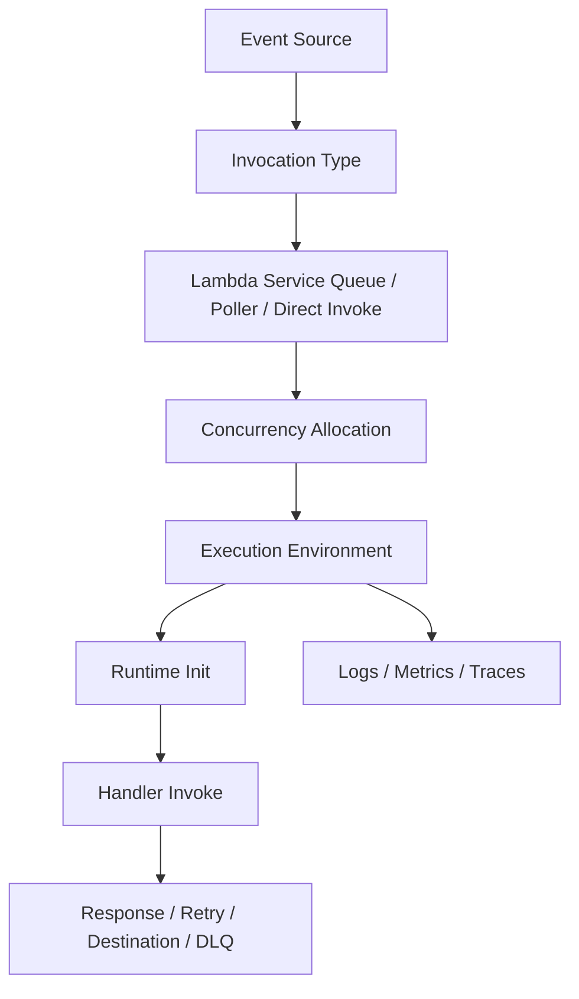
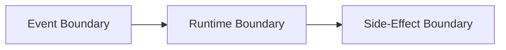
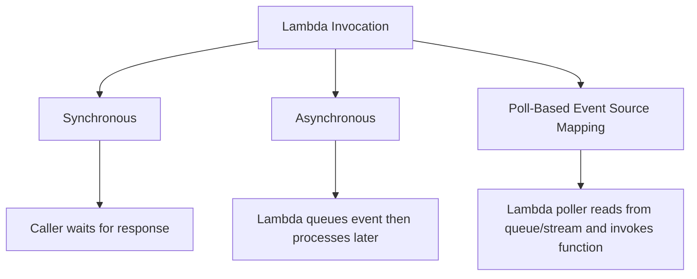
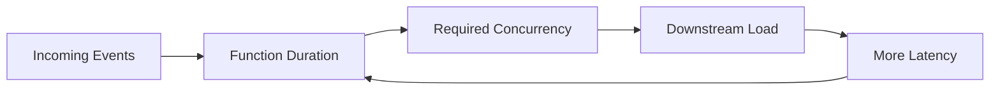
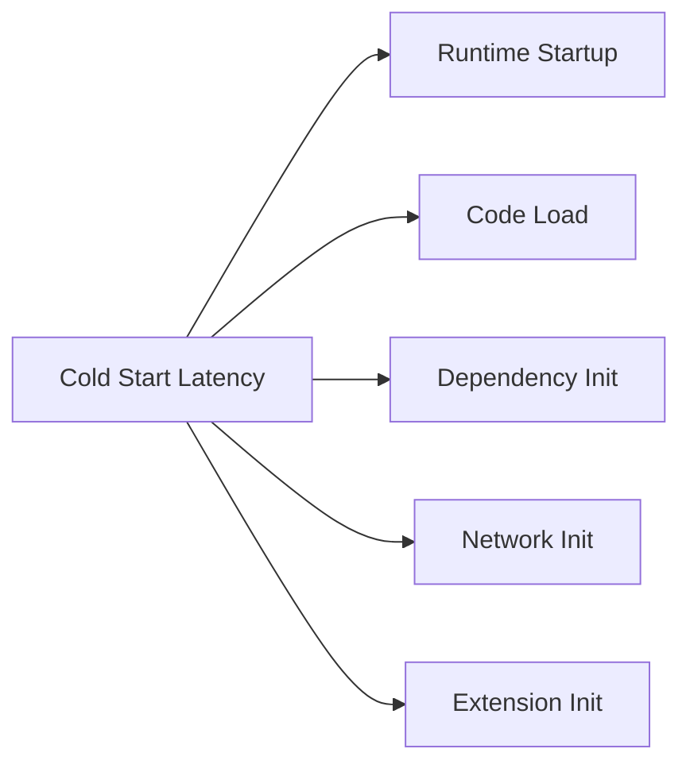
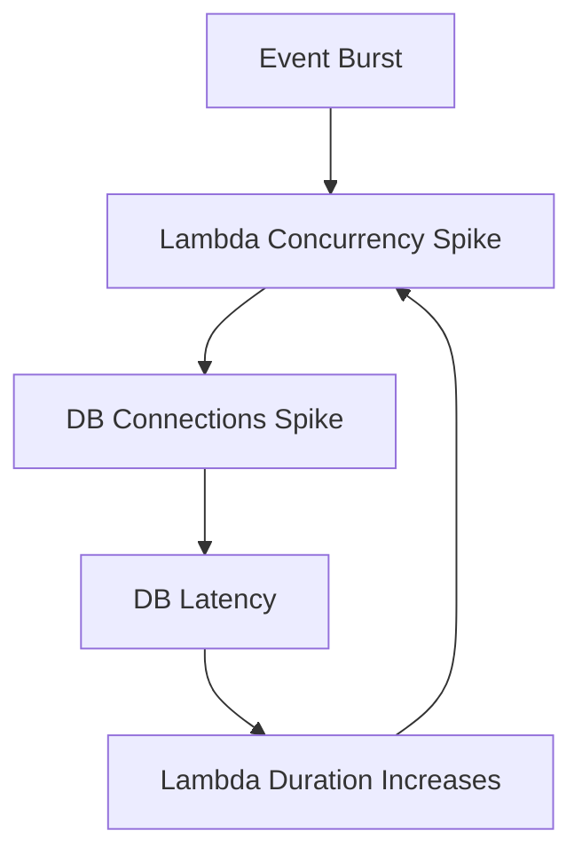
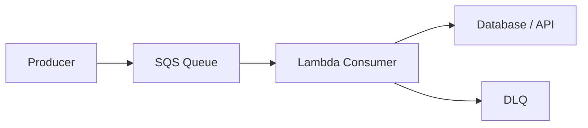
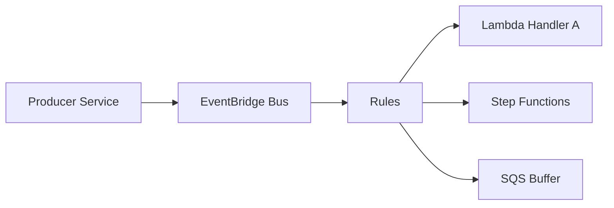

# Part 049 — Lambda Mental Model

Lambda is often introduced badly.

People say:

> “Lambda is serverless functions.”

That is true, but not useful enough for production engineering.

A better definition:

> Lambda is a managed, event-invoked runtime sandbox with automatic horizontal scaling, bounded execution duration, explicit invocation semantics, and strict responsibility boundaries.

That sentence matters.

It tells you what Lambda is good at:

- event-driven execution;
- bursty and irregular workloads;
- small independent units of work;
- glue code between managed services;
- short-lived request handlers;
- stream/queue consumers;
- workflow steps;
- automation tasks;
- low-ops APIs.

It also tells you where Lambda becomes dangerous:

- long-running stateful services;
- workloads requiring stable local process identity;
- workloads needing fine-grained host/runtime control;
- high-throughput systems without backpressure;
- connection-heavy systems without pooling discipline;
- low-latency systems sensitive to cold starts;
- pipelines that ignore duplicate delivery;
- teams that treat retries as correctness.

Lambda removes server management.

It does not remove architecture.

---

## 1. Lambda as a Runtime Contract

A Lambda function has a contract:

```txt
input event + execution environment + configuration
→ handler execution
→ response, side effect, or failure
```

But production Lambda is not only the handler.



A Lambda design must answer:

1. Who invokes the function?
2. Is invocation synchronous, asynchronous, or poll-based?
3. What happens if the function fails?
4. Who retries?
5. How are duplicates handled?
6. What concurrency is allowed?
7. What downstream capacity is protected?
8. What state may be cached?
9. What timeout budget is valid?
10. What operational evidence proves success/failure?

If those answers are missing, the function is not production-ready.

---

## 2. The Three Mental Boundaries

Lambda has three important boundaries.



### 2.1 Event Boundary

The event boundary defines:

- event schema;
- caller identity;
- retry semantics;
- delivery guarantee;
- ordering if any;
- batch size;
- duplicate possibility;
- maximum event age;
- failure destination or DLQ.

Example:

```txt
API Gateway -> Lambda
SQS -> Lambda
EventBridge -> Lambda
DynamoDB Stream -> Lambda
Step Functions -> Lambda
```

Each source changes the failure model.

### 2.2 Runtime Boundary

The runtime boundary defines:

- memory;
- CPU share;
- timeout;
- ephemeral storage;
- environment variables;
- layers or image;
- runtime language;
- VPC attachment;
- extensions;
- concurrency;
- execution role.

The handler code runs inside this boundary.

### 2.3 Side-Effect Boundary

The side-effect boundary defines what changes when the function succeeds:

- writes to a database;
- publishes an event;
- sends email;
- calls downstream service;
- updates S3 object;
- starts another workflow;
- emits audit trail;
- enqueues another message.

This is where correctness lives.

A Lambda function that writes side effects must be idempotent unless the source/caller guarantees exactly-once execution. In distributed systems, that guarantee is rare enough that you should design as if duplicates will happen.

---

## 3. Lambda Is Not a Thread

A common mistake is treating Lambda like a method call running on a stable application server.

It is not.

A Lambda invocation is closer to:

```txt
"Here is an event. You have bounded time and bounded resources.
You may be retried. You may run concurrently many times.
Your previous process state may or may not exist.
Finish safely."
```

The execution environment may be reused, but reuse is an optimization, not a contract.

### What You Can Assume

- Your handler receives an event.
- Your function has configured memory and timeout.
- Your execution role determines AWS permissions.
- Logs go to the configured log destination.
- The function may be invoked concurrently.
- Failed invocations follow source-specific failure semantics.

### What You Cannot Assume

- The same environment will handle the next event.
- Global state is always fresh.
- Background work continues after response.
- Local files persist forever.
- Only one invocation happens at a time globally.
- Retries will preserve exact timing.
- Downstream services can absorb Lambda burst scale.
- A function failure means the caller sees the failure.

A top-tier Lambda engineer designs for uncertainty.

---

## 4. Invocation Modes

Lambda has three broad invocation models.



## 4.1 Synchronous Invocation

Examples:

- API Gateway;
- ALB Lambda target;
- direct `Invoke` with request-response;
- Step Functions task state waiting for response.

The caller waits.

```txt
caller -> Lambda -> handler -> response -> caller
```

Failure semantics are direct:

- handler throws -> caller receives error;
- timeout -> caller receives timeout/error;
- caller retry policy controls duplicate attempts;
- Lambda does not automatically retry synchronous invocation on behalf of the caller.

Use synchronous invocation when:

- the caller needs immediate result;
- latency budget is bounded;
- response size is reasonable;
- side effects are protected against caller retries.

Avoid it when:

- processing may take long;
- downstream system is unreliable;
- caller timeout is shorter than work duration;
- retry semantics need durable buffering.

### Synchronous API Rule

If the user can wait, maybe synchronous is fine.

If the system must survive downstream slowness, prefer asynchronous boundary.

---

## 4.2 Asynchronous Invocation

Examples:

- EventBridge rule target;
- S3 event notification;
- SNS;
- Lambda async invoke API.

Lambda accepts the event, queues it internally, and returns success to the event producer before the handler finishes.

```txt
producer -> Lambda async queue -> handler -> destination/DLQ/log
```

Important implications:

- producer success does not mean handler success;
- Lambda retry behavior is managed by Lambda async invocation settings;
- failed events may go to destination or DLQ if configured;
- maximum event age matters;
- duplicates remain possible.

Use asynchronous invocation when:

- the producer should not wait;
- eventual processing is acceptable;
- failure can be handled by destination/DLQ;
- events can be replayed or reconciled.

Avoid it when:

- the producer requires immediate business result;
- failure must block the caller;
- event loss visibility is weak;
- duplicates cannot be safely handled.

---

## 4.3 Poll-Based Event Source Mapping

Examples:

- SQS;
- Kinesis;
- DynamoDB Streams;
- Amazon MSK/Kafka.

Lambda pollers read from the source and invoke your function with batches.

```txt
queue/stream -> Lambda poller -> batch invoke -> checkpoint/delete/retry
```

The source controls a large part of failure behavior:

| Source | Failure Concern |
|---|---|
| SQS Standard | duplicates, visibility timeout, DLQ, partial batch failure |
| SQS FIFO | message group ordering, throughput, poison message blocking group |
| Kinesis | shard concurrency, iterator age, batch retry blocking progress |
| DynamoDB Streams | ordered stream processing, poison record, replay age |
| Kafka/MSK | offset/checkpoint semantics, partition concurrency |

Use event source mapping when:

- source is a durable queue/stream;
- backpressure is needed;
- batch processing is efficient;
- replay is required;
- you need pull-based integration.

Avoid it when:

- per-record latency must be extremely low;
- batches cannot be made idempotent;
- poison records are not handled;
- downstream cannot handle burst concurrency.

---

## 5. Concurrency Is the Real Scaling Unit

Lambda scales by running more concurrent execution environments.

```txt
concurrency = requests_per_second × average_duration_seconds
```

If a function receives 500 requests per second and each request takes 200 ms:

```txt
500 × 0.2 = 100 concurrent executions
```

If duration increases to 2 seconds during a downstream slowdown:

```txt
500 × 2 = 1000 concurrent executions
```

Same traffic. Ten times the concurrency.

This is why latency is a capacity multiplier.



A slow downstream can create a concurrency spiral.

---

## 6. Reserved Concurrency and Provisioned Concurrency

Two concepts are often confused.

### Reserved Concurrency

Reserved concurrency is a limit and reservation.

It says:

```txt
this function can use at most N concurrent executions,
and N concurrency is reserved for it from the regional account pool.
```

Use it for:

- protecting downstream databases;
- preventing a noisy function from consuming account concurrency;
- ensuring critical function capacity;
- creating a deliberate throttle.

Example:

```txt
order-created-consumer reserved concurrency = 50
```

This means the function cannot exceed 50 concurrent executions, even if the queue has millions of messages.

Reserved concurrency is a bulkhead.

### Provisioned Concurrency

Provisioned concurrency pre-initializes execution environments.

It says:

```txt
keep N execution environments initialized and ready for this function version/alias.
```

Use it for:

- latency-sensitive synchronous APIs;
- Java/.NET cold-start-sensitive workloads;
- predictable traffic windows;
- SnapStart-incompatible or extension-heavy workloads that still need low cold starts.

Provisioned concurrency is latency insurance, not a correctness primitive.

---

## 7. Lambda Timeout as a Business Constraint

Timeout is not only a technical setting.

It defines how long a business operation may hold resources before being abandoned.

Bad timeout design:

```txt
API Gateway timeout: 29 seconds
Lambda timeout: 15 minutes
HTTP client timeout: default/infinite
Database statement timeout: none
```

This creates ghost work. The caller gives up but Lambda continues doing side effects.

Better timeout alignment:

```txt
caller timeout > API integration timeout > Lambda internal work budget > downstream client timeout
```

Example:

```txt
Client timeout: 10s
API Gateway/Lambda response budget: 8s
Lambda timeout: 9s
DB query timeout: 2s
Downstream HTTP timeout: 1s connect, 2s read
```

For async processing:

```txt
SQS visibility timeout > Lambda timeout + retry/cleanup buffer
```

Timeouts are part of correctness.

---

## 8. State in Lambda

Lambda has multiple state zones.

```mermaid
flowchart TD
    A[Invocation Event] --> B[Handler Local Variables]
    C[Global Runtime State] --> B
    D[/tmp Ephemeral Storage] --> B
    E[External Durable State] --> B
```

| State Location | Lifetime | Safe For |
|---|---|---|
| handler local variable | one invocation | request-specific data |
| global/static variable | execution environment lifetime | connection pools, clients, caches with expiry |
| `/tmp` | execution environment lifetime | temporary files, cached model/artifact if validated |
| environment variables | deployment/config lifetime | static configuration |
| external DB/cache/object store | durable | business state |

### Safe Global State

Good:

- AWS SDK client;
- database connection pool with bounded max;
- HTTP client;
- JSON parser/object mapper;
- compiled regex;
- configuration snapshot with version.

Dangerous:

- per-request user data;
- tenant-specific mutable data;
- authorization decisions without expiry;
- unfinished background queue;
- transaction context;
- stale feature flag without refresh;
- “processed event IDs” stored only in memory.

Global state can improve performance. It cannot be your source of truth.

---

## 9. Cold Starts

A cold start happens when Lambda must create and initialize a new execution environment before invoking the handler.

Cold starts are affected by:

- runtime;
- package size;
- dependency graph;
- function memory/CPU;
- VPC networking path;
- extensions;
- container image size;
- initialization code;
- SnapStart/provisioned concurrency;
- burst pattern.

Cold start mitigation is not one trick. It is a design discipline.



### Cold Start Strategy

| Problem | Strategy |
|---|---|
| huge package | trim dependencies, split function |
| Java classloading heavy | SnapStart, provisioned concurrency, framework tuning |
| slow dependency initialization | lazy init non-critical clients |
| VPC latency | verify modern Lambda VPC behavior, reduce startup network calls |
| extension overhead | measure extension init cost |
| burst traffic | provisioned concurrency or buffer with queue |
| first request user latency | warm pool via provisioned concurrency, not ad-hoc ping hacks |

A “warmer Lambda” that periodically invokes a function is usually a weak substitute for correct concurrency and cold-start design.

---

## 10. Lambda Is Not Free Just Because It Is Idle-Free

Lambda cost surface includes:

- request count;
- duration;
- memory size;
- provisioned concurrency;
- ephemeral storage if configured beyond default behavior;
- logs;
- traces;
- data transfer;
- NAT gateway if VPC-attached and using public AWS APIs;
- downstream cost amplified by retries;
- event source cost;
- DLQ/destination cost;
- operational cost of debugging distributed async flows.

A function that is cheap at low traffic may become expensive when:

- duration grows;
- memory is oversized;
- retries multiply;
- logs are too verbose;
- payloads are large;
- provisioned concurrency is always on;
- async failure creates retry storms.

Cost engineering is covered later, but the mental model starts here:

```txt
cost = invocations × duration × configured resources + surrounding service amplification
```

---

## 11. Lambda and Databases

Lambda can be dangerous for databases because Lambda scales faster than most relational databases.

A sudden burst can create:

- too many connections;
- transaction lock contention;
- CPU saturation;
- connection pool exhaustion;
- retry storm;
- deadlocks;
- cascading timeout.



### Guardrails

- reserved concurrency;
- RDS Proxy where appropriate;
- small connection pool per environment;
- short DB timeouts;
- idempotency keys;
- queue buffering;
- circuit breakers;
- bulkhead functions;
- write batching where safe.

The most common Lambda/database failure is not code syntax.

It is **unbounded concurrency meeting finite connection capacity**.

---

## 12. Lambda and Queues

Lambda + SQS is one of the strongest serverless patterns when designed correctly.



Benefits:

- durable buffer;
- backpressure;
- retry;
- DLQ;
- producer/consumer decoupling;
- concurrency control;
- spike absorption.

But the queue does not make correctness automatic.

You still need:

- idempotency;
- visibility timeout alignment;
- partial batch response;
- poison message strategy;
- DLQ redrive process;
- backlog alarms;
- age-of-oldest-message alarm;
- downstream capacity guardrail.

A queue turns overload into backlog. That is good only if backlog is visible and recoverable.

---

## 13. Lambda and EventBridge

Lambda + EventBridge is useful for event-driven integration.



Use it when:

- producers should not know consumers;
- fanout is needed;
- event routing is based on event pattern;
- cross-account integration is needed;
- replay/archive matters;
- event contracts are governed.

Avoid direct EventBridge → heavy Lambda if:

- downstream needs backpressure;
- processing failure must not block unrelated consumers;
- workload is long-running;
- consumer requires ordered batch processing.

Often better:

```txt
EventBridge -> SQS -> Lambda
```

That gives durable consumer-specific buffering.

---

## 14. Lambda and Step Functions

Step Functions gives Lambda orchestration.

Lambda should do one unit of work. Step Functions should coordinate units.

Bad:

```txt
Lambda handler:
  validate
  charge
  reserve inventory
  create shipment
  wait
  retry
  compensate
  notify
```

Better:

```txt
Step Functions:
  Validate -> Charge -> Reserve Inventory -> Create Shipment
  with retries, catches, compensation, timeout, audit trail
```

Lambda is not a workflow engine.

A workflow embedded inside one handler loses visibility, retry control, partial failure semantics, and auditability.

---

## 15. Function Granularity

The wrong granularity makes Lambda painful.

### Too Fine-Grained

Symptoms:

- many tiny functions;
- excessive IAM policies;
- too many deployments;
- event schema fragmentation;
- difficult local testing;
- high orchestration overhead.

### Too Coarse-Grained

Symptoms:

- one giant “router” function;
- mixed permissions;
- large package;
- unrelated code changes redeploy everything;
- cold start grows;
- failure blast radius large.

### Good Granularity

A function should usually own:

- one event type or closely related event family;
- one bounded side-effect boundary;
- one permission set;
- one scaling profile;
- one timeout profile;
- one operational dashboard;
- one failure policy.

Ask:

```txt
Would I scale, retry, secure, deploy, and alarm this code independently?
```

If yes, separate function may be justified.

If no, keep it together.

---

## 16. Lambda Packaging Mental Model

Lambda can be deployed as:

- ZIP archive;
- ZIP + layers;
- container image.

Do not choose packaging based on preference. Choose based on artifact needs.

| Package Type | Good For | Watch Out |
|---|---|---|
| ZIP | small functions, fast deploys, simple runtime | dependency size, native libs |
| ZIP + layers | shared runtime/deps across functions | layer version drift, hidden coupling |
| container image | large/native dependencies, standardized build pipeline | image size, pull/init latency, patching responsibility |

Container image Lambda does not make Lambda behave like ECS.

It only changes packaging.

The runtime contract remains Lambda:

```txt
event -> handler -> response/failure
bounded timeout
managed scaling
Lambda lifecycle
```

---

## 17. Observability Starts at the Handler Boundary

Minimum function telemetry:

- structured logs;
- correlation ID / trace ID;
- event source metadata;
- cold start marker;
- duration;
- downstream latency;
- retry attempt if available;
- idempotency outcome;
- business outcome;
- error classification;
- DLQ/destination metrics;
- concurrency/throttle metrics.

Example structured log:

```json
{
  "service": "payment-event-handler",
  "function": "handleOrderCreated",
  "cold_start": false,
  "event_source": "eventbridge",
  "event_type": "OrderCreated",
  "event_id": "evt-123",
  "correlation_id": "corr-789",
  "idempotency_key": "order-456:OrderCreated:v1",
  "outcome": "SUCCESS",
  "duration_ms": 137
}
```

Bad Lambda logs are often worse than no logs because they give false confidence.

---

## 18. Error Taxonomy

A serious Lambda function classifies errors.

| Error Type | Retry? | Example |
|---|---|---|
| validation error | no | event missing required field |
| duplicate event | no, treat success | idempotency record exists |
| transient downstream | yes, bounded | HTTP 503, throttling |
| permanent downstream | no/escalate | resource not found after contract validation |
| timeout risk | maybe split work | operation exceeds budget |
| authorization/config | no until fixed | IAM denied, missing secret |
| poison message | no after bounded attempts | malformed but accepted event |
| partial batch failure | per-record | SQS/Kinesis batch with mixed outcomes |

Do not throw all errors the same way.

A thrown exception is not a strategy.

---

## 19. Idempotency Is Mandatory for Side Effects

Idempotency means processing the same event multiple times has the same business effect as processing it once.

Common idempotency strategies:

| Strategy | Use When |
|---|---|
| deterministic idempotency key | event has stable business identifier |
| conditional write | database supports unique constraint/condition expression |
| processed-event table | events need durable deduplication |
| natural idempotent operation | setting state to same value is safe |
| workflow execution name | Step Functions execution should be unique |
| object key versioning | S3 writes can be deterministic |

Example:

```txt
idempotency_key = event_type + ":" + aggregate_id + ":" + event_version
```

Do not use request timestamp as idempotency key. It changes on retry.

---

## 20. When Lambda Is a Bad Fit

Lambda is not always the advanced choice.

Use ECS/EKS/App Runner instead when:

- workload is long-running;
- process must maintain stable in-memory state;
- high sustained CPU utilization favors container cost model;
- latency is extremely cold-start-sensitive and always-on;
- large connection pools are required;
- custom OS/runtime tuning is needed;
- large local cache must persist predictably;
- workload uses protocols Lambda does not fit well;
- deployment lifecycle needs long graceful drain;
- debugging requires long-lived process inspection;
- team already has a platform for long-running services.

Use Step Functions when:

- the function is becoming an orchestrator;
- retries and compensation are business-visible;
- human approval is needed;
- workflow state must be durable and auditable;
- execution spans multiple steps or long time windows.

Use SQS/EventBridge when:

- you need buffering;
- producer and consumer should be decoupled;
- failure should not block the producer;
- fanout and replay matter.

The best engineers choose Lambda deliberately, not reflexively.

---

## 21. Lambda Design Checklist

Before shipping a Lambda function, answer this:

### Invocation

- [ ] What invokes it?
- [ ] Is invocation sync, async, or poll-based?
- [ ] Who retries?
- [ ] What happens after final failure?
- [ ] Is duplicate delivery safe?
- [ ] Is event schema versioned?

### Runtime

- [ ] What memory size?
- [ ] What timeout?
- [ ] What package format?
- [ ] Is initialization measured?
- [ ] Is global state safe?
- [ ] Are clients reused safely?
- [ ] Is `/tmp` usage bounded?

### Concurrency

- [ ] Expected peak concurrency?
- [ ] Reserved concurrency needed?
- [ ] Provisioned concurrency needed?
- [ ] Downstream capacity protected?
- [ ] Throttling behavior understood?

### Side Effects

- [ ] Idempotency key defined?
- [ ] Conditional write or dedup table used?
- [ ] Partial failure handled?
- [ ] Timeout cannot create ghost side effects?
- [ ] Audit trail exists?

### Observability

- [ ] Structured logs?
- [ ] Correlation IDs?
- [ ] Cold start marker?
- [ ] Error taxonomy?
- [ ] DLQ/destination alarms?
- [ ] Concurrency/throttle alarms?

### Operations

- [ ] Rollback path?
- [ ] Configuration and secret rotation plan?
- [ ] Runbook?
- [ ] Load test?
- [ ] Failure drill?
- [ ] Cost estimate?

---

## 22. Final Mental Model

Lambda is not “small code in the cloud.”

Lambda is a runtime contract:

```txt
event + invocation semantics + concurrency + timeout + execution environment
+ side-effect boundary + retry behavior + observability
```

The core engineering question is not:

> “Can I write this as a function?”

The core question is:

> “Does this workload fit Lambda’s invocation, scaling, state, failure, and operational model?”

If yes, Lambda can remove huge operational burden.

If no, Lambda can hide complexity until it appears as duplicate writes, throttled databases, cold-start latency, retry storms, invisible async failures, and broken audits.

A top-tier serverless engineer is not someone who uses Lambda everywhere.

It is someone who knows exactly where Lambda’s contract is the right contract.

---

## References

- AWS Lambda Developer Guide: function invocation methods
- AWS Lambda Developer Guide: execution environment lifecycle
- AWS Lambda Developer Guide: reserved concurrency and provisioned concurrency
- AWS Lambda Developer Guide: event source mappings
- AWS Lambda Developer Guide: asynchronous invocation destinations and failure handling
- AWS Well-Architected Serverless Lens
