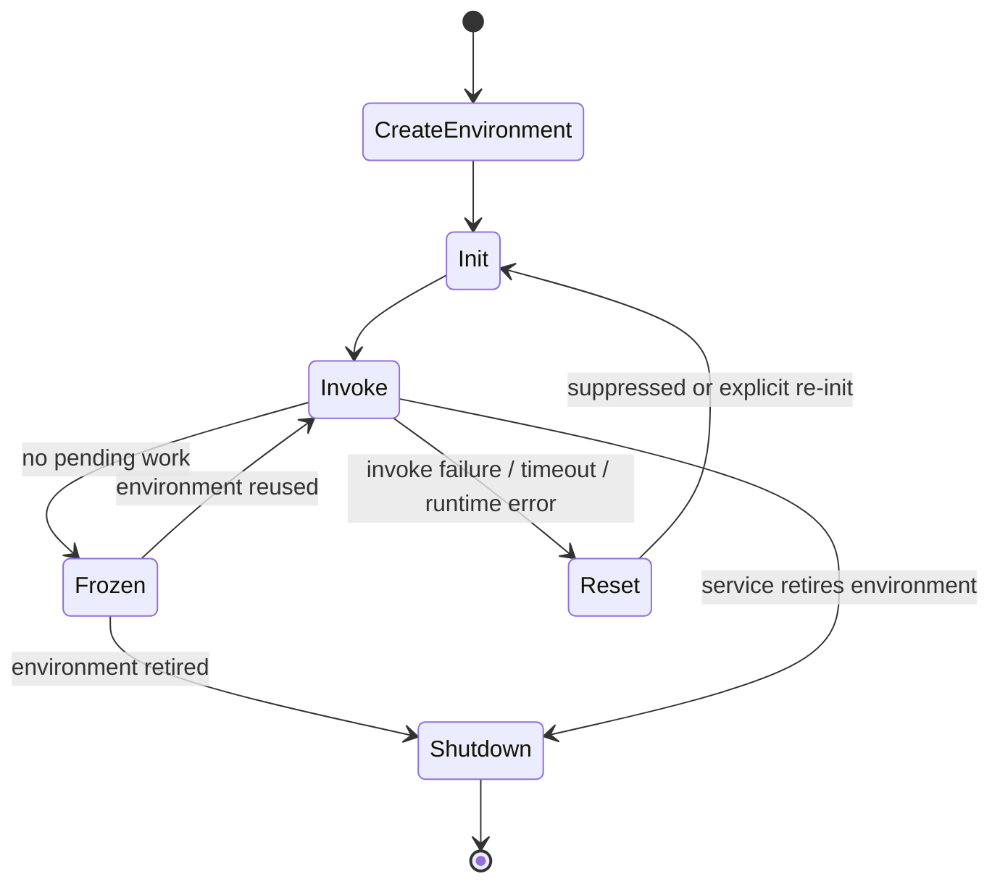
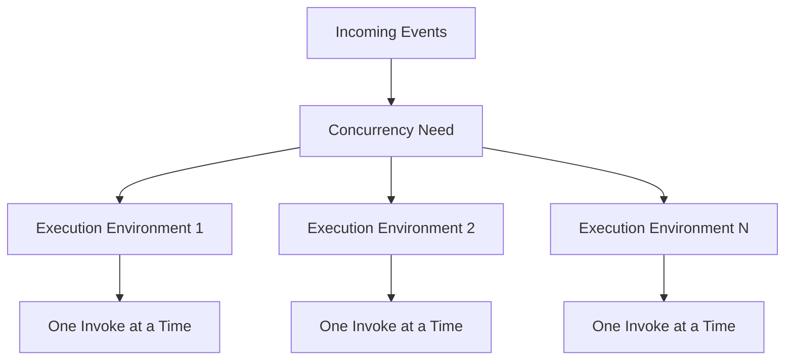
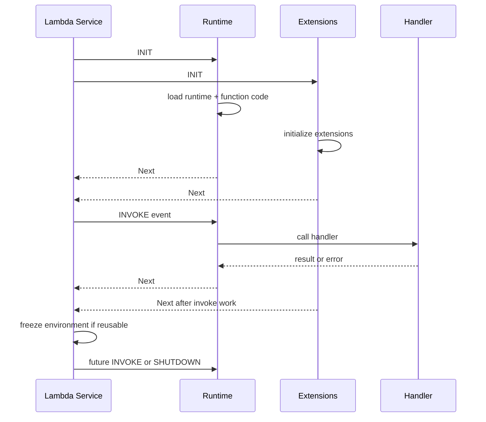
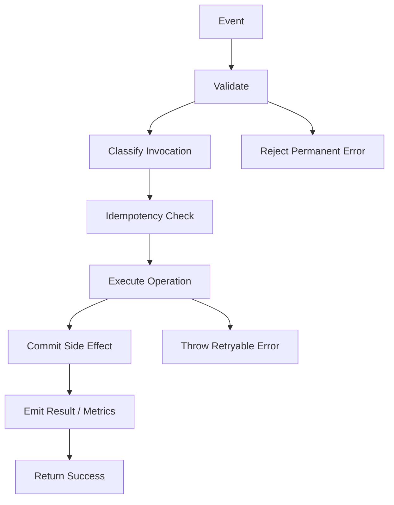
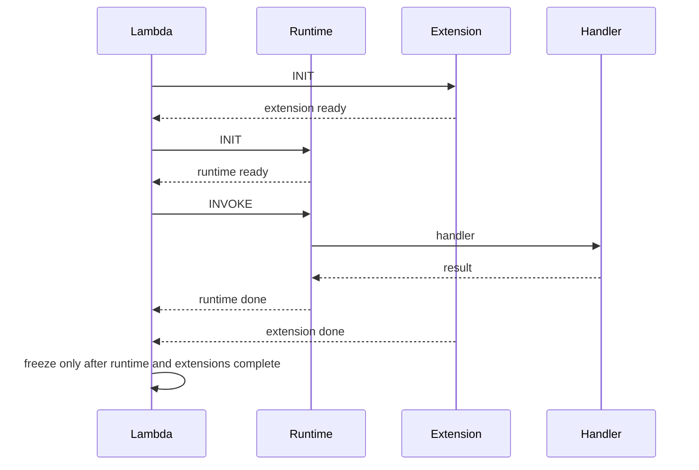
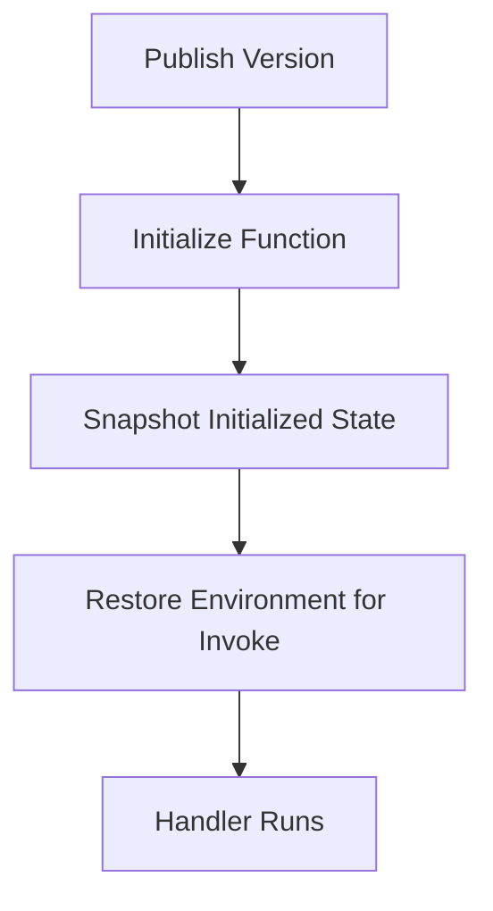

# Part 050 — Lambda Execution Lifecycle

You cannot tune Lambda well until you understand its lifecycle.

Most Lambda mistakes come from assuming this:

```txt
handler starts
handler runs
handler ends
```

The real model is closer to this:



Lambda execution has lifecycle phases:

- **Init**
- **Invoke**
- **Shutdown**

Between invokes, Lambda may freeze and later thaw the execution environment. If an invocation fails in certain ways, Lambda may reset the environment and reinitialize it before reuse.

The important word is **may**.

Reuse is an optimization. Your correctness cannot depend on it.

---

## 1. Execution Environment

A Lambda execution environment is an isolated environment where your function runtime and code execute.

It includes:

- runtime process;
- function code;
- layers or container image content;
- environment variables;
- `/tmp` ephemeral file system;
- initialized global/static state;
- runtime extensions;
- network context;
- AWS SDK clients or other initialized clients;
- open connections if they survive freeze/thaw and remain valid.

The execution environment handles one invocation at a time for a given function instance.

Concurrency is achieved by creating multiple execution environments.



This has an important implication:

```txt
static variables are not shared across all concurrent invocations.
They are shared only across invocations that reuse the same environment.
```

---

## 2. The Lifecycle at a Glance



Each phase has a different engineering concern.

| Phase | Main Concern |
|---|---|
| Init | cold start cost, static state, client construction |
| Invoke | business logic, timeout, side effects, retry correctness |
| Freeze | background work hazard, stale state, connection validity |
| Reuse/Thaw | cache correctness, connection reuse, time drift |
| Reset | failure cleanup, suppressed init, lost assumptions |
| Shutdown | flushing telemetry, cleanup, extension behavior |

---

## 3. Init Phase

The Init phase prepares the execution environment before the handler processes an event.

It includes:

- runtime initialization;
- extension initialization;
- function code loading;
- static/global initialization outside the handler.

For Java, this commonly includes:

- class loading;
- framework bootstrap;
- dependency injection container startup;
- static field initialization;
- AWS SDK client creation;
- connection pool construction;
- JSON serializer setup;
- logging/tracing setup;
- feature flag/config client setup.

Example Java handler shape:

```java
public class OrderCreatedHandler implements RequestHandler<OrderCreatedEvent, HandlerResult> {

    private static final ObjectMapper MAPPER = new ObjectMapper();

    private static final DynamoDbClient DDB = DynamoDbClient.builder()
            .build();

    private static final OrderService SERVICE = new OrderService(DDB, MAPPER);

    @Override
    public HandlerResult handleRequest(OrderCreatedEvent event, Context context) {
        return SERVICE.handle(event, context);
    }
}
```

The static fields are initialized during Init, not per invocation.

That can be good. It can also be dangerous.

### Good Init Work

- create reusable SDK clients;
- create reusable HTTP clients;
- parse static configuration;
- initialize serializers;
- precompute immutable lookup tables;
- initialize logging/tracing;
- validate required environment variables.

### Risky Init Work

- call downstream systems that may be unavailable;
- open many database connections eagerly;
- load huge models/files unless needed;
- fetch secrets without caching/timeout strategy;
- perform business side effects;
- run database migrations;
- start background worker threads;
- depend on wall-clock state without refresh.

Init should prepare the function. It should not perform the business operation.

---

## 4. Cold Start Breakdown

Cold start latency is the time required to create and initialize a new environment before handler execution.


Cold start is not a single thing. It is a sum.

### Common Cold Start Contributors

| Contributor | Example |
|---|---|
| runtime startup | JVM startup, class loading |
| package size | large ZIP/container image/layers |
| dependency graph | big framework boot |
| static initialization | SDK clients, reflection, DI |
| network calls during init | secrets/config/downstream validation |
| VPC path | private resource networking |
| extensions | observability/security extension startup |
| memory/CPU setting | low memory can mean lower CPU allocation |
| architecture | arm64 vs x86 startup/performance differences |

### Cold Start Measurement

Every Lambda log report includes useful timing information.

Look for:

```txt
INIT_REPORT
REPORT RequestId: ...
Duration: ...
Billed Duration: ...
Init Duration: ...
```

In structured logs, emit:

```json
{
  "cold_start": true,
  "phase": "invoke",
  "service": "order-handler",
  "event_type": "OrderCreated"
}
```

A simple Java cold-start marker:

```java
public final class ColdStart {
    private static final AtomicBoolean FIRST = new AtomicBoolean(true);

    public static boolean isColdStart() {
        return FIRST.getAndSet(false);
    }
}
```

Use it in handler logs:

```java
boolean cold = ColdStart.isColdStart();
logger.info("handling event cold_start={} request_id={}", cold, context.getAwsRequestId());
```

This tracks cold start per execution environment.

---

## 5. Invoke Phase

The Invoke phase is where Lambda calls your handler with an event.

A production handler should have this shape:

```txt
parse/validate event
derive idempotency key
load configuration snapshot
start trace/log context
execute bounded business operation
commit side effect atomically
emit outcome
return or throw classified error
```



### Handler Rules

1. Validate input early.
2. Do not do unbounded work.
3. Do not block forever on downstream.
4. Make side effects idempotent.
5. Use request-scoped state inside the handler.
6. Avoid global mutable state for request data.
7. Log classified outcomes.
8. Respect remaining time.
9. Fail loudly when retry is desired.
10. Treat timeout as a partial-failure risk.

### Remaining Time Budget

Lambda context exposes remaining execution time.

Use it.

Java example:

```java
int remainingMs = context.getRemainingTimeInMillis();

if (remainingMs < 2_000) {
    throw new RetryableTimeoutBudgetException("not enough time to safely start operation");
}
```

This prevents starting a non-idempotent downstream write with 100 ms left.

---

## 6. Freeze and Thaw

After an invocation completes, Lambda may freeze the execution environment for reuse.

During freeze:

- process state is paused;
- global variables remain in memory;
- `/tmp` contents may remain;
- open connections may remain but can become stale;
- background threads do not make reliable progress;
- timers/scheduled tasks are not a durable scheduling mechanism.

On thaw:

- the environment may receive another event;
- global/static state is still present;
- time has advanced;
- network connections may have been closed by peers;
- credentials/config/cache may be stale;
- the handler should revalidate what must be fresh.

### Good Reuse

Reuse is good for:

- SDK clients;
- HTTP clients;
- database connection pools with validation;
- object mappers;
- immutable config;
- cached schemas;
- compiled regex;
- small lookup data with TTL.

### Dangerous Reuse

Reuse is dangerous for:

- cached authorization decisions without expiry;
- tenant-specific context in static fields;
- request bodies in global variables;
- mutable singleton state;
- “in-memory deduplication”;
- background retry queue;
- transaction handle;
- open stream cursor;
- unbounded `/tmp` cache.

### Rule

```txt
Anything needed for correctness must be externalized or recomputed.
Anything cached in the environment is only a performance optimization.
```

---

## 7. Background Work Hazard

A Lambda handler should not return before important work is complete.

Bad pattern:

```java
public String handleRequest(Event event, Context context) {
    executor.submit(() -> sendAuditEvent(event));
    return "OK";
}
```

Why this is dangerous:

- Lambda may freeze the environment after handler returns;
- background task may not complete promptly;
- task may resume during a later invocation;
- errors may be invisible;
- execution context may be wrong;
- shutdown may kill it.

Better:

```java
public String handleRequest(Event event, Context context) {
    sendAuditEvent(event);
    return "OK";
}
```

Or explicitly externalize async work:

```txt
handler -> SQS/EventBridge -> separate consumer
```

If the work matters, make it part of the invocation or durable event flow.

---

## 8. Reset After Failure

If an invocation fails due to timeout, runtime crash, memory issue, or similar failure, Lambda may reset the execution environment.

A reset can behave like a shutdown followed by reinitialization.

Important implications:

- global state may be lost;
- `/tmp` may or may not still contain data depending on reset behavior;
- next invocation may include reinitialization time;
- logs may show a “suppressed init” folded into invoke duration;
- unfinished side effects remain your responsibility.

Failure is not just an error return. It changes lifecycle assumptions.

### Failure Types That Can Trigger Reset-Like Behavior

- function timeout;
- runtime crash;
- out-of-memory;
- extension failure;
- runtime exit;
- invalid runtime response.

### Engineering Rule

After any failure, assume the next invocation may be cold-like even if the environment container is reused internally.

---

## 9. Shutdown Phase

Shutdown happens when Lambda retires the execution environment.

Reasons include:

- environment idle too long;
- service scaling down;
- function update;
- runtime update;
- failure/reset path;
- infrastructure lifecycle.

Shutdown involves runtime and extensions.

For production design, shutdown is not a place to do business-critical work.

It is a place to:

- flush telemetry;
- close clients if runtime supports it;
- clean up non-critical resources;
- let extensions finish bounded work.

### Do Not Depend on Shutdown For

- committing business transactions;
- sending final audit events;
- publishing required messages;
- releasing distributed locks as the only safety path;
- draining in-memory queues;
- completing background jobs.

Business correctness must finish during Invoke or be represented in durable external state.

---

## 10. Extensions and Lifecycle

Lambda extensions integrate with monitoring, observability, security, and governance tools.

They participate in lifecycle events.



Extensions can improve visibility, but they can add:

- init latency;
- invoke tail latency;
- memory usage;
- CPU contention;
- shutdown delay;
- failure mode complexity.

### Extension Design Questions

- What does it do during Init?
- Does it block completion of Invoke?
- How does it behave on timeout?
- How much memory does it consume?
- Does it send telemetry synchronously?
- What happens if its backend is down?
- Does it handle Shutdown quickly?
- Is it compatible with SnapStart or provisioned concurrency?

Never install extensions blindly into latency-sensitive functions.

Measure them.

---

## 11. Java Runtime Lifecycle Implications

Java on Lambda has special lifecycle concerns.

### Static Initialization

Java static initialization can be expensive but reusable.

Good:

```java
private static final ObjectMapper MAPPER = new ObjectMapper();
private static final SqsClient SQS = SqsClient.builder().build();
```

Risky:

```java
static {
    runDatabaseMigration();
    callExternalHealthCheck();
    loadAllTenantRulesIntoMemory();
}
```

### Dependency Injection Frameworks

Frameworks can increase Init duration.

This does not mean “never use frameworks.” It means:

- measure cold start;
- avoid scanning huge classpaths;
- avoid lazy surprises during first request;
- prefer functional boundaries;
- trim dependencies;
- consider SnapStart/provisioned concurrency for synchronous APIs;
- consider lighter runtime style for event handlers.

### Connection Pools

A database pool per execution environment can multiply connections.

If reserved concurrency is 100 and each environment has a pool of 10:

```txt
potential connections = 100 × 10 = 1000
```

That can kill a database.

For Lambda, pool sizes should often be small.

```txt
maxPoolSize = 1..2 for many direct DB Lambda handlers
```

Or use RDS Proxy when appropriate.

### JVM Memory

Container memory is Lambda memory.

Heap should not consume all configured memory.

Example:

```txt
JAVA_TOOL_OPTIONS=-XX:MaxRAMPercentage=70 -XX:+ExitOnOutOfMemoryError
```

Leave room for:

- metaspace;
- native memory;
- thread stacks;
- SDK buffers;
- TLS;
- extensions;
- runtime overhead.

---

## 12. SnapStart Lifecycle Implications

For supported runtimes and configurations, SnapStart changes initialization economics by taking a snapshot of the initialized execution environment and resuming from that snapshot for future environments.

Conceptually:



SnapStart can reduce cold start latency, especially for Java workloads, but it changes how you think about initialization.

### SnapStart Safety Questions

- Does Init generate unique IDs that must be unique per environment?
- Does Init open network connections that are invalid after restore?
- Does Init fetch short-lived credentials or tokens?
- Does Init seed random state safely?
- Does Init cache time-sensitive config?
- Are after-restore hooks needed?
- Are dependencies compatible?

The rule is:

```txt
state captured at snapshot time must still be valid after restore,
or must be refreshed after restore before use.
```

SnapStart is powerful, but not magic. It moves work from invoke-time environment creation to publish/restore-time lifecycle.

---

## 13. Provisioned Concurrency Lifecycle Implications

Provisioned concurrency keeps execution environments initialized ahead of requests.

Use it when you need:

- predictable latency;
- low cold-start impact;
- synchronous API responsiveness;
- scheduled warm capacity;
- compatibility with existing runtime behavior.

Provisioned concurrency requires version or alias discipline.

Do not configure it casually on `$LATEST` workflows. Production Lambda should already use versions/aliases for safe rollout.

### Pattern

```txt
publish version -> shift alias -> provision concurrency on alias/version -> monitor spillover
```

Monitor:

- provisioned concurrency utilization;
- spillover invocations;
- throttles;
- duration;
- init duration;
- cost.

Provisioned concurrency is paid capacity. Treat it like reserved always-on compute.

---

## 14. `/tmp` Ephemeral Storage

Lambda provides ephemeral storage at `/tmp`.

Use it for:

- temporary file processing;
- decompression;
- small local caches;
- intermediate artifacts;
- model/cache files if validated.

Do not use it as:

- durable state;
- cross-environment coordination;
- idempotency store;
- transaction log;
- permanent cache.

### Safe `/tmp` Pattern

```java
Path cacheFile = Path.of("/tmp/schema-v3.json");

if (!Files.exists(cacheFile) || !checksumMatches(cacheFile)) {
    downloadSchemaToTempFile();
    atomicMoveIntoPlace();
}

useSchema(cacheFile);
```

Key properties:

- versioned filename;
- checksum validation;
- atomic write;
- fallback on corruption;
- bounded size;
- no correctness dependency on existence.

---

## 15. Environment Variables and Runtime Config

Environment variables are loaded into the execution environment.

This means:

- changed env vars require new environment/deployment/config update;
- existing warm environments may continue with old values until replaced depending on update behavior;
- secrets in env vars are visible to function configuration readers;
- dynamic operational flags are better served by external config with caching and TTL.

### Config Pattern

```txt
static config:
  env vars

secret:
  Secrets Manager / SSM with cache

dynamic operational flag:
  AppConfig / config service with TTL

business state:
  database/event store
```

### Java Config Loader Sketch

```java
public final class ConfigProvider {
    private static volatile Config cached;
    private static volatile Instant expiresAt = Instant.EPOCH;

    public static Config get() {
        Instant now = Instant.now();
        if (cached == null || now.isAfter(expiresAt)) {
            synchronized (ConfigProvider.class) {
                if (cached == null || now.isAfter(expiresAt)) {
                    cached = loadConfigWithTimeout();
                    expiresAt = now.plusSeconds(60);
                }
            }
        }
        return cached;
    }
}
```

The TTL is deliberate. No infinite stale config.

---

## 16. Lifecycle-Aware Handler Template

A production Lambda handler should be explicit about initialization and invoke work.

```java
public final class PaymentEventHandler implements RequestHandler<SqsEvent, BatchResult> {

    private static final Logger log = LoggerFactory.getLogger(PaymentEventHandler.class);
    private static final AtomicBoolean COLD = new AtomicBoolean(true);

    private static final ObjectMapper mapper = new ObjectMapper();
    private static final DynamoDbClient ddb = DynamoDbClient.builder().build();
    private static final PaymentProcessor processor = new PaymentProcessor(ddb);

    @Override
    public BatchResult handleRequest(SqsEvent event, Context context) {
        boolean coldStart = COLD.getAndSet(false);
        long started = System.nanoTime();

        try {
            int remainingMs = context.getRemainingTimeInMillis();
            if (remainingMs < 2_000) {
                throw new RetryableException("insufficient Lambda time budget");
            }

            Config config = ConfigProvider.get();

            BatchResult result = processor.process(event, config, context);

            log.info("lambda_invocation outcome=success cold_start={} records={} duration_ms={}",
                    coldStart,
                    event.records().size(),
                    elapsedMs(started));

            return result;
        } catch (PermanentEventException e) {
            log.warn("lambda_invocation outcome=permanent_error cold_start={} error_code={}",
                    coldStart,
                    e.code(),
                    e);
            throw e;
        } catch (RetryableException e) {
            log.error("lambda_invocation outcome=retryable_error cold_start={} remaining_ms={}",
                    coldStart,
                    context.getRemainingTimeInMillis(),
                    e);
            throw e;
        } catch (Exception e) {
            log.error("lambda_invocation outcome=unknown_error cold_start={}", coldStart, e);
            throw e;
        }
    }

    private static long elapsedMs(long startedNanos) {
        return TimeUnit.NANOSECONDS.toMillis(System.nanoTime() - startedNanos);
    }
}
```

This template reflects lifecycle-aware design:

- static reusable clients;
- cold-start marker;
- remaining time check;
- config cache with TTL;
- classified errors;
- structured outcome logging;
- no background critical work;
- no request state in static mutable fields.

---

## 17. Lifecycle Failure Patterns

### Pattern 1 — Stale Global Tenant Context

Bad:

```java
private static String currentTenant;

public void handle(Event event) {
    currentTenant = event.tenantId();
    service.process(currentTenant);
}
```

If any async/background operation or shared mutable component reads this later, tenant contamination can occur.

Better:

```java
public void handle(Event event) {
    TenantContext tenant = TenantContext.of(event.tenantId());
    service.process(event, tenant);
}
```

Request context is passed explicitly.

### Pattern 2 — Static Authorization Cache Without Expiry

Bad:

```java
static Map<String, Permissions> permissions = new HashMap<>();
```

Better:

```txt
cache key includes tenant/user/policy version
cache has TTL
authorization decisions are traceable
policy changes can invalidate cache
```

### Pattern 3 — Per-Environment DB Pool Too Large

Bad:

```txt
reserved concurrency = 200
pool size = 10
database max connections = 500
```

Potential demand:

```txt
2000 connections
```

Better:

```txt
reserved concurrency = 50
pool size = 1 or 2
RDS Proxy if appropriate
queue buffer for bursts
```

### Pattern 4 — Init Depends on Downstream Availability

Bad:

```java
static final Rules rules = rulesApi.fetchAllRules();
```

If rules API is down, cold starts fail.

Better:

```txt
load required config with timeout
fallback to last known safe external cache if valid
separate deploy/config health from business dependency
```

### Pattern 5 — Fire-and-Forget Audit

Bad:

```java
executor.submit(() -> audit(event));
return success;
```

Better:

```txt
write audit synchronously as part of transaction
or publish durable audit event before returning
```

---

## 18. Lifecycle and Observability

Your telemetry should expose lifecycle signals.

Minimum metrics/log fields:

| Signal | Why |
|---|---|
| cold start count | latency/capacity diagnosis |
| init duration | package/runtime tuning |
| invoke duration | capacity/cost |
| remaining time low count | timeout risk |
| timeout count | partial side-effect risk |
| memory used | OOM/headroom |
| error type | retry strategy |
| extension overhead | hidden latency |
| config refresh count/failure | stale config detection |
| connection reuse failure | stale socket diagnosis |

### Log Example

```json
{
  "service": "payment-consumer",
  "phase": "invoke",
  "cold_start": true,
  "event_source": "sqs",
  "records": 10,
  "duration_ms": 842,
  "remaining_ms": 29158,
  "outcome": "SUCCESS"
}
```

### Alarm Examples

- timeout count > 0 for critical sync function;
- throttles > 0;
- async event age rising;
- DLQ messages > 0;
- iterator age rising;
- p95 duration near timeout;
- error rate by classified error type;
- provisioned concurrency spillover > 0;
- memory utilization > threshold;
- init duration regression after deploy.

---

## 19. Testing Lifecycle Behavior

Unit tests are not enough.

Test these behaviors:

### Cold Start Test

Deploy new version and invoke once.

Verify:

- init duration;
- first request latency;
- required env validation;
- secrets/config loading;
- no business side effect during init.

### Warm Reuse Test

Invoke same function repeatedly.

Verify:

- clients reused;
- no request state leakage;
- logs show cold start only once per environment;
- cache TTL behaves correctly.

### Timeout Test

Force downstream delay.

Verify:

- handler stops before unsafe remaining time;
- retry behavior is correct;
- no partial non-idempotent side effect;
- error classified.

### Reset Test

Force runtime error/OOM in non-prod.

Verify:

- next invocation does not assume global state;
- `/tmp` cache validated;
- telemetry still flushes enough evidence.

### Background Work Test

Add artificial delayed background operation in test branch.

Verify:

- it is not used for required side effects;
- any required async work is durable via queue/event.

### Connection Stale Test

Let environment sit idle, then invoke.

Verify:

- stale HTTP/DB connections are detected and recreated;
- retry is bounded;
- error does not poison future invokes.

---

## 20. Java Lifecycle Checklist

For Java Lambda functions:

- [ ] Static initialization measured.
- [ ] Dependencies trimmed.
- [ ] Framework startup cost justified.
- [ ] AWS SDK clients reused.
- [ ] HTTP clients reused with sane timeouts.
- [ ] DB pool size small and bounded.
- [ ] JVM heap configured with native headroom.
- [ ] SnapStart evaluated for sync latency-sensitive functions.
- [ ] Provisioned concurrency evaluated only where business latency needs it.
- [ ] No business side effects in static initializer.
- [ ] No request context in static mutable fields.
- [ ] Secrets/config cached with TTL.
- [ ] Cold start marker logged.
- [ ] Remaining time checked before risky operations.
- [ ] Errors classified.
- [ ] Idempotency durable.
- [ ] `/tmp` files versioned and validated.
- [ ] Background threads not used for required work.

---

## 21. Runtime Lifecycle Design Review Questions

Ask these in design review:

1. What happens during Init?
2. Which Init work can fail?
3. If Init fails, what operational signal appears?
4. What global state is reused?
5. Is global state immutable, expiring, or request-specific?
6. What happens if the environment is frozen for ten minutes?
7. What happens if a connection is stale after thaw?
8. What happens if the function times out after partial side effect?
9. What happens if the next invoke happens after a reset?
10. What does Shutdown need to flush?
11. What happens if an extension backend is down?
12. Does provisioned concurrency or SnapStart change state assumptions?
13. Can this function tolerate duplicate invocation?
14. Can downstream tolerate maximum concurrency?
15. What evidence proves lifecycle behavior in production?

If the team cannot answer these, they are not ready to tune cold starts or concurrency. They still lack the runtime model.

---

## 22. Final Mental Model

Lambda lifecycle is not trivia.

It is the foundation for:

- cold start tuning;
- Java performance;
- safe connection reuse;
- cache correctness;
- timeout safety;
- extension selection;
- SnapStart safety;
- provisioned concurrency economics;
- debugging weird warm-state bugs;
- avoiding background work loss;
- designing idempotent side effects.

Think of a Lambda execution environment as:

```txt
a reusable but disposable sandbox
```

Reusable enough to optimize.

Disposable enough that correctness cannot depend on it.

That is the core Lambda lifecycle discipline.

---

## References

- AWS Lambda Developer Guide: understanding the Lambda execution environment lifecycle
- AWS Lambda Developer Guide: function invocation methods
- AWS Lambda Developer Guide: runtime extensions API
- AWS Lambda Developer Guide: configuring reserved concurrency
- AWS Lambda Developer Guide: configuring provisioned concurrency
- AWS Lambda Developer Guide: SnapStart
- AWS Lambda Developer Guide: Java handler and runtime guidance
