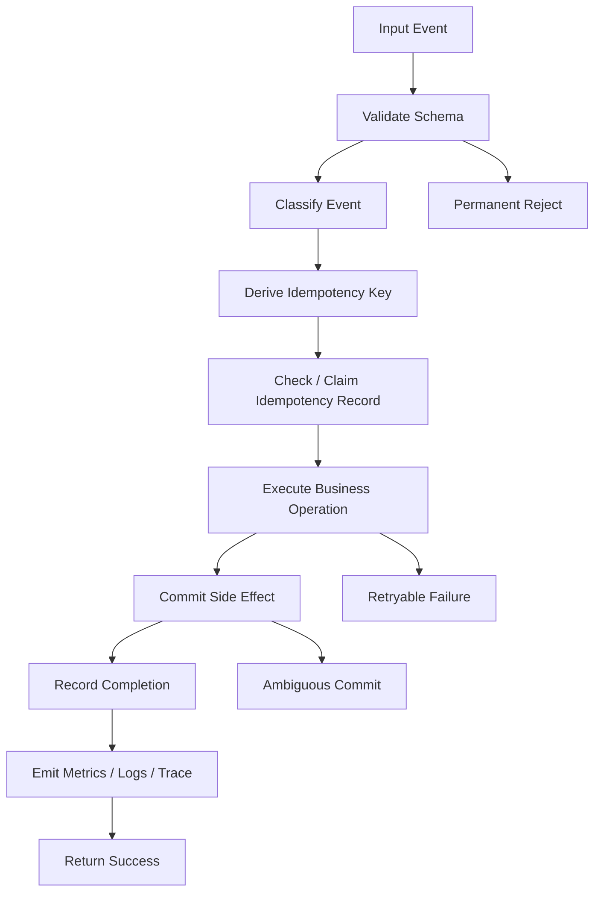
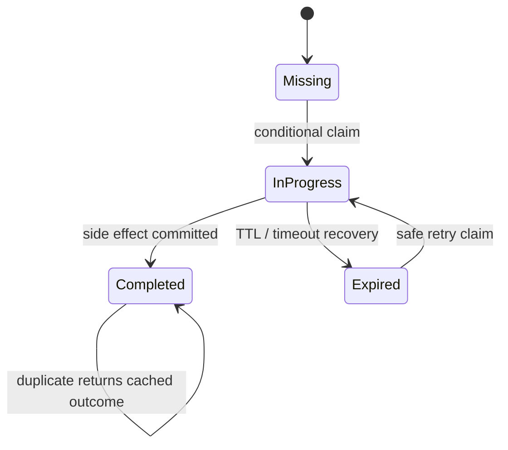
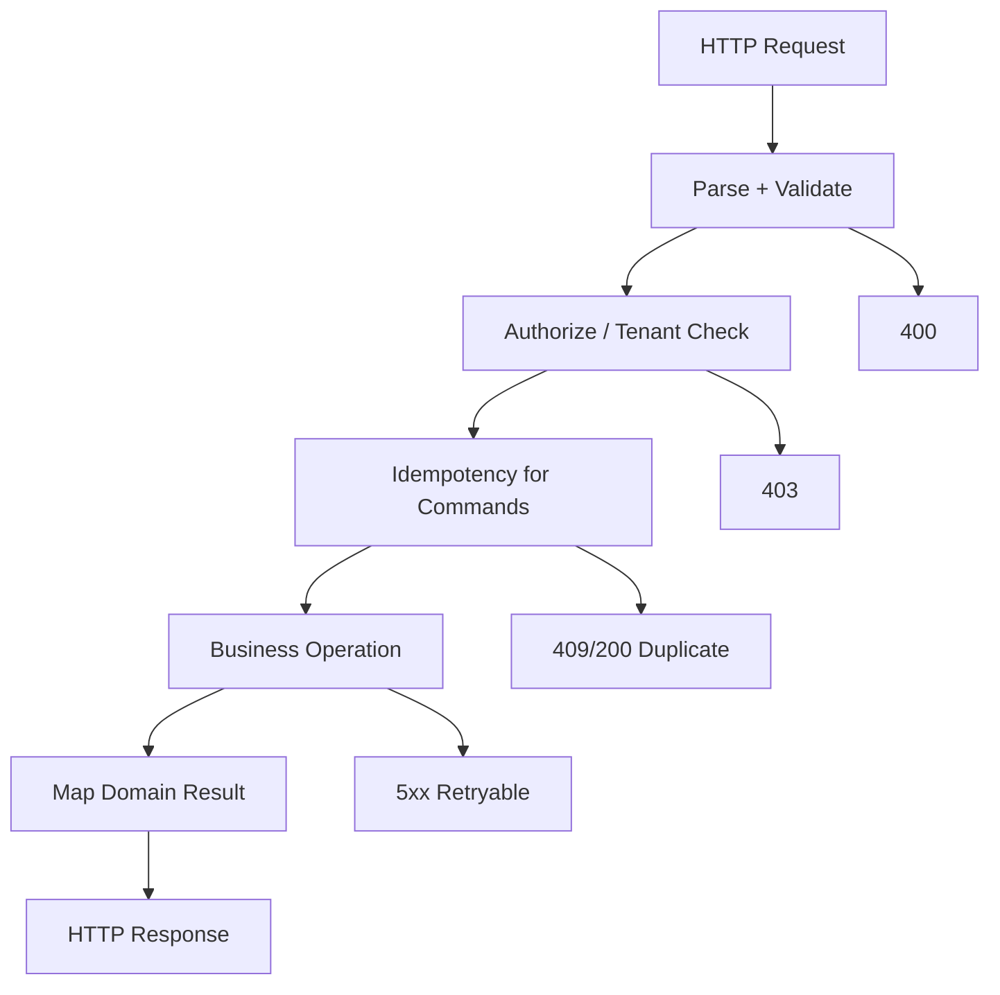
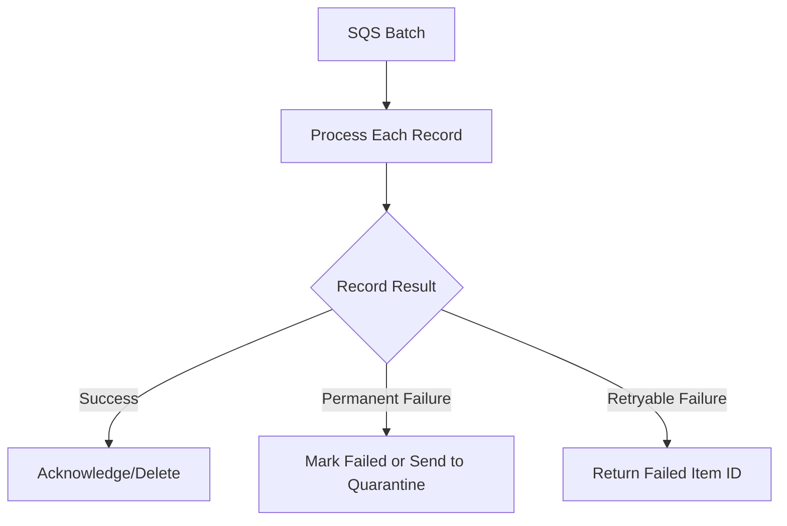
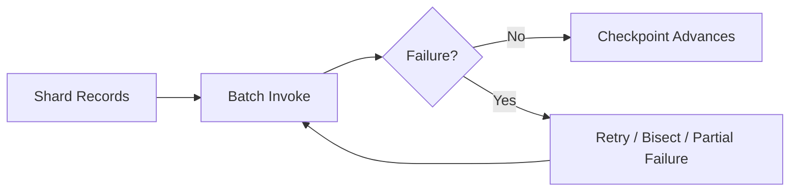
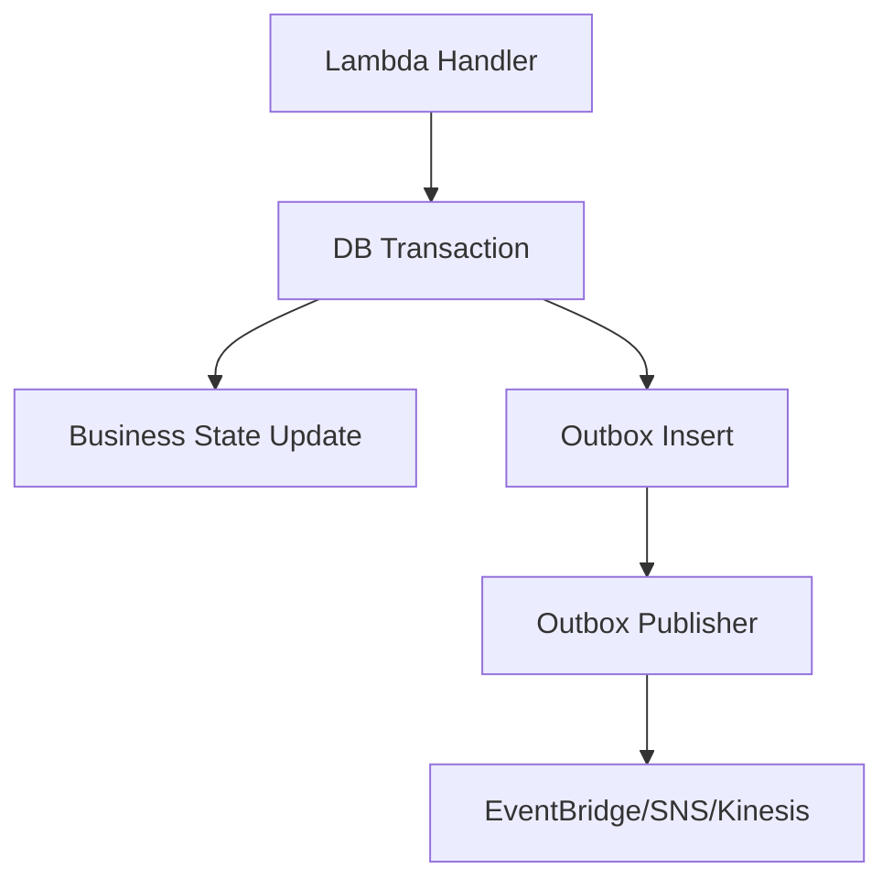

# Part 051 — Handler Design and Idempotency

A Lambda handler is not just a function body.

In production, a handler is a **failure boundary**.

It receives an event whose delivery may be duplicated, delayed, reordered, retried, or partially valid. It then makes side effects against systems that may be slower, unavailable, throttled, inconsistent, or already changed by a previous attempt.

A weak handler says:

> “Deserialize event, call service, return.”

A production handler says:

> “Validate event, classify it, derive an idempotency key, protect side effects, respect timeout budget, handle partial failure, emit evidence, and make retry behavior safe.”

This part is about correctness.

Not syntax.

---

## 1. The Handler as a State Transition

A Lambda handler should be modeled as a state transition:

```txt
event + current durable state -> new durable state + emitted evidence
```

Not:

```txt
event -> code path -> hope
```



A production handler must distinguish:

- permanent failure;
- retryable failure;
- duplicate event;
- partial success;
- ambiguous success;
- poison event;
- timeout risk;
- downstream throttling;
- validation failure;
- authorization/configuration failure.

Throwing `RuntimeException` for all of them is not engineering. It is panic.

---

## 2. Invocation Semantics Drive Handler Design

The same handler code pattern is wrong or right depending on the event source.

| Source | Handler Must Care About |
|---|---|
| API Gateway | request validation, response mapping, caller retry, latency budget |
| ALB | HTTP response contract, target timeout, request size, health checks |
| EventBridge | event schema, duplicate events, async retry, archive/replay |
| SNS | fanout duplicate handling, async destination/DLQ |
| S3 notification | object versioning, duplicate events, eventual object state |
| SQS | batch processing, visibility timeout, DLQ, partial batch failure |
| SQS FIFO | message group ordering, deduplication, poison message blocking |
| Kinesis | shard ordering, iterator age, poison record, batch retry blocking |
| DynamoDB Streams | record ordering per shard, old/new image semantics, replay |
| Step Functions | task failure names, retry/catch semantics, timeout integration |

The event source determines:

```txt
who retries
what is retried
how long retry continues
whether order matters
whether batch failure blocks progress
where failed events go
how duplicates appear
```

Handler design starts there.

---

## 3. Event Validation

Do not let business logic discover malformed input accidentally.

Validate at the boundary.

A handler should validate:

- required fields;
- event type;
- event version;
- source;
- timestamp sanity;
- tenant/account boundary;
- correlation ID/request ID;
- payload size;
- enum values;
- business identifier shape;
- backward/forward compatibility.

Example event envelope:

```json
{
  "id": "evt-01J2...",
  "source": "orders",
  "detail-type": "OrderCreated",
  "time": "2026-07-06T10:15:30Z",
  "detail": {
    "schemaVersion": "1.2",
    "orderId": "ord-123",
    "customerId": "cust-456",
    "amount": 199000,
    "currency": "IDR"
  }
}
```

Validation should classify errors.

| Error | Retry? | Reason |
|---|---|---|
| missing required field | no | same event will fail again |
| unsupported schema version | no or quarantine | consumer cannot interpret it |
| malformed JSON | no | poison event |
| downstream timeout | yes | transient |
| idempotency lock in progress | yes later | previous attempt may complete |
| duplicate completed event | no, return success | already processed |
| IAM denied | no until config fixed | retry wastes capacity |
| throttled dependency | yes with backoff | transient capacity issue |

Permanent invalid events should not be retried forever.

---

## 4. Idempotency: The Core Rule

Idempotency means:

> Processing the same business event more than once produces the same durable business result as processing it once.

Not:

> The code returns the same response.

Not:

> The function does not throw.

Not:

> The event source says it will usually avoid duplicates.

The business side effect is what matters.

### Examples

| Operation | Idempotent? | Why |
|---|---:|---|
| `set status = APPROVED` | often yes | same final state |
| `increment balance by 100` | no | repeated attempt changes value |
| `insert payment with unique paymentId` | yes if unique constraint used | duplicate insert rejected/ignored |
| `send email` | no unless deduped | duplicate user-visible side effect |
| `publish event with deterministic event id` | maybe | consumer/bus behavior matters |
| `start workflow with deterministic execution name` | yes if duplicate start rejected safely | external idempotency |
| `charge card` | no unless payment provider idempotency key used | external side effect |

You need idempotency at the side-effect boundary, not only inside Lambda.

---

## 5. Why Lambda Needs Idempotency

Lambda functions can see duplicate events because of:

- event source retries;
- network failure after side effect but before acknowledgement;
- timeout after partial work;
- queue visibility timeout expiring;
- stream batch retry;
- async invocation retries;
- manual replay;
- EventBridge archive replay;
- producer retries;
- caller retries;
- deployment rollback/re-drive;
- operator action;
- disaster recovery replay.

At-least-once processing is the common reality.

Design as if the same event can arrive again at the worst possible moment.

---

## 6. Idempotency Key Design

An idempotency key must identify the business operation, not the delivery attempt.

Bad keys:

```txt
current timestamp
Lambda request ID
random UUID generated by consumer
SQS message ID if producer may enqueue duplicate business events
EventBridge delivery attempt ID
```

Good keys:

```txt
business_operation + aggregate_id + version
payment_capture + payment_id
order_created + order_id + event_version
case_transition + case_id + transition_id
document_upload + document_id + content_sha256
workflow_start + external_request_id
```

### Key Formula

```txt
idempotency_key =
  operation_name + ":" +
  aggregate_type + ":" +
  aggregate_id + ":" +
  event_version_or_command_id
```

Example:

```txt
CapturePayment:payment:pay_123:v1
CreateCase:case:case_789:cmd_456
GenerateInvoice:order:ord_123:invoice-v1
```

### Tenant-Aware Key

In multi-tenant systems:

```txt
tenant_id + ":" + operation + ":" + aggregate_id + ":" + command_id
```

Without tenant prefix, one tenant can collide with another tenant if identifiers are not globally unique.

---

## 7. Idempotency Record Pattern

A common pattern is to store an idempotency record in DynamoDB or a relational table.



Record fields:

| Field | Purpose |
|---|---|
| `idempotencyKey` | unique operation key |
| `status` | `IN_PROGRESS`, `COMPLETED`, `FAILED_RETRYABLE`, etc. |
| `createdAt` | audit/debug |
| `expiresAt` | TTL cleanup |
| `inProgressExpiresAt` | recover abandoned lock |
| `requestHash` | detect same key with different payload |
| `resultSummary` | cached response/outcome if needed |
| `sideEffectRef` | payment ID, workflow execution ARN, event ID |
| `attemptCount` | operational signal |
| `lastError` | debugging signal |

### Basic Flow

```txt
1. derive idempotency key
2. conditionally create IN_PROGRESS record
3. if record already COMPLETED, return success/cached result
4. if record IN_PROGRESS and not expired, retry later
5. perform side effect
6. update record to COMPLETED with side-effect reference
```

### The Critical Race

Two invocations can process the same event at the same time.

The idempotency record must be claimed atomically.

DynamoDB conditional write example intent:

```txt
PutItem idempotencyKey = K
ConditionExpression attribute_not_exists(idempotencyKey)
```

Relational equivalent:

```sql
INSERT INTO idempotency_record(key, status, created_at)
VALUES (?, 'IN_PROGRESS', now())
ON CONFLICT DO NOTHING;
```

If you “check then insert” without atomicity, you have a race.

---

## 8. Ambiguous Commit Problem

The hardest case:

```txt
1. Lambda calls payment provider.
2. Provider charges card.
3. Network times out before Lambda receives response.
4. Lambda throws.
5. Event is retried.
```

Did the charge happen?

You do not know.

This is the **ambiguous commit** problem.

Correct design requires one of:

- external provider idempotency key;
- provider-side transaction lookup;
- local outbox/transactional boundary;
- reconciliation job;
- workflow with explicit compensation;
- durable side-effect record before/after with recovery state.

For payment:

```txt
idempotency key must be sent to payment provider
```

For email:

```txt
dedupe notification by notification_id
```

For workflow:

```txt
use deterministic workflow execution name
```

For database write:

```txt
use unique constraint or conditional update
```

Idempotency cannot be bolted on after the side effect if the external system does not support dedupe or lookup.

---

## 9. Timeout Budget and Safe Cutoff

A handler must avoid starting risky side effects when there is not enough time to finish and record outcome.

Bad:

```java
chargeCard();
writeIdempotencyCompleted();
```

If Lambda times out between the two, the charge may happen but the idempotency record stays `IN_PROGRESS`.

Better:

```java
if (context.getRemainingTimeInMillis() < SAFE_SIDE_EFFECT_BUDGET_MS) {
    throw new RetryableTimeoutBudgetException("not enough time to safely start payment capture");
}

chargeCardWithProviderIdempotencyKey();
writeIdempotencyCompleted();
```

### Budget Model

```txt
lambda_remaining_time
  > downstream_client_timeout
  + result_persistence_timeout
  + logging/telemetry_margin
  + safety_buffer
```

Example:

```txt
remaining_time_required = 5000ms
payment_provider_timeout = 2000ms
idempotency_update_timeout = 500ms
telemetry_margin = 500ms
safety_buffer = 2000ms
```

Do not begin the side effect if remaining time is below the safe threshold.

---

## 10. Handler Shape for Synchronous API

For API Gateway/ALB synchronous functions:



### HTTP Mapping

| Domain Outcome | HTTP |
|---|---|
| validation error | 400 |
| unauthorized | 401/403 |
| duplicate command already completed | 200/201 with same resource or 409 depending API contract |
| idempotency key reused with different payload | 409 |
| resource not found | 404 |
| business rule violation | 409/422 |
| transient downstream | 503 |
| timeout budget exhausted | 503/504 |
| unknown error | 500 |

Never leak raw exceptions as API responses.

### Java Sketch

```java
public ApiResponse handleRequest(ApiRequest request, Context context) {
    RequestContext ctx = RequestContext.from(request, context);

    try {
        CreateCaseCommand command = validator.parseAndValidate(request.body());

        String key = IdempotencyKeys.forCreateCase(ctx.tenantId(), command.clientRequestId());

        return idempotency.execute(key, hash(command), () -> {
            Case created = caseService.create(command, ctx);
            return ApiResponse.created(created.id(), created);
        });

    } catch (ValidationException e) {
        return ApiResponse.badRequest(e.errors());
    } catch (PayloadConflictException e) {
        return ApiResponse.conflict("idempotency key reused with different payload");
    } catch (RetryableDependencyException e) {
        return ApiResponse.serviceUnavailable("dependency temporarily unavailable");
    }
}
```

---

## 11. Handler Shape for SQS Batch

SQS invokes Lambda with a batch of messages.

The dangerous default is failing the whole batch because one record failed.

Modern handlers should use partial batch response when possible.



### Record-Level Rules

For each message:

1. Parse.
2. Validate.
3. Derive idempotency key.
4. Process.
5. If success or duplicate completed, do not fail the record.
6. If retryable, return failed item.
7. If permanent poison, route to quarantine or fail until DLQ depending policy.

### Java-Style Pseudocode

```java
public SqsBatchResponse handleRequest(SQSEvent event, Context context) {
    List<BatchItemFailure> failures = new ArrayList<>();

    for (SQSEvent.SQSMessage msg : event.getRecords()) {
        try {
            processOne(msg, context);
        } catch (PermanentMessageException e) {
            quarantine(msg, e);
            // Treat as success after quarantine to avoid infinite retry.
        } catch (RetryableException e) {
            failures.add(new BatchItemFailure(msg.getMessageId()));
        }
    }

    return new SqsBatchResponse(failures);
}
```

### Visibility Timeout Rule

```txt
SQS visibility timeout > Lambda timeout + retry/cleanup buffer
```

If visibility timeout is too short, the same message can be processed concurrently by another invocation while the first is still running.

---

## 12. Handler Shape for Streams

Stream sources such as Kinesis and DynamoDB Streams have ordering constraints.

A failed record can block progress in its shard.



Design considerations:

- preserve per-shard order where required;
- make record processing idempotent;
- use partial batch response if supported;
- use bisect batch on error where appropriate;
- monitor iterator age;
- detect poison records;
- bound retry age;
- route unprocessable records to failure destination when possible.

A stream consumer that does not handle poison records can block an entire shard indefinitely.

---

## 13. Error Classification

Create explicit exception types.

```java
sealed interface HandlerFailure permits
        PermanentEventFailure,
        RetryableDependencyFailure,
        DuplicateCompletedFailure,
        IdempotencyInProgressFailure,
        TimeoutBudgetFailure,
        UnknownFailure {
}
```

A simpler practical Java exception hierarchy:

```java
public abstract class AppException extends RuntimeException {
    public abstract boolean retryable();
    public abstract String code();
}

public final class ValidationException extends AppException {
    public boolean retryable() { return false; }
    public String code() { return "VALIDATION_ERROR"; }
}

public final class DependencyThrottledException extends AppException {
    public boolean retryable() { return true; }
    public String code() { return "DEPENDENCY_THROTTLED"; }
}

public final class DuplicateCompletedException extends AppException {
    public boolean retryable() { return false; }
    public String code() { return "DUPLICATE_COMPLETED"; }
}
```

Logs and metrics should use error codes, not only stack traces.

### Error Matrix

| Error Code | Retry | Alarm? | Action |
|---|---:|---:|---|
| `VALIDATION_ERROR` | no | maybe if spike | producer contract issue |
| `DUPLICATE_COMPLETED` | no | no | return success |
| `IDEMPOTENCY_IN_PROGRESS` | yes later | only if high | previous attempt still running |
| `DEPENDENCY_THROTTLED` | yes | yes | protect downstream |
| `DEPENDENCY_TIMEOUT` | yes | yes | check downstream latency |
| `CONFIG_MISSING` | no | yes | deployment/config bug |
| `IAM_DENIED` | no | yes | permission bug |
| `TIMEOUT_BUDGET_LOW` | yes | yes if frequent | adjust timeout/work unit |
| `POISON_MESSAGE` | no/quarantine | yes | producer/data issue |

---

## 14. Idempotency Store Design

### DynamoDB Table

Example logical schema:

```txt
Table: idempotency_records

PK: idempotencyKey

Attributes:
  status
  requestHash
  resultSummary
  sideEffectRef
  createdAt
  updatedAt
  inProgressExpiresAt
  ttl
  attemptCount
  lastErrorCode
```

Claim operation:

```txt
PutItem
  key = K
  status = IN_PROGRESS
  requestHash = H
  inProgressExpiresAt = now + lock_timeout
ConditionExpression:
  attribute_not_exists(idempotencyKey)
```

Duplicate path:

```txt
GetItem K

if status == COMPLETED and requestHash == H:
    return cached success

if status == COMPLETED and requestHash != H:
    reject idempotency key reuse

if status == IN_PROGRESS and not expired:
    retry later

if status == IN_PROGRESS and expired:
    attempt conditional takeover
```

Complete operation:

```txt
UpdateItem
ConditionExpression:
  status = IN_PROGRESS and requestHash = H
Set:
  status = COMPLETED,
  sideEffectRef = ...,
  resultSummary = ...,
  updatedAt = now,
  ttl = now + retention_period
```

### Retention

Retention must match business retry/replay window.

| Workload | Retention |
|---|---|
| API command idempotency | hours to days |
| payment capture | days to months depending reconciliation |
| event consumer | at least replay window |
| workflow start | workflow retention window |
| regulatory lifecycle event | long retention or business event log |

If events can be replayed after 30 days, idempotency records retained for 24 hours are not enough.

---

## 15. Idempotency and Event Sourcing

If your system has an append-only event store, idempotency can be enforced by unique event IDs or aggregate version constraints.

Example:

```sql
INSERT INTO case_events(event_id, case_id, event_type, version, payload)
VALUES (?, ?, ?, ?, ?)
ON CONFLICT (event_id) DO NOTHING;
```

Or:

```sql
INSERT INTO case_events(case_id, version, event_type, payload)
VALUES (?, expected_next_version, ?, ?)
```

The aggregate version becomes the concurrency/idempotency boundary.

This is strong for lifecycle systems:

```txt
CaseCreated
CaseAssigned
EvidenceRequested
DeadlineExtended
EnforcementEscalated
DecisionIssued
```

Each transition should have a stable command ID or event ID.

---

## 16. Idempotency and Outbox

For handlers that update a database and emit an event, use outbox pattern.

Bad:

```txt
1. update database
2. publish EventBridge event
```

If publishing fails after DB commit, state changed but event is missing.

Better:

```txt
1. DB transaction:
   - update business row
   - insert outbox event with unique event_id
2. separate publisher reads outbox and publishes
3. mark outbox published
```



The outbox event ID also becomes a downstream idempotency key.

---

## 17. Idempotency and Step Functions

Step Functions can provide orchestration-level idempotency through deterministic execution names.

Pattern:

```txt
executionName = workflowType + "-" + businessId + "-" + commandId
```

Example:

```txt
case-escalation-case-123-transition-456
```

If the same start request is retried with the same name, you can detect that the workflow already exists or completed depending service behavior and retention window.

Do not generate random execution names for business commands that may be retried.

---

## 18. Idempotency and External APIs

When calling external APIs, always ask:

1. Does the API support idempotency keys?
2. Does the API expose operation lookup by client reference?
3. What is the retention window for idempotency keys?
4. What response is returned for duplicate key?
5. What happens if payload differs for same key?
6. Can we reconcile ambiguous results later?
7. Are callbacks/webhooks duplicated too?

For payment-like operations:

```txt
consumer idempotency record is not enough
provider idempotency key is required
```

You need both local and external protection.

---

## 19. Observability for Idempotency

Emit metrics:

| Metric | Meaning |
|---|---|
| `IdempotencyClaimed` | new operation claimed |
| `IdempotencyDuplicateCompleted` | safe duplicate |
| `IdempotencyInProgress` | duplicate while prior attempt active |
| `IdempotencyExpiredTakeover` | recovery from abandoned attempt |
| `IdempotencyPayloadConflict` | key reused with different payload |
| `IdempotencyStoreError` | store unavailable |
| `PoisonEventCount` | permanent invalid event |
| `PartialBatchFailureCount` | batch retry pressure |
| `TimeoutBudgetRejected` | avoided unsafe work |

Log example:

```json
{
  "service": "payment-consumer",
  "operation": "CapturePayment",
  "idempotency_key": "tenant-1:CapturePayment:pay-123:v1",
  "idempotency_status": "DUPLICATE_COMPLETED",
  "side_effect_ref": "provider-charge-789",
  "event_id": "evt-456",
  "outcome": "SUCCESS"
}
```

Never log secrets or full payment payloads.

---

## 20. Testing Idempotency

### Unit Tests

- same event twice returns same result;
- same key different payload rejected;
- permanent invalid event not retried endlessly;
- retryable dependency error throws retryable error;
- completed duplicate does not repeat side effect;
- in-progress duplicate returns retryable/controlled response.

### Concurrency Tests

Run two invocations simultaneously with the same key.

Expected:

```txt
only one claims IN_PROGRESS
only one performs side effect
other sees IN_PROGRESS or COMPLETED
```

### Timeout Tests

Force timeout after side effect but before completion record.

Expected:

- retry path can recover;
- external side effect is not duplicated;
- reconciliation can mark complete.

### Replay Tests

Replay old event.

Expected:

- completed idempotency key returns success;
- expired key behavior is deliberate;
- event version compatibility checked.

### Batch Tests

For SQS:

- one valid message, one poison message, one retryable failure;
- only retryable failure returned in batch item failures;
- poison message quarantined or routed according to policy;
- successful messages are not reprocessed.

---

## 21. Powertools Idempotency

AWS Lambda Powertools provides idempotency utilities for supported languages, including Java.

Use it when it fits your operation model.

But understand what it does before outsourcing correctness.

You still need to define:

- idempotency key extraction;
- persistence store;
- payload validation/hash;
- expiry;
- in-progress expiry;
- result caching;
- exception behavior;
- business side-effect boundary.

Powertools can reduce boilerplate. It cannot decide your business idempotency semantics.

### Good Use

```txt
single handler operation
DynamoDB persistence store
stable idempotency key in event
side effect can be wrapped inside idempotent function
expiry matches retry window
```

### Be Careful When

```txt
operation spans multiple systems
external API has ambiguous commit
batch contains multiple business operations
workflow is long-running
side effect must be compensated
retention/audit is regulatory
```

For complex workflows, combine Powertools with explicit business state and reconciliation.

---

## 22. Handler Code Review Checklist

### Boundary

- [ ] Event source semantics identified.
- [ ] Event schema/version validated.
- [ ] Tenant/source authorization validated.
- [ ] Payload size and required fields checked.

### Idempotency

- [ ] Business idempotency key defined.
- [ ] Key is not delivery-attempt-specific.
- [ ] Same key with different payload detected.
- [ ] Claim is atomic.
- [ ] Duplicate completed returns success.
- [ ] In-progress state has expiry.
- [ ] Retention matches replay window.
- [ ] External side effects use their own idempotency where available.

### Timeout

- [ ] Downstream client timeouts configured.
- [ ] Remaining time checked before risky operations.
- [ ] Lambda timeout aligns with caller/source timeout.
- [ ] Ambiguous commit path handled.

### Batch

- [ ] Partial batch response used where appropriate.
- [ ] Poison message strategy exists.
- [ ] DLQ/redrive process exists.
- [ ] Iterator age/backlog alarms exist.

### Errors

- [ ] Errors classified as permanent/retryable/duplicate.
- [ ] Logs include error code.
- [ ] Retried failures are safe.
- [ ] Permanent failures do not retry forever.

### Observability

- [ ] Structured logs include event ID, correlation ID, idempotency key.
- [ ] Metrics expose duplicate, conflict, retry, poison, timeout-budget events.
- [ ] Traces cover downstream calls.
- [ ] Alarms route to owner.

---

## 23. Common Anti-Patterns

### Anti-Pattern 1 — “The Queue Guarantees Once”

No. Standard queues and event systems generally require consumers to tolerate duplicates.

### Anti-Pattern 2 — Idempotency Key = Lambda Request ID

Lambda request ID changes per invocation. It does not identify the business operation.

### Anti-Pattern 3 — In-Memory Deduplication

Global `Set<String>` may work inside one warm execution environment. It fails across concurrency, cold starts, resets, and deployments.

### Anti-Pattern 4 — Catch and Swallow Everything

Returning success after failing side effects loses events.

### Anti-Pattern 5 — Throw Everything

Throwing for permanent poison events creates retry storms and DLQ noise.

### Anti-Pattern 6 — No Partial Batch Response

One bad SQS message causes successful records to repeat unnecessarily.

### Anti-Pattern 7 — Idempotency Record Completed Before Side Effect

If the side effect fails after marking complete, future duplicates will skip required work.

### Anti-Pattern 8 — Side Effect Before Claim

Concurrent duplicate invocations can both execute side effects.

---

## 24. Final Mental Model

A Lambda handler is a transaction boundary under uncertainty.

The handler must survive:

```txt
duplicate event
late event
invalid event
partial batch
timeout
retry
ambiguous commit
downstream throttling
cold start
concurrent duplicate
manual replay
operator redrive
```

The correct production question is not:

> “Does the function work when invoked once?”

The correct question is:

> “Does the function remain correct when invoked twice, concurrently, partially, late, retried, and under timeout?”

If yes, you are building serverless systems.

If no, you are writing scripts with cloud billing.

---

## References

- AWS Lambda Developer Guide: best practices for Lambda functions
- AWS Lambda Developer Guide: event source mappings and duplicate processing warning
- AWS Lambda Developer Guide: asynchronous invocation and destinations
- AWS Lambda Powertools for Java: Idempotency utility
- AWS Well-Architected Serverless Lens
