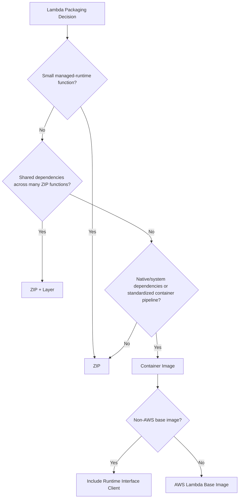
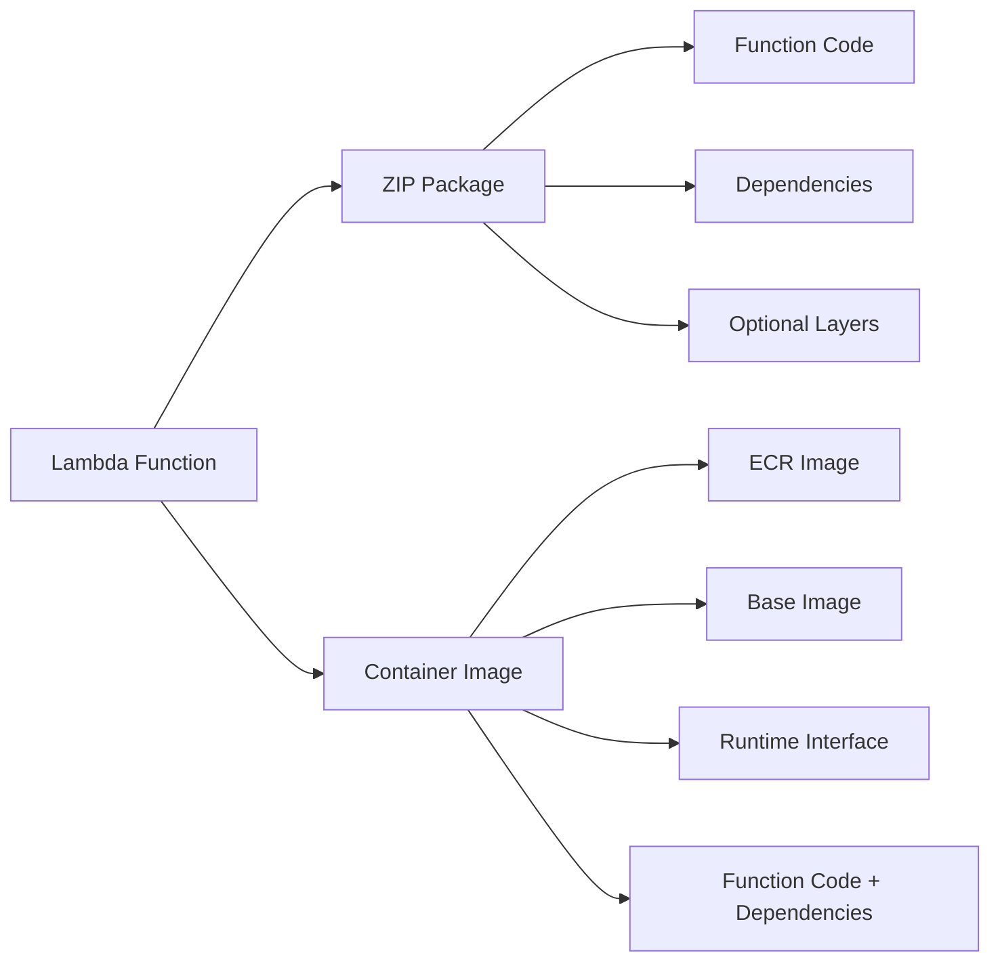
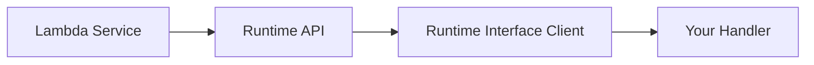
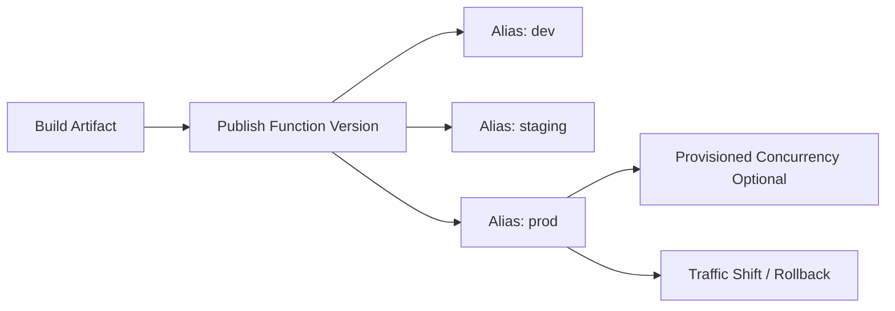
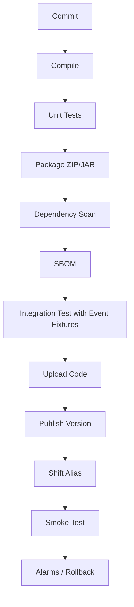
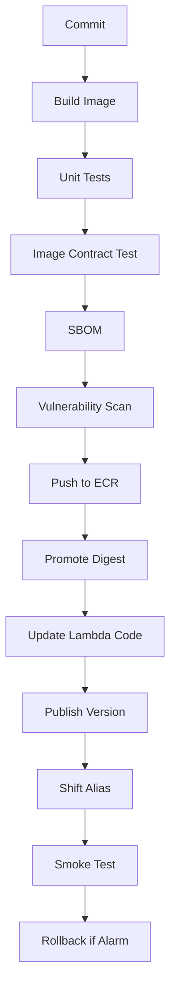

# Part 052 — Lambda Packaging Options

A Lambda deployment package is not just a file you upload.

It is the runtime artifact that defines:

- what code runs;
- which dependencies are present;
- which native libraries exist;
- which runtime bootstrap is used;
- how fast the environment initializes;
- how patching and scanning happen;
- how rollback is performed;
- how reproducible the release is.

Lambda supports two primary package types:

```txt
ZIP archive
container image
```

Layers can be added to ZIP-based functions. Custom runtimes can be delivered through ZIP/layers or images. Container images are stored in ECR and follow container supply-chain rules.

Packaging is architecture.

---

## 1. Packaging Decision Model



Use this as the default:

| Need | Prefer |
|---|---|
| simple handler, small dependency set | ZIP |
| shared runtime/dependency artifact | layer |
| native dependency/system package | container image |
| standardized container build/scanning/signing | container image |
| fastest small deploy artifact | ZIP |
| custom runtime | layer or image |
| large dependencies | container image, but still optimize |
| many functions sharing library | layer if version governance is strong |
| Java function with normal JAR | ZIP or image depending pipeline |
| Java heavy framework API with cold-start concern | ZIP/image + SnapStart/provisioned concurrency evaluation |

Do not choose container image because it “feels more professional.”

Do not choose ZIP because it “feels simpler.”

Choose the artifact that matches runtime, supply chain, size, and operational needs.

---

## 2. Lambda Package Types



### ZIP Package

A ZIP package contains:

- handler code;
- dependencies;
- optional custom runtime bootstrap;
- optional layers mounted under runtime-specific paths.

Good for:

- small functions;
- quick deployments;
- managed runtimes;
- simple CI/CD;
- Java JAR deployments;
- SAM/CDK/Terraform workflows.

### Layers

A layer is an additional ZIP archive mounted into the execution environment.

Good for:

- shared libraries;
- native dependencies;
- custom runtime components;
- certificates/config bundles;
- organization-provided utilities.

Risk:

- hidden coupling;
- version drift;
- cold-start impact;
- difficult ownership;
- functions depending on old vulnerable layer versions.

### Container Image

A container image contains:

- base OS/runtime;
- runtime interface client or AWS runtime;
- function code;
- dependencies;
- native libraries;
- entrypoint/CMD contract.

Good for:

- large dependencies;
- native/system packages;
- standardized container pipelines;
- ECR scanning/signing;
- consistent artifact promotion;
- non-standard runtime layout;
- ML/model-like artifacts within size/latency reason.

Risk:

- image bloat;
- slower cold start if poorly built;
- base image patch responsibility;
- Lambda runtime contract confusion;
- cross-architecture mistakes;
- mutable tags if not governed.

---

## 3. ZIP Packaging for Java

Java Lambda ZIP packaging usually means deploying a JAR and dependencies.

Common artifact shapes:

```txt
fat/uber JAR
thin JAR + lib directory
function ZIP with classes + libs
```

### Maven Shade Example

```xml
<plugin>
  <groupId>org.apache.maven.plugins</groupId>
  <artifactId>maven-shade-plugin</artifactId>
  <version>3.6.0</version>
  <configuration>
    <createDependencyReducedPom>false</createDependencyReducedPom>
  </configuration>
  <executions>
    <execution>
      <phase>package</phase>
      <goals>
        <goal>shade</goal>
      </goals>
    </execution>
  </executions>
</plugin>
```

### Gradle Shadow Example

```kotlin
plugins {
    id("java")
    id("com.github.johnrengelman.shadow") version "8.1.1"
}

tasks.shadowJar {
    archiveClassifier.set("")
}
```

### Java ZIP Build Rules

- minimize dependencies;
- avoid bundling unused transitive libraries;
- lock dependency versions;
- generate SBOM where possible;
- run vulnerability scan in CI;
- test handler with real event fixtures;
- validate artifact size;
- publish versioned immutable artifact;
- deploy via alias/version, not mutable ad-hoc updates.

---

## 4. ZIP Advantages and Failure Modes

### Advantages

- simple;
- first-class Lambda experience;
- fast for small artifacts;
- works well with SAM/CDK;
- integrates with Lambda versions/aliases;
- good for managed runtimes;
- no base image patch lifecycle.

### Failure Modes

| Failure | Cause |
|---|---|
| `ClassNotFoundException` | missing dependency or wrong handler name |
| `NoSuchMethodError` | dependency version conflict |
| huge cold start | dependency bloat |
| native library missing | incompatible packaging |
| architecture mismatch | native lib compiled for wrong architecture |
| deployment too large | package/layer size limit |
| layer drift | function uses old shared dependency |
| runtime deprecation | managed runtime lifecycle ignored |

ZIP is simple until dependency governance is weak.

---

## 5. Lambda Layers

A layer is a shared artifact mounted into the function execution environment.

Typical uses:

```txt
common Java library
observability extension
custom CA bundle
native binary
custom runtime
shared schema files
```

### Layer Versioning

Layers are immutable by version.

That is good.

But functions pin to a layer version. Updating the layer does not automatically update every function safely.

```txt
layer: org-common-java-utils:17
function A uses version 12
function B uses version 17
function C uses version 4
```

This can be intentional, or it can be unmanaged drift.

### Layer Governance

If you use layers, track:

- owner;
- version;
- changelog;
- compatibility;
- CVE status;
- functions using each version;
- deprecation date;
- upgrade campaign.

### When Layers Are Good

- stable shared dependency;
- small, focused, owned package;
- native library reused across many functions;
- observability extension with clear version lifecycle;
- custom runtime managed by platform team.

### When Layers Are Bad

- dumping ground for all shared code;
- business logic shared across teams;
- rapidly changing internal libraries;
- multiple layers with unclear precedence;
- hidden transitive dependencies;
- security patching without adoption visibility.

Layers reduce artifact duplication but increase governance requirements.

---

## 6. Container Images for Lambda

Lambda container images are not normal long-running containers.

They are packaging for the Lambda runtime contract.

```txt
image starts under Lambda lifecycle
handler receives events
one invocation per environment at a time
timeout applies
concurrency creates more environments
```

### Image Sources

You can build Lambda images using:

- AWS-provided base images for Lambda;
- AWS OS-only base images plus runtime interface client;
- alternative base images with runtime interface client;
- custom runtime image.

### Basic Java Lambda Image

```Dockerfile
FROM public.ecr.aws/lambda/java:21

COPY target/function.jar ${LAMBDA_TASK_ROOT}/lib/function.jar

CMD ["com.example.Handler::handleRequest"]
```

This uses the AWS Lambda Java base image, which already includes the runtime interface.

### Alternative Base Image Pattern

If using a non-AWS base image, include the Lambda Runtime Interface Client for your runtime and provide the correct entrypoint/bootstrap.

Conceptually:

```Dockerfile
FROM eclipse-temurin:21-jre

WORKDIR /var/task

COPY target/function.jar /var/task/function.jar
COPY bootstrap /var/runtime/bootstrap

ENTRYPOINT ["/var/runtime/bootstrap"]
CMD ["com.example.Handler::handleRequest"]
```

The exact bootstrap depends on runtime approach. Do not copy random Dockerfile snippets without understanding the runtime interface.

---

## 7. Lambda Container Image Is Not ECS

This is the most important packaging warning.

A Lambda image:

- does not run as a long-lived service;
- does not listen for arbitrary traffic unless runtime adapter pattern is used;
- does not keep processing after handler response;
- does not control host lifecycle;
- does not use Kubernetes/ECS health checks;
- is invoked by Lambda;
- must respect Lambda timeout/concurrency lifecycle.

Bad assumption:

```txt
“We already have a Docker image, so let’s run it on Lambda.”
```

Correct question:

```txt
“Does this image implement the Lambda runtime contract?”
```

A Spring Boot web server image built for ECS is not automatically a good Lambda image. You may adapt HTTP frameworks to Lambda, but you must evaluate cold start, lifecycle, request mapping, and timeout behavior.

---

## 8. Image Size and Layer Strategy

Container image size affects:

- build time;
- scan time;
- push/pull time;
- cold start in some scenarios;
- storage cost;
- patch surface;
- vulnerability noise;
- deployment rollback speed.

### Image Rules

- use multi-stage builds;
- copy only runtime artifacts;
- avoid build tools in runtime image;
- pin base image by digest for reproducibility;
- use minimal runtime base;
- avoid giant package managers/cache directories;
- generate SBOM;
- scan image;
- sign/provenance where required;
- avoid mutable tags in production;
- use image digest in deployment metadata.

### Java Multi-Stage Example

```Dockerfile
FROM maven:3.9-eclipse-temurin-21 AS build
WORKDIR /src
COPY pom.xml .
RUN mvn -q -DskipTests dependency:go-offline
COPY src ./src
RUN mvn -q -DskipTests package

FROM public.ecr.aws/lambda/java:21
COPY --from=build /src/target/function.jar ${LAMBDA_TASK_ROOT}/lib/function.jar
CMD ["com.example.Handler::handleRequest"]
```

This is intentionally simple.

For real systems, include:

- tests in pipeline;
- dependency vulnerability scan;
- SBOM generation;
- image scan;
- digest promotion;
- provenance/signing if required.

---

## 9. ECR Repository Design for Lambda Images

For Lambda images, ECR should follow the same artifact discipline as container workloads.

Repository options:

```txt
one repository per function
one repository per service/bounded context
shared repository for many functions
```

Default recommendation:

```txt
one repository per deployable service/function family
```

Avoid a giant `lambda-functions` repository with unclear ownership.

### Tag Strategy

Use human-readable tags for discovery:

```txt
payment-handler:git-abc1234
payment-handler:build-20260706-1415
payment-handler:release-prod-20260706
```

But deploy by digest:

```txt
123456789012.dkr.ecr.ap-southeast-1.amazonaws.com/payment-handler@sha256:...
```

Mutable tags are unsafe as release identity.

### ECR Controls

- tag immutability;
- lifecycle policy;
- vulnerability scanning;
- replication where needed;
- cross-account repository policy;
- pull permissions for Lambda service;
- promotion by digest;
- artifact evidence.

---

## 10. Package Size Limits and Quotas

Packaging choices must respect Lambda quotas.

Important practical limits include:

| Artifact | Limit |
|---|---|
| ZIP upload via API/console | limited compressed upload size |
| ZIP unzipped package including layers | bounded by Lambda quota |
| container image uncompressed size | much larger limit than ZIP |
| layers per function | limited count |
| environment variable total size | limited |
| `/tmp` ephemeral storage | configurable within Lambda-supported range |

Do not memorize only numbers. Build CI checks that fail artifacts before deployment.

Example CI checks:

```txt
ZIP compressed size <= threshold
ZIP uncompressed size <= threshold
image uncompressed size <= threshold
layer count <= allowed count
SBOM exists
scan status acceptable
handler exists
architecture matches function config
runtime config matches deployment
```

Your pipeline should catch packaging failures before Lambda does.

---

## 11. Architecture: x86_64 vs arm64

Lambda supports different instruction set architectures depending runtime/package compatibility.

Choosing architecture affects:

- performance;
- cost;
- native library compatibility;
- container image manifest;
- dependency availability;
- local build setup;
- CI runners;
- SnapStart/runtime support details depending runtime.

### Rules

- Pure Java bytecode usually ports well.
- Native dependencies must match architecture.
- Container images must include the right architecture manifest.
- Test in the same architecture as production.
- Do not switch production architecture only for cost without performance/regression tests.

### Multi-Arch Image Trap

A multi-arch tag can point to different manifests. If deployment uses mutable tag, different environments can pull different architectures over time.

Use digest and explicit architecture governance.

---

## 12. Custom Runtimes

A custom runtime is needed when:

- language/runtime is not natively supported;
- you need custom bootstrap behavior;
- you want a highly optimized runtime;
- organization standardizes runtime lifecycle.

Custom runtime responsibilities:

- implement Runtime API loop;
- read invocation event;
- call application handler;
- report success/failure;
- handle initialization errors;
- package bootstrap correctly;
- manage logs/telemetry;
- patch runtime dependencies.

A custom runtime gives control. It also transfers responsibility.

Use it deliberately.

---

## 13. Lambda Runtime Interface Client and Runtime Interface Emulator

For container images using non-AWS base images, the runtime interface client bridges your runtime with the Lambda Runtime API.

The runtime interface emulator helps local testing of Lambda images.

Mental model:



Local image test is useful for:

- verifying image boots;
- checking handler wiring;
- checking env vars;
- running event fixtures;
- catching missing dependencies.

It does not fully emulate:

- IAM;
- async retry;
- event source mapping;
- Lambda scaling;
- VPC networking;
- CloudWatch/X-Ray behavior;
- SnapStart/provisioned concurrency;
- service quotas.

Local tests are necessary but not sufficient.

---

## 14. Deployment Versions and Aliases

Package type is only half the release story.

Production Lambda should use:

- function versions;
- aliases;
- traffic shifting;
- rollback;
- immutable artifacts;
- deployment alarms.



Do not use `$LATEST` as production identity.

A production invocation should map to:

```txt
alias -> version -> immutable code artifact -> source commit -> build metadata
```

---

## 15. ZIP vs Image Release Difference

### ZIP Release

```txt
build ZIP/JAR
upload code
publish version
shift alias
```

### Image Release

```txt
build image
scan/sign/promote digest in ECR
update function code to image URI/digest
publish version
shift alias
```

Image release adds registry governance. That is powerful, but more moving parts.

### Artifact Evidence

For every release, record:

| Field | ZIP | Image |
|---|---|---|
| source commit | yes | yes |
| build ID | yes | yes |
| dependency lock | yes | yes |
| artifact checksum | yes | yes |
| SBOM | yes | yes |
| vulnerability scan | yes | yes |
| image digest | no | yes |
| ECR repo/tag | no | yes |
| Lambda version | yes | yes |
| alias traffic | yes | yes |

---

## 16. Packaging and Cold Start

Packaging affects cold start, but not always in simplistic ways.

Cold start depends on:

- runtime startup;
- code size;
- dependency graph;
- class loading;
- image/layer access;
- extension startup;
- static initialization;
- memory/CPU;
- VPC;
- SnapStart/provisioned concurrency.

### ZIP Cold Start Risks

- huge fat JAR;
- many dependencies;
- heavy reflection;
- many layers;
- slow static initializer.

### Image Cold Start Risks

- huge image;
- many layers;
- slow bootstrap;
- unnecessary OS packages;
- heavy framework startup;
- extension overhead.

### What to Measure

- `Init Duration`;
- p50/p95/p99 cold start;
- package size;
- memory used;
- classloading time if Java;
- dependency initialization time;
- first downstream call latency;
- extension overhead.

Optimize using measurements, not folklore.

---

## 17. Security and Supply Chain

Packaging is a supply-chain boundary.

Minimum controls:

- dependency lockfile;
- SBOM;
- vulnerability scanning;
- license policy if needed;
- artifact signing/provenance where required;
- base image patch process;
- runtime deprecation tracking;
- least-privilege build credentials;
- no secrets in artifact;
- no credentials baked into image;
- immutable release artifact;
- deployment approval for critical functions.

### ZIP Security

- scan dependencies;
- scan artifact;
- avoid committing secrets;
- manage layer versions;
- track runtime EOL;
- avoid shared “god layer.”

### Image Security

- scan ECR image;
- pin base image digest;
- rebuild on base CVE;
- remove package manager caches;
- run as Lambda runtime expects;
- avoid unnecessary binaries;
- sign image if policy requires;
- lifecycle old vulnerable images.

Container image does not automatically mean secure. It only gives you better places to enforce security if the pipeline actually enforces them.

---

## 18. Java Packaging Patterns

### Pattern A — Small Event Handler ZIP

Use when:

- simple event consumer;
- few dependencies;
- no native libs;
- cold start matters;
- quick deployment desired.

Shape:

```txt
function.jar
```

### Pattern B — Shared Layer for Organization Utilities

Use when:

- stable logging/metrics/tracing utility;
- shared CA bundle;
- shared custom runtime support;
- platform team owns lifecycle.

Shape:

```txt
function.zip + org-platform-utils-layer:vN
```

Be careful with version drift.

### Pattern C — Lambda Container Image for Native/Standardized Build

Use when:

- dependency includes native binaries;
- organization has standard container pipeline;
- artifact needs ECR scanning/signing;
- image is not huge or is justified.

Shape:

```txt
ECR image digest -> Lambda function version
```

### Pattern D — Java API with Cold-Start Mitigation

Use when:

- synchronous API;
- framework startup high;
- latency SLO strict.

Options:

```txt
ZIP or image
+ SnapStart if supported/applicable
+ provisioned concurrency if needed
+ dependency trimming
+ memory tuning
```

Do not treat packaging alone as cold-start solution.

---

## 19. CI/CD Pipeline for ZIP



Pipeline checks:

```bash
mvn test
mvn package
du -h target/function.jar
java -jar tools/handler-contract-test.jar target/function.jar events/order-created.json
```

Deployment should fail if:

- handler missing;
- package too large;
- dependency scan exceeds threshold;
- tests fail;
- SBOM missing;
- artifact not reproducible;
- alias shift alarm triggers.

---

## 20. CI/CD Pipeline for Image



Example build flow:

```bash
docker buildx build \
  --platform linux/arm64 \
  -t "$REPO_URI:git-$GIT_SHA" \
  --load .

docker run --rm "$REPO_URI:git-$GIT_SHA" --help || true

docker push "$REPO_URI:git-$GIT_SHA"

DIGEST=$(aws ecr describe-images \
  --repository-name payment-handler \
  --image-ids imageTag=git-$GIT_SHA \
  --query 'imageDetails[0].imageDigest' \
  --output text)
```

Deploy by digest, not mutable tag:

```bash
aws lambda update-function-code \
  --function-name payment-handler \
  --image-uri "$REPO_URI@$DIGEST"
```

---

## 21. Local Testing Packaging Artifacts

Local tests should verify:

- handler can be loaded;
- dependencies exist;
- event fixture deserializes;
- environment variables validated;
- errors classified;
- no business side effects during init;
- image bootstrap works;
- `/tmp` path works;
- architecture assumptions correct.

For image-based Lambda, use runtime interface emulator where appropriate.

But always remember:

```txt
local artifact boot != production invocation correctness
```

You still need deployed integration tests.

---

## 22. Deployment Rollback

### ZIP Rollback

Rollback alias to previous version:

```txt
prod alias -> previous function version
```

### Image Rollback

Rollback alias or update function to previous version that references previous image digest.

The digest must still exist in ECR.

Therefore ECR lifecycle policy must not delete images still referenced by Lambda versions or rollback windows.

### Rollback Metadata

Keep:

```txt
version
alias
artifact checksum
image digest
commit
build ID
deployment time
operator/pipeline
reason
```

Without metadata, rollback becomes archaeology.

---

## 23. Runtime Deprecation and Patch Management

Packaging does not remove runtime lifecycle responsibility.

For managed runtimes:

- track AWS runtime support;
- test runtime upgrades;
- avoid last-minute deprecation panic;
- publish new versions after runtime update;
- validate dependencies against new runtime.

For container images:

- track base image updates;
- rebuild regularly;
- scan continuously;
- patch OS packages through rebuild;
- do not assume old image is safe because function code did not change.

### Patch Rule

```txt
If base runtime changes, rebuild and redeploy even if application code is unchanged.
```

Security patching is a release flow.

---

## 24. Packaging Anti-Patterns

### Anti-Pattern 1 — Giant Shared Layer

One layer contains everything:

```txt
logging
database driver
business SDK
AWS SDK
framework
schemas
native libs
```

Result:

- all functions coupled;
- patching risky;
- cold start worse;
- dependency conflicts;
- ownership unclear.

### Anti-Pattern 2 — Mutable `latest` Image Tag

Production function points to:

```txt
payment-handler:latest
```

Bad because the tag can move.

Use digest.

### Anti-Pattern 3 — Container Image with Build Tools

Runtime image includes:

```txt
maven
gradle
gcc
curl
package caches
test files
source code
```

Bigger attack surface and slower artifact.

### Anti-Pattern 4 — Packaging Secrets

Never bake credentials into ZIP, layer, or image.

### Anti-Pattern 5 — One Package for Many Unrelated Handlers

Creates:

- broad permissions;
- large artifact;
- unrelated deployment coupling;
- cold start bloat;
- confusing ownership.

### Anti-Pattern 6 — Layer Version Drift Ignored

Old vulnerable layer versions remain attached to functions for months.

### Anti-Pattern 7 — Local Test Only

Artifact runs locally, but deployed function fails due to IAM, event shape, runtime settings, architecture, or VPC.

---

## 25. Packaging Design Review Checklist

### Artifact

- [ ] ZIP/image/layer choice justified.
- [ ] Artifact size measured.
- [ ] Dependencies locked.
- [ ] SBOM generated.
- [ ] Vulnerability scan passed or waiver recorded.
- [ ] No secrets in artifact.
- [ ] Handler/entrypoint verified.
- [ ] Architecture matches Lambda config.
- [ ] Runtime version explicit.

### ZIP

- [ ] Dependency conflicts checked.
- [ ] Package within quota.
- [ ] Layers minimized.
- [ ] Layer versions owned and tracked.
- [ ] Runtime deprecation tracked.

### Image

- [ ] Base image pinned/owned.
- [ ] Multi-stage build used.
- [ ] Runtime image minimal.
- [ ] ECR scanning enabled.
- [ ] Image digest used for deployment.
- [ ] Lifecycle policy preserves rollback window.
- [ ] Runtime interface correctly configured.
- [ ] Image architecture tested.

### Release

- [ ] Function version published.
- [ ] Alias used for environment.
- [ ] Traffic shift/rollback exists.
- [ ] Release metadata stored.
- [ ] Smoke test executed.
- [ ] Alarm rollback configured for critical functions.

### Operations

- [ ] Cold start measured.
- [ ] Init duration tracked.
- [ ] Artifact patch process defined.
- [ ] Owner known.
- [ ] Runbook includes package failure modes.

---

## 26. Final Mental Model

Lambda packaging is not a mechanical afterthought.

It defines the deployable unit, the dependency boundary, the patch boundary, the scan boundary, and often the cold-start boundary.

The production question is not:

> “Can Lambda run this package?”

The production question is:

> “Can this artifact be built reproducibly, scanned, promoted, rolled back, patched, observed, and kept inside Lambda’s runtime contract?”

ZIP is excellent when simplicity and small size dominate.

Layers are useful when shared artifact governance is strong.

Container images are powerful when native dependencies, standardized supply chain, or ECR governance matter.

The top-tier engineer does not argue ZIP vs image as ideology.

They choose the artifact that makes the runtime contract safer.

---

## References

- AWS Lambda Developer Guide: deploying Lambda functions as ZIP archives
- AWS Lambda Developer Guide: creating Lambda functions using container images
- AWS Lambda Developer Guide: managing dependencies with Lambda layers
- AWS Lambda Developer Guide: Lambda quotas
- AWS Lambda Developer Guide: runtime interface clients and container image requirements
- Amazon ECR documentation for image scanning, lifecycle policies, and tag immutability
