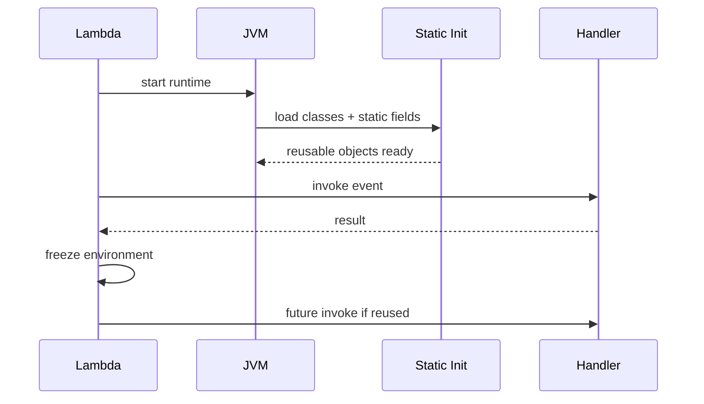
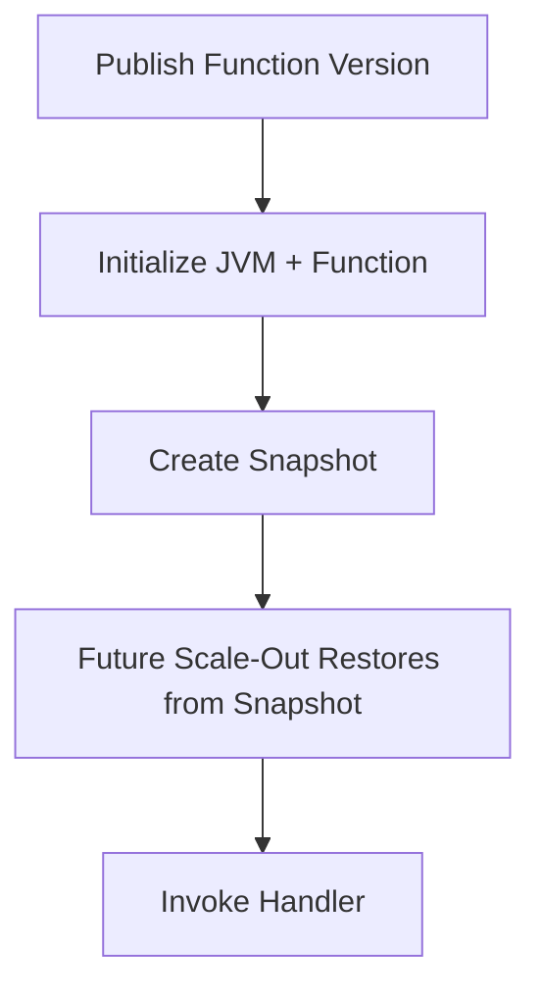

# Part 053 — Java on Lambda

Java on Lambda is often misunderstood.

Some engineers dismiss it:

> “Java is too slow for Lambda.”

Some engineers overcorrect:

> “SnapStart solves Java cold starts, so we can run anything.”

Both views are weak.

A better view:

> Java on Lambda is excellent when the function boundary is explicit, dependencies are controlled, initialization is understood, concurrency is bounded, and side effects are idempotent.

Java gives you:

- strong typing;
- mature ecosystem;
- excellent AWS SDK support;
- good runtime performance after warmup;
- strong tooling;
- testability;
- familiar enterprise integration patterns;
- framework options;
- SnapStart support for reducing cold-start latency on supported runtimes.

Java also brings risks:

- classpath bloat;
- reflection-heavy frameworks;
- long static initialization;
- large packages;
- memory headroom mistakes;
- connection pool multiplication;
- stale state after execution environment reuse;
- SnapStart restore-safety issues;
- framework abstractions that hide handler lifecycle.

Java on Lambda is not bad.

Undisciplined Java on Lambda is bad.

---

## 1. Mental Model: JVM Inside a Disposable Sandbox

A Java Lambda function runs inside the Lambda execution environment.

```mermaid
flowchart TD
    A[Lambda Execution Environment] --> B[JVM Runtime]
    B --> C[Static Initialization]
    B --> D[Handler Object]
    D --> E[Invocation]
    E --> F[Side Effects]
    B --> G[Global JVM State]
    B --> H[/tmp Cache]
    B --> I[SDK / HTTP / DB Clients]
```

The JVM may process multiple invocations over the lifetime of one execution environment.

But the environment can disappear at any time.

So:

```txt
initialize expensive reusable resources outside handler
but keep correctness outside process memory
```

This is the core rule.

---

## 2. Java Lambda Lifecycle

The lifecycle is:

```txt
Init -> Invoke -> Freeze -> Thaw/Reinvoke -> Shutdown/Reset
```

For Java, Init often includes:

- JVM startup;
- class loading;
- static field initialization;
- dependency injection container startup;
- JSON serializer construction;
- AWS SDK client creation;
- HTTP client construction;
- configuration validation;
- logging/tracing setup.



The performance question is not only:

```txt
how long does handler code run?
```

It is:

```txt
how much work happens before the handler is ready?
```

---

## 3. Java Handler Shapes

There are three common Java handler styles.

### 3.1 AWS Lambda Java Interfaces

Example:

```java
public final class OrderHandler implements RequestHandler<OrderCreatedEvent, HandlerResult> {
    private static final ObjectMapper MAPPER = new ObjectMapper();
    private static final DynamoDbClient DDB = DynamoDbClient.builder().build();

    private final OrderService service = new OrderService(DDB, MAPPER);

    @Override
    public HandlerResult handleRequest(OrderCreatedEvent event, Context context) {
        return service.handle(event, context);
    }
}
```

Good for:

- direct event handlers;
- SQS/EventBridge/Step Functions tasks;
- simple APIs;
- predictable dependencies.

### 3.2 Stream Handler

```java
public final class RawHandler implements RequestStreamHandler {
    private static final ObjectMapper MAPPER = new ObjectMapper();

    @Override
    public void handleRequest(InputStream input, OutputStream output, Context context) throws IOException {
        Event event = MAPPER.readValue(input, Event.class);
        Result result = process(event, context);
        MAPPER.writeValue(output, result);
    }
}
```

Good for:

- custom serialization;
- lower-level control;
- avoiding some reflection or generic mapping issues.

### 3.3 Framework Adapter

Examples:

- Spring Cloud Function;
- Quarkus;
- Micronaut;
- custom API Gateway adapter.

Good when:

- team benefits from framework model;
- routing/DI/config patterns are valuable;
- cold start is acceptable or mitigated;
- package is controlled.

Risk:

- heavy classpath;
- slow bootstrap;
- hidden reflection;
- DI lifecycle surprises;
- harder handler-level failure semantics.

A framework is not disallowed. It must earn its cost.

---

## 4. Static Initialization: Good and Bad

Static initialization is a performance lever.

Good:

```java
private static final ObjectMapper MAPPER = new ObjectMapper();

private static final SqsClient SQS = SqsClient.builder()
        .httpClientBuilder(AwsCrtAsyncHttpClient.builder())
        .build();

private static final Pattern ORDER_ID = Pattern.compile("^ord_[a-zA-Z0-9]+$");
```

Bad:

```java
static {
    runDatabaseMigration();
    callPaymentProviderHealthCheck();
    loadAllCustomersIntoMemory();
    startBackgroundScheduler();
}
```

### Good Init Work

| Init Work | Why Good |
|---|---|
| AWS SDK client creation | reusable, reduces per-invoke latency |
| JSON mapper construction | reusable and usually safe |
| immutable config parse | fail fast on deployment config errors |
| static regex/schema load | avoids repeated compilation |
| logger/tracer setup | reusable instrumentation |
| small cache with TTL | performance improvement if validated |

### Dangerous Init Work

| Init Work | Why Dangerous |
|---|---|
| database migration | side effect during environment creation |
| external API validation | cold start depends on dependency health |
| fetching short-lived token without refresh | stale credential risk |
| generating unique ID under SnapStart | uniqueness bug after restore |
| loading tenant-specific mutable state | data leakage/staleness risk |
| starting background queue | freeze/thaw breaks assumptions |

Rule:

```txt
Init prepares the function. Invoke performs the business operation.
```

---

## 5. Dependency Minimization

Java cold start often correlates with dependency graph size and initialization behavior.

Do not ship the whole enterprise platform into a 50-line handler.

### Dependency Review Questions

- Is this library used in the handler path?
- Is it needed at runtime or only test/build time?
- Does it use reflection/classpath scanning?
- Does it initialize network clients?
- Does it pull in large transitive dependencies?
- Does it include unused logging implementations?
- Does it include multiple HTTP clients?
- Does it include native binaries?
- Does it conflict with another dependency?

### Maven Dependency Inspection

```bash
mvn dependency:tree
mvn dependency:analyze
```

### Gradle Dependency Inspection

```bash
./gradlew dependencies
./gradlew dependencyInsight --dependency netty
```

### Common Java Lambda Bloat Sources

| Source | Why It Hurts |
|---|---|
| full Spring Boot stack for tiny handler | classpath scanning and initialization |
| multiple JSON libraries | size/conflict |
| multiple HTTP clients | startup and footprint |
| unused AWS SDK service modules | package size |
| logging bridge loops | runtime surprises |
| test dependencies in runtime artifact | unnecessary size |
| broad internal platform libraries | hidden transitive dependencies |
| ORM for simple key-value operation | heavy initialization |

Minimal does not mean primitive. It means intentional.

---

## 6. AWS SDK for Java on Lambda

The AWS SDK client should usually be initialized outside the handler.

Good:

```java
private static final DynamoDbClient DDB = DynamoDbClient.builder()
        .region(Region.AP_SOUTHEAST_1)
        .build();
```

Avoid per-invocation client creation:

```java
public void handle(Event event) {
    DynamoDbClient ddb = DynamoDbClient.builder().build(); // avoid
}
```

Per-invocation client creation can add latency and resource churn.

### SDK Startup Optimization

For startup-sensitive functions:

- initialize SDK clients outside handler;
- configure region explicitly;
- configure credentials path deliberately;
- avoid unused HTTP client dependencies;
- consider CRT-based HTTP client where appropriate;
- avoid dependency injection work that delays first use unpredictably;
- measure before and after.

### Client Reuse Rule

```txt
Reusable clients are safe if they do not store request-specific state.
```

Good:

- `DynamoDbClient`;
- `SqsClient`;
- `S3Client`;
- `EventBridgeClient`;
- shared HTTP client.

Bad:

- client wrapper storing current tenant;
- mutable singleton containing current request;
- static auth context.

---

## 7. HTTP Clients and Timeouts

Default HTTP timeout behavior is often not production-safe.

Every downstream call needs:

- connection timeout;
- read/request timeout;
- retry policy;
- max connections;
- circuit/bulkhead if needed;
- telemetry.

Example with Java `HttpClient`:

```java
private static final HttpClient HTTP = HttpClient.newBuilder()
        .connectTimeout(Duration.ofMillis(500))
        .build();

public HttpResponse<String> call(URI uri, String body) throws Exception {
    HttpRequest request = HttpRequest.newBuilder(uri)
            .timeout(Duration.ofSeconds(2))
            .POST(HttpRequest.BodyPublishers.ofString(body))
            .build();

    return HTTP.send(request, HttpResponse.BodyHandlers.ofString());
}
```

Timeout design must respect Lambda remaining time.

```java
int remainingMs = context.getRemainingTimeInMillis();

if (remainingMs < 3_000) {
    throw new RetryableException("not enough time for downstream call");
}
```

The goal is to avoid starting a risky side effect with no time to record outcome.

---

## 8. Database Connections

Java database pools are dangerous in Lambda when used casually.

A pool per execution environment multiplied by concurrency can overwhelm the database.

```txt
reserved concurrency = 100
Hikari maxPoolSize = 10
potential DB connections = 1000
```

That is rarely acceptable.

### Direct DB Pattern

For low to moderate concurrency:

```txt
reserved concurrency = bounded
pool size = 1..2
short connection timeout
short query timeout
idempotent transaction
RDS Proxy considered
```

Example Hikari shape:

```java
HikariConfig config = new HikariConfig();
config.setMaximumPoolSize(2);
config.setMinimumIdle(0);
config.setConnectionTimeout(500);
config.setValidationTimeout(300);
config.setIdleTimeout(30_000);
config.setMaxLifetime(120_000);
```

### When to Use RDS Proxy

Use RDS Proxy when:

- many Lambda environments make frequent short DB connections;
- connection storms happen during bursts;
- database connection capacity is scarce;
- failover behavior needs improvement;
- credentials rotation should be abstracted.

RDS Proxy does not remove the need for:

- reserved concurrency;
- transaction discipline;
- query timeouts;
- idempotency;
- database capacity planning.

### Safer Alternatives

Depending on workload:

- SQS buffer before DB write;
- DynamoDB conditional writes;
- Step Functions for controlled workflow;
- ECS/EKS service for connection-heavy sustained workloads;
- write-behind outbox pattern;
- batch writes.

Lambda can talk to relational databases. It just cannot pretend database connections are infinite.

---

## 9. JVM Memory and Lambda Memory

Lambda memory setting controls the memory available to the function and also influences CPU allocation.

For Java, memory design must leave room for:

- Java heap;
- metaspace;
- code cache;
- thread stacks;
- direct buffers;
- TLS/native memory;
- AWS SDK buffers;
- framework overhead;
- Lambda runtime;
- extensions;
- `/tmp` file processing memory.

Bad:

```txt
Lambda memory = 512 MB
JVM heap = almost 512 MB
```

Better:

```txt
heap target = 60-75% of function memory
native/runtime/extension headroom = remaining
```

Example:

```txt
JAVA_TOOL_OPTIONS=-XX:MaxRAMPercentage=70 -XX:+ExitOnOutOfMemoryError
```

If using SnapStart or provisioned concurrency, measure memory after init and after representative invokes.

### Memory Failure Signals

| Signal | Meaning |
|---|---|
| `OutOfMemoryError` in logs | JVM heap/metaspace/native allocation failure |
| Lambda `Runtime exited with error` | runtime crash path |
| max memory used near configured memory | little headroom |
| duration increases before failure | GC pressure |
| sudden reset after large batch | memory spike |
| high init memory | framework/dependency/static cache bloat |

---

## 10. GC and CPU Tuning

Most Java Lambda functions do not need exotic GC tuning.

Start with:

- correct memory size;
- dependency minimization;
- bounded batch size;
- avoiding huge object allocations;
- reusing serializers/clients;
- limiting framework overhead.

Then measure.

### Practical JVM Flags

```txt
-XX:MaxRAMPercentage=70
-XX:+ExitOnOutOfMemoryError
```

Optionally for diagnostics in non-prod:

```txt
-Xlog:gc
```

But do not enable noisy GC logging in production blindly. It can increase log cost and reduce signal-to-noise.

### CPU Relationship

Increasing Lambda memory can improve CPU allocation and reduce duration.

This may reduce cost if the function finishes faster enough.

Measure with representative traffic:

```txt
128 MB -> slow, maybe cheaper? maybe not
512 MB -> faster
1024 MB -> much faster
2048 MB -> no meaningful improvement
```

Use load tests and power-tuning-style experiments, not guesswork.

---

## 11. SnapStart for Java

SnapStart is one of the most important Java Lambda features.

Conceptually:



Instead of initializing from scratch for each new execution environment, Lambda can resume from a previously initialized snapshot for supported functions.

This can significantly reduce Java cold-start latency.

But SnapStart changes lifecycle safety.

### SnapStart Is Good For

- Java synchronous APIs with cold-start sensitivity;
- heavy class loading;
- dependency injection initialization;
- expensive but deterministic startup;
- functions where provisioned concurrency cost is not desired;
- event handlers that benefit from faster scale-out.

### SnapStart Requires Care For

- uniqueness;
- randomness;
- time-sensitive values;
- credentials/tokens;
- open network connections;
- caches;
- ephemeral state;
- background threads;
- after-restore validation;
- runtime hooks.

### Snapshot Safety Rule

```txt
Anything captured in the snapshot must either remain valid after restore or be refreshed after restore.
```

---

## 12. SnapStart Runtime Hooks

Java SnapStart supports runtime hooks through the CRaC model.

The two conceptual hook points:

```txt
before checkpoint/snapshot
after restore
```

Use before-snapshot hook for:

- priming class loading;
- warming serializers;
- loading static config that is safe to snapshot;
- preparing immutable data.

Use after-restore hook for:

- refreshing credentials/tokens;
- recreating stale network connections;
- regenerating unique values;
- validating config freshness;
- reseeding random if needed;
- clearing unsafe state.

### Example Shape

```java
public final class SnapStartResource implements org.crac.Resource {

    @Override
    public void beforeCheckpoint(org.crac.Context<? extends org.crac.Resource> context) {
        // Prime safe initialization.
        Json.prime();
        SchemaRegistry.loadSafeSchemas();
    }

    @Override
    public void afterRestore(org.crac.Context<? extends org.crac.Resource> context) {
        // Refresh restore-sensitive state.
        TokenCache.clear();
        HttpClients.recreateIfNeeded();
        UniqueRuntimeId.regenerate();
    }
}
```

Exact implementation depends on libraries and runtime support.

The principle matters more than the snippet:

```txt
snapshot-safe state before checkpoint
restore-sensitive state after restore
```

---

## 13. SnapStart Uniqueness Hazards

Bad pattern:

```java
private static final String INSTANCE_ID = UUID.randomUUID().toString();
```

With snapshot/restore, the same initialized value may be restored into multiple execution environments unless refreshed.

Potential hazards:

- unique IDs;
- random seeds;
- nonce/correlation source;
- temporary file names;
- cryptographic state;
- connection/session IDs;
- token state;
- leader election state;
- time captured during snapshot.

Better:

```java
public final class RuntimeIdentity {
    private static volatile String runtimeId;

    public static String getRuntimeId() {
        String id = runtimeId;
        if (id == null) {
            synchronized (RuntimeIdentity.class) {
                if (runtimeId == null) {
                    runtimeId = UUID.randomUUID().toString();
                }
                return runtimeId;
            }
        }
        return id;
    }

    public static void refreshAfterRestore() {
        runtimeId = UUID.randomUUID().toString();
    }
}
```

For business idempotency, do not rely on runtime-generated randomness. Use stable business keys.

---

## 14. SnapStart vs Provisioned Concurrency

These are different tools.

| Feature | Purpose |
|---|---|
| SnapStart | reduce cold start by restoring initialized snapshot |
| Provisioned Concurrency | keep N environments initialized and ready |
| Reserved Concurrency | cap/reserve max concurrent executions |

### Choose SnapStart When

- Java cold start is the main problem;
- traffic is bursty/unpredictable;
- provisioned always-on capacity is too expensive;
- function is compatible with snapshot/restore safety.

### Choose Provisioned Concurrency When

- latency SLO is strict;
- traffic pattern is predictable;
- you need pre-warmed capacity for known periods;
- SnapStart is unsupported/incompatible/insufficient;
- you need consistent low latency under steady load.

### Use Both?

In some situations, features may have restrictions or different compatibility details depending runtime and configuration. Always verify current Lambda runtime support and test. Do not assume all concurrency/cold-start features combine freely for every runtime.

Design by measurement.

---

## 15. Framework Choices

Java Lambda can be implemented with:

- plain AWS Lambda Java handler;
- Dagger/Guice/manual DI;
- Spring Cloud Function;
- Micronaut;
- Quarkus;
- custom minimal framework;
- AWS Lambda Web Adapter style for HTTP workloads.

### Plain Handler

Good for:

- event handlers;
- workers;
- narrow functions;
- low dependency count;
- explicit lifecycle.

Weakness:

- more manual wiring;
- less framework convenience.

### Spring

Good for:

- teams already standardized on Spring;
- complex configuration;
- shared domain/service libraries;
- APIs that benefit from Spring ecosystem.

Risk:

- cold start;
- large classpath;
- framework abstraction hiding Lambda semantics.

Mitigation:

- SnapStart;
- dependency trimming;
- functional bean registration where useful;
- avoid loading unnecessary modules;
- measure init duration;
- use provisioned concurrency for strict sync latency if needed.

### Micronaut/Quarkus

Good for:

- reduced reflection/runtime overhead compared with traditional heavyweight setup;
- compile-time DI patterns;
- smaller native or JVM footprint depending mode.

Risk:

- ecosystem differences;
- build complexity;
- native image trade-offs if used;
- operational familiarity.

### Decision Rule

Ask:

```txt
Would this function still be understandable if the framework adapter failed?
```

If no, the framework may be hiding too much.

---

## 16. Java Packaging for Lambda

Java Lambda can be packaged as:

- ZIP/JAR;
- ZIP + layer;
- container image.

### ZIP/JAR

Good for:

- small to moderate handlers;
- managed runtime;
- fast deployment;
- simpler lifecycle.

### Layer

Good for:

- stable shared platform utility;
- observability extension;
- native dependency reused by many functions.

Risk:

- layer drift;
- old vulnerable versions;
- hidden dependencies.

### Container Image

Good for:

- native dependencies;
- standardized container supply chain;
- larger artifacts;
- ECR scanning/signing/digest promotion;
- custom runtime layout.

Risk:

- image bloat;
- base image patching;
- confusing Lambda image with ECS service image.

### Java Artifact Rule

Whatever the package type:

```txt
artifact must be reproducible, scanned, versioned, measured, and rollbackable
```

---

## 17. Batch Size and Java Memory

For SQS/Kinesis/DynamoDB Streams, batch size directly affects Java memory and failure blast radius.

Larger batch:

- fewer invokes;
- better throughput;
- more memory usage;
- longer duration;
- larger retry unit;
- more partial failure complexity.

Smaller batch:

- lower memory;
- lower per-invoke work;
- more Lambda invocations;
- more overhead;
- potentially higher cost.

### Java Batch Rule

For each batch source, measure:

```txt
batch_size × average_record_size × deserialization_expansion
```

JSON object expansion in memory can be much larger than payload size.

A 256 KB message is not a 256 KB Java object graph.

### SQS Handler Pattern

```java
for (SQSEvent.SQSMessage message : event.getRecords()) {
    try {
        processOne(message, context);
    } catch (RetryableException e) {
        failures.add(new BatchItemFailure(message.getMessageId()));
    } catch (PermanentException e) {
        quarantine(message, e);
    }
}
```

Do not deserialize the entire batch into huge intermediate structures if streaming per record is enough.

---

## 18. Observability for Java Lambda

Minimum telemetry:

- cold start marker;
- init duration;
- restore duration if SnapStart;
- handler duration;
- remaining time;
- memory used;
- batch size;
- error classification;
- idempotency status;
- downstream call duration;
- DB connection acquisition time;
- GC signal if needed;
- framework startup timing;
- dependency/config load time.

### Structured Log Example

```json
{
  "service": "case-transition-handler",
  "runtime": "java21",
  "cold_start": false,
  "snapstart_restored": true,
  "operation": "EscalateCase",
  "event_id": "evt-123",
  "case_id": "case-456",
  "idempotency_status": "CLAIMED",
  "duration_ms": 183,
  "remaining_ms": 28110,
  "outcome": "SUCCESS"
}
```

### Java Startup Timers

Add simple timers around expensive init:

```java
public final class Bootstrap {
    static final long started = System.nanoTime();

    static final ObjectMapper mapper = timed("object_mapper", ObjectMapper::new);
    static final DynamoDbClient ddb = timed("ddb_client", () -> DynamoDbClient.builder().build());

    private static <T> T timed(String name, Supplier<T> supplier) {
        long s = System.nanoTime();
        T value = supplier.get();
        long ms = TimeUnit.NANOSECONDS.toMillis(System.nanoTime() - s);
        LoggerFactory.getLogger(Bootstrap.class).info("init_component={} duration_ms={}", name, ms);
        return value;
    }
}
```

Do not over-instrument every line, but know where Init time goes.

---

## 19. Java Lambda Testing Strategy

### Unit Tests

- handler input validation;
- idempotency key extraction;
- service logic;
- error classification;
- timeout budget decisions.

### Contract Tests

- real EventBridge event shape;
- SQS event shape;
- API Gateway proxy event;
- Step Functions input/output;
- schema version compatibility.

### Lifecycle Tests

- cold start behavior;
- warm reuse;
- stale connection recovery;
- config cache TTL;
- SnapStart after-restore hook behavior if used;
- duplicate event handling;
- concurrent duplicate key handling.

### Deployed Tests

- IAM permissions;
- VPC path;
- real AWS SDK calls;
- DLQ/destination behavior;
- throttling behavior;
- alias/version deployment;
- provisioned concurrency/SnapStart metrics.

Local tests cannot prove Lambda lifecycle. They only reduce obvious mistakes.

---

## 20. Java Lambda Failure Modes

| Symptom | Likely Cause | Fix Direction |
|---|---|---|
| high cold start | dependency/framework/static init bloat | trim, SnapStart, PC, measure init |
| `ClassNotFoundException` | packaging/handler misconfigured | fix artifact build |
| `NoSuchMethodError` | dependency conflict | dependency lock/tree review |
| OOM | heap too large, batch too big, leak | memory tuning, batch reduce |
| slow warm invoke | downstream/client/GC | instrument dependencies |
| DB exhaustion | pool × concurrency too high | reserved concurrency, RDS Proxy, pool reduce |
| duplicate side effect | no idempotency | conditional write/dedupe |
| stale token | cached forever or SnapStart restore | TTL/after-restore refresh |
| same UUID across restored envs | uniqueness captured in snapshot | regenerate after restore |
| timeout after side effect | no remaining-time guard | safe cutoff and idempotency |
| huge log cost | verbose framework logs | structured log policy |

---

## 21. Java Lambda Design Checklist

### Runtime

- [ ] Runtime version chosen deliberately.
- [ ] Architecture x86/arm64 tested.
- [ ] Memory size measured.
- [ ] JVM heap percentage configured if needed.
- [ ] Init duration measured.
- [ ] Cold start and warm p95 measured.
- [ ] SnapStart/provisioned concurrency evaluated for sync latency.

### Code

- [ ] SDK clients initialized outside handler.
- [ ] HTTP clients have timeouts.
- [ ] DB pool size bounded.
- [ ] No request-specific static mutable state.
- [ ] No business side effects during static init.
- [ ] Config/secrets cached with TTL.
- [ ] Idempotency implemented for side effects.
- [ ] Remaining-time guard before risky operations.

### Dependencies

- [ ] Dependency tree reviewed.
- [ ] Runtime artifact excludes test/build dependencies.
- [ ] Unused SDK modules removed.
- [ ] Framework startup justified.
- [ ] SBOM and scan produced.

### SnapStart

- [ ] Snapshot-safe state reviewed.
- [ ] Unique values regenerated after restore.
- [ ] Tokens/connections refreshed after restore.
- [ ] Runtime hooks tested.
- [ ] Restore duration monitored.

### Operations

- [ ] Structured logs include cold start and outcome.
- [ ] Error taxonomy defined.
- [ ] DLQ/destination alarms.
- [ ] Concurrency and throttles monitored.
- [ ] DB connection pressure monitored.
- [ ] Rollback path tested.

---

## 22. Final Mental Model

Java on Lambda is a trade:

```txt
strong language/runtime ecosystem
in exchange for disciplined startup, dependency, memory, and lifecycle design
```

The best Java Lambda functions are not necessarily the smallest functions.

They are the ones with:

- explicit handler boundary;
- controlled dependencies;
- measured initialization;
- reusable safe clients;
- bounded database connections;
- idempotent side effects;
- lifecycle-aware caching;
- cold-start strategy;
- clear observability;
- tested rollback.

Do not ask:

> “Is Java good for Lambda?”

Ask:

> “Does this Java workload respect Lambda’s execution lifecycle and concurrency model?”

When the answer is yes, Java Lambda can be a serious production tool.

---

## References

- AWS Lambda Developer Guide: Java handler guidance
- AWS Lambda Developer Guide: execution environment lifecycle
- AWS Lambda Developer Guide: SnapStart and SnapStart runtime hooks for Java
- AWS Lambda Developer Guide: SnapStart uniqueness guidance
- AWS SDK for Java documentation: reducing startup time for Lambda
- AWS Lambda Developer Guide: using Lambda with Amazon RDS and RDS Proxy guidance
